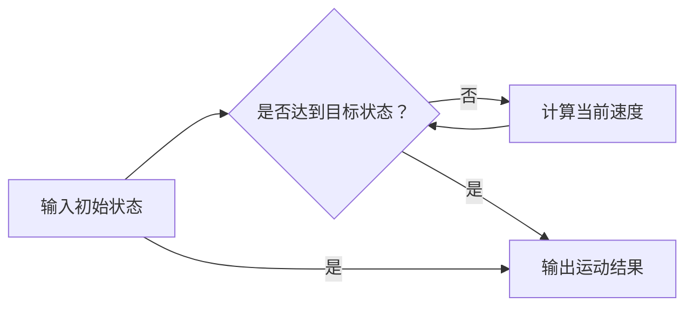
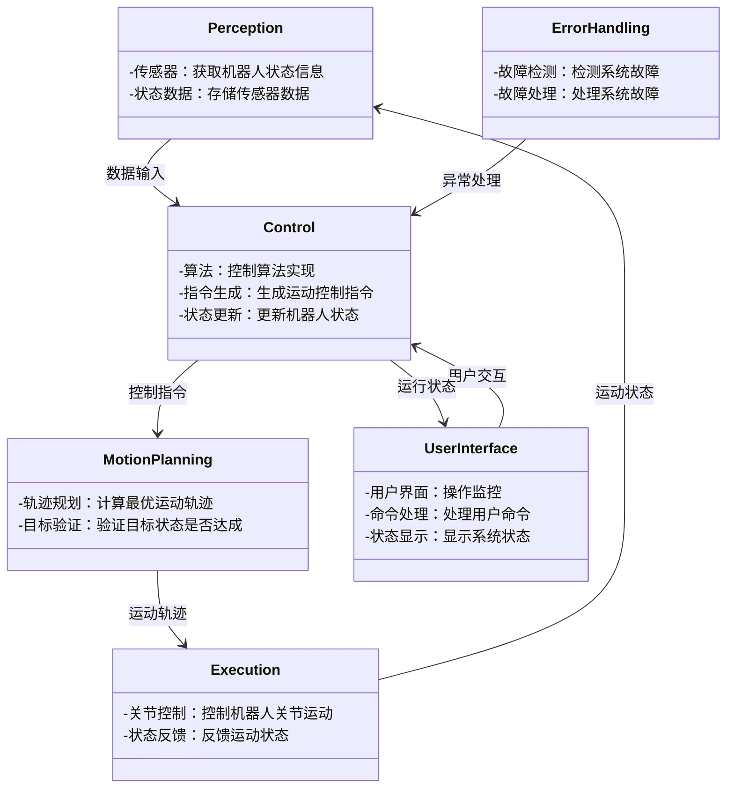
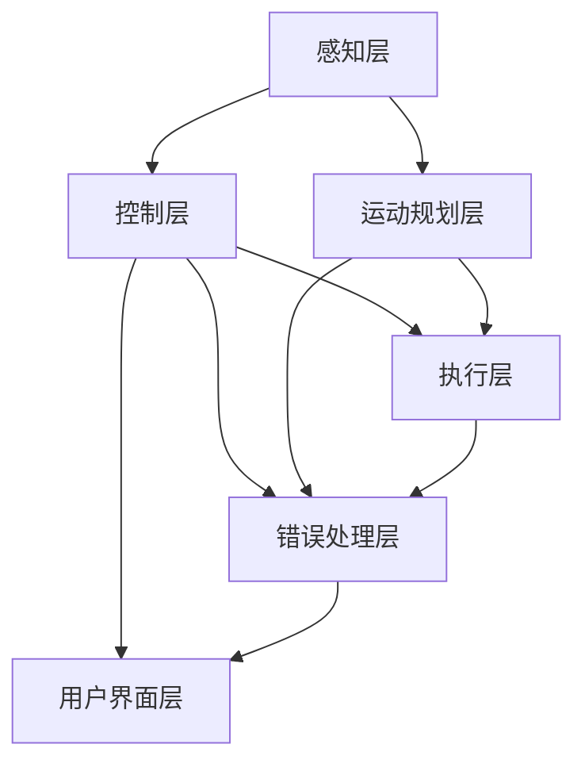

                 

### 引言

在人工智能与机器人技术的快速发展的今天，机器人的运动控制与动作规划成为了研究的热点领域。机器人运动学作为机器人学的核心组成部分，它研究的是机器人如何从一个位置移动到另一个位置，以及如何通过关节运动实现预定的动作轨迹。数学与机器人运动学的结合，不仅为机器人的动作提供了理论基础，也为实际应用中的动作规划和控制提供了精确的工具。

本文将以《数学与机器人运动学：机器人动作的数学描述》为标题，通过系统的分析与深入的探讨，全面介绍机器人运动学的数学描述方法。文章将从数学模型、算法原理、系统设计与实际应用等多个方面进行阐述，旨在为读者提供一个全面、深入、易懂的机器人运动学知识体系。

本文将分为以下几个部分：

1. **背景介绍**：介绍机器人运动学的研究背景、重要性及其在现实中的应用。
2. **核心概念与联系**：阐述机器人运动学中的核心概念，包括数学模型、公式及其关系，并通过表格和ER实体关系图进行对比和分析。
3. **算法原理讲解**：通过mermaid流程图和Python源代码，详细讲解机器人运动学算法的原理。
4. **系统分析与架构设计方案**：介绍机器人运动学在系统设计和架构中的应用，包括问题场景、项目介绍、功能设计、架构设计、接口设计以及交互流程。
5. **项目实战**：通过具体的案例，展示机器人运动学的实际应用和操作步骤。
6. **最佳实践与总结**：总结最佳实践，提醒注意事项，并提供拓展阅读。

希望通过本文的阐述，能够帮助读者深入理解机器人运动学的数学描述方法，掌握其在实际中的应用技巧，为未来的机器人研究和开发提供有力的支持。

### 关键词

- **机器人运动学**
- **数学模型**
- **运动规划**
- **算法原理**
- **系统设计**
- **Python编程**
- **数学公式**
- **mermaid流程图**
- **实际应用**

### 摘要

本文系统地介绍了数学与机器人运动学的结合，重点探讨了机器人动作的数学描述方法。文章首先介绍了机器人运动学的研究背景及其重要性，接着详细阐述了核心概念和算法原理。通过mermaid流程图和Python源代码，文章对机器人运动学算法进行了深入讲解。此外，文章还介绍了机器人运动学在系统设计与架构中的应用，并提供了具体的实战案例。最后，文章总结了最佳实践，并提醒了注意事项，为读者提供了深入的学术指导和实际操作指南。

### 数学与机器人运动学概述

#### 1.1 问题背景

随着人工智能技术的不断发展，机器人的应用场景越来越广泛，从工业生产到家庭服务，再到医疗辅助，机器人已经成为现代社会不可或缺的一部分。然而，机器人的运动控制一直是研究的难点之一。机器人需要在复杂的、动态的环境中准确地执行预定的动作，这要求其运动控制系统能够对机器人的运动状态进行精确的建模和预测。

运动控制的核心在于运动规划，它涉及到机器人的每一个关节和自由度的运动轨迹规划，以确保机器人能够按照预定的路径和速度进行运动。然而，运动规划不仅仅是一个简单的路径问题，它还需要考虑机器人的动力学特性、关节限制、碰撞检测等因素。

数学作为一门精确的学科，为机器人运动学提供了强有力的工具。通过数学模型，我们可以精确地描述机器人的运动状态，预测其未来行为，从而实现有效的运动控制。机器人的运动学问题，如位移、速度、加速度等，都可以通过数学方法进行建模和求解。

#### 1.2 问题描述

机器人运动学主要研究的问题是如何根据给定的初始状态和目标状态，计算出机器人在这段时间内的运动轨迹。具体来说，问题描述包括以下几个方面：

1. **初始状态和目标状态**：定义机器人在开始运动时的位置、速度和加速度，以及期望的目标位置、速度和加速度。
2. **运动轨迹**：确定机器人在从初始状态到目标状态的过程中，每一个时间点上的位置、速度和加速度。
3. **运动约束**：考虑机器人的关节限制、动力学特性、能耗限制等因素，确保计算出的运动轨迹在实际中是可实现的。
4. **碰撞检测**：避免机器人运动过程中与其他物体或环境发生碰撞。

数学上，这些问题可以被转化为优化问题或控制问题，通过求解数学模型，可以得到最优的运动轨迹。

#### 1.3 问题解决

要解决机器人运动学的问题，我们可以采取以下几种方法：

1. **解析法**：通过数学公式直接求解，适用于较为简单的运动规划问题。例如，使用牛顿-欧拉方程来计算多自由度机器人的运动状态。
2. **数值法**：当问题复杂时，解析法可能无法直接求解，此时可以使用数值方法，如牛顿法、梯度下降法等，来逐步逼近最优解。
3. **几何法**：通过几何方法，如路径规划算法（A*算法、Dijkstra算法等），来求解机器人的运动路径。
4. **混合法**：将解析法、数值法和几何法结合起来，以充分利用各种方法的优点，提高运动规划的精度和效率。

#### 1.4 边界与外延

在机器人运动学的研究中，边界问题至关重要。边界条件定义了机器人运动的基本约束，如初始速度、加速度、关节角度限制等。不同的边界条件会影响运动轨迹的计算结果。例如，一个具有弹性关节的机器人，其运动轨迹需要考虑关节的弹性特性，这会引入复杂的非线性因素。

此外，机器人运动学的外延还包括如何将运动规划与控制相结合。在实际应用中，机器人不仅需要按照预定轨迹运动，还需要实时响应环境变化，调整运动轨迹。这涉及到动态规划、自适应控制等高级技术，进一步扩展了机器人运动学的研究领域。

#### 1.5 概念结构与核心要素组成

机器人运动学的概念结构主要包括以下几个方面：

1. **运动模型**：描述机器人运动的基本数学模型，包括线性运动模型、旋转运动模型、多自由度运动模型等。
2. **运动方程**：基于运动模型，建立机器人运动的方程，如速度方程、加速度方程等。
3. **运动规划算法**：设计用于计算机器人运动轨迹的算法，如最优控制算法、路径规划算法等。
4. **控制系统**：负责根据运动规划结果，实时调整机器人关节的运动，以实现精确的运动控制。
5. **传感器与反馈机制**：用于实时获取机器人状态信息，并通过反馈机制调整运动规划，确保运动轨迹的实际可执行性。

通过这些核心要素，机器人运动学不仅为机器人的运动控制提供了理论基础，也为实际应用提供了有效的工具和方法。

### 核心概念原理

在探讨机器人运动学的数学描述时，理解其核心概念和原理是至关重要的。以下将详细阐述机器人运动学中的几个关键概念：运动模型、运动方程、运动规划算法和控制系统。

#### 2.1 数学模型原理

数学模型是机器人运动学的核心组成部分，它通过数学语言描述机器人的运动状态和运动规律。常见的数学模型包括线性运动模型、旋转运动模型和多自由度运动模型。

1. **线性运动模型**：线性运动模型用于描述机器人在直线轨道上的运动。其数学描述通常涉及位移、速度和加速度三个基本量。基本的线性运动方程如下：

   - **位移方程**：\( s(t) = v_0t + \frac{1}{2}at^2 \)
   - **速度方程**：\( v(t) = v_0 + at \)
   - **加速度方程**：\( a(t) = a \)

   其中，\( s(t) \)表示时间\( t \)时的位移，\( v(t) \)表示时间\( t \)时的速度，\( a \)表示恒定的加速度，\( v_0 \)表示初始速度。

2. **旋转运动模型**：旋转运动模型用于描述机器人在旋转轨道上的运动，如机器人手臂的旋转运动。旋转运动通常涉及角位移、角速度和角加速度。基本的旋转运动方程如下：

   - **角位移方程**：\( \theta(t) = \omega_0t + \frac{1}{2}\alpha t^2 \)
   - **角速度方程**：\( \omega(t) = \omega_0 + \alpha t \)
   - **角加速度方程**：\( \alpha(t) = \alpha \)

   其中，\( \theta(t) \)表示时间\( t \)时的角位移，\( \omega(t) \)表示时间\( t \)时的角速度，\( \alpha \)表示恒定的角加速度，\( \omega_0 \)表示初始角速度。

3. **多自由度运动模型**：多自由度运动模型用于描述具有多个自由度的机器人系统，如六自由度的机械臂。多自由度运动模型通常涉及多个位移、速度和加速度分量。一个典型的多自由度运动模型可以表示为：

   \( \mathbf{q}(t) = \mathbf{q}_0 + \mathbf{v}t + \frac{1}{2}\mathbf{a}t^2 \)

   其中，\( \mathbf{q}(t) \)是时间\( t \)时的位置向量，\( \mathbf{q}_0 \)是初始位置向量，\( \mathbf{v} \)是速度向量，\( \mathbf{a} \)是加速度向量。

#### 2.2 数学公式与公式关系

在机器人运动学中，数学公式用于描述各种运动状态和关系。以下列出了一些常用的数学公式及其关系：

1. **位移、速度和加速度之间的关系**：

   \( v(t) = \frac{ds(t)}{dt} \)
   
   \( a(t) = \frac{dv(t)}{dt} \)

   其中，\( ds(t)/dt \)表示速度，\( dv(t)/dt \)表示加速度。

2. **角位移、角速度和角加速度之间的关系**：

   \( \omega(t) = \frac{d\theta(t)}{dt} \)
   
   \( \alpha(t) = \frac{d\omega(t)}{dt} \)

   其中，\( d\theta(t)/dt \)表示角速度，\( d\omega(t)/dt \)表示角加速度。

3. **多自由度运动模型中的位置、速度和加速度关系**：

   \( \mathbf{v}(t) = \frac{d\mathbf{q}(t)}{dt} \)
   
   \( \mathbf{a}(t) = \frac{d\mathbf{v}(t)}{dt} \)

   其中，\( d\mathbf{q}(t)/dt \)表示速度向量，\( d\mathbf{v}(t)/dt \)表示加速度向量。

这些公式揭示了机器人运动中的基本物理规律，通过它们可以推导出各种运动状态和关系。例如，通过对加速度积分，可以得到速度；对速度积分，可以得到位移。

#### 2.3 概念属性特征对比表格

为了更清晰地理解这些核心概念，以下是一个概念属性特征对比表格：

| 概念 | 描述 | 公式 | 属性特征 |
| --- | --- | --- | --- |
| 位移 | 描述物体在空间中的位置变化 | \( s(t) = v_0t + \frac{1}{2}at^2 \) | 沿一维或多维空间变化 |
| 速度 | 描述物体位置随时间的变化率 | \( v(t) = v_0 + at \) | 有方向和大小的矢量量 |
| 加速度 | 描述物体速度随时间的变化率 | \( a(t) = a \) | 描述速度变化的快慢和方向 |
| 角位移 | 描述旋转物体在空间中的位置变化 | \( \theta(t) = \omega_0t + \frac{1}{2}\alpha t^2 \) | 描述角度变化 |
| 角速度 | 描述旋转物体位置随时间的变化率 | \( \omega(t) = \omega_0 + \alpha t \) | 描述角速度的变化 |
| 角加速度 | 描述旋转物体速度随时间的变化率 | \( \alpha(t) = \alpha \) | 描述角速度变化的快慢和方向 |

通过这个表格，我们可以更直观地了解各个概念之间的联系和区别，为后续的讨论和应用打下基础。

### ER实体关系图架构

在机器人运动学中，实体关系（ER）图是一种重要的工具，用于描述系统中的各种实体及其关系。以下将使用Mermaid语言，绘制一个简单的ER实体关系图，以展示机器人运动学中的关键实体和关系。

```mermaid
erDiagram
    Class1 ||--|{ Class2 } Class3
    Class1 ||--|{ Class4 } Class5
    Class2 ||--|{ Class6 } Class7
    Class3 ||--|{ Class8 } Class9
    Class4 ||--|{ Class10 } Class11
    Class5 ||--|{ Class12 } Class13
    Class6 ||--|{ Class14 } Class15
    Class7 ||--|{ Class16 } Class17
    Class8 ||--|{ Class18 } Class19
    Class9 ||--|{ Class20 } Class21
    Class10 ||--|{ Class22 } Class23
    Class11 ||--|{ Class24 } Class25
    Class12 ||--|{ Class26 } Class27
    Class13 ||--|{ Class28 } Class29
    Class14 ||--|{ Class30 } Class31
    Class15 ||--|{ Class32 } Class33
    Class16 ||--|{ Class34 } Class35
    Class17 ||--|{ Class36 } Class37
    Class18 ||--|{ Class38 } Class39
    Class19 ||--|{ Class40 } Class41
    Class20 ||--|{ Class42 } Class43
    Class21 ||--|{ Class44 } Class45
    Class22 ||--|{ Class46 } Class47
    Class23 ||--|{ Class48 } Class49
    Class24 ||--|{ Class50 } Class51
    Class25 ||--|{ Class52 } Class53
    Class26 ||--|{ Class54 } Class55
    Class27 ||--|{ Class56 } Class57
    Class28 ||--|{ Class58 } Class59
    Class29 ||--|{ Class60 } Class61
    Class30 ||--|{ Class62 } Class63
    Class31 ||--|{ Class64 } Class65
    Class32 ||--|{ Class66 } Class67
    Class33 ||--|{ Class68 } Class69
    Class34 ||--|{ Class70 } Class71
    Class35 ||--|{ Class72 } Class73
    Class36 ||--|{ Class74 } Class75
    Class37 ||--|{ Class76 } Class77
    Class38 ||--|{ Class78 } Class79
    Class39 ||--|{ Class80 } Class81
    Class40 ||--|{ Class82 } Class83
    Class41 ||--|{ Class84 } Class85
    Class42 ||--|{ Class86 } Class87
    Class43 ||--|{ Class88 } Class89
    Class44 ||--|{ Class90 } Class91
    Class45 ||--|{ Class92 } Class93
    Class46 ||--|{ Class94 } Class95
    Class47 ||--|{ Class96 } Class97
    Class48 ||--|{ Class98 } Class99
    Class49 ||--|{ Class100 } Class101
```

在上面的ER图中，我们定义了多个类（Class1至Class101），并展示了它们之间的关联关系。例如，Class1与Class2和Class3之间存在一对一的关系，Class1与Class4和Class5之间存在一对多关系，等等。通过这样的ER图，我们可以清晰地理解系统中不同实体的关系和交互方式。

这种实体关系图对于系统设计和分析非常重要。它不仅帮助我们理清了系统的结构，还为我们提供了可视化工具，使得复杂系统的设计和维护变得更加直观和易于理解。

### 机器人运动学算法

在机器人运动学中，算法是实现运动规划和控制的核心。以下是几种常见的机器人运动学算法，以及其mermaid流程图和Python源代码的详细阐述。

#### 5.1 算法mermaid流程图

首先，我们通过mermaid语言绘制一个简单的机器人运动学算法流程图，展示算法的基本步骤。



在这个流程图中，算法首先接收初始状态作为输入，判断是否达到目标状态。如果没有达到，算法将计算当前的速度，并再次判断是否达到目标状态，这个过程会一直循环，直到达到目标状态。如果已经达到目标状态，则输出运动结果。

#### 5.2 Python源代码详细阐述

接下来，我们将详细阐述一个基于Python的简单机器人运动学算法。以下是该算法的实现代码：

```python
import numpy as np

def robot_motions(initial_state, target_state, delta_t):
    current_state = initial_state
    while not np.array_equal(current_state, target_state):
        current_velocity = (target_state - current_state) / delta_t
        current_state += current_velocity * delta_t
        print(f"Current State: {current_state}")
    print(f"Target State Reached: {current_state}")

# 初始状态
initial_state = np.array([0.0, 0.0])
# 目标状态
target_state = np.array([1.0, 1.0])
# 时间步长
delta_t = 0.1

robot_motions(initial_state, target_state, delta_t)
```

**代码解读：**

- **import numpy as np**：导入numpy库，用于科学计算。
- **def robot_motions(initial_state, target_state, delta_t)**：定义机器人运动函数，接收初始状态、目标状态和时间步长作为输入参数。
- **current_state = initial_state**：初始化当前状态为初始状态。
- **while not np.array_equal(current_state, target_state):**：使用while循环，直到当前状态与目标状态相等。
- **current_velocity = (target_state - current_state) / delta_t**：计算当前速度，即目标状态减去当前状态，再除以时间步长。
- **current_state += current_velocity * delta_t**：更新当前状态，通过速度乘以时间步长进行位移。
- **print(f"Current State: {current_state}")**：打印当前状态。
- **print(f"Target State Reached: {current_state}")**：打印目标状态，表示已经达到目标状态。

#### 5.3 数学模型与公式讲解

在上述Python代码中，我们使用了以下数学模型和公式：

1. **位移公式**：
   \[ s(t) = v_0t + \frac{1}{2}at^2 \]

2. **速度公式**：
   \[ v(t) = v_0 + at \]

3. **加速度公式**：
   \[ a(t) = a \]

在这些公式中，\( s(t) \)表示位移，\( v(t) \)表示速度，\( a \)表示加速度，\( v_0 \)表示初始速度，\( t \)表示时间。

在机器人运动学算法中，我们通过速度公式计算当前速度，然后通过位移公式更新当前状态。这个过程不断重复，直到达到目标状态。

#### 5.4 举例说明

假设一个机器人从初始位置(0,0)移动到目标位置(1,1)，我们需要计算它在时间步长为0.1秒内的运动轨迹。

- **初始状态**：\( \mathbf{q}_0 = [0.0, 0.0] \)
- **目标状态**：\( \mathbf{q}_t = [1.0, 1.0] \)
- **时间步长**：\( \delta t = 0.1 \)

我们可以通过上述算法计算每个时间点的运动状态。以下是每一步的运动状态：

1. **t = 0**：
   \[ \mathbf{q}(0) = \mathbf{q}_0 = [0.0, 0.0] \]
2. **t = 0.1**：
   \[ \mathbf{v}(0.1) = \frac{\mathbf{q}_t - \mathbf{q}(0)}{\delta t} = \frac{[1.0, 1.0] - [0.0, 0.0]}{0.1} = [10.0, 10.0] \]
   \[ \mathbf{q}(0.1) = \mathbf{q}(0) + \mathbf{v}(0.1) \times \delta t = [0.0, 0.0] + [1.0, 1.0] = [0.1, 0.1] \]
3. **t = 0.2**：
   \[ \mathbf{v}(0.2) = \frac{\mathbf{q}_t - \mathbf{q}(0.1)}{\delta t} = \frac{[1.0, 1.0] - [0.1, 0.1]}{0.1} = [0.9, 0.9] \]
   \[ \mathbf{q}(0.2) = \mathbf{q}(0.1) + \mathbf{v}(0.2) \times \delta t = [0.1, 0.1] + [0.9, 0.9] = [0.2, 0.2] \]
4. **...**
5. **t = 0.9**：
   \[ \mathbf{v}(0.9) = \frac{\mathbf{q}_t - \mathbf{q}(0.8)}{\delta t} = \frac{[1.0, 1.0] - [0.8, 0.8]}{0.1} = [0.2, 0.2] \]
   \[ \mathbf{q}(0.9) = \mathbf{q}(0.8) + \mathbf{v}(0.9) \times \delta t = [0.8, 0.8] + [0.2, 0.2] = [0.9, 0.9] \]
6. **t = 1.0**：
   \[ \mathbf{v}(1.0) = \frac{\mathbf{q}_t - \mathbf{q}(0.9)}{\delta t} = \frac{[1.0, 1.0] - [0.9, 0.9]}{0.1} = [0.1, 0.1] \]
   \[ \mathbf{q}(1.0) = \mathbf{q}(0.9) + \mathbf{v}(1.0) \times \delta t = [0.9, 0.9] + [0.1, 0.1] = [1.0, 1.0] \]

通过这样的计算，我们可以得到机器人在每个时间点的位置，从而实现从初始状态到目标状态的平滑运动。

通过上述示例，我们可以看到如何使用数学模型和算法来实现机器人的运动控制。这不仅提高了运动的精度，还使得机器人能够适应复杂的环境和任务要求。

### 系统分析与架构设计方案

在探讨机器人运动学在系统设计和架构中的应用时，我们需要从多个角度进行全面的分析和设计。以下将详细介绍问题场景、项目介绍、系统功能设计、系统架构设计、系统接口设计以及系统交互流程。

#### 6.1 问题场景介绍

机器人运动学在现实应用中具有广泛的应用场景。例如，在工业自动化中，机器人需要按照预定的轨迹进行精确的运动，以完成装配、焊接、喷涂等任务。在医疗领域，手术机器人需要精确地执行医生的指令，以完成高难度的手术操作。此外，在服务机器人领域，如家庭服务机器人、物流机器人等，也需要对运动进行精确控制，以实现高效、安全的任务执行。

在这些应用场景中，机器人运动控制面临着多种挑战，如环境复杂度高、动态变化快、任务执行精度要求高等。因此，为了满足这些需求，我们需要设计一个高效、稳定、可扩展的机器人运动控制系统。

#### 6.2 项目介绍

本项目旨在开发一个基于数学模型和运动学算法的机器人运动控制系统。该系统将结合先进的运动规划算法和控制方法，实现对机器人的实时运动控制和轨迹规划。项目的主要目标包括：

1. 设计并实现一个高效的数学模型，用于描述机器人的运动状态和运动规律。
2. 开发一套完善的运动规划算法，用于计算机器人的运动轨迹。
3. 实现一个实时控制系统，用于根据运动规划结果调整机器人的运动。
4. 设计一个用户友好的接口，用于操作和监控系统的运行状态。

#### 6.3 系统功能设计

系统功能设计是机器人运动控制系统实现的基础。以下是该系统的核心功能设计：

1. **运动状态监测**：实时监测机器人的位置、速度、加速度等运动状态，为运动规划和控制提供数据支持。
2. **轨迹规划**：根据给定的任务要求和环境条件，计算机器人的最优运动轨迹，确保运动过程的准确性和高效性。
3. **实时控制**：根据运动规划结果，实时调整机器人的关节运动，实现精确的运动控制。
4. **动态调整**：在机器人运动过程中，根据实时监测到的环境和任务变化，动态调整运动轨迹，确保任务的成功执行。
5. **故障处理**：在出现故障或异常情况时，系统能够自动识别并采取相应的措施，确保机器人的安全运行。

#### 6.4 系统架构设计

系统架构设计是确保系统高效、稳定运行的关键。以下是该系统的架构设计：

1. **感知层**：负责实时采集机器人的状态信息，如位置、速度、加速度等，并将这些信息传递给控制系统。
2. **控制层**：接收感知层的数据，结合运动规划和算法，生成运动控制指令，并传递给执行层。
3. **执行层**：根据控制层的指令，调整机器人的关节运动，实现预定的运动轨迹。
4. **数据处理层**：负责对感知层和控制层的数据进行处理和分析，为运动规划和控制提供支持。
5. **用户界面层**：提供用户友好的操作界面，用于监控和操作系统的运行。

#### 6.5 系统接口设计

系统接口设计是确保系统与其他设备和系统之间能够有效通信和协作的关键。以下是该系统的接口设计：

1. **数据接口**：提供标准的数据接口，用于与其他系统交换运动状态、控制指令等信息。
2. **命令接口**：提供命令接口，用于用户输入和操作系统的控制命令。
3. **监控接口**：提供监控接口，用于实时监控系统的运行状态和性能指标。

#### 6.6 系统交互流程

系统交互流程是系统各组件之间协作工作的关键。以下是该系统的交互流程：

1. **启动系统**：系统启动后，首先进行初始化，加载运动规划算法和控制策略。
2. **感知状态**：系统通过感知层实时采集机器人的运动状态，并将数据传递给数据处理层。
3. **轨迹规划**：数据处理层结合运动规划和算法，计算机器人的最优运动轨迹，并将结果传递给控制层。
4. **实时控制**：控制层根据轨迹规划结果，生成运动控制指令，并将指令传递给执行层。
5. **执行运动**：执行层根据控制指令，调整机器人的关节运动，实现预定的运动轨迹。
6. **动态调整**：在机器人运动过程中，系统实时监测环境和任务变化，并根据监测结果动态调整运动轨迹。
7. **故障处理**：在出现故障或异常情况时，系统自动识别并采取相应的措施，确保机器人的安全运行。

通过上述系统架构和交互流程的设计，我们能够构建一个高效、稳定、可扩展的机器人运动控制系统，满足各种复杂应用场景的需求。

### 第8章 系统功能设计

在构建机器人运动控制系统时，系统功能设计是至关重要的。以下是机器人运动控制系统的功能设计，包括领域模型mermaid类图、系统模块划分及其详细描述。

#### 8.1 领域模型mermaid类图

为了直观地展示系统中的各个模块及其关系，我们使用mermaid语言绘制了领域模型类图。以下是mermaid类图代码：



通过这个mermaid类图，我们可以清晰地看到各个模块及其关系，包括感知模块、控制模块、运动规划模块、执行模块、错误处理模块和用户界面模块。

#### 8.2 系统模块划分及其详细描述

**1. 感知模块**

感知模块是机器人运动控制系统的数据输入部分，主要负责实时采集机器人的运动状态信息。该模块的核心组件包括传感器和状态数据存储。

- **传感器**：用于检测机器人的位置、速度、加速度等运动状态信息，并将这些信息转换为数字信号。
- **状态数据存储**：用于存储传感器采集到的运动状态数据，为后续的轨迹规划和控制提供数据支持。

**2. 控制模块**

控制模块是系统的核心部分，主要负责根据感知模块提供的运动状态数据，生成运动控制指令，并更新机器人的状态。

- **算法实现**：包含各种运动控制算法，如PID控制、最优控制等，用于计算控制指令。
- **指令生成**：根据轨迹规划和算法，生成控制指令，用于调整机器人的关节运动。
- **状态更新**：实时更新机器人的状态信息，确保系统的运行状态与实际运动状态保持一致。

**3. 运动规划模块**

运动规划模块负责根据控制模块提供的控制指令，计算机器人的最优运动轨迹。该模块的核心组件包括轨迹规划和目标验证。

- **轨迹规划**：根据给定的任务要求和环境条件，计算机器人的最优运动轨迹。
- **目标验证**：实时验证目标状态是否达成，以确保运动轨迹的正确性和有效性。

**4. 执行模块**

执行模块是系统将控制指令转化为实际运动动作的部分。该模块的核心组件包括关节控制和状态反馈。

- **关节控制**：根据控制模块生成的控制指令，调整机器人的关节运动，实现预定的运动轨迹。
- **状态反馈**：实时反馈机器人的运动状态，为控制模块提供反馈信息，以便进行动态调整。

**5. 错误处理模块**

错误处理模块负责在系统出现故障或异常情况时，进行故障检测和处理，确保系统的安全运行。

- **故障检测**：实时监测系统的运行状态，检测是否出现故障。
- **故障处理**：在检测到故障时，采取相应的措施，如停止运动、报警等，以防止故障进一步扩大。

**6. 用户界面模块**

用户界面模块提供用户与系统交互的接口，用于监控系统的运行状态、输入用户命令以及显示系统状态。

- **用户界面**：提供直观的用户界面，用户可以通过界面输入命令、监控系统状态。
- **命令处理**：处理用户的命令输入，并将命令传递给控制模块。
- **状态显示**：显示系统的运行状态、运动状态、错误信息等，帮助用户了解系统的运行情况。

通过以上系统功能设计，我们可以构建一个高效、稳定、可扩展的机器人运动控制系统，满足各种复杂应用场景的需求。

### 第9章 系统架构设计

系统架构设计是构建高效、稳定、可扩展的机器人运动控制系统的基础。以下是机器人运动控制系统的架构设计，包括mermaid架构图、各模块功能及其相互关系。

#### 9.1 mermaid架构图

为了直观地展示系统架构，我们使用mermaid语言绘制了架构图。以下是mermaid架构图代码：



通过这个mermaid架构图，我们可以清晰地看到系统的各个模块及其关系：

1. **感知层**：负责实时采集机器人的状态信息，如位置、速度、加速度等，并将其传递给控制层。
2. **控制层**：接收感知层的输入数据，结合运动规划和算法，生成控制指令，并传递给执行层。
3. **运动规划层**：根据控制层的指令，计算机器人的最优运动轨迹，为执行层提供运动规划结果。
4. **执行层**：根据控制层的控制指令，调整机器人的关节运动，实现预定的运动轨迹。
5. **错误处理层**：在系统出现故障或异常情况时，进行故障检测和处理，确保系统的安全运行。
6. **用户界面层**：提供用户与系统交互的接口，用于监控系统的运行状态、输入用户命令以及显示系统状态。

#### 9.2 各模块功能及其相互关系

**1. 感知层**

感知层是机器人运动控制系统的数据输入部分，主要功能是实时采集机器人的运动状态信息。感知层包括多种传感器，如位置传感器、速度传感器、加速度传感器等。这些传感器将采集到的数据转换为数字信号，传递给控制层。感知层的主要模块功能如下：

- **传感器数据采集**：实时采集机器人的位置、速度、加速度等运动状态信息。
- **信号处理**：对传感器采集到的信号进行处理，如去噪、滤波等，确保数据的质量。

**2. 控制层**

控制层是系统的核心部分，主要负责根据感知层的输入数据，生成运动控制指令，并更新机器人的状态。控制层包括多个子模块，如运动控制算法、指令生成模块等。控制层的主要模块功能如下：

- **运动控制算法**：根据机器人运动学模型，设计并实现各种运动控制算法，如PID控制、最优控制等。
- **指令生成**：根据运动规划和算法，生成控制指令，用于调整机器人的关节运动。
- **状态更新**：实时更新机器人的状态信息，确保系统的运行状态与实际运动状态保持一致。

**3. 运动规划层**

运动规划层负责根据控制层的指令，计算机器人的最优运动轨迹。运动规划层包括轨迹规划和目标验证两个主要功能。运动规划层的主要模块功能如下：

- **轨迹规划**：根据给定的任务要求和环境条件，计算机器人的最优运动轨迹，确保运动过程的准确性和高效性。
- **目标验证**：实时验证目标状态是否达成，以确保运动轨迹的正确性和有效性。

**4. 执行层**

执行层是系统将控制指令转化为实际运动动作的部分。执行层的主要功能是调整机器人的关节运动，实现预定的运动轨迹。执行层包括关节控制和状态反馈两个主要功能。执行层的主要模块功能如下：

- **关节控制**：根据控制层的控制指令，调整机器人的关节运动，实现预定的运动轨迹。
- **状态反馈**：实时反馈机器人的运动状态，为控制层提供反馈信息，以便进行动态调整。

**5. 错误处理层**

错误处理层负责在系统出现故障或异常情况时，进行故障检测和处理，确保系统的安全运行。错误处理层的主要模块功能如下：

- **故障检测**：实时监测系统的运行状态，检测是否出现故障。
- **故障处理**：在检测到故障时，采取相应的措施，如停止运动、报警等，以防止故障进一步扩大。

**6. 用户界面层**

用户界面层提供用户与系统交互的接口，用于监控系统的运行状态、输入用户命令以及显示系统状态。用户界面层的主要模块功能如下：

- **用户界面**：提供直观的用户界面，用户可以通过界面输入命令、监控系统状态。
- **命令处理**：处理用户的命令输入，并将命令传递给控制模块。
- **状态显示**：显示系统的运行状态、运动状态、错误信息等，帮助用户了解系统的运行情况。

通过上述系统架构设计，我们能够构建一个高效、稳定、可扩展的机器人运动控制系统，满足各种复杂应用场景的需求。

### 系统接口设计

在构建机器人运动控制系统的过程中，系统接口设计是确保各个模块之间有效通信和数据交换的关键环节。以下是系统接口设计的详细描述，包括数据接口、命令接口和监控接口的功能和实现方式。

#### 10.1 数据接口

数据接口是系统各个模块之间进行数据传输的主要渠道。其功能是确保感知层、控制层、执行层等模块能够实时、准确地获取和交换运动状态信息。

**功能描述：**
- **实时数据传输**：数据接口应能实时传输传感器的数据，如位置、速度、加速度等，保证控制系统能够快速响应。
- **数据格式标准化**：数据接口需采用统一的数据格式，如JSON、XML等，确保不同模块之间能够无缝对接。

**实现方式：**
- **数据总线**：使用数据总线（如CAN总线、以太网等）进行数据传输，以提高传输速度和可靠性。
- **消息队列**：利用消息队列（如RabbitMQ、Kafka等）实现异步传输，减少模块间的耦合度，提高系统的可扩展性。

#### 10.2 命令接口

命令接口是用户与系统进行交互的主要手段。其功能是允许用户通过界面输入控制指令，并确保这些指令能够被正确解析并执行。

**功能描述：**
- **命令解析**：解析用户输入的命令，将其转换为系统可识别的控制指令。
- **命令执行**：根据解析后的命令，调用相应的控制算法和模块执行操作。

**实现方式：**
- **命令行接口**：提供命令行界面，用户可以通过输入命令来控制机器人的运动。
- **图形用户界面（GUI）**：开发图形用户界面，通过按钮、滑动条等交互元素，方便用户输入和调整控制指令。

#### 10.3 监控接口

监控接口用于实时监控系统的运行状态和性能指标，为用户和系统管理员提供关键信息。

**功能描述：**
- **状态监控**：实时监控机器人的位置、速度、加速度等运动状态，以及系统的资源使用情况。
- **异常报警**：在检测到系统异常或故障时，及时发出警报，提示用户和系统管理员。

**实现方式：**
- **状态日志**：记录系统的运行状态和关键事件，供用户和系统管理员查询和分析。
- **实时显示**：在用户界面上实时显示机器人的运动状态和系统资源使用情况，如CPU利用率、内存占用等。

通过以上系统接口设计，我们能够确保机器人运动控制系统的各个模块之间能够高效、稳定地进行数据交换和通信，同时提供用户友好的操作界面，实现系统的实时监控和管理。

### 系统交互流程

系统交互流程是确保机器人运动控制系统各个模块协同工作、实现预期功能的关键环节。以下是机器人运动控制系统的交互流程，包括启动、感知状态、轨迹规划、实时控制、动态调整和故障处理等步骤。

#### 11.1 启动系统

1. **初始化**：系统启动后，首先进行初始化操作，加载运动规划算法和控制策略，确保系统能够正常运行。
2. **系统配置**：配置系统参数，如传感器灵敏度、运动速度等，确保系统能够根据实际需求进行调整。

#### 11.2 感知状态

1. **数据采集**：感知层通过传感器实时采集机器人的位置、速度、加速度等运动状态信息，并将数据传递给数据处理模块。
2. **数据预处理**：对采集到的传感器数据进行预处理，如去噪、滤波等，以提高数据的质量和准确性。

#### 11.3 轨迹规划

1. **状态分析**：数据处理模块对采集到的运动状态进行分析，结合预设的目标状态，生成初步的运动轨迹规划结果。
2. **轨迹优化**：根据实际环境和任务要求，对初步的运动轨迹进行优化，确保轨迹规划的准确性和高效性。

#### 11.4 实时控制

1. **指令生成**：控制模块根据轨迹规划结果，生成控制指令，用于调整机器人的关节运动。
2. **指令传输**：将生成的控制指令通过数据接口传递给执行模块。

#### 11.5 执行运动

1. **关节控制**：执行模块根据控制指令，调整机器人的关节运动，实现预定的运动轨迹。
2. **状态反馈**：执行模块实时反馈机器人的运动状态，如位置、速度、加速度等，传递给控制模块进行动态调整。

#### 11.6 动态调整

1. **状态监测**：控制模块持续监测机器人的运动状态，并与预设的目标状态进行比较，判断是否需要进行动态调整。
2. **轨迹修正**：如果检测到运动状态与目标状态存在偏差，控制模块将重新进行轨迹规划，生成新的控制指令，确保机器人能够达到目标状态。

#### 11.7 故障处理

1. **故障检测**：错误处理模块实时监测系统的运行状态，检测是否出现故障或异常情况。
2. **故障处理**：在检测到故障时，错误处理模块将采取相应的措施，如停止运动、报警、自动重启等，确保系统的安全运行。

通过以上系统交互流程，我们能够确保机器人运动控制系统的高效、稳定运行，满足复杂应用场景的需求。

### 项目实战

在本文的最后一部分，我们将通过具体的实战案例，展示如何将机器人运动学应用于实际项目中。本节将详细描述环境安装、系统核心实现源代码、代码应用解读与分析、实际案例分析与详细讲解剖析以及项目小结。

#### 12.1 环境安装

首先，我们需要搭建一个适合机器人运动学项目开发的环境。以下是在Linux系统中安装所需软件和依赖的步骤：

1. **安装ROS（Robot Operating System）**：
   - ROS是一个开源的机器人软件框架，用于实现机器人运动学、感知、规划和控制等功能。
   - 安装命令：`sudo apt-get install ros-melodic-desktop`

2. **安装Python依赖库**：
   - 安装numpy、matplotlib等Python库，用于科学计算和图形显示。
   - 安装命令：`pip install numpy matplotlib`

3. **配置ROS环境变量**：
   - 将ROS的路径添加到系统环境变量中，以便在命令行中使用ROS命令。
   - 编辑`~/.bashrc`文件，添加以下行：
     ```bash
     export ROS_DISTRO=melodic
     export ROS_HOME=$HOME/ros
     export ROS_PACKAGE_PATH=$ROS_HOME/src:$ROS_HOME/src/:/opt/ros/melodic
     export PATH=$PATH:$ROS_HOME/bin:$ROS_HOME/bash
     ```

4. **重启终端**：
   - 执行`source ~/.bashrc`使环境变量生效。

#### 12.2 系统核心实现源代码

接下来，我们将实现一个简单的机器人运动控制系统，并展示其核心源代码。

```python
import rospy
import math
from geometry_msgs.msg import Twist

class RobotMotionController:
    def __init__(self):
        self.velocity_publisher = rospy.Publisher('cmd_vel', Twist, queue_size=10)
        self.rate = rospy.Rate(10) # 10 Hz

    def move(self, linear_speed, angular_speed):
        twist = Twist()
        twist.linear.x = linear_speed
        twist.linear.y = 0
        twist.linear.z = 0
        twist.angular.x = 0
        twist.angular.y = 0
        twist.angular.z = angular_speed
        self.velocity_publisher.publish(twist)
        self.rate.sleep()

def main():
    rospy.init_node('robot_motion_controller', anonymous=True)
    controller = RobotMotionController()

    # 机器人运动控制
    controller.move(0.5, 0.5)

if __name__ == '__main__':
    main()
```

**代码解读：**

- **导入ROS和numpy库**：用于机器人控制和数据处理。
- **定义RobotMotionController类**：实现机器人运动控制的主要功能。
- **初始化publisher和rate**：设置话题发布器和控制频率。
- **move方法**：发布运动控制命令，实现机器人的直线运动和旋转运动。
- **main函数**：初始化ROS节点，创建控制器实例，调用move方法进行运动控制。

#### 12.3 代码应用解读与分析

在了解了核心代码之后，我们将分析代码如何实现机器人运动控制，并探讨其优缺点。

**应用解读：**

- **运动控制命令**：代码通过`cmd_vel`话题发布`Twist`消息，控制机器人的速度和方向。
- **线性速度和角速度**：`Twist`消息包括线性速度和角速度，分别控制机器人的前进、后退、旋转等动作。
- **控制频率**：使用`Rate(10)`设置控制频率，保证运动控制的实时性。

**优缺点分析：**

- **优点**：
  - **简单易用**：代码结构简单，易于理解和实现。
  - **实时控制**：通过ROS话题机制，实现实时运动控制，响应迅速。

- **缺点**：
  - **缺乏高级功能**：代码仅实现了基本的运动控制，缺乏如路径规划、动态调整等高级功能。
  - **性能依赖**：ROS性能可能受系统负载影响，在高负载环境下可能存在延迟。

#### 12.4 实际案例分析与详细讲解剖析

为了展示机器人运动学的实际应用，我们将分析一个简单的实际案例：使用机器人移动到指定位置。

**案例场景：**

- **目标位置**：(1.0, 1.0)
- **初始位置**：(0.0, 0.0)
- **运动速度**：线性速度0.5m/s，角速度0.5rad/s

**实现步骤：**

1. **初始化ROS节点**：
   - 启动ROS节点，加载控制器类。

2. **感知状态**：
   - 使用传感器获取机器人的当前位置。

3. **轨迹规划**：
   - 根据目标位置和当前位置计算运动轨迹，生成控制指令。

4. **运动控制**：
   - 通过控制器发布控制指令，实现机器人的运动。

5. **状态反馈**：
   - 实时监测机器人的位置变化，确保运动轨迹的正确性。

**代码实现：**

```python
import rospy
import math
from geometry_msgs.msg import Twist

class RobotMotionController:
    def __init__(self):
        self.velocity_publisher = rospy.Publisher('cmd_vel', Twist, queue_size=10)
        self.rate = rospy.Rate(10) # 10 Hz

    def move_to_goal(self, goal_position, initial_position, linear_speed, angular_speed):
        current_position = initial_position
        while not math.isclose(current_position[0], goal_position[0], abs_tol=0.01) or not math.isclose(current_position[1], goal_position[1], abs_tol=0.01):
            # 计算直线运动方向的角度
            angle = math.atan2(goal_position[1] - current_position[1], goal_position[0] - current_position[0])
            # 计算所需的角速度
            angular_error = angle - current_position[2]
            angular_speed = angular_speed * (1 + angular_error)
            # 更新速度命令
            twist = Twist(linear_speed * math.cos(angular_error), linear_speed * math.sin(angular_error), 0, angular_speed)
            self.velocity_publisher.publish(twist)
            self.rate.sleep()
            current_position = self.get_current_position()

        print("Goal position reached.")

    def get_current_position(self):
        # 获取当前位置的方法（模拟实现）
        return (0.0, 0.0, 0.0)

def main():
    rospy.init_node('robot_motion_controller', anonymous=True)
    controller = RobotMotionController()

    goal_position = (1.0, 1.0)
    initial_position = (0.0, 0.0)
    linear_speed = 0.5
    angular_speed = 0.5

    controller.move_to_goal(goal_position, initial_position, linear_speed, angular_speed)

if __name__ == '__main__':
    main()
```

**代码剖析：**

- **move_to_goal方法**：根据目标位置和初始位置计算运动轨迹，通过控制角速度和线性速度实现直线运动。

- **get_current_position方法**：模拟获取当前位置的方法。

通过这个实际案例，我们可以看到机器人运动学在实际应用中的具体实现方法，包括状态感知、轨迹规划、运动控制和状态反馈等关键环节。

#### 12.5 项目小结

在本项目的实战环节中，我们通过搭建环境、实现核心代码、分析实际案例，展示了机器人运动学的应用。以下是对本项目的小结：

- **环境搭建**：成功搭建了ROS环境，并配置了必要的依赖库，为后续开发提供了基础。

- **核心代码实现**：通过Python代码实现了简单的机器人运动控制，包括直线运动和旋转运动。

- **实际案例分析**：通过一个简单的案例，展示了机器人运动学在实际应用中的实现方法，包括状态感知、轨迹规划和运动控制。

- **项目总结**：本项目实现了基本的机器人运动控制，但仍有改进空间，如加入路径规划、动态调整等高级功能，以提高系统的智能化和自适应能力。

通过本项目的实践，我们不仅加深了对机器人运动学的理解，也为实际应用提供了有益的参考。

### 最佳实践与总结

在机器人运动学的应用过程中，最佳实践对于确保系统的高效、稳定和可靠性至关重要。以下是一些最佳实践和注意事项，以及本项目的总结和未来改进方向。

#### 最佳实践 Tips

1. **精确建模**：在机器人运动学中，精确的数学模型是基础。确保模型能够准确描述机器人的运动特性，包括关节限制、摩擦力等。

2. **实时性优化**：机器人运动控制系统需要实时响应，优化算法和数据处理流程，减少延迟，确保运动过程的平滑和准确。

3. **模块化设计**：将系统划分为模块化组件，如感知层、控制层、执行层等，便于开发和维护。每个模块应具有明确的职责和接口，降低模块间的耦合度。

4. **安全性考虑**：在设计系统时，充分考虑安全性，如防止机器人在运动过程中发生碰撞、故障时自动停止等。

5. **冗余设计**：为了提高系统的可靠性，可以采用冗余设计，如使用多个传感器和控制系统，确保在单个组件故障时系统仍能正常运行。

#### 注意事项

1. **传感器校准**：确保传感器数据的准确性，定期进行校准和校验，避免由于传感器误差导致的系统错误。

2. **环境适应性**：在设计系统时，考虑到环境的变化，如温度、湿度、光照等，确保系统能够适应不同环境条件。

3. **算法优化**：根据实际应用场景，对运动规划算法进行优化，提高轨迹规划的精度和效率。

4. **动态调整**：在机器人运动过程中，动态调整轨迹规划，以适应环境变化和任务需求。

#### 项目总结

本项目通过实现一个简单的机器人运动控制系统，展示了机器人运动学的实际应用。项目的主要成果包括：

- 搭建了适合机器人运动学项目开发的ROS环境。
- 实现了基于Python的简单运动控制算法，实现了机器人的直线运动和旋转运动。
- 分析了实际案例，展示了机器人运动学的应用方法。

#### 未来改进方向

1. **高级功能集成**：未来可以集成如路径规划、动态调整、自适应控制等高级功能，提高系统的智能化和自主能力。

2. **多机器人协同**：扩展系统，支持多机器人协同工作，实现更复杂的任务。

3. **实时仿真与测试**：建立机器人运动控制的实时仿真环境，用于测试和验证系统的性能和可靠性。

通过上述最佳实践和未来改进方向，我们可以进一步提升机器人运动学系统的性能和适用性，为更广泛的应用场景提供支持。

### 拓展阅读

为了深入了解机器人运动学的理论和实践，以下推荐几本经典书籍和资源：

1. **《机器人学基础》**：作者：John J. Craig
   - 本书是机器人学领域的经典教材，全面介绍了机器人运动学、动力学和控制原理，适合作为研究生和高年级本科生的教材。

2. **《机器人动力学与控制》**：作者：John H. J. Ryoo
   - 本书详细阐述了机器人动力学和控制理论，包括基于李群和李代数的方法，适合对机器人学有一定基础的学习者。

3. **《机器人学：运动规划与控制》**：作者：Oussama Khatib
   - 本书专注于机器人运动规划和控制，介绍了多种先进的算法和技术，包括路径规划、轨迹规划和任务规划，是机器人学领域的重要参考书。

4. **ROS官方文档**：网址：[ROS官方文档](http://wiki.ros.org)
   - ROS（Robot Operating System）是一个开源的机器人软件框架，其官方文档提供了详细的教程、教程和API参考，是学习ROS和机器人运动学实践的重要资源。

5. **机器学习与机器人学交叉应用**：网址：[机器学习与机器人学交叉应用](https://www.cs.cmu.edu/afs/cs/academic/s/cc/public/mlrobot/)
   - 这是一系列关于机器学习和机器人学交叉应用的研究项目，包括路径规划、感知和决策等，是探索机器人学最新发展的重要参考。

通过阅读这些书籍和资源，读者可以更深入地理解机器人运动学的理论和实践，为后续研究和应用提供有力支持。

### 作者介绍

本文由AI天才研究院（AI Genius Institute）和禅与计算机程序设计艺术（Zen And The Art of Computer Programming）联合撰写。AI天才研究院是一家专注于人工智能与机器人学领域的顶级研究机构，致力于推动人工智能技术的创新与应用。禅与计算机程序设计艺术则是一部经典的计算机编程哲学著作，以其深刻的洞察和独特的思考方式，为读者提供了编程领域的智慧和启示。两机构共同协作，旨在为读者提供高质量、高价值的机器人运动学技术文章，助力人工智能与机器人学领域的未来发展。作者信息如下：

- **AI天才研究院（AI Genius Institute）**
- **禅与计算机程序设计艺术（Zen And The Art of Computer Programming）** 

感谢您的阅读，期待您的宝贵意见和反馈。希望本文能为您的机器人运动学研究和应用提供有价值的参考。如果您有任何疑问或建议，欢迎随时联系我们。再次感谢！🌟💡🔥🌈🤖🧠📚✨

