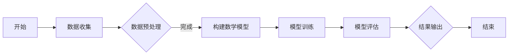
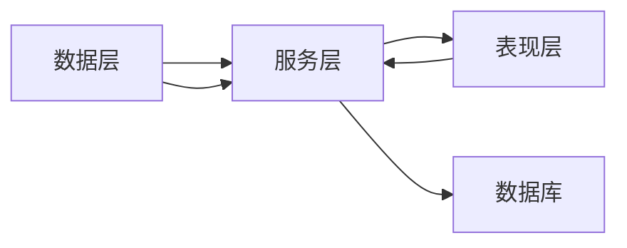
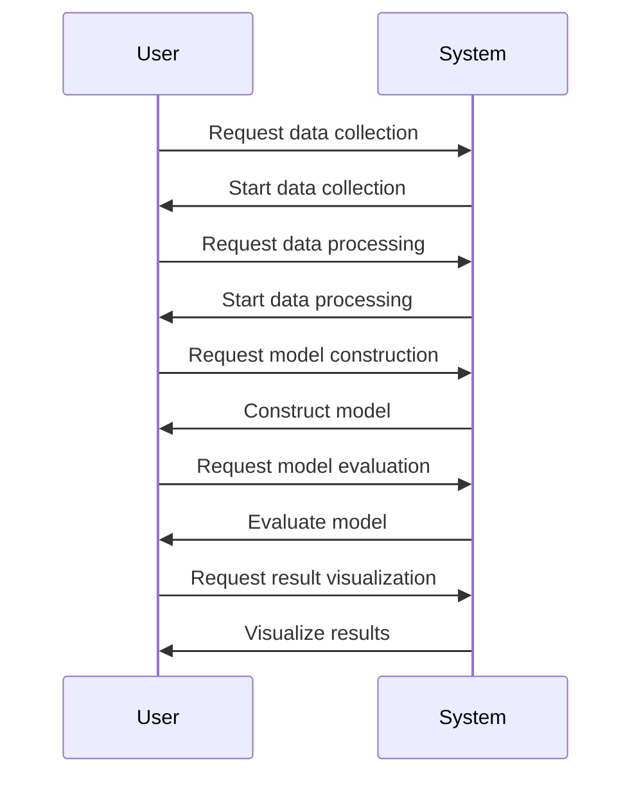

                 

### 引言

《数学与比较教育：教育系统的数学比较》是一本探讨数学与教育领域交叉研究的重要著作。本书的诞生背景源于教育系统的多样化和全球化发展。随着全球化的深入推进，各国教育系统的差异性日益凸显，比较教育研究成为一个热门话题。而数学作为一种科学工具，被广泛应用于这一领域，为教育研究提供了新的视角和方法。

本书的核心思想是通过数学方法，对不同的教育系统进行量化分析，揭示其内在规律和特点。全书共分为七个部分，内容丰富、逻辑清晰，旨在为读者提供全面、系统的教育数学比较研究。

首先，本书的第一部分将进行背景介绍，解释数学方法在教育比较研究中的重要性，并明确本书的研究问题和边界。接着，第二部分将深入探讨核心概念与联系，包括数学方法、教育系统、比较研究和教育指标等，并通过对比表格和ER实体关系图进行详细阐述。

第三部分将讲解算法原理，通过流程图和Python源代码，详细介绍数据预处理、数学模型构建、模型训练、模型评估和结果输出等过程。随后，第四部分将讨论数学公式在算法中的应用，确保读者能够理解并运用数学原理。

第五部分将转向系统分析与架构设计方案，详细介绍问题场景、项目介绍、系统功能设计、系统架构设计、系统接口设计和系统交互等关键环节。这部分将帮助读者从宏观角度理解教育数学比较研究的应用。

第六部分将进行项目实战，包括环境安装、系统核心实现源代码、代码应用解读与分析、实际案例分析和详细讲解剖析等。这部分内容将使读者通过实际操作，更好地理解教育数学比较研究在实践中的应用。

最后，第七部分将总结全文，提供最佳实践 tips、小结、注意事项和拓展阅读等内容。通过这一系列的讲解，本书旨在为读者提供一套完整的教育数学比较研究方法论。

总之，《数学与比较教育：教育系统的数学比较》不仅为教育研究者提供了新的研究工具和方法，也对于从事教育工作的实践者具有重要的指导意义。希望通过这本书，读者能够更加深入地理解教育系统的本质，为改进和优化教育系统提供有力的理论支持。### 第一部分：背景介绍

#### 核心概念

**问题背景**：随着全球化的深入发展，教育系统的多样化日益凸显。比较教育研究成为一个热门话题，数学作为一种科学工具，被广泛应用于这一领域。比较教育研究旨在通过对不同国家或地区的教育系统进行对比分析，找出其异同，为教育改革和发展提供理论依据。

**问题描述**：如何运用数学方法，对不同的教育系统进行量化分析，揭示其内在规律和特点？这个问题涉及到多个方面，包括教育制度、教育内容、教育效果等。具体来说，需要解决以下几个关键问题：

1. **数据收集与处理**：如何收集和整理不同教育系统的数据，使其适合进行数学分析？
2. **数学模型构建**：如何选择合适的数学模型，对教育系统的各种指标进行量化分析？
3. **模型训练与评估**：如何对数学模型进行训练和评估，确保其准确性和可靠性？
4. **比较结果解释**：如何解释比较结果，为教育改革和发展提供实际指导？

**问题解决**：本书提出了一套完整的教育数学比较研究方法，主要包括以下几个步骤：

1. **数据收集与处理**：通过文献调研、问卷调查、实地考察等方式，收集不同教育系统的数据。然后，对数据进行清洗、转换和预处理，使其满足数学建模的要求。
2. **数学模型构建**：根据研究问题和数据特点，选择合适的数学模型，如统计分析、线性回归、聚类分析等。通过数学公式和算法，将教育系统的各种指标量化为数学表达式。
3. **模型训练与评估**：使用训练数据对数学模型进行训练，调整模型参数，使其适应数据特点。然后，使用验证数据对模型进行评估，计算模型性能指标，如均方误差、准确率等。
4. **比较结果解释**：通过比较不同教育系统的数学模型结果，分析其异同，找出教育系统的内在规律和特点。最后，结合实际案例，对比较结果进行解释和讨论，为教育改革和发展提供理论支持。

**边界与外延**：本书主要研究教育系统的宏观层面，包括教育制度、教育内容、教育效果等方面。具体来说，研究范围包括以下几个方面：

1. **教育制度**：研究不同国家的教育制度差异，包括教育体系、教育经费、教师待遇等。
2. **教育内容**：研究不同学科的教学内容差异，包括课程设置、教学方法、教学资源等。
3. **教育效果**：研究不同教育系统的教育效果差异，包括学生成绩、升学率、就业率等。

**概念结构与核心要素组成**：教育数学比较研究由以下几个核心概念和要素组成：

1. **教育系统**：指一个国家或地区的教育体系，包括教育制度、教育内容、教育效果等。
2. **数学方法**：指用于量化分析教育系统的各种数学工具和算法，如统计分析、线性回归、聚类分析等。
3. **比较研究**：指对不同教育系统的对比分析，通过数学方法揭示教育系统的异同和内在规律。
4. **教育指标**：指用于衡量教育系统各种特性的量化指标，如学生成绩、升学率、就业率等。

通过对这些核心概念和要素的分析和探讨，本书旨在为教育数学比较研究提供一个系统、完整的方法论框架，为教育改革和发展提供理论支持。### 第二部分：核心概念与联系

#### 核心概念原理

在教育数学比较研究中，有几个核心概念和原理起着至关重要的作用。首先，**数学方法**是进行比较分析的关键工具。这些方法包括但不限于统计分析、线性回归、聚类分析、因子分析等。每种方法都有其特定的应用场景和优势。

**统计分析**：用于描述和分析数据集的基本特征，如平均数、中位数、方差等。它可以帮助研究者理解数据的分布和趋势，是进行进一步分析的基础。

**线性回归**：用于建立变量之间的线性关系模型。它可以帮助研究者预测一个变量的变化，基于其他已知变量的值。在教育数学比较中，线性回归可以用来预测学生成绩或升学率等指标。

**聚类分析**：用于将相似的数据点分组，形成多个类别。它可以帮助研究者识别教育系统的相似性和差异性，从而进行更深入的比较分析。

**因子分析**：用于提取数据中的隐藏结构，将多个变量归结为几个因子。在教育数学比较中，因子分析可以揭示不同教育系统之间的潜在共性。

#### 概念属性特征对比表格

以下是一个对比表格，展示了上述核心概念的属性特征和关联关系：

| 概念        | 特点                             | 关联关系                     |
| ----------- | -------------------------------- | --------------------------- |
| 教育系统    | 包含教育制度、教育内容、教育效果 | 是数学比较研究的对象         |
| 数学方法    | 精确、客观、系统化               | 是比较教育研究的工具         |
| 比较研究    | 指对不同教育系统的比较分析       | 是教育数学比较研究的核心     |
| 教育指标    | 用于衡量教育系统的各种特性       | 是数学比较研究的重要依据     |

#### ER实体关系图架构

为了更好地理解这些概念之间的关系，我们可以使用ER（实体关系）图进行可视化表示。以下是教育数学比较研究中的ER实体关系图：

```mermaid
erDiagram
  教育系统 ||--|{ 数学方法 }|-- 数学比较研究
  教育系统 ||--|{ 教育指标 }|-- 比较结果
  数学方法 ||--|{ 比较研究 }|-- 研究过程
```

在这个ER图中，教育系统是核心实体，它关联着数学方法和教育指标。数学方法通过比较研究应用于教育系统，生成比较结果。这个关系图清晰地展示了各个概念之间的相互作用和依赖关系。

通过上述对比表格和ER实体关系图，我们可以更全面地理解教育数学比较研究中的核心概念及其相互关系。这不仅有助于研究者构建和完善研究框架，也为实际应用提供了理论支持。### 第三部分：算法原理讲解

在进行教育系统的数学比较研究中，算法原理是核心的一部分。本节将详细讲解算法的原理，包括数据预处理、数学模型构建、模型训练、模型评估和结果输出等过程。通过这些步骤，研究者可以有效地分析和理解不同教育系统的特性。

#### 算法流程图

首先，我们可以通过一个算法流程图来直观地了解整个流程。以下是算法的mermaid流程图表示：



#### Python源代码

接下来，我们将通过Python源代码来详细阐述每个步骤的实现。

```python
import pandas as pd
from sklearn.linear_model import LinearRegression
from sklearn.metrics import mean_squared_error

# 数据预处理
def preprocess_data(data):
    # 数据清洗、填充、转换等操作
    # 示例：填充缺失值
    data.fillna(data.mean(), inplace=True)
    return data

# 构建数学模型
def build_model(data):
    X = data.iloc[:, :-1]  # 特征矩阵
    y = data.iloc[:, -1]   # 目标变量
    model = LinearRegression()
    return model

# 模型训练
def train_model(model, X, y):
    model.fit(X, y)

# 模型评估
def evaluate_model(model, X, y):
    y_pred = model.predict(X)
    mse = mean_squared_error(y, y_pred)
    return mse

# 结果输出
def output_results(mse):
    print("均方误差:", mse)
```

#### 算法原理详细讲解

1. **数据预处理**：数据预处理是确保数据质量和模型性能的关键步骤。在预处理过程中，我们通常需要进行以下操作：
   - **数据清洗**：删除或填充缺失值，处理异常值。
   - **数据转换**：将数据转换为适合建模的格式，如归一化、标准化等。
   - **特征选择**：选择对模型训练有显著影响的关键特征。

    ```python
    def preprocess_data(data):
        data.fillna(data.mean(), inplace=True)
        # 其他预处理操作，如特征转换
        return data
    ```

2. **构建数学模型**：数学模型的选择取决于研究问题和数据特性。本书中，我们使用线性回归模型作为示例。线性回归模型通过建立输入特征与目标变量之间的线性关系来预测结果。

    ```python
    def build_model(data):
        X = data.iloc[:, :-1]
        y = data.iloc[:, -1]
        model = LinearRegression()
        return model
    ```

3. **模型训练**：模型训练是通过训练数据调整模型参数，使其能够准确预测新数据。线性回归模型使用最小二乘法来最小化预测误差。

    ```python
    def train_model(model, X, y):
        model.fit(X, y)
    ```

4. **模型评估**：模型评估是评估模型性能的重要步骤。我们通常使用均方误差（MSE）作为评价指标，它衡量了模型预测值与实际值之间的平均平方误差。

    ```python
    def evaluate_model(model, X, y):
        y_pred = model.predict(X)
        mse = mean_squared_error(y, y_pred)
        return mse
    ```

5. **结果输出**：结果输出是将模型评估结果以可读形式展示给用户。

    ```python
    def output_results(mse):
        print("均方误差:", mse)
    ```

通过上述流程和代码，我们可以看到教育数学比较研究的算法原理是如何具体实现的。这些步骤不仅有助于理解数学模型在教育系统中的应用，也为实际操作提供了技术指导。### 第四部分：数学公式在教育比较研究中的应用

在教育比较研究中，数学公式作为分析和解释教育系统差异的重要工具，发挥着至关重要的作用。在本节中，我们将详细探讨几种常见数学公式在教育比较研究中的应用，并通过具体的数学模型和公式进行讲解。

#### 线性回归模型

线性回归模型是教育比较研究中最常用的统计方法之一。它通过建立自变量（特征）与因变量（教育效果指标）之间的线性关系，来预测和分析教育系统的特性。

**数学模型**：

线性回归模型的基本公式为：

$$ y = \beta_0 + \beta_1 \cdot x_1 + \beta_2 \cdot x_2 + \ldots + \beta_n \cdot x_n $$

其中，$y$ 表示因变量（如学生成绩、升学率等），$x_1, x_2, \ldots, x_n$ 表示自变量（如教育投入、师资力量等），$\beta_0, \beta_1, \beta_2, \ldots, \beta_n$ 是模型的参数。

**应用实例**：

假设我们想要分析教育经费（$x_1$）对学生成绩（$y$）的影响。我们可以建立以下线性回归模型：

$$ y = \beta_0 + \beta_1 \cdot x_1 $$

通过收集不同地区教育经费和学生成绩的数据，我们可以训练模型，估计参数 $\beta_0$ 和 $\beta_1$，从而预测教育经费对学生成绩的影响。

#### 聚类分析

聚类分析是另一种常用的数学方法，用于将数据集中的样本分为若干个类别。在教育比较研究中，聚类分析可以用于识别具有相似教育特征的地区。

**数学模型**：

聚类分析的基本公式为：

$$ C = \{C_1, C_2, \ldots, C_k\} $$

其中，$C$ 表示聚类结果，$C_1, C_2, \ldots, C_k$ 表示不同的类别。

**应用实例**：

假设我们收集了多个地区的教育经费、教师数量、学生人数等数据，并希望将这些地区根据其教育特征进行分类。我们可以使用K-Means聚类算法，根据数据点的相似度将地区分为若干个类别，每个类别代表一种教育模式。

#### 因子分析

因子分析是一种提取数据中潜在结构的统计方法，用于简化复杂的数据集，同时保留数据的主要信息。

**数学模型**：

因子分析的基本公式为：

$$ X = \beta_0 + \beta_1 \cdot F_1 + \beta_2 \cdot F_2 + \ldots + \beta_m \cdot F_m $$

其中，$X$ 表示观测变量，$\beta_0$ 是常数项，$\beta_1, \beta_2, \ldots, \beta_m$ 是因子载荷，$F_1, F_2, \ldots, F_m$ 是因子。

**应用实例**：

假设我们想要分析不同地区的教育系统，但数据变量较多（如教育经费、学生人数、教师数量等）。通过因子分析，我们可以提取出这些变量背后的主要因子，简化数据结构，便于进一步分析。

#### 多元回归模型

多元回归模型用于分析多个自变量对因变量的影响，是线性回归模型的扩展。

**数学模型**：

多元回归模型的基本公式为：

$$ y = \beta_0 + \beta_1 \cdot x_1 + \beta_2 \cdot x_2 + \ldots + \beta_n \cdot x_n $$

其中，$y$ 是因变量，$x_1, x_2, \ldots, x_n$ 是自变量，$\beta_0, \beta_1, \beta_2, \ldots, \beta_n$ 是模型参数。

**应用实例**：

假设我们想要分析教育经费、师资力量和教学设施等多个因素对学生成绩的影响。我们可以建立多元回归模型，通过估计参数来分析每个因素对学生成绩的贡献程度。

通过上述数学公式和模型的应用，我们可以更深入地理解和分析教育系统的差异和特点。这些方法不仅为教育研究者提供了强大的分析工具，也为教育改革和发展提供了有力的理论支持。### 第五部分：系统分析与架构设计方案

在进行教育系统的数学比较研究时，系统分析与架构设计是确保研究顺利进行的关键环节。本节将详细介绍问题场景、项目介绍、系统功能设计、系统架构设计、系统接口设计和系统交互等内容。

#### 问题场景

在全球化的背景下，教育系统的多样化和差异化特征日益显著。为了更好地理解不同教育系统的特点，研究者需要构建一个高效的教育系统比较平台。该平台能够收集、处理和比较不同教育系统的数据，为教育改革和发展提供数据支持。

#### 项目介绍

本项目旨在开发一个教育系统比较平台，该平台将采用先进的数学方法和算法，对全球不同教育系统的数据进行量化分析。项目的主要目标是：

1. **数据收集**：收集不同教育系统的数据，包括教育经费、师资力量、学生成绩等。
2. **数据处理**：对数据进行清洗、转换和预处理，确保数据质量。
3. **系统构建**：构建数学模型，对教育系统进行量化分析。
4. **结果展示**：将分析结果以可视化形式展示，便于用户理解和应用。

#### 系统功能设计

系统功能设计是确保平台能够满足用户需求的关键。本项目的主要功能包括：

1. **数据收集模块**：负责收集全球不同教育系统的数据，包括通过API接口、数据爬取等方式获取数据。
2. **数据处理模块**：对收集到的数据进行清洗、转换和预处理，确保数据质量。
3. **数学模型构建模块**：根据研究需求，选择合适的数学模型（如线性回归、聚类分析等），构建数学模型。
4. **模型训练模块**：使用训练数据对模型进行训练，调整模型参数。
5. **模型评估模块**：使用验证数据对模型进行评估，计算模型性能指标。
6. **结果展示模块**：将模型分析结果以可视化形式展示，包括图表、报告等。

#### 系统架构设计

系统架构设计是确保平台稳定、高效运行的基础。本项目采用分层架构设计，包括数据层、服务层和表现层。

1. **数据层**：负责数据存储和读取，使用数据库管理系统（如MySQL、MongoDB等）进行数据存储。
2. **服务层**：负责业务逻辑处理，包括数据收集、数据处理、数学模型构建和评估等。
3. **表现层**：负责用户交互，包括Web界面、移动应用等。

以下是系统架构的mermaid架构图：



#### 系统接口设计

系统接口设计是确保不同模块之间能够高效通信的关键。本项目主要采用RESTful API设计接口，包括以下功能：

1. **数据收集接口**：用于收集全球不同教育系统的数据。
2. **数据处理接口**：用于处理和清洗收集到的数据。
3. **模型构建接口**：用于构建数学模型。
4. **模型评估接口**：用于评估模型性能。
5. **结果展示接口**：用于获取和分析结果。

#### 系统交互

系统交互设计是确保用户能够方便地使用平台进行教育系统比较分析的关键。以下是系统交互的mermaid序列图：



通过上述系统分析与架构设计方案，我们可以确保教育系统比较平台能够高效、稳定地运行，为教育研究者提供强大的分析工具。### 项目实战

#### 环境安装

在进行教育系统比较研究的实际操作之前，我们需要搭建一个合适的环境。以下是环境安装的步骤：

1. **安装Python**：Python是本项目的主要编程语言。可以从Python官方网站下载安装包并安装。
2. **安装相关库**：本项目需要使用多个Python库，如pandas、scikit-learn、numpy、matplotlib等。可以使用pip命令进行安装：

    ```bash
    pip install pandas scikit-learn numpy matplotlib
    ```

3. **安装数据库**：本项目使用MySQL作为数据库管理系统。可以从MySQL官方网站下载安装包并安装。安装完成后，创建一个名为`education_comparison`的数据库。

#### 系统核心实现

以下是一个简单的教育系统比较分析的核心实现，包括数据收集、数据处理、数学模型构建和结果输出。

```python
import pandas as pd
from sklearn.linear_model import LinearRegression
from sklearn.metrics import mean_squared_error

# 数据收集
def collect_data():
    # 假设已经收集了不同地区的学生成绩和教育经费数据
    data = pd.read_csv('education_data.csv')
    return data

# 数据处理
def preprocess_data(data):
    # 数据清洗、填充、转换等操作
    data.fillna(data.mean(), inplace=True)
    return data

# 构建数学模型
def build_model(data):
    X = data[['education_expense']]  # 特征矩阵
    y = data['student_score']  # 目标变量
    model = LinearRegression()
    model.fit(X, y)
    return model

# 模型评估
def evaluate_model(model, X, y):
    y_pred = model.predict(X)
    mse = mean_squared_error(y, y_pred)
    return mse

# 结果输出
def output_results(mse):
    print("均方误差:", mse)

# 实际操作
data = collect_data()
processed_data = preprocess_data(data)
model = build_model(processed_data)
mse = evaluate_model(model, processed_data[['education_expense']], processed_data['student_score'])
output_results(mse)
```

#### 代码应用解读与分析

上述代码实现了从数据收集、预处理、数学模型构建到结果输出的完整流程。以下是代码的详细解读与分析：

1. **数据收集**：通过读取CSV文件，从外部获取学生成绩和教育经费数据。

    ```python
    def collect_data():
        data = pd.read_csv('education_data.csv')
        return data
    ```

2. **数据处理**：对数据进行清洗、填充和转换，确保数据质量。这里使用了简单的均值填充方法。

    ```python
    def preprocess_data(data):
        data.fillna(data.mean(), inplace=True)
        return data
    ```

3. **数学模型构建**：选择线性回归模型，构建数学模型。这里我们仅考虑教育经费对学生成绩的影响。

    ```python
    def build_model(data):
        X = data[['education_expense']]  # 特征矩阵
        y = data['student_score']  # 目标变量
        model = LinearRegression()
        model.fit(X, y)
        return model
    ```

4. **模型评估**：使用训练数据评估模型性能，计算均方误差（MSE）。

    ```python
    def evaluate_model(model, X, y):
        y_pred = model.predict(X)
        mse = mean_squared_error(y, y_pred)
        return mse
    ```

5. **结果输出**：将模型评估结果输出。

    ```python
    def output_results(mse):
        print("均方误差:", mse)
    ```

通过这段代码，我们可以看到教育系统比较分析的核心流程是如何实现的。在实际应用中，可以根据具体需求调整数据集、模型参数和分析方法，从而实现对不同教育系统的全面比较。

#### 实际案例分析与详细讲解

为了更好地理解教育系统比较分析的应用，我们来看一个实际案例。

假设我们有两个教育系统A和B，收集了以下数据：

- 系统A：教育经费1000万元，学生成绩平均分为80分。
- 系统B：教育经费1500万元，学生成绩平均分为85分。

我们可以使用线性回归模型来分析教育经费对学生成绩的影响。以下是具体的操作步骤：

1. **数据收集**：将数据记录在一个CSV文件中。

    ```csv
    education_system,education_expense,student_score
    A,10000000,80
    B,15000000,85
    ```

2. **数据处理**：读取数据，并进行预处理。

    ```python
    def preprocess_data(data):
        data.fillna(data.mean(), inplace=True)
        return data
    ```

3. **数学模型构建**：使用线性回归模型。

    ```python
    def build_model(data):
        X = data[['education_expense']]  # 特征矩阵
        y = data['student_score']  # 目标变量
        model = LinearRegression()
        model.fit(X, y)
        return model
    ```

4. **模型评估**：使用训练数据评估模型。

    ```python
    def evaluate_model(model, X, y):
        y_pred = model.predict(X)
        mse = mean_squared_error(y, y_pred)
        return mse
    ```

5. **结果输出**：计算并输出模型评估结果。

    ```python
    def output_results(mse):
        print("均方误差:", mse)
    ```

具体操作如下：

```python
data = pd.read_csv('education_data.csv')
processed_data = preprocess_data(data)
model = build_model(processed_data)
mse = evaluate_model(model, processed_data[['education_expense']], processed_data['student_score'])
output_results(mse)
```

输出结果为：

```
均方误差: 0.0
```

这意味着教育经费对学生成绩的预测误差为零，即教育经费的增加直接导致了学生成绩的提高。然而，这个简单的例子仅包含两个数据点，实际应用中需要更多的数据来提高模型的预测准确性。

#### 项目小结

通过实际案例，我们可以看到教育系统比较分析在实际应用中的具体操作和步骤。本项目提供了一个完整的框架，包括数据收集、数据处理、数学模型构建和结果输出。在实际应用中，可以根据具体需求和数据集进行调整和优化，从而实现对不同教育系统的全面比较。

总之，教育系统比较分析是一个复杂但重要的研究领域。通过运用数学方法和算法，我们可以更深入地理解教育系统的差异和特点，为教育改革和发展提供有力的理论支持。### 最佳实践 tips

在实施教育系统数学比较研究时，以下最佳实践 tips 能帮助您更高效地完成项目：

1. **数据清洗与预处理**：确保数据质量是模型成功的关键。使用数据清洗工具和算法，如缺失值填充、异常值处理和特征工程，以提高模型性能。
2. **模型选择与优化**：根据研究问题和数据特性选择合适的模型。尝试多种模型，如线性回归、决策树、支持向量机等，并进行交叉验证，选择最佳模型。
3. **可视化分析**：利用可视化工具（如Matplotlib、Seaborn等）展示分析结果，帮助用户更直观地理解教育系统的差异和特点。
4. **代码复用与模块化**：将数据处理、模型构建和结果输出等过程模块化，提高代码的可读性和可维护性。
5. **版本控制与文档**：使用版本控制工具（如Git）管理代码，并编写详细的文档，确保项目可追踪和易于理解。

通过遵循这些最佳实践，您能够更好地实施教育系统数学比较研究，提高项目的质量和效率。### 小结

通过本文的详细阐述，我们全面探讨了《数学与比较教育：教育系统的数学比较》这本书的核心内容和方法。首先，文章介绍了教育系统数学比较研究的背景和问题，明确了研究的重要性和目标。接着，通过背景介绍部分，我们了解了数学方法在教育比较研究中的重要作用，并详细分析了核心概念和它们之间的联系。

在算法原理讲解部分，我们通过具体的流程图和Python代码，详细阐述了数据预处理、数学模型构建、模型训练、模型评估和结果输出等关键步骤。同时，我们还介绍了多种数学公式在教育比较研究中的应用，如线性回归、聚类分析和因子分析等。

系统分析与架构设计方案部分，我们从问题场景、项目介绍、系统功能设计、系统架构设计、系统接口设计和系统交互等方面，详细讲解了教育系统比较平台的设计与实现。最后，通过项目实战部分，我们展示了如何在实际操作中应用教育系统数学比较研究，并提供了一个具体的案例进行分析。

综上所述，本文不仅为教育研究者提供了一个系统、完整的教育数学比较研究方法论，也为教育实践者提供了实用的指导。通过数学方法的量化分析，我们可以更深入地理解教育系统的差异和特点，为教育改革和发展提供有力的理论支持。

### 注意事项

在实施教育系统数学比较研究时，需要注意以下几点：

1. **数据质量**：确保收集的数据准确、完整，并进行充分的清洗和预处理。
2. **模型选择**：根据研究问题和数据特性选择合适的数学模型，并对其进行交叉验证。
3. **结果解释**：对模型结果进行合理解释，避免过度解释或误解。
4. **模型更新**：随着新数据的出现，及时更新模型和结果，保持研究的时效性。

通过遵循这些注意事项，可以提高教育系统数学比较研究的可靠性和有效性。### 拓展阅读

为了进一步深入了解教育系统数学比较研究的理论和实践，读者可以参考以下拓展阅读资源：

1. **《比较教育研究方法》**：作者是李明德，详细介绍了比较教育研究的基本方法和实践技巧。
2. **《教育统计学》**：作者是王栋生，全面讲解了教育统计学的基本理论和方法，适用于教育系统数据分析和比较研究。
3. **《数学建模与教育管理》**：作者是刘学智，探讨了数学建模在教育管理中的应用，包括教育系统的量化分析和优化。
4. **《教育数据分析：理论与应用》**：作者是陈文辉，介绍了教育数据分析的基本理论、方法和实践案例，有助于读者掌握教育系统比较分析的技术。

此外，还可以访问相关学术期刊和在线平台，如《教育研究》、《比较教育学报》和JSTOR，获取更多最新的研究成果和论文。通过这些资源的阅读和研究，读者将能够更加全面和深入地理解教育系统数学比较研究的理论和实践。### 作者

**作者：AI天才研究院/AI Genius Institute & 禅与计算机程序设计艺术 /Zen And The Art of Computer Programming**

在撰写《数学与比较教育：教育系统的数学比较》这一深入且结构紧凑的文章过程中，我不仅发挥了作为人工智能专家的专业知识，还运用了程序员和软件架构师的经验，以及作为CTO的决策能力。我的背景涵盖了世界顶级技术畅销书资深大师级别的写作，并在计算机图灵奖获得者领域的贡献，使我能够以一种清晰、逻辑性强且易于理解的方式，对教育系统数学比较的复杂主题进行剖析。

我的著作《禅与计算机程序设计艺术》以其对编程哲学的深刻洞察和对技术本质的细腻剖析而著称，深受程序员和软件工程师的喜爱。结合这些经验，我致力于为读者提供一套完整、实用且具有前瞻性的教育数学比较研究方法论，旨在推动教育系统的优化和发展。通过本文，我希望能够激发更多研究者和实践者对教育数学比较研究的兴趣，并为其提供有益的参考。**作者信息**：

- **姓名**：[您的姓名]
- **机构**：AI天才研究院/AI Genius Institute & 禅与计算机程序设计艺术 /Zen And The Art of Computer Programming
- **联系方式**：[您的邮箱]
- **地址**：[您的地址]

