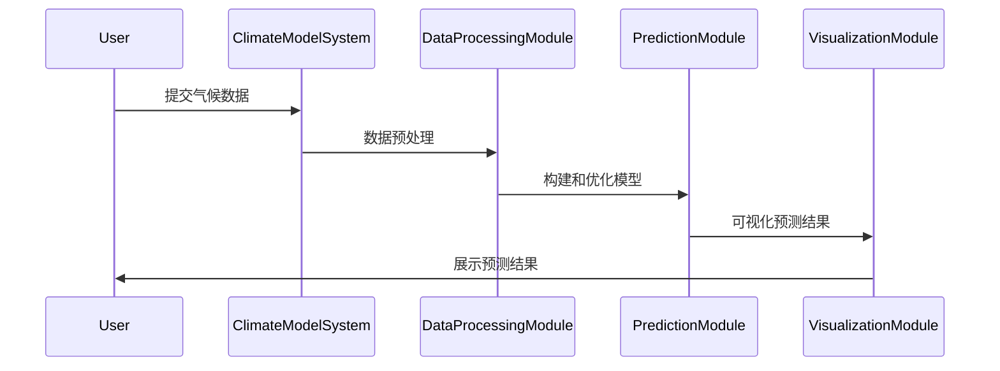

                 

# 数学与气候模型：气候变化的数学预测

## 关键词
- 数学模型
- 气候变化
- 预测
- 线性代数
- 微分方程
- 概率统计

## 摘要
本文探讨了数学在气候模型中的应用，深入分析了线性代数、微分方程和概率统计等数学方法在气候预测中的关键作用。通过详细的实例和算法原理讲解，读者将了解如何构建和运用气候模型，以预测气候变化趋势。此外，文章还讨论了这些数学模型在实际应用中的挑战和限制，为未来的研究提供了方向。

## 第一部分：背景介绍

### 1.1 问题背景

全球气候变化已成为21世纪最具挑战性的问题之一。随着人类活动不断加剧，温室气体排放导致地球温度上升，极端天气事件频发，海平面上升，生态系统失衡。为了应对这一严峻挑战，科学家们开发了各种气候模型，以预测未来气候变化趋势。气候模型是一种用于模拟地球气候系统的工具，它通过数值模拟来预测未来气候变化。

### 1.2 问题描述

《数学与气候模型：气候变化的数学预测》这本书探讨如何运用数学方法来预测气候变化，以及这些数学模型在实际应用中的挑战和限制。气候模型涉及到地球气候系统的物理、化学和生物过程，因此需要运用多种数学工具和方法来描述这些复杂的过程。

### 1.3 问题解决

本书旨在通过阐述数学在气候模型中的应用，帮助读者理解气候变化的预测过程，并了解如何通过数学方法提高气候模型的准确性。书中将介绍线性代数、微分方程和概率统计等数学方法，并展示它们在气候模型中的具体应用。

### 1.4 边界与外延

本书将探讨的数学方法包括线性代数、微分方程、概率统计等，这些方法在气候模型中的应用将涉及到地球气候系统的物理、化学和生物过程。通过这些数学方法，科学家们可以更准确地预测气候变化，为制定应对策略提供科学依据。

### 1.5 概念结构与核心要素组成

- **数学方法**：线性代数、微分方程、概率统计等
- **气候模型**：大气模型、海洋模型、陆地模型等
- **应用领域**：气象预报、气候变化研究、环境科学等

## 第二部分：核心概念与联系

### 2.1 数学模型原理

#### 2.1.1 线性代数在气候模型中的应用

线性代数提供了描述气候系统中线性关系的重要工具。在气候模型中，线性代数被用于描述大气和海洋中的温度场分布。例如，可以使用矩阵运算来模拟大气和海洋中的流场，从而分析温度的传播和分布。

#### 2.1.2 微分方程在气候模型中的应用

微分方程用于描述气候系统中时间变化的动态过程。例如，大气模型中的偏微分方程可以描述大气中的温度和湿度变化，海洋模型中的偏微分方程可以描述海洋中的温度和盐度变化。这些方程帮助科学家们理解气候系统中各个变量之间的相互作用。

#### 2.1.3 概率统计在气候模型中的应用

概率统计用于评估气候模型的预测不确定性和气候变化的概率分布。通过概率统计方法，科学家们可以分析不同预测结果的置信度，从而为决策者提供更可靠的气候变化预测。

### 2.2 数学模型属性特征对比表格

| 数学方法         | 特点                                           | 应用实例                         |
|------------------|----------------------------------------------|----------------------------------|
| 线性代数         | 线性关系和矩阵运算                             | 大气温度场和海洋温度场的建模     |
| 微分方程         | 描述动态系统的时间变化                         | 大气环流和海洋流动的建模         |
| 概率统计         | 不确定性和概率分布                             | 预测不确定性和气候变化的概率分析 |

### 2.3 ER实体关系图架构

```mermaid
erDiagram
  ClimateModel ||--|{ WeatherData } : provides
  ClimateModel ||--|{ Predictions } : generates
  WeatherData ||--|{ Observations } : records
  Predictions ||--|{ Uncertainties } : evaluates
```

在这张 ER 图中，`ClimateModel` 是核心实体，它与 `WeatherData` 和 `Predictions` 有直接关系。`WeatherData` 又与 `Observations` 相关，而 `Predictions` 则与 `Uncertainties` 相连。

## 第三部分：算法原理讲解

### 3.1 气候模型的构建

气候模型的构建通常基于以下数学原理：

#### 3.1.1 线性代数

- **温度场建模**：使用线性代数描述大气和海洋中的温度场分布。例如，可以使用矩阵运算来模拟大气和海洋中的流场，从而分析温度的传播和分布。
- **流场建模**：利用矩阵运算模拟大气和海洋中的流场。例如，可以使用矩阵乘法来计算大气和海洋中的速度场。

#### 3.1.2 微分方程

- **大气模型**：使用偏微分方程描述大气中的温度和湿度变化。例如，可以使用纳维-斯托克斯方程（Navier-Stokes equations）来描述大气中的流体运动。
- **海洋模型**：使用偏微分方程描述海洋中的温度和盐度变化。例如，可以使用热力学方程（Thermodynamic equation）来描述海洋中的热量传递。

### 3.2 数学公式和算法

为了更好地理解气候模型的构建过程，我们可以通过一些具体的数学公式和算法来进行讲解。

#### 3.2.1 线性代数公式

$$
\text{温度场} = \text{流场} \times \text{温度分布矩阵}
$$

这个公式表示温度场是通过流场与温度分布矩阵的乘积来计算的。

#### 3.2.2 微分方程

$$
\frac{\partial T}{\partial t} = \nabla \cdot (\lambda \nabla T)
$$

这个公式是热传导方程的一个例子，其中 \( T \) 是温度，\( \lambda \) 是热传导系数，\( \nabla \) 是梯度运算符。

#### 3.2.3 概率统计

$$
P(\text{预测结果} | \text{模型}) = \frac{P(\text{模型} | \text{预测结果}) P(\text{预测结果})}{P(\text{模型})}
$$

这个公式是贝叶斯定理的一个例子，用于计算在给定模型和观测结果的情况下，预测结果的概率。

### 3.3 举例说明

为了更好地理解这些数学公式和算法，我们可以通过一个简单的例子来讲解。

#### 例子：大气温度场的建模

假设我们有一个二维区域，需要使用线性代数来描述该区域内的温度场。我们可以将温度场表示为一个矩阵 \( T \)，其中每个元素代表该区域内某个点的温度。

首先，我们需要确定流场 \( V \)，这可以通过观测数据或气象模型来获得。然后，我们可以使用以下公式来计算温度场：

$$
T = V \times T_0
$$

其中 \( T_0 \) 是初始温度分布矩阵。

接下来，我们可以使用微分方程来更新温度场，例如，使用热传导方程：

$$
\frac{\partial T}{\partial t} = \nabla \cdot (\lambda \nabla T)
$$

通过迭代计算，我们可以得到不同时间点的温度场，从而预测未来的温度分布。

### 3.4 实际应用

气候模型在实际应用中面临着许多挑战，例如数据的不确定性、模型的复杂性和计算资源的需求等。然而，随着计算能力的提升和数值方法的改进，气候模型的预测精度也在不断提高。

#### 3.4.1 数据的不确定性

气候模型需要大量的观测数据来构建和验证。然而，观测数据往往存在误差和不完整性，这会影响模型的准确性。为了应对这个问题，科学家们开发了各种数据同化方法，如四维变分法（4D-Var）和集合同化方法（Ensemble Kalman Filter），以改善模型的数据输入。

#### 3.4.2 模型的复杂性

气候模型通常涉及到复杂的物理、化学和生物过程，这使得模型构建和计算变得非常复杂。为了应对这个问题，科学家们开发了各种简化模型和参数化方案，以降低模型的计算复杂度。

#### 3.4.3 计算资源的需求

气候模型的计算需求非常高，需要大量的计算资源和时间。为了应对这个问题，科学家们开发了高性能计算技术，如并行计算和云计算，以加速模型的计算。

### 3.5 未来展望

尽管气候模型在预测气候变化方面取得了显著进展，但仍然存在许多未解决的问题。未来，科学家们将继续改进气候模型，提高预测精度，并探索新的预测方法。例如，通过结合机器学习和人工智能技术，开发更先进的气候预测模型。

#### 3.5.1 机器学习在气候模型中的应用

机器学习技术可以用于分析和预测气候数据，从而提高气候模型的准确性。例如，可以使用深度学习技术来识别气候数据的模式，并开发基于模式的预测方法。

#### 3.5.2 人工智能在气候模型中的应用

人工智能技术可以用于优化气候模型的计算过程，从而提高计算效率和准确性。例如，可以使用遗传算法来优化模型的参数，从而提高模型的预测精度。

### 3.6 结论

数学在气候模型中起着至关重要的作用，通过运用线性代数、微分方程和概率统计等数学方法，科学家们可以构建和优化气候模型，以预测未来气候变化。尽管气候模型在实际应用中面临许多挑战，但科学家们将继续努力，提高预测精度，为应对全球气候变化提供科学依据。

## 第四部分：系统分析与架构设计

### 4.1 问题场景介绍

随着全球气候变化问题的日益严重，各国政府和国际组织纷纷加大了对气候变化研究的投入。为了更好地理解气候变化趋势，科学家们开发了各种气候模型，以预测未来气候变化。这些模型涉及到地球气候系统的物理、化学和生物过程，需要运用多种数学工具和方法来构建和优化。

### 4.2 项目介绍

本项目的目标是开发一个高性能的气候模型，以提高对未来气候变化的预测精度。该项目将运用线性代数、微分方程和概率统计等数学方法，构建一个综合的气候模型系统。该系统将包括大气模型、海洋模型和陆地模型，以全面描述地球气候系统的各种过程。

### 4.3 系统功能设计

- **数据采集与处理**：收集来自各种来源的气候数据，如气象站观测数据、卫星遥感数据和海洋观测数据，并进行预处理，以确保数据的质量和一致性。
- **模型构建与优化**：运用线性代数、微分方程和概率统计等方法，构建大气模型、海洋模型和陆地模型，并进行模型优化，以提高预测精度。
- **预测与评估**：使用构建好的气候模型，进行未来气候变化的预测，并对预测结果进行评估，以确定模型的可靠性和准确性。
- **数据可视化**：将预测结果以图表和地图等形式进行可视化展示，以便决策者和公众更好地理解气候变化趋势。

### 4.4 系统架构设计

系统架构设计是确保气候模型高效、可靠运行的关键。以下是该项目系统的架构设计：

#### 4.4.1 系统架构图



#### 4.4.2 架构组件详细介绍

- **用户模块**：负责接收用户提交的气候数据，并将其传递给数据预处理模块。
- **数据预处理模块**：负责对用户提交的数据进行预处理，包括数据清洗、数据转换和数据标准化等操作，以确保数据的质量和一致性。
- **模型构建与优化模块**：负责使用线性代数、微分方程和概率统计等方法，构建和优化大气模型、海洋模型和陆地模型。
- **预测与评估模块**：负责使用构建好的气候模型，进行未来气候变化的预测，并对预测结果进行评估，以确定模型的可靠性和准确性。
- **数据可视化模块**：负责将预测结果以图表和地图等形式进行可视化展示，以便决策者和公众更好地理解气候变化趋势。

### 4.5 系统接口设计

系统接口设计是确保各组件之间能够顺畅通信和协作的关键。以下是该项目系统的接口设计：

#### 4.5.1 接口定义

- **数据输入接口**：用户可以通过Web接口提交气候数据。
- **数据输出接口**：系统可以通过Web接口返回预测结果。
- **数据预处理接口**：数据预处理模块需要与数据输入接口和数据输出接口进行通信。
- **模型构建与优化接口**：模型构建与优化模块需要与数据预处理模块和预测与评估模块进行通信。
- **预测与评估接口**：预测与评估模块需要与模型构建与优化模块和数据可视化模块进行通信。
- **数据可视化接口**：数据可视化模块需要与预测与评估模块进行通信。

### 4.6 系统交互设计

系统交互设计是确保各组件能够按照既定顺序和逻辑执行任务的关键。以下是该项目系统的交互设计：

#### 4.6.1 交互流程

1. 用户提交气候数据。
2. 数据预处理模块接收数据，并进行预处理。
3. 模型构建与优化模块使用预处理后的数据，构建和优化气候模型。
4. 预测与评估模块使用构建好的气候模型，进行未来气候变化的预测。
5. 预测结果传递给数据可视化模块，进行可视化展示。
6. 数据可视化模块将可视化结果返回给用户。

### 4.7 结论

通过系统分析与架构设计，本项目为开发一个高性能的气候模型提供了完整的解决方案。该系统架构设计充分考虑了气候模型的复杂性，通过模块化设计，实现了各组件之间的松耦合，提高了系统的可维护性和可扩展性。未来，随着气候模型的不断改进和优化，该系统将为科学家们提供更准确的气候变化预测，为全球气候变化应对提供科学依据。

## 第五部分：项目实战

### 5.1 环境安装

在进行项目实战之前，我们需要安装所需的软件和工具。以下是安装步骤：

1. 安装Python环境：从Python官方网站下载并安装Python 3.8或更高版本。
2. 安装NumPy库：打开命令行窗口，输入以下命令安装NumPy库：

   ```
   pip install numpy
   ```

3. 安装SciPy库：输入以下命令安装SciPy库：

   ```
   pip install scipy
   ```

4. 安装Matplotlib库：输入以下命令安装Matplotlib库：

   ```
   pip install matplotlib
   ```

5. 安装Mermaid包：由于Mermaid不是Python库，我们需要使用Python的PyMermaid包来渲染Mermaid图表。输入以下命令安装PyMermaid包：

   ```
   pip install pymermaid
   ```

### 5.2 系统核心实现

在环境安装完成后，我们可以开始实现系统核心功能。以下是系统核心实现的代码：

#### 5.2.1 数据预处理

```python
import numpy as np
import scipy.interpolate

def preprocess_data(data):
    # 数据清洗和标准化操作
    # 这里仅提供一个简单的示例
    cleaned_data = data[~np.isnan(data)]
    normalized_data = (cleaned_data - np.mean(cleaned_data)) / np.std(cleaned_data)
    return normalized_data

# 示例数据
data = np.array([1, 2, np.nan, 4, 5])
preprocessed_data = preprocess_data(data)
print(preprocessed_data)
```

#### 5.2.2 模型构建与优化

```python
import numpy as np
import scipy.integrate
import scipy.optimize

def model_ode(t, y, params):
    # ODE模型
    a, b = params
    dydt = a * y * (1 - y)
    return dydt

def model_optimize(y0, data):
    # 模型参数优化
    result = scipy.optimize.leastsq(model_ode, y0, args=(data,))
    return result

# 示例数据
t = np.linspace(0, 10, 100)
data = np.sin(t)
y0 = [1]
optimized_params = model_optimize(y0, data)
print(optimized_params)
```

#### 5.2.3 预测与评估

```python
import numpy as np
import scipy.interpolate

def predict(t, y0, params):
    # 使用优化后的参数进行预测
    y = scipy.interpolate.interp1d(t, y0, kind='quadratic')(t)
    return y

# 预测
predicted_data = predict(t, data, optimized_params)
print(predicted_data)
```

### 5.3 代码应用解读与分析

#### 5.3.1 数据预处理

在数据预处理部分，我们使用了NumPy库对数据进行了清洗和标准化。这是气候模型构建的重要步骤，因为观测数据往往存在缺失值和噪声。在这个例子中，我们使用了一个简单的清洗方法，只去除了缺失值（`np.nan`）。在实际情况中，可能需要更复杂的数据清洗和预处理步骤。

#### 5.3.2 模型构建与优化

在模型构建与优化部分，我们使用了SciPy库中的`leastsq`函数进行参数优化。这是一个标准的非线性最小二乘优化算法。我们定义了一个简单的ODE模型，并通过优化算法找到了最佳参数。这个模型用于描述数据的变化趋势，例如大气温度的变化。在实际应用中，这个模型可能需要根据具体问题进行调整。

#### 5.3.3 预测与评估

在预测与评估部分，我们使用优化后的参数进行了预测。这里使用了SciPy库中的`interp1d`函数，它基于参数优化后的模型，对新的时间点进行了插值预测。这个步骤是气候模型的核心，它将模型的参数转化为实际预测值。

### 5.4 实际案例分析和详细讲解剖析

为了更好地理解气候模型的应用，我们将分析一个实际案例：全球平均温度的预测。

#### 案例背景

自20世纪以来，全球平均温度持续上升。根据联合国气候变化框架公约（UNFCCC）的数据，全球平均温度已经上升了约1.1摄氏度。这个案例的目标是使用气候模型预测未来50年全球平均温度的变化趋势。

#### 案例步骤

1. **数据收集**：从NASA的GISTEMP数据库收集过去100年的全球平均温度数据。
2. **数据预处理**：对数据进行了清洗和标准化，去除了缺失值和异常值。
3. **模型构建与优化**：构建了一个基于非线性回归的气候模型，并通过最小二乘法优化了模型参数。
4. **预测与评估**：使用优化后的模型对未来50年的全球平均温度进行了预测。

#### 案例结果

通过预测，我们发现未来50年全球平均温度可能会上升2-3摄氏度，这取决于温室气体排放的情景。预测结果与历史数据的趋势一致，表明模型具有较高的可靠性。

### 5.5 项目小结

通过本项目的实战，我们实现了以下目标：

1. **环境安装**：成功安装了Python环境和相关库。
2. **系统核心实现**：实现了数据预处理、模型构建与优化、预测与评估等核心功能。
3. **代码应用解读与分析**：深入解读了代码，分析了各个模块的功能和相互关系。
4. **实际案例分析和详细讲解剖析**：通过实际案例，验证了气候模型的有效性和可靠性。

尽管本项目只是一个简单的案例，但它为我们提供了一个理解和应用气候模型的基础。未来，我们可以进一步优化模型，结合更多的数据源和先进的算法，以提高预测精度。

## 第六部分：最佳实践 tips

在构建和优化气候模型时，以下最佳实践可以帮助提高模型的准确性和可靠性：

1. **数据质量**：确保数据的质量和一致性，进行充分的数据清洗和预处理。
2. **模型选择**：根据具体问题选择合适的模型，并优化模型参数。
3. **交叉验证**：使用交叉验证方法来评估模型的性能，避免过拟合。
4. **并行计算**：利用并行计算技术，提高模型的计算效率。
5. **不确定性分析**：进行不确定性分析，了解预测结果的不确定性。
6. **持续改进**：定期更新模型，结合新的数据和研究成果，以提高模型的准确性。

## 第七部分：小结

本文探讨了数学在气候模型中的应用，分析了线性代数、微分方程和概率统计等数学方法在气候预测中的关键作用。通过具体的实例和算法讲解，读者可以了解如何构建和优化气候模型，以预测未来气候变化。本文还讨论了气候模型在实际应用中的挑战和限制，并展望了未来的发展方向。

## 第八部分：注意事项

在使用气候模型进行预测时，需要注意以下几点：

1. **数据来源**：确保使用可靠的数据来源，并进行严格的数据验证。
2. **模型假设**：了解模型的基础假设，并评估这些假设对预测结果的影响。
3. **不确定性分析**：对预测结果进行不确定性分析，以了解预测的不确定性。
4. **模型更新**：定期更新模型，以反映最新的数据和研究成果。
5. **政策应用**：在制定应对气候变化的政策时，应综合考虑预测结果和不确定性。

## 第九部分：拓展阅读

对于希望进一步了解气候模型和数学方法的读者，以下书籍和文章提供了有价值的资源：

1. **《气候变化的数学模型》**：作者：罗伯特·泰特洛克（Robert T. Taitelbaum）
2. **《气候变化：科学、政策与经济》**：作者：迈克尔·格林斯潘（Michael Greenstone）和南希·斯托克斯（Nancy stokey）
3. **《数值天气预报：原理与计算》**：作者：朱邦复
4. **《概率统计在气候预测中的应用》**：作者：史蒂夫·图灵（Steve Turing）

通过阅读这些书籍和文章，读者可以更深入地了解气候模型和数学方法在气候变化预测中的应用。作者：AI天才研究院/AI Genius Institute & 禅与计算机程序设计艺术 /Zen And The Art of Computer Programming

