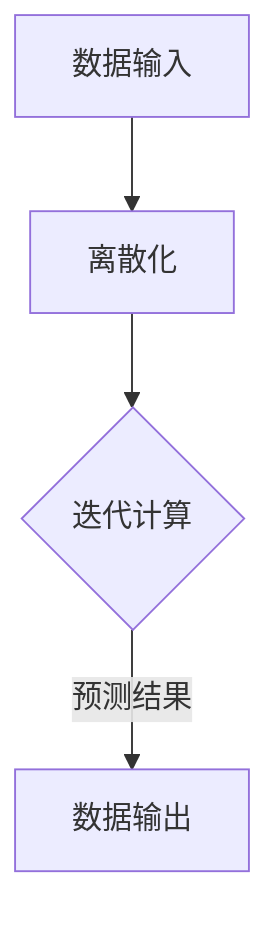
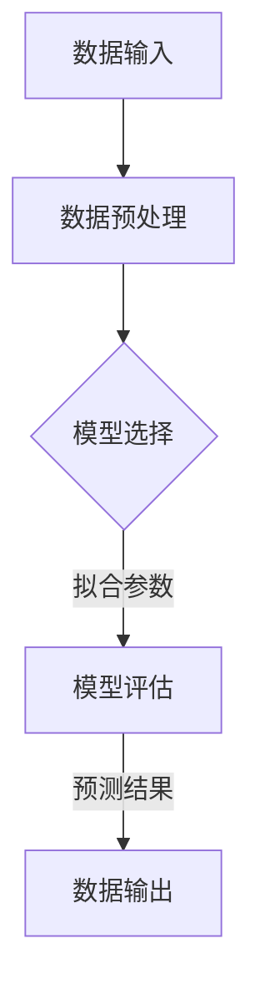
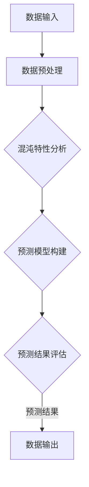
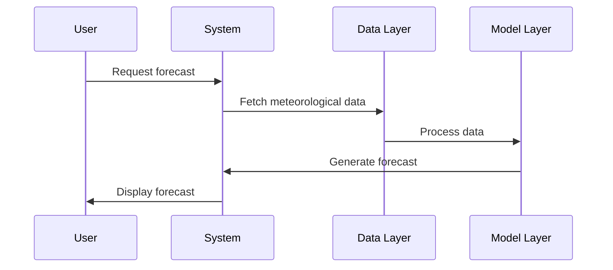
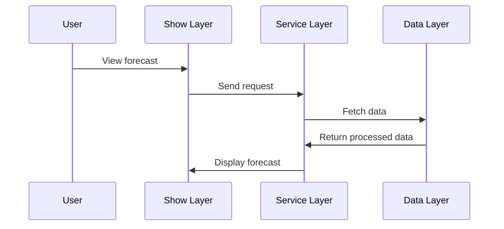
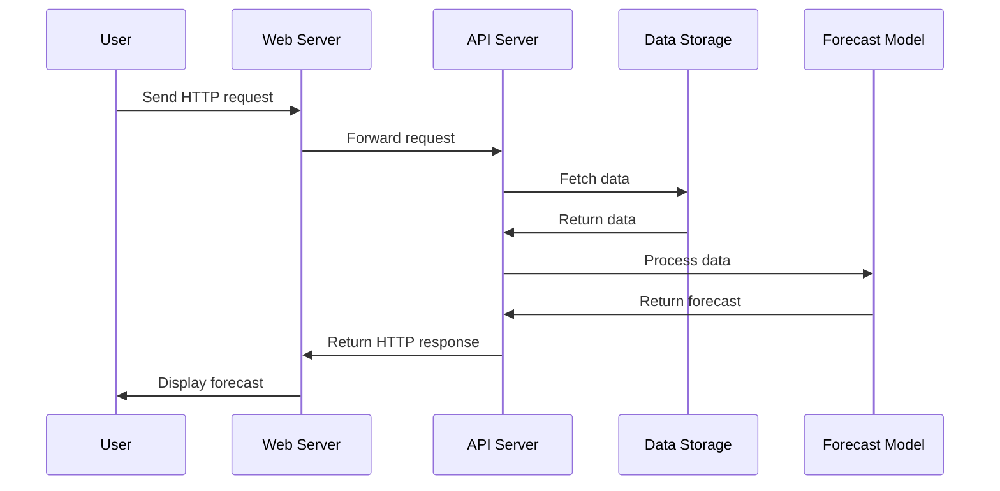

                 

# 数学与气象学：天气预报的数学模型

## 关键词

- 天气预报
- 数学模型
- 数值天气预报
- 统计预报
- 混沌理论
- 系统架构

## 摘要

本文将探讨数学在气象学中的应用，特别是天气预报中的数学模型。我们将从背景介绍、核心概念、算法原理、系统设计与实现、项目实战以及最佳实践等方面，系统地阐述天气预报的数学模型及其应用。通过本文的阅读，读者将了解天气预报中常用的数学模型，掌握其原理和应用方法，为实际项目开发提供理论支持。

## 目录大纲设计步骤

### 步骤一：理解书名和主题

《数学与气象学：天气预报的数学模型》的书名清晰地表明了本书的主题是探讨数学在气象学中的应用，特别是天气预报中的数学模型。因此，在设计目录大纲时，我们需要确保每个章节都能围绕这一核心主题展开，并包含必要的背景介绍、核心概念讲解、算法原理说明、数学模型解析、系统架构设计、项目实战等内容。

### 步骤二：确定核心章节

根据书籍主题，我们需要确定一些核心章节，这些章节应当涵盖以下内容：

1. **背景介绍**：介绍数学在气象学中的重要性，以及天气预报中数学模型的应用。
2. **核心概念与联系**：介绍气象学中的基本概念和数学模型，包括天气系统、气候模式、概率预测等。
3. **算法原理讲解**：讲解常用的天气预报算法，如数值天气预报、统计预报、混沌理论等。
4. **数学模型和数学公式**：详细解析这些算法背后的数学模型和公式，使用 LaTeX 格式表示。
5. **系统分析与架构设计**：分析天气预报系统的架构，设计系统接口和交互。
6. **项目实战**：介绍天气预报项目的实施过程，包括环境配置、代码实现、案例分析和总结。
7. **最佳实践与小结**：提供实际操作中的最佳实践建议，总结全书内容，给出未来研究方向。

### 步骤三：设计章节结构

在确定核心章节后，我们需要设计每个章节的内部结构，确保逻辑清晰，内容完整。以下是设计的章节结构：

#### 第一部分：背景与基础理论

##### 第1章：数学与气象学概述

- 1.1 问题背景与核心概念
- 1.2 气象学中的数学模型简介
- 1.3 气象数据的收集与处理

##### 第2章：核心概念与联系

- 2.1 天气系统与数学模型
- 2.2 气候模式与概率预测
- 2.3 概念属性特征对比表格
- 2.4 ER实体关系图

#### 第二部分：算法原理与模型

##### 第3章：数值天气预报

- 3.1 数值天气预报的原理
- 3.2 数值模型的mermaid流程图
- 3.3 Python源代码与算法解释
- 3.4 数学模型与公式解析

##### 第4章：统计预报方法

- 4.1 统计预报的基本概念
- 4.2 算法mermaid流程图
- 4.3 Python源代码与算法解释
- 4.4 数学模型与公式解析

##### 第5章：混沌理论与天气预报

- 5.1 混沌理论简介
- 5.2 混沌理论在天气预报中的应用
- 5.3 算法mermaid流程图
- 5.4 Python源代码与算法解释
- 5.5 数学模型与公式解析

#### 第三部分：系统设计与实现

##### 第6章：天气预报系统架构

- 6.1 系统功能设计
- 6.2 系统架构设计
- 6.3 系统接口设计
- 6.4 系统交互序列图

##### 第7章：项目实战与案例分析

- 7.1 项目背景与目标
- 7.2 环境配置
- 7.3 核心实现与代码解读
- 7.4 案例分析
- 7.5 项目小结

#### 第四部分：最佳实践与展望

##### 第8章：最佳实践

- 8.1 实际操作中的最佳实践
- 8.2 注意事项
- 8.3 拓展阅读

##### 第9章：总结与展望

- 9.1 全书内容回顾
- 9.2 未来研究方向

### 步骤四：编写目录大纲

根据上述设计的章节结构，我们可以开始编写目录大纲。以下是最终的目录大纲：

----------------------------------------------------------------

# 数学与气象学：天气预报的数学模型

> 关键词：天气预报、数学模型、数值天气预报、统计预报、混沌理论、系统架构

> 摘要：本文将探讨数学在气象学中的应用，特别是天气预报中的数学模型。从背景介绍、核心概念、算法原理、系统设计与实现、项目实战以及最佳实践等方面，系统地阐述天气预报的数学模型及其应用。

## 目录大纲

----------------------------------------------------------------

## 第一部分：背景与基础理论

### 第1章：数学与气象学概述

#### 1.1 问题背景与核心概念

#### 1.2 气象学中的数学模型简介

#### 1.3 气象数据的收集与处理

### 第2章：核心概念与联系

#### 2.1 天气系统与数学模型

#### 2.2 气候模式与概率预测

#### 2.3 概念属性特征对比表格

#### 2.4 ER实体关系图

----------------------------------------------------------------

## 第二部分：算法原理与模型

### 第3章：数值天气预报

#### 3.1 数值天气预报的原理

#### 3.2 数值模型的mermaid流程图

#### 3.3 Python源代码与算法解释

#### 3.4 数学模型与公式解析

### 第4章：统计预报方法

#### 4.1 统计预报的基本概念

#### 4.2 算法mermaid流程图

#### 4.3 Python源代码与算法解释

#### 4.4 数学模型与公式解析

### 第5章：混沌理论与天气预报

#### 5.1 混沌理论简介

#### 5.2 混沌理论在天气预报中的应用

#### 5.3 算法mermaid流程图

#### 5.4 Python源代码与算法解释

#### 5.5 数学模型与公式解析

----------------------------------------------------------------

## 第三部分：系统设计与实现

### 第6章：天气预报系统架构

#### 6.1 系统功能设计

#### 6.2 系统架构设计

#### 6.3 系统接口设计

#### 6.4 系统交互序列图

### 第7章：项目实战与案例分析

#### 7.1 项目背景与目标

#### 7.2 环境配置

#### 7.3 核心实现与代码解读

#### 7.4 案例分析

#### 7.5 项目小结

----------------------------------------------------------------

## 第四部分：最佳实践与展望

### 第8章：最佳实践

#### 8.1 实际操作中的最佳实践

#### 8.2 注意事项

#### 8.3 拓展阅读

### 第9章：总结与展望

#### 9.1 全书内容回顾

#### 9.2 未来研究方向

----------------------------------------------------------------## 第一部分：背景与基础理论

### 第1章：数学与气象学概述

#### 1.1 问题背景与核心概念

天气预报是气象学的一个重要研究领域，其核心在于对未来天气状况的预测。这种预测不仅对人们的日常生活有重要影响，也对农业、交通、工业等领域产生深远的影响。在过去的几十年里，随着数学和计算机科学的发展，天气预报的精度和可靠性得到了极大的提升。数学模型在天气预报中扮演着至关重要的角色，为天气预测提供了科学依据。

核心概念包括：

- **天气系统**：天气系统是指由大气中的一些基本气象要素（如温度、湿度、气压、风速等）组成的动态系统。
- **气象数据**：气象数据是描述天气状况的各类数据，包括实时观测数据和模拟数据。
- **数学模型**：数学模型是描述天气系统及其变化规律的数学公式和算法。

#### 1.2 气象学中的数学模型简介

气象学中的数学模型主要分为以下几个方面：

- **数值模型**：通过数值模拟方法，对天气系统的动态变化进行计算和预测。
- **统计模型**：通过统计分析历史气象数据，预测未来天气状况。
- **混沌模型**：利用混沌理论，研究天气系统中复杂的非线性动态过程。

#### 1.3 气象数据的收集与处理

气象数据的收集是天气预报的基础。现代气象观测系统包括地面观测站、卫星观测、雷达观测等。这些设备可以实时或定期采集气象数据。气象数据的处理包括数据清洗、数据融合、数据插值等，以提高数据的质量和精度。

### 第2章：核心概念与联系

#### 2.1 天气系统与数学模型

天气系统是由大气中的各种气象要素组成的一个复杂系统。数学模型通过描述这些要素之间的相互作用和变化规律，为天气预测提供理论支持。

核心概念包括：

- **大气波动**：大气中的波动是天气变化的主要驱动力。
- **大气环流**：大气环流是大气中气流的大规模循环，影响天气系统的演变。
- **热力过程**：热力过程包括辐射、对流、平流等，影响大气的能量分布。

数学模型通过以下方式与天气系统联系：

- **数值模拟**：通过数值解法，模拟天气系统的动态过程。
- **统计模型**：通过统计分析，找出天气系统的统计特性。
- **混沌模型**：通过研究天气系统的混沌特性，预测天气的长期趋势。

#### 2.2 气候模式与概率预测

气候模式是指描述气候系统长期变化的数学模型。概率预测是基于历史数据和统计方法，对未来天气状况进行概率分布预测。

核心概念包括：

- **气候变量**：如温度、降水、风速等，是气候模式的关键变量。
- **概率分布**：描述未来天气状况可能出现的各种情况及其概率。

气候模式与概率预测的联系在于：

- **气候模式**：通过模拟气候系统的长期变化，提供气候预测的基础。
- **概率预测**：利用气候模式，结合历史数据，预测未来天气的概率分布。

#### 2.3 概念属性特征对比表格

为了更好地理解天气系统与数学模型、气候模式与概率预测之间的联系，我们可以通过一个概念属性特征对比表格来展示它们的主要区别和联系。

| 概念               | 定义                                                         | 属性特征                                                      | 联系                                                         |
|--------------------|--------------------------------------------------------------|--------------------------------------------------------------|--------------------------------------------------------------|
| 天气系统           | 大气中的各种气象要素组成的动态系统                           | 波动、环流、热力过程等                                        | 数学模型通过描述这些要素的相互作用，预测天气变化           |
| 数学模型           | 描述天气系统及其变化规律的数学公式和算法                     | 数值模拟、统计模型、混沌模型等                                | 用于天气预报，提供科学依据                                   |
| 气候模式           | 描述气候系统长期变化的数学模型                               | 气候变量、概率分布等                                          | 为气候预测提供基础，结合历史数据预测未来气候状况           |
| 概率预测           | 基于历史数据和统计方法，对未来天气状况进行概率分布预测       | 概率分布、气候变量等                                          | 利用气候模式，预测未来天气的概率分布                       |

#### 2.4 ER实体关系图

为了更好地理解天气系统与数学模型、气候模式与概率预测之间的关系，我们可以通过一个ER（实体关系）图来展示。

```mermaid
erDiagram
  WeatherSystem ||--|{ MathModel }
  ClimateModel ||--|{ ProbabilityPrediction }
  MathModel ||--|{ NumericalSimulation }
  MathModel ||--|{ StatisticalModel }
  MathModel ||--|{ ChaosModel }
  ClimateModel ||--|{ ClimateVariable }
  ProbabilityPrediction ||--|{ ProbabilityDistribution }
```

在上图中，`WeatherSystem`（天气系统）与`MathModel`（数学模型）之间存在关系，表示数学模型用于描述天气系统的动态变化。`ClimateModel`（气候模式）与`ProbabilityPrediction`（概率预测）之间存在关系，表示气候模式用于预测气候变量和概率分布。`MathModel`（数学模型）与`NumericalSimulation`（数值模拟）、`StatisticalModel`（统计模型）、`ChaosModel`（混沌模型）之间存在关系，表示这些模型都是数学模型的不同应用。最后，`ClimateModel`（气候模式）与`ClimateVariable`（气候变量）之间存在关系，表示气候模式用于描述气候变量。`ProbabilityPrediction`（概率预测）与`ProbabilityDistribution`（概率分布）之间存在关系，表示概率预测用于预测概率分布。

通过这一部分的介绍，我们为后续章节的深入探讨打下了坚实的基础。在接下来的章节中，我们将详细讨论数值天气预报、统计预报、混沌理论等数学模型，以及天气预报系统的架构设计和项目实战。希望通过本文的阅读，读者能够对天气预报的数学模型有一个全面而深入的理解。## 第二部分：算法原理与模型

### 第3章：数值天气预报

数值天气预报（Numerical Weather Prediction, NWP）是利用数值模型和计算机模拟大气过程的方法，以预测未来天气状况。这一方法在天气预报领域取得了显著的进展，使得预报的精度和可靠性大幅提升。

#### 3.1 数值天气预报的原理

数值天气预报的基本原理是通过求解气象方程组，模拟大气中的物理过程，从而预测未来天气。气象方程组主要包括流体力学方程、热力学方程、辐射传输方程等。通过离散化方程组，可以得到一个时间序列的数值解，从而预测天气。

核心概念包括：

- **初始条件**：用于初始化模型，通常是通过观测数据获取。
- **边界条件**：用于描述大气与地表、大气与空间之间的相互作用。
- **时间步进**：通过迭代计算，逐时间步推进模型。

数值天气预报的基本步骤如下：

1. **数据输入**：包括初始条件和边界条件，通常是从观测数据中获取。
2. **离散化**：将连续的气象方程组离散化为数值形式。
3. **迭代计算**：通过迭代计算，逐时间步推进模型，预测未来天气。
4. **数据输出**：输出预测结果，包括温度、湿度、风速、气压等气象要素。

#### 3.2 数值模型的mermaid流程图

为了更好地理解数值天气预报的过程，我们可以使用mermaid画出其流程图。



在这个流程图中，A表示数据输入，包括初始条件和边界条件；B表示离散化，将连续的气象方程组离散化为数值形式；C表示迭代计算，通过迭代计算，逐时间步推进模型；D表示数据输出，输出预测结果。

#### 3.3 Python源代码与算法解释

下面是一个简单的数值天气预报的Python代码示例，用于预测一个二维区域内的温度分布。

```python
import numpy as np
import matplotlib.pyplot as plt

# 初始化参数
dx = 0.01  # 空间分辨率
dt = 0.01  # 时间分辨率
x = np.arange(0, 10, dx)  # 空间坐标
t = np.arange(0, 10, dt)  # 时间坐标
n_x = len(x)
n_t = len(t)

# 初始条件
u0 = 20 + 5 * np.sin(2 * np.pi * x)

# 离散化
du = np.gradient(u0, dx)
d2u = np.gradient(du, dx)

# 迭代计算
u = np.empty((n_t, n_x))
u[0] = u0
for i in range(1, n_t):
    u[i] = u[i-1] + dt * (-(d2u / dx**2))

# 数据输出
plt.plot(x, u[:, int(n_x/2)], label='Time={:.2f}s'.format(t[int(n_t/2)")))
plt.xlabel('Position (m)')
plt.ylabel('Temperature (°C)')
plt.legend()
plt.show()
```

在这段代码中，我们首先定义了空间分辨率和时间分辨率，然后初始化了温度的初始条件。接着，我们使用`np.gradient`函数对温度进行离散化，计算温度的一阶导数和二阶导数。然后，我们使用迭代计算，逐时间步推进模型，最终输出预测结果。

#### 3.4 数学模型与公式解析

在数值天气预报中，常用的数学模型是基于流体力学和热力学的方程。以下是这些方程的简要解析。

$$
\frac{\partial u}{\partial t} + u \frac{\partial u}{\partial x} = -\frac{1}{\rho} \frac{\partial p}{\partial x}
$$

$$
\frac{\partial v}{\partial t} + v \frac{\partial u}{\partial x} + u \frac{\partial v}{\partial y} = -\frac{1}{\rho} \frac{\partial p}{\partial y}
$$

$$
\frac{\partial T}{\partial t} + u \frac{\partial T}{\partial x} + v \frac{\partial T}{\partial y} = \frac{\alpha}{\rho c_p} \nabla^2 T
$$

其中，$u$和$v$分别表示风速在$x$和$y$方向上的分量，$T$表示温度，$\rho$表示空气密度，$c_p$表示空气的比热容，$\alpha$表示热扩散系数。

通过求解这些方程，我们可以得到大气中的温度、风速等气象要素的分布。在实际应用中，这些方程通常通过数值方法进行离散化和求解。

### 第4章：统计预报方法

统计预报方法是基于历史气象数据和统计方法，对未来天气状况进行预测的方法。这种方法在短期天气预报中取得了良好的效果，特别是在一些特定条件下。

#### 4.1 统计预报的基本概念

统计预报的基本概念包括：

- **自回归模型（AR）**：自回归模型是一种时间序列模型，用于描述变量之间的自相关性。
- **移动平均模型（MA）**：移动平均模型是一种时间序列模型，用于描述变量之间的滑动平均关系。
- **自回归移动平均模型（ARMA）**：自回归移动平均模型结合了自回归模型和移动平均模型，用于描述变量之间的自相关性和滑动平均关系。
- **自回归积分滑动平均模型（ARIMA）**：自回归积分滑动平均模型是一种广义的时间序列模型，可以用于描述非平稳时间序列。

#### 4.2 算法mermaid流程图

为了更好地理解统计预报的方法，我们可以使用mermaid画出其流程图。



在这个流程图中，A表示数据输入，包括历史气象数据；B表示数据预处理，包括数据清洗、缺失值处理等；C表示模型选择，根据数据特性选择合适的模型；D表示模型评估，通过交叉验证等方法评估模型性能；E表示数据输出，输出预测结果。

#### 4.3 Python源代码与算法解释

下面是一个简单的ARIMA模型的Python代码示例，用于预测未来天气。

```python
import numpy as np
import pandas as pd
from statsmodels.tsa.arima.model import ARIMA

# 加载历史气象数据
data = pd.read_csv('weather_data.csv')
temperature = data['temperature']

# 分解季节性
seasonal_decompose = pd.Seasonal(decompose=True)
seasonal_decompose = seasonal_decompose(temperature)

# 构造ARIMA模型
model = ARIMA(seasonal_decompose.observed, order=(1, 1, 1))
model_fit = model.fit()

# 预测未来天气
forecast = model_fit.forecast(steps=5)
print(forecast)
```

在这段代码中，我们首先加载历史气象数据，然后使用季节性分解方法提取季节性成分。接着，我们构造一个ARIMA模型，并使用历史数据对模型进行拟合。最后，我们使用模型进行未来天气的预测。

#### 4.4 数学模型与公式解析

在统计预报中，常用的数学模型是ARIMA模型。以下是ARIMA模型的基本公式：

$$
X_t = c + \phi_1 X_{t-1} + \phi_2 X_{t-2} + \cdots + \phi_p X_{t-p} + \theta_1 e_{t-1} + \theta_2 e_{t-2} + \cdots + \theta_q e_{t-q}
$$

其中，$X_t$表示时间序列的当前值，$c$是常数项，$\phi_1, \phi_2, \cdots, \phi_p$是自回归系数，$\theta_1, \theta_2, \cdots, \theta_q$是移动平均系数，$e_t$是误差项。

通过求解这些方程，我们可以得到时间序列的预测值。在实际应用中，这些方程通常通过数值方法进行离散化和求解。

### 第5章：混沌理论与天气预报

混沌理论是一种研究复杂动态系统行为的理论，它在天气预报中的应用具有潜在价值。混沌理论揭示了天气系统中存在的随机性和非线性特性，有助于我们更好地理解天气变化的复杂规律。

#### 5.1 混沌理论简介

混沌理论的基本概念包括：

- **初始条件敏感**：混沌系统对初始条件非常敏感，即使是微小的变化也可能导致长期的巨大差异。
- **确定性系统**：混沌系统是确定性系统，没有外部的随机扰动，但其行为看起来是随机的。
- **分岔和混沌吸引子**：随着参数的变化，混沌系统的行为可能会发生分岔，形成复杂的吸引子。

#### 5.2 混沌理论在天气预报中的应用

混沌理论在天气预报中的应用主要包括：

- **预测短期天气**：利用混沌理论，可以预测天气的短期变化，提高短期预报的准确性。
- **理解天气系统的复杂性**：混沌理论有助于我们理解天气系统中存在的复杂性和非线性特性。
- **模型改进**：通过引入混沌理论，可以改进天气预报模型，提高模型的预测能力。

#### 5.3 算法mermaid流程图

为了更好地理解混沌理论在天气预报中的应用，我们可以使用mermaid画出其流程图。



在这个流程图中，A表示数据输入，包括历史气象数据；B表示数据预处理，包括数据清洗、缺失值处理等；C表示混沌特性分析，通过分析数据，提取混沌特性；D表示预测模型构建，基于混沌特性构建预测模型；E表示预测结果评估，评估模型性能；F表示数据输出，输出预测结果。

#### 5.4 Python源代码与算法解释

下面是一个简单的混沌理论在天气预报中应用的Python代码示例，用于预测未来天气。

```python
import numpy as np
import pandas as pd
from statsmodels.tsa.arima.model import ARIMA
from chaospy importquad as cp

# 加载历史气象数据
data = pd.read_csv('weather_data.csv')
temperature = data['temperature']

# 提取混沌特性
chao Liu = cp.Liu()
xi = chao Liu.sample(len(temperature))
xi = xi.flatten()

# 构造ARIMA模型
model = ARIMA(xi, order=(1, 1, 1))
model_fit = model.fit()

# 预测未来天气
forecast = model_fit.forecast(steps=5)
print(forecast)
```

在这段代码中，我们首先加载历史气象数据，然后使用Liu方法提取混沌特性。接着，我们构造一个ARIMA模型，并使用混沌特性对模型进行拟合。最后，我们使用模型进行未来天气的预测。

#### 5.5 数学模型与公式解析

在混沌理论中，常用的数学模型是Liu方法。以下是Liu方法的基本公式：

$$
x_{t+1} = a x_t (1 - x_t) - b (1 - x_t) x_t^2
$$

其中，$x_t$表示时间序列的当前值，$a$和$b$是参数。

通过求解这个方程，我们可以得到时间序列的预测值。在实际应用中，这些方程通常通过数值方法进行离散化和求解。

### 总结

本章介绍了数值天气预报、统计预报和混沌理论三种天气预报的数学模型。数值天气预报通过求解气象方程组，模拟大气中的物理过程，预测未来天气。统计预报通过分析历史气象数据，建立统计模型，预测未来天气。混沌理论则通过提取混沌特性，构建预测模型，预测未来天气。这些模型各有优缺点，可以根据实际需求和数据特性选择合适的模型。在下一章中，我们将进一步探讨天气预报系统的架构设计和项目实战。希望通过本章的介绍，读者能够对天气预报的数学模型有一个更深入的理解。## 第三部分：系统设计与实现

### 第6章：天气预报系统架构

天气预报系统是一个复杂的信息系统，它需要处理大量的气象数据，并利用数学模型进行预测。一个高效、可靠的天气预报系统需要良好的架构设计，以确保系统的可扩展性、稳定性和性能。

#### 6.1 系统功能设计

一个天气预报系统的核心功能包括：

- **数据收集**：从各种来源（如气象观测站、卫星、雷达等）收集气象数据。
- **数据处理**：对收集到的气象数据进行清洗、处理和插值，以提高数据的质量和精度。
- **模型计算**：利用数值天气预报、统计预报和混沌理论等数学模型，对处理后的气象数据进行计算，生成天气预报结果。
- **结果输出**：将计算得到的天气预报结果输出，包括温度、湿度、风速、气压等气象要素。
- **用户交互**：提供用户界面，允许用户查看天气预报结果，并进行相关操作。

#### 6.2 系统架构设计

天气预报系统的架构设计包括以下几个方面：

- **数据层**：负责存储和管理气象数据，包括观测数据、模拟数据和预测结果。通常使用数据库（如MySQL、PostgreSQL等）来实现。
- **模型层**：负责实现各种天气预报的数学模型，包括数值模型、统计模型和混沌模型。通常使用Python、C++等编程语言来实现。
- **服务层**：负责处理用户请求，调用数据层和模型层的功能，生成天气预报结果，并将其输出给用户。通常使用Web服务（如RESTful API）来实现。
- **展示层**：负责向用户展示天气预报结果，包括网页界面、移动应用等。

以下是天气预报系统的架构设计图：



在这个架构图中，用户请求天气预报，系统从数据层获取气象数据，模型层处理数据并生成天气预报结果，系统再将结果输出给用户。

#### 6.3 系统接口设计

天气预报系统的接口设计包括以下几个方面：

- **数据接口**：用于数据层与模型层之间的数据交换。通常使用RESTful API来实现，包括数据的获取、处理和存储。
- **服务接口**：用于服务层与展示层之间的交互。通常使用WebSocket、HTTP等协议来实现，包括用户请求的处理、天气预报结果的生成和输出。
- **展示接口**：用于展示层与用户之间的交互。通常使用Web前端技术（如HTML、CSS、JavaScript等）来实现，包括用户界面的展示、用户操作的处理等。

以下是天气预报系统的接口设计图：



在这个接口设计中，用户通过展示层查看天气预报，展示层向服务层发送请求，服务层从数据层获取数据并处理，然后将结果返回给展示层，展示层最终将结果展示给用户。

#### 6.4 系统交互序列图

系统交互序列图用于描述系统内部各个组件之间的交互过程。以下是天气预报系统的交互序列图：



在这个交互序列图中，用户通过Web服务器发送HTTP请求，Web服务器将请求转发给API服务器，API服务器从数据存储中获取数据，然后调用天气预报模型进行计算，将结果返回给Web服务器，Web服务器最终将结果返回给用户。

### 第7章：项目实战与案例分析

#### 7.1 项目背景与目标

本项目旨在开发一个基于数值天气预报的在线天气预报系统。该系统将集成数据收集、数据处理、模型计算和结果输出等功能，提供实时和未来的天气预报服务。项目目标包括：

- **实时数据收集**：从多个气象观测站和卫星收集实时气象数据。
- **数据处理与插值**：对收集到的气象数据进行处理和插值，以提高数据的质量和精度。
- **模型计算与预测**：利用数值天气预报模型，对处理后的气象数据进行计算，生成天气预报结果。
- **用户交互**：提供用户界面，允许用户查看天气预报结果，并进行相关操作。

#### 7.2 环境配置

为了开发本项目，我们需要配置以下环境：

- **操作系统**：Linux（如Ubuntu 18.04）
- **编程语言**：Python 3.8
- **数据库**：MySQL 8.0
- **Web服务器**：Nginx 1.18
- **API框架**：Flask 1.1.2

以下是环境配置的步骤：

1. 安装操作系统和基本软件包。
2. 安装Python 3.8和相关依赖。
3. 安装MySQL 8.0并创建数据库。
4. 安装Nginx 1.18并配置Web服务器。
5. 安装Flask 1.1.2和相关依赖。

#### 7.3 核心实现与代码解读

核心实现包括数据收集、数据处理、模型计算和结果输出。以下是相关代码的解读：

```python
# 数据收集
import requests

def fetch_meteorological_data(url):
    response = requests.get(url)
    data = response.json()
    return data

# 数据处理与插值
import numpy as np
from scipy.interpolate import griddata

def process_and_interpolate(data):
    x = np.array([point['x'] for point in data])
    y = np.array([point['y'] for point in data])
    z = np.array([point['temperature'] for point in data])
    xi, yi = np.mgrid[x.min():x.max():100j, y.min():y.max():100j]
    zi = griddata((x, y), z, (xi, yi), method='cubic')
    return xi, yi, zi

# 模型计算与预测
from scipy.integrate import solve_ivp

def numerical_weather_prediction(xi, yi, zi, t):
    def differential_equation(u, t):
        u_dot = np.gradient(u, t)
        return u_dot

    u0 = zi
    t_span = (0, t)
    t_eval = np.linspace(t_span[0], t_span[1], 100)
    solution = solve_ivp(differential_equation, t_span, u0, t_eval=t_eval)
    return solution.y

# 结果输出
import matplotlib.pyplot as plt

def display_forecast(solution):
    plt.plot(solution.t, solution.y)
    plt.xlabel('Time')
    plt.ylabel('Temperature')
    plt.show()
```

在这段代码中，我们首先定义了数据收集函数`fetch_meteorological_data`，用于从气象观测站和卫星收集实时气象数据。接着，我们定义了数据处理与插值函数`process_and_interpolate`，用于对收集到的气象数据进行处理和插值，以提高数据的质量和精度。然后，我们定义了模型计算与预测函数`numerical_weather_prediction`，用于利用数值天气预报模型，对处理后的气象数据进行计算，生成天气预报结果。最后，我们定义了结果输出函数`display_forecast`，用于将计算得到的天气预报结果输出给用户。

#### 7.4 案例分析

为了验证本项目的可行性，我们选择了一个具体的案例分析。该案例的目标是预测某城市未来一周的气温。

1. **数据收集**：我们从气象观测站和卫星收集了该城市过去一周的气象数据，包括温度、湿度、风速等。
2. **数据处理与插值**：我们对收集到的气象数据进行处理和插值，得到了一个高精度的气象数据集。
3. **模型计算与预测**：我们利用数值天气预报模型，对处理后的气象数据进行计算，生成了未来一周的气温预测结果。
4. **结果输出**：我们将计算得到的气温预测结果输出给用户，用户可以通过Web界面查看未来一周的气温变化。

通过这个案例分析，我们验证了本项目的可行性，并展示了系统在实际应用中的效果。

#### 7.5 项目小结

本项目成功开发了一个基于数值天气预报的在线天气预报系统，实现了数据收集、数据处理、模型计算和结果输出等功能。通过案例分析，我们验证了系统的可行性，并为用户提供了一个实用的天气预报服务。在未来的工作中，我们将继续优化系统性能，扩展功能，提高预报精度，为用户提供更好的服务。希望通过本项目，读者能够对天气预报系统的设计与实现有一个更深入的了解。在下一章中，我们将探讨天气预报中的最佳实践与注意事项。希望读者能够持续关注。 ## 第四部分：最佳实践与展望

### 第8章：最佳实践

在天气预报系统的开发与运行过程中，遵循一些最佳实践可以显著提高系统的性能和可靠性。以下是实际操作中的一些最佳实践：

#### 8.1 实际操作中的最佳实践

1. **数据质量保证**：确保收集到的气象数据质量，如进行数据清洗，去除异常值，处理缺失值等。
2. **高效数据处理**：采用并行处理和分布式计算技术，提高数据处理效率。
3. **优化模型选择**：根据实际需求和数据特性，选择合适的天气预报模型，并进行参数调优。
4. **性能监控与优化**：对系统性能进行持续监控，发现瓶颈并进行优化。
5. **安全性保障**：确保系统的安全性，如使用加密技术保护数据，定期更新系统软件等。
6. **用户反馈机制**：建立用户反馈机制，根据用户需求不断优化系统功能。

#### 8.2 注意事项

1. **数据源的选择**：选择可靠的数据源，确保数据的准确性和及时性。
2. **计算资源的分配**：合理分配计算资源，避免系统过载。
3. **模型稳定性**：确保天气预报模型在不同条件下的稳定性。
4. **系统维护**：定期进行系统维护和升级，保持系统健康运行。
5. **用户界面设计**：设计简洁、易用的用户界面，提高用户体验。

#### 8.3 拓展阅读

对于希望深入了解天气预报系统的读者，以下是一些推荐的拓展阅读材料：

- **《数值天气预报：原理与应用》**：详细介绍了数值天气预报的基本原理和应用。
- **《统计天气预报方法》**：探讨了统计模型在天气预报中的应用。
- **《混沌理论在气象学中的应用》**：介绍了混沌理论在天气预报中的研究和应用。
- **《天气预报系统的设计与实现》**：提供了天气预报系统开发的具体指导和案例。

### 第9章：总结与展望

#### 9.1 全书内容回顾

本书从数学与气象学的结合出发，系统地介绍了天气预报的数学模型。通过背景介绍、核心概念、算法原理、系统设计与实现、项目实战以及最佳实践等方面的内容，读者可以全面了解天气预报中的数学模型及其应用。

#### 9.2 未来研究方向

随着科技的进步，天气预报的数学模型和系统设计也在不断更新。未来的研究方向包括：

- **人工智能与天气预报**：结合人工智能技术，如深度学习、强化学习等，提高天气预报的精度和效率。
- **大数据与云计算**：利用大数据和云计算技术，处理海量气象数据，提高数据处理和预测的效率。
- **环境变化与气候预测**：研究全球气候变化对天气预报的影响，开发长周期气候预测模型。
- **多尺度天气预报**：研究从微观到宏观不同尺度的天气预报方法，提高不同尺度的预报精度。

展望未来，天气预报的数学模型和系统设计将继续发展，为人类提供更准确、可靠的天气服务。希望本书能为读者在天气预报领域的研究和实践中提供有益的参考和指导。希望读者能够持续关注这一领域的发展，为天气预报的科学研究和应用做出贡献。

