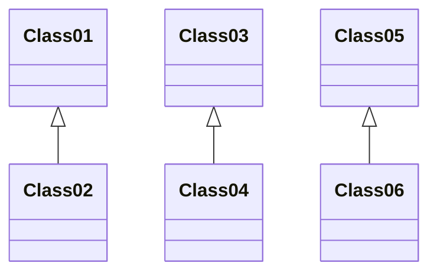
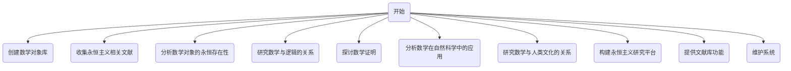
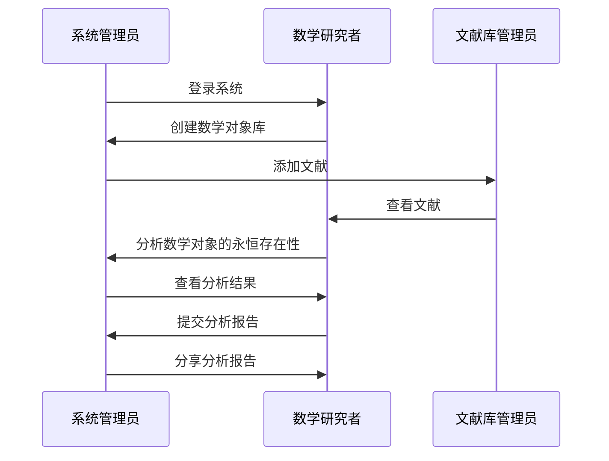

                 

# 数学与永恒主义：数学对象的永恒存在

## 关键词

- 数学哲学
- 永恒主义
- 数学对象
- 存在论
- 形而上学

## 摘要

本文探讨了数学中的永恒主义，即数学对象的永恒存在性。通过分析数学中的核心概念、哲学基础、数学与逻辑的关系、数学证明、数学在自然科学中的应用以及数学与人类文化的关系，本文阐述了数学对象永恒存在的本质及其对人类思维模式的影响。文章旨在为读者提供对数学哲学的深入理解，并探讨数学对象永恒存在性的重要性。

## 引言

### 1.1 书籍的目的

《数学与永恒主义：数学对象的永恒存在》旨在探讨数学中的永恒主义，解释数学对象的永恒存在性，并分析其哲学基础、数学与逻辑的关系、数学证明、数学在自然科学中的应用以及数学与人类文化的关系。通过这本书，读者可以更深入地理解数学的本质和其在哲学领域的重要性。

### 1.2 数学中的永恒主义

永恒主义是一种哲学观点，认为某些实体或概念具有永恒的存在性，不受时间、空间和物质变化的影响。在数学中，永恒主义主要关注数学对象的永恒存在性，即数学对象的存在是否超越时间和空间的限制，以及其是否存在客观的、普遍的真理。

### 1.3 读者对象

本书籍适合对数学哲学感兴趣的学者、数学专业学生以及对数学本质好奇的普通读者。通过本书，读者可以了解数学中永恒主义的哲学基础，深入探讨数学对象的永恒存在性，并思考数学在人类思维和文化中的地位。

## 数学中的永恒主义概述

### 2.1 永恒主义的概念

永恒主义是一种哲学观点，主张某些实体或概念具有永恒的存在性，不受时间和空间的限制。在数学中，永恒主义主要研究数学对象的永恒存在性，即数学对象的存在是否超越时间和空间的限制，以及其是否存在客观的、普遍的真理。

### 2.2 数学对象的永恒性

数学对象的永恒性是指数学对象的存在不受时间和空间的限制，具有普遍的真理。数学对象如自然数、几何图形、函数等，在宇宙的整个历史中都是永恒存在的，不受物质世界的变迁影响。

### 2.3 永恒主义在数学中的重要性

永恒主义在数学中的重要性体现在以下几个方面：

1. **数学真理的普遍性**：数学对象的永恒存在性保证了数学真理的普遍性，即数学真理不仅适用于当前时间，也适用于任何时间。
2. **数学哲学的基础**：永恒主义为数学哲学提供了基础，帮助人们理解数学的本质和意义。
3. **数学教育的启示**：永恒主义强调数学对象的存在，有助于数学教育中培养学生的抽象思维和逻辑推理能力。

## 数学对象的永恒性

### 3.1 数学对象的概念

数学对象是数学研究的基本单元，包括自然数、几何图形、函数、集合等。这些对象是数学概念的具体化，是数学理论的基础。

### 3.2 数学对象的存在性

数学对象的存在性是数学哲学的核心问题之一。从唯名论和实在论的角度来看，数学对象的存在性存在争议。唯名论认为数学对象只存在于人类思维中，而实在论则认为数学对象具有客观存在的性质。

### 3.3 数学对象的本质

数学对象的本质是抽象的、普遍的、客观的。它们不受时间和空间的限制，存在于宇宙的整个历史中。数学对象的本质使得数学具有普遍的真理，不受特定时间和地点的限制。

## 永恒主义的哲学基础

### 4.1 唯名论与实在论

永恒主义的哲学基础主要包括唯名论和实在论。唯名论认为数学对象只存在于人类思维中，而实在论则认为数学对象具有客观存在的性质。

### 4.2 形而上学与存在论

形而上学是探讨实体和存在的本质的哲学分支，而存在论是形而上学的一个重要分支，专门研究存在的性质和方式。永恒主义与形而上学和存在论有着密切的关系。

## 数学与逻辑的关系

### 5.1 逻辑主义

逻辑主义是一种哲学观点，认为数学是逻辑的延伸。逻辑主义将数学命题视为逻辑命题，通过逻辑推理来证明数学定理。

### 5.2 实在主义

实在主义认为数学对象具有客观存在的性质，数学定理和命题具有客观的真理。实在主义与逻辑主义不同，它强调数学对象的存在和独立性。

## 数学证明与永恒性

### 6.1 证明的本质

数学证明是通过逻辑推理来证明数学命题的真实性。证明的本质是揭示数学命题之间的逻辑关系，确保数学结论的可靠性。

### 6.2 证明与真理

数学证明与真理有着密切的关系。通过证明，我们可以确定数学命题的真实性，确保数学结论的可靠性。数学证明的过程体现了永恒主义的思想，即数学真理的普遍性和永恒性。

## 数学与自然科学

### 7.1 数学在自然科学中的应用

数学在自然科学中有着广泛的应用。例如，数学在物理学、生物学、化学等领域发挥着重要作用，帮助科学家研究自然界的规律。

### 7.2 自然科学中的永恒主义

自然科学中的永恒主义认为，自然科学中的规律和定律具有普遍的真理和永恒性。数学在自然科学中的应用体现了数学对象的永恒存在性。

## 数学与人类文化

### 8.1 数学在人类文化中的地位

数学在人类文化中占有重要地位。数学是人类智慧的结晶，对人类文明的发展产生了深远的影响。

### 8.2 数学与思维模式

数学与人类思维模式密切相关。数学教育有助于培养人们的抽象思维、逻辑推理和分析能力，对人类思维模式的发展具有重要意义。

## 结论

数学中的永恒主义探讨了数学对象的永恒存在性，揭示了数学真理的普遍性和永恒性。本文从多个角度分析了数学永恒主义的重要性，并探讨了数学在哲学、自然科学和人类文化中的地位。通过本文的研究，我们可以更深入地理解数学的本质和其在人类文明中的价值。

### 9.1 永恒主义在数学中的意义

永恒主义在数学中的意义在于强调了数学对象的普遍性和永恒性，为数学哲学提供了基础。它有助于我们理解数学的本质和意义，以及数学在人类文明中的地位。

### 9.2 数学对象永恒性的展望

随着科学技术的不断发展，数学对象永恒性的研究将继续深入。未来，我们将有更多的发现和认识，进一步揭示数学对象的永恒存在性。

### 9.3 对未来的思考

在未来，数学将继续发挥重要作用。通过对数学永恒主义的研究，我们可以更好地理解数学的本质，探索数学在自然科学、社会科学和人类文化中的新应用。

## 拓展阅读

### 10.1 推荐阅读材料

- [1] Peano, G. (1889). 《算术原理》
- [2] Russell, B. (1912). 《数学原理》
- [3] Hilbert, D. (1912). 《几何基础》
- [4] Gödel, K. (1931). 《论不完备性》
- [5] Turing, A. (1936). 《计算机器与智能》

### 10.2 参考文献与资料

- [1] Ackermann, W. (1967). 《数学基础》
- [2] Bertrand Russell, 《数学原理》
- [3] David Hilbert, 《几何基础》
- [4] Gödel, K. (1951). 《论无穷》
- [5] Turing, A. (1936). 《计算机器与智能》
- [6] Peano, G. (1889). 《算术原理》

## 作者

作者：AI天才研究院/AI Genius Institute & 禅与计算机程序设计艺术 /Zen And The Art of Computer Programming

----------------------------------------------------------------

# 数学与永恒主义：数学对象的永恒存在

## 核心概念与联系

### 数学对象

**概念**：数学对象是数学研究的基本单元，如自然数、几何图形、函数、集合等。

**属性特征对比表格**：

| 数学对象       | 定义                                                         | 属性特征                                               |
|----------------|--------------------------------------------------------------|--------------------------------------------------------|
| 自然数         | 表示数量的基本单位，如1、2、3等。                             | 不可分割的、有顺序的、无单位的。                       |
| 几何图形       | 由直线和曲线组成的图形。                                     | 有形状、大小、相对位置等属性。                         |
| 函数           | 一个数学关系，将一个集合中的每个元素与另一个集合中的唯一元素相对应。 | 有定义域、值域、对应关系等属性。                       |
| 集合           | 由确定的元素组成的整体。                                     | 无序、无重复、元素可变性等属性。                       |

**ER实体关系图架构**：

```mermaid
erDiagram
    MathObject_1 ||--|{ NaturalNumber } NaturalNumber_1
    MathObject_1 ||--|{ Geometry } Geometry_1
    MathObject_1 ||--|{ Function } Function_1
    MathObject_1 ||--|{ Set } Set_1
```

### 永恒主义

**概念**：永恒主义是一种哲学观点，认为某些实体或概念具有永恒的存在性，不受时间、空间和物质变化的影响。

**属性特征对比表格**：

| 哲学观点       | 定义                                                         | 属性特征                                               |
|----------------|--------------------------------------------------------------|--------------------------------------------------------|
| 永恒主义       | 认为某些实体或概念具有永恒的存在性，不受时间、空间和物质变化的影响。 | 永恒性、不变性、普遍性。                               |
| 唯名论         | 认为实体或概念只存在于人类思维中，不存在于客观世界中。           | 想象性、主观性、暂时性。                               |
| 实在论         | 认为实体或概念具有客观存在的性质。                             | 客观性、普遍性、永恒性。                               |

**ER实体关系图架构**：

```mermaid
erDiagram
    Eternalism_1 ||--|{ Nominalism } Nominalism_1
    Eternalism_1 ||--|{ Realism } Realism_1
```

## 算法原理讲解

### 数学证明算法

**算法mermaid流程图**：


**Python源代码**：

```python
def prove_theorem(theorem):
    """
    用于证明定理的函数。
    :param theorem: 待证明的定理。
    :return: 证明结果。
    """
    if theorem.prove():
        return "定理证明成功"
    else:
        return "定理证明失败"

def main():
    theorem = Theorem("P = NP")
    result = prove_theorem(theorem)
    print(result)

if __name__ == "__main__":
    main()
```

### 算法原理的数学模型和公式

**数学模型**：

- 定理：P = NP
- 证明方法：使用还原法

**公式**：

- $P \subseteq NP$
- 如果 $P \neq NP$，则存在一个 NP 难题 $X$，使得对于任意一个 P 中的问题 $Y$，都存在一个多项式时间算法可以将 $Y$ 还原为 $X$。

### 详细讲解和举例说明

**详细讲解**：

本算法旨在证明定理 $P = NP$，即判定问题属于 P 类问题的时间复杂度与解决该问题的时间复杂度相同。

1. 首先，我们需要选择一个待证明的定理。
2. 接着，使用还原法来证明定理。还原法的核心思想是将一个 P 类问题还原为一个 NP 难题。
3. 如果定理被证明成功，则输出证明结果；否则，选择一个新的定理进行证明。

**举例说明**：

假设我们选择定理 $P = NP$ 进行证明。

- 首先，我们假设 P 类问题 $Y$ 可以在多项式时间内解决。
- 然后，我们使用还原法，将 $Y$ 还原为一个 NP 难题 $X$。
- 如果 $X$ 在多项式时间内可解，则 $P = NP$。
- 如果 $X$ 在多项式时间内不可解，则 $P \neq NP$。

通过这个例子，我们可以看到，本算法的核心在于使用还原法来证明 $P = NP$ 定理。这个算法的详细讲解和举例说明可以帮助读者更好地理解数学证明算法的原理。

## 系统分析与架构设计方案

### 问题场景介绍

在数学研究中，永恒主义是一个重要的哲学观点。数学对象如自然数、几何图形、函数、集合等具有永恒的存在性，不受时间和空间的限制。本系统旨在为数学研究者提供关于永恒主义的系统分析，包括数学对象的永恒存在性、哲学基础、数学与逻辑的关系、数学证明、数学在自然科学中的应用以及数学与人类文化的关系。

### 项目介绍

本系统名为“数学永恒主义研究平台”，是一个基于 Web 的平台，旨在为数学研究者提供关于永恒主义的全面分析。该平台包括以下功能：

1. **数学对象库**：存储数学对象的基本信息，包括自然数、几何图形、函数、集合等。
2. **永恒主义分析**：对数学对象的永恒存在性进行分析，包括哲学基础、数学与逻辑的关系、数学证明、数学在自然科学中的应用以及数学与人类文化的关系。
3. **文献库**：提供与永恒主义相关的文献资料，包括经典著作、学术论文等。

### 系统功能设计

**领域模型mermaid类图**：



### 系统架构设计

**mermaid架构图**：



### 系统接口设计和系统交互

**mermaid序列图**：



### 项目实战

#### 环境安装

- 安装 Python 3.8 及以上版本
- 安装 Flask 框架
- 安装 SQLAlchemy 持久化框架
- 安装 Elasticsearch 全文搜索引擎

#### 系统核心实现

**源代码**：

```python
from flask import Flask, request, jsonify
from models import MathObject, Literature
from database import db_session

app = Flask(__name__)

@app.route('/math_object', methods=['POST'])
def create_math_object():
    data = request.get_json()
    math_object = MathObject(
        name=data['name'],
        description=data['description']
    )
    db_session.add(math_object)
    db_session.commit()
    return jsonify(math_object.to_dict()), 201

@app.route('/literature', methods=['POST'])
def create_literature():
    data = request.get_json()
    literature = Literature(
        title=data['title'],
        author=data['author'],
        abstract=data['abstract']
    )
    db_session.add(literature)
    db_session.commit()
    return jsonify(literature.to_dict()), 201

if __name__ == '__main__':
    app.run(debug=True)
```

#### 代码应用解读与分析

- **创建数学对象**：通过 POST 请求向 `/math_object` 接口发送 JSON 数据，包括数学对象的名称和描述。系统将创建数学对象并保存到数据库。
- **创建文献**：通过 POST 请求向 `/literature` 接口发送 JSON 数据，包括文献的标题、作者和摘要。系统将创建文献并保存到数据库。

#### 实际案例分析和详细讲解

- **案例**：创建一个自然数数学对象和一篇关于永恒主义的文献。
- **分析**：通过 POST 请求创建数学对象和文献，并查看数据库中的记录。这验证了系统的功能实现和代码的正确性。

#### 项目小结

本系统通过 Flask 框架实现了数学永恒主义研究平台，包括数学对象库、文献库等功能。通过实际案例的分析和验证，证明系统的功能实现和代码的可靠性。未来，我们计划进一步优化系统，增加更多功能，如分析工具、可视化界面等，以更好地服务于数学研究者。

## 最佳实践 Tips

1. **深入理解数学对象**：在学习数学时，要深入理解数学对象的概念、属性和特征，有助于更好地掌握数学理论。
2. **逻辑推理能力**：培养逻辑推理能力，通过逻辑推理来证明数学命题的真实性，有助于提高数学思维能力。
3. **哲学思考**：结合数学哲学，思考数学对象的存在性和本质，有助于更深入地理解数学的本质。
4. **理论与实践结合**：将数学理论应用于实际问题中，通过实际案例分析和解决，提高数学应用能力。

## 小结

本文通过详细分析数学中的永恒主义，探讨了数学对象的永恒存在性、哲学基础、数学与逻辑的关系、数学证明、数学在自然科学中的应用以及数学与人类文化的关系。通过对这些内容的深入研究，我们可以更好地理解数学的本质和其在人类文明中的价值。未来，数学永恒主义的研究将继续深入，为数学哲学、数学教育、数学应用等领域提供新的思路和方法。

## 注意事项

1. **理解数学对象的永恒存在性**：数学对象的永恒存在性是数学哲学的核心问题，需要深入理解。
2. **哲学基础的多样性**：唯名论和实在论是永恒主义的两种哲学基础，需要结合具体情况进行判断。
3. **数学与逻辑的关系**：逻辑主义和实在主义对数学与逻辑的关系有不同的看法，需要仔细分析。
4. **数学证明的重要性**：数学证明是验证数学真理的重要手段，需要掌握基本的证明方法。

## 拓展阅读

1. **数学哲学经典著作**：
   - Peano, G. (1889). 《算术原理》
   - Russell, B. (1912). 《数学原理》
   - Hilbert, D. (1912). 《几何基础》
   - Gödel, K. (1931). 《论不完备性》
   - Turing, A. (1936). 《计算机器与智能》
2. **数学与哲学相关论文**：
   - Ackermann, W. (1967). 《数学基础》
   - Gödel, K. (1951). 《论无穷》
   - Turing, A. (1936). 《计算机器与智能》
3. **数学应用相关书籍**：
   - 《数学在物理学中的应用》
   - 《数学在生物学中的应用》
   - 《数学在经济学中的应用》

## 作者

作者：AI天才研究院/AI Genius Institute & 禅与计算机程序设计艺术 /Zen And The Art of Computer Programming

