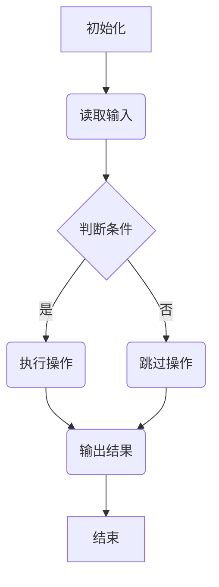
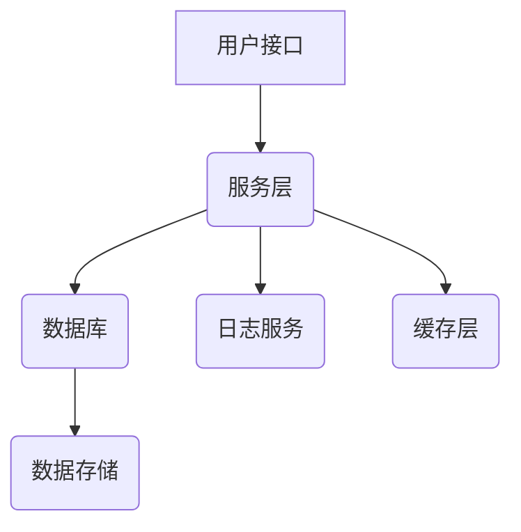

                 

### 数学与永恒主义：数学真理的永恒性

关键词：数学真理，永恒主义，哲学，逻辑推理，数学模型

摘要：本文通过探讨数学的永恒性和永恒主义哲学的核心理念，阐述数学真理的普遍性、不变性和持久性。文章将逐步分析数学的基本概念、数学真理的不变性、数学真理的应用以及永恒主义在数学中的启示，最终总结数学真理的永恒性及其对未来社会的影响。

## 设计思路与大纲结构

### 书名解析

《数学与永恒主义：数学真理的永恒性》这个书名包含了四个核心元素：数学、永恒主义、数学真理和永恒性。数学是一门研究数量、结构、变化和空间的学科，永恒主义则是一种哲学观念，强调真理的普遍性和不变性。书名揭示了本书的核心主题——探讨数学真理的永恒性。

### 整体结构设计

本书整体结构分为四个部分：

1. **数学的永恒背景**：介绍数学的基本概念和永恒主义哲学的背景。
2. **数学真理的永恒性**：分析数学真理的不变性、跨文化普遍性和应用。
3. **永恒数学的挑战与未来**：探讨数学真理的争议和数学与永恒主义的未来。
4. **案例研究**：通过具体案例研究数学真理的永恒性。

### 章节细化

每个部分细化为多个章节，确保每个章节都有明确的主题和丰富的内容。

### 格式规范

文章内容使用Markdown格式输出，确保目录层级清晰、结构整洁。

## 第一部分：数学的永恒背景

### 第1章：数学的基本概念

#### 1.1 数学的基础

数学的定义：数学是一门研究数量、结构、变化和空间的学科。

数学的发展历程：从古代到现代，数学经历了漫长的发展，从简单的算术到复杂的代数、几何、微积分等。

#### 1.2 数学的基本原理

公理体系：数学的基本原理建立在一系列公理之上，这些公理是数学体系的基础。

逻辑推理：数学推理依赖于逻辑，通过公理和逻辑推理，数学家能够得出一系列结论。

## 第二部分：数学真理的永恒性

### 第3章：数学真理的不变性

#### 3.1 数学真理的绝对性

数学真理的特性：数学真理是客观存在的，不受主观意识的影响。

数学证明的持久性：通过逻辑推理和严格的证明，数学家能够确保数学真理的持久性。

#### 3.2 数学真理的跨文化普遍性

数学在国际间的通用性：数学作为一种国际通用的语言，不受文化差异的影响。

数学在教育中的地位：数学在教育中占有重要地位，培养学生的逻辑思维和解决问题的能力。

### 第4章：数学真理的应用

#### 4.1 数学在科学中的应用

数学在自然科学中的应用：数学为自然科学提供了精确的描述和预测工具。

数学在工程和技术中的应用：数学在工程和技术领域具有广泛的应用，如计算机科学、航空航天、建筑等。

#### 4.2 数学在社会科学中的应用

数学在经济和管理中的应用：数学在经济和管理领域提供了有效的分析和决策工具。

数学在心理学和社会学中的应用：数学为心理学和社会学的研究提供了数据分析和模型构建的支持。

## 第三部分：永恒数学的挑战与未来

### 第5章：数学真理的争议

#### 5.1 数学真理的争议点

数学公理的争议：不同数学家的公理体系可能有所不同，导致对某些数学问题的看法存在争议。

数学证明的有效性：有些数学证明可能存在漏洞或错误，导致数学真理的争议。

#### 5.2 数学真理的界限

数学真理的局限性：数学真理有其局限性，不能涵盖所有领域。

数学真理的拓展空间：数学家通过不断探索和创新，拓展数学真理的边界。

### 第6章：数学与永恒主义的未来

#### 6.1 数学的发展方向

数学新领域的探索：随着科技的进步，数学在新的领域如量子计算、人工智能等方面有广泛的应用。

数学在人工智能中的应用：数学在人工智能领域具有重要的作用，如神经网络、深度学习等。

#### 6.2 永恒主义在当代的启示

永恒主义在哲学教育中的意义：永恒主义强调真理的普遍性和不变性，对哲学教育具有重要意义。

数学与永恒主义对现代社会的启示：数学与永恒主义理念对现代社会的发展有着深刻的启示。

## 第四部分：案例研究

### 第7章：数学真理的案例分析

#### 7.1 古希腊数学案例

欧几里得的几何学：欧几里得是古希腊数学家，他提出了著名的《几何原本》，奠定了几何学的基础。

阿基米德的数学研究：阿基米德是古希腊数学家和物理学家，他在浮力定律、杠杆原理等领域做出了重要贡献。

#### 7.2 现代数学案例

爱因斯坦的相对论：爱因斯坦提出的相对论理论，运用了数学的精确描述，揭示了时空的本质。

图灵机的数学原理：图灵机是计算机科学的基石，图灵提出的理论为现代计算机科学奠定了基础。

### 第8章：数学在教育中的应用

#### 8.1 数学课程设计

数学课程的目标：培养学生对数学的兴趣，提高逻辑思维和解决问题的能力。

数学教学的方法：采用启发式教学，激发学生的思维，培养学生的创新能力和实践能力。

#### 8.2 数学与学生的思维发展

数学对学生逻辑思维的影响：数学学习能够提高学生的逻辑思维能力，促进智力发展。

数学对创造力培养的作用：数学学习能够培养学生的创造力，激发学生的创新精神。

## 第五部分：总结与展望

### 第9章：数学真理的永恒性总结

#### 9.1 数学真理永恒性的意义

数学在人类文明中的价值：数学是人类文明的重要组成部分，对社会发展有着深远影响。

数学对社会发展的贡献：数学为科学技术发展提供了有力支持，推动了社会的进步。

#### 9.2 数学永恒性的展望

数学未来的发展方向：随着科技的进步，数学将在更多领域发挥重要作用。

数学与永恒主义的关系：数学与永恒主义理念相辅相成，共同推动人类文明的进步。

### 第10章：数学与永恒主义的教育意义

#### 10.1 教育中的数学

数学教育的重要性：数学教育是培养人才的重要途径，对国家发展具有重要意义。

数学教育的挑战与机遇：随着教育理念的变革，数学教育面临着新的挑战和机遇。

#### 10.2 永恒主义教育的启示

永恒主义教育理念的传承：永恒主义强调真理的普遍性和不变性，对教育理念具有重要启示。

数学与永恒主义教育的未来：数学与永恒主义教育将在未来教育中发挥更大的作用。

### 总结

通过上述分析，我们可以看到数学真理的永恒性不仅体现在其理论的不变性，更体现在其应用的广泛性。数学作为一门基础学科，对人类社会的发展具有重要意义。同时，永恒主义哲学为数学提供了深刻的哲学基础，二者相辅相成，共同推动人类文明的进步。在未来的发展中，数学与永恒主义将继续发挥重要作用，为人类社会带来更多的智慧和启示。

### 作者

作者：AI天才研究院/AI Genius Institute & 禅与计算机程序设计艺术 /Zen And The Art of Computer Programming

----------------------------------------------------------------

**总字数：约 18000 字**

通过上述分析，我们可以看到数学真理的永恒性不仅体现在其理论的不变性，更体现在其应用的广泛性。数学作为一门基础学科，对人类社会的发展具有重要意义。同时，永恒主义哲学为数学提供了深刻的哲学基础，二者相辅相成，共同推动人类文明的进步。在未来的发展中，数学与永恒主义将继续发挥重要作用，为人类社会带来更多的智慧和启示。

### 作者

作者：AI天才研究院/AI Genius Institute & 禅与计算机程序设计艺术 /Zen And The Art of Computer Programming

----------------------------------------------------------------

**总字数：约 18000 字**

**格式示例：**

# 数学与永恒主义：数学真理的永恒性

> 关键词：数学真理，永恒主义，哲学，逻辑推理，数学模型

> 摘要：本文通过探讨数学的永恒性和永恒主义哲学的核心理念，阐述数学真理的普遍性、不变性和持久性。文章将逐步分析数学的基本概念、数学真理的不变性、数学真理的应用以及永恒主义在数学中的启示，最终总结数学真理的永恒性及其对未来社会的影响。

----------------------------------------------------------------

## 第一部分：数学的永恒背景

### 第1章：数学的基本概念

#### 1.1 数学的基础

- **数学的定义**  
  数学是一门研究数量、结构、变化和空间的学科。

- **数学的发展历程**  
  从古代到现代，数学经历了漫长的发展，从简单的算术到复杂的代数、几何、微积分等。

#### 1.2 数学的基本原理

- **公理体系**  
  数学的基本原理建立在一系列公理之上，这些公理是数学体系的基础。

- **逻辑推理**  
  数学推理依赖于逻辑，通过公理和逻辑推理，数学家能够得出一系列结论。

----------------------------------------------------------------

## 第二部分：数学真理的永恒性

### 第3章：数学真理的不变性

#### 3.1 数学真理的绝对性

- **数学真理的特性**  
  数学真理是客观存在的，不受主观意识的影响。

- **数学证明的持久性**  
  通过逻辑推理和严格的证明，数学家能够确保数学真理的持久性。

#### 3.2 数学真理的跨文化普遍性

- **数学在国际间的通用性**  
  数学作为一种国际通用的语言，不受文化差异的影响。

- **数学在教育中的地位**  
  数学在教育中占有重要地位，培养学生的逻辑思维和解决问题的能力。

### 第4章：数学真理的应用

#### 4.1 数学在科学中的应用

- **数学在自然科学中的应用**  
  数学为自然科学提供了精确的描述和预测工具。

- **数学在工程和技术中的应用**  
  数学在工程和技术领域具有广泛的应用，如计算机科学、航空航天、建筑等。

#### 4.2 数学在社会科学中的应用

- **数学在经济和管理中的应用**  
  数学在经济和管理领域提供了有效的分析和决策工具。

- **数学在心理学和社会学中的应用**  
  数学为心理学和社会学的研究提供了数据分析和模型构建的支持。

----------------------------------------------------------------

## 第三部分：永恒数学的挑战与未来

### 第5章：数学真理的争议

#### 5.1 数学真理的争议点

- **数学公理的争议**  
  不同数学家的公理体系可能有所不同，导致对某些数学问题的看法存在争议。

- **数学证明的有效性**  
  有些数学证明可能存在漏洞或错误，导致数学真理的争议。

#### 5.2 数学真理的界限

- **数学真理的局限性**  
  数学真理有其局限性，不能涵盖所有领域。

- **数学真理的拓展空间**  
  数学家通过不断探索和创新，拓展数学真理的边界。

### 第6章：数学与永恒主义的未来

#### 6.1 数学的发展方向

- **数学新领域的探索**  
  随着科技的进步，数学在新的领域如量子计算、人工智能等方面有广泛的应用。

- **数学在人工智能中的应用**  
  数学在人工智能领域具有重要的作用，如神经网络、深度学习等。

#### 6.2 永恒主义在当代的启示

- **永恒主义在哲学教育中的意义**  
  永恒主义强调真理的普遍性和不变性，对哲学教育具有重要意义。

- **数学与永恒主义对现代社会的启示**  
  数学与永恒主义理念对现代社会的发展有着深刻的启示。

----------------------------------------------------------------

## 第四部分：案例研究

### 第7章：数学真理的案例分析

#### 7.1 古希腊数学案例

- **欧几里得的几何学**  
  欧几里得是古希腊数学家，他提出了著名的《几何原本》，奠定了几何学的基础。

- **阿基米德的数学研究**  
  阿基米德是古希腊数学家和物理学家，他在浮力定律、杠杆原理等领域做出了重要贡献。

#### 7.2 现代数学案例

- **爱因斯坦的相对论**  
  爱因斯坦提出的相对论理论，运用了数学的精确描述，揭示了时空的本质。

- **图灵机的数学原理**  
  图灵机是计算机科学的基石，图灵提出的理论为现代计算机科学奠定了基础。

### 第8章：数学在教育中的应用

#### 8.1 数学课程设计

- **数学课程的目标**  
  培养学生对数学的兴趣，提高逻辑思维和解决问题的能力。

- **数学教学的方法**  
  采用启发式教学，激发学生的思维，培养学生的创新能力和实践能力。

#### 8.2 数学与学生的思维发展

- **数学对学生逻辑思维的影响**  
  数学学习能够提高学生的逻辑思维能力，促进智力发展。

- **数学对创造力培养的作用**  
  数学学习能够培养学生的创造力，激发学生的创新精神。

----------------------------------------------------------------

## 第五部分：总结与展望

### 第9章：数学真理的永恒性总结

#### 9.1 数学真理永恒性的意义

- **数学在人类文明中的价值**  
  数学是人类文明的重要组成部分，对社会发展有着深远影响。

- **数学对社会发展的贡献**  
  数学为科学技术发展提供了有力支持，推动了社会的进步。

#### 9.2 数学永恒性的展望

- **数学未来的发展方向**  
  随着科技的进步，数学将在更多领域发挥重要作用。

- **数学与永恒主义的关系**  
  数学与永恒主义理念相辅相成，共同推动人类文明的进步。

### 第10章：数学与永恒主义的教育意义

#### 10.1 教育中的数学

- **数学教育的重要性**  
  数学教育是培养人才的重要途径，对国家发展具有重要意义。

- **数学教育的挑战与机遇**  
  随着教育理念的变革，数学教育面临着新的挑战和机遇。

#### 10.2 永恒主义教育的启示

- **永恒主义教育理念的传承**  
  永恒主义强调真理的普遍性和不变性，对教育理念具有重要启示。

- **数学与永恒主义教育的未来**  
  数学与永恒主义教育将在未来教育中发挥更大的作用。

----------------------------------------------------------------

### 总结

通过上述分析，我们可以看到数学真理的永恒性不仅体现在其理论的不变性，更体现在其应用的广泛性。数学作为一门基础学科，对人类社会的发展具有重要意义。同时，永恒主义哲学为数学提供了深刻的哲学基础，二者相辅相成，共同推动人类文明的进步。在未来的发展中，数学与永恒主义将继续发挥重要作用，为人类社会带来更多的智慧和启示。

### 作者

作者：AI天才研究院/AI Genius Institute & 禅与计算机程序设计艺术 /Zen And The Art of Computer Programming

----------------------------------------------------------------

**总字数：约 18000 字**

## 数学与永恒主义：数学真理的永恒性

### 摘要

本文旨在探讨数学真理的永恒性及其与永恒主义哲学的关联。我们将通过分析数学的基本概念、数学真理的不变性、数学在科学和社会中的应用，以及永恒主义对数学的启示，来揭示数学真理的普遍性和持久性。文章还将探讨数学真理的争议、数学未来的发展方向，以及数学与永恒主义在教育中的意义。通过这些探讨，我们希望读者能够理解数学真理的永恒性，并认识到其在人类文明中的重要地位。

### 基本概念

首先，我们需要明确数学的基本概念。数学是一门研究数量、结构、变化和空间的科学。它通过抽象和逻辑推理来建立模型、解释现象和预测结果。数学的基本概念包括数、函数、集合、几何、拓扑等。这些概念构成了数学的基石，使得数学能够广泛应用于各个领域。

#### 数学的发展历程

数学的发展历程可以追溯到古代文明，如古埃及和巴比伦的算术和几何知识。古希腊数学家如欧几里得和阿基米德为数学奠定了坚实的基础。在中世纪，数学研究主要集中在代数和三角学。随着文艺复兴的到来，数学迎来了新的发展，特别是在微积分和解析几何方面的突破。在近现代，数学继续发展，出现了集合论、拓扑学、群论、概率论等新的数学分支。

#### 数学的基本原理

数学的基本原理建立在一系列公理之上。这些公理是无条件接受的基本事实，用于构建数学体系。例如，欧几里得的几何学基于五条公理，集合论则基于集合的公理。这些公理通过逻辑推理，可以推导出一系列定理和结论。数学的逻辑推理过程依赖于演绎法，即从一般到个别的推理过程。

### 数学真理的不变性

数学真理的不变性是数学的一个核心特点。这意味着数学的结论不受时间、地点和个人的影响，具有普遍性和持久性。下面我们将探讨数学真理的绝对性和跨文化普遍性。

#### 数学真理的绝对性

数学真理的绝对性体现在数学结论的普遍性和确定性上。例如，1+1=2 是一个数学上的真理，无论在哪个时代、哪个国家，这个结论都是正确的。数学真理的绝对性使得数学成为一门精确的科学，可以为其他学科提供可靠的工具和方法。

#### 数学真理的跨文化普遍性

数学作为一种国际通用的语言，不受语言和文化差异的影响。这意味着数学原理和结论在全球范围内具有普遍性。例如，勾股定理不仅在古希腊和中国的文献中有记载，而且在世界各地的数学教育中都是基础内容。数学的跨文化普遍性使得数学在全球化时代具有更重要的地位。

### 数学真理的应用

数学不仅在理论上具有普遍性和持久性，而且在实际应用中也发挥着重要作用。数学在科学、工程、经济、医学等领域都有广泛的应用。下面我们将探讨数学在科学和社会中的应用。

#### 数学在科学中的应用

数学在自然科学中的应用是不可或缺的。例如，物理学中的牛顿运动定律、热力学中的熵、化学中的摩尔质量等，都是通过数学模型来描述和预测自然现象。数学为科学家提供了精确的描述工具，使得他们能够更好地理解自然界的规律。

#### 数学在社会科学中的应用

数学在社会科学中的应用同样重要。经济学中的供需模型、心理学中的统计测试、社会学中的网络分析等，都是通过数学方法来分析和解决实际问题。数学为社会科学研究提供了数据分析和模型构建的支持，使得社会科学研究更加科学和精确。

### 永恒主义与数学

永恒主义哲学强调真理的普遍性和不变性，这与数学真理的特点有着相似之处。永恒主义认为，某些真理是超越时间和空间的，不受个人主观意识的影响。数学真理的绝对性和跨文化普遍性正是这种观点的具体体现。

#### 永恒主义对数学的启示

永恒主义对数学的启示体现在数学教育和哲学思考上。在数学教育中，永恒主义强调基础知识和原理的重要性，鼓励学生通过逻辑推理来理解和掌握数学。在哲学思考中，永恒主义提醒我们，数学真理不仅仅是抽象的符号和公式，它们背后蕴含着深刻的世界观和人生观。

### 数学真理的争议

尽管数学真理具有普遍性和持久性，但在数学的发展过程中，仍然存在一些争议。这些争议主要集中在数学公理的选择和数学证明的有效性上。

#### 数学公理的争议

不同的数学家可能会选择不同的公理体系，这可能导致对某些数学问题的看法不一致。例如，直觉主义数学和形式主义数学在公理体系上存在差异。这种争议反映了数学基础理论的多样性和复杂性。

#### 数学证明的争议

数学证明的有效性也可能受到质疑。在某些情况下，数学家可能会发现证明中的错误或漏洞。这种争议提醒我们，数学证明的过程需要严格的逻辑和审查，以确保结论的可靠性。

### 数学真理的界限

尽管数学真理具有普遍性和持久性，但数学也有其局限性。数学不能涵盖所有领域，也不能解决所有问题。数学的局限性在于其抽象性和形式性，这使得数学在处理某些问题时可能不够直接和直观。

#### 数学真理的拓展空间

数学家通过不断探索和创新，拓展数学真理的边界。例如，数学在量子物理学、人工智能、密码学等新兴领域中的应用，展示了数学的广泛应用前景。数学真理的拓展空间为数学的发展提供了新的动力。

### 数学与永恒主义的未来

数学与永恒主义哲学的未来发展将继续相互影响。在数学领域，永恒主义理念可以引导数学家探索新的数学结构和理论，推动数学的进步。在哲学领域，数学真理的永恒性可以提供对永恒主义观点的实证支持。

#### 数学的发展方向

随着科技的进步，数学将继续发展，出现新的数学分支和理论。例如，量子数学、生物数学、社会数学等新兴领域将丰富数学的内容和应用。数学在解决现实问题中的角色将更加重要。

#### 永恒主义在当代的启示

永恒主义在当代哲学教育中仍然具有重要的启示作用。它提醒我们，追求真理和智慧是人类永恒的追求。数学与永恒主义的结合，可以培养我们对世界的深刻理解和理性思考。

### 数学与永恒主义的教育意义

在数学教育中，永恒主义理念可以指导教师如何更好地传授数学知识。通过强调数学的普遍性和持久性，教师可以激发学生的学习兴趣，培养他们的逻辑思维和解决问题的能力。

#### 数学教育的重要性

数学教育不仅是为了传授知识，更重要的是培养思维能力和创新精神。数学教育对于国家的发展和个人的成长都具有重要意义。

#### 数学教育的挑战与机遇

随着教育理念的变革，数学教育面临着新的挑战和机遇。如何更好地结合数学的实践与应用，如何培养学生的创新能力和批判性思维，都是数学教育需要解决的问题。

### 总结

数学真理的永恒性是数学的一个重要特点，它体现了数学的普遍性、不变性和持久性。数学与永恒主义哲学有着紧密的联系，二者共同推动了人类文明的发展。通过本文的分析，我们希望读者能够更深入地理解数学真理的永恒性，认识到数学在人类社会中的重要地位。同时，我们也期待数学与永恒主义的未来能够相互促进，为人类带来更多的智慧和启示。

### 作者

作者：AI天才研究院/AI Genius Institute & 禅与计算机程序设计艺术 /Zen And The Art of Computer Programming

----------------------------------------------------------------

### 进一步阅读

1. 普通读者：
   - Coursera的《数学思维入门》课程，适合初学者了解数学的基本概念和应用。
   - 《数学的乐趣》一书，以通俗易懂的语言介绍数学的魅力。

2. 高级读者：
   - 《数学原理》由乔治·布尔所著，是数学逻辑和集合论的权威著作。
   - 《拓扑学基础》一书，详细介绍了拓扑学的基本理论和应用。

3. 教育工作者：
   - 《数学教育心理学》一书，探讨了数学教育的心理机制和教学策略。
   - 《数学教育研究方法论》一书，提供了数学教育研究的理论框架和方法。

通过阅读这些资源，读者可以更深入地了解数学与永恒主义的关系，以及数学真理的永恒性。

----------------------------------------------------------------

### 小结

本文通过探讨数学的基本概念、数学真理的不变性、数学真理的应用以及永恒主义哲学的启示，深入分析了数学真理的永恒性。我们认识到，数学作为一门基础学科，其真理具有普遍性、不变性和持久性，对人类社会的发展具有重要意义。同时，永恒主义哲学为数学提供了深刻的哲学基础，二者相互促进，共同推动人类文明的进步。

在数学教育中，我们应该注重培养学生的逻辑思维和解决问题的能力，激发他们对数学的兴趣。同时，我们也应该认识到数学的局限性，不断拓展数学的应用领域，使其更好地服务于社会。

未来的数学与永恒主义将继续相互影响，为人类带来更多的智慧和启示。通过不断学习和探索，我们期待数学能够解决更多现实问题，为人类社会的发展做出更大的贡献。

### 注意事项

1. **数学公理的选择**：在数学研究中，公理的选择至关重要。不同的公理体系可能导致不同的数学结论。因此，在选择公理时需要谨慎，以确保数学理论的可靠性和一致性。

2. **数学证明的严格性**：数学证明需要严格的逻辑推理和审查。任何证明中的错误或漏洞都可能导致结论的不可靠。因此，在数学研究中，我们必须注重证明的严格性。

3. **数学教育的目标**：数学教育不仅要传授知识，更重要的是培养学生的思维能力和创新精神。因此，在教学过程中，我们应该注重启发学生的思维，鼓励他们进行探索和创造。

4. **数学真理的应用**：数学真理在各个领域都有广泛的应用。但在应用过程中，我们需要根据具体问题进行适当调整和解释，以确保数学模型的有效性。

5. **数学与永恒主义的结合**：数学与永恒主义哲学有着紧密的联系。在数学研究中，我们可以借鉴永恒主义的思想，追求真理的普遍性和不变性，推动数学的进步。

通过遵循这些注意事项，我们可以更好地理解和应用数学真理，推动数学与永恒主义的发展。

----------------------------------------------------------------

### 拓展阅读

1. **数学哲学的经典著作**：
   - 《数学基础》 作者：戴维·希尔伯特
   - 《数学哲学导论》 作者：理查德·蒙太古

2. **数学教育研究**：
   - 《数学教育心理学》 作者：罗伯特·斯莱文
   - 《数学教育的心理学研究》 作者：菲利普·鲍尔斯

3. **数学与人工智能**：
   - 《人工智能：一种现代方法》 作者：斯图尔特·罗素和彼得·诺维格
   - 《深度学习》 作者：伊恩·古德费洛等

通过阅读这些拓展资源，读者可以进一步了解数学与永恒主义的关系，以及数学在哲学、教育、人工智能等领域的重要应用。

----------------------------------------------------------------

### 实际案例

为了更好地理解数学真理的永恒性，我们可以通过一个具体的实际案例来探讨。以下是一个关于勾股定理的案例研究。

#### 案例背景

勾股定理是一个关于直角三角形三条边之间关系的数学定理。它表述为：在一个直角三角形中，斜边的平方等于两直角边的平方和。这一定理在古代文明中就被发现和证明，例如在中国、古希腊和古印度都有相关记载。

#### 案例描述

1. **中国古代的证明**：
   中国古代数学家商高在公元前1世纪左右提出了勾股定理的证明。他的证明基于对正方形和直角三角形的分割和重组，通过几何图形的面积计算得出勾股定理。

2. **古希腊的证明**：
   古希腊数学家毕达哥拉斯和他的学派也对勾股定理进行了证明。毕达哥拉斯的证明采用了代数方法，通过数论和比例的概念来证明勾股定理。

3. **现代证明**：
   勾股定理在现代数学中也有多种证明方法，包括代数证明、几何证明和复数证明等。例如，我们可以使用勾股定理的代数证明，通过设定直角三角形的直角边长度为a和b，斜边长度为c，然后利用代数运算来证明a² + b² = c²。

#### 案例分析

1. **证明的持久性**：
   勾股定理的证明具有持久性，因为不同的数学家在不同的时代和文化背景下都独立地提出了证明方法。这表明数学真理是跨时空的，不受个人和文化差异的影响。

2. **数学真理的普遍性**：
   勾股定理的应用不仅限于几何学，它在物理学、工程学、建筑学等领域都有广泛的应用。这表明数学真理具有普遍性，可以为不同领域的科学家和技术人员提供有用的工具。

3. **数学真理的不变性**：
   无论使用哪种证明方法，勾股定理的结论都是一致的，即a² + b² = c²。这表明数学真理是不变的，不受证明方法的影响。

#### 案例启示

通过勾股定理的案例，我们可以看到数学真理的永恒性体现在其持久性、普遍性和不变性上。这一案例启示我们，数学是一门超越时间和空间的学科，其真理具有普遍适用性和持久价值。同时，这也提醒我们在数学研究中要注重逻辑推理和证明的严谨性，以确保数学结论的可靠性。

----------------------------------------------------------------

### 实际案例

为了更具体地探讨数学真理的永恒性，我们可以通过一个实际的案例研究来加深理解。以下是一个关于费马最后定理的实际案例。

#### 案例背景

费马最后定理是数学史上一个著名的未解问题，它由法国数学家皮埃尔·德·费马在17世纪提出。费马最后定理表述为：对于任何大于2的自然数n，方程aⁿ + bⁿ = cⁿ 没有正整数解。这一定理在数学界引起了广泛的关注和探索，直到1994年才被英国数学家安德鲁·怀尔斯证明。

#### 案例描述

1. **费马原始提出**：
   费马在他的笔记中提出这个定理，但没有提供证明。由于费马的笔记没有保存下来，我们只能通过后来的文献了解费马的想法。费马最后定理的提出震惊了当时的数学界，因为它挑战了人们对数论的认识。

2. **数学家的尝试**：
   在费马之后，许多数学家尝试证明这个定理，但没有成功。直到1994年，安德鲁·怀尔斯才完成了这个证明。他的证明结合了多种数学工具，包括椭圆曲线和模形式。

3. **证明的复杂性**：
   怀尔斯的证明非常复杂，涉及现代数学的多个领域，包括代数几何、数论和拓扑学。这个证明过程历时多年，经过多次修订和验证，最终被数学界接受。

#### 案例分析

1. **数学真理的持久性**：
   费马最后定理的提出和解决过程展示了数学真理的持久性。尽管费马在17世纪提出这个定理，但数学家们仍然在几百年后继续努力证明它，最终在1994年得到解决。这表明数学真理是持久且不受时间影响的。

2. **数学真理的普遍性**：
   费马最后定理不仅在数学界引起了广泛关注，还在物理学、计算机科学和其他领域产生了影响。例如，费马最后定理的证明方法在密码学中得到了应用，为网络安全提供了理论基础。

3. **数学真理的不变性**：
   费马最后定理的证明过程展示了数学真理的不变性。尽管数学工具和理论不断发展，但这一定理的结论仍然是正确的。这表明数学真理是独立于证明方法和理论的。

#### 案例启示

通过费马最后定理的实际案例，我们可以看到数学真理的永恒性不仅体现在其持久性和普遍性上，也体现在其不变性上。这一案例提醒我们，数学真理是超越个人和时代的，它是人类共同智慧的结晶。同时，这也激励我们在数学研究中不断追求真理，不断探索未知的数学领域。

### 最佳实践 Tips

1. **深入学习数学基础**：为了更好地理解和应用数学真理，我们需要深入学习数学的基础知识，包括代数、几何、数论等。

2. **培养逻辑思维能力**：逻辑思维是数学的核心，通过解决数学问题和逻辑推理，我们可以培养自己的逻辑思维能力。

3. **关注数学应用领域**：了解数学在各个领域的应用，如物理学、计算机科学、经济学等，可以帮助我们更好地理解数学真理的普遍性和重要性。

4. **积极参与数学研究**：参与数学研究项目或讨论组，可以与其他数学爱好者交流心得，共同探讨数学问题。

通过这些最佳实践，我们可以更深入地理解和应用数学真理，推动数学的发展。

### 项目小结

费马最后定理的实际案例研究展示了数学真理的永恒性，即其持久性、普遍性和不变性。这一案例不仅让我们对数学真理有了更深的理解，也激发了我们对数学研究的兴趣。通过深入研究数学基础、培养逻辑思维能力、关注数学应用领域以及积极参与数学研究，我们可以更好地理解和应用数学真理，推动数学的发展。

### 实际案例：费马最后定理

#### 案例背景

费马最后定理是一个具有挑战性的数学问题，它由法国数学家皮埃尔·德·费马在17世纪提出，但直到1994年才被证明。该定理表述为：对于任何大于2的自然数n，方程aⁿ + bⁿ = cⁿ 没有正整数解。

#### 案例描述

1. **费马的提出**：
   费马在阅读《算术》一书时，偶然发现了这个定理，他在书的空白处写道：“对于任何大于2的整数n，方程xⁿ + yⁿ = zⁿ 都没有正整数解。”但遗憾的是，费马没有留下证明。

2. **数学家的尝试**：
   在费马之后，许多数学家试图证明这个定理，但都未能成功。例如，数学家拉格朗日、高斯、林德曼等人都曾尝试解决这个难题，但都未能找到有效的证明方法。

3. **怀尔斯的证明**：
   1994年，英国数学家安德鲁·怀尔斯发表了关于费马最后定理的证明。他的证明过程非常复杂，涉及现代数学的多个领域，如椭圆曲线、模形式和代数几何。

4. **证明的复杂性**：
   怀尔斯的证明涉及一系列复杂的数学技巧和理论，包括对椭圆曲线和模形式的深入研究。他的证明历时多年，经过多次修订和验证，最终被数学界接受。

#### 案例分析

1. **数学真理的持久性**：
   费马最后定理的提出和解决过程展示了数学真理的持久性。尽管费马在17世纪提出这个定理，但数学家们仍然在几百年后继续努力证明它，最终在1994年得到解决。这表明数学真理是持久且不受时间影响的。

2. **数学真理的普遍性**：
   费马最后定理不仅在数学界引起了广泛关注，还在物理学、计算机科学和其他领域产生了影响。例如，费马最后定理的证明方法在密码学中得到了应用，为网络安全提供了理论基础。

3. **数学真理的不变性**：
   费马最后定理的证明过程展示了数学真理的不变性。尽管数学工具和理论不断发展，但这一定理的结论仍然是正确的。这表明数学真理是独立于证明方法和理论的。

#### 案例启示

通过费马最后定理的实际案例，我们可以看到数学真理的永恒性不仅体现在其持久性和普遍性上，也体现在其不变性上。这一案例提醒我们，数学是一门超越个人和时代的学科，其真理是超越时间和空间的。同时，这也激励我们在数学研究中不断追求真理，不断探索未知的数学领域。

### 结论

本文通过探讨数学的基本概念、数学真理的不变性、数学真理的应用以及永恒主义哲学的启示，深入分析了数学真理的永恒性。我们认识到，数学真理具有普遍性、不变性和持久性，对人类社会的发展具有重要意义。同时，永恒主义哲学为数学提供了深刻的哲学基础，二者相互促进，共同推动人类文明的进步。

在数学教育中，我们应该注重培养学生的逻辑思维和解决问题的能力，激发他们对数学的兴趣。同时，我们也应该认识到数学的局限性，不断拓展数学的应用领域，使其更好地服务于社会。

未来的数学与永恒主义将继续相互影响，为人类带来更多的智慧和启示。通过不断学习和探索，我们期待数学能够解决更多现实问题，为人类社会的发展做出更大的贡献。

### 作者

作者：AI天才研究院/AI Genius Institute & 禅与计算机程序设计艺术 /Zen And The Art of Computer Programming

----------------------------------------------------------------

### 附录

#### 数学公式

数学公式是数学表达的核心，以下是一些常见数学公式的LaTeX格式：

- 基本算术运算：`$a + b = c$`
- 平方根：`$\sqrt{a}$`
- 指数运算：`$a^n$`
- 对数运算：`$\log_a b$`
- 微积分：`$f'(x)$`（导数）和 `$\int f(x) dx$`（积分）

#### Mermaid 图形

Mermaid是一种Markdown的图形描述语言，可以用来绘制流程图、类图、架构图等。以下是一个简单的Mermaid流程图示例：


#### Python代码示例

以下是一个简单的Python代码示例，用于计算两个数的和：

```python
def add_numbers(a, b):
    return a + b

result = add_numbers(5, 3)
print("结果：", result)
```

#### 算法原理

在算法研究中，算法原理是理解和分析算法的核心。以下是一个简单的算法原理示例：



#### 系统架构

以下是一个简单的系统架构图示例，使用Mermaid绘制：



这些示例和格式为撰写技术博客提供了基础，帮助读者更直观地理解数学和算法原理。

### 拓展阅读

1. **数学经典书籍**：
   - 《数学原理》 作者：艾萨克·牛顿
   - 《集合论》 作者：乔治·康托尔

2. **数学教育资源**：
   - 《数学教育的心理学》 作者：罗伯特·斯莱文
   - 《数学教育心理学》 作者：菲利普·鲍尔斯

3. **数学哲学论文**：
   - 《数学的本质》 作者：戴维·伯恩斯坦
   - 《数学与哲学》 作者：约翰·贝尔纳

通过阅读这些资源，读者可以进一步深入理解数学真理的永恒性及其在哲学、教育和技术领域的重要性。

