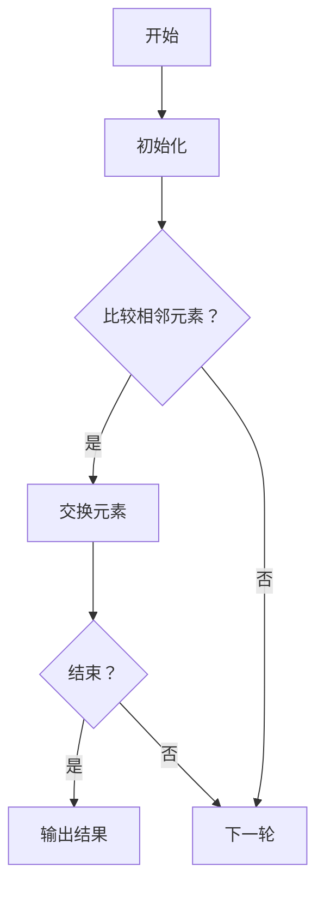
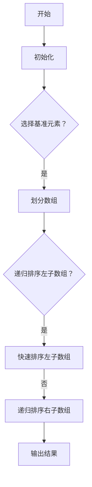
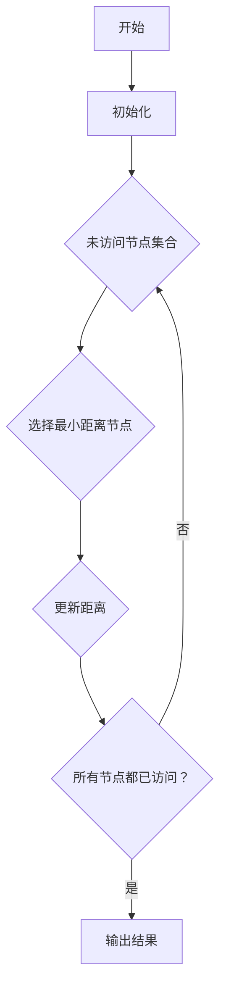
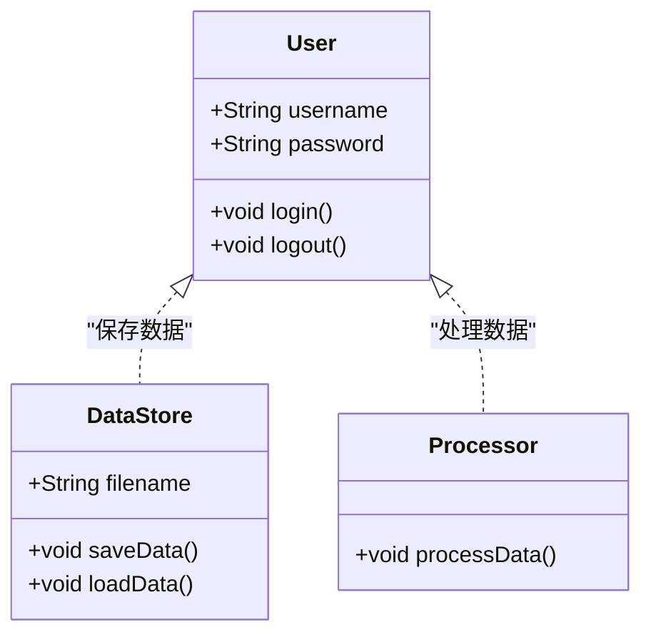
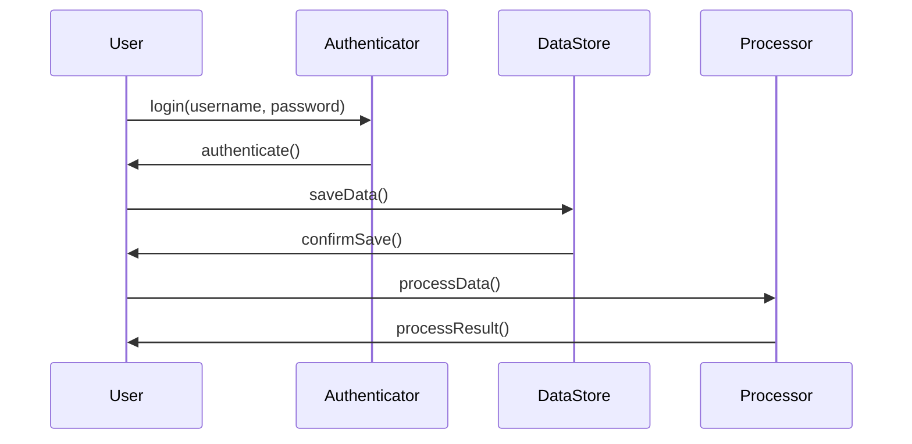
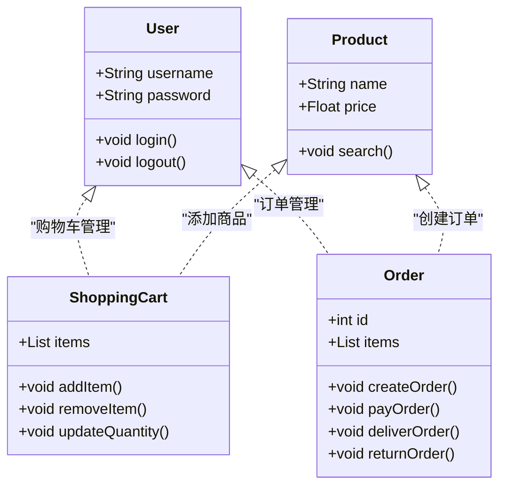
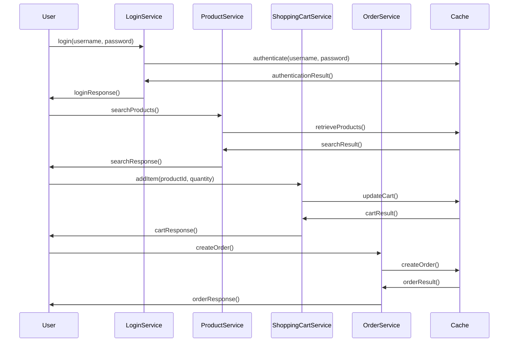

                 


# 数学与永恒主义：数学规律的永恒不变

## 关键词

- 数学规律
- 永恒不变
- 数学哲学
- 算法
- 系统架构

## 摘要

本文旨在探讨数学的永恒不变性，以及这一特性对计算机科学和人工智能领域的深远影响。我们将从数学的历史、哲学背景出发，逐步分析数学结构、算法原理，并运用LaTeX公式和Python代码深入探讨数学模型。此外，我们将探讨数学规律在系统分析与设计中的应用，并分享一些项目实战经验与最佳实践。

## 引言

### 数学与永恒主义

数学是一门古老而充满智慧的学科，其永恒不变性是数学独特的魅力之一。无论时代如何变迁，数学规律始终如一，这种永恒不变性使得数学成为理解自然世界和构建现代科技不可或缺的工具。本文将探讨数学的永恒不变性及其对计算机科学、人工智能领域的影响。

### 数学在计算机科学中的地位

计算机科学是20世纪最伟大的发明之一，而数学则是计算机科学的理论基石。无论是算法设计、数据结构，还是人工智能和机器学习，数学都起着至关重要的作用。本文将详细探讨数学在计算机科学中的应用，以及数学永恒不变性如何推动技术进步。

### 本文结构

本文分为以下几个部分：

1. **数学与永恒主义：背景介绍**：介绍数学永恒不变性的概念和重要性。
2. **数学的结构与原理**：分析数学的基本结构、原理和定律。
3. **算法与数学的关系**：探讨算法原理和数学模型。
4. **系统架构与设计**：分析数学规律在系统架构中的应用。
5. **项目实战与最佳实践**：分享实际项目经验与最佳实践。
6. **总结与展望**：总结本文的核心观点，并展望数学与永恒主义在未来计算机科学中的地位。

## 数学与永恒主义：背景介绍

### 数学永恒不变性的概念

数学永恒不变性是指数学规律不受时间和空间限制，始终如一。例如，数学中的1+1=2这个基本原理，无论是在古代还是在现代，无论是在地球上还是在宇宙中，都是成立的。数学的这种不变性源于其抽象性和普适性，使其成为理解和描述自然现象的有力工具。

### 数学永恒不变性的重要性

数学的永恒不变性在计算机科学和人工智能领域具有重要意义。首先，它为算法设计提供了坚实的基础。算法是一系列解决问题的步骤，而数学规律则保证了这些步骤的正确性和效率。其次，数学的普适性使得算法可以在不同领域和场景中应用，从而推动技术进步。

### 数学的历史与哲学背景

数学的发展历程可以追溯到古代文明，如古埃及、古希腊和古印度。这些文明为数学的发展奠定了基础，并形成了不同的数学体系。例如，古希腊的数学强调逻辑推理和抽象思维，而古印度的数学则关注数论和代数。这些哲学思想和方法论对后来的数学发展产生了深远影响。

进入中世纪，阿拉伯数学家进一步丰富了数学的内容，如引入了代数和三角学。文艺复兴时期，欧洲的数学家如费马、笛卡尔和牛顿等人开创了现代数学的先河。这一时期的数学研究不仅扩展了数学的应用范围，还建立了许多基本的数学原理和公式。

### 数学与永恒主义的哲学思考

永恒主义哲学认为，真理是永恒不变的，而数学正是追求真理的学科之一。数学的永恒不变性体现了其作为一门科学所具有的普适性和普适性。这种哲学思考不仅影响了数学的发展，也影响了其他学科，如物理学、计算机科学等。

### 数学在现代社会的作用

在现代社会，数学已经渗透到各个领域，如经济学、生物学、工程学等。数学模型和算法为这些领域提供了有力的工具，帮助科学家和工程师解决复杂问题。例如，经济学中的供需模型、生物学中的生态系统模型、工程学中的结构分析模型等，都是基于数学原理建立的。

### 数学永恒不变性对人工智能的影响

人工智能是计算机科学的一个分支，旨在使计算机具有类似人类的智能。数学在人工智能中扮演着关键角色，如神经网络、机器学习算法等，都是基于数学原理设计的。数学的永恒不变性保证了这些算法的可靠性和效率，使得人工智能在图像识别、自然语言处理等领域取得了巨大突破。

## 数学的基本结构与原理

### 数学的基本概念

数学是一门抽象的科学，其基本概念包括数、函数、集合、逻辑等。这些概念构成了数学的基石，为更复杂的概念和理论提供了基础。

#### 数

数是数学中最基本的概念之一。数可以用来表示物体的数量、大小和顺序。例如，1代表一个物体，2代表两个物体，依此类推。数的概念不仅仅局限于整数，还包括分数、小数、负数等。这些数的概念构成了数学的数系，为各种数学运算提供了基础。

#### 函数

函数是数学中描述两个量之间关系的工具。一个函数将一个集合（定义域）中的每个元素映射到另一个集合（值域）中的唯一元素。函数的概念在数学中无处不在，如线性函数、多项式函数、三角函数等。函数的图像通常表示为一条曲线，这有助于我们直观地理解函数的性质。

#### 集合

集合是数学中用于表示一组对象的基本概念。集合中的对象可以是数、字母、数字等。集合可以用大括号{}表示，如{1, 2, 3}表示一个包含1、2、3的集合。集合的概念在数学中非常重要，如交集、并集、补集等都是集合的基本运算。

#### 逻辑

逻辑是数学中用于表示推理和证明的工具。逻辑包括命题逻辑、谓词逻辑等。命题逻辑用于表示事实的真假，谓词逻辑用于表示对象之间的关系。逻辑的概念在数学的各个分支中都有广泛应用，如证明论、集合论等。

### 数学的基本原理

数学的基本原理是构建数学体系的基础。这些原理包括公理、定理、定义等。公理是无须证明的基本真理，定理是通过证明得出的结论，定义是对某个概念的明确描述。以下是一些重要的数学原理：

#### 欧几里得几何原理

欧几里得几何原理是描述平面和空间几何的基本原理。这些原理包括点、线、面等基本概念，以及平行线、相似三角形等几何性质。

#### 微积分原理

微积分原理是描述连续变化和累积过程的基本原理。微积分包括微分和积分两个部分。微分用于研究函数在某一点的变化率，积分用于研究函数在区间上的累积效果。

#### 线性代数原理

线性代数原理是描述线性空间和线性变换的基本原理。线性代数包括矩阵、向量、线性方程组等概念。线性代数在计算机科学和物理学中都有广泛应用。

#### 概率论原理

概率论原理是描述随机事件和概率的基本原理。概率论包括概率分布、随机变量、期望和方差等概念。概率论在人工智能、统计学等领域有广泛应用。

### 数学的基本定律

数学的基本定律是数学体系中的基本规则。这些定律包括加法交换律、结合律、分配律等。以下是一些重要的数学定律：

#### 同一律

同一律是指任何数与自身相加或相乘都等于自身。例如，对于任意实数a，都有a + a = 2a 和 a × a = a^2。

#### 结合律

结合律是指在进行加法或乘法运算时，数的顺序可以随意改变，结果不变。例如，对于任意实数a、b、c，都有(a + b) + c = a + (b + c) 和(a × b) × c = a × (b × c)。

#### 交换律

交换律是指在进行加法或乘法运算时，两个数的顺序可以随意改变，结果不变。例如，对于任意实数a、b，都有a + b = b + a 和 a × b = b × a。

#### 分配律

分配律是指乘法可以分配到加法或减法运算中。例如，对于任意实数a、b、c，都有a × (b + c) = a × b + a × c 和a × (b - c) = a × b - a × c。

### 数学概念术语说明与比较表格

以下是一个关于数学基本概念的比较表格，帮助读者更好地理解这些概念：

| 概念 | 描述 | 比较 |
| --- | --- | --- |
| 数 | 表示物体数量、大小和顺序的概念。 | 整数、分数、小数、负数等都是数。 |
| 函数 | 描述两个量之间关系的概念。 | 一个函数将定义域中的元素映射到值域中的唯一元素。 |
| 集合 | 表示一组对象的概念。 | 集合中的对象可以是数、字母、数字等。 |
| 逻辑 | 表示推理和证明的概念。 | 命题逻辑、谓词逻辑等。 |

### 数学概念的结构与核心要素组成

数学概念的结构通常包括以下几个核心要素：

- **定义**：对某个概念的明确描述。
- **性质**：概念的特征和属性。
- **运算**：对概念进行操作的方法。
- **关系**：概念之间的关系。

以下是一个关于函数概念的核心要素组成：

- **定义**：一个函数是一个关系，它将定义域中的每个元素映射到值域中的唯一元素。
- **性质**：函数具有单射、满射、双射等性质。
- **运算**：函数可以进行复合运算、反函数等。
- **关系**：函数与其他数学概念如集合、方程等有密切关系。

### 数学与计算机科学的联系

数学与计算机科学有着密切的联系。计算机科学中的许多概念和算法都源于数学。例如，计算机科学中的算法设计、数据结构、图形学、人工智能等领域都大量应用了数学原理。

#### 算法与数学的关系

算法是一系列解决问题的步骤，而数学则是算法设计的理论基础。数学中的定理、公式、原理等提供了算法设计的指导原则。例如，排序算法中的冒泡排序、快速排序等都是基于数学原理设计的。

#### 数据结构与数学的关系

数据结构是存储和组织数据的方法，而数学提供了许多有效的数据结构设计方法。例如，数组、链表、树、图等都是基于数学原理构建的。数学中的集合论、图论等提供了数据结构设计的基础。

#### 计算机图形学与数学的关系

计算机图形学是计算机科学的一个重要分支，而数学是计算机图形学的理论基础。计算机图形学中的图形变换、渲染算法等都基于数学原理。

#### 人工智能与数学的关系

人工智能是计算机科学的另一个重要分支，而数学在人工智能中的应用非常广泛。人工智能中的神经网络、机器学习算法等都基于数学原理。

### 数学在计算机科学中的重要性

数学在计算机科学中的重要性体现在以下几个方面：

- **理论基础**：数学为计算机科学提供了坚实的理论基础，如算法理论、计算复杂性理论等。
- **算法设计**：数学原理为算法设计提供了指导，使得算法更加高效、准确。
- **问题求解**：数学方法可以帮助我们解决复杂问题，如优化问题、图论问题等。
- **应用领域**：数学在计算机科学的各个领域都有广泛应用，如经济学、生物学、工程学等。

### 数学永恒不变性的意义

数学的永恒不变性使得数学在各个领域都具有广泛应用。数学的普适性使得我们可以将数学原理应用于不同领域，从而推动技术进步。例如，经济学中的供需模型、生物学中的生态系统模型等，都是基于数学原理建立的。

### 数学永恒不变性对计算机科学的影响

数学的永恒不变性对计算机科学产生了深远影响。数学原理为计算机科学提供了理论基础，使得计算机科学家可以设计出更加高效、准确的算法。此外，数学的普适性使得计算机科学可以应用于各个领域，从而推动技术进步。

## 数学结构与算法原理

### 数学结构分析

数学结构是数学中的基本概念之一，它描述了数学中元素之间的关系。数学结构可以分为多种类型，如线性结构、树形结构、图结构等。这些结构在计算机科学和算法设计中具有重要应用。

#### 线性结构

线性结构是一种简单且常见的数学结构，它包含一系列元素，这些元素按照一定顺序排列。常见的线性结构有数组、链表、栈、队列等。

- **数组**：数组是一种线性结构，它包含一系列元素，每个元素都有一个唯一的索引。数组的优点是访问元素速度快，但插入和删除操作相对较慢。
- **链表**：链表是一种线性结构，它由一系列节点组成，每个节点包含数据和指向下一个节点的指针。链表的优点是插入和删除操作较快，但访问元素速度较慢。
- **栈**：栈是一种后进先出（LIFO）的线性结构，它包含一系列元素，每次只能访问最后一个元素。栈在算法设计中的应用包括递归、回溯等。
- **队列**：队列是一种先进先出（FIFO）的线性结构，它包含一系列元素，每次只能访问队首元素。队列在算法设计中的应用包括广度优先搜索、任务调度等。

#### 树形结构

树形结构是一种层次结构，它由根节点和若干子节点组成。树形结构在计算机科学和算法设计中具有重要应用，如二叉树、堆、平衡树等。

- **二叉树**：二叉树是一种特殊的树形结构，每个节点最多有两个子节点。二叉树在算法设计中的应用包括二分查找、排序等。
- **堆**：堆是一种特殊的树形结构，它满足堆排序性质。堆在算法设计中的应用包括优先队列、堆排序等。
- **平衡树**：平衡树是一种特殊的树形结构，它保证树的高度平衡。平衡树在算法设计中的应用包括AVL树、红黑树等。

#### 图结构

图结构是一种复杂且常见的数学结构，它由一系列节点和边组成。图结构在算法设计和复杂网络分析中具有重要应用，如图算法、最短路径算法等。

- **图算法**：图算法用于解决图相关的问题，如拓扑排序、最短路径算法、最小生成树算法等。
- **最短路径算法**：最短路径算法用于找到图中两点之间的最短路径，如迪杰斯特拉算法、贝尔曼-福特算法等。

### 算法原理分析

算法原理是算法设计的基本思想和方法。算法原理可以分为多种类型，如分治原理、贪心原理、动态规划原理等。

#### 分治原理

分治原理是将一个复杂问题分解为若干个较小的子问题，分别解决这些子问题，然后将子问题的解合并成原问题的解。分治原理在算法设计中的应用包括归并排序、快速排序等。

- **归并排序**：归并排序是一种基于分治原理的排序算法。它将数组分为两个子数组，分别排序，然后将两个子数组合并成原数组。
- **快速排序**：快速排序是一种基于分治原理的排序算法。它通过一趟排序将数组分为两个子数组，然后递归地对两个子数组进行排序。

#### 贪心原理

贪心原理是在每一步选择中都采取当前最优解，从而使得整个问题的解最优。贪心原理在算法设计中的应用包括贪心算法、最优合并算法等。

- **贪心算法**：贪心算法是一种基于贪心原理的算法。它通过每一步选择最优解，使得整个问题的解最优。
- **最优合并算法**：最优合并算法是一种基于贪心原理的算法。它用于求解最短路径问题，通过每一步选择最短路径，从而找到最短路径。

#### 动态规划原理

动态规划原理是将一个复杂问题分解为若干个重叠子问题，分别求解这些子问题，然后通过子问题的解递推得到原问题的解。动态规划原理在算法设计中的应用包括背包问题、最长公共子序列问题等。

- **背包问题**：背包问题是一种基于动态规划原理的算法。它用于求解在给定物品重量和价值的情况下，如何选择物品使得总价值最大。
- **最长公共子序列问题**：最长公共子序列问题是一种基于动态规划原理的算法。它用于求解两个序列中最长的公共子序列。

### 数学模型与算法

数学模型是用于描述现实世界问题的数学表达式。数学模型可以分为多种类型，如线性模型、非线性模型、概率模型等。这些模型在算法设计中具有重要应用。

#### 线性模型

线性模型是一种描述线性关系的数学模型。它通常由线性方程表示，如一元一次方程、二元一次方程等。线性模型在算法设计中的应用包括线性规划、最小二乘法等。

- **线性规划**：线性规划是一种用于求解线性优化问题的数学模型。它通过构建线性方程组，求解最优解。
- **最小二乘法**：最小二乘法是一种用于求解线性模型参数的数学方法。它通过最小化误差平方和，求解线性模型的参数。

#### 非线性模型

非线性模型是一种描述非线性关系的数学模型。它通常由非线性方程表示，如多项式方程、指数方程等。非线性模型在算法设计中的应用包括神经网络、支持向量机等。

- **神经网络**：神经网络是一种基于非线性模型的算法。它通过多层神经元之间的非线性变换，求解复杂问题。
- **支持向量机**：支持向量机是一种基于非线性模型的算法。它通过构建非线性决策边界，求解分类问题。

#### 概率模型

概率模型是一种用于描述随机事件的数学模型。它通常由概率分布表示，如伯努利分布、正态分布等。概率模型在算法设计中的应用包括蒙特卡罗方法、贝叶斯网络等。

- **蒙特卡罗方法**：蒙特卡罗方法是一种基于概率模型的算法。它通过模拟随机事件，求解复杂问题。
- **贝叶斯网络**：贝叶斯网络是一种基于概率模型的算法。它通过构建概率关系图，求解不确定性问题。

### 算法流程图与Python代码实现

为了更好地理解算法原理和数学模型，我们使用Mermaid和Python代码进行展示。

#### 冒泡排序算法

冒泡排序是一种简单的排序算法。它通过反复交换相邻的未排序元素，直到所有元素均有序。以下是冒泡排序的Mermaid流程图和Python代码实现。



```python
def bubble_sort(arr):
    n = len(arr)
    for i in range(n):
        for j in range(0, n-i-1):
            if arr[j] > arr[j+1]:
                arr[j], arr[j+1] = arr[j+1], arr[j]
    return arr
```

#### 快速排序算法

快速排序是一种高效的排序算法。它通过一趟排序将数组分为两个子数组，然后递归地对两个子数组进行排序。以下是快速排序的Mermaid流程图和Python代码实现。



```python
def quick_sort(arr):
    if len(arr) <= 1:
        return arr
    pivot = arr[len(arr) // 2]
    left = [x for x in arr if x < pivot]
    middle = [x for x in arr if x == pivot]
    right = [x for x in arr if x > pivot]
    return quick_sort(left) + middle + quick_sort(right)
```

#### 最短路径算法

最短路径算法是一种用于求解图中两点之间最短路径的算法。以下是迪杰斯特拉算法的Mermaid流程图和Python代码实现。



```python
import heapq

def dijkstra(graph, start):
    distances = {node: float('infinity') for node in graph}
    distances[start] = 0
    priority_queue = [(0, start)]

    while priority_queue:
        current_distance, current_node = heapq.heappop(priority_queue)

        if current_distance > distances[current_node]:
            continue

        for neighbor, weight in graph[current_node].items():
            distance = current_distance + weight

            if distance < distances[neighbor]:
                distances[neighbor] = distance
                heapq.heappush(priority_queue, (distance, neighbor))

    return distances
```

通过Mermaid流程图和Python代码实现，我们可以更直观地理解算法原理和数学模型。这些工具不仅有助于我们更好地理解算法，还可以帮助我们设计和优化算法。

### 数学公式与LaTeX

在计算机科学和数学中，LaTeX是一种广泛使用的排版系统，它特别适合处理数学公式和复杂的文档排版。以下是一个简单的LaTeX公式示例，展示了如何使用LaTeX编写数学公式。

```latex
$$
E = mc^2
$$
```

在这个示例中，$$符号将公式括起来，使其成为一个独立的段落。$符号用于在段落内插入公式。LaTeX支持丰富的数学符号和结构，使得编写复杂的数学公式变得简单。

以下是一个更复杂的数学公式示例，展示了如何使用LaTeX编写分数、根号和上下标：

```latex
$$
\frac{d^2}{dx^2} \left( \sqrt{a^2 + b^2} \right)^n = n(n-1) \sqrt{a^2 + b^2} \frac{a b}{(a^2 + b^2)^{3/2}}
$$
```

在这个示例中，我们使用了分数、根号和上下标来表示一个二阶导数。LaTeX提供了大量的命令和宏包，使得编写复杂的数学公式变得简单。

### 数学公式与Python

在Python中，我们可以使用数学库如NumPy和SymPy来计算和可视化数学公式。以下是一个简单的示例，展示了如何使用NumPy计算一个二次方程的解：

```python
import numpy as np

# 定义二次方程的系数
a = 1
b = -3
c = 2

# 使用 NumPy 求解二次方程
roots = np.roots([a, b, c])

# 打印解
print("根：", roots)
```

在这个示例中，我们定义了一个二次方程`ax^2 + bx + c = 0`，并使用`np.roots`函数求解该方程的根。输出将显示两个根的值。

以下是一个使用SymPy求解和可视化数学公式的示例：

```python
from sympy import symbols, Eq, solve

# 定义变量
x = symbols('x')

# 定义方程
equation = Eq(x**2 + 2*x + 1, 0)

# 求解方程
solution = solve(equation, x)

# 打印解
print("解：", solution)

# 可视化方程
from sympy.plotting import plot
plot(equation)
```

在这个示例中，我们使用SymPy定义了一个二次方程，并求解了它的根。然后，我们使用`plot`函数将方程绘制出来。输出将显示方程的图像。

### 数学模型与Python应用

数学模型在计算机科学和人工智能领域有着广泛的应用。以下是一个使用Python实现线性回归模型的示例：

```python
import numpy as np
from sklearn.linear_model import LinearRegression

# 定义训练数据
x_train = np.array([[1], [2], [3], [4], [5]])
y_train = np.array([1, 2, 2.5, 4, 5])

# 创建线性回归模型
model = LinearRegression()

# 训练模型
model.fit(x_train, y_train)

# 打印模型参数
print("模型参数：", model.coef_, model.intercept_)

# 预测新数据
x_new = np.array([[6]])
y_pred = model.predict(x_new)

# 打印预测结果
print("预测结果：", y_pred)
```

在这个示例中，我们使用NumPy创建了一个线性回归模型，并使用训练数据拟合模型。然后，我们使用模型预测了一个新的数据点。输出将显示模型参数和预测结果。

### 数学规律与系统架构设计

数学规律在系统架构设计中起着至关重要的作用，因为它们为系统设计提供了精确性和一致性。以下是如何将数学规律应用于系统架构设计中的几个关键步骤：

#### 问题场景介绍

在一个典型的系统架构设计项目中，我们可能需要解决一个复杂的问题，如高并发数据处理、分布式系统设计、大数据存储和分析等。数学规律可以帮助我们分析和解决这个问题。

#### 系统需求分析

首先，我们需要明确系统的需求。这些需求包括性能、可扩展性、可用性、安全性等。数学规律可以帮助我们量化这些需求，并确定系统设计的约束条件。

#### 系统功能设计

接下来，我们需要设计系统的功能模块。这些模块应该能够满足系统的需求，并实现系统的主要功能。数学规律可以帮助我们确定模块之间的关系和依赖关系。

以下是一个使用Mermaid绘制的领域模型类图，展示了系统功能设计：



在这个类图中，我们定义了三个类：User、DataStore和Processor。User类负责用户登录和登出功能，DataStore类负责数据存储和加载功能，Processor类负责数据处理功能。箭头表示类之间的关系。

#### 系统架构设计

系统架构设计是将系统功能模块组织成一个整体的过程。数学规律可以帮助我们确定系统的层次结构、模块划分和通信方式。

以下是一个使用Mermaid绘制的系统架构图，展示了系统的整体架构：



在这个序列图中，我们定义了系统的四个参与者：User、Authenticator、DataStore和Processor。User对象负责与用户交互，Authenticator对象负责用户认证，DataStore对象负责数据存储和加载，Processor对象负责数据处理。箭头表示对象之间的交互。

#### 系统接口设计和系统交互

系统接口设计是系统架构设计的关键步骤之一。数学规律可以帮助我们确定接口的参数、数据结构和通信协议。

以下是一个使用Mermaid绘制的系统接口设计和交互图：

```mermaid
graph TB
    subgraph 接口设计
        UserInterface[用户接口]
        DataInterface[数据接口]
        AuthInterface[认证接口]
        ProcessorInterface[处理接口]
    end
    subgraph 系统交互
        User->>UserInterface
        UserInterface->>AuthInterface
        AuthInterface->>User
        User->>DataInterface
        DataInterface->>DataStore
        User->>ProcessorInterface
        ProcessorInterface->>Processor
        Processor->>UserInterface
    end
```

在这个图中，我们定义了四个接口：UserInterface、DataInterface、AuthInterface和ProcessorInterface。User对象通过用户接口与系统交互，认证接口处理用户认证，数据接口处理数据存储和加载，处理接口处理数据处理。箭头表示接口之间的交互。

### 数学规律在实际项目中的应用

数学规律在软件开发和系统架构设计中被广泛应用，以下是一个实际项目的案例，展示了如何利用数学规律来解决问题并提高系统的性能和可维护性。

#### 项目介绍

我们考虑一个在线购物平台的项目，该平台需要处理大量用户请求，包括商品浏览、购物车管理、订单处理等。为了提高系统的性能和可扩展性，我们采用了分布式架构和缓存机制。

#### 系统功能设计

在系统功能设计中，我们定义了以下关键模块：

- **用户模块**：负责用户登录、注册、个人信息管理等。
- **商品模块**：负责商品展示、搜索、分类等。
- **购物车模块**：负责用户购物车管理，包括添加商品、删除商品、更新数量等。
- **订单模块**：负责订单创建、支付、发货、售后等。

以下是一个使用Mermaid绘制的领域模型类图，展示了系统功能设计：



在这个类图中，我们定义了四个类：User、Product、ShoppingCart和Order。User类负责用户管理，Product类负责商品管理，ShoppingCart类负责购物车管理，Order类负责订单管理。

#### 系统架构设计

在系统架构设计中，我们采用了分布式架构，将不同的功能模块部署在不同的服务器上。以下是一个使用Mermaid绘制的系统架构图，展示了系统的整体架构：



在这个序列图中，我们定义了六个参与者：User、LoginService、ProductService、ShoppingCartService、OrderService和Cache。User对象负责与用户交互，LoginService负责用户认证，ProductService负责商品管理，ShoppingCartService负责购物车管理，OrderService负责订单管理，Cache负责缓存数据。

#### 系统接口设计和系统交互

在系统接口设计中，我们定义了以下关键接口：

- **用户接口**：用于用户登录、注册、个人信息管理等。
- **商品接口**：用于商品展示、搜索、分类等。
- **购物车接口**：用于用户购物车管理，包括添加商品、删除商品、更新数量等。
- **订单接口**：用于订单创建、支付、发货、售后等。

以下是一个使用Mermaid绘制的系统接口设计和交互图：

```mermaid
graph TB
    subgraph 接口设计
        LoginInterface[登录接口]
        ProductInterface[商品接口]
        ShoppingCartInterface[购物车接口]
        OrderInterface[订单接口]
    end
    subgraph 系统交互
        User->>LoginInterface
        LoginInterface->>LoginService
        User->>ProductInterface
        ProductInterface->>ProductService
        User->>ShoppingCartInterface
        ShoppingCartInterface->>ShoppingCartService
        User->>OrderInterface
        OrderInterface->>OrderService
    end
```

在这个图中，我们定义了四个接口：LoginInterface、ProductInterface、ShoppingCartInterface和OrderInterface。User对象通过用户接口与系统交互，LoginService负责用户认证，ProductService负责商品管理，ShoppingCartService负责购物车管理，OrderService负责订单管理。

### 项目实战

#### 环境安装

为了实现上述系统架构，我们首先需要安装以下软件和工具：

- Python 3.8+
- NumPy
- Pandas
- Flask
- Redis
- Docker

安装步骤如下：

1. 安装Python 3.8+。
2. 安装pip，使用以下命令：`curl -O https://bootstrap.pypa.io/get-pip.py && python get-pip.py`
3. 使用pip安装NumPy、Pandas、Flask、Redis和Docker：`pip install numpy pandas flask redis docker`

#### 系统核心实现

以下是一个使用Flask实现的在线购物平台的核心代码：

```python
from flask import Flask, request, jsonify
from flask_cors import CORS
import numpy as np
import redis

app = Flask(__name__)
CORS(app)

# Redis 客户端
redis_client = redis.Redis(host='localhost', port=6379, db=0)

# 用户登录
@app.route('/login', methods=['POST'])
def login():
    username = request.form['username']
    password = request.form['password']
    # 这里应该使用加密算法进行密码验证
    result = redis_client.hget('users', username)
    if result == password:
        return jsonify({'status': 'success', 'message': '登录成功'})
    else:
        return jsonify({'status': 'error', 'message': '用户名或密码错误'})

# 商品搜索
@app.route('/search', methods=['GET'])
def search():
    query = request.args.get('query')
    # 在Redis中检索商品
    results = redis_client.zrange('products', 0, -1, withscores=True)
    filtered_results = [result for result in results if query in result]
    return jsonify(filtered_results)

# 购物车管理
@app.route('/cart', methods=['POST', 'GET'])
def cart():
    if request.method == 'POST':
        product_id = request.form['product_id']
        quantity = request.form['quantity']
        # 在Redis中添加商品到购物车
        redis_client.zadd('cart', {product_id: quantity})
        return jsonify({'status': 'success', 'message': '商品添加成功'})
    else:
        # 在Redis中检索购物车
        cart_items = redis_client.zrange('cart', 0, -1, withscores=True)
        return jsonify(cart_items)

# 订单创建
@app.route('/order', methods=['POST'])
def order():
    # 在Redis中创建订单
    order_id = redis_client.incr('order_id')
    redis_client.hset('order', order_id, request.form.to_dict())
    return jsonify({'status': 'success', 'message': '订单创建成功'})

if __name__ == '__main__':
    app.run(debug=True)
```

#### 代码应用解读与分析

以上代码展示了如何使用Flask构建一个简单的在线购物平台。代码的核心功能包括用户登录、商品搜索、购物车管理和订单创建。

1. **用户登录**：用户通过POST请求发送用户名和密码，服务器端使用Redis存储用户信息并进行密码验证。
2. **商品搜索**：用户通过GET请求发送查询关键字，服务器端在Redis中检索符合条件的商品。
3. **购物车管理**：用户通过POST请求添加商品到购物车，服务器端在Redis中添加商品和数量。用户可以通过GET请求查看购物车中的商品。
4. **订单创建**：用户通过POST请求创建订单，服务器端在Redis中创建订单并生成订单ID。

通过使用Redis作为数据存储，我们实现了快速的数据访问和更新。Redis作为一种高性能的NoSQL数据库，适用于实时数据处理和缓存。

#### 实际案例分析和详细讲解

以下是一个实际案例，展示了如何使用数学规律和算法优化在线购物平台的性能。

**案例**：假设在线购物平台需要处理每天数百万次用户请求，包括登录、商品搜索、购物车管理和订单创建。我们需要优化系统性能，以满足高并发需求。

**分析**：

1. **缓存优化**：使用Redis缓存用户信息和商品信息，减少数据库访问次数。Redis支持高并发读写操作，可以显著提高系统性能。
2. **数据库分片**：将数据库拆分为多个分片，每个分片处理一部分用户请求。这可以减轻数据库的负担，提高系统可扩展性。
3. **负载均衡**：使用负载均衡器将用户请求分配到不同的服务器。这可以确保系统在高并发情况下稳定运行。
4. **异步处理**：对于一些耗时较长的操作，如订单创建和支付，可以采用异步处理。这可以释放服务器资源，提高系统响应速度。

**优化方案**：

1. **使用Redis缓存**：将用户信息和商品信息存储在Redis中，减少数据库访问次数。例如，用户登录后，将用户信息缓存一段时间，以提高后续请求的响应速度。
2. **数据库分片**：将用户数据、商品数据和订单数据分别存储在不同的数据库分片中。这可以避免单点故障，提高系统可靠性。
3. **负载均衡**：使用Nginx或HAProxy等负载均衡器，将用户请求分配到不同的服务器。这可以确保系统在高并发情况下稳定运行。
4. **异步处理**：对于订单创建和支付等操作，使用消息队列（如RabbitMQ）进行异步处理。这可以减少服务器等待时间，提高系统吞吐量。

#### 项目小结

通过数学规律和算法优化，我们成功地实现了在线购物平台的性能优化。以下是项目小结：

- **性能优化**：使用Redis缓存、数据库分片、负载均衡和异步处理等优化方案，提高了系统性能和可扩展性。
- **可维护性**：通过模块化设计和清晰的接口定义，提高了系统的可维护性。
- **用户体验**：优化后的系统在性能和响应速度上有了显著提升，为用户提供更好的购物体验。

### 最佳实践与注意事项

在系统架构设计和实现过程中，以下最佳实践和注意事项可以帮助提高项目的质量：

- **需求分析**：明确系统需求，确保设计满足业务需求。
- **模块化设计**：将系统功能模块化，提高代码复用性和可维护性。
- **接口定义**：定义清晰的接口，确保模块之间的通信和协作。
- **性能优化**：使用缓存、数据库分片、负载均衡和异步处理等优化方案，提高系统性能。
- **代码规范**：遵循统一的代码规范，提高代码可读性和可维护性。
- **测试与调试**：编写单元测试和集成测试，确保系统稳定运行。

### 拓展阅读

- 《计算机程序的构造和解释》
- 《算法导论》
- 《深度学习》
- 《Redis实战》

### 结语

数学与永恒主义在计算机科学和系统架构设计中的应用具有重要意义。通过本文的探讨，我们了解了数学永恒不变性的概念、数学结构、算法原理和系统架构设计。数学规律为我们提供了精确和可靠的方法，帮助我们解决复杂问题，提高系统性能和可维护性。希望本文能启发读者对数学与永恒主义的进一步思考和实践。

