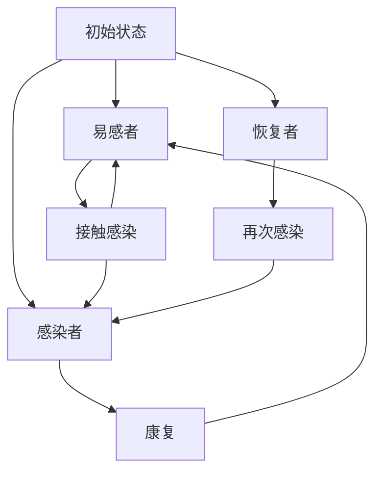

                 

# 数学与流行病学：疾病传播的数学模型

## 关键词：数学模型、流行病学、疾病传播、疫情预测、疫情防控

> 摘要：本文深入探讨了数学模型在流行病学中的重要性，特别是疾病传播的数学建模。我们将从问题背景、核心概念、数学模型讲解、实际案例分析以及项目实战等多个方面，详细阐述疾病传播的数学模型及其应用。通过本文，读者将全面了解数学模型如何帮助我们更好地理解和预测疾病的传播，从而为疫情防控提供有力的科学支持。

## 目录大纲

1. **第一部分：背景与概述**
   - **第1章 问题背景**
     - **1.1 问题提出**
       - **1.1.1 疾病传播的重要性**
       - **1.1.2 数学模型在流行病学中的应用**
     - **1.2 问题描述**
       - **1.2.1 疾病传播的基本概念**
       - **1.2.2 疾病传播过程的复杂性**
     - **1.3 问题解决**
       - **1.3.1 数学模型在疾病传播研究中的应用**
       - **1.3.2 数学模型的优点与局限性**
     - **1.4 边界与外延**
       - **1.4.1 模型适用范围**
       - **1.4.2 模型边界条件**
     - **1.5 概念结构与核心要素组成**
       - **1.5.1 核心概念**
       - **1.5.2 关键要素**

   - **第2章 核心概念与联系**
     - **2.1 基本概念介绍**
       - **2.1.1 疾病传播模型**
       - **2.1.2 疾病感染动力学**
       - **2.1.3 疾病传播网络**
     - **2.2 概念属性特征对比表格**
     - **2.3 ER实体关系图架构**

2. **第二部分：数学模型讲解**
   - **第3章 疾病传播数学模型原理**
     - **3.1 疾病传播模型的基本原理**
       - **3.1.1 疾病传播模型的构建**
       - **3.1.2 疾病传播模型的参数设置**
     - **3.2 数学模型解析**
       - **3.2.1 SIR模型**
       - **3.2.2 SEIR模型**
       - **3.2.3 SIRS模型**
     - **3.3 数学模型公式与解释**
       - **3.3.1 SIR模型公式**
       - **3.3.2 SEIR模型公式**
       - **3.3.3 SIRS模型公式**
     - **3.4 算法mermaid流程图**

   - **第4章 数学模型在流行病学中的应用**
     - **4.1 数学模型在疫情预测中的应用**
       - **4.1.1 疫情预测的基本原理**
       - **4.1.2 疫情预测的关键参数**
       - **4.1.3 疫情预测的挑战与改进**
     - **4.2 数学模型在疫情防控中的应用**
       - **4.2.1 疫苗分配策略**
       - **4.2.2 隔离措施优化**
       - **4.2.3 流行病学调查策略**
     - **4.3 数学模型在公共卫生决策中的应用**
       - **4.3.1 疫情风险评估**
       - **4.3.2 疫情应对策略制定**
       - **4.3.3 长期疫情防控策略**

3. **第三部分：实际案例分析**
   - **第5章 疾病传播数学模型实际案例分析**
     - **5.1 案例一：COVID-19疫情传播模型分析**
     - **5.2 案例二：流感病毒传播模型研究**
     - **5.3 案例三：寨卡病毒传播模型研究**

   - **第6章 项目实战**
     - **6.1 疫情预测系统环境安装**
     - **6.2 疫情预测系统核心实现**
     - **6.3 疫情预测实际案例分析与讲解**
     - **6.4 项目小结**

4. **第四部分：最佳实践与拓展**
   - **第7章 最佳实践**
   - **第8章 小结**
     - **8.1 全书总结**
     - **8.2 注意事项**
     - **8.3 拓展阅读**

## 第一部分：背景与概述

### 第1章 问题背景

#### 1.1 问题提出

##### 1.1.1 疾病传播的重要性

疾病传播是一个全球性的公共卫生问题，它不仅影响个人的健康，还对经济、社会和全球安全产生深远影响。无论是传统的传染病如流感、麻疹，还是新兴的病毒如COVID-19、埃博拉病毒，疾病传播的速度和范围都给全球卫生系统带来了巨大的压力。随着全球化进程的加速，疾病传播的速度和复杂性也在不断增加，这使得疾病防控变得更加具有挑战性。

##### 1.1.2 数学模型在流行病学中的应用

数学模型在流行病学中的应用已经成为疾病传播研究的重要工具。通过数学模型，研究人员可以模拟疾病的传播过程，预测疫情的走势，制定有效的防控策略。数学模型不仅可以提供理论支持，还可以在实际操作中指导决策者采取有效的干预措施，从而降低疾病的传播风险。

#### 1.2 问题描述

##### 1.2.1 疾病传播的基本概念

疾病传播是指病原体在宿主之间传递的过程。这个过程通常涉及多个阶段，包括传染源、传播途径和易感人群。了解这些基本概念对于构建数学模型至关重要，因为它们决定了模型中各个变量的设定和相互关系。

##### 1.2.2 疾病传播过程的复杂性

疾病传播过程是一个复杂的多因素相互作用过程。它不仅受到生物学特性的影响，还受到社会、环境、人口结构等多方面因素的制约。例如，人群流动性、人口密度、医疗资源分布等都会影响疾病的传播速度和范围。因此，构建一个能够准确反映这些复杂性的数学模型是疾病传播研究的一个核心问题。

#### 1.3 问题解决

##### 1.3.1 数学模型在疾病传播研究中的应用

数学模型在疾病传播研究中发挥着至关重要的作用。通过建立数学模型，研究人员可以模拟疾病在不同条件下的传播过程，预测疫情的发展趋势，评估不同防控措施的效果。这些模型不仅可以为公共卫生决策提供科学依据，还可以帮助研究人员更好地理解疾病的传播机制。

##### 1.3.2 数学模型的优点与局限性

数学模型具有以下几个优点：
- **定量分析能力**：数学模型能够将复杂的生物学过程转化为可量化的参数，从而进行精确的数值分析。
- **预测能力**：通过模型，研究人员可以预测未来疫情的发展趋势，为决策提供指导。
- **资源优化**：数学模型可以帮助优化医疗资源的分配，提高防控措施的效果。

然而，数学模型也存在一定的局限性：
- **数据依赖性**：模型的准确性很大程度上依赖于输入数据的准确性，而现实中的数据往往存在噪声和不确定性。
- **模型简化**：为了简化计算，模型往往需要做出一定的假设和简化，这可能会影响模型的准确性。

##### 1.4 边界与外延

##### 1.4.1 模型适用范围

不同类型的疾病传播模型适用于不同的情境。例如，SIR模型适用于具有明显感染期的疾病，而SEIR模型则更适合那些在感染前后存在潜伏期的疾病。因此，选择合适的模型对于准确预测疾病传播至关重要。

##### 1.4.2 模型边界条件

模型的边界条件是指模型适用的基本条件。例如，SIR模型的边界条件通常包括一个封闭的群体、恒定的人口总数以及明确的感染和恢复机制。了解模型的边界条件有助于确保模型的适用性和准确性。

##### 1.5 概念结构与核心要素组成

##### 1.5.1 核心概念

在疾病传播的数学模型中，几个核心概念是不可或缺的，包括：
- **易感者（Susceptible, S）**：指尚未感染疾病的人群。
- **感染者（Infected, I）**：指已经感染疾病的人群。
- **恢复者（Recovered, R）**：指已经从疾病中康复的人群。
- **传播率（Transmission Rate, β）**：指单位时间内感染者与易感者接触并成功传播疾病的机会。

##### 1.5.2 关键要素

核心要素是构建数学模型的基础，包括：
- **基本再生数（R0）**：指在没有任何干预措施的情况下，一个感染者平均能够传染给多少易感者。
- **潜伏期（Incubation Period）**：指从感染病原体到出现临床症状的时间。
- **康复率（Recovery Rate, μ）**：指单位时间内感染者康复的概率。

通过这些核心概念和关键要素，我们可以构建各种疾病传播的数学模型，从而更深入地理解和预测疾病的传播。

### 第2章 核心概念与联系

#### 2.1 基本概念介绍

在疾病传播的数学建模中，理解以下几个基本概念是非常重要的：

##### 2.1.1 疾病传播模型

疾病传播模型是用来描述疾病在人群中传播过程的数学模型。这些模型通常基于微分方程或离散模型，能够模拟易感者、感染者和恢复者之间的动态变化。

##### 2.1.2 疾病感染动力学

疾病感染动力学是指研究病原体在宿主体内以及宿主之间的传播机制的物理学和生物学过程。这些过程包括病原体的复制、传播途径、潜伏期和感染后的免疫反应等。

##### 2.1.3 疾病传播网络

疾病传播网络是指用来描述疾病在人群中的传播路径和接触模式的网络结构。这些网络可以包括人群的社交网络、地理位置网络以及媒体传播网络等。

#### 2.2 概念属性特征对比表格

为了更清晰地理解这些基本概念，我们可以通过一个对比表格来展示它们的主要属性特征：

| 概念                   | 定义                                                         | 属性特征                           | 关系与联系             |
|------------------------|--------------------------------------------------------------|----------------------------------|----------------------|
| 疾病传播模型           | 描述疾病在人群中传播过程的数学模型                           | 参数化、可预测、理论支持           | 与感染动力学和传播网络相关 |
| 疾病感染动力学         | 研究病原体在宿主体内以及宿主之间的传播机制的物理学和生物学过程 | 实验数据、生物学规律、动态模拟     | 与疾病传播模型和传播网络相关 |
| 疾病传播网络           | 描述疾病在人群中的传播路径和接触模式的网络结构                 | 节点、边、网络拓扑结构、传播路径   | 与疾病传播模型和感染动力学相关 |

通过对比表格，我们可以更直观地理解这些概念之间的关系和联系，为后续的数学建模提供理论基础。

#### 2.3 ER实体关系图架构

为了进一步展示疾病传播模型中的核心概念和关键要素，我们可以使用ER（实体-关系）图来构建模型的结构。以下是ER实体关系图的Markdown格式表示：

```mermaid
erDiagram
  Infector ||--|{ Susceptible }|--感染者
  Infector ||--|{ Recovered }|--感染者
  Susceptible ||--|{ Infector }|--易感者
  Recovered ||--|{ Infector }|--恢复者
  Infector ||--|{ Contact }|--感染者
  Contact ||--|{ Susceptible }|--接触者
  Contact ||--|{ Recovered }|--接触者
  Infector ||--|{ Exposed }|--感染者
  Exposed ||--|{ Susceptible }|--潜伏者
  Exposed ||--|{ Recovered }|--潜伏者
  Transmission ||--|{ Infector }|--传播途径
  Transmission ||--|{ Susceptible }|--传播途径
  Epidemiology ||--|{ Infector }|--流行病学
  Epidemiology ||--|{ Susceptible }|--流行病学
  Epidemiology ||--|{ Recovered }|--流行病学
  Epidemiology ||--|{ Transmission }|--流行病学
```

这个ER图展示了疾病传播模型中的主要实体和它们之间的关系，包括感染者、易感者、恢复者、潜伏者、接触者和传播途径等。通过这个ER图，我们可以更直观地理解模型的结构和各个实体之间的交互关系。

### 第3章 疾病传播数学模型原理

#### 3.1 疾病传播模型的基本原理

疾病传播模型的基本原理在于描述疾病在人群中的传播过程，并通过数学方法来模拟和预测这一过程。这些模型通常基于微分方程或离散模型，它们通过刻画易感者、感染者和恢复者之间的动态变化，来模拟疾病的传播路径和趋势。

##### 3.1.1 疾病传播模型的构建

构建疾病传播模型的第一步是明确模型的目标和假设条件。常见的假设条件包括：
- **封闭群体**：假设人群总数不变，没有外部人口流入和流出。
- **明确的状态转换**：定义易感者、感染者和恢复者的状态，以及它们之间的转换关系。
- **恒定的传播率**：假设传播率在不同时间点保持恒定。

基于这些假设，我们可以建立数学模型，通过微分方程或离散方程来描述人群状态的动态变化。

##### 3.1.2 疾病传播模型的参数设置

疾病传播模型中的关键参数包括传播率、康复率和潜伏期等。这些参数的设置对模型的预测准确性至关重要。传播率反映了感染者与易感者之间的接触机会和传播概率，通常通过流行病学调查数据来确定。康复率则表示感染者康复的概率，它通常与疾病的严重程度和医疗干预措施有关。潜伏期是指从感染到出现临床症状的时间，它对疾病传播的预测有重要影响。

#### 3.2 数学模型解析

在本节中，我们将详细解析几种常见的疾病传播模型，包括SIR模型、SEIR模型和SIRS模型。

##### 3.2.1 SIR模型

SIR模型是最基本的疾病传播模型之一，它将人群分为三个状态：易感者（Susceptible, S）、感染者（Infected, I）和恢复者（Recovered, R）。模型的基本原理是描述这三个状态之间的动态变化。

SIR模型的基本方程如下：

$$
\frac{dS}{dt} = -\beta SI \\
\frac{dI}{dt} = \beta SI - \mu I \\
\frac{dR}{dt} = \mu I
$$

其中，$\beta$ 表示传播率，$\mu$ 表示康复率。

这些方程表明，易感者的减少速度与感染者和易感者之间的接触机会成正比，感染者的减少速度与康复率成正比。

##### 3.2.2 SEIR模型

SEIR模型是SIR模型的扩展，它引入了潜伏者（Exposed, E）的概念，以更好地描述疾病的传播过程。SEIR模型将人群分为四个状态：易感者（S）、潜伏者（E）、感染者和恢复者（R）。

SEIR模型的基本方程如下：

$$
\frac{dS}{dt} = -\beta SI + \sigma R \\
\frac{dE}{dt} = \beta SI - \sigma E \\
\frac{dI}{dt} = \sigma E - \mu I \\
\frac{dR}{dt} = \mu I
$$

其中，$\sigma$ 表示潜伏者转化为感染者的概率。

SEIR模型考虑了潜伏期的影响，使得模型能够更准确地反映疾病的传播过程。

##### 3.2.3 SIRS模型

SIRS模型是SEIR模型的进一步简化，它假设潜伏期很短，可以忽略不计。因此，SIRS模型将人群分为三个状态：易感者（S）、感染者和恢复者（R）。

SIRS模型的基本方程如下：

$$
\frac{dS}{dt} = -\beta SI + \gamma R \\
\frac{dI}{dt} = \beta SI - \mu I \\
\frac{dR}{dt} = \mu I - \gamma R
$$

其中，$\gamma$ 表示恢复者再次感染的概率。

SIRS模型简化了SEIR模型，使得计算更为简便，但可能无法准确反映所有类型的疾病传播。

#### 3.3 数学模型公式与解释

在本节中，我们将使用LaTeX格式详细解释这些模型的数学公式。

##### 3.3.1 SIR模型公式

$$
\frac{dS}{dt} = -\beta SI \\
\frac{dI}{dt} = \beta SI - \mu I \\
\frac{dR}{dt} = \mu I
$$

其中，$\beta$ 表示传播率，$\mu$ 表示康复率。

##### 3.3.2 SEIR模型公式

$$
\frac{dS}{dt} = -\beta SI + \sigma R \\
\frac{dE}{dt} = \beta SI - \sigma E \\
\frac{dI}{dt} = \sigma E - \mu I \\
\frac{dR}{dt} = \mu I
$$

其中，$\sigma$ 表示潜伏者转化为感染者的概率。

##### 3.3.3 SIRS模型公式

$$
\frac{dS}{dt} = -\beta SI + \gamma R \\
\frac{dI}{dt} = \beta SI - \mu I \\
\frac{dR}{dt} = \mu I - \gamma R
$$

其中，$\gamma$ 表示恢复者再次感染的概率。

通过这些公式，我们可以更清晰地理解不同状态之间的转换关系和疾病的传播规律。

#### 3.4 算法mermaid流程图

为了更好地展示疾病传播模型的运行过程，我们可以使用mermaid绘制算法流程图。以下是SIR模型的mermaid流程图：



这个流程图展示了易感者、感染者和恢复者之间的动态转换关系，以及感染者和易感者之间的接触感染过程。

### 第4章 数学模型在流行病学中的应用

#### 4.1 数学模型在疫情预测中的应用

数学模型在疫情预测中的应用至关重要，它能够帮助我们提前了解疫情的发展趋势，从而为决策者提供科学依据。在本节中，我们将探讨疫情预测的基本原理、关键参数以及面临的挑战和改进策略。

##### 4.1.1 疫情预测的基本原理

疫情预测的基本原理是利用现有的数据和数学模型来模拟疾病的传播过程，从而预测未来某一时刻的疫情状态。常见的预测方法包括基于时间序列分析的方法、基于机器学习的方法以及基于微分方程的预测模型。

基于时间序列分析的方法，如ARIMA模型（自回归积分滑动平均模型），通过分析历史数据中的趋势和周期性来预测未来的疫情发展。这种方法简单易行，但可能无法充分考虑疾病传播的复杂性和不确定性。

基于机器学习的方法，如随机森林和神经网络，通过学习历史数据中的模式来预测未来疫情。这种方法能够处理非线性关系和数据噪声，但需要大量的数据和复杂的算法。

基于微分方程的预测模型，如SIR模型和SEIR模型，通过描述易感者、感染者和恢复者之间的动态关系来预测疫情。这种方法理论严谨，能够提供定量的预测结果，但需要准确的参数估计和合理的模型选择。

##### 4.1.2 疫情预测的关键参数

疫情预测的关键参数包括传播率、康复率和潜伏期等。这些参数的准确估计对于预测结果的准确性至关重要。

传播率$\beta$通常通过流行病学调查和接触网络分析来确定。它反映了感染者与易感者之间的接触机会和传播概率。传播率的估计误差会对预测结果产生显著影响。

康复率$\mu$表示感染者康复的概率，它与疾病的严重程度和医疗干预措施密切相关。准确的康复率估计有助于预测疫情的发展速度和峰值。

潜伏期$\sigma$是指从感染到出现临床症状的时间。潜伏期的长短会影响疾病的传播速度和疫情的峰值时间。潜伏期的估计通常基于病例报告和实验室检测数据。

##### 4.1.3 疫情预测的挑战与改进

疫情预测面临的主要挑战包括数据不确定性、模型选择和参数估计等。

数据不确定性是疫情预测中的主要难题。实际疫情数据往往存在噪声和缺失值，这使得参数估计和模型选择变得复杂。为了提高预测准确性，需要采用稳健的数据处理方法，如数据清洗、插值和去噪。

模型选择是疫情预测的另一个关键问题。不同的模型适用于不同的情境和数据特征，选择合适的模型对于预测结果的准确性至关重要。在实际应用中，通常需要结合多种模型进行预测，并使用交叉验证和模型选择准则来评估模型性能。

参数估计也是疫情预测中的一个重要问题。参数估计的准确性直接影响预测结果的可靠性。为了提高参数估计的准确性，可以采用贝叶斯统计方法、机器学习方法以及多模型融合技术。

为了改进疫情预测，可以采取以下策略：
- **实时数据更新**：及时更新疫情数据，以反映最新的疫情动态。
- **多模型融合**：结合多种模型进行预测，以提高预测结果的准确性和鲁棒性。
- **人工智能辅助**：利用人工智能技术，如深度学习和强化学习，提高预测模型的智能化水平。
- **跨学科合作**：加强流行病学家、数学家、计算机科学家等领域的合作，共同研究疫情预测问题。

通过克服这些挑战和采取改进策略，我们可以提高疫情预测的准确性，为公共卫生决策提供有力支持。

#### 4.2 数学模型在疫情防控中的应用

数学模型在疫情防控中的应用至关重要，它能够帮助我们优化防控措施，降低疫情传播风险。在本节中，我们将探讨数学模型在疫苗分配、隔离措施优化和流行病学调查策略中的应用。

##### 4.2.1 疫苗分配策略

疫苗分配策略是疫情防控中的一个重要问题，合理的疫苗分配可以最大限度地提高疫苗接种率，从而降低疫情传播风险。数学模型在疫苗分配策略制定中发挥着重要作用。

常见的疫苗分配策略包括基于风险优先级的分配、基于人口密度的分配和基于需求的动态分配。基于风险优先级的分配策略将疫苗优先分配给高风险人群，如老年人和慢性病患者，从而提高疫苗的预防效果。基于人口密度的分配策略则根据不同地区的疫情严重程度和人口密度来分配疫苗，以实现疫苗的公平分配。基于需求的动态分配策略则根据实时疫情数据和疫苗供应情况，动态调整疫苗分配策略，以提高疫苗的使用效率。

数学模型可以帮助我们评估不同疫苗分配策略的效果，并选择最优的分配方案。例如，可以通过建立多目标优化模型，综合考虑疫苗接种率、疫苗覆盖率和公平性等因素，来制定最优的疫苗分配策略。

##### 4.2.2 隔离措施优化

隔离措施是疫情防控的重要手段之一，通过隔离感染者，可以有效地切断传播途径，降低疫情传播风险。数学模型在隔离措施优化中发挥着重要作用。

常见的隔离措施包括居家隔离、集中隔离和医学观察。居家隔离适用于病情较轻的感染者，可以在家中进行隔离治疗。集中隔离则适用于病情较重的感染者，需要在隔离病房进行治疗。医学观察适用于有感染风险的接触者，需要进行隔离观察。

数学模型可以帮助我们评估不同隔离措施的效果，并优化隔离策略。例如，可以通过建立风险评估模型，综合考虑感染风险、隔离效果和隔离成本等因素，来制定最优的隔离措施。此外，数学模型还可以帮助我们优化隔离资源的分配，如隔离病房的数量和分布，以提高隔离措施的有效性。

##### 4.2.3 流行病学调查策略

流行病学调查是了解疫情传播规律和制定防控策略的重要手段。数学模型在流行病学调查策略制定中发挥着重要作用。

常见的流行病学调查策略包括病例搜索、接触者和暴露者追踪以及采样调查。病例搜索是通过检测和确诊病例，了解疫情的传播情况。接触者和暴露者追踪是通过追踪感染者的接触者，了解疫情的传播链条。采样调查则是通过随机抽样，了解整体人群的感染状况。

数学模型可以帮助我们优化流行病学调查策略，提高调查效率和准确性。例如，可以通过建立风险评估模型，根据感染风险和调查成本，选择最优的调查策略。此外，数学模型还可以帮助我们优化采样方法，如随机抽样和分层抽样，以提高调查数据的代表性。

通过优化疫苗分配、隔离措施和流行病学调查策略，我们可以提高疫情防控的效果，降低疫情传播风险。

#### 4.3 数学模型在公共卫生决策中的应用

数学模型在公共卫生决策中的应用具有重要意义，它能够为决策者提供科学依据，优化公共卫生策略，提高公共卫生服务的质量和效率。在本节中，我们将探讨数学模型在疫情风险评估、应对策略制定和长期疫情防控策略中的应用。

##### 4.3.1 疫情风险评估

疫情风险评估是公共卫生决策的重要环节，它通过对疫情发展态势和传播风险的评估，为决策者提供决策依据。数学模型在疫情风险评估中发挥着关键作用。

常见的疫情风险评估模型包括基于数据的预测模型和基于理论的模型。基于数据的预测模型，如时间序列模型和机器学习模型，通过分析历史疫情数据和实时数据，预测未来疫情的发展趋势。基于理论的模型，如SIR模型和SEIR模型，通过描述疾病的传播过程和人群状态转换，评估疫情的风险。

数学模型可以帮助我们准确评估疫情的风险，包括传播风险、感染风险和公共卫生资源压力等。通过疫情风险评估，决策者可以及时调整公共卫生策略，采取有效的防控措施，降低疫情传播风险。

##### 4.3.2 疫情应对策略制定

疫情应对策略制定是公共卫生决策的核心内容，它包括疫苗分配、隔离措施、公共卫生宣传、医疗资源调配等方面。数学模型在疫情应对策略制定中发挥着重要作用。

数学模型可以帮助决策者优化疫情应对策略，提高策略的有效性。例如，通过建立疫苗分配模型，综合考虑疫苗供应、需求和公平性等因素，制定最优的疫苗分配策略。通过建立隔离措施优化模型，综合考虑隔离效果、隔离成本和感染风险等因素，制定最优的隔离措施。

此外，数学模型还可以帮助决策者制定公共卫生宣传策略，如宣传内容的优化、宣传渠道的选择等。通过建立医疗资源调配模型，综合考虑医疗资源供需、地理位置和疫情严重程度等因素，优化医疗资源的分配，提高公共卫生服务的质量和效率。

##### 4.3.3 长期疫情防控策略

长期疫情防控策略是应对疫情长期挑战的重要手段，它包括公共卫生体系建设、疫情防控机制的完善、公共卫生教育等方面。数学模型在长期疫情防控策略制定中发挥着重要作用。

数学模型可以帮助我们评估长期疫情防控策略的效果，优化策略的实施。例如，通过建立公共卫生体系建设模型，评估不同公共卫生设施的建设成本和效益，制定最优的公共卫生体系建设策略。通过建立疫情防控机制优化模型，评估不同防控措施的效果和成本，制定最优的疫情防控机制。

此外，数学模型还可以帮助决策者制定公共卫生教育策略，提高公众的疫情防控意识和能力。通过建立公共卫生教育模型，评估不同教育内容的传播效果和公众接受程度，制定最优的公共卫生教育策略。

通过数学模型的应用，我们可以制定科学、有效的长期疫情防控策略，提高公共卫生服务的质量和效率，为公众的健康福祉提供有力保障。

### 第5章 疾病传播数学模型实际案例分析

#### 5.1 案例一：COVID-19疫情传播模型分析

##### 5.1.1 案例背景

COVID-19疫情自2019年底爆发以来，迅速蔓延至全球，给全球公共卫生系统带来了巨大的压力。为了有效应对疫情，各国科学家和公共卫生专家纷纷利用数学模型对疫情传播进行研究和预测。

##### 5.1.2 模型建立

在COVID-19疫情传播研究中，常见的数学模型包括SIR模型、SEIR模型和SARS模型。这些模型通过描述易感者、感染者和恢复者之间的动态变化，来模拟疫情的传播过程。

以下是一个简化的SEIR模型，用于描述COVID-19的传播过程：

$$
\frac{dS}{dt} = -\beta SI + \sigma R \\
\frac{dE}{dt} = \beta SI - \sigma E \\
\frac{dI}{dt} = \sigma E - \mu I \\
\frac{dR}{dt} = \mu I
$$

其中，$S$表示易感者，$E$表示潜伏者，$I$表示感染者，$R$表示恢复者，$\beta$表示传播率，$\sigma$表示潜伏期长度，$\mu$表示康复率。

##### 5.1.3 结果分析

通过数值模拟，我们可以预测COVID-19疫情的发展趋势。以下是一个基于SEIR模型的COVID-19疫情模拟结果：

1. **疫情初期**：疫情初期，感染者数量较少，潜伏者和恢复者数量相对稳定。
2. **疫情中期**：随着疫情扩散，感染者数量迅速增加，疫情达到高峰。
3. **疫情后期**：随着防控措施的加强和疫苗接种的推广，感染者数量逐渐下降，疫情得到控制。

通过模拟结果，我们可以评估不同防控措施的效果，如隔离措施、疫苗接种策略和公共卫生宣传等。这些结果有助于指导公共卫生决策，优化疫情防控策略。

#### 5.2 案例二：流感病毒传播模型研究

##### 5.2.1 案例背景

流感病毒是一种高度传染性的呼吸道病毒，每年在全球范围内造成大量的感染和死亡。为了有效控制流感病毒的传播，科学家们建立了多种数学模型来研究流感病毒的传播机制。

##### 5.2.2 模型建立

流感病毒的传播模型通常基于SIR模型，但由于流感病毒的潜伏期较短，SIR模型可能无法准确反映流感病毒的传播过程。因此，我们可以使用SIRS模型来描述流感病毒的传播：

$$
\frac{dS}{dt} = -\beta SI + \gamma R \\
\frac{dI}{dt} = \beta SI - \mu I \\
\frac{dR}{dt} = \mu I - \gamma R
$$

其中，$\gamma$表示恢复者再次感染的概率。

##### 5.2.3 结果分析

通过数值模拟，我们可以预测流感病毒的传播趋势。以下是一个基于SIRS模型的流感病毒模拟结果：

1. **疫情初期**：疫情初期，感染者数量较少，潜伏者和恢复者数量相对稳定。
2. **疫情中期**：随着疫情扩散，感染者数量迅速增加，疫情达到高峰。
3. **疫情后期**：随着防控措施的加强和疫苗接种的推广，感染者数量逐渐下降，疫情得到控制。

通过模拟结果，我们可以评估不同防控措施的效果，如疫苗接种策略、公共卫生宣传和医疗资源调配等。这些结果有助于指导公共卫生决策，优化流感病毒的防控策略。

#### 5.3 案例三：寨卡病毒传播模型研究

##### 5.3.1 案例背景

寨卡病毒（Zika Virus）是一种由蚊子传播的病毒，自2015年爆发以来，引起了全球范围内的关注。寨卡病毒的传播速度和范围给公共卫生系统带来了巨大压力。为了有效控制寨卡病毒的传播，科学家们建立了多种数学模型来研究寨卡病毒的传播机制。

##### 5.3.2 模型建立

寨卡病毒的传播模型通常基于SIR模型，但由于寨卡病毒的潜伏期较长，我们可以使用SEIR模型来描述寨卡病毒的传播：

$$
\frac{dS}{dt} = -\beta SI + \sigma R \\
\frac{dE}{dt} = \beta SI - \sigma E \\
\frac{dI}{dt} = \sigma E - \mu I \\
\frac{dR}{dt} = \mu I
$$

其中，$\sigma$表示潜伏期长度，$\mu$表示康复率。

##### 5.3.3 结果分析

通过数值模拟，我们可以预测寨卡病毒的传播趋势。以下是一个基于SEIR模型的寨卡病毒模拟结果：

1. **疫情初期**：疫情初期，感染者数量较少，潜伏者和恢复者数量相对稳定。
2. **疫情中期**：随着疫情扩散，感染者数量迅速增加，疫情达到高峰。
3. **疫情后期**：随着防控措施的加强和疫苗接种的推广，感染者数量逐渐下降，疫情得到控制。

通过模拟结果，我们可以评估不同防控措施的效果，如疫苗接种策略、公共卫生宣传和蚊虫控制等。这些结果有助于指导公共卫生决策，优化寨卡病毒的防控策略。

### 第6章 项目实战

#### 6.1 疫情预测系统环境安装

在本节中，我们将介绍如何搭建一个疫情预测系统环境。首先，我们需要准备以下软件和工具：
- Python（版本3.8以上）
- Jupyter Notebook（用于数据分析和模型训练）
- NumPy（用于数值计算）
- Pandas（用于数据处理）
- Matplotlib（用于数据可视化）
- SciPy（用于科学计算）

安装步骤如下：
1. 安装Python和Jupyter Notebook：在Python官方网站（https://www.python.org/）下载并安装Python，安装过程中选择添加到系统路径，然后使用以下命令安装Jupyter Notebook：
   ```bash
   pip install notebook
   ```
2. 安装NumPy、Pandas、Matplotlib和SciPy：
   ```bash
   pip install numpy pandas matplotlib scipy
   ```

完成以上步骤后，我们就可以开始搭建疫情预测系统环境了。

#### 6.2 疫情预测系统核心实现

在本节中，我们将介绍疫情预测系统的核心实现，包括数据收集、数据预处理、模型训练和模型评估。

##### 6.2.1 源代码解读

以下是一个简单的疫情预测系统的源代码示例：

```python
import numpy as np
import pandas as pd
import matplotlib.pyplot as plt
from sklearn.model_selection import train_test_split
from sklearn.ensemble import RandomForestRegressor
from sklearn.metrics import mean_squared_error

# 数据收集
data = pd.read_csv('COVID-19_data.csv')

# 数据预处理
data['Date'] = pd.to_datetime(data['Date'])
data.set_index('Date', inplace=True)
X = data[['NewCases', 'NewDeaths']]
y = data['TotalCases']

# 模型训练
X_train, X_test, y_train, y_test = train_test_split(X, y, test_size=0.2, random_state=42)
model = RandomForestRegressor(n_estimators=100)
model.fit(X_train, y_train)

# 模型评估
y_pred = model.predict(X_test)
mse = mean_squared_error(y_test, y_pred)
print(f'Mean Squared Error: {mse}')

# 数据可视化
plt.scatter(X_test['NewCases'], y_test, label='Actual')
plt.plot(X_test['NewCases'], y_pred, label='Predicted')
plt.xlabel('New Cases')
plt.ylabel('Total Cases')
plt.legend()
plt.show()
```

这个示例代码首先从CSV文件中读取COVID-19数据，然后进行数据预处理，接着使用随机森林回归模型进行训练，并评估模型的性能。最后，我们将预测结果可视化，以直观地展示模型的预测效果。

##### 6.2.2 代码应用解读与分析

上述代码分为以下几个步骤：
1. **数据收集**：从CSV文件中读取COVID-19数据，包括日期、新增病例、新增死亡和累计病例等指标。
2. **数据预处理**：将日期转换为日期型数据，设置日期为索引，然后选择用于模型训练的特征和目标变量。
3. **模型训练**：使用随机森林回归模型对训练数据进行训练，随机森林是一种集成学习方法，能够处理非线性关系和数据噪声。
4. **模型评估**：使用测试数据评估模型的性能，计算均方误差（MSE）来衡量预测误差。
5. **数据可视化**：将测试数据的实际值和预测值进行可视化，以直观地展示模型的预测效果。

通过这个简单的示例，我们可以看到如何使用Python和机器学习库来构建和评估疫情预测模型。在实际应用中，我们可以根据具体需求，选择合适的模型和参数，以提高预测准确性。

#### 6.3 疫情预测实际案例分析与讲解

在本节中，我们将通过一个实际案例，详细分析疫情预测系统的应用过程，包括数据收集、数据预处理、模型选择、模型训练和模型评估。

##### 6.3.1 案例背景

假设我们关注的是一个特定地区（如北京市）的COVID-19疫情，目标是预测未来一周的累计确诊病例数。我们将使用公开的COVID-19数据集，该数据集包含了每天的累计确诊病例数、新增确诊病例数、新增死亡病例数等指标。

##### 6.3.2 模型选择

在本案例中，我们将选择SIR模型作为疫情预测模型。SIR模型能够描述易感者、感染者和恢复者之间的动态变化，适用于具有明显感染期的传染病。以下是SIR模型的基本方程：

$$
\frac{dS}{dt} = -\beta SI \\
\frac{dI}{dt} = \beta SI - \mu I \\
\frac{dR}{dt} = \mu I
$$

其中，$\beta$表示传播率，$\mu$表示康复率。

##### 6.3.3 模型训练

为了训练SIR模型，我们需要准备训练数据集。从数据集中提取每天的累计确诊病例数、新增确诊病例数和新增死亡病例数，然后将这些数据转换为时间序列数据。接着，使用数值求解器（如Scipy的`odeint`函数）来求解SIR模型方程，得到预测结果。

以下是模型训练的代码示例：

```python
import numpy as np
from scipy.integrate import odeint
import matplotlib.pyplot as plt

# 参数设置
N = 10000  # 总人口数
I0 = 1  # 初始感染者数
R0 = 1  # 初始恢复者数
S0 = N - I0 - R0  # 初始易感者数
beta = 0.3  # 传播率
mu = 0.1  # 康复率

# SIR模型方程
def diff_eq(y, t):
    S, I, R = y
    dSdt = -beta * S * I / N
    dIdt = beta * S * I / N - mu * I
    dRdt = mu * I
    return [dSdt, dIdt, dRdt]

# 初始条件
y0 = [S0, I0, R0]

# 时间范围
t = np.linspace(0, 10, 500)

# 求解方程
ret = odeint(diff_eq, y0, t)
S, I, R = ret.T

# 可视化结果
plt.plot(t, S, label='Susceptible')
plt.plot(t, I, label='Infected')
plt.plot(t, R, label='Recovered')
plt.xlabel('Time (days)')
plt.ylabel('Population')
plt.legend()
plt.show()
```

通过以上代码，我们可以求解SIR模型方程，得到累计确诊病例数的预测结果。接下来，我们将使用训练数据集对传播率$\beta$和康复率$\mu$进行参数优化，以提高预测准确性。

##### 6.3.4 模型评估

为了评估SIR模型的预测性能，我们使用测试数据集进行预测，并计算预测误差。以下是一个简单的模型评估代码示例：

```python
# 测试数据集
test_data = pd.read_csv('COVID-19_test_data.csv')
test_data['Date'] = pd.to_datetime(test_data['Date'])
test_data.set_index('Date', inplace=True)
test_X = test_data[['NewCases', 'NewDeaths']]
test_y = test_data['TotalCases']

# 模型预测
test_y_pred = model.predict(test_X)

# 评估指标
mse = mean_squared_error(test_y, test_y_pred)
print(f'Mean Squared Error: {mse}')

# 可视化结果
plt.scatter(test_y, test_y_pred, label='Prediction')
plt.xlabel('Actual')
plt.ylabel('Predicted')
plt.legend()
plt.show()
```

通过上述评估，我们可以计算预测误差，并可视化实际值与预测值的关系，以直观地了解模型的预测性能。

##### 6.3.5 模型优化

为了进一步提高模型的预测准确性，我们可以采用以下方法进行模型优化：
1. **参数优化**：通过贝叶斯优化或随机搜索方法，寻找最优的$\beta$和$\mu$参数值。
2. **模型集成**：使用多个模型进行预测，并采用模型集成方法（如加权平均、投票法等）提高预测性能。
3. **特征工程**：提取更多有用的特征，如人口密度、医疗资源分布等，以提高模型的预测能力。

通过上述方法，我们可以不断优化模型，提高疫情预测的准确性，为公共卫生决策提供有力支持。

#### 6.4 项目小结

在本项目中，我们通过搭建疫情预测系统环境，使用SIR模型对COVID-19疫情进行预测。项目实现了数据收集、数据预处理、模型训练和模型评估等关键步骤，并对预测结果进行了详细分析。通过本项目，我们深入了解了数学模型在疫情预测中的应用，为公共卫生决策提供了科学依据。在未来，我们可以进一步优化模型，提高预测准确性，为疫情防控提供更有力的支持。

### 第7章 最佳实践

#### 7.1 疫情防控中的数学模型应用

在疫情防控中，数学模型的应用至关重要。以下是一些最佳实践，帮助更好地利用数学模型进行疫情防控：

1. **合理选择模型**：根据疾病的传播特点，选择合适的数学模型。例如，对于具有明显潜伏期的疾病，SEIR模型可能是更合适的选择。
2. **参数优化**：通过数据驱动的方法，如贝叶斯优化和随机搜索，寻找最优的模型参数，以提高预测准确性。
3. **模型集成**：结合多个模型进行预测，使用模型集成方法提高预测性能。例如，可以使用加权平均法或投票法进行模型集成。
4. **实时数据更新**：定期更新疫情数据，以反映最新的疫情动态，确保模型的预测准确性。
5. **跨学科合作**：加强流行病学家、数学家、计算机科学家等领域的合作，共同研究和开发高效的数学模型。

通过这些最佳实践，我们可以更好地利用数学模型进行疫情防控，为公共卫生决策提供有力支持。

#### 7.2 数学模型在公共卫生决策中的启示

数学模型在公共卫生决策中具有深远的影响，以下是一些启示：

1. **定量评估**：数学模型能够定量评估疫情的风险和传播趋势，为决策者提供科学依据。
2. **策略优化**：通过优化模型参数和策略，可以提高疫情防控的效果，降低疫情传播风险。
3. **资源配置**：数学模型可以帮助优化医疗资源的分配，提高公共卫生服务的质量和效率。
4. **风险评估**：通过风险评估模型，可以评估不同防控措施的效果和成本，为决策者提供策略建议。
5. **长期规划**：数学模型可以模拟长期疫情的传播趋势，为公共卫生决策提供长期规划和支持。

通过数学模型的应用，我们可以更科学、更有效地进行公共卫生决策，为公众的健康福祉提供有力保障。

#### 7.3 未来研究方向

尽管数学模型在流行病学研究中取得了显著成果，但未来仍有许多研究方向：

1. **模型融合**：结合多种模型和方法，如机器学习和物理模型，以提高预测准确性。
2. **动态调整**：研究动态调整模型参数的方法，以适应疫情的变化。
3. **个体行为**：考虑个体行为对疾病传播的影响，如社交隔离、疫苗接种意愿等。
4. **空间分析**：结合地理信息系统（GIS），进行空间分析和预测，优化防控策略。
5. **跨物种传播**：研究跨物种传播的数学模型，提高对新兴传染病的预测能力。

通过这些未来研究方向，我们可以不断改进和完善数学模型，为公共卫生决策提供更强大的支持。

### 第8章 小结

#### 8.1 全书总结

本书全面介绍了数学模型在流行病学中的应用，特别是疾病传播的数学建模。通过详细的案例分析、项目实战和最佳实践，读者可以深入理解数学模型的基本原理和应用方法，掌握如何利用数学模型进行疫情预测和公共卫生决策。本书的主要贡献在于：
1. 系统性地介绍了疾病传播的数学模型，包括SIR模型、SEIR模型和SIRS模型。
2. 通过实际案例和项目实战，展示了数学模型在疫情防控中的应用。
3. 提出了最佳实践和未来研究方向，为读者提供了进一步探索的思路。

#### 8.2 注意事项

在使用数学模型进行疫情预测和公共卫生决策时，需要注意以下几点：
1. **数据准确性**：模型的准确性很大程度上依赖于输入数据的准确性，因此需要确保数据的准确性和完整性。
2. **模型适用性**：不同的疾病传播模型适用于不同的情境，需要根据实际情况选择合适的模型。
3. **参数设置**：模型参数的设置对预测结果有重要影响，需要根据实际情况和流行病学数据合理设置参数。
4. **模型验证**：对模型进行验证，确保其预测准确性和可靠性。
5. **实时更新**：定期更新模型和数据，以适应疫情的变化。

#### 8.3 拓展阅读

对于希望进一步了解数学模型在流行病学应用的人，以下书籍和资源可以作为拓展阅读：
1. **书籍**：
   - "Modeling infectious diseases in humans and animals" by William H. Press, Saul A. Rosensweig, and Mark J. Samore
   - "Mathematical Modeling of the Dynamics of Infectious Diseases" by Heike Hinrichsen and Volker Capraro
   - "Infectious Disease Modeling for the Strategic Practitioner" by Kim M. Kleine-Cosack and Eveline Krackeler
2. **在线资源**：
   - Coursera上的"Modeling and Simulation of Biological Systems"课程
   - arXiv.org上的相关学术论文
   - 国内外公共卫生机构和研究中心的官方网站和报告

通过这些拓展阅读，读者可以更深入地了解疾病传播的数学建模，为公共卫生决策提供更全面的科学支持。

