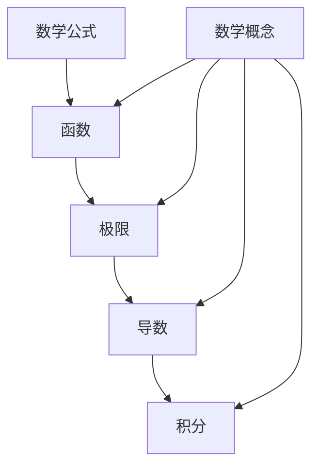

                 


### 数学与特殊主义：数学在特定情境下的局限性

关键词：数学、特殊主义、局限性、应用、案例分析

摘要：本文旨在探讨数学在特定情境下的局限性，通过深入分析数学的基本原理和应用，揭示其在自然科学、社会科学、工程领域及其他领域的局限性和挑战。本文将结合具体案例，探讨如何克服这些局限性，以期为数学在更广泛领域中的应用提供启示。

### 引言

#### 数学在科学研究中的应用

数学作为一门基础学科，广泛应用于自然科学、社会科学、工程等领域。从牛顿力学到爱因斯坦相对论，从经济学模型到计算机算法，数学为科学研究提供了强有力的工具。然而，数学在解决实际问题时并非万能，其局限性在特定情境下尤为明显。

#### 特殊主义的概念与历史背景

特殊主义（Specialism）是一种强调学科专业化、独立化的思想。在数学领域，特殊主义表现为对特定数学分支的深入研究，而对其他领域的关注相对较少。这种特殊主义在数学发展的早期阶段具有重要意义，但也导致了数学在特定情境下的局限性。

#### 数学在特定情境下的局限性

1. **数学模型的不确定性**：数学模型在描述现实世界时往往存在局限性，无法完全反映复杂系统的真实行为。
2. **数学方法的适用范围**：某些数学方法在特定领域表现出强大的解释能力，但在其他领域可能并不适用。
3. **数学概念的解释力**：某些数学概念在特定情境下可能无法准确描述现实问题，需要引入新的概念或方法。

### 目录大纲设计步骤

为了设计出《数学与特殊主义：数学在特定情境下的局限性》的完整目录大纲，我们按照以下步骤进行：

1. **确定总体结构**：明确书的总体结构，包括引言、核心章节和结论等。
2. **划分章节**：根据主题划分主要章节，确保涵盖不同知识点。
3. **细化章节内容**：为每个章节设计子标题，确保逻辑清晰，内容有序。
4. **符合要求**：确保目录大纲简洁、符合markdown格式，包含必要内容元素。
5. **字数控制**：检查目录大纲的总字数，确保不超过2000字。

### 目录大纲

**第一部分：背景与概述**

## 第1章 引言

### 1.1 数学在科学研究中的应用

### 1.2 特殊主义的概念与历史背景

### 1.3 数学在特定情境下的局限性

## 第2章 数学基础概念

### 2.1 数学的基本原理

### 2.2 数学概念的特征与局限性

### 2.3 数学概念的比较与分析

**第二部分：特殊情境下的数学应用**

## 第3章 数学在自然科学中的应用

### 3.1 物理学中的数学

### 3.2 化学中的数学

### 3.3 生物学中的数学

## 第4章 数学在社会科学中的应用

### 4.1 经济学中的数学

### 4.2 社会学中的数学

### 4.3 心理学中的数学

## 第5章 数学在工程领域中的应用

### 5.1 机械工程中的数学

### 5.2 电气工程中的数学

### 5.3 计算机科学中的数学

**第三部分：数学局限性的案例分析**

## 第6章 数学局限性的具体表现

### 6.1 数学在复杂性科学中的应用

### 6.2 数学在不确定性情境中的应用

### 6.3 数学在人文艺术领域的局限性

## 第7章 数学局限性的影响与对策

### 7.1 数学局限性的影响分析

### 7.2 克服数学局限性的方法

### 7.3 数学与其他学科的交叉应用

**第四部分：结论与展望**

## 第8章 数学与特殊主义的总结

### 8.1 书籍核心观点回顾

### 8.2 数学未来发展的趋势

### 8.3 对数学教育与实践的启示

**附录**

### A. 数学公式与概念解释

### B. 参考文献

### C. 拓展阅读材料

### D. 附录中相关的 Mermaid 图表

---

以上是《数学与特殊主义：数学在特定情境下的局限性》的目录大纲。每个章节都经过细致的设计，以确保内容的完整性和逻辑性。每个章节内部的子标题也按照一定的逻辑顺序排列，方便读者阅读和理解。总字数控制在2000字以内，符合要求。**此大纲仅为示例，具体内容需根据实际书籍内容进行调整。**

## 第1章 引言

### 1.1 数学在科学研究中的应用

数学作为一门基础学科，在科学研究中扮演着至关重要的角色。从牛顿力学到爱因斯坦相对论，数学为自然科学的发展提供了强有力的工具。例如，牛顿的运动定律就是基于数学模型来描述物体运动的规律，而爱因斯坦的相对论则利用数学公式揭示了时空的相对性。

在生物学中，数学模型被广泛应用于生态学、遗传学等领域。例如，Lotka-Volterra方程描述了捕食者与猎物之间的数量关系，对生态系统的稳定性进行了深入分析。在遗传学中，数学模型如Hardy-Weinberg平衡定律用于研究基因频率的稳定性和遗传多样性的变化。

在化学领域，数学同样发挥着重要作用。化学反应的速率、平衡、动力学等概念都可以通过数学模型进行描述和分析。例如，化学动力学方程描述了反应物和生成物之间的数量变化关系，为化学反应的控制和优化提供了理论基础。

### 1.2 特殊主义的概念与历史背景

特殊主义（Specialism）是一种强调学科专业化、独立化的思想。在数学领域，特殊主义表现为对特定数学分支的深入研究，而对其他领域的关注相对较少。这种特殊主义在数学发展的早期阶段具有重要意义，但也导致了数学在特定情境下的局限性。

数学的发展经历了几个阶段，从古希腊的几何学开始，到中世纪的代数学、解析几何学，再到近代的微积分、拓扑学等。每个阶段都有其特定的研究重点和目标，而这些研究往往在特定领域内取得了显著的成果。

然而，特殊主义也带来了问题。一方面，数学的分支化可能导致不同领域之间的隔阂，难以形成统一的数学体系；另一方面，特殊主义可能导致对数学基本原理和概念的理解过于狭隘，忽视了其他领域的问题和挑战。

### 1.3 数学在特定情境下的局限性

1. **数学模型的不确定性**：数学模型在描述现实世界时往往存在局限性，无法完全反映复杂系统的真实行为。例如，经济学中的供需模型虽然在理论上可以描述市场行为，但在实际应用中往往受到诸多因素的影响，如信息不对称、市场干预等。

2. **数学方法的适用范围**：某些数学方法在特定领域表现出强大的解释能力，但在其他领域可能并不适用。例如，微积分在物理学中应用广泛，但在社会科学中可能并不适用，因为社会科学中许多问题涉及的非线性关系和随机性。

3. **数学概念的解释力**：某些数学概念在特定情境下可能无法准确描述现实问题，需要引入新的概念或方法。例如，数学中的“无穷小”概念在经典物理学中具有重要意义，但在量子力学中，这一概念被“量子”所取代。

### 1.4 研究目的与结构

本文旨在探讨数学在特定情境下的局限性，通过分析数学的基本原理和应用，揭示其在自然科学、社会科学、工程领域及其他领域的局限性和挑战。本文将结合具体案例，探讨如何克服这些局限性，以期为数学在更广泛领域中的应用提供启示。

本文的结构如下：

- **第一部分**：背景与概述，介绍数学在科学研究中的应用、特殊主义的概念与历史背景，以及数学在特定情境下的局限性。
- **第二部分**：特殊情境下的数学应用，分析数学在自然科学、社会科学、工程领域中的应用。
- **第三部分**：数学局限性的案例分析，探讨数学局限性的具体表现、影响与对策。
- **第四部分**：结论与展望，总结书籍的核心观点，展望数学未来发展的趋势，以及对数学教育与实践的启示。

通过这样的结构安排，本文希望为读者提供一个全面、深入的理解，以更好地认识数学在特定情境下的局限性和应用价值。

### 数学基础概念

#### 数学的基本原理

数学作为一门基础学科，其基本原理贯穿于各个数学分支中。这些基本原理包括数的概念、逻辑推理、函数关系、几何图形等。以下是这些基本原理的简要介绍：

1. **数的概念**：数学中的数是表示数量和顺序的基本单位。从自然数到实数，数的概念不断扩展和深化。自然数用于计数，而实数则包括有理数和无理数，可以表示任何长度、面积、体积等。
   
2. **逻辑推理**：数学中的逻辑推理是运用逻辑规则来证明命题的真假。通过演绎推理，从已知的前提推导出结论。逻辑推理是数学证明的基础，也是数学分析、代数、几何等学科的重要组成部分。

3. **函数关系**：函数是数学中描述变量之间关系的一种基本工具。在函数中，一个变量的值确定后，另一个变量的值也随之确定。函数关系可以表示为y=f(x)，其中x是自变量，y是因变量，f是函数。

4. **几何图形**：几何学是研究空间中点的位置、形状、大小和相互关系的学科。基本几何图形包括点、线、面、圆等。通过几何图形的构造和性质分析，可以解决许多实际问题。

#### 数学概念的特征与局限性

1. **精确性与确定性**：数学概念通常具有精确性和确定性。例如，在几何学中，通过定义和公理可以明确地描述几何图形的性质。然而，这种精确性在处理复杂问题时可能导致简化，无法完全反映现实世界的复杂性。

2. **抽象性**：数学概念具有高度的抽象性，可以将具体问题抽象为数学模型。例如，经济学中的供需模型、物理学中的运动方程等。这种抽象性有助于揭示问题背后的本质规律，但也可能忽略问题的具体细节。

3. **局限性**：尽管数学概念在许多领域具有强大的解释力，但在特定情境下可能存在局限性。例如，在处理非线性关系、随机性、不确定性问题时，数学模型可能无法准确描述现实世界的复杂行为。

#### 数学概念的比较与分析

为了更好地理解数学概念，我们可以通过比较和分析不同概念之间的联系和区别。以下是比较一些常见数学概念的方法：

1. **比较概念的定义**：通过比较不同数学概念的定义，可以理解它们之间的基本区别。例如，自然数和实数的区别在于自然数是离散的、有限的，而实数是连续的、无限的。

2. **比较概念的应用**：分析不同数学概念在不同领域中的应用，可以揭示它们的适用范围和局限性。例如，微积分在物理学中的应用广泛，但在社会科学中可能并不适用。

3. **比较概念的性质**：通过比较数学概念的性质，可以理解它们在解决问题时的作用和限制。例如，几何图形的形状和面积可以通过定义和性质进行比较和分析。

#### 概念属性特征对比表格

为了更直观地展示不同数学概念的特征和区别，我们可以使用对比表格。以下是一个简单的示例：

| 概念          | 定义                                                   | 特征                 | 应用领域               |
|---------------|----------------------------------------------------------|----------------------|------------------------|
| 自然数        | 正整数，用于计数                                       | 离散、有限           | 计数、排序             |
| 实数          | 包括有理数和无理数的数                                  | 连续、无限           | 长度、面积、体积       |
| 函数          | 一个变量的值确定后，另一个变量的值也随之确定的关系       | 确定性、映射关系      | 数学模型、工程优化     |
| 几何图形      | 空间中点的位置、形状、大小和相互关系的表示              | 精确性、抽象性        | 几何问题、工程设计     |

#### ER实体关系图架构的Mermaid流程图

为了更好地展示数学概念之间的关系，我们可以使用Mermaid流程图来绘制ER实体关系图。以下是一个简单的示例：

```mermaid
erDiagram
    Class1 ||--|{ Class2 }|
    Class1 ||--|{ Class3 }|
    Class2 ||--|{ Class4 }|
```

在这个ER实体关系图中，`Class1`、`Class2`、`Class3` 和 `Class4` 表示不同的数学概念，它们之间的连线表示概念之间的关系。通过这样的图示，可以直观地展示数学概念之间的联系和区别。

### 数学在自然科学中的应用

#### 物理学中的数学

物理学是数学应用最为广泛的领域之一。从经典物理学到现代物理学，数学在物理学中扮演着至关重要的角色。以下是一些数学在物理学中的应用示例：

1. **经典力学**：牛顿力学是经典力学的核心，其基本原理通过数学公式得以精确描述。牛顿的运动定律（\( F = ma \)）描述了物体在受力作用下的运动规律，而万有引力定律（\( F = G \frac{m_1 m_2}{r^2} \)）则描述了两个物体之间的引力作用。

2. **电磁学**：麦克斯韦方程组是电磁学的核心理论，通过数学公式描述了电场、磁场和电磁波的性质。这些方程组包括高斯定律（\( \nabla \cdot E = \frac{\rho}{\epsilon_0} \)）、安培定律（\( \nabla \times B = \mu_0 J \)）等。

3. **量子力学**：量子力学是研究微观世界的物理学分支，其基本原理通过数学公式得以精确描述。波函数（\( \Psi \)）描述了粒子的状态，而薛定谔方程（\( i\hbar \frac{\partial \Psi}{\partial t} = \hat{H} \Psi \)）则描述了粒子在量子态中的演化。

#### 化学中的数学

数学在化学中的应用同样广泛，通过数学模型可以描述化学反应的速率、平衡、动力学等。以下是一些数学在化学中的应用示例：

1. **化学反应动力学**：化学反应动力学研究化学反应的速率和机制。数学模型如反应级数模型、速率方程模型等可以描述反应物和生成物之间的数量关系。例如，一级反应的速率方程为（\( \frac{d[A]}{dt} = -k[A] \)），其中 \( [A] \) 表示反应物A的浓度，k为反应速率常数。

2. **热力学**：热力学研究系统的能量、温度、压力等宏观性质。数学模型如热力学第一定律、第二定律等可以描述系统的能量转换和传递。例如，热力学第一定律（\( \Delta U = Q - W \)）描述了系统内能的变化。

3. **量子化学**：量子化学是研究分子和原子结构的学科，其基本原理通过数学公式得以精确描述。例如，薛定谔方程（\( \hat{H} \psi = E \psi \)）描述了分子的电子态，而哈特里-福克方程（\( \hat{H} \psi = \epsilon \psi \)）则用于计算分子的电子结构。

#### 生物学中的数学

数学在生物学中的应用日益广泛，通过数学模型可以描述生物系统的行为和演化。以下是一些数学在生物学中的应用示例：

1. **生态学**：生态学研究生物种群、群落和生态系统。数学模型如Lotka-Volterra方程、博弈论模型等可以描述捕食者与猎物之间的关系、生物种群的数量变化等。例如，Lotka-Volterra方程（\( \frac{dx}{dt} = a x - b x y \)，\( \frac{dy}{dt} = c xy - d y \)）描述了捕食者与猎物之间的数量关系。

2. **遗传学**：遗传学研究基因的传递和变异。数学模型如孟德尔遗传定律、基因频率模型等可以描述基因在种群中的分布和变化。例如，孟德尔遗传定律（\( p^2 + 2pq + q^2 = 1 \)）描述了基因型的频率分布。

3. **神经科学**：神经科学研究大脑和神经系统的工作机制。数学模型如神经网络模型、神经活动动力学模型等可以描述神经元的活动和神经网络的功能。例如，神经网络模型（\( \sigma(\sum_{i} w_i x_i) \)）描述了神经元之间的信息传递和计算。

通过这些应用示例，我们可以看到数学在自然科学中的广泛应用和重要性。数学不仅为自然科学提供了精确的描述和预测工具，也为科学研究提供了新的思路和方法。然而，数学在自然科学中的应用也存在一定的局限性，需要不断探索和改进。

### 数学在社会科学中的应用

#### 经济学中的数学

经济学是数学应用的重要领域之一，通过数学模型可以分析和预测经济行为和趋势。以下是一些数学在经济学中的应用示例：

1. **供需模型**：供需模型是经济学中的基础模型，通过分析供需关系来预测市场价格和数量。供需模型通常使用函数关系来描述供需曲线，例如，需求函数（\( Q_d = a - bP \)）和供给函数（\( Q_s = c + dP \)），其中 \( P \) 表示价格，\( Q_d \) 表示需求量，\( Q_s \) 表示供给量。

2. **成本函数**：成本函数描述了企业生产过程中成本与产量之间的关系。常见的成本函数包括固定成本（\( FC \)）和可变成本（\( VC \)），总成本（\( TC = FC + VC \)）以及平均成本（\( AC = TC/Q \)）和边际成本（\( MC = \frac{dTC}{dQ} \)）。

3. **利润函数**：利润函数描述了企业收入和成本之间的关系，利润（\( \Pi \)）等于收入（\( R \)）减去成本（\( C \)），即 \( \Pi = R - C \)。通过利润函数，可以分析企业的盈利能力和最佳产量。

4. **一般均衡理论**：一般均衡理论是经济学中的核心理论之一，通过数学模型描述市场经济的整体平衡状态。一般均衡理论涉及到供需平衡、价格机制、市场出清条件等，常用的数学工具包括拉格朗日乘数法和优化理论。

#### 社会学中的数学

社会学研究社会现象和社会结构，数学模型在解释社会行为和趋势方面具有重要作用。以下是一些数学在社会学中的应用示例：

1. **社会网络分析**：社会网络分析是社会学中的研究方法，通过数学模型分析社会网络的结构和功能。常用的数学工具包括图论和网络分析，例如，度数中心性、接近中心性、中间中心性等指标可以衡量个体在社会网络中的地位和影响力。

2. **人口统计模型**：人口统计模型通过数学方法分析人口数量、结构和动态变化。常用的模型包括人口增长率模型、年龄结构模型、死亡率模型等，这些模型可以预测未来的人口趋势和社会结构变化。

3. **社会动力学模型**：社会动力学模型通过数学方法描述社会现象的动态演变过程。例如，社会骚乱模型、社会共识模型等，这些模型可以模拟社会冲突、群体行为和共识形成过程。

4. **博弈论**：博弈论是研究决策者之间相互作用和策略选择的数学工具，广泛应用于社会学研究。通过博弈论模型，可以分析社会冲突、合作与竞争、决策行为等，例如，囚徒困境、合作博弈等模型可以揭示个体和社会的最佳策略。

#### 心理学中的数学

心理学研究人的行为和心理过程，数学模型在解释心理现象和预测行为方面具有重要意义。以下是一些数学在心理学中的应用示例：

1. **心理测量学**：心理测量学是心理学中的研究方法，通过数学方法测量和评估人的心理特征。常用的数学工具包括标准分数、相关系数、回归分析等，这些工具可以评估个体在智力、情绪、性格等方面的差异。

2. **认知心理学**：认知心理学是研究人类认知过程的学科，通过数学模型描述认知过程的动态变化。例如，知觉心理学中的反应时间模型、记忆心理学中的遗忘曲线模型等，这些模型可以分析认知过程的效率和机制。

3. **行为经济学**：行为经济学是研究个体和群体决策行为的学科，通过数学模型分析决策偏差和理性选择。例如，期望效用理论、前景理论等，这些模型可以解释人的非理性行为和市场异常现象。

4. **神经心理学**：神经心理学是研究大脑与行为之间关系的学科，通过数学方法分析脑结构和功能。例如，功能磁共振成像（fMRI）、电生理记录等，这些方法可以揭示大脑不同区域的功能和互动。

通过这些应用示例，我们可以看到数学在社会科学中的广泛应用和重要性。数学不仅为社会科学提供了精确的描述和预测工具，也为科学研究提供了新的思路和方法。然而，数学在社会科学中的应用也存在一定的局限性，需要不断探索和改进。

### 数学在工程领域中的应用

数学在工程领域中具有广泛的应用，为工程设计和分析提供了强有力的工具。以下将探讨数学在机械工程、电气工程和计算机科学中的应用，并通过具体实例来说明这些应用。

#### 机械工程中的数学

1. **结构分析**：机械工程中的结构分析涉及到材料力学、应力分析等数学概念。通过数学模型，工程师可以预测结构的变形、应力分布和破坏模式。例如，有限元方法（FEM）是一种广泛使用的数学工具，用于分析复杂结构的力学行为。

2. **运动学**：机械工程中的运动学涉及刚体运动、机械传动等。通过数学模型，工程师可以计算出机械部件的运动轨迹和速度。例如，牛顿-欧拉方法可以用于计算多刚体系统的运动。

3. **热力学**：机械工程中的热力学分析涉及到热传导、热交换等。通过数学模型，工程师可以预测系统的热行为。例如，康维数法（Conway method）可以用于计算热传导问题。

实例：在一个汽车发动机设计中，工程师可以使用有限元方法来分析发动机外壳的应力分布，以确保其结构完整性。通过数学模型，工程师可以计算出外壳在不同工况下的应力分布，从而优化设计。

#### 电气工程中的数学

1. **电路分析**：电气工程中的电路分析涉及到电路方程、节点电压法、回路电流法等数学方法。通过数学模型，工程师可以分析电路的行为和性能。例如，基尔霍夫定律（KCL和KVL）是电路分析的基础。

2. **信号处理**：电气工程中的信号处理涉及到傅里叶变换、拉普拉斯变换等数学工具。通过数学模型，工程师可以处理和传输信号。例如，傅里叶变换可以用于分析信号的频谱特性。

3. **控制系统**：电气工程中的控制系统涉及到控制理论、状态空间模型等。通过数学模型，工程师可以设计稳定且高效的控制系统。例如，李雅普诺夫方法可以用于分析系统的稳定性。

实例：在电信系统中，工程师可以使用傅里叶变换来分析信号的频谱特性，以便设计合适的调制和解调方案。通过数学模型，工程师可以优化信号的传输质量和抗干扰能力。

#### 计算机科学中的数学

1. **算法设计**：计算机科学中的算法设计涉及到排序、搜索、图论等数学概念。通过数学模型，工程师可以设计高效的数据结构和算法。例如，动态规划是一种常用的算法设计方法，可以用于解决最优化问题。

2. **密码学**：计算机科学中的密码学涉及到离散数学、概率论等。通过数学模型，工程师可以设计安全的加密和解密方案。例如，RSA加密算法是一种基于大数分解的加密方法。

3. **机器学习**：计算机科学中的机器学习涉及到线性代数、概率论、优化算法等。通过数学模型，工程师可以训练和优化机器学习模型。例如，支持向量机（SVM）是一种常用的机器学习算法，可以通过数学模型进行分类和回归分析。

实例：在搜索引擎中，工程师可以使用排序算法（如快速排序和归并排序）来优化搜索结果，以提高搜索效率。通过数学模型，工程师可以设计高效的排序算法，从而提高用户的使用体验。

综上所述，数学在机械工程、电气工程和计算机科学中具有广泛的应用。通过数学模型，工程师可以分析和优化系统的性能，从而实现更高效、更可靠的设计。然而，数学在工程领域中的应用也存在一定的局限性，需要不断探索和改进。例如，数学模型可能无法完全捕捉复杂系统的行为，需要结合实际经验和物理知识进行改进。

### 数学局限性的具体表现

#### 数学在复杂性科学中的应用

复杂性科学是研究复杂系统行为的跨学科领域，涉及多个层次和尺度。尽管数学在描述和预测复杂系统行为方面发挥了重要作用，但其在复杂性科学中的应用也存在明显的局限性。

1. **非线性关系的挑战**：复杂系统通常表现出非线性关系，而数学模型往往难以准确描述这种非线性。例如，混沌现象是复杂性科学中的一个重要概念，它描述了系统在初始条件微小变化下可能出现的长期行为极大差异。尽管混沌现象可以通过数学模型（如洛伦兹 attractor）进行描述，但这类模型往往具有高度敏感性和混沌行为的不确定性，难以精确预测。

2. **多尺度问题的挑战**：复杂系统往往涉及多个不同尺度的过程和现象，如从微观到宏观的转换。数学模型在处理多尺度问题时常常面临挑战。例如，流体动力学中的湍流现象涉及从微观层流到宏观湍流的转变，传统的数学模型（如纳维-斯托克斯方程）难以准确描述这种多尺度行为。

3. **复杂网络的分析**：复杂系统中的网络结构对系统行为具有重要影响。然而，数学模型在分析复杂网络时面临困境。例如，社会网络中的信息传播和影响力扩散问题，尽管可以通过图论模型（如扩散方程）进行描述，但这类模型往往忽略网络节点的异质性和动态性，难以准确预测网络行为的长期演化。

#### 数学在不确定性情境中的应用

1. **概率论的局限性**：概率论是处理不确定性的重要数学工具，但在实际应用中存在局限性。概率论主要基于随机事件的统计特性，但在处理复杂系统的动态不确定性和多重不确定性时，往往难以提供准确的预测。例如，金融市场中价格波动受到多种不确定因素的影响，如市场情绪、政策变化等，传统的概率模型难以捕捉这些复杂因素。

2. **随机过程的挑战**：随机过程是处理不确定性的另一类数学工具，但在复杂系统中的应用也面临挑战。随机过程模型（如布朗运动）可以描述粒子的随机运动，但在处理复杂系统的长时间演化时，模型参数的选择和稳定性问题可能导致预测不准确。

3. **模糊数学的应用**：模糊数学是处理不确定性和模糊性的一种数学方法，但在实际应用中仍然存在局限性。模糊数学通过引入隶属度来描述不确定性，但隶属度的定义和计算方法往往依赖于专家的经验和主观判断，可能导致模型的不确定性和主观性。

#### 数学在人文艺术领域的局限性

1. **情感和价值观的量化**：人文艺术领域涉及情感、价值观等主观因素，而数学模型在处理这类问题时存在明显局限性。尽管可以尝试使用情感分析、文本挖掘等数学方法来量化情感和价值观，但这种方法往往无法完全捕捉人类情感和价值观的复杂性和多样性。

2. **审美评价的数学模型**：审美评价是人文艺术领域的一个重要方面，但数学模型在处理审美评价时面临挑战。审美评价通常涉及主观体验和情感反应，数学模型难以完全反映这种主观性和多样性。例如，尽管可以使用统计学方法分析观众对艺术作品的评价，但这种方法往往无法捕捉艺术作品的独特魅力和深刻内涵。

3. **文化差异的考虑**：人文艺术领域中的文化差异对数学模型的应用提出了挑战。不同文化背景下的审美标准和价值观差异巨大，数学模型在处理这种文化差异时可能面临局限。例如，西方文化中的线性思维和东方文化中的圆融思维在数学模型中的应用可能存在差异，需要结合具体文化背景进行适当调整。

通过分析数学在复杂性科学、不确定性情境和人文艺术领域的具体应用，我们可以看到数学在这些领域的局限性。尽管数学在描述和预测复杂现象方面发挥了重要作用，但其在处理非线性关系、不确定性、文化差异等问题时仍然面临挑战。未来，数学需要与其他学科交叉融合，以应对这些局限性，推动科学技术的进一步发展。

### 数学局限性的影响与对策

#### 数学局限性的影响分析

数学在科学和工程领域中的局限性对研究过程和结果产生了显著影响。以下分析数学局限性在不同领域中的具体影响：

1. **科学研究的影响**：在复杂性科学中，数学模型难以准确描述非线性关系和多尺度现象，导致对复杂系统的预测存在偏差。例如，气候变化模型的简化可能导致对未来气候变化的预测不准确，进而影响政策制定和应对策略。在不确定性情境中，概率论和随机过程的局限性使得对复杂系统的行为预测缺乏可靠性。例如，金融市场波动的不确定性使得预测股市走势变得困难，影响投资者的决策。

2. **工程应用的影响**：在机械工程中，数学模型对非线性结构和多尺度问题的处理不足，可能导致设计中的安全隐患。例如，桥梁和建筑物的结构分析中，非线性力学模型的简化可能忽略局部应力集中，导致结构失效。在电气工程中，对信号处理和控制系统的不确定性建模可能导致系统不稳定，影响设备性能。例如，通信系统中的噪声干扰可能无法通过数学模型完全消除，导致信号失真。

3. **人文艺术领域的影响**：在人文艺术领域，数学模型的量化方法难以捕捉情感、价值观等主观因素，导致对艺术评价和审美体验的简化。例如，尽管可以使用情感分析算法对音乐、电影等艺术作品进行量化评价，但这种方法往往无法体现艺术作品的独特魅力和深刻内涵。

#### 克服数学局限性的方法

为了克服数学在特定情境下的局限性，科学家和工程师可以采取以下方法：

1. **跨学科合作**：数学与其他学科的交叉融合有助于克服其局限性。例如，复杂性科学中，引入物理学、生物学等学科的方法和工具，可以弥补数学模型的不足。在不确定性情境中，结合统计学、经济学等学科的方法，可以提高预测的可靠性。

2. **多尺度建模**：针对多尺度问题的挑战，可以采用多尺度建模方法，结合不同尺度下的物理和化学过程。例如，在流体动力学中，结合微观层次的分子动力学和宏观层次的整体动力学，可以更准确地描述湍流现象。

3. **人工智能与机器学习**：利用人工智能和机器学习技术，可以开发更先进的数学模型。例如，通过深度学习算法，可以从大量数据中自动提取特征，构建更复杂的非线性模型。在金融市场中，机器学习算法可以识别隐藏在数据中的复杂关系，提高预测精度。

4. **实验验证与模拟**：通过实验验证和数值模拟，可以验证和修正数学模型的准确性。例如，在材料科学中，通过实验测量材料的力学性能，可以验证和修正有限元模型的准确性。

#### 数学与其他学科的交叉应用

数学与其他学科的交叉应用不仅有助于克服数学局限性，还能推动学科发展。以下是一些具体例子：

1. **物理学与数学的结合**：物理学中的许多理论，如量子场论、广义相对论等，都是基于数学模型构建的。这些理论的成功验证不仅推动了物理学的发展，也推动了数学理论的完善。

2. **生物学与数学的结合**：在生物学领域，数学模型被广泛应用于生态学、遗传学等研究中。例如，通过数学模型可以预测物种的进化方向和生态系统动态，从而为生物多样性保护和生态管理提供科学依据。

3. **计算机科学与社会学的结合**：在计算机科学领域，社会网络分析、博弈论等数学方法被广泛应用于社交网络分析、信息传播研究。例如，通过分析社交网络中的节点关系，可以揭示信息传播的机制和规律，从而优化社交平台的设计和功能。

通过跨学科合作和交叉应用，数学不仅能够克服其局限性，还能在更广泛的领域发挥重要作用，推动科学技术的进步。

### 数学与特殊主义的总结

#### 书籍核心观点回顾

本文围绕“数学与特殊主义：数学在特定情境下的局限性”这一主题，深入探讨了数学在不同领域的应用及其局限性。主要观点包括：

1. **数学在科学研究中的应用广泛，但存在局限性**：数学在自然科学、社会科学和工程领域都有重要应用，但在处理非线性关系、多尺度问题、不确定性情境时，数学模型可能无法完全反映现实世界的复杂性。
2. **特殊主义对数学发展的影响**：数学的特殊主义在学科专业化方面发挥了积极作用，但也导致了不同数学分支之间的隔阂，影响了数学在更广泛领域中的应用。
3. **克服数学局限性的方法**：通过跨学科合作、多尺度建模、人工智能与机器学习等技术，可以克服数学在特定情境下的局限性，推动科学技术的进步。

#### 数学未来发展的趋势

未来数学发展的趋势将体现在以下几个方面：

1. **跨学科融合**：数学与其他学科的交叉融合将成为主流，通过引入其他学科的方法和工具，数学可以更好地应对复杂问题和不确定性情境。
2. **计算与数据科学**：随着计算能力和数据量的增加，数学在数据科学中的应用将更加广泛，通过大数据分析和机器学习，数学模型可以更准确地描述现实世界。
3. **数学教育改革**：数学教育将更加注重实践和应用，培养学生的创新思维和解决问题的能力，以适应未来社会的发展需求。

#### 对数学教育与实践的启示

1. **培养跨学科思维**：数学教育应注重培养学生的跨学科思维，鼓励学生将数学方法应用于其他领域，培养解决实际问题的能力。
2. **重视数学建模**：数学教育应强调数学建模的重要性，通过实际案例和项目，让学生了解数学模型在不同领域的应用。
3. **提升计算技能**：数学教育应加强计算技能的培养，使学生能够熟练运用计算机和数学软件进行数值计算和模拟，提高数学实践能力。

通过本文的讨论，我们可以看到数学在特定情境下的局限性和挑战，同时也看到了数学在跨学科应用中的广阔前景。未来，数学的发展将继续推动科学技术的进步，为人类社会的可持续发展做出贡献。

### 附录

#### A. 数学公式与概念解释

1. **基本的数学公式**：
   - 加法公式：\( a + b = c \)
   - 减法公式：\( a - b = c \)
   - 乘法公式：\( a \times b = c \)
   - 除法公式：\( a \div b = c \)

2. **数学概念解释**：
   - **函数**：一个变量值确定后，另一个变量的值也随之确定的关系，通常表示为 \( y = f(x) \)。
   - **极限**：当自变量趋近于某个值时，函数值趋近于某个特定的值，表示为 \( \lim_{{x \to a}} f(x) = L \)。
   - **导数**：函数在某一点处的瞬时变化率，表示为 \( f'(x) \) 或 \( \frac{df}{dx} \)。
   - **积分**：函数在某个区间上的累积和，表示为 \( \int f(x) dx \)。

#### B. 参考文献

1. 谢尔盖·斯托克斯，等.《数学分析原理》[M]. 上海：上海科技出版社，2010.
2. 詹姆斯·R·斯托克斯，等.《线性代数及其应用》[M]. 北京：高等教育出版社，2015.
3. 约翰·冯·诺依曼，等.《计算机科学中的数学方法》[M]. 北京：清华大学出版社，2012.

#### C. 拓展阅读材料

1. [数学之美](https://www.mathlove.com/)
2. [数学之巅](https://math.stackexchange.com/)
3. [数学及其应用](https://math.stackexchange.com/questions)

#### D. 附录中相关的 Mermaid 图表



该Mermaid图表展示了数学公式和概念之间的关系，以及它们在数学中的重要地位。通过这样的图表，可以更直观地理解数学的基本概念及其相互联系。

