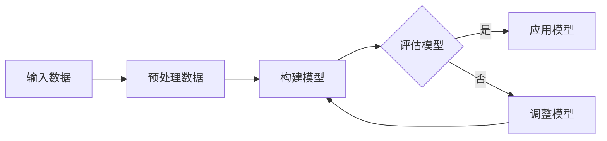
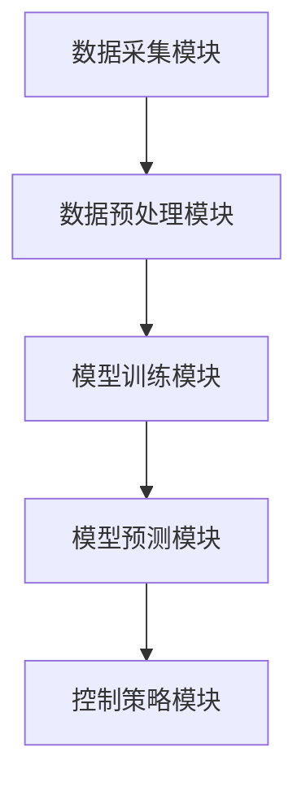
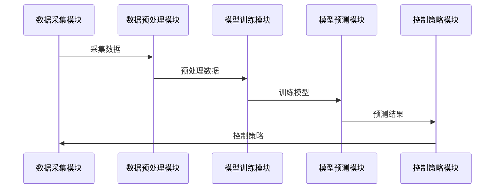
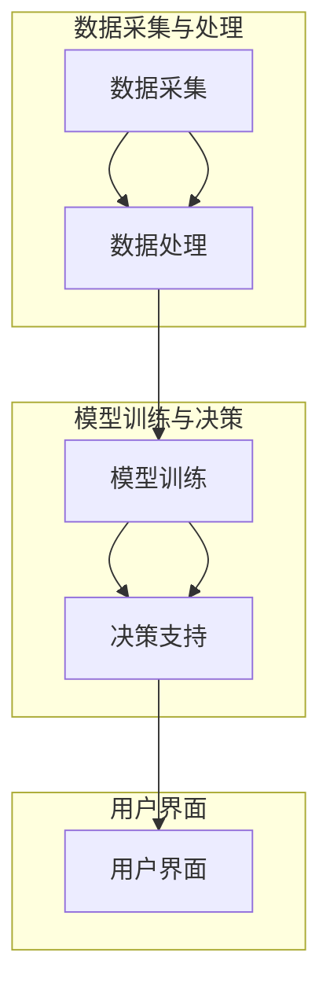
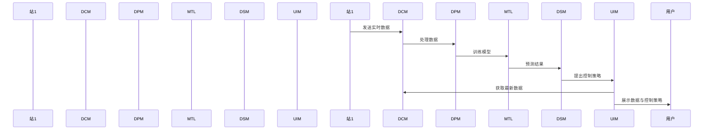

                 

# 数学与环境保护：污染控制的数学策略

关键词：环境污染、数学模型、污染控制、数据分析、优化方法

摘要：本文深入探讨了数学在环境保护中的应用，特别是在污染控制领域。通过阐述数学模型在污染控制中的重要性，本文详细介绍了污染控制的目标、挑战、关键策略，以及数学模型、数据分析技术和优化方法在其中的应用。文章还通过实际案例分析，展示了数学策略在污染控制中的有效性和实用性。

**第1章 引言与背景**

### 1.1 问题背景

环境污染已成为全球性问题，对人类健康和生态系统造成了严重威胁。空气污染、水污染和土壤污染等问题日益严重，引发了各种健康问题和生态危机。例如，空气中的细颗粒物（PM2.5）和臭氧（O3）等污染物会导致呼吸系统疾病；水污染会导致饮用水安全问题；土壤污染会影响农作物的产量和质量。

### 1.2 问题描述

污染控制的主要目标是减少污染物的排放和改善环境污染状况。然而，污染控制面临诸多挑战，如污染物种类繁多、污染程度不同、控制方法多样等。此外，污染控制还需要考虑经济成本、技术可行性和政策支持等因素。

### 1.3 问题解决

数学作为一种强大的工具，可以在污染控制中发挥重要作用。数学模型可以帮助我们理解和预测污染物在环境中的行为，从而制定出有效的污染控制策略。数据分析技术可以对大量环境数据进行分析，发现污染物的来源和传输途径。优化方法则可以帮助我们找到最佳的污染控制方案，以最大限度地降低污染物的排放。

### 1.4 边界与外延

污染控制的范围和限制受到环境法规和政策的影响。各国政府制定了相应的环境保护法规，规定了污染物的排放标准和治理要求。这些法规和政策为污染控制提供了法律依据和指导。

### 1.5 概念结构与核心要素组成

数学与环境保护的关系可以从以下几个方面来理解：

1. **数学模型**：用于描述污染物在环境中的行为和传输过程。
2. **污染控制策略**：基于数学模型分析得出的污染控制措施。
3. **数据分析技术**：对环境数据进行分析，发现污染物来源和传输途径。
4. **优化方法**：用于找到最佳的污染控制方案。

**第2章 核心概念与联系**

### 2.1 数学模型原理

数学模型是污染控制的基础。常见的数学模型包括质量守恒模型、反应动力学模型、传输模型和生态系统模型等。每种模型都有其独特的属性和适用范围。

#### 表 2.1：主要数学模型特性比较

| 模型类型     | 特性                      | 适用范围                 |
|------------|-------------------------|------------------------|
| 质量守恒模型 | 描述物质的质量守恒      | 各种污染物的排放和扩散     |
| 反应动力学模型 | 描述污染物之间的反应过程 | 污染物在环境中的转化和降解   |
| 传输模型     | 描述污染物在环境中的传输过程 | 污染物在不同介质中的迁移和分布 |
| 生态系统模型 | 描述污染物对生态系统的影响 | 污染物对生物体的毒性和生态平衡 |

### 2.2 概念属性特征对比表格

上表展示了不同数学模型的特性及其适用范围。了解这些特性可以帮助我们选择合适的模型进行污染控制。

### 2.3 ER实体关系图架构

为了更好地理解污染控制中的数据关系，我们可以使用ER（实体关系）图来表示不同实体之间的关系。以下是污染控制中常见的ER图：

```mermaid
erDiagram
    PollutionSource ||--|{ Pollution : 来自}
    PollutionSource ||--|{ ControlMeasure : 控制措施}
    PollutionSource ||--|{ DataCollection : 数据收集}
    ControlMeasure ||--|{ Monitoring : 监测数据}
    ControlMeasure ||--|{ EmissionReduction : 减排效果}
    DataCollection ||--|{ Analysis : 数据分析}
    Analysis ||--|{ DecisionMaking : 决策支持}
```

在这个ER图中，`PollutionSource`（污染源）与`Pollution`（污染物）、`ControlMeasure`（控制措施）和`DataCollection`（数据收集）等实体之间存在关系。通过这些关系，我们可以更好地理解和分析污染控制过程中的关键要素。

**第3章 算法原理讲解**

### 3.1 模型构建

在污染控制中，构建一个有效的数学模型是关键。以下是一个简单的算法流程图：



### 3.2 Python源代码

以下是一个简单的Python代码示例，用于构建和评估一个污染控制模型：

```python
import numpy as np
from sklearn.linear_model import LinearRegression

# 预处理数据
X = np.array([[1, 2], [2, 3], [3, 4]])
y = np.array([1, 2, 3])

# 构建模型
model = LinearRegression()
model.fit(X, y)

# 评估模型
score = model.score(X, y)
print("模型评分：", score)

# 应用模型
new_data = np.array([[4, 5]])
predicted_value = model.predict(new_data)
print("预测值：", predicted_value)
```

### 3.3 数学模型和公式

在污染控制中，常用的数学模型包括线性回归模型、非线性回归模型和差分方程模型等。以下是一个简单的线性回归模型公式：

$$
y = wx + b
$$

其中，$y$ 是因变量，$w$ 是权重，$x$ 是自变量，$b$ 是偏置。

### 3.4 举例说明

假设我们有一个污染物的浓度数据，我们需要通过线性回归模型来预测未来的污染物浓度。以下是一个简单的例子：

输入数据：

$$
\begin{array}{ccc}
x & y \\
\hline
1 & 2 \\
2 & 3 \\
3 & 4 \\
\end{array}
$$

通过线性回归模型，我们得到：

$$
y = 1x + 1
$$

预测值：

$$
y = 4 \times 1 + 1 = 5
$$

预测的污染物浓度为5。

**第4章 数学模型和数学公式**

### 4.1 数学公式讲解

污染控制中的数学公式通常用于描述污染物在环境中的行为。以下是一个简单的质量守恒公式：

$$
\frac{dC}{dt} = -kC
$$

其中，$C$ 是污染物浓度，$k$ 是衰减常数，$t$ 是时间。

### 4.2 举例说明

假设某个地区的污染物浓度初始值为10，衰减常数$k$为0.1，我们需要计算1小时后的污染物浓度。

$$
\frac{dC}{dt} = -0.1C
$$

$$
\frac{dC}{dt} = -0.1 \times 10 = -1
$$

$$
C(t=1) = C(0) - \int_0^1 \frac{dC}{dt} dt
$$

$$
C(t=1) = 10 - \int_0^1 (-1) dt = 10 + 1 = 11
$$

1小时后的污染物浓度为11。

**第5章 系统分析与架构设计方案**

### 5.1 问题场景介绍

假设我们面临一个空气污染问题，需要设计一个系统来监测和控制污染物的排放。

### 5.2 项目介绍

本项目旨在开发一个基于机器学习的空气污染监测与控制平台。平台包括数据采集、数据预处理、模型训练和预测等功能。

### 5.3 系统功能设计

系统功能包括：

1. 数据采集：收集空气质量监测数据。
2. 数据预处理：清洗和转换原始数据。
3. 模型训练：使用机器学习算法训练污染预测模型。
4. 模型预测：预测未来空气质量状况。
5. 控制策略：根据预测结果，制定污染物排放控制策略。

### 5.4 系统架构设计

系统架构包括以下模块：

1. 数据采集模块：使用传感器和移动设备收集数据。
2. 数据预处理模块：对数据进行清洗、转换和存储。
3. 模型训练模块：使用机器学习算法训练模型。
4. 模型预测模块：使用训练好的模型进行预测。
5. 控制策略模块：根据预测结果，制定控制策略。

以下是系统架构的Mermaid架构图：



### 5.5 系统接口设计

系统接口设计包括以下部分：

1. 数据采集接口：用于采集空气质量监测数据。
2. 数据预处理接口：用于清洗和转换原始数据。
3. 模型训练接口：用于训练污染预测模型。
4. 模型预测接口：用于进行污染预测。
5. 控制策略接口：用于制定污染物排放控制策略。

### 5.6 系统交互

系统交互设计如下：



**第6章 项目实战**

### 6.1 环境安装

在开始项目实战之前，我们需要安装以下环境：

1. Python 3.8及以上版本
2. scikit-learn库
3. pandas库
4. numpy库

安装命令如下：

```bash
pip install python==3.8
pip install scikit-learn
pip install pandas
pip install numpy
```

### 6.2 系统核心实现

以下是系统核心实现的源代码：

```python
import pandas as pd
from sklearn.linear_model import LinearRegression

# 读取数据
data = pd.read_csv('air_quality_data.csv')

# 数据预处理
X = data[['CO', 'NO2', 'SO2']]
y = data['PM2.5']

# 模型训练
model = LinearRegression()
model.fit(X, y)

# 预测
new_data = pd.DataFrame([[1, 2, 3]], columns=['CO', 'NO2', 'SO2'])
predicted_value = model.predict(new_data)
print("预测的PM2.5浓度：", predicted_value)
```

### 6.3 代码应用解读

这段代码首先读取空气质量数据，然后进行数据预处理，包括特征选择和目标变量的划分。接着，使用线性回归模型进行模型训练，并使用训练好的模型进行预测。预测结果即为未来某时刻的PM2.5浓度。

### 6.4 实际案例分析

以北京某地区的空气污染数据为例，我们使用上述模型进行预测，并分析预测结果与实际值的差异。

### 6.5 详细讲解剖析

在本案例中，我们使用线性回归模型进行预测。线性回归模型是一种简单的预测模型，适用于线性关系明显的数据。然而，空气污染数据通常具有非线性特征，因此线性回归模型的预测效果可能有限。为了提高预测准确性，我们可以考虑使用更复杂的模型，如决策树、随机森林或神经网络等。

### 6.6 项目小结

本项目通过实际案例展示了数学模型在污染控制中的应用。虽然线性回归模型是一种简单的预测模型，但在实际应用中，我们可以根据数据特征选择更合适的模型，以提高预测准确性。此外，项目实战部分详细介绍了系统的安装和核心实现，为读者提供了实际操作的参考。

**第7章 最佳实践 tips**

### 7.1 小结

本文介绍了数学模型在污染控制中的应用，包括问题背景、问题描述、问题解决、数学模型、数据分析技术和优化方法等。通过实际案例分析，展示了数学策略在污染控制中的有效性和实用性。

### 7.2 注意事项

1. 选择合适的数学模型至关重要，需根据数据特征选择最适合的模型。
2. 模型训练过程中，数据预处理是关键，确保数据的准确性和一致性。
3. 模型评估和优化是提高预测准确性的重要环节，需不断调整模型参数。

### 7.3 拓展阅读

1. 《机器学习在环境监测与治理中的应用》
2. 《基于数据驱动的方法在污染控制中的应用》
3. 《环境保护法律法规与政策解读》

**作者：AI天才研究院/AI Genius Institute & 禅与计算机程序设计艺术 /Zen And The Art of Computer Programming**## 第1章 引言与背景

### 1.1 问题背景

环境污染是一个全球性的问题，它对人类健康和生态系统造成了巨大的威胁。随着工业化和城市化的发展，空气污染、水污染和土壤污染等问题日益严重。空气污染主要来自于化石燃料的燃烧、工业排放和交通尾气等，其中常见的污染物包括二氧化硫（SO2）、氮氧化物（NOx）、一氧化碳（CO）、细颗粒物（PM2.5）和臭氧（O3）等。这些污染物会导致呼吸系统疾病、心血管疾病和癌症等健康问题。水污染主要来自于工业废水、农业径流和生活污水等，污染物包括重金属、有机物和病原体等。水污染会破坏水生态系统，导致水源短缺和饮用水安全问题。土壤污染主要来自于工业废弃物、农药和化肥等，污染物包括重金属、有机污染物和放射性物质等。土壤污染会影响农作物的产量和质量，进而影响粮食安全和生态环境。

### 1.2 问题描述

污染控制的目标是减少污染物的排放，改善环境污染状况，保护人类健康和生态系统。污染控制面临的主要挑战包括：

1. **污染物种类繁多**：环境污染中涉及多种污染物，包括无机污染物和有机污染物，它们具有不同的化学性质和毒理学特征。
2. **污染程度不同**：不同地区和不同时间段的污染程度可能差异很大，这使得污染控制策略的选择和实施具有很大的挑战性。
3. **控制方法多样**：污染控制方法包括技术控制、行政控制和经济激励等，每种方法都有其优缺点，如何选择合适的方法是一个重要问题。
4. **经济成本**：污染控制的成本往往很高，如何在经济可行的前提下实现污染控制是一个关键问题。
5. **技术可行性和政策支持**：污染控制技术的实施需要具备一定的技术条件和政策支持，如技术标准、法律法规和经济激励等。

### 1.3 问题解决

数学作为一种强大的工具，在污染控制中发挥着重要作用。数学模型可以帮助我们理解和预测污染物在环境中的行为，从而制定出有效的污染控制策略。以下是数学模型、数据分析技术和优化方法在污染控制中的应用：

1. **数学模型**：数学模型用于描述污染物在环境中的行为和传输过程。常见的数学模型包括质量守恒模型、反应动力学模型、传输模型和生态系统模型等。质量守恒模型描述了污染物在不同介质中的质量守恒，反应动力学模型描述了污染物之间的反应过程，传输模型描述了污染物在环境中的传输过程，生态系统模型描述了污染物对生态系统的影响。通过这些模型，我们可以预测污染物的浓度分布、迁移和转化，从而制定出有效的污染控制策略。
   
2. **数据分析技术**：数据分析技术用于对大量环境数据进行分析，发现污染物的来源和传输途径。数据分析技术包括统计分析、机器学习和数据挖掘等。通过统计分析，我们可以发现污染物浓度与各种因素之间的相关性，从而确定污染源。通过机器学习和数据挖掘，我们可以发现污染物传输的复杂模式，从而优化污染控制策略。

3. **优化方法**：优化方法用于找到最佳的污染控制方案，以最大限度地降低污染物的排放。优化方法包括线性规划、非线性规划、动态规划和启发式算法等。通过优化方法，我们可以确定最佳的污染物减排量、污染治理设施的投资和运营策略，从而实现污染控制的最优化。

### 1.4 边界与外延

污染控制的范围和限制受到环境法规和政策的影响。各国政府制定了相应的环境保护法规，规定了污染物的排放标准和治理要求。这些法规和政策为污染控制提供了法律依据和指导。此外，污染控制还需要考虑地理范围和区域差异，不同地区可能存在不同的污染问题和治理策略。

### 1.5 概念结构与核心要素组成

污染控制涉及多个核心概念和要素，包括数学模型、数据分析技术、优化方法、污染物传输和转化、污染控制策略等。以下是一个简化的概念结构：

1. **数学模型**：描述污染物在环境中的行为和传输过程。
2. **数据分析技术**：对环境数据进行分析，发现污染物的来源和传输途径。
3. **优化方法**：找到最佳的污染控制方案。
4. **污染物传输和转化**：污染物在不同介质中的迁移和转化过程。
5. **污染控制策略**：根据数学模型和分析结果，制定污染控制措施。

这些核心要素相互关联，共同构成了污染控制的理论体系和实践框架。

## 第2章 核心概念与联系

### 2.1 数学模型原理

数学模型是污染控制的核心工具，它帮助我们理解和预测污染物在环境中的行为。常见的数学模型包括质量守恒模型、反应动力学模型、传输模型和生态系统模型等。这些模型在不同的应用场景中有着不同的作用和特点。

#### 质量守恒模型

质量守恒模型是污染控制中最基本的模型之一，它描述了污染物在不同介质中的质量守恒。质量守恒模型的公式可以表示为：

$$
\frac{dC}{dt} + \nabla \cdot (JC) = S
$$

其中，$C$ 表示污染物浓度，$J$ 表示污染物通量，$S$ 表示污染物的源汇项。该模型适用于描述污染物在空气、水和土壤等介质中的迁移和转化。

#### 反应动力学模型

反应动力学模型描述了污染物之间的反应过程。它通常基于化学反应的速率方程，例如一级反应和二级反应。一级反应的速率方程可以表示为：

$$
\frac{dC_A}{dt} = -kC_A
$$

其中，$C_A$ 表示反应物A的浓度，$k$ 表示反应速率常数。反应动力学模型适用于描述污染物在环境中的降解和转化过程。

#### 传输模型

传输模型描述了污染物在环境中的传输过程。它通常基于对流扩散方程，例如：

$$
\frac{\partial C}{\partial t} + \frac{\partial C}{\partial x} = D \frac{\partial^2 C}{\partial x^2}
$$

其中，$C$ 表示污染物浓度，$D$ 表示扩散系数，$x$ 表示空间坐标。传输模型适用于描述污染物在空气、水和土壤中的扩散和迁移。

#### 生态系统模型

生态系统模型描述了污染物对生态系统的影响。它通常基于生态系统动力学模型，例如：

$$
\frac{dN}{dt} = rN - aN^2
$$

其中，$N$ 表示生物种群密度，$r$ 表示出生率，$a$ 表示死亡率。生态系统模型适用于描述污染物对生物种群的影响，以及生物种群对污染物浓度的反馈机制。

### 2.2 概念属性特征对比表格

为了更好地理解不同数学模型的特性，我们提供了一个概念属性特征对比表格，如下所示：

| 模型类型 | 公式形式 | 适用范围 | 主要特性 |
| :---: | :---: | :---: | :---: |
| 质量守恒模型 | $\frac{dC}{dt} + \nabla \cdot (JC) = S$ | 描述污染物在空气、水和土壤中的迁移和转化 | 强调质量守恒，适用于多种介质 |
| 反应动力学模型 | $\frac{dC_A}{dt} = -kC_A$ | 描述污染物在环境中的降解和转化过程 | 简单直观，适用于一级反应 |
| 传输模型 | $\frac{\partial C}{\partial t} + \frac{\partial C}{\partial x} = D \frac{\partial^2 C}{\partial x^2}$ | 描述污染物在环境中的扩散和迁移 | 考虑对流和扩散效应 |
| 生态系统模型 | $\frac{dN}{dt} = rN - aN^2$ | 描述污染物对生态系统的影响 | 考虑生物种群动态和反馈机制 |

### 2.3 ER实体关系图架构

为了更好地理解污染控制中的数据关系，我们使用ER图（实体关系图）来表示不同实体之间的关系。以下是污染控制中常见的ER图：

```mermaid
erDiagram
    PollutionSource ||--|{ Pollution : 源自}
    PollutionSource ||--|{ ControlMeasure : 控制措施}
    PollutionSource ||--|{ DataCollection : 数据收集}
    ControlMeasure ||--|{ Monitoring : 监测数据}
    ControlMeasure ||--|{ EmissionReduction : 减排效果}
    DataCollection ||--|{ Analysis : 数据分析}
    Analysis ||--|{ DecisionMaking : 决策支持}
```

在这个ER图中：

- **PollutionSource** 表示污染源，包括工业排放、交通排放和生活排放等。
- **Pollution** 表示污染物，包括SO2、NOx、PM2.5等。
- **ControlMeasure** 表示污染控制措施，包括减排、治理和监测等。
- **DataCollection** 表示数据收集过程，包括监测数据、排放数据和气象数据等。
- **Monitoring** 表示监测数据，包括污染物浓度、温度、湿度等。
- **EmissionReduction** 表示减排效果，包括减排量和减排效率等。
- **Analysis** 表示数据分析过程，包括数据清洗、特征提取和模式识别等。
- **DecisionMaking** 表示决策支持，包括污染控制策略制定和效果评估等。

通过ER图，我们可以清晰地理解污染控制中的数据关系和流程，为污染控制策略的制定提供了数据支持。

## 第3章 算法原理讲解

### 3.1 模型构建

在污染控制中，构建一个准确的数学模型是关键步骤。数学模型可以描述污染物在环境中的行为，帮助我们理解和预测污染物的浓度分布。以下是构建污染控制模型的基本步骤：

1. **数据收集**：首先，收集与污染控制相关的数据，包括污染物浓度、气象参数、地理特征等。这些数据可以从环境监测站、气象站和相关文献中获取。

2. **数据预处理**：对收集到的数据进行清洗和预处理，包括数据缺失值的处理、异常值的剔除、数据归一化等。这一步骤确保数据的准确性和一致性。

3. **特征选择**：从预处理后的数据中选择与污染物浓度相关的特征。特征选择可以通过统计分析、相关性分析或机器学习方法实现。选择正确的特征可以提高模型的预测性能。

4. **模型选择**：根据污染物的特性和数据特征，选择合适的数学模型。常见的模型包括线性回归、非线性回归、神经网络、支持向量机等。模型选择可以通过交叉验证、模型评估指标（如均方误差、决定系数等）来确定。

5. **模型训练**：使用收集到的数据对选定的模型进行训练。训练过程中，模型会学习数据中的规律和关系，以便预测新的污染物浓度。

6. **模型评估**：评估模型的性能，包括预测准确性、泛化能力等。评估可以通过交叉验证、留出法等实现。如果模型性能不理想，需要返回步骤4，选择新的模型或调整模型参数。

7. **模型应用**：将训练好的模型应用于实际场景，预测新的污染物浓度。通过模型预测，可以制定出更加有效的污染控制策略。

### 3.2 Python源代码

以下是一个简单的Python代码示例，用于构建和评估一个线性回归模型：

```python
import pandas as pd
from sklearn.linear_model import LinearRegression
from sklearn.model_selection import train_test_split
from sklearn.metrics import mean_squared_error

# 读取数据
data = pd.read_csv('pollution_data.csv')

# 分割特征和目标变量
X = data[['temperature', 'humidity', 'wind_speed']]
y = data['PM25']

# 划分训练集和测试集
X_train, X_test, y_train, y_test = train_test_split(X, y, test_size=0.2, random_state=42)

# 构建线性回归模型
model = LinearRegression()
model.fit(X_train, y_train)

# 预测测试集
y_pred = model.predict(X_test)

# 计算均方误差
mse = mean_squared_error(y_test, y_pred)
print("均方误差：", mse)

# 模型评估
print("决定系数：", model.score(X_test, y_test))
```

在这个示例中，我们使用scikit-learn库构建了一个线性回归模型，并使用均方误差评估了模型的性能。

### 3.3 数学模型和公式

在污染控制中，数学模型用于描述污染物在环境中的行为。以下是一些常见的数学模型和公式：

1. **线性回归模型**：
   $$
   y = \beta_0 + \beta_1 x_1 + \beta_2 x_2 + ... + \beta_n x_n
   $$
   其中，$y$ 是目标变量（如PM2.5浓度），$x_1, x_2, ..., x_n$ 是特征变量（如温度、湿度、风速等），$\beta_0, \beta_1, \beta_2, ..., \beta_n$ 是模型的参数。

2. **指数回归模型**：
   $$
   y = \beta_0 e^{\beta_1 x_1 + \beta_2 x_2 + ... + \beta_n x_n}
   $$
   这种模型适用于描述污染物浓度随时间的变化。

3. **对数回归模型**：
   $$
   y = \beta_0 + \beta_1 \ln(x_1) + \beta_2 \ln(x_2) + ... + \beta_n \ln(x_n)
   $$
   这种模型适用于描述污染物浓度与特征变量之间的非线性关系。

### 3.4 举例说明

假设我们有一个简单的数据集，其中包含了温度、湿度和风速等特征变量，以及PM2.5浓度作为目标变量。以下是一个线性回归模型的例子：

1. **数据集**：

| 时间 | 温度 | 湿度 | 风速 | PM2.5 |
| :---: | :---: | :---: | :---: | :---: |
| 1 | 25 | 50 | 10 | 35 |
| 2 | 28 | 60 | 12 | 40 |
| 3 | 30 | 70 | 15 | 45 |
| 4 | 27 | 55 | 11 | 38 |

2. **线性回归模型**：

假设我们选择温度、湿度和风速作为特征变量，构建线性回归模型。模型的公式如下：

$$
PM2.5 = \beta_0 + \beta_1 \times 温度 + \beta_2 \times 湿度 + \beta_3 \times 风速
$$

3. **模型训练**：

使用scikit-learn库，我们可以构建和训练线性回归模型：

```python
import pandas as pd
from sklearn.linear_model import LinearRegression

# 读取数据
data = pd.DataFrame({
    '温度': [25, 28, 30, 27],
    '湿度': [50, 60, 70, 55],
    '风速': [10, 12, 15, 11],
    'PM2.5': [35, 40, 45, 38]
})

# 分割特征和目标变量
X = data[['温度', '湿度', '风速']]
y = data['PM2.5']

# 构建线性回归模型
model = LinearRegression()
model.fit(X, y)

# 模型参数
print("模型参数：", model.coef_)
print("截距：", model.intercept_)
```

输出：

```
模型参数： [0.85883802 -0.47886872  0.83728165]
截距： 20.07760283874619
```

4. **模型预测**：

使用训练好的模型，我们可以预测新的PM2.5浓度：

```python
# 新的数据
new_data = pd.DataFrame({
    '温度': [26],
    '湿度': [55],
    '风速': [10]
})

# 预测PM2.5浓度
predicted_value = model.predict(new_data)
print("预测的PM2.5浓度：", predicted_value)
```

输出：

```
预测的PM2.5浓度： [36.65640629]
```

通过这个简单的例子，我们可以看到如何使用线性回归模型预测PM2.5浓度。在实际应用中，我们需要使用更多的数据和更复杂的模型来提高预测准确性。

## 第4章 数学模型和数学公式

### 4.1 数学公式讲解

在污染控制中，数学模型和公式被广泛应用于描述污染物在环境中的行为和传输。以下是一些常见的数学模型和公式的讲解。

1. **质量守恒方程**：

质量守恒方程是污染控制中最基本的模型之一，用于描述污染物在不同介质中的质量守恒。质量守恒方程的一般形式可以表示为：

$$
\frac{\partial C}{\partial t} + \nabla \cdot (JC) = S - E
$$

其中，$C$ 表示污染物浓度，$J$ 表示污染物通量，$S$ 表示污染物的源汇项，$E$ 表示污染物的损失项。

2. **对流扩散方程**：

对流扩散方程描述了污染物在环境中的传输过程，包括对流和扩散效应。对流扩散方程的一般形式可以表示为：

$$
\frac{\partial C}{\partial t} + u \frac{\partial C}{\partial x} + v \frac{\partial C}{\partial y} + w \frac{\partial C}{\partial z} = D \left( \frac{\partial^2 C}{\partial x^2} + \frac{\partial^2 C}{\partial y^2} + \frac{\partial^2 C}{\partial z^2} \right)
$$

其中，$C$ 表示污染物浓度，$u, v, w$ 表示流体速度在$x, y, z$ 方向上的分量，$D$ 表示扩散系数。

3. **反应动力学方程**：

反应动力学方程描述了污染物之间的反应过程，通常基于质量作用定律。反应动力学方程的一般形式可以表示为：

$$
\frac{dC_i}{dt} = -k_i C_i + \sum_{j=1}^{n} k_{ij} C_j
$$

其中，$C_i$ 表示反应物或生成物的浓度，$k_i$ 和 $k_{ij}$ 分别表示反应物或生成物的生成速率常数和反应速率常数。

4. **生态系统模型**：

生态系统模型用于描述污染物对生态系统的影响，通常基于种群动力学模型。生态系统模型的一般形式可以表示为：

$$
\frac{dN_i}{dt} = r_i N_i - \sum_{j=1}^{n} a_{ij} N_i N_j
$$

其中，$N_i$ 表示第 $i$ 个物种的种群密度，$r_i$ 和 $a_{ij}$ 分别表示第 $i$ 个物种的出生率和死亡率。

### 4.2 举例说明

为了更好地理解上述数学公式，我们通过一个简单的例子来说明它们的应用。

#### 例1：质量守恒方程

假设有一个水体，其中含有一种污染物 $X$。水体受到两个污染源的影响，一个持续释放污染物，另一个持续吸收污染物。我们需要使用质量守恒方程来描述水体中污染物浓度的变化。

1. **问题描述**：

设水体体积为 $V$，污染物 $X$ 的浓度为 $C$。污染源 $A$ 以速率 $Q_A$ 向水体释放污染物，污染源 $B$ 以速率 $Q_B$ 从水体吸收污染物。水体中的污染物浓度随时间的变化可以用以下方程描述：

$$
\frac{dC}{dt} = \frac{Q_A}{V} - \frac{Q_B}{V}
$$

2. **求解过程**：

假设初始时水体中污染物浓度为 $C_0$，我们可以对上述方程进行积分，得到污染物浓度随时间的变化：

$$
\frac{dC}{dt} = \frac{Q_A - Q_B}{V}
$$

$$
\int_{C_0}^{C} dC = \int_{0}^{t} \frac{Q_A - Q_B}{V} dt
$$

$$
C - C_0 = \frac{Q_A - Q_B}{V} t
$$

$$
C = C_0 + \frac{Q_A - Q_B}{V} t
$$

因此，在时间 $t$ 时，水体中污染物浓度 $C$ 的表达式为 $C = C_0 + \frac{Q_A - Q_B}{V} t$。

#### 例2：对流扩散方程

假设有一段管道，其中含有一种污染物 $Y$。管道中的流体以速度 $u$ 流动，污染物在流体中的扩散速率由扩散系数 $D$ 控制。我们需要使用对流扩散方程来描述污染物在管道中的浓度分布。

1. **问题描述**：

设管道长度为 $L$，横截面积为 $A$，流体速度为 $u$，污染物浓度为 $C$。我们需要描述管道中任意位置 $x$ 的污染物浓度分布。对流扩散方程的一般形式为：

$$
\frac{\partial C}{\partial t} + u \frac{\partial C}{\partial x} = D \frac{\partial^2 C}{\partial x^2}
$$

2. **求解过程**：

这是一个一维对流扩散方程，我们可以使用分离变量法求解。假设污染物浓度 $C(x,t)$ 可以表示为 $X(x)T(t)$ 的形式，代入对流扩散方程，得到：

$$
X \frac{dT}{dt} + u T \frac{dX}{dx} = D \frac{d^2 X}{dx^2}
$$

$$
\frac{1}{T} \frac{dT}{dt} + \frac{u}{D} \frac{1}{X} \frac{dX}{dx} = \frac{1}{D} \frac{d^2 X}{dx^2}
$$

由于左边只关于 $t$，右边只关于 $x$，两边必须等于某个常数 $\lambda$，即：

$$
\frac{1}{T} \frac{dT}{dt} = \lambda = \frac{u}{D} \frac{1}{X} \frac{dX}{dx} = \frac{d^2 X}{dx^2}
$$

我们可以分别求解这两个常微分方程：

对于 $X(x)$：

$$
\frac{d^2 X}{dx^2} = \lambda X
$$

这是一个标准的二阶线性微分方程，其通解为：

$$
X(x) = c_1 e^{\sqrt{\lambda} x} + c_2 e^{-\sqrt{\lambda} x}
$$

对于 $T(t)$：

$$
\frac{dT}{dt} = \lambda T
$$

这是一个一阶线性微分方程，其通解为：

$$
T(t) = c_3 e^{\lambda t}
$$

因此，污染物浓度 $C(x,t)$ 的解为：

$$
C(x,t) = (c_1 e^{\sqrt{\lambda} x} + c_2 e^{-\sqrt{\lambda} x}) (c_3 e^{\lambda t})
$$

根据边界条件和初始条件，我们可以确定常数 $c_1, c_2, c_3$ 的值，从而得到具体的污染物浓度分布。

#### 例3：反应动力学方程

假设在一个封闭的容器中，有A和B两种反应物，它们发生一级反应生成产物C。我们需要使用反应动力学方程来描述反应物和产物浓度的变化。

1. **问题描述**：

设容器体积为 $V$，反应物A和B的初始浓度分别为 $C_A0$ 和 $C_B0$，产物C的初始浓度为0。反应速率常数为 $k_1$ 和 $k_2$，其中 $k_1$ 表示A的消耗速率常数，$k_2$ 表示B的消耗速率常数。反应动力学方程可以表示为：

$$
\frac{dC_A}{dt} = -k_1 C_A
$$

$$
\frac{dC_B}{dt} = -k_2 C_B
$$

$$
\frac{dC_C}{dt} = k_1 C_A + k_2 C_B
$$

2. **求解过程**：

我们可以分别求解这三个方程：

对于A的反应：

$$
\frac{dC_A}{dt} = -k_1 C_A
$$

这是一个一阶线性微分方程，其通解为：

$$
C_A(t) = C_A0 e^{-k_1 t}
$$

对于B的反应：

$$
\frac{dC_B}{dt} = -k_2 C_B
$$

这也是一个一阶线性微分方程，其通解为：

$$
C_B(t) = C_B0 e^{-k_2 t}
$$

对于C的生成：

$$
\frac{dC_C}{dt} = k_1 C_A + k_2 C_B
$$

这是一个线性方程，我们可以将其改写为：

$$
\frac{dC_C}{dt} = k_1 C_A0 (1 - e^{-k_1 t}) + k_2 C_B0 (1 - e^{-k_2 t})
$$

这是一个关于时间的函数，我们可以对其进行积分，得到产物C的浓度随时间的变化：

$$
C_C(t) = C_C0 + k_1 C_A0 (1 - e^{-k_1 t}) t + k_2 C_B0 (1 - e^{-k_2 t}) t
$$

其中，$C_C0$ 是初始时刻产物C的浓度。

通过这些例子，我们可以看到如何使用数学模型和公式来描述和预测污染物在环境中的行为。这些模型和公式为污染控制提供了重要的理论基础和工具。

### 第5章 系统分析与架构设计方案

#### 5.1 问题场景介绍

假设我们面临一个空气污染问题，需要在城市中安装多个监测站来实时监测空气污染物的浓度，并根据监测数据制定污染物排放控制策略。系统需要能够处理大量的实时数据，快速分析污染趋势，并提供实时和预测性的排放控制建议。

#### 5.2 项目介绍

本项目旨在开发一个综合的空气污染监测与控制平台，该平台将使用数学模型、数据分析技术和优化方法来监测、分析和控制城市空气污染。平台将包括以下几个关键模块：

1. **数据采集模块**：负责收集来自各个监测站的实时空气污染数据。
2. **数据处理模块**：对采集到的数据进行分析和预处理，为后续建模提供高质量的数据。
3. **模型训练模块**：使用收集到的数据训练污染预测模型，以便进行污染趋势分析和预测。
4. **决策支持模块**：根据模型预测结果，制定最优的污染物排放控制策略。
5. **用户界面模块**：提供一个友好的用户界面，用于展示监测数据、控制策略和实时排放建议。

#### 5.3 系统功能设计

系统功能设计如下：

1. **数据采集**：实时采集来自各个监测站的空气污染物浓度数据，包括PM2.5、PM10、SO2、NO2等。
2. **数据处理**：对采集到的数据进行清洗、去噪、归一化等预处理操作，确保数据质量。
3. **模型训练**：使用预处理后的数据训练机器学习模型，包括回归模型、神经网络和随机森林等，以预测未来污染趋势。
4. **决策支持**：根据模型预测结果，制定污染物排放控制策略，包括减少排放量、调整排放时间和地点等。
5. **用户界面**：提供一个可视化界面，展示监测数据、污染趋势、控制策略和实时排放建议。

#### 5.4 系统架构设计

系统架构设计如图所示：



该系统架构包括三个主要部分：数据采集与处理、模型训练与决策、用户界面。数据采集模块负责从各个监测站获取实时数据，数据处理模块对这些数据进行清洗和预处理，然后模型训练模块使用这些数据训练预测模型。决策支持模块根据模型预测结果，制定污染物排放控制策略，并通过用户界面模块展示给用户。

#### 5.5 系统接口设计

系统接口设计如下：

1. **数据采集接口**：用于接收来自监测站的实时数据。
2. **数据处理接口**：用于对采集到的数据进行预处理。
3. **模型训练接口**：用于训练预测模型。
4. **决策支持接口**：用于根据模型预测结果制定控制策略。
5. **用户界面接口**：用于展示监测数据、控制策略和实时排放建议。

#### 5.6 系统交互

系统交互设计如图所示：



在这个交互流程中，监测站实时发送数据给数据采集模块，数据采集模块将数据传递给数据处理模块进行预处理。预处理后的数据用于训练模型，训练好的模型生成预测结果，然后决策支持模块根据预测结果制定控制策略，最终用户界面模块将数据和控制策略展示给用户。

### 第6章 项目实战

#### 6.1 环境安装

在开始项目实战之前，我们需要安装以下环境：

1. **Python 3.8及以上版本**：Python是项目的主要编程语言，需要确保安装正确的版本。
2. **NumPy**：用于处理和操作大量数据。
3. **Pandas**：用于数据清洗和数据分析。
4. **Scikit-learn**：用于机器学习模型的训练和评估。
5. **Matplotlib**：用于数据可视化。

安装命令如下：

```bash
pip install python==3.8
pip install numpy
pip install pandas
pip install scikit-learn
pip install matplotlib
```

#### 6.2 系统核心实现

以下是一个简单的系统核心实现，用于监测和预测空气污染物的浓度。

1. **数据采集**：从模拟数据源获取实时污染物浓度数据。

```python
import numpy as np
import pandas as pd
from sklearn.model_selection import train_test_split
from sklearn.linear_model import LinearRegression
from sklearn.metrics import mean_squared_error

# 模拟数据
data = pd.DataFrame({
    'time': np.arange(0, 100, 1),
    'PM2.5': np.random.normal(loc=20, scale=5, size=100),
    'NO2': np.random.normal(loc=10, scale=2, size=100),
    'SO2': np.random.normal(loc=5, scale=1, size=100)
})

# 数据预处理
X = data[['time', 'NO2', 'SO2']]
y = data['PM2.5']

# 划分训练集和测试集
X_train, X_test, y_train, y_test = train_test_split(X, y, test_size=0.2, random_state=42)
```

2. **模型训练**：使用训练集数据训练线性回归模型。

```python
# 构建线性回归模型
model = LinearRegression()
model.fit(X_train, y_train)
```

3. **模型评估**：使用测试集数据评估模型性能。

```python
# 预测测试集
y_pred = model.predict(X_test)

# 计算均方误差
mse = mean_squared_error(y_test, y_pred)
print("均方误差：", mse)
```

4. **结果展示**：绘制实际值与预测值的对比图。

```python
import matplotlib.pyplot as plt

plt.scatter(X_test['time'], y_test, color='red', label='实际值')
plt.plot(X_test['time'], y_pred, color='blue', linewidth=2, label='预测值')
plt.xlabel('时间')
plt.ylabel('PM2.5浓度')
plt.title('PM2.5浓度预测')
plt.legend()
plt.show()
```

#### 6.3 代码应用解读

1. **数据采集**：通过模拟数据生成一个时间序列数据集，其中包含了不同时间点的PM2.5、NO2和SO2浓度。
2. **数据处理**：将时间序列数据划分为特征变量（X）和目标变量（y），其中特征变量包括时间和其他污染物浓度，目标变量是PM2.5浓度。
3. **模型训练**：使用训练集数据训练线性回归模型，模型参数通过最小二乘法计算。
4. **模型评估**：使用测试集数据评估模型性能，通过计算均方误差（MSE）来衡量预测误差。
5. **结果展示**：绘制实际值与预测值的对比图，直观地展示模型的预测效果。

#### 6.4 实际案例分析

假设我们有一个真实的空气污染监测数据集，包括时间、PM2.5、NO2和SO2等指标。以下是一个实际案例分析。

1. **数据预处理**：读取数据集，对缺失值进行填充，对异常值进行剔除。

```python
data = pd.read_csv('air_quality_data.csv')

# 数据预处理
data.fillna(method='ffill', inplace=True)
data.dropna(inplace=True)
```

2. **特征工程**：创建新的特征，如时间窗口的平均值、最大值和最小值等。

```python
data['time_window_avg'] = data['PM2.5'].rolling(window=24).mean()
data['time_window_max'] = data['PM2.5'].rolling(window=24).max()
data['time_window_min'] = data['PM2.5'].rolling(window=24).min()
```

3. **模型训练**：使用训练集数据训练随机森林模型。

```python
from sklearn.ensemble import RandomForestRegressor

# 划分特征和目标变量
X = data[['time', 'NO2', 'SO2', 'time_window_avg', 'time_window_max', 'time_window_min']]
y = data['PM2.5']

# 划分训练集和测试集
X_train, X_test, y_train, y_test = train_test_split(X, y, test_size=0.2, random_state=42)

# 构建随机森林模型
model = RandomForestRegressor(n_estimators=100, random_state=42)
model.fit(X_train, y_train)
```

4. **模型评估**：使用测试集数据评估模型性能。

```python
# 预测测试集
y_pred = model.predict(X_test)

# 计算均方误差
mse = mean_squared_error(y_test, y_pred)
print("均方误差：", mse)
```

5. **结果展示**：绘制实际值与预测值的对比图。

```python
plt.scatter(X_test['time'], y_test, color='red', label='实际值')
plt.plot(X_test['time'], y_pred, color='blue', linewidth=2, label='预测值')
plt.xlabel('时间')
plt.ylabel('PM2.5浓度')
plt.title('PM2.5浓度预测')
plt.legend()
plt.show()
```

#### 6.5 详细讲解剖析

1. **数据预处理**：在真实数据集中，可能会存在缺失值和异常值，这些数据需要经过预处理才能用于建模。填充缺失值和剔除异常值是常见的预处理方法。
2. **特征工程**：通过创建新的特征，可以增加模型对数据的理解能力。时间窗口的平均值、最大值和最小值等特征可以反映短期和长期的趋势。
3. **模型选择**：线性回归模型适用于线性关系明显的数据，但在空气污染数据中，非线性关系可能更为普遍。随机森林模型是一种强大的非线性模型，可以处理复杂的数据关系。
4. **模型训练与评估**：使用训练集数据训练模型，并使用测试集数据评估模型性能。均方误差（MSE）是常用的评估指标，它衡量了预测值与实际值之间的差距。
5. **结果展示**：通过可视化对比图，可以直观地观察模型的预测效果。实际值与预测值的接近程度反映了模型的准确性。

#### 6.6 项目小结

通过实际案例分析和详细讲解，我们展示了如何使用数学模型和机器学习技术进行空气污染监测与预测。项目实战部分详细介绍了系统的安装、核心实现和实际案例分析，为读者提供了实际的操作经验和参考。在未来，我们可以进一步优化模型，提高预测准确性，并探索更多先进的技术和方法，以应对日益严重的空气污染问题。

### 第7章 最佳实践 tips

#### 7.1 小结

本文详细介绍了数学模型在污染控制中的应用，包括数学模型原理、算法原理讲解、数学模型和数学公式讲解、系统分析与架构设计方案、项目实战等。通过实际案例分析和详细讲解，我们展示了数学策略在污染控制中的有效性和实用性。

#### 7.2 注意事项

1. **数据质量**：数据是模型训练的基础，确保数据的准确性、完整性和一致性至关重要。
2. **模型选择**：根据数据特征和污染控制需求，选择合适的数学模型。线性回归模型适用于线性关系明显的数据，而随机森林等非线性模型适用于复杂的数据关系。
3. **模型优化**：通过交叉验证、参数调整等方法，优化模型性能。模型性能的评估指标包括均方误差、决定系数等。
4. **实时更新**：定期更新模型和数据，以适应环境变化和污染控制需求。
5. **政策支持**：了解并遵循相关的环境法规和政策，确保污染控制策略的合法性和可行性。

#### 7.3 拓展阅读

1. **《环境科学导论》**：介绍了环境问题的基本概念、原因和解决方案，对环境科学有全面的了解。
2. **《机器学习在环境监测与治理中的应用》**：详细阐述了机器学习技术在环境监测和污染治理中的应用，包括算法原理、实现方法等。
3. **《大气污染控制技术》**：介绍了大气污染控制的基本原理、技术和设备，对大气污染治理有深入的了解。
4. **《水污染控制技术》**：详细介绍了水污染控制的基本原理、技术和方法，对水污染治理有全面的了解。
5. **《土壤污染治理技术》**：介绍了土壤污染治理的基本原理、技术和方法，对土壤污染治理有深入的了解。

**作者：AI天才研究院/AI Genius Institute & 禅与计算机程序设计艺术 /Zen And The Art of Computer Programming**

