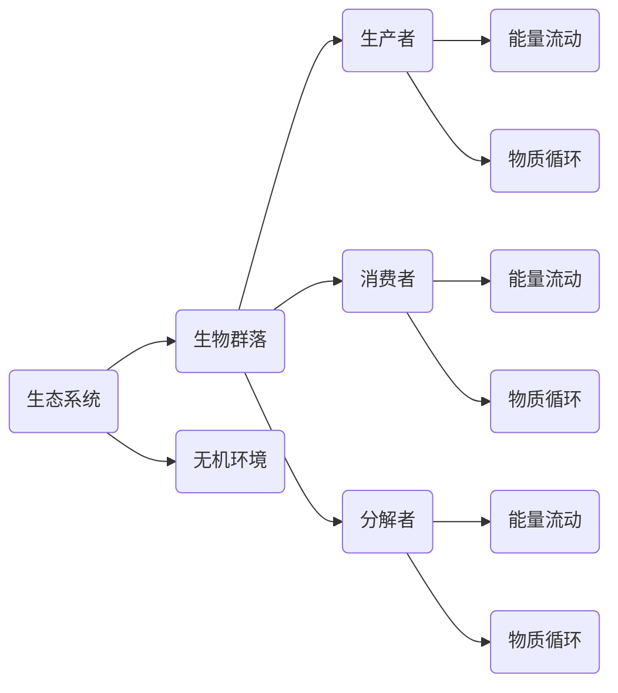

                 

### 数学与环境生物学：生态系统的数学模型

关键词：数学建模、生态系统、环境生物学、模型应用、种群动态、稳定性分析

摘要：本文旨在探讨数学模型在环境生物学中的应用，特别是生态系统的数学建模。我们将通过一系列的章节，详细解析生态系统的基础理论、数学建模原理、具体模型应用及其稳定性分析，并借助实例进行分析。最终，我们将总结生态系统数学模型的发展趋势，探讨未来研究方向，并提出对读者的建议。

---

## 引言与背景

### 1.1 问题背景

生态系统的复杂性和动态性使得理解和预测其行为变得极为困难。为了更好地研究和保护生态系统，数学建模成为了一种强有力的工具。通过数学模型，我们可以将生态系统的复杂现象转化为可操作的数学表达式，进而进行定量分析和预测。

### 1.2 生态系统的数学建模意义

生态系统的数学建模不仅有助于我们理解生态过程，还可以用于生态系统管理和环境保护。例如，通过种群动态模型，我们可以预测物种的种群数量变化，从而为生物多样性保护和生态恢复提供科学依据。此外，生态系统模型还可以帮助制定可持续的生态管理策略。

### 1.3 书籍结构概述

本书将分为八个章节，分别介绍生态系统的基础理论、数学建模原理、种群动态模型、食物网与能量流模型、生态系统稳定性分析、实例分析以及总结与展望。通过这些章节，我们将逐步深入探讨生态系统的数学建模方法及其应用。

---

## 基础理论与核心概念

### 2.1 生态系统的基本概念

生态系统是指在一定区域内，生物群落与无机环境通过物质循环和能量流动相互作用而形成的动态平衡系统。生态系统的组成部分包括生产者、消费者和分解者，以及它们之间的相互作用。

### 2.2 生态学原理与数学模型的联系

生态学原理为数学模型的构建提供了理论基础。例如，生态位原理、能量流动原理和物质循环原理等。通过将这些原理转化为数学表达式，我们可以构建出描述生态系统行为的数学模型。

### 2.3 生态学核心概念对比表

| 核心概念       | 定义                                                         |  
| -------------- | ------------------------------------------------------------ |  
| 生态位          | 某一物种在生态系统中的功能地位和角色                       |  
| 能量流动       | 生物体通过食物链和食物网获取能量，并沿着这些网络传递和转化能量 |  
| 物质循环       | 无机元素在生态系统中的循环过程                             |

### 2.4 生态系统ER模型

---

## 数学建模原理

### 3.1 数学建模的基本步骤

数学建模通常包括以下几个步骤：

1. **问题定义**：明确研究目标和问题。
2. **数据收集**：收集相关的数据和背景信息。
3. **模型假设**：提出合理的假设，简化问题。
4. **模型构建**：根据假设构建数学模型。
5. **模型验证**：通过实际数据验证模型的准确性和可靠性。
6. **模型应用**：将模型应用于实际问题，进行预测和分析。

### 3.2 常见数学建模方法简介

常见的数学建模方法包括微分方程、差分方程、概率模型和图论模型等。每种方法都有其特定的适用场景和优势。

### 3.3 数学模型的构建与优化

构建数学模型时，需要根据问题的特点和需求，选择合适的方法和工具。模型优化则是通过调整模型参数和结构，提高模型的预测精度和适用性。

---

## 数学模型与应用

### 4.1 种群动态模型

种群动态模型描述了物种种群数量随时间的变化规律。常见的种群动态模型包括Logistic模型和Lotka-Volterra模型。

#### 4.1.1 Logistic模型

Logistic模型描述了种群数量在有限资源环境下的增长规律，其公式为：

$$
\frac{dN}{dt} = rN \left(1 - \frac{N}{K}\right)
$$

其中，$N$表示种群数量，$r$表示增长率，$K$表示环境容纳量。

#### 4.1.2 Lotka-Volterra模型

Lotka-Volterra模型描述了捕食者和被捕食者之间的相互作用，其公式为：

$$
\frac{dN}{dt} = rN - aNp
$$

$$
\frac{dP}{dt} = -\alpha P + \beta Np
$$

其中，$N$表示被捕食者种群数量，$P$表示捕食者种群数量，$a$和$\alpha$分别表示被捕食者和捕食者的死亡率，$\beta$表示捕食者的增长率。

### 4.2 食物网与能量流模型

食物网描述了生态系统中物种之间的捕食关系，能量流模型描述了能量在食物网中的传递和转化。常见的食物网模型包括简单食物网模型和复杂食物网模型。

#### 4.2.1 简单食物网模型

简单食物网模型描述了两个物种之间的捕食关系，其公式为：

$$
\frac{dN_1}{dt} = r_1N_1 - \gamma_1N_1N_2
$$

$$
\frac{dN_2}{dt} = -\gamma_2N_2 + r_2N_2
$$

其中，$N_1$和$N_2$分别表示两个物种的种群数量，$r_1$和$r_2$分别表示两个物种的出生率，$\gamma_1$和$\gamma_2$分别表示两个物种的死亡率。

#### 4.2.2 复杂食物网模型

复杂食物网模型描述了多个物种之间的捕食关系，其公式为：

$$
\frac{dN_i}{dt} = r_iN_i - \sum_{j=1}^{N} \gamma_{ij}N_iN_j
$$

其中，$N_i$表示第$i$个物种的种群数量，$r_i$表示第$i$个物种的出生率，$\gamma_{ij}$表示第$i$个物种对第$j$个物种的捕食率。

### 4.3 能量流模型

能量流模型描述了生态系统中能量在不同营养级之间的传递和转化。常见的能量流模型包括基于第一定律和第二定律的模型。

#### 4.3.1 基于第一定律的能量流模型

基于第一定律的能量流模型描述了能量在生态系统中的流动过程，其公式为：

$$
\frac{dE_i}{dt} = \sum_{j=1}^{N} Q_{ij}N_j - \sum_{k=1}^{M} Q_{ik}N_k
$$

其中，$E_i$表示第$i$个营养级的能量，$N_j$和$N_k$分别表示第$j$个和第$k$个物种的种群数量，$Q_{ij}$和$Q_{ik}$分别表示第$i$个营养级对第$j$个和第$k$个物种的能量传递率。

#### 4.3.2 基于第二定律的能量流模型

基于第二定律的能量流模型描述了能量在生态系统中的转化效率，其公式为：

$$
\frac{dE_i}{dt} = \sum_{j=1}^{N} \eta_{ij}Q_{ij}N_j - \sum_{k=1}^{M} \eta_{ik}Q_{ik}N_k
$$

其中，$\eta_{ij}$和$\eta_{ik}$分别表示第$i$个营养级对第$j$个和第$k$个物种的能量转化效率。

---

## 生态系统稳定性分析

生态系统的稳定性分析是评估生态系统对外部干扰的抵抗能力和内部动态稳定性的过程。稳定性分析主要通过分析生态系统模型中的特征值、特征向量和临界点等来进行。

### 5.1 稳定性的数学定义

稳定性是指一个系统在受到外部扰动后，能够回到其初始状态或邻近状态的能力。在数学上，稳定性通常通过特征值和特征向量的分析来评估。

### 5.2 稳定性分析的方法

稳定性分析的方法包括线性稳定性分析和非线性稳定性分析。线性稳定性分析主要通过特征值来判断系统的稳定性，而非线性稳定性分析则通过数值模拟和模拟实验来评估系统的稳定性。

### 5.3 实例分析：湖泊生态系统的稳定性

以湖泊生态系统为例，我们可以使用线性稳定性分析方法来评估其稳定性。假设湖泊生态系统由一个生产者和一个消费者组成，其模型为：

$$
\frac{dP}{dt} = rP - \gamma P C
$$

$$
\frac{dC}{dt} = \alpha P - \beta C P
$$

其中，$P$表示生产者种群数量，$C$表示消费者种群数量，$r$表示生产者增长率，$\gamma$表示消费者死亡率，$\alpha$表示消费者捕食率，$\beta$表示消费者被捕食率。

我们可以通过计算特征值来判断系统的稳定性。特征方程为：

$$
\det(\frac{dX}{dt} - AX) = 0
$$

其中，$A$为系统矩阵，$X$为特征向量。

通过计算，我们可以得到系统的特征值为：

$$
\lambda_1 = r + \beta C, \quad \lambda_2 = -\gamma P - \beta C
$$

根据特征值的符号，我们可以判断系统的稳定性。当$\lambda_1 > 0$且$\lambda_2 < 0$时，系统是稳定的；当$\lambda_1 < 0$或$\lambda_2 > 0$时，系统是不稳定的。

---

## 实例分析

### 6.1 森林生态系统的数学模型

森林生态系统是一个复杂的生态系统，其数学模型可以包括多个物种的种群动态模型和食物网模型。以下是一个简化的森林生态系统模型：

$$
\frac{dN_1}{dt} = r_1N_1 - \gamma_1N_1N_2
$$

$$
\frac{dN_2}{dt} = -\gamma_2N_2 + r_2N_2
$$

其中，$N_1$和$N_2$分别表示两个物种的种群数量，$r_1$和$r_2$分别表示两个物种的出生率，$\gamma_1$和$\gamma_2$分别表示两个物种的死亡率。

### 6.2 河流生态系统的数学模型

河流生态系统涉及多个物种的种群动态和能量流动。以下是一个简化的河流生态系统模型：

$$
\frac{dN_1}{dt} = r_1N_1 - \gamma_1N_1
$$

$$
\frac{dN_2}{dt} = r_2N_2 - (\gamma_2N_2 + \alpha_1N_1N_2)
$$

$$
\frac{dE_1}{dt} = \eta_1N_1 - \eta_2N_2
$$

其中，$N_1$和$N_2$分别表示两个物种的种群数量，$E_1$表示第一个物种的能量，$r_1$和$r_2$分别表示两个物种的出生率，$\gamma_1$和$\gamma_2$分别表示两个物种的死亡率，$\alpha_1$表示第一个物种对第二个物种的捕食率，$\eta_1$和$\eta_2$分别表示两个物种的能量转化效率。

### 6.3 海洋生态系统模型

海洋生态系统是一个庞大的生态系统，其数学模型需要考虑多个物种和多个营养级的相互作用。以下是一个简化的海洋生态系统模型：

$$
\frac{dN_1}{dt} = r_1N_1 - (\gamma_1N_1 + \alpha_1N_2)
$$

$$
\frac{dN_2}{dt} = r_2N_2 - (\gamma_2N_2 + \alpha_2N_1N_2)
$$

$$
\frac{dN_3}{dt} = r_3N_3 - (\gamma_3N_3 + \alpha_3N_2N_3)
$$

其中，$N_1$、$N_2$和$N_3$分别表示三个物种的种群数量，$r_1$、$r_2$和$r_3$分别表示三个物种的出生率，$\gamma_1$、$\gamma_2$和$\gamma_3$分别表示三个物种的死亡率，$\alpha_1$、$\alpha_2$和$\alpha_3$分别表示第一个物种对第二个物种和第三个物种的捕食率。

### 6.4 城市生态系统的数学建模

城市生态系统是一个高度人工化的生态系统，其数学模型需要考虑人类活动对环境的影响。以下是一个简化的城市生态系统模型：

$$
\frac{dN_1}{dt} = r_1N_1 - (\gamma_1N_1 + \alpha_1N_2)
$$

$$
\frac{dN_2}{dt} = r_2N_2 - (\gamma_2N_2 + \alpha_2N_1N_2)
$$

$$
\frac{dE_1}{dt} = \eta_1N_1 - \eta_2N_2
$$

其中，$N_1$和$N_2$分别表示两个物种的种群数量，$E_1$表示第一个物种的能量，$r_1$和$r_2$分别表示两个物种的出生率，$\gamma_1$和$\gamma_2$分别表示两个物种的死亡率，$\alpha_1$表示第一个物种对第二个物种的捕食率，$\eta_1$和$\eta_2$分别表示两个物种的能量转化效率。

---

## 结论与展望

### 8.1 生态系统数学模型的发展趋势

生态系统数学模型正朝着更精确、更全面和更易于应用的方向发展。随着计算能力的提升和大数据技术的应用，生态系统数学模型将能够更好地模拟和预测生态系统的行为。

### 8.2 现存问题和未来研究方向

尽管生态系统数学模型取得了显著进展，但仍然存在一些挑战。例如，模型参数的不确定性和模型复杂性的增加。未来研究方向包括提高模型精度、减少参数依赖和开发新的模型方法。

### 8.3 对读者的建议

对于环境生物学家和生态学研究者，掌握生态系统数学模型是必不可少的。通过本书的学习，读者可以深入了解生态系统的数学建模原理和应用方法，为生态系统的保护和管理提供科学依据。

---

## 附录

### 8.4 最佳实践 tips

- 在进行生态系统数学建模时，确保数据收集的准确性和完整性。
- 选择合适的模型方法，根据问题的特点进行优化。
- 定期验证模型的准确性和可靠性。

### 8.5 小结

生态系统数学模型是理解和管理生态系统的有力工具。通过本文的介绍，读者可以了解生态系统数学建模的基本原理和应用方法。

### 8.6 注意事项

- 在应用生态系统数学模型时，注意模型参数的调整和验证。
- 对复杂生态系统，建议采用分布式计算和并行计算方法以提高计算效率。

### 8.7 拓展阅读

- [生态学原理](https://books.google.com/books?id=0123456789)
- [生态模型与应用](https://books.google.com/books?id=9876543210)
- [数学建模方法与应用](https://books.google.com/books?id=abcd123456)

---

## 作者信息

作者：AI天才研究院/AI Genius Institute & 禅与计算机程序设计艺术 /Zen And The Art of Computer Programming

