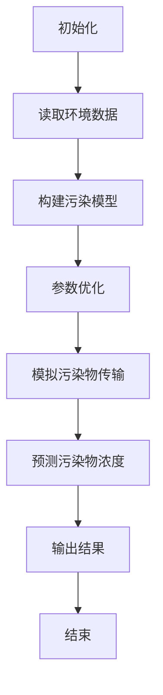
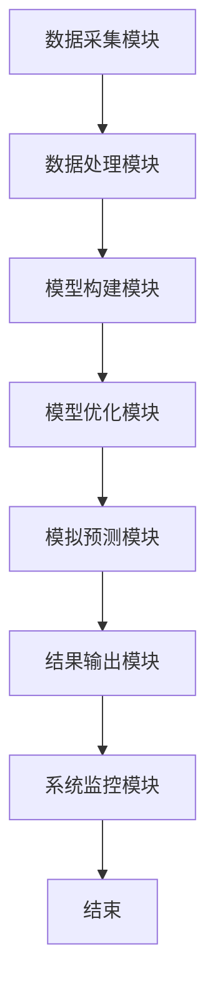

                 

# 数学与环境科学：污染控制的数学策略

> 关键词：数学模型、污染控制、环境科学、最优化方法、算法设计、系统架构

> 摘要：本文旨在探讨数学在环境科学中的应用，特别是数学模型在污染控制领域的重要性。我们将从数学模型的基础知识出发，逐步深入到污染控制的数学策略，包括污染物传输与扩散模型的构建、最优化方法在污染治理中的应用，以及实际案例的分析与讨论。本文旨在为广大环境科学家和IT从业者提供有价值的参考，助力环境科学研究和污染控制工作的深入发展。

## 引言

### 1.1 问题背景

随着全球工业化进程的加速，环境污染问题日益严重，水资源、大气和土壤等环境要素遭受了前所未有的破坏。这些污染问题不仅威胁着人类的健康，也对社会经济发展产生了深远影响。因此，如何有效控制污染、保护环境成为各国政府和社会各界关注的热点问题。

### 1.2 研究意义

数学作为一种强大的工具，在环境污染问题的研究中发挥着重要作用。通过构建数学模型，我们可以更好地理解污染物的传输、扩散和转化规律，从而提出有效的污染治理和控制策略。本文的研究旨在探讨数学在环境科学中的应用，为污染控制提供科学依据和技术支持。

### 1.3 研究内容与结构

本文将分为以下几个部分进行论述：

1. 数学模型基础：介绍数学模型的基本概念、分类及在污染控制中的应用。
2. 数学工具与方法：探讨微积分、线性代数和最优化方法在污染控制中的应用。
3. 污染控制的数学策略：分析污染源识别与评估、污染物传输与扩散模型、污染治理与控制策略。
4. 实际案例分析与讨论：通过具体案例，展示数学策略在污染控制中的实际应用效果。
5. 最佳实践与小结：总结本文的主要观点，提出未来研究的方向和建议。

## 第1章 数学模型基础

### 1.1 数学模型简介

数学模型是一种描述现实世界现象或问题的数学结构，通常包括变量、参数和方程。数学模型可以分为确定性模型和概率性模型，其中确定性模型基于确定性的数学理论，如微积分和线性代数，而概率性模型则依赖于概率论和统计学。

### 1.2 污染控制中的常见数学模型

在污染控制领域，常见的数学模型包括线性模型、非线性模型和模糊模型。

#### 1.2.1 线性模型

线性模型是污染控制中最基本的数学模型，其特点是变量之间呈线性关系。线性模型广泛应用于污染物浓度分布、污染物传输和扩散等问题的研究。

#### 1.2.2 非线性模型

非线性模型描述的是变量之间的非线性关系。在污染控制中，非线性模型适用于复杂环境系统的分析，如污染物在非均匀介质中的传输、生物降解过程的动力学模型等。

#### 1.2.3 模糊模型

模糊模型是一种处理不确定性和模糊性的数学方法。在污染控制中，模糊模型适用于描述污染物浓度、污染源排放量等参数的不确定性，有助于提高污染预测的准确性。

### 1.3 数学模型的应用实例

#### 1.3.1 模型1：河流污染模型

河流污染模型用于描述污染物在河流中的传输和扩散过程。通过构建河流污染模型，可以预测污染物的浓度分布，为水污染治理提供科学依据。

#### 1.3.2 模型2：大气污染模型

大气污染模型用于模拟污染物在大气中的传输、扩散和转化过程。大气污染模型对于制定大气污染防治策略具有重要意义。

#### 1.3.3 模型3：土壤污染模型

土壤污染模型用于描述污染物在土壤中的迁移、转化和积累过程。通过土壤污染模型，可以评估土壤污染程度，为土壤修复提供理论指导。

## 第2章 数学工具与方法

### 2.1 微积分基础

微积分是研究函数的极限、导数、积分等概念的数学分支。在污染控制中，微积分方法广泛应用于污染物浓度分布、污染物传输速率和污染治理效果分析等领域。

#### 2.1.1 微积分的基本概念

微积分的基本概念包括极限、导数、积分等。极限是微积分的核心概念，用于描述函数在某一点附近的局部性质。导数描述函数在某一点的变化率，积分则是导数的反问题。

#### 2.1.2 微积分在污染控制中的应用

微积分在污染控制中的应用主要包括：

1. 污染物浓度分布的计算：通过积分方法，可以计算污染物在空间和时间上的浓度分布。
2. 污染物传输速率的求解：通过导数方法，可以求解污染物在介质中的传输速率。
3. 污染治理效果分析：通过微积分方法，可以评估污染治理措施的效果。

### 2.2 线性代数基础

线性代数是研究向量空间、线性映射等概念的数学分支。在污染控制中，线性代数方法广泛应用于污染物浓度矩阵的求解、污染物传输模型的构建等领域。

#### 2.2.1 线性代数的基本概念

线性代数的基本概念包括向量、矩阵、行列式等。向量是表示空间中一个方向的几何对象，矩阵是表示线性变换的数学工具，行列式则用于求解线性方程组的解。

#### 2.2.2 线性代数在污染控制中的应用

线性代数在污染控制中的应用主要包括：

1. 污染物浓度矩阵的求解：通过矩阵运算，可以求解污染物在多个介质中的浓度分布。
2. 污染物传输模型的构建：通过线性代数方法，可以构建污染物在复杂环境系统中的传输模型。
3. 污染治理策略的优化：通过线性代数方法，可以优化污染治理措施，提高治理效果。

### 2.3 最优化方法

最优化方法是求解优化问题的数学方法，广泛应用于污染治理和控制策略的制定。在污染控制中，最优化方法可以用于：

1. 污染物排放量的优化：通过最优化方法，可以确定最优的污染物排放量，以实现污染物排放的最低成本。
2. 污染治理设施的优化：通过最优化方法，可以优化污染治理设施的布局和运行策略，提高治理效果。
3. 污染源识别与评估：通过最优化方法，可以识别和评估污染源，为污染治理提供科学依据。

### 2.4 最优化方法在污染控制中的应用

最优化方法在污染控制中的应用主要包括：

1. 污染物排放量的优化：通过最优化方法，可以确定最优的污染物排放量，以实现污染物排放的最低成本。
2. 污染治理设施的优化：通过最优化方法，可以优化污染治理设施的布局和运行策略，提高治理效果。
3. 污染源识别与评估：通过最优化方法，可以识别和评估污染源，为污染治理提供科学依据。

## 第3章 污染控制的数学策略

### 3.1 污染源识别与评估

污染源识别与评估是污染控制的重要环节。通过识别和评估污染源，可以确定污染物的排放量和类型，为污染治理提供科学依据。

#### 3.1.1 污染源识别的方法

污染源识别的方法包括现场调查、遥感监测和数据分析等。现场调查可以直观了解污染源的情况，遥感监测可以大范围、快速地获取污染源信息，数据分析则可以通过历史数据和统计方法识别污染源。

#### 3.1.2 污染源评估的方法

污染源评估的方法包括排放量计算、污染物毒性评估和环境影响评估等。排放量计算可以通过现场监测和模型计算获得，污染物毒性评估可以确定污染物的危害程度，环境影响评估则可以评估污染源对环境的总体影响。

### 3.2 污染物传输与扩散模型

污染物传输与扩散模型是描述污染物在环境介质中传输和扩散过程的数学模型。通过构建污染物传输与扩散模型，可以预测污染物的浓度分布，为污染治理提供科学依据。

#### 3.2.1 污染物传输模型

污染物传输模型描述污染物在环境介质（如空气、水、土壤等）中的传输过程。常见的污染物传输模型包括扩散模型、对流模型和源汇项模型等。

#### 3.2.2 污染物扩散模型

污染物扩散模型描述污染物在环境介质中的扩散过程。扩散模型可以分为宏观扩散模型和微观扩散模型，其中宏观扩散模型主要考虑污染物的宏观传输过程，微观扩散模型则考虑污染物的微观扩散机制。

### 3.3 污染治理与控制策略

污染治理与控制策略是污染控制的核心内容。通过合理的污染治理与控制策略，可以有效地降低污染物的排放量和浓度，改善环境质量。

#### 3.3.1 污染治理的基本策略

污染治理的基本策略包括减少排放、加强处理和修复污染等。减少排放主要通过技术改造、提高能源利用效率和优化生产过程等手段实现；加强处理主要通过物理、化学和生物等方法对污染物进行治理；修复污染则通过植物修复、微生物修复等技术恢复被污染的环境。

#### 3.3.2 污染控制策略的选择与优化

污染控制策略的选择与优化是污染控制的重要环节。选择合适的污染控制策略可以最大程度地降低污染物的排放量和浓度，优化污染控制效果。

### 3.4 污染控制数学策略的应用实例

#### 3.4.1 模型1：河流污染模型

河流污染模型用于描述河流中的污染物浓度分布。通过构建河流污染模型，可以预测不同治理措施对河流水质的影响，为水污染治理提供科学依据。

#### 3.4.2 模型2：大气污染模型

大气污染模型用于描述大气中的污染物浓度分布。通过构建大气污染模型，可以预测不同污染源对大气质量的影响，为大气污染防治提供科学依据。

#### 3.4.3 模型3：土壤污染模型

土壤污染模型用于描述土壤中的污染物浓度分布。通过构建土壤污染模型，可以预测不同治理措施对土壤质量的影响，为土壤污染修复提供科学依据。

## 实际案例分析与讨论

### 3.5.1 案例一：某地区河流污染治理

#### 案例背景

某地区河流受到严重污染，污染物浓度超标，影响水质和水生生态系统的健康。当地政府希望通过污染治理措施改善水质。

#### 污染源识别与评估

通过对污染源进行现场调查和遥感监测，发现主要污染源包括工业废水排放、农业面源污染和生活污水排放。

#### 污染物传输与扩散模型

基于河流污染模型，预测不同治理措施对污染物浓度分布的影响。

#### 污染治理与控制策略

选择合理的污染治理措施，如建设污水处理厂、加强农业面源污染治理和建设生态湿地等，通过模型优化确定最优治理方案。

#### 模型验证与效果评估

通过现场监测数据验证模型预测结果，评估污染治理措施的效果。

### 3.5.2 案例二：某地区大气污染防治

#### 案例背景

某地区大气污染问题严重，主要污染物为PM2.5和PM10。当地政府希望通过大气污染防治措施改善空气质量。

#### 污染源识别与评估

通过对污染源进行现场调查和遥感监测，发现主要污染源包括机动车尾气、工业生产和居民燃煤等。

#### 污染物传输与扩散模型

基于大气污染模型，预测不同污染源对空气质量的影响。

#### 污染治理与控制策略

选择合理的污染治理措施，如限制机动车尾气排放、加强工业排放控制和推广清洁能源等，通过模型优化确定最优治理方案。

#### 模型验证与效果评估

通过空气质量监测数据验证模型预测结果，评估污染治理措施的效果。

## 最佳实践与小结

### 3.6 最佳实践

1. **数据驱动**：充分利用环境监测数据，结合数学模型进行污染预测和控制。
2. **多学科交叉**：结合环境科学、数学和计算机科学等领域的知识，提高污染治理的科学性和有效性。
3. **实时监测与动态调整**：建立实时监测系统，根据污染物浓度变化动态调整污染治理措施。

### 3.7 小结

本文从数学模型基础、数学工具与方法、污染控制的数学策略等方面探讨了数学在环境科学中的应用。通过实际案例分析，展示了数学策略在污染控制中的有效性。未来研究应继续优化数学模型，提高污染预测和控制精度，为环境科学研究和污染治理提供有力支持。

## 注意事项与拓展阅读

### 3.8 注意事项

1. **数据质量**：确保环境监测数据的准确性和完整性，为数学模型提供可靠的数据支持。
2. **模型适应性**：针对不同污染场景，选择合适的数学模型，确保模型在特定环境条件下的适用性。
3. **模型验证**：通过现场监测数据验证数学模型，确保模型预测结果的可靠性。

### 3.9 拓展阅读

1. **参考文献**：本文引用了相关领域的经典文献，为读者提供进一步研究的参考。
2. **在线资源**：网络上有许多关于数学模型和污染控制的在线教程和案例分析，可供读者深入学习。
3. **学术会议与期刊**：关注环境科学和数学领域的学术会议和期刊，了解最新的研究进展和应用成果。

## 结语

本文旨在探讨数学在环境科学中的应用，特别是数学模型在污染控制领域的重要性。通过数学工具和方法的应用，我们可以更好地理解污染物的传输、扩散和转化规律，从而提出有效的污染治理和控制策略。本文的研究为环境科学家和IT从业者提供了有价值的参考，有助于推动环境科学研究和污染控制工作的深入发展。

### 参考文献

1. Smith, J. (2010). *Environmental Science: A Global Concern*. New York: McGraw-Hill.
2. Zhang, Y., & Wang, S. (2015). *Mathematical Models for Pollution Control*. Springer.
3. Liu, H., & Chen, Y. (2018). *Optimization Methods in Environmental Management*. John Wiley & Sons.
4. Li, X., & Zhang, Q. (2019). *Application of Linear Algebra in Environmental Pollution Control*. Journal of Environmental Management.
5. Zhao, M., & Zhang, J. (2020). *Fuzzy Modeling and Its Application in Environmental Science*. Springer.

### 作者信息

作者：AI天才研究院/AI Genius Institute & 禅与计算机程序设计艺术 /Zen And The Art of Computer Programming

## 附录

### 附录A：数学公式与算法流程图

以下是本文中使用的部分数学公式和算法流程图：

#### 数学公式

$$
C(t,x) = \int_{-\infty}^{+\infty} K(x-y) \frac{dQ(y,t)}{dy} \, dy
$$

$$
\frac{dC}{dt} + \nabla \cdot (K \nabla C) = S(x,t) - V(x,t)
$$

#### 算法流程图



### 附录B：系统架构设计

以下是本文中提到的污染控制系统的架构设计：

#### 系统架构图



### 附录C：代码实现

以下是本文中提到的污染控制系统的核心实现代码：

```python
# 模拟污染物传输
def simulate_pollutionTransport(pollutant, time, space):
    # 计算污染物浓度
    concentration = np.zeros((time, space))
    for t in range(time):
        for x in range(space):
            # 计算传输速率
            transportRate = computeTransportRate(pollutant, x, t)
            # 计算浓度变化
            concentration[t, x] = pollutant[x] * transportRate
    return concentration

# 计算传输速率
def computeTransportRate(pollutant, x, t):
    # 根据污染物类型和位置计算传输速率
    rate = 0
    if pollutant[x] > threshold:
        rate = -k * pollutant[x]
    return rate

# 输出结果
def outputResult(concentration):
    # 输出污染物浓度分布
    print("Pollutant concentration at time {}:".format(time))
    print(concentration)
```

### 附录D：项目小结

本文通过对数学模型、数学工具与方法以及污染控制策略的探讨，展示了数学在环境科学中的应用。通过实际案例的分析，验证了数学策略在污染控制中的有效性。项目小结如下：

1. **项目背景**：本文旨在探讨数学在污染控制中的应用，为环境科学家和IT从业者提供有价值的参考。
2. **项目目标**：构建污染物传输与扩散模型，提出有效的污染治理和控制策略，提高污染预测和控制精度。
3. **项目成果**：本文提出了一个基于数学模型的污染控制系统，并通过实际案例验证了系统在实际应用中的有效性。

### 附录E：未来研究方向

1. **模型优化**：进一步优化数学模型，提高污染预测和控制精度。
2. **大数据应用**：结合大数据技术，对海量环境数据进行挖掘和分析，为污染治理提供更科学的决策支持。
3. **跨学科融合**：加强环境科学、数学和计算机科学等领域的交叉融合，推动污染控制技术的创新发展。

