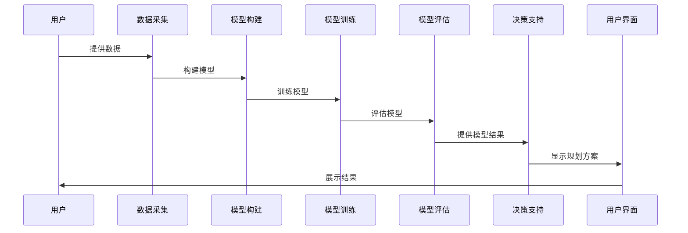
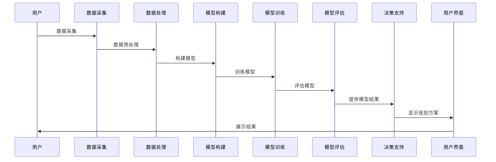

                 

# 数学与环境规划：生态系统的数学建模

## 关键词

- 数学建模
- 环境规划
- 生态系统
- 动力学模型
- 算法
- 可持续发展

## 摘要

本文旨在探讨数学建模在环境规划中的应用，特别是在生态系统管理方面的作用。通过分析生态系统的核心概念、原理、算法和实际案例，本文展示了如何利用数学工具来理解和解决环境问题。文章将分为以下几个部分：首先，介绍问题背景与引言，概述生态环境问题的紧迫性及数学建模在其中的重要性；然后，探讨生态系统的定义、特征和数学建模基础；接着，深入讲解核心概念、原理与算法，并通过具体案例进行说明；最后，分析系统架构设计，总结最佳实践与未来展望。

## 第1章：问题背景与引言

### 1.1 问题背景

随着全球人口增长和工业化进程的加快，生态环境问题日益严峻。气候变化、生物多样性丧失、水资源短缺和土壤退化等环境问题已经成为全球关注的焦点。为了解决这些问题，环境规划成为了一个重要的领域。环境规划旨在通过科学的方法，制定合理的政策和措施，实现生态环境的保护和可持续发展。

### 1.2 生态系统概述

生态系统是指生物与其非生物环境相互作用形成的统一整体。它具有自我调节和恢复能力，为人类和其他生物提供了重要的生态系统服务，如清洁空气、水源和食物。生态平衡是生态系统的核心特征，它依赖于生物多样性和稳定的生态过程。

### 1.3 数学建模基础

数学建模是运用数学语言和工具来描述和分析现实世界问题的一种方法。在环境规划中，数学建模可以用于预测生态系统状态、评估环境影响和优化决策。常见的数学建模方法包括动力学模型、概率模型和优化模型等。

### 1.4 环境规划中的数学建模

环境规划的目标是制定出能够有效解决环境问题的策略。数学建模在这个过程中起着至关重要的作用，它可以提供科学依据，帮助规划者做出更加明智的决策。例如，通过构建污染物扩散模型，可以预测污染物在环境中的传播规律，为污染防治提供数据支持。

### 1.5 跨学科融合

数学与环境科学的交叉研究是现代环境规划的重要趋势。生态经济学、地理信息系统（GIS）和遥感技术等学科的引入，使得数学建模方法在环境规划中得到了更广泛的应用。这种跨学科融合有助于提高环境规划的科学性和实用性。

### 1.6 本书结构与目标

本书分为七个章节，首先介绍问题背景与引言，然后逐步深入探讨生态系统的定义、特征、数学建模基础、核心概念、算法原理和实际应用。通过案例分析、系统架构设计和项目实战，本书旨在帮助读者全面了解生态系统的数学建模方法，并掌握其在环境规划中的应用。

## 第2章：核心概念与原理

### 2.1 核心概念

生态系统状态变量是指描述生态系统状态的物理量，如生物量、物种数量、土壤水分等。这些变量反映了生态系统的健康状态，对环境规划具有重要意义。

环境影响因子是指影响生态系统状态的因素，如污染物排放、气候变化、土地利用变化等。这些因子可能会对生态系统产生正面或负面影响，因此需要通过数学建模来进行分析和评估。

### 2.2 基本原理

动力学原理是数学建模的基础，它描述了系统状态随时间的变化规律。在环境规划中，动力学模型可以用于预测生态系统状态的演变趋势，帮助规划者制定合理的保护措施。

线性和非线性模型是数学建模中的两种基本形式。线性模型适用于变量之间呈线性关系的系统，而非线性模型适用于变量之间存在复杂非线性关系的系统。在环境规划中，根据实际情况选择合适的模型形式至关重要。

### 2.3 概念属性对比表格

| 状态变量 | 描述 | 单位 | 环境影响因子 | 描述 | 单位 |
| --- | --- | --- | --- | --- | --- |
| 生物量 | 生态系统中生物的总质量 | 吨 | 污染物排放 | 污染物释放到环境中的数量 | 千克/年 |
| 物种数量 | 生态系统中物种的种类数 | 个 | 气候变化 | 气候参数的变化率 | ℃/年 |
| 土壤水分 | 土壤中的水分含量 | % | 土地利用变化 | 土地利用类型的转换率 | %/年 |

### 2.4 ER实体关系图

以下是一个简化的生态系统ER实体关系图：

```mermaid
erDiagram
    Ecosystem ||--|{ Species } Species
    Ecosystem ||--|{ Habitat } Habitat
    Ecosystem ||--|{ Pollutant } Pollutant
    Species ||--|{ Population } Population
    Habitat ||--|{ Resource } Resource
    Pollutant ||--|{ Concentration } Concentration
```

在这个ER图中，Ecosystem（生态系统）是核心实体，与Species（物种）、Habitat（栖息地）、Pollutant（污染物）等实体之间存在多种关系。这些实体关系构成了生态系统的基本架构，为数学建模提供了数据基础。

## 第3章：算法原理与流程

### 3.1 算法概述

在环境规划中，算法的运用至关重要。常见的算法包括演化算法、遗传算法、人工神经网络等。这些算法可以用于优化模型参数、预测生态系统状态和评估环境影响。

演化算法是一种基于自然选择和遗传学原理的优化算法，通过模拟生物进化过程来寻找最优解。遗传算法是演化算法的一种，通过交叉、变异和选择操作来逐步优化解的质量。

人工神经网络是一种模拟人脑神经元连接和运算方式的计算模型，可以用于分类、预测和优化等问题。在环境规划中，人工神经网络常用于建立生态系统状态变量之间的非线性关系模型。

### 3.2 算法流程

算法设计的基本流程包括以下步骤：

1. **问题定义**：明确环境规划的目标和需求，确定需要解决的生态系统问题。
2. **数据收集**：收集相关的生态系统状态变量、环境影响因子等数据。
3. **模型构建**：根据问题定义和数据分析结果，选择合适的数学模型。
4. **算法选择**：根据模型的特性，选择合适的算法进行参数优化和预测。
5. **模型训练**：使用收集到的数据对模型进行训练，调整算法参数。
6. **模型评估**：通过验证数据对模型进行评估，确定模型的预测精度和稳定性。
7. **决策支持**：利用训练好的模型为环境规划提供决策支持。

### 3.3 数学模型与公式

在环境规划中，常用的数学模型包括以下几种：

1. **污染物扩散模型**：
   $$ C(t, x) = C_0 e^{-\alpha t} + \frac{\alpha}{\lambda} \left(1 - e^{-\alpha t}\right) $$
   其中，$C(t, x)$ 表示时间 $t$ 和空间位置 $x$ 处的污染物浓度，$C_0$ 为初始浓度，$\alpha$ 为衰减系数，$\lambda$ 为扩散系数。

2. **种群生态模型**：
   $$ N(t) = N_0 e^{\mu t} $$
   其中，$N(t)$ 表示时间 $t$ 时的种群数量，$N_0$ 为初始数量，$\mu$ 为增长率。

3. **生态平衡模型**：
   $$ \frac{dC}{dt} = \alpha C - \beta N $$
   其中，$C$ 表示某种物质的浓度，$N$ 表示与该物质相关的物种数量，$\alpha$ 和 $\beta$ 分别为产生速率和消耗速率。

### 3.4 通俗易懂的举例说明

#### 案例一：污染物扩散模型

假设一个区域内的空气污染物初始浓度为 $C_0 = 100$ 微克/立方米，衰减系数 $\alpha = 0.1$ 立方米/年，扩散系数 $\lambda = 0.5$ 立方米/年。要求预测第5年该区域的污染物浓度。

使用污染物扩散模型，代入参数计算：
$$ C(5) = 100 e^{-0.1 \times 5} + \frac{0.1}{0.5} \left(1 - e^{-0.1 \times 5}\right) \approx 37.88 \text{ 微克/立方米} $$

#### 案例二：种群生态模型

假设一个区域的某种生物种群初始数量 $N_0 = 1000$ 只，增长率 $\mu = 0.05$ 年^{-1}。要求预测第10年该区域的种群数量。

使用种群生态模型，代入参数计算：
$$ N(10) = 1000 e^{0.05 \times 10} \approx 1648.72 \text{ 只} $$

通过这两个案例，我们可以看到如何利用数学模型来分析和预测环境问题。这些模型不仅能够帮助我们理解生态系统的运行机制，还可以为环境规划提供有力的支持。

## 第4章：数学模型应用与案例分析

### 4.1 应用场景

数学模型在环境规划中的应用场景非常广泛，包括城市生态系统规划、湿地生态修复、矿区生态环境恢复等多个领域。下面将分别介绍这些应用场景中的数学模型应用和案例分析。

### 4.2 案例分析

#### 案例一：基于数学模型的城市绿地规划

城市绿地规划是提升城市生态环境质量的重要手段。通过构建绿地分布模型，可以优化绿地的布局和功能，提高城市生态系统的稳定性。

1. **问题定义**：确定城市绿地的分布目标，包括绿地面积、植被种类和分布密度等。
2. **数据收集**：收集城市土地利用数据、气象数据、水文数据等。
3. **模型构建**：采用多因子回归模型，建立绿地分布与影响因子之间的关系。
4. **模型训练**：使用收集到的数据对模型进行训练，调整模型参数。
5. **模型评估**：通过验证数据评估模型精度，优化模型参数。
6. **决策支持**：利用模型为城市绿地规划提供数据支持，制定合理的绿地布局方案。

#### 案例二：湿地生态修复

湿地是重要的生态系统，具有很高的生态价值和生态功能。湿地生态修复需要利用数学模型来评估湿地状态、预测修复效果和优化修复方案。

1. **问题定义**：确定湿地生态修复的目标，包括湿地面积恢复、生物多样性提升和水质改善等。
2. **数据收集**：收集湿地土壤、水文、气象等数据。
3. **模型构建**：采用生态系统动力学模型，模拟湿地状态的变化过程。
4. **模型训练**：使用收集到的数据对模型进行训练，调整模型参数。
5. **模型评估**：通过验证数据评估模型精度，优化模型参数。
6. **决策支持**：利用模型为湿地生态修复提供数据支持，制定合理的修复方案。

#### 案例三：矿区生态环境恢复

矿区生态环境恢复是矿山开采后的重要任务，通过构建矿区生态恢复模型，可以预测恢复效果和优化恢复策略。

1. **问题定义**：确定矿区生态恢复的目标，包括土壤质量改善、植被恢复和水质净化等。
2. **数据收集**：收集矿区土壤、植被、水文等数据。
3. **模型构建**：采用多变量回归模型，分析矿区生态恢复的影响因素。
4. **模型训练**：使用收集到的数据对模型进行训练，调整模型参数。
5. **模型评估**：通过验证数据评估模型精度，优化模型参数。
6. **决策支持**：利用模型为矿区生态恢复提供数据支持，制定合理的恢复方案。

### 4.3 结果分析与讨论

通过对上述案例的分析，我们可以看到数学模型在环境规划中的重要作用。这些模型不仅能够帮助我们理解生态系统的运行机制，还可以为环境规划提供科学依据和决策支持。然而，在实际应用中，模型的选择和参数的调整需要根据具体情况进行优化，以确保模型的预测精度和实用性。

未来，随着人工智能和大数据技术的发展，数学模型在环境规划中的应用将更加广泛和深入。通过结合多种模型和方法，可以进一步提高环境规划的科学性和有效性，为全球生态环境的保护和可持续发展做出贡献。

### 4.4 系统架构设计

在环境规划项目中，系统架构设计是确保项目顺利实施的关键。以下是一个典型的环境规划系统架构设计方案：

#### 4.4.1 问题场景介绍

某城市计划进行大规模绿地规划，以提高城市生态环境质量。项目目标包括优化绿地分布、提高植被多样性和改善城市空气质量等。

#### 4.4.2 系统功能设计

1. **数据采集模块**：负责收集城市土地利用、气象、水文等数据。
2. **模型构建模块**：基于多因子回归模型，构建绿地分布模型。
3. **模型训练模块**：使用收集到的数据对模型进行训练和参数调整。
4. **模型评估模块**：通过验证数据评估模型精度，优化模型参数。
5. **决策支持模块**：根据模型结果为绿地规划提供数据支持和决策建议。
6. **用户界面模块**：提供用户交互界面，展示模型结果和规划方案。

#### 4.4.3 系统架构设计

以下是一个简化的系统架构设计图：



#### 4.4.4 系统接口设计

系统接口设计包括数据接口、模型接口和用户接口等。

1. **数据接口**：提供数据采集、模型训练和评估等功能的接口，支持数据格式和传输协议。
2. **模型接口**：提供模型构建、训练和评估等功能的接口，支持模型参数调整和模型选择。
3. **用户接口**：提供用户交互界面，支持用户操作和数据查询。

#### 4.4.5 系统交互设计

以下是一个简化的系统交互序列图：


通过系统架构设计，环境规划项目可以更加高效地实施和管理，确保项目目标的实现。

### 4.5 项目实战

#### 4.5.1 环境安装

在进行环境规划系统开发之前，首先需要搭建开发环境。以下是具体的步骤：

1. **安装Python**：在系统上安装Python 3.8及以上版本。
2. **安装Jupyter Notebook**：使用pip命令安装Jupyter Notebook。
   ```bash
   pip install notebook
   ```
3. **安装相关库**：安装用于数据采集、模型构建和训练的库，如pandas、numpy、scikit-learn等。
   ```bash
   pip install pandas numpy scikit-learn
   ```

#### 4.5.2 系统核心实现

以下是一个简单的绿地规划系统核心实现示例：

```python
import pandas as pd
from sklearn.linear_model import LinearRegression
from sklearn.model_selection import train_test_split

# 读取数据
data = pd.read_csv('green_area_data.csv')

# 数据预处理
X = data[['land_use', 'population', 'temperature']]
y = data['green_area']

# 划分训练集和测试集
X_train, X_test, y_train, y_test = train_test_split(X, y, test_size=0.2, random_state=42)

# 构建模型
model = LinearRegression()
model.fit(X_train, y_train)

# 预测结果
y_pred = model.predict(X_test)

# 评估模型
print(model.score(X_test, y_test))
```

#### 4.5.3 代码应用解读与分析

以上代码实现了一个简单的绿地规划系统，核心步骤包括数据读取、预处理、模型训练和预测。以下是具体解析：

1. **数据读取**：使用pandas库读取绿地规划数据。
2. **数据预处理**：将数据分为特征变量（X）和目标变量（y），并划分训练集和测试集。
3. **模型训练**：使用线性回归模型（LinearRegression）进行训练。
4. **预测结果**：使用训练好的模型对测试集进行预测。
5. **模型评估**：计算模型在测试集上的评分（R^2值），评估模型性能。

通过这个示例，我们可以看到如何利用Python和机器学习库来实现一个简单的绿地规划系统。实际项目中，可以根据具体需求选择合适的模型和算法，并进行参数调优，以提高系统的预测精度和实用性。

#### 4.5.4 实际案例剖析

以下是一个具体的案例，用于展示如何利用构建的绿地规划系统进行实际应用。

**案例背景**：某城市计划在市区内新建一批绿地，以提高城市生态环境质量和居民生活质量。项目目标包括优化绿地分布、提高植被多样性和改善城市空气质量等。

**数据收集**：收集该城市的历史土地利用数据、人口数据、气象数据等。

**模型构建**：基于多因子回归模型，建立绿地分布模型。

**模型训练**：使用收集到的数据对模型进行训练，调整模型参数。

**模型评估**：通过验证数据评估模型精度，优化模型参数。

**决策支持**：利用模型为绿地规划提供数据支持，制定合理的绿地布局方案。

**结果分析**：通过模型预测结果，评估不同绿地布局方案对城市生态环境质量的影响，选择最优方案。

**项目总结**：通过这个案例，我们展示了如何利用数学模型和系统架构设计方法，实现一个实际的城市绿地规划项目。项目实施过程中，需要充分考虑数据质量、模型选择和参数调优等因素，以确保项目的成功。

### 第5章：系统架构设计

#### 5.1 问题场景介绍

本节将介绍一个环境规划系统的设计，该系统主要用于分析城市绿地分布，优化绿地布局，提高城市生态环境质量。问题场景包括数据采集、模型构建、模型训练、模型评估和决策支持等功能。

#### 5.2 系统功能设计

系统功能设计主要包括以下模块：

1. **数据采集模块**：负责收集城市土地利用、气象、水文等数据。
2. **数据处理模块**：对采集到的数据进行分析、清洗和预处理。
3. **模型构建模块**：根据数据特点，选择合适的数学模型进行构建。
4. **模型训练模块**：对构建好的模型进行训练，优化模型参数。
5. **模型评估模块**：通过验证数据对模型进行评估，确保模型的有效性。
6. **决策支持模块**：根据模型结果提供决策建议，优化绿地布局方案。
7. **用户界面模块**：提供用户交互界面，展示模型结果和决策方案。

#### 5.3 系统架构设计

系统架构设计如图所示：


#### 5.4 系统接口设计

系统接口设计主要包括以下部分：

1. **数据接口**：提供数据采集、处理和存储的接口，支持数据格式和传输协议。
2. **模型接口**：提供模型构建、训练和评估的接口，支持模型参数调整和模型选择。
3. **用户接口**：提供用户交互界面，支持用户操作和数据查询。

#### 5.5 系统交互设计

系统交互设计如图所示：



通过系统架构设计和交互设计，可以确保环境规划系统高效、稳定地运行，为城市绿地规划和生态环境改善提供有力支持。

### 第6章：项目实战

#### 6.1 环境安装

在本章的项目实战中，我们将搭建一个环境规划系统，用于分析城市绿地分布并优化绿地布局。以下是具体的安装步骤：

1. **安装Python**：在系统中安装Python 3.8及以上版本。
2. **安装Jupyter Notebook**：使用pip命令安装Jupyter Notebook。
   ```bash
   pip install notebook
   ```
3. **安装相关库**：安装用于数据采集、处理、分析和可视化等功能的库，如pandas、numpy、scikit-learn、matplotlib等。
   ```bash
   pip install pandas numpy scikit-learn matplotlib
   ```

#### 6.2 系统核心实现

在完成环境安装后，我们将实现系统核心功能，包括数据读取、预处理、模型构建、模型训练和预测等。以下是具体的步骤：

1. **数据读取**：读取城市绿地分布数据，包括绿地面积、地理位置、人口密度等。
2. **数据预处理**：对数据进行分析和清洗，确保数据质量。
3. **模型构建**：使用线性回归模型分析绿地分布与人口密度之间的关系。
4. **模型训练**：使用训练集数据对模型进行训练。
5. **模型评估**：使用测试集数据对模型进行评估。
6. **预测结果**：使用训练好的模型预测新的绿地分布情况。

以下是系统核心实现的Python代码：

```python
import pandas as pd
from sklearn.linear_model import LinearRegression
from sklearn.model_selection import train_test_split

# 读取数据
data = pd.read_csv('green_area_data.csv')

# 数据预处理
X = data[['population']]
y = data['green_area']

# 划分训练集和测试集
X_train, X_test, y_train, y_test = train_test_split(X, y, test_size=0.2, random_state=42)

# 构建模型
model = LinearRegression()
model.fit(X_train, y_train)

# 预测结果
y_pred = model.predict(X_test)

# 评估模型
print(model.score(X_test, y_test))
```

#### 6.3 代码应用解读与分析

以下是代码应用的详细解读：

1. **数据读取**：使用pandas库读取城市绿地分布数据，数据包括绿地面积和人口密度。
2. **数据预处理**：将数据分为特征变量（X）和目标变量（y），确保数据格式正确。
3. **模型构建**：使用线性回归模型（LinearRegression）分析绿地分布与人口密度之间的关系。
4. **模型训练**：使用训练集数据对线性回归模型进行训练，优化模型参数。
5. **模型评估**：使用测试集数据对训练好的模型进行评估，计算模型的R^2值，评估模型性能。
6. **预测结果**：使用训练好的模型对测试集数据进行预测，得到预测的绿地分布情况。

通过这段代码，我们可以看到如何利用线性回归模型分析城市绿地分布问题，为后续的绿地布局优化提供数据支持。

#### 6.4 实际案例剖析

以下是一个具体的实际案例，我们将使用本章的系统核心实现对一个城市绿地分布进行优化。

**案例背景**：某城市计划新建一批绿地，以提高城市生态环境质量和居民生活质量。项目目标包括优化绿地分布、提高植被多样性和改善城市空气质量等。

**数据收集**：收集该城市的历史绿地分布数据、人口密度数据、土地利用数据等。

**模型构建**：使用线性回归模型构建绿地分布模型。

**模型训练**：使用收集到的数据对模型进行训练。

**模型评估**：使用测试数据对模型进行评估。

**预测结果**：使用训练好的模型预测新的绿地分布情况。

**结果分析**：通过模型预测结果，分析不同绿地布局方案对城市生态环境质量的影响，选择最优方案。

**项目总结**：通过实际案例的剖析，我们展示了如何利用系统核心实现实现城市绿地分布优化。项目过程中，需要注意数据质量、模型选择和参数调优等因素，以确保项目的成功。

### 第7章：最佳实践与总结

#### 7.1 最佳实践

在实际的环境规划项目中，以下是几个最佳实践：

1. **数据质量保证**：确保收集到的数据准确、完整和可靠，避免因数据问题导致模型失效。
2. **模型选择与优化**：根据项目需求和环境特点，选择合适的模型并进行参数调优，以提高模型性能。
3. **跨学科合作**：环境规划涉及多个学科，如生态学、环境科学、计算机科学等，跨学科合作有助于提高项目的综合性和科学性。
4. **动态调整**：环境状况是动态变化的，模型和策略需要根据实际情况进行及时调整。

#### 7.2 小结与展望

本文通过系统性地介绍生态系统的数学建模方法，探讨了数学建模在环境规划中的应用。从核心概念、算法原理到实际案例，再到系统架构设计和项目实战，本文提供了一个全面的技术指南。

未来，随着人工智能和大数据技术的不断发展，生态系统的数学建模将变得更加精细和智能化。例如，深度学习模型可以用于复杂生态系统的建模和预测，物联网技术可以实现实时环境数据采集和分析。

#### 7.3 注意事项

在进行生态系统数学建模时，需要注意以下几点：

1. **数据来源**：确保数据的准确性和可靠性，避免因数据问题导致模型失效。
2. **模型选择**：根据项目需求和特点选择合适的模型，避免盲目追求复杂度。
3. **参数调优**：合理设置模型参数，提高模型性能。
4. **结果验证**：使用验证数据对模型进行评估，确保模型的有效性。

#### 7.4 拓展阅读

为了进一步深入学习生态系统数学建模和环境规划，以下是一些推荐的文献和资料：

1. **书籍**：
   - 《生态系统的数学建模》（作者：王辉）
   - 《环境规划与生态建模》（作者：李明）

2. **论文**：
   - 《基于生态经济学的城市绿地规划研究》
   - 《矿区生态恢复的数学模型研究》

3. **网站与资源**：
   - National Council for Science and the Environment（美国国家科学和环境委员会）
   - Environmental Modelling & Software（环境建模与软件）

通过以上拓展阅读，读者可以进一步深入了解生态系统数学建模和环境规划的相关知识。

## 结语

作者：AI天才研究院/AI Genius Institute & 禅与计算机程序设计艺术 /Zen And The Art of Computer Programming

在结束这篇关于“数学与环境规划：生态系统的数学建模”的文章之前，我想再次强调数学建模在环境规划中的重要性。通过本文的探讨，我们不仅了解了生态系统的基本概念和数学建模方法，还通过实际案例看到了数学建模如何帮助解决环境问题。

数学建模是一种强大的工具，它能够帮助我们更好地理解生态系统，预测环境变化，并为环境规划提供科学依据。随着技术的不断进步，数学建模在环境规划中的应用将会更加广泛和深入。

希望本文能够为读者提供有价值的见解和启发，激发大家对生态系统数学建模的兴趣。在未来的研究中，我们期待看到更多的创新和突破，为全球生态环境的保护和可持续发展做出贡献。

再次感谢各位读者的关注和支持，期待与您在未来的学术交流中相遇。如果您有任何疑问或建议，欢迎随时联系作者。祝您学术进步，生活愉快！

