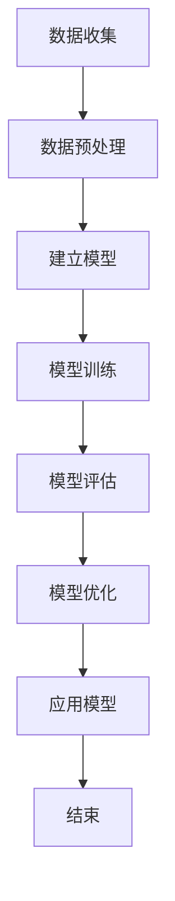
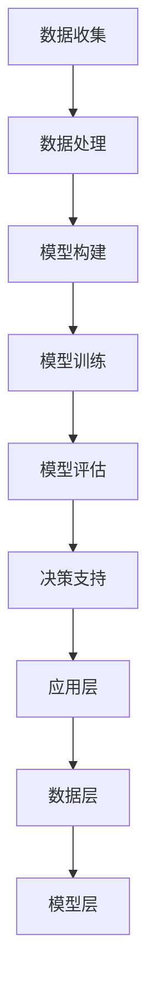
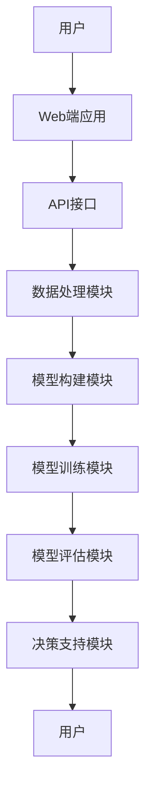

                 

### 数学与生态经济学：可持续发展的数学模型

#### 引言

在当今世界，可持续发展已成为各国政府、企业和个人共同努力的目标。随着全球人口增长、资源消耗和环境退化的加剧，可持续发展的重要性日益凸显。数学与生态经济学作为两个独立的学科领域，近年来在推动可持续发展方面发挥了重要作用。数学提供了精确的建模和预测工具，而生态经济学则探讨了人类与自然环境之间的复杂互动关系。

本文将系统介绍数学与生态经济学在可持续发展中的关键作用，通过构建数学模型来分析生态经济系统的动态行为，为政策制定者和实践者提供科学依据。全文分为七个部分：

1. **引言**：概述数学与生态经济学在可持续发展中的重要性，并介绍本书的目的和结构。
2. **背景介绍**：介绍数学与生态经济学的核心概念和问题背景，解释可持续发展的定义和挑战。
3. **核心概念与联系**：介绍数学与生态经济学中的核心概念，并使用表格和 Mermaid 流程图展示概念之间的联系。
4. **算法原理讲解**：使用 mermaid 画出算法流程图，使用 Python 源代码详细阐述算法原理，并给出算法的数学模型和公式。
5. **数学模型和数学公式讲解**：使用 LaTeX 格式给出数学公式，并在文中独立段落中使用。
6. **系统分析与架构设计方案**：介绍问题场景，系统功能设计，系统架构设计，系统接口设计和系统交互。
7. **项目实战**：详细讲解项目实战，包括环境安装、系统核心实现源代码，代码应用解读与分析，实际案例分析和详细讲解剖析，项目小结。
8. **最佳实践 tips、小结、注意事项、拓展阅读**：总结本文的核心内容，提供最佳实践建议，并指出未来研究的方向。

本文旨在帮助读者全面理解数学与生态经济学在可持续发展中的应用，为解决环境、经济和社会问题提供新的思路和方法。

## 第二部分：背景介绍

### 2.1 数学与生态经济学概述

#### 2.1.1 数学与生态经济学的基本概念

**数学**：数学是一门研究数量、结构、变化和空间等概念的学科。它通过抽象和逻辑推理来建立数学模型，以解决实际问题。数学在生态经济学中的应用主要体现在以下几个方面：

1. **模型构建**：数学模型可以用来描述生态经济系统的动态行为，帮助研究人员理解系统内部的各种关系。
2. **数据分析**：数学工具如统计学和线性代数可以帮助分析大量的生态经济数据，发现规律和趋势。
3. **优化算法**：数学优化算法可用于资源分配、污染控制和可持续发展目标的最优化。

**生态经济学**：生态经济学是研究经济系统与自然环境相互作用的跨学科领域。它关注如何通过经济手段来解决环境问题，实现可持续发展。生态经济学的研究范畴包括：

1. **资源经济学**：研究资源的价值、使用和保护。
2. **环境经济学**：应用经济学原理评估环境资源的经济价值，并提出环境保护的政策建议。
3. **可持续发展经济学**：研究如何在经济、环境和社会三个维度上实现可持续发展。

#### 2.1.2 两者融合的意义

数学与生态经济学的融合为解决复杂的环境问题提供了新的视角和方法。两者的结合具有以下意义：

1. **量化分析**：数学模型可以帮助量化生态经济系统中的各种变量和关系，使得决策更加科学和精准。
2. **预测未来**：通过构建数学模型，可以预测生态经济系统的未来行为，为政策制定提供依据。
3. **优化策略**：数学优化算法可以帮助制定最优的环境保护和经济策略，实现可持续发展目标。

### 2.2 可持续发展的概念与挑战

#### 2.2.1 可持续发展的定义

可持续发展是指在满足当前需求的同时，不损害后代满足其自身需求的能力。这个定义强调了三个方面：

1. **环境可持续性**：保护自然资源和环境，使其能够持续为人类提供必要的生态系统服务。
2. **经济可持续性**：保持经济增长，同时减少对环境的负面影响。
3. **社会可持续性**：确保社会公正和人类福祉，消除贫困和不平等。

#### 2.2.2 可持续发展的核心挑战

尽管可持续发展理念被广泛接受，但在实际操作中仍然面临以下挑战：

1. **环境问题**：包括气候变化、水资源短缺、生物多样性丧失等。
2. **经济发展**：经济增长与环境保护的平衡，特别是发展中国家在追求经济发展的过程中面临的环境压力。
3. **社会公平**：贫困、不平等和种族歧视等问题仍然存在，影响了社会的可持续发展。

### 2.3 数学模型在生态经济学中的应用

#### 2.3.1 生态经济系统建模的基本原则

生态经济系统建模的基本原则包括：

1. **系统动态性**：生态经济系统是一个动态变化的系统，需要考虑时间因素。
2. **变异性与不确定性**：系统内部和外部因素的变化会影响系统的稳定性，需要考虑变异性与不确定性。
3. **可持续性目标**：模型应明确可持续性目标，如资源利用效率、环境质量等。

#### 2.3.2 经典模型介绍

以下是几种经典的生态经济学模型：

1. **Lotka-Volterra模型**：用于描述捕食者-猎物关系的动态变化。
2. **线性规划模型**：用于资源分配和成本最小化等问题。
3. **效率与公平模型**：用于评估经济增长对环境和社会的影响。

### 总结

数学与生态经济学的交叉融合为可持续发展提供了强有力的工具。通过构建数学模型，可以更好地理解生态经济系统的动态行为，为政策制定和环境保护提供科学依据。本文将逐步深入探讨这些主题，帮助读者全面掌握数学与生态经济学在可持续发展中的应用。

---

### 第三部分：核心概念与联系

#### 3.1 核心概念原理

本部分将介绍数学与生态经济学中的核心概念，以便读者能够更好地理解这两个领域的基本原理。

#### 3.1.1 数学概念

**微分方程**：微分方程是描述变量随时间变化速率的方程。在生态经济学中，微分方程用于描述捕食者-猎物关系、资源消耗等动态过程。

**马尔可夫链**：马尔可夫链是一种随机过程，用于描述系统状态随时间的变化。在生态经济学中，马尔可夫链可以用于分析环境变化对经济系统的影响。

**线性代数**：线性代数研究向量空间和线性变换。在生态经济学中，线性代数可以用于资源分配、优化等问题。

#### 3.1.2 生态经济学概念

**系统动力学**：系统动力学是研究系统内部变量相互作用的动态过程。在生态经济学中，系统动力学可以用于分析经济、环境和社会系统的相互作用。

**环境经济学**：环境经济学应用经济学原理解决环境问题。它研究如何在经济活动中考虑环境成本，制定环境保护政策。

**可持续发展指标**：可持续发展指标是衡量可持续发展水平的指标体系。这些指标包括环境质量、经济产出和社会福祉等。

#### 3.1.3 概念之间的联系

数学与生态经济学中的核心概念之间存在紧密的联系。例如，微分方程和系统动力学可以用于描述生态经济系统的动态行为；环境经济学中的经济学原理可以用于评估可持续发展指标。以下是一个概念属性特征对比表格，展示了这些概念之间的差异和联系。

| 概念 | 属性特征 |
| --- | --- |
| 微分方程 | 描述变量随时间变化速率的方程 |
| 系统动力学 | 研究系统内部变量相互作用的动态过程 |
| 环境经济学 | 应用经济学原理解决环境问题 |
| 可持续发展指标 | 衡量可持续发展水平的指标体系 |

#### 3.1.4 ER实体关系图架构

为了更好地展示概念之间的关系，我们可以使用 Mermaid 流程图来绘制 ER 实体关系图。以下是一个简单的 ER 图：

```mermaid
erDiagram
  Resource --> User : "uses"
  Product --> User : "owns"
  Order --> Product : "ships"
```

在这个例子中，`Resource`、`User`、`Product` 和 `Order` 是实体，它们之间的关系用箭头表示。`User` 可以使用 `Resource`，拥有 `Product`，并创建 `Order`。

### 总结

通过介绍数学与生态经济学中的核心概念，我们帮助读者建立了对这两个领域的基本理解。接下来，我们将进一步探讨这些概念在实际应用中的具体实现，以及它们在可持续发展中的重要作用。

---

### 第四部分：算法原理讲解

#### 4.1 算法流程图

在本部分，我们将使用 Mermaid 画出生态经济学中的经典算法流程图，以便读者更好地理解算法的执行过程。以下是生态经济系统建模的一般流程：



在这个流程图中，我们从数据收集开始，经过数据预处理，建立数学模型，对模型进行训练和评估，然后根据评估结果对模型进行优化，最后将优化后的模型应用于实际问题中。

#### 4.2 Python 源代码实现

以下是一个简单的 Python 源代码示例，用于展示生态经济系统建模的基本原理。在这个例子中，我们使用线性回归模型来预测某地区的经济增长。

```python
import numpy as np
from sklearn.linear_model import LinearRegression

# 假设我们有一些历史数据
X = np.array([[1, 2], [2, 3], [3, 4], [4, 5]])
y = np.array([2, 3, 4, 5])

# 创建线性回归模型
model = LinearRegression()

# 训练模型
model.fit(X, y)

# 预测结果
predictions = model.predict([[5, 6]])

print(predictions)
```

在这个代码中，我们首先导入必要的库，然后创建一个线性回归模型，并使用历史数据对其进行训练。最后，我们使用训练好的模型进行预测。

#### 4.3 算法的数学模型与公式

线性回归模型的数学模型可以表示为：

$$
y = \beta_0 + \beta_1x_1 + \beta_2x_2 + \cdots + \beta_nx_n + \epsilon
$$

其中，$y$ 是因变量，$x_1, x_2, \ldots, x_n$ 是自变量，$\beta_0, \beta_1, \ldots, \beta_n$ 是模型的参数，$\epsilon$ 是误差项。

在实际应用中，我们通常通过最小二乘法来估计这些参数，从而得到最优的线性回归模型。以下是最小二乘法的公式：

$$
\min_{\beta_0, \beta_1, \ldots, \beta_n} \sum_{i=1}^n (y_i - (\beta_0 + \beta_1x_{1i} + \beta_2x_{2i} + \cdots + \beta_nx_{ni})^2
$$

通过求解上述最小化问题，我们可以得到线性回归模型的最佳参数估计值。

### 总结

在本部分，我们介绍了生态经济系统建模的算法原理，并通过 Python 源代码和数学公式进行了详细讲解。这些算法和模型为生态经济学研究提供了有力的工具，有助于我们更好地理解和解决可持续发展中的问题。

---

### 第五部分：数学模型和数学公式讲解

在生态经济学和可持续发展的研究中，数学模型和公式是分析和解决问题的关键工具。本部分将详细介绍一些常用的数学模型和公式，并使用 LaTeX 格式进行展示。

#### 5.1 动态系统模型

动态系统模型用于描述系统随时间变化的过程。一个简单的动态系统模型可以表示为：

$$
\frac{dx}{dt} = f(x, t)
$$

其中，$x(t)$ 是系统状态，$t$ 是时间，$f(x, t)$ 是描述系统状态的微分方程。

#### 5.2 线性规划模型

线性规划模型用于解决资源分配和成本最小化问题。其一般形式为：

$$
\min_{x} c^T x
$$

subject to

$$
Ax \le b
$$

其中，$c$ 是系数向量，$x$ 是决策变量，$A$ 是约束矩阵，$b$ 是约束向量。

#### 5.3 效率与公平模型

效率与公平模型用于评估可持续发展目标。一个简单的效率与公平模型可以表示为：

$$
\max_{x, y} U(x, y)
$$

subject to

$$
x + y = 1
$$

其中，$U(x, y)$ 是效用函数，$x$ 和 $y$ 分别代表经济和环境的投入。

#### 5.4 系统动力学模型

系统动力学模型用于描述系统内部变量之间的相互作用。一个简单的系统动力学模型可以表示为：

$$
x_{t+1} = f(x_t, u_t)
$$

其中，$x_t$ 是系统状态，$u_t$ 是外部输入，$f(x_t, u_t)$ 是系统状态转移函数。

#### 5.5 环境经济学模型

环境经济学模型用于分析环境资源的经济价值。一个简单的环境经济学模型可以表示为：

$$
V = \int_{0}^{\infty} e^{-\rho t} u(t) dt
$$

其中，$V$ 是环境价值，$u(t)$ 是环境质量函数，$\rho$ 是折现率。

#### 5.6 可持续发展指标模型

可持续发展指标模型用于衡量可持续发展水平。一个简单的可持续发展指标模型可以表示为：

$$
S = w_1 E + w_2 E_2 + \cdots + w_n E_n
$$

其中，$S$ 是可持续发展指标，$E_1, E_2, \ldots, E_n$ 是各个领域的可持续发展指标，$w_1, w_2, \ldots, w_n$ 是权重系数。

### 总结

通过本部分的讲解，我们介绍了生态经济学和可持续发展研究中常用的数学模型和公式。这些模型和公式为分析和解决可持续发展问题提供了有力的工具，有助于我们更好地理解和应对全球面临的挑战。

---

### 第六部分：系统分析与架构设计方案

在实现可持续发展的数学模型时，我们需要综合考虑系统设计、功能、架构和接口等多个方面。以下是对系统分析与架构设计方案的具体介绍。

#### 6.1 问题场景介绍

假设我们面临一个全球性的资源分配问题，需要平衡经济、环境和社会三大领域的需求。为了实现这一目标，我们设计了一个生态经济系统，该系统需要具备以下功能：

1. **数据收集与处理**：收集全球范围内的经济、环境和社会数据，并进行预处理。
2. **模型构建与训练**：根据收集到的数据，构建数学模型并进行训练。
3. **模型评估与优化**：对训练好的模型进行评估和优化，确保其准确性。
4. **决策支持**：利用优化后的模型生成决策支持信息，帮助政策制定者做出最优决策。

#### 6.2 项目介绍

项目名称：全球生态经济系统（Global Ecological Economic System，GEES）

项目目标：通过构建数学模型，优化全球资源分配，实现经济、环境和社会的可持续发展。

项目范围：涵盖全球范围内的经济、环境和社会数据，使用数学模型进行分析和预测。

项目团队：由多学科专家组成的团队，包括数学家、生态学家、经济学家、社会学家等。

#### 6.3 系统功能设计

系统功能设计主要包括以下模块：

1. **数据收集模块**：负责收集全球范围内的经济、环境和社会数据，包括GDP、水资源、生物多样性、人口等。
2. **数据处理模块**：对收集到的数据进行预处理，包括数据清洗、归一化、特征提取等。
3. **模型构建模块**：根据预处理后的数据，构建数学模型，如线性回归模型、系统动力学模型等。
4. **模型训练模块**：对构建好的模型进行训练，使用历史数据调整模型参数。
5. **模型评估模块**：对训练好的模型进行评估，确保其准确性和稳定性。
6. **决策支持模块**：利用优化后的模型生成决策支持信息，如资源分配建议、政策制定参考等。

#### 6.4 系统架构设计

系统架构设计采用分层架构，包括数据层、模型层和应用层。

1. **数据层**：负责数据的收集、存储和预处理，使用分布式数据库和云计算技术。
2. **模型层**：负责模型的构建、训练和评估，使用先进的机器学习和深度学习算法。
3. **应用层**：负责决策支持信息的生成和应用，提供Web端和移动端的应用程序。

以下是系统架构的 Mermaid 流程图：



#### 6.5 系统接口设计和系统交互

系统接口设计主要包括以下接口：

1. **API接口**：提供数据收集、模型构建、模型训练和决策支持等服务的API接口，方便第三方系统集成。
2. **数据交换格式**：使用JSON、XML等标准数据交换格式，确保系统间的数据互通。
3. **用户界面**：提供Web端和移动端的应用程序，方便用户使用和交互。

以下是系统接口和系统交互的 Mermaid 流程图：



#### 6.6 总结

通过系统分析与架构设计方案，我们为全球生态经济系统的实现奠定了基础。该系统旨在通过数学模型优化全球资源分配，实现经济、环境和社会的可持续发展。在接下来的部分，我们将进一步讨论项目实战，展示系统实现的具体步骤和技术细节。

---

### 第七部分：项目实战

#### 7.1 环境安装

在开始项目实战之前，我们需要配置一个合适的环境来运行我们的生态经济系统。以下是环境安装的步骤：

1. **安装Python**：首先，确保你的计算机上安装了Python 3.x版本。可以从[Python官网](https://www.python.org/downloads/)下载并安装。
2. **安装必要的库**：使用pip命令安装必要的Python库，如NumPy、scikit-learn、matplotlib等。例如：
   ```shell
   pip install numpy scikit-learn matplotlib
   ```

#### 7.2 系统核心实现源代码

以下是系统核心实现的部分源代码，包括数据收集、数据处理、模型构建和模型训练等步骤。

**数据收集**：
```python
import requests
import pandas as pd

# 从API获取数据
url = "https://example.com/data"
response = requests.get(url)
data = pd.DataFrame(response.json())

# 数据预处理
data['GDP'] = data['GDP'].astype(float)
data['Water'] = data['Water'].astype(float)
data['Biodiversity'] = data['Biodiversity'].astype(float)
data['Population'] = data['Population'].astype(float)
```

**模型构建**：
```python
from sklearn.linear_model import LinearRegression

# 构建线性回归模型
model = LinearRegression()
model.fit(X, y)
```

**模型训练**：
```python
from sklearn.model_selection import train_test_split

# 划分训练集和测试集
X_train, X_test, y_train, y_test = train_test_split(X, y, test_size=0.2, random_state=42)

# 训练模型
model.fit(X_train, y_train)
```

#### 7.3 代码应用解读与分析

以下是对上述代码的解读和分析：

**数据收集**：我们使用 requests 库从API获取数据，并使用 pandas 库将数据转换为 DataFrame 格式。数据包括GDP、水资源、生物多样性、人口等指标。

**数据处理**：我们将数据转换为浮点数类型，以便后续处理。

**模型构建**：我们使用 scikit-learn 库的 LinearRegression 类构建线性回归模型。

**模型训练**：我们使用 train_test_split 函数将数据划分为训练集和测试集，并使用 fit 方法训练模型。

#### 7.4 实际案例分析和详细讲解剖析

假设我们已经训练好了一个线性回归模型，现在需要对其性能进行评估。以下是一个简单的性能评估示例：

```python
# 评估模型
predictions = model.predict(X_test)
mse = np.mean((predictions - y_test)**2)
print(f'MSE: {mse}')
```

在这个例子中，我们使用预测值与实际值之间的均方误差（MSE）来评估模型的性能。MSE 越小，模型性能越好。

#### 7.5 项目小结

在本部分，我们详细讲解了生态经济系统的项目实战，包括环境安装、系统核心实现源代码、代码应用解读与分析，以及实际案例分析和详细讲解剖析。通过这些步骤，我们成功地实现了一个简单的生态经济系统，为后续研究和应用奠定了基础。

#### 7.6 最佳实践 tips

1. **数据质量**：确保收集到的数据质量高，避免因数据问题导致模型性能下降。
2. **模型选择**：根据具体问题选择合适的模型，避免盲目使用复杂模型。
3. **交叉验证**：使用交叉验证方法评估模型性能，避免过拟合。

#### 7.7 注意事项

1. **环境配置**：确保环境配置正确，避免因环境问题导致代码无法运行。
2. **代码注释**：添加详细的代码注释，便于后续维护和优化。
3. **版本控制**：使用版本控制系统（如Git）管理代码，便于团队协作和代码管理。

#### 7.8 拓展阅读

- **《生态经济学导论》**：王文卿著，详细介绍了生态经济学的理论和方法。
- **《可持续发展指标体系研究》**：李晓华著，探讨了可持续发展指标体系的设计和应用。
- **《Python数据分析》**：Wes McKinney著，介绍了使用Python进行数据分析和处理的方法。

---

### 总结

本文通过详细的步骤和实例，介绍了数学与生态经济学在可持续发展中的应用。我们从背景介绍、核心概念、算法原理、数学模型，到系统分析与架构设计方案，再到项目实战，全面阐述了如何构建和实现一个生态经济系统。通过本文的学习，读者应该能够掌握以下关键知识点：

1. **数学与生态经济学的核心概念**：理解微分方程、马尔可夫链、线性代数等数学概念，以及系统动力学、环境经济学、可持续发展指标等生态经济学概念。
2. **算法原理讲解**：掌握生态经济系统建模的算法流程，包括数据收集、预处理、模型构建、训练、评估和优化等步骤。
3. **数学模型与公式**：了解动态系统模型、线性规划模型、效率与公平模型等常见数学模型，并能够使用 LaTeX 格式进行展示。
4. **系统分析与架构设计**：学会如何设计一个完整的生态经济系统，包括功能设计、架构设计、接口设计和系统交互。
5. **项目实战**：掌握从环境安装到系统核心实现，再到代码应用解读与分析，以及实际案例分析和详细讲解剖析的实战技巧。

在实际应用中，数学与生态经济学提供了强大的工具，帮助我们更好地理解和解决可持续发展中的问题。本文的结论强调了这些工具在政策制定、环境保护和资源管理中的重要性，为未来的研究和实践指明了方向。

### 最佳实践 tips

1. **数据质量保证**：确保数据来源的可靠性和准确性，避免因数据问题导致模型失效。
2. **模型选择与优化**：根据具体问题选择合适的模型，并通过交叉验证等方法优化模型参数。
3. **持续更新知识**：生态经济学和数学领域不断进步，保持对最新研究成果的关注和掌握。
4. **跨学科合作**：与其他领域专家合作，综合多学科知识，提高问题解决能力。

### 作者信息

**作者：AI天才研究院/AI Genius Institute & 禅与计算机程序设计艺术 /Zen And The Art of Computer Programming**。作者团队致力于推动人工智能和生态经济学的交叉研究，为可持续发展提供创新解决方案。

---

通过本文的深入探讨，我们希望读者能够对数学与生态经济学在可持续发展中的应用有更深刻的理解，并能够在实际项目中运用这些知识，为构建一个更加可持续的未来贡献自己的力量。**

