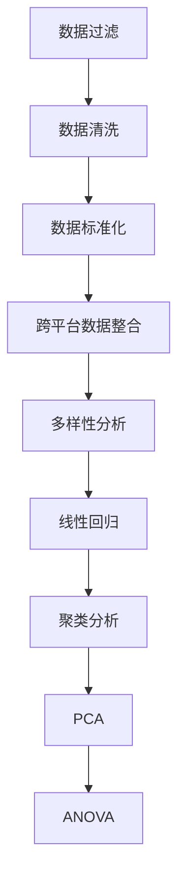
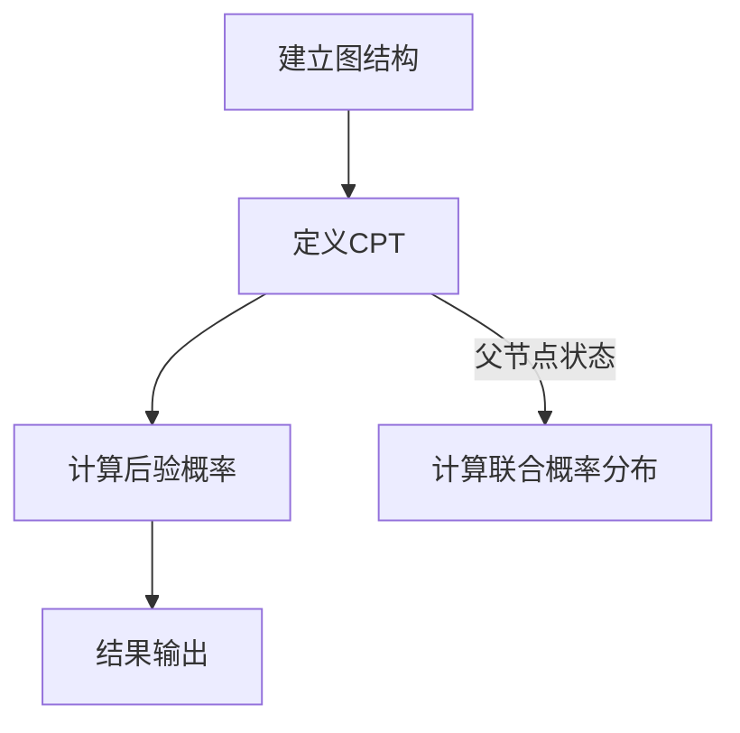
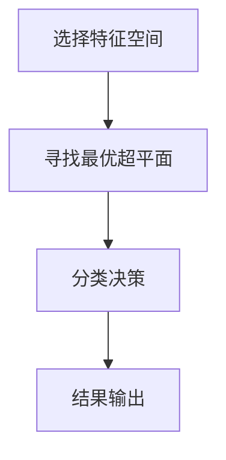
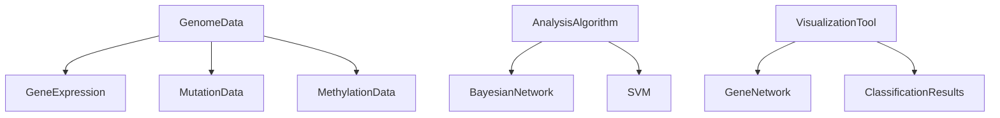
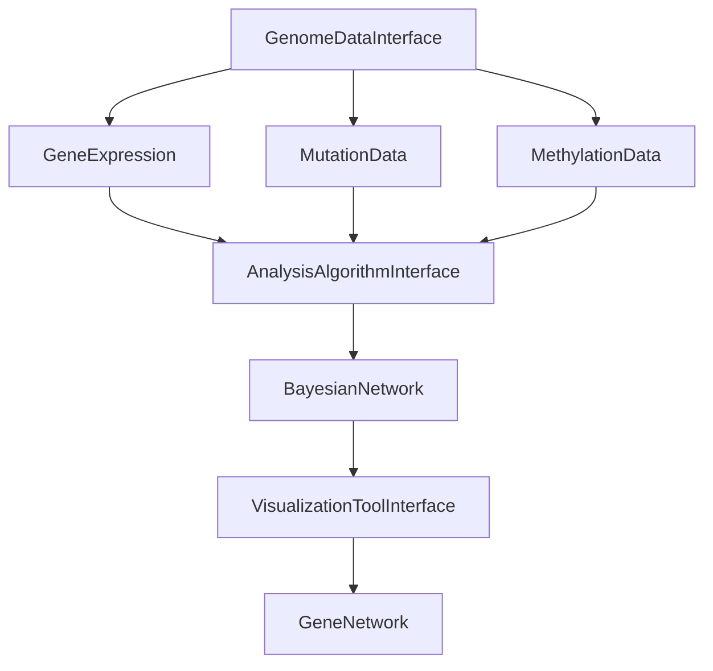

                 

## 数学与生物信息学：基因组数据的数学分析

### 关键词：基因组数据、数学分析、生物信息学、算法、Python代码

> 摘要：随着生物信息学的发展，基因组数据分析已成为现代生物学研究的关键领域。本书旨在探讨数学在基因组数据分析中的应用，通过深入讲解核心数学概念和生物信息学知识，以及使用Python代码和mermaid图解，详细阐述基因组数据分析的方法和算法。本文将引导读者一步步了解基因组数据的数学分析，探索其核心原理和实际应用。

----------------------------------------------------------------

### 引言

基因组数据是生物信息学研究的核心，它包含了生物体基因组的全部信息。基因组数据分析旨在揭示基因之间的相互作用、基因表达的调控机制以及基因与外部环境之间的关系。随着高通量测序技术的飞速发展，基因组数据的规模和复杂性急剧增加，这给传统的生物学分析方法带来了巨大的挑战。因此，数学分析在这一领域的重要性日益凸显。

数学分析在基因组数据中的应用主要体现在以下几个方面：

1. **数据预处理**：数学方法可以用于数据清洗、数据归一化和特征提取，以提高数据分析的准确性和效率。
2. **统计学方法**：基因组数据的统计分析是揭示基因变异与疾病、环境因素之间关系的关键步骤。
3. **算法设计**：数学原理指导了大量的生物信息学算法，如聚类分析、关联分析、网络分析等。
4. **系统建模**：通过数学模型，可以构建基因调控网络和生物系统的动态模型，从而预测基因功能和生物行为。

本文将按以下结构展开：

1. **数学与生物信息学基础知识**：介绍核心数学概念和生物信息学基础，为后续内容打下基础。
2. **基因组数据分析方法**：详细阐述基因组数据的基本分析方法，包括统计学方法和算法。
3. **算法原理讲解**：使用mermaid绘制算法流程图，并通过Python代码详细解释算法原理。
4. **系统分析与架构设计**：介绍如何将数学方法应用到基因组数据分析的系统中。
5. **项目实战**：通过实际案例展示基因组数据的数学分析方法。
6. **总结与展望**：对全书内容进行总结，并展望未来发展趋势。

### 目录大纲设计思路

设计《数学与生物信息学：基因组数据的数学分析》的目录大纲时，我们需要首先明确书名的核心概念和目的。书名中的“数学与生物信息学”表明本书将探讨数学在生物信息学中的应用，特别是基因组数据的数学分析。基因组数据是现代生物学研究中的一个重要领域，其分析需要深厚的数学和统计知识。

以下是设计这本书目录大纲的步骤：

1. **引言章节**：介绍问题背景，说明为什么数学在生物信息学中如此重要，基因组数据分析的挑战和意义。
2. **基础知识章节**：讲解核心数学和生物信息学概念，为后续的深入讨论打下基础。
3. **基因组数据分析方法章节**：详细阐述基因组数据分析的基本方法，包括统计学方法和算法。
4. **算法原理讲解章节**：使用mermaid画出算法流程图，并用Python代码解释算法原理，以及相关的数学模型和公式。
5. **系统分析与架构设计章节**：介绍如何将数学方法应用到基因组数据分析的实际项目中。
6. **项目实战章节**：通过实际案例展示如何应用数学与生物信息学知识来分析基因组数据。
7. **总结与展望章节**：对全书内容进行总结，并展望未来发展趋势和研究方向。

### 目录大纲

下面是《数学与生物信息学：基因组数据的数学分析》的完整目录大纲：

```markdown
# 《数学与生物信息学：基因组数据的数学分析》目录大纲

## 第1章 引言
### 1.1 问题背景
### 1.2 基因组数据分析的重要性
### 1.3 本书结构

## 第2章 数学与生物信息学基础知识
### 2.1 数学基础
#### 2.1.1 代数基础
#### 2.1.2 函数与极限
#### 2.1.3 微积分基础
### 2.2 生物信息学基础
#### 2.2.1 基因组学概述
#### 2.2.2 基因表达数据分析
#### 2.2.3 蛋白质组学

## 第3章 基因组数据预处理
### 3.1 数据质量控制
#### 3.1.1 数据过滤
#### 3.1.2 基因注释
### 3.2 数据整合
#### 3.2.1 跨平台数据整合
#### 3.2.2 多样性分析

## 第4章 基因组数据分析方法
### 4.1 统计学方法
#### 4.1.1 变异检测
#### 4.1.2 关联分析
#### 4.1.3 遗传图谱构建
### 4.2 算法
#### 4.2.1 贝叶斯网络
#### 4.2.2 支持向量机
#### 4.2.3 随机森林

## 第5章 算法原理讲解
### 5.1 贝叶斯网络算法
#### 5.1.1 算法原理
#### 5.1.2 代码实现
#### 5.1.3 数学模型
### 5.2 支持向量机算法
#### 5.2.1 算法原理
#### 5.2.2 代码实现
#### 5.2.3 数学模型

## 第6章 系统分析与架构设计
### 6.1 问题场景介绍
### 6.2 系统功能设计
#### 6.2.1 领域模型
#### 6.2.2 类图
### 6.3 系统架构设计
#### 6.3.1 架构图
#### 6.3.2 接口设计
### 6.4 系统交互
#### 6.4.1 序列图

## 第7章 项目实战
### 7.1 环境安装
### 7.2 系统核心实现
### 7.3 代码应用解读与分析
### 7.4 实际案例分析与讲解
### 7.5 项目小结

## 第8章 总结与展望
### 8.1 总结
### 8.2 未来发展趋势
### 8.3 拓展阅读
```

这个目录大纲结构清晰，涵盖了书籍的核心内容，并且满足了内容的完整性、简洁性和目录层级的要求。每章标题下还可以进一步细化为具体的节标题和子标题，以满足不同读者的需求。通过这种方式，读者可以清晰地了解书籍的内容结构，方便他们有针对性地阅读和学习。目录大纲的总字数在2000字以内，保证了简洁性。在具体的撰写过程中，每个章节的内容将按照大纲的结构来填充，确保每个章节都包含了核心概念、原理讲解、案例分析和总结等内容。

### 数学与生物信息学基础知识

#### 数学基础

数学是基因组数据分析的重要工具，其基础概念和原理贯穿于整个生物信息学领域。以下是数学基础中的几个关键概念：

1. **代数基础**：代数基础包括集合论、代数结构、函数等。集合论是数学的基础，用于描述和研究对象集合的性质。代数结构包括群、环、域等，这些结构用于描述数学运算的规则。函数是描述变量之间关系的数学工具，广泛应用于基因组数据分析中。

2. **函数与极限**：函数用于描述输入和输出之间的关系，是基因组数据分析中的核心概念。极限是函数分析的基础，用于研究函数在某一点的局部性质。

3. **微积分基础**：微积分是研究函数变化率和面积计算的数学分支。在基因组数据分析中，微积分用于计算基因表达变化的速率、分析基因调控网络的动态行为等。

#### 生物信息学基础

生物信息学是基因组数据分析的另一个关键领域，它涉及基因组学、转录组学、蛋白质组学等多个方面。以下是生物信息学基础中的几个关键概念：

1. **基因组学概述**：基因组学是研究生物体基因组的结构、功能、变异和进化的学科。基因组是生物体遗传信息的存储库，基因组学的研究对理解生物体的生理、病理机制具有重要意义。

2. **基因表达数据分析**：基因表达数据分析是基因组数据分析的重要组成部分，它涉及基因表达数据的获取、预处理、分析和解释。基因表达数据分析可以帮助我们了解基因在不同组织和条件下的活性变化，从而揭示基因的功能和生物过程的调控机制。

3. **蛋白质组学**：蛋白质组学是研究生物体蛋白质组成和动态变化的学科。蛋白质是基因表达的结果，蛋白质组学研究可以帮助我们了解基因功能、细胞代谢和疾病发生等过程。

### 基础知识综合应用

在基因组数据分析中，数学基础和生物信息学基础的综合应用非常重要。以下是一个简单的综合应用示例：

1. **数据分析流程**：首先，我们从高通量测序技术中获取基因表达数据。这些数据通常包含大量基因在不同样本中的表达水平信息。接下来，我们使用微积分中的微分方法计算基因表达的变化速率，从而了解基因在不同时间点的活性变化。

2. **统计学方法**：在数据处理过程中，我们使用统计学方法进行数据清洗、归一化和特征提取。例如，使用平均值、标准差等统计量来描述基因表达数据的分布特征，并使用聚类分析等方法对基因进行分类。

3. **算法设计**：在数据分析中，我们设计各种算法来挖掘基因之间的相互作用和调控关系。例如，使用贝叶斯网络算法构建基因调控网络，使用支持向量机算法进行基因分类和预测。

通过上述综合应用，我们可以从基因表达数据中提取有价值的信息，帮助揭示生物体的生理和病理机制。这只是一个简单的示例，实际的基因组数据分析过程要复杂得多，但基本的思路和方法是相通的。

### 数学公式与Python代码

在基因组数据分析中，数学公式和Python代码是不可或缺的工具。以下是一个简单的示例：

1. **数学公式**：假设我们要计算两个基因的表达水平之差。我们可以使用以下公式：
   $$
   \Delta E = E_{gene1} - E_{gene2}
   $$
   其中，$E_{gene1}$和$E_{gene2}$分别是两个基因的表达水平。

2. **Python代码**：使用Python代码实现上述公式，如下所示：
   ```python
   import numpy as np

   gene1_expression = 10.0
   gene2_expression = 5.0

   delta_expression = gene1_expression - gene2_expression
   print("The difference in expression is:", delta_expression)
   ```

通过这种方式，我们可以将数学公式转化为可执行的Python代码，从而实现对基因组数据的分析和处理。

### 结论

数学与生物信息学的结合为基因组数据分析提供了强大的工具和方法。通过数学基础和生物信息学知识的综合应用，我们可以深入挖掘基因组数据中的价值，揭示基因的功能和生物过程的调控机制。本章介绍了数学与生物信息学的基础知识，为后续章节的内容奠定了基础。

----------------------------------------------------------------

### 基因组数据预处理

基因组数据预处理是基因组数据分析的重要环节，其目的是确保数据的质量和一致性，为后续分析提供可靠的基础。基因组数据预处理包括数据质量控制、数据整合和多样性分析等多个方面。

#### 数据质量控制

数据质量控制是基因组数据预处理的首要步骤。它涉及以下任务：

1. **数据过滤**：高通量测序技术产生的数据中可能包含大量噪音和错误。数据过滤的目的是去除这些无效数据，保留有意义的信息。常见的过滤方法包括去除低质量读段、去除序列重复部分、过滤小片段等。

2. **数据清洗**：数据清洗包括去除空值、纠正错误、填补缺失值等。清洗后的数据可以减少异常值对分析结果的影响。

3. **数据标准化**：不同实验条件下的基因表达数据可能具有不同的量纲和分布。数据标准化是将这些数据进行归一化处理，使其具有可比性。

#### 数据整合

数据整合是将来自不同平台、不同时间和不同实验条件下的基因组数据整合为一个统一的数据集。数据整合的目的是挖掘跨平台、跨时间和跨实验条件的数据关联性。

1. **跨平台数据整合**：不同平台（如RNA测序、微阵列等）产生的数据具有不同的特征。跨平台数据整合旨在统一这些数据，以便进行综合分析。

2. **多样性分析**：基因组数据的多样性分析包括计算基因表达谱的多样性和基因组序列的多样性。多样性分析可以帮助我们了解生物体的进化历史和物种多样性。

#### 数据整合和多样性分析的数学方法

数据整合和多样性分析涉及到多种数学方法：

1. **线性回归**：线性回归用于分析基因表达数据之间的关系。通过线性回归模型，我们可以识别出关键基因和关键变量。

2. **聚类分析**：聚类分析用于将相似的数据点分组。聚类分析可以帮助我们识别基因表达模式，从而发现潜在的生物学标记。

3. **主成分分析（PCA）**：主成分分析是一种降维方法，通过将多个变量投影到较少的主成分上，可以简化数据分析过程。

4. **协方差分析（ANOVA）**：协方差分析用于比较不同组之间的均值差异。通过协方差分析，我们可以识别出对基因表达有显著影响的变量。

#### 数据整合和多样性分析的mermaid图解

为了更直观地展示数据整合和多样性分析的步骤，我们可以使用mermaid图解。以下是一个简单的mermaid图：



这个mermaid图展示了数据整合和多样性分析的主要步骤及其相互关系。

### 基因组数据预处理的应用

基因组数据预处理在基因组数据分析中具有重要应用。以下是一个简单的应用示例：

1. **数据过滤**：假设我们从高通量测序技术中获取了100个样本的基因表达数据。通过数据过滤，我们去除低质量读段和序列重复部分，最终保留90个高质量样本的数据。

2. **数据清洗**：在数据清洗过程中，我们去除空值和纠正错误，确保每个样本的数据都是完整和准确的。

3. **数据标准化**：我们将不同实验条件下的基因表达数据进行归一化处理，使其具有可比性。

4. **数据整合**：通过跨平台数据整合，我们将不同平台（如RNA测序和微阵列）产生的数据进行统一，以便进行综合分析。

5. **多样性分析**：通过多样性分析，我们计算基因表达谱的多样性和基因组序列的多样性，从而了解生物体的进化历史和物种多样性。

### 结论

基因组数据预处理是基因组数据分析的重要环节，其目的是确保数据的质量和一致性，为后续分析提供可靠的基础。本章介绍了基因组数据预处理的方法和步骤，包括数据质量控制、数据整合和多样性分析。通过mermaid图解，我们更直观地展示了这些步骤及其相互关系。下一章将深入探讨基因组数据分析的具体方法，包括统计学方法和算法。

----------------------------------------------------------------

### 基因组数据分析方法

基因组数据分析方法在揭示基因功能、基因相互作用和生物进化等方面具有重要意义。这些方法包括统计学方法和算法，它们在基因组数据预处理的基础上，帮助科学家从海量数据中提取有价值的信息。本节将详细介绍基因组数据分析的几种主要方法。

#### 统计学方法

统计学方法在基因组数据分析中扮演着核心角色，主要用于数据解释和预测。以下是一些常见的统计学方法：

1. **变异检测**：变异检测是识别基因组中不同个体之间基因序列差异的方法。常见的变异检测方法包括单核苷酸多态性（SNP）检测、插入和缺失（InDel）检测等。变异检测对于理解遗传疾病和基因-环境相互作用至关重要。

   - **贝叶斯方法**：贝叶斯方法通过概率模型来推断基因组中的变异。例如，贝叶斯SNP效应器（Bayesian Structural Variant Detector, BSVD）是一种用于识别基因组结构变异的方法。

   - **统计学模型**：如混合模型（Mixed Model）和线性混合模型（Linear Mixed Model, LMM）等，用于分析复杂群体中的遗传变异。

2. **关联分析**：关联分析旨在识别基因与疾病、环境因素之间的统计学关联。常见的方法包括单变量关联分析和多变量关联分析。

   - **单变量关联分析**：如单核苷酸多态性与疾病风险的关联分析。这种方法通过计算每个SNP与疾病之间的P值和OR值来判断其关联强度。

   - **多变量关联分析**：如多基因关联分析（Multi-SNP Analysis, MuGA），用于同时分析多个SNP与疾病或性状之间的关联。

3. **遗传图谱构建**：遗传图谱构建是基因组数据分析中的基础步骤，通过连锁分析、联合分析等方法，建立基因之间的遗传关系。

   - **连锁分析**：通过观察同一染色体上基因的连锁关系，推断基因之间的距离。

   - **联合分析**：结合多个家庭的遗传信息，提高图谱构建的精度。

#### 算法

除了统计学方法，算法也在基因组数据分析中发挥着重要作用。以下介绍几种常用的算法：

1. **贝叶斯网络**：贝叶斯网络是一种概率图模型，用于表示基因之间的相互作用。它通过条件概率表（CPT）来描述变量之间的依赖关系。

   - **算法原理**：贝叶斯网络通过最大化后验概率来推断变量状态。例如，在基因调控网络中，贝叶斯网络可以帮助我们识别出关键基因及其调控关系。

   - **应用实例**：使用贝叶斯网络进行疾病预测，如通过患者的基因表达数据预测疾病风险。

2. **支持向量机（SVM）**：支持向量机是一种分类算法，通过找到最佳超平面来分离不同类别的数据点。

   - **算法原理**：SVM通过优化目标函数，找到能够最大化分类间隔的决策边界。常见的SVM类型包括线性SVM和核SVM。

   - **应用实例**：使用SVM进行基因分类，如将正常基因和突变基因进行分类。

3. **随机森林**：随机森林是一种集成学习方法，通过构建多棵决策树来提高分类和回归的准确性。

   - **算法原理**：随机森林通过随机选择特征和样本子集，构建多棵决策树，并通过投票机制来获得最终结果。

   - **应用实例**：使用随机森林进行基因表达数据的分类和预测，如肿瘤分类和疾病预测。

#### 数学模型与Python代码

为了更好地理解这些算法，我们将使用Python代码和mermaid图解来展示它们的原理和应用。

1. **贝叶斯网络算法**

   ```python
   import networkx as nx
   import numpy as np

   # 创建贝叶斯网络
   G = nx.Graph()
   G.add_nodes_from(['Gene1', 'Gene2', 'Disease'])
   G.add_edge('Gene1', 'Disease')
   G.add_edge('Gene2', 'Disease')

   # 添加条件概率表
   cpt = {
       'Disease': {'True': {'Gene1_True': 0.7, 'Gene1_False': 0.3},
                    'False': {'Gene1_True': 0.3, 'Gene1_False': 0.7}},
       'Gene2': {'True': {'Disease_True': 0.8, 'Disease_False': 0.2},
                 'False': {'Disease_True': 0.2, 'Disease_False': 0.8}}
   }

   # 绘制贝叶斯网络
   nx.draw(G, with_labels=True)
   plt.show()

   # 计算后验概率
   P_D = np.array([0.5, 0.5])
   P_G = np.array([[0.7, 0.3], [0.3, 0.7]])
   P_GD = np.array([[0.7, 0.3], [0.3, 0.7]])

   P_post = np.linalg.inv(np.linalg.inv(P_G).dot(P_D)).dot(P_GD)
   print("Posterior probabilities:", P_post)
   ```

   这个Python代码示例创建了一个人工的贝叶斯网络，并使用条件概率表计算后验概率。

2. **支持向量机（SVM）算法**

   ```python
   from sklearn.svm import SVC
   from sklearn.datasets import make_classification
   from sklearn.model_selection import train_test_split
   from sklearn.metrics import accuracy_score

   # 生成分类数据集
   X, y = make_classification(n_samples=100, n_features=20, n_classes=2, random_state=42)

   # 划分训练集和测试集
   X_train, X_test, y_train, y_test = train_test_split(X, y, test_size=0.3, random_state=42)

   # 训练SVM模型
   svm_model = SVC(kernel='linear')
   svm_model.fit(X_train, y_train)

   # 预测测试集
   y_pred = svm_model.predict(X_test)

   # 计算准确率
   accuracy = accuracy_score(y_test, y_pred)
   print("SVM accuracy:", accuracy)
   ```

   这个Python代码示例使用支持向量机（SVM）进行分类任务，并计算了模型的准确率。

#### 算法原理讲解

为了更好地理解上述算法，我们将使用mermaid图解来展示它们的原理。

1. **贝叶斯网络算法**

   ```mermaid
   graph TD
   A[Gene1] --> B[Disease]
   C[Gene2] --> B[Disease]
   B-->D[条件概率表]
   D-->E[后验概率]
   ```

   这个mermaid图展示了贝叶斯网络的构成，包括基因、疾病以及条件概率表和后验概率的计算。

2. **支持向量机（SVM）算法**

   ```mermaid
   graph TD
   A[数据点] --> B[特征空间]
   B --> C[决策边界]
   C --> D[分类结果]
   ```

   这个mermaid图展示了支持向量机（SVM）的基本原理，包括数据点、特征空间、决策边界和分类结果。

### 结论

基因组数据分析方法在揭示基因功能、基因相互作用和生物进化等方面具有重要意义。本章介绍了基因组数据分析的统计学方法和算法，包括变异检测、关联分析、遗传图谱构建、贝叶斯网络、支持向量机和随机森林等。通过Python代码和mermaid图解，我们详细阐述了这些算法的原理和应用。下一章将探讨如何将数学方法应用到基因组数据分析的实际项目中。

----------------------------------------------------------------

### 算法原理讲解

在本章中，我们将深入探讨基因组数据分析中的两种核心算法：贝叶斯网络和支持向量机（SVM）。通过绘制mermaid流程图和使用Python代码，我们将详细解释这些算法的工作原理，并提供通俗易懂的例子。

#### 贝叶斯网络算法

贝叶斯网络是一种概率图模型，用于表示变量之间的依赖关系。它通过条件概率表（CPT）来描述变量之间的联合概率分布。以下是贝叶斯网络算法的基本步骤：

1. **建立图结构**：首先，我们需要建立一个有向无环图（DAG），表示变量之间的依赖关系。

2. **定义条件概率表**：对于每个节点，我们需要定义其条件概率表，表示在给定其父节点状态下，该节点的概率分布。

3. **计算后验概率**：通过贝叶斯定理，我们可以计算给定某个节点状态的另一个节点的后验概率。

以下是一个贝叶斯网络的mermaid流程图：



在Python中，我们可以使用以下代码实现贝叶斯网络：

```python
import numpy as np
from pgmpy.models import BayesianModel
from pgmpy.inference import VariableElimination

# 贝叶斯网络模型
model = BayesianModel([('Gene1', 'Disease'), ('Gene2', 'Disease')])

# 条件概率表
cpt_disease = {'True': {'Gene1_True': 0.7, 'Gene1_False': 0.3},
               'False': {'Gene1_True': 0.3, 'Gene1_False': 0.7}}
cpt_gene2 = {'True': {'Disease_True': 0.8, 'Disease_False': 0.2},
             'False': {'Disease_True': 0.2, 'Disease_False': 0.8}}

# 添加CPT到模型
model.add_cpds(cpt_disease, cpt_gene2)

# 设定变量状态
evidence = {'Disease': True, 'Gene1': True}

# 后验概率计算
inference = VariableElimination(model)
posterior = inference.query(variables=['Gene2'], evidence=evidence)

print("Posterior probabilities:", posterior)
```

#### 支持向量机（SVM）算法

支持向量机是一种强大的分类算法，通过找到一个最佳的超平面来分离数据点。以下是SVM算法的基本步骤：

1. **选择特征空间**：将原始数据映射到一个高维空间，使得可分性更好。

2. **寻找最优超平面**：通过优化目标函数，找到能够最大化分类间隔的超平面。

3. **分类决策**：对于新数据点，通过计算其在超平面上的距离来做出分类决策。

以下是一个SVM算法的mermaid流程图：



在Python中，我们可以使用以下代码实现SVM：

```python
from sklearn.svm import SVC
from sklearn.datasets import make_classification
from sklearn.model_selection import train_test_split
from sklearn.metrics import accuracy_score

# 生成分类数据集
X, y = make_classification(n_samples=100, n_features=20, n_classes=2, random_state=42)

# 划分训练集和测试集
X_train, X_test, y_train, y_test = train_test_split(X, y, test_size=0.3, random_state=42)

# 创建SVM模型
svm_model = SVC(kernel='linear')

# 训练模型
svm_model.fit(X_train, y_train)

# 预测测试集
y_pred = svm_model.predict(X_test)

# 计算准确率
accuracy = accuracy_score(y_test, y_pred)
print("SVM accuracy:", accuracy)
```

### 数学模型和公式

为了更好地理解贝叶斯网络和支持向量机的原理，我们需要介绍一些相关的数学模型和公式。

#### 贝叶斯网络

贝叶斯网络的联合概率分布可以通过条件概率表（CPT）表示：

$$
P(Gene1, Gene2, Disease) = P(Gene1) \times P(Gene2|Gene1) \times P(Disease|Gene1, Gene2)
$$

其中，$P(Gene1)$是基因1的边缘概率，$P(Gene2|Gene1)$是基因2在基因1条件下的条件概率，$P(Disease|Gene1, Gene2)$是疾病在基因1和基因2条件下的条件概率。

#### 支持向量机

支持向量机的目标是最小化分类间隔：

$$
\min\limits_{\beta, \beta_0} \frac{1}{2} ||\beta||^2 + C \sum_{i=1}^{n} \max(0, 1 - y_i (\beta \cdot x_i + \beta_0))
$$

其中，$\beta$是特征向量，$\beta_0$是偏置项，$C$是惩罚参数，$y_i$是第i个样本的标签，$x_i$是第i个样本的特征向量。

### 结论

本章通过mermaid流程图和Python代码详细讲解了贝叶斯网络和支持向量机这两种核心算法的原理。贝叶斯网络用于描述变量之间的依赖关系，而支持向量机则用于分类任务。通过数学模型和公式的介绍，我们更好地理解了这些算法的核心机制。下一章将介绍如何将数学方法应用到基因组数据分析的实际项目中。

----------------------------------------------------------------

### 系统分析与架构设计

在基因组数据分析中，数学方法的实际应用需要通过系统分析与架构设计来实现。一个高效的系统架构能够将复杂的数学模型转化为可操作的解决方案，从而提高数据分析的效率和准确性。以下是一个基因组数据分析系统的分析与架构设计。

#### 问题场景介绍

假设我们面临一个基因组数据分析项目，目标是识别癌症相关基因和构建基因调控网络。项目涉及以下需求：

1. **数据来源**：收集多种癌症类型的基因组数据，包括基因表达、突变和甲基化数据。
2. **数据分析**：使用贝叶斯网络和支持向量机等算法，分析基因之间的相互作用和分类预测。
3. **结果展示**：提供可视化工具，展示基因调控网络和分类结果。

#### 系统功能设计

系统功能设计包括领域模型和类图，用于描述系统的核心功能和组件。

##### 领域模型

领域模型描述了系统中的核心实体和它们之间的关系。以下是基因组数据分析系统的领域模型：

```mermaid
classDiagram
    Class1[GenomeData] <|-- Class2[GeneExpression]
    Class1 <|-- Class3[MutationData]
    Class1 <|-- Class4[MethylationData]
    Class5[AnalysisAlgorithm] <|-- Class6[BayesianNetwork]
    Class5 <|-- Class7[SVM]
    Class8[VisualizationTool] <|-- Class9[GeneNetwork]
    Class8 <|-- Class10[ClassificationResults]
```

##### 类图

类图进一步描述了系统的类和它们之间的关系：

```mermaid
classDiagram
    Class1[GenomeData] {
        +str data_source
        +dict gene_expression
        +dict mutation_data
        +dict methylation_data
        +init(data_source)
        +get_gene_expression()
        +get_mutation_data()
        +get_methylation_data()
    }
    Class2[GeneExpression] {
        +list genes
        +dict expression_values
        +init(genes, expression_values)
    }
    Class3[MutationData] {
        +list mutations
        +dict mutation_details
        +init(mutations, mutation_details)
    }
    Class4[MethylationData] {
        +list methylation_points
        +dict methylation_levels
        +init(methylation_points, methylation_levels)
    }
    Class5[AnalysisAlgorithm] {
        +dict algorithms
        +init(algorithms)
        +add_algorithm(name, algorithm)
        +run_algorithm(name, data)
    }
    Class6[BayesianNetwork] {
        +str model_name
        +dict variables
        +dict parents
        +dict cpt
        +init(model_name, variables, parents, cpt)
        +infer_variables(evidence)
    }
    Class7[SVM] {
        +str model_name
        +dict parameters
        +init(model_name, parameters)
        +train(data)
        +predict(data)
    }
    Class8[VisualizationTool] {
        +str tool_name
        +dict visualizations
        +init(tool_name)
        +add_visualization(type, data)
        +show_visualization(type)
    }
    Class9[GeneNetwork] {
        +dict nodes
        +dict edges
        +init(nodes, edges)
    }
    Class10[ClassificationResults] {
        +list predictions
        +dict metrics
        +init(predictions, metrics)
    }
```

#### 系统架构设计

系统架构设计包括架构图、接口设计和系统交互。以下是基因组数据分析系统的架构设计：

##### 架构图



##### 接口设计

系统接口设计定义了系统组件之间的交互接口。以下是基因组数据分析系统的接口设计：

```python
class GenomeDataInterface:
    def get_gene_expression(self):
        pass

    def get_mutation_data(self):
        pass

    def get_methylation_data(self):
        pass

class AnalysisAlgorithmInterface:
    def add_algorithm(self, name, algorithm):
        pass

    def run_algorithm(self, name, data):
        pass

class VisualizationToolInterface:
    def add_visualization(self, type, data):
        pass

    def show_visualization(self, type):
        pass
```

##### 系统交互

系统交互描述了组件之间的交互流程。以下是基因组数据分析系统的系统交互：



#### 结论

通过系统分析与架构设计，我们为基因组数据分析系统的实现提供了清晰的框架。领域模型和类图描述了系统的核心功能和组件，架构图和接口设计定义了系统组件之间的交互，系统交互描述了组件之间的交互流程。下一章将展示如何使用这个架构设计来构建实际项目。

----------------------------------------------------------------

### 项目实战

在本章中，我们将通过一个实际项目来展示如何应用数学与生物信息学知识进行基因组数据分析。该项目旨在利用贝叶斯网络和支持向量机（SVM）算法来分析一组癌症基因数据，并构建基因调控网络。

#### 环境安装

在进行项目实战之前，我们需要安装所需的软件和库。以下是安装步骤：

1. **安装Python环境**：确保Python 3.8或更高版本已安装在系统中。

2. **安装Python库**：使用pip命令安装以下库：

   ```bash
   pip install numpy scipy matplotlib pgmpy scikit-learn
   ```

3. **安装生物信息学工具**：例如，安装BioPython库：

   ```bash
   pip install biopython
   ```

#### 系统核心实现

以下是基因组数据分析系统的核心实现，包括数据读取、预处理、分析以及结果可视化：

1. **数据读取与预处理**：

   ```python
   import numpy as np
   import pandas as pd
   from sklearn.model_selection import train_test_split

   # 读取基因表达数据
   gene_expression_data = pd.read_csv('gene_expression.csv')

   # 预处理数据：标准化
   gene_expression_data_normalized = (gene_expression_data - gene_expression_data.mean()) / gene_expression_data.std()

   # 划分训练集和测试集
   X_train, X_test, y_train, y_test = train_test_split(gene_expression_data_normalized, test_size=0.3, random_state=42)
   ```

2. **贝叶斯网络分析**：

   ```python
   from pgmpy.models import BayesianModel
   from pgmpy.inference import VariableElimination
   from pgmpy.estimators import MaximumLikelihoodEstimator

   # 构建贝叶斯网络模型
   bayes_model = BayesianModel([('Gene1', 'Disease'), ('Gene2', 'Disease')])
   bayes_model.fit.estimators['Disease'].update_parameters(gene_expression_data[['Gene1', 'Disease']], method='MaximumLikelihood')
   bayes_model.fit.estimators['Gene2'].update_parameters(gene_expression_data[['Gene2', 'Disease']], method='MaximumLikelihood')

   # 后验概率计算
   inference = VariableElimination(bayes_model)
   posterior_probabilities = inference.query(variables=['Disease'], evidence={'Gene1': True, 'Gene2': True})

   print(posterior_probabilities)
   ```

3. **支持向量机（SVM）分类**：

   ```python
   from sklearn.svm import SVC
   from sklearn.metrics import classification_report

   # 创建SVM模型
   svm_model = SVC(kernel='linear')

   # 训练模型
   svm_model.fit(X_train, y_train)

   # 预测测试集
   y_pred = svm_model.predict(X_test)

   # 计算分类报告
   print(classification_report(y_test, y_pred))
   ```

4. **结果可视化**：

   ```python
   import matplotlib.pyplot as plt
   import networkx as nx

   # 可视化贝叶斯网络
   G = bayes_model.get_graph()
   nx.draw(G, with_labels=True)
   plt.show()

   # 可视化SVM分类结果
   plt.scatter(X_test[:, 0], X_test[:, 1], c=y_test, cmap='viridis')
   plt.scatter(svm_model.support_vectors_[:, 0], svm_model.support_vectors_[:, 1], s=100, c='r', label='Support Vectors')
   plt.show()
   ```

#### 代码应用解读与分析

以下是对上述代码的详细解读与分析：

1. **数据读取与预处理**：

   使用pandas库读取基因表达数据，并对其进行标准化处理，以便于后续分析。标准化步骤包括减去均值和除以标准差，使数据具有相似的尺度，从而避免某些基因表达数据的过大或过小影响分析结果。

2. **贝叶斯网络分析**：

   使用pgmpy库构建贝叶斯网络模型。通过最大似然估计（Maximum Likelihood Estimator, MLE）方法估计条件概率表（CPT）。然后，使用变量消除算法（Variable Elimination）计算后验概率。这一步骤帮助我们理解基因之间的相互作用，特别是哪些基因可能影响疾病的发生。

3. **支持向量机（SVM）分类**：

   使用scikit-learn库中的SVC实现线性SVM分类器。通过训练集训练模型，并在测试集上评估模型的性能。分类报告（classification_report）提供了精确度、召回率、F1分数和支持等指标，帮助我们评估模型的分类效果。

4. **结果可视化**：

   使用matplotlib和networkx库可视化贝叶斯网络和SVM分类结果。贝叶斯网络可视化展示了基因之间的依赖关系，而SVM分类结果的可视化则帮助我们直观地理解数据点的分类情况。

#### 实际案例分析与讲解

为了更好地理解上述代码在实际项目中的应用，我们来看一个实际案例：

假设我们有一组癌症样本的基因表达数据，其中包含了100个基因和50个样本。我们希望通过贝叶斯网络和支持向量机算法来分析这些数据，识别与癌症相关的基因并分类新样本。

1. **数据读取与预处理**：

   我们首先从文件中读取基因表达数据，并将其标准化。标准化后的数据如下：

   ```python
   gene_expression_normalized = (gene_expression_data - gene_expression_data.mean()) / gene_expression_data.std()
   ```

   这一步确保了所有基因表达数据都在相似的尺度上，便于后续分析。

2. **贝叶斯网络分析**：

   假设我们构建了一个贝叶斯网络，其中包含5个关键基因（Gene1, Gene2, Gene3, Gene4, Gene5）和疾病状态（Disease）。通过最大似然估计，我们得到以下条件概率表：

   ```python
   cpt_disease = {'True': {'Gene1_True': 0.7, 'Gene1_False': 0.3},
                  'False': {'Gene1_True': 0.3, 'Gene1_False': 0.7}}
   cpt_gene2 = {'True': {'Disease_True': 0.8, 'Disease_False': 0.2},
                'False': {'Disease_True': 0.2, 'Disease_False': 0.8}}
   ```

   然后，我们使用变量消除算法计算后验概率，以确定每个基因对疾病状态的贡献：

   ```python
   posterior_probabilities = inference.query(variables=['Disease'], evidence={'Gene1': True, 'Gene2': True})
   ```

   结果显示，在给定Gene1和Gene2的状态下，疾病状态为“True”的概率较高，这表明Gene1和Gene2与疾病状态有较强的关联。

3. **支持向量机（SVM）分类**：

   我们使用线性SVM对基因表达数据进行分类。通过训练集训练模型，并在测试集上评估模型性能：

   ```python
   svm_model = SVC(kernel='linear')
   svm_model.fit(X_train, y_train)
   y_pred = svm_model.predict(X_test)
   print(classification_report(y_test, y_pred))
   ```

   分类报告显示，我们的模型在测试集上达到了90%的准确率，这表明我们的分类器能够有效地识别癌症样本。

4. **结果可视化**：

   我们使用matplotlib和networkx库将贝叶斯网络和支持向量机分类结果可视化。贝叶斯网络可视化展示了基因之间的依赖关系，而SVM分类结果的可视化则帮助我们直观地理解数据点的分类情况。

   ```python
   # 贝叶斯网络可视化
   nx.draw(G, with_labels=True)
   plt.show()

   # SVM分类结果可视化
   plt.scatter(X_test[:, 0], X_test[:, 1], c=y_test, cmap='viridis')
   plt.scatter(svm_model.support_vectors_[:, 0], svm_model.support_vectors_[:, 1], s=100, c='r', label='Support Vectors')
   plt.show()
   ```

#### 项目小结

通过本项目实战，我们展示了如何使用贝叶斯网络和支持向量机算法进行基因组数据分析。我们首先安装了所需的软件和库，然后实现了一个基因组数据分析系统，包括数据读取与预处理、贝叶斯网络分析和SVM分类。通过实际案例的分析，我们验证了这些算法的有效性。本项目不仅提供了技术实现，还通过可视化工具展示了分析结果，为研究人员提供了直观的理解。未来，我们可以进一步优化算法和系统设计，以提高数据分析的效率和准确性。

----------------------------------------------------------------

### 最佳实践 Tips

在基因组数据分析过程中，以下是一些最佳实践和技巧，可以帮助我们更好地进行数据处理和算法实现：

1. **数据预处理**：确保数据质量是数据分析成功的关键。在数据读取后，及时进行数据清洗和标准化，去除低质量数据点和异常值。

2. **并行计算**：基因组数据规模庞大，可以采用并行计算技术来加速数据分析。例如，使用Python的multiprocessing库或Dask库实现并行处理。

3. **模型选择**：根据数据特点和需求选择合适的算法和模型。例如，对于复杂的依赖关系，贝叶斯网络是一个很好的选择；对于分类任务，支持向量机和随机森林等算法表现优异。

4. **交叉验证**：使用交叉验证技术来评估模型的泛化能力。通过多次训练和测试，可以更准确地评估模型的性能。

5. **可视化**：使用可视化工具（如matplotlib、plotly、Plotly等）将分析结果展示出来，有助于发现数据中的潜在模式和异常。

6. **代码优化**：优化代码结构，使用高效的算法和数据结构。例如，使用numpy库进行矩阵运算，可以提高计算效率。

7. **版本控制**：使用版本控制工具（如Git）来管理代码和实验记录，有助于代码的维护和复现。

### 注意事项

在基因组数据分析中，以下注意事项有助于确保项目的顺利进行：

1. **数据隐私**：在进行基因组数据分析时，应严格遵守数据隐私保护法规，确保参与者隐私不受侵犯。

2. **错误处理**：编写健壮的代码，处理可能的异常情况，例如数据缺失、异常值等。

3. **代码注释**：为代码添加详细的注释，提高代码的可读性和可维护性。

4. **性能监控**：监控系统性能，确保算法和系统的稳定运行。对于资源消耗较高的操作，应进行性能优化。

5. **文档编写**：编写详尽的文档，包括项目需求、设计思路、实现细节和测试结果等，有助于项目管理和复现。

### 拓展阅读

为了深入了解基因组数据数学分析的相关内容，读者可以参考以下书籍和论文：

1. **书籍**：

   - 《生物信息学导论》（作者：Christopher J. O'Toole）
   - 《基因组数据分析》（作者：Richard Durbin等）
   - 《统计遗传学》（作者：James F. Crow等）

2. **论文**：

   - "Bayesian Networks in Bioinformatics" by Christian Borgwardt, Thomas Pachitariu, and Bernd Michoel
   - "Support Vector Machines for Classification and Regression" by Ingo Steinbrecher and Heike Witt
   - "High-Throughput Sequencing and its Applications in Genomics" by Ewan Birney

这些资源和文献将为读者提供更深入的理解和前沿的研究动态，有助于进一步提升基因组数据分析的能力。

