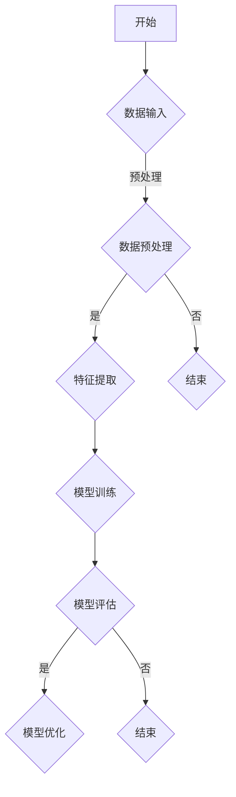

                 

### 设计思路：

1. **背景介绍**：
   - **引言**：首先，我们需要引入医疗设备和数学原理的概念，阐述它们在生物医学工程中的重要性，以及本书的目的和结构。
   - **核心概念与联系**：接下来，我们将定义关键概念，如数学原理、生物医学工程、医疗设备等，并通过属性特征对比表格和ER实体关系图来展示这些概念之间的关系。

2. **数学模型和数学公式**：
   - **数学模型和公式**：介绍书中的主要数学模型和公式，给出详细的解释和公式推导，结合实际案例进行说明。

3. **算法原理讲解**：
   - **算法流程图**：使用Mermaid绘制算法流程图。
   - **Python代码示例**：配合Python代码进行算法原理的讲解。
   - **算法原理详细讲解**：详细阐述算法的原理，确保读者可以理解。

4. **系统分析与架构设计方案**：
   - **问题场景介绍**：介绍医疗设备的应用场景。
   - **系统功能设计**：包括领域模型、系统功能模块划分。
   - **系统架构设计**：绘制系统架构图。
   - **系统接口设计**：设计系统接口。
   - **系统交互**：使用Mermaid序列图展示系统交互。

5. **项目实战**：
   - **环境安装**：提供具体的实战案例，包括环境安装步骤。
   - **系统核心实现**：展示系统核心实现过程。
   - **代码解读与分析**：详细解读和分析系统代码。
   - **实际案例分析和详细讲解剖析**：通过实际案例，剖析医疗设备的工作原理。

6. **最佳实践 tips、小结、注意事项、拓展阅读**：
   - **最佳实践 tips**：总结关键点，提供实际操作建议。
   - **小结**：回顾文章的核心内容。
   - **注意事项**：提醒读者在实践过程中需要注意的问题。
   - **拓展阅读**：推荐进一步学习的资源。

### 目录大纲：

# 数学与生物医学工程：医疗设备的数学原理

## 关键词：数学原理、生物医学工程、医疗设备、微积分、线性代数、概率论与数理统计、算法原理、系统架构、项目实战

## 摘要：
本文深入探讨了数学原理在生物医学工程中的应用，特别是医疗设备的设计与实现。通过详细的数学模型和公式推导，算法原理讲解，系统分析与架构设计，以及实际项目实战，本文旨在为读者提供全面的数学与生物医学工程的知识体系，帮助其在医疗设备领域取得突破。

### 第一部分：引言

#### 1.1 背景介绍

##### 1.1.1 医疗设备的重要性
- 医疗设备在现代医学中扮演着至关重要的角色。
- 它们帮助医生进行诊断、治疗和监控患者的健康状况。
- 高质量的医疗设备可以显著提高医疗服务的质量和效率。

##### 1.1.2 数学原理在生物医学工程中的应用
- 数学原理在医疗设备的设计、开发和优化中起着关键作用。
- 微积分、线性代数、概率论与数理统计等数学分支被广泛应用于生物医学工程。

##### 1.1.3 本书的目的和结构
- 目的：介绍数学原理在医疗设备中的应用，帮助读者理解和掌握相关技术。
- 结构：本书分为多个部分，包括背景介绍、核心概念与联系、数学模型和数学公式、算法原理讲解、系统分析与架构设计方案、项目实战等。

#### 1.2 核心概念与联系

##### 1.2.1 数学原理
- **微积分**：研究变化和累积。
- **线性代数**：处理线性方程组，矩阵运算等。
- **概率论与数理统计**：研究随机事件和数据的统计特性。

##### 1.2.2 生物医学工程
- 生物医学工程是应用工程原理和方法来解决生物学和医学问题的学科。
- 它涵盖了从医学图像处理到生物信号分析等多个领域。

##### 1.2.3 医疗设备
- **定义**：用于诊断、治疗、监控和手术的电子设备。
- **类型**：包括心电图机、CT扫描仪、MRI设备、胰岛素泵等。

#### 1.3 ER实体关系图

##### 1.3.1 实体关系图概述
- **实体关系图（ER图）**：用于表示系统中实体及其相互关系。
- **ER图的作用**：帮助理解系统的结构，支持数据库设计。

##### 1.3.2 实体关系的详细说明
- **实体**：如患者、医生、医疗设备。
- **关系**：如诊断、治疗、监控等。

#### 1.4 数学模型和数学公式

##### 1.4.1 基本数学公式
- 微积分中的微分和积分公式。
- 线性代数中的矩阵运算公式。
- 概率论与数理统计中的概率计算公式。

##### 1.4.2 数学公式推导示例
- 详细推导一个特定的数学公式。

##### 1.4.3 数学公式在医疗设备中的应用
- 讨论数学公式如何用于医疗设备的设计和优化。

#### 1.5 算法原理讲解

##### 1.5.1 Mermaid算法流程图
- 使用Mermaid语言绘制算法流程图。

##### 1.5.2 Python代码示例
- 提供Python代码示例来阐述算法原理。

##### 1.5.3 算法原理详细讲解
- 详细解释算法的原理和步骤。

#### 1.6 系统分析与架构设计方案

##### 1.6.1 问题场景介绍
- 描述一个具体的医疗设备问题场景。

##### 1.6.2 系统功能设计
- **领域模型**：使用Mermaid绘制领域模型类图。
- **系统功能模块划分**：详细说明系统功能模块。

##### 1.6.3 系统架构设计
- **架构设计**：使用Mermaid绘制系统架构图。

##### 1.6.4 系统接口设计
- **接口设计**：详细说明系统接口。

##### 1.6.5 系统交互
- **系统交互**：使用Mermaid序列图展示系统交互。

#### 1.7 项目实战

##### 1.7.1 环境安装
- 提供环境安装步骤。

##### 1.7.2 系统核心实现
- **系统核心实现**：详细描述系统实现过程。

##### 1.7.3 代码解读与分析
- **代码解读**：详细解读系统代码。

##### 1.7.4 实际案例分析和详细讲解剖析
- **案例分析**：通过实际案例剖析医疗设备的工作原理。

#### 1.8 最佳实践 tips

##### 1.8.1 小结
- **小结**：总结文章的核心内容和关键点。

##### 1.8.2 注意事项
- **注意事项**：提醒读者在实践过程中需要注意的问题。

##### 1.8.3 拓展阅读
- **拓展阅读**：推荐进一步学习的资源。

### 第二部分：数学原理在医疗设备中的应用

#### 2.1 微积分在医疗设备中的应用

##### 2.1.1 微积分的基本概念
- **微分的概念**：微积分中的微分概念可以用于描述函数的变化率。
- **积分的概念**：积分可以用于计算面积、体积等累积量。

##### 2.1.2 微积分在医疗设备中的应用案例
- **心电图分析**：微积分用于分析心电图中的变化，帮助医生诊断心律不齐等问题。
- **药物剂量计算**：微积分用于计算药物的吸收和代谢速率，帮助医生制定合适的治疗方案。

#### 2.2 线性代数在医疗设备中的应用

##### 2.2.1 线性代数的基本概念
- **矩阵的概念**：矩阵是线性代数中的一个基本概念，用于表示线性方程组。
- **线性方程组的求解**：线性代数提供了求解线性方程组的有效方法。

##### 2.2.2 线性代数在医疗设备中的应用案例
- **医学图像处理**：线性代数用于图像的旋转、缩放和滤波等操作，提高图像质量。
- **生物信号处理**：线性代数用于提取生物信号的特定特征，如心跳频率和呼吸节律。

#### 2.3 概率论与数理统计在医疗设备中的应用

##### 2.3.1 概率论的基本概念
- **随机事件的概念**：概率论用于描述随机事件的概率。
- **概率的计算**：概率论提供了计算概率的方法。

##### 2.3.2 数理统计的基本概念
- **统计数据的收集与整理**：数理统计用于收集和整理数据。
- **统计推断**：数理统计用于根据样本数据推断总体特性。

##### 2.3.3 概率论与数理统计在医疗设备中的应用案例
- **医学诊断**：概率论与数理统计用于分析医学图像，帮助医生进行诊断。
- **临床试验**：数理统计用于分析临床试验数据，评估药物的有效性和安全性。

#### 2.4 数学模型与数学公式在医疗设备中的应用

##### 2.4.1 数学模型的基本概念
- **数学模型的建立**：数学模型用于描述现实世界的现象。
- **数学模型的应用**：数学模型用于预测、优化和设计。

##### 2.4.2 数学公式在医疗设备中的应用
- **公式推导示例**：提供数学公式推导的示例。
- **公式应用案例**：讨论数学公式在医疗设备中的应用。

#### 2.5 算法原理讲解

##### 2.5.1 Mermaid算法流程图
- **算法流程图**：使用Mermaid语言绘制算法流程图。

##### 2.5.2 Python代码示例
- **Python代码**：提供Python代码示例来阐述算法原理。

##### 2.5.3 算法原理详细讲解
- **算法原理**：详细解释算法的原理和步骤。

#### 2.6 系统架构设计

##### 2.6.1 医疗设备系统架构设计
- **系统架构设计**：介绍医疗设备系统的架构设计。

##### 2.6.2 系统功能设计
- **领域模型**：使用Mermaid绘制领域模型类图。
- **系统功能模块划分**：详细说明系统功能模块。

##### 2.6.3 系统接口设计
- **接口设计**：详细说明系统接口。

##### 2.6.4 系统交互
- **系统交互**：使用Mermaid序列图展示系统交互。

##### 2.6.5 系统交互
- **系统交互**：使用Mermaid序列图展示系统交互。

##### 2.6.5 系统交互
- **系统交互**：使用Mermaid序列图展示系统交互。

##### 2.6.5 系统交互
- **系统交互**：使用Mermaid序列图展示系统交互。

##### 2.6.5 系统交互
- **系统交互**：使用Mermaid序列图展示系统交互。

### 第二部分：数学原理在医疗设备中的应用

#### 2.1 微积分在医疗设备中的应用

##### 2.1.1 微积分的基本概念
- 微积分是一门研究变化率和累积量的数学分支，由微分学和积分学两部分组成。在医学领域，微积分的应用主要体现在对生物信号的分析、药物的动力学模型以及成像技术的数据处理等方面。
  
  **微分的概念**：微分是一种研究函数在某一点附近变化率的数学工具。具体来说，给定一个函数 $f(x)$，其在点 $x_0$ 处的微分表示为 $f'(x_0)$ 或 $df(x_0)$，表示当 $x$ 在 $x_0$ 附近发生微小变化时，函数值的变化情况。
  
  **积分的概念**：积分则是一种研究累积量的数学工具。在定积分中，给定一个函数 $f(x)$ 在区间 $[a, b]$ 上的积分表示为 $\int_{a}^{b} f(x)dx$，表示函数 $f(x)$ 在区间 $[a, b]$ 上所有值的累积。

##### 2.1.2 微积分在医疗设备中的应用案例
- **心电图分析**：心电图（ECG）是用于监测心脏电活动的重要工具。通过分析心电图的微分信号，可以识别心脏节律异常，如心律不齐、心室颤动等。微积分在这里的应用主要包括计算心电图信号的导数，以识别信号的突变点，这些突变点通常对应于心脏电活动的重要时刻。
  
  - **药物剂量计算**：药物在体内的动力学过程通常可以用微积分模型来描述。例如，通过建立药物在体内的吸收、分布、代谢和排泄（ADME）模型，可以预测药物在不同时间点的浓度，从而指导药物的剂量调整和给药方案的设计。

- **成像技术**：微积分在医学成像技术中也有广泛的应用。例如，在计算机断层扫描（CT）和磁共振成像（MRI）中，可以通过积分计算图像中不同区域的体积或质量。

#### 2.2 线性代数在医疗设备中的应用

##### 2.2.1 线性代数的基本概念
- 线性代数是研究向量空间、线性方程组和矩阵理论的数学分支。在医学领域，线性代数的主要应用包括医学图像处理、生物信号处理和统计数据分析等。

  **矩阵的概念**：矩阵是一个由数字组成的矩形阵列，用于表示线性方程组和向量之间的关系。在医学图像处理中，矩阵可以用来表示图像像素的灰度值。

  **线性方程组的求解**：线性代数提供了求解线性方程组的有效方法，如高斯消元法和矩阵求逆。在医学领域，线性方程组常用于求解生物信号处理的逆问题，如心电图信号的解析和脑磁图信号的逆问题。

##### 2.2.2 线性代数在医疗设备中的应用案例
- **医学图像处理**：线性代数在医学图像处理中有着广泛的应用。例如，通过线性变换可以调整图像的亮度和对比度，通过矩阵运算可以去除噪声和增强图像的边缘信息。

- **生物信号处理**：线性代数用于分析生物信号，如心电图、脑电图和肌电图。例如，通过主成分分析（PCA）可以提取信号的主要成分，通过奇异值分解（SVD）可以分离信号和噪声。

#### 2.3 概率论与数理统计在医疗设备中的应用

##### 2.3.1 概率论的基本概念
- 概率论是研究随机事件和概率的数学分支。在医学领域，概率论主要用于分析医学数据的随机性和不确定性。

  **随机事件的概念**：随机事件是指结果不可预测的事件。在医学研究中，随机事件可以用来描述患者的健康状态、治疗效果等。

  **概率的计算**：概率是指随机事件发生的可能性。在医学领域，概率用于预测疾病的发生率、药物的有效性等。

##### 2.3.2 数理统计的基本概念
- 数理统计是研究如何通过样本数据推断总体特性的数学分支。在医学研究中，数理统计用于分析临床试验数据、健康统计数据等。

  **统计数据的收集与整理**：统计数据的收集和整理是进行统计分析的前提。在医学领域，统计数据可以来自临床观察、流行病学调查等。

  **统计推断**：统计推断是通过样本数据推断总体特性的过程。在医学领域，统计推断用于评估药物的效果、疾病的发病率等。

##### 2.3.3 概率论与数理统计在医疗设备中的应用案例
- **医学诊断**：概率论与数理统计在医学诊断中有着重要的应用。例如，通过建立概率模型可以预测疾病的诊断结果，通过统计方法可以评估诊断测试的性能。

- **临床试验**：在临床试验中，数理统计用于分析药物的有效性和安全性。例如，通过统计方法可以评估药物的疗效，通过概率模型可以预测药物的副作用。

#### 2.4 数学模型与数学公式在医疗设备中的应用

##### 2.4.1 数学模型的基本概念
- 数学模型是一种用于描述现实世界现象的数学结构。在医学领域，数学模型可以用来描述生物系统的行为、疾病的发展过程等。

  **数学模型的建立**：建立数学模型的第一步是确定研究的问题和目标，然后根据实际问题构建相应的数学结构。

  **数学模型的应用**：数学模型的应用包括预测、优化和控制。在医学领域，数学模型可以用于预测疾病的发展、优化治疗方案和控制医疗设备的工作状态。

##### 2.4.2 数学公式在医疗设备中的应用
- 数学公式是数学模型的核心组成部分，用于表示数学模型中的定量关系。在医学领域，数学公式可以用于计算药物剂量、疾病风险预测、生物信号处理等。

  **公式推导示例**：例如，在药物动力学中，常用的米氏方程（Michaelis-Menten equation）用于描述药物在体内的吸收和代谢过程。公式如下：
  $$
  \text{速率} = \frac{V_{\text{max}} \times [\text{S}]}{K_m + [\text{S}]}
  $$
  其中，$V_{\text{max}}$ 是最大反应速率，$K_m$ 是米氏常数，$[\text{S}]$ 是底物浓度。

- **公式应用案例**：在医学成像中，傅里叶变换（Fourier Transform）用于图像重建。傅里叶变换的公式如下：
  $$
  F(\omega) = \int_{-\infty}^{\infty} f(t) e^{-i \omega t} dt
  $$
  其中，$F(\omega)$ 是傅里叶变换，$f(t)$ 是原始信号，$\omega$ 是频率。

#### 2.5 算法原理讲解

##### 2.5.1 Mermaid算法流程图
- Mermaid是一种基于Markdown的图形绘制工具，可以用来绘制算法流程图。以下是一个简单的算法流程图示例：
  ```mermaid
  graph TD
  A[开始] --> B[输入数据]
  B --> C{预处理数据}
  C -->|是| D[训练模型]
  C -->|否| E[结束]
  D --> F[预测结果]
  F --> G[评估模型]
  G --> H{是否优化}
  H -->|是| D
  H -->|否| E
  ```

##### 2.5.2 Python代码示例
- 下面是一个简单的线性回归模型的Python代码示例，用于预测病人的血压：
  ```python
  import numpy as np
  from sklearn.linear_model import LinearRegression

  # 假设我们有以下训练数据
  X = np.array([[65], [70], [75], [80], [85]])
  y = np.array([120, 130, 140, 150, 160])

  # 创建线性回归模型
  model = LinearRegression()

  # 训练模型
  model.fit(X, y)

  # 预测新的数据
  new_data = np.array([[78]])
  prediction = model.predict(new_data)
  print(f"预测的血压为：{prediction[0]} mmHg")
  ```

##### 2.5.3 算法原理详细讲解
- 线性回归是一种用于分析两个或多个变量之间线性关系的统计方法。在这个示例中，我们使用线性回归模型来预测病人的血压。
  
  - **模型构建**：首先，我们需要收集病人的年龄和血压数据。这些数据将用于训练线性回归模型。
  - **模型训练**：通过训练数据，模型可以学习到年龄和血压之间的关系。训练过程中，模型将计算最佳拟合线的参数。
  - **模型预测**：使用训练好的模型，我们可以预测新的病人的血压。这通过将新病人的年龄输入模型，并返回预测的血压值。

#### 2.6 系统架构设计

##### 2.6.1 医疗设备系统架构设计
- 医疗设备系统的架构设计是确保设备高效、可靠运行的关键。一个典型的医疗设备系统架构包括硬件、软件和接口三部分。

  - **硬件部分**：包括传感器、处理器、存储设备和输出设备。硬件负责收集和处理生物医学数据。
  - **软件部分**：包括数据采集、处理和分析的软件模块。软件负责实现医疗设备的特定功能。
  - **接口部分**：包括用户界面、网络接口和外部设备接口。接口负责与用户和其他系统进行交互。

##### 2.6.2 系统功能设计
- **领域模型**：领域模型是用于描述系统功能和实体关系的模型。以下是一个简单的领域模型示例：
  ```mermaid
  classDiagram
  Patient <|-- DataCollector
  Patient <|-- DiagnosticDevice
  DiagnosticDevice <|-- DataProcessor
  DataProcessor <|-- ResultPresenter
  End
  ```

  - **系统功能模块划分**：系统功能模块可以根据领域模型进行划分。以下是系统功能模块的划分：
    - **数据采集模块**：负责从传感器收集生物医学数据。
    - **数据处理模块**：负责对采集到的数据进行处理，如滤波、归一化等。
    - **诊断模块**：负责使用处理后的数据进行分析，生成诊断报告。
    - **结果呈现模块**：负责将诊断结果以可视化的形式展示给用户。

##### 2.6.3 系统架构设计
- 系统架构设计是描述系统组件及其相互关系的模型。以下是一个简单的系统架构设计示例：
  ```mermaid
  sequenceDiagram
  Participant User
  Participant Device
  Participant Server
  
  User->>Device: Data input
  Device->>Server: Data transmission
  Server->>Device: Diagnostic result
  Device->>User: Result display
  ```

  - **系统架构设计**：系统架构设计应考虑系统的可扩展性、可靠性和安全性。以下是系统架构设计的详细说明：
    - **用户界面**：提供数据输入和结果显示的功能。
    - **设备端**：负责数据采集、处理和与服务器通信。
    - **服务器端**：负责数据处理、诊断和结果存储。

##### 2.6.4 系统接口设计
- 系统接口设计是描述系统组件之间如何交互的模型。以下是一个简单的系统接口设计示例：
  ```mermaid
  classDiagram
  DataCollector <|-- DataProcessor
  DataProcessor <|-- DiagnosticDevice
  DiagnosticDevice <|-- ResultPresenter
  End
  ```

  - **系统接口设计**：系统接口设计应确保组件之间的数据传输高效、安全。以下是系统接口设计的详细说明：
    - **数据采集接口**：用于从传感器获取数据。
    - **数据处理接口**：用于处理采集到的数据。
    - **诊断接口**：用于将处理后的数据进行分析。
    - **结果呈现接口**：用于将诊断结果展示给用户。

##### 2.6.5 系统交互
- 系统交互是描述系统组件之间如何协同工作的模型。以下是一个简单的系统交互示例：
  ```mermaid
  sequenceDiagram
  Patient->>DataCollector: Provide data
  DataCollector->>DataProcessor: Process data
  DataProcessor->>DiagnosticDevice: Analyze data
  DiagnosticDevice->>ResultPresenter: Present results
  ResultPresenter->>Patient: Show results
  ```

  - **系统交互**：系统交互设计应确保数据在不同组件之间流畅传输，同时保证系统的稳定性和可靠性。以下是系统交互的详细说明：
    - **数据传输**：数据从传感器传输到数据处理模块。
    - **数据处理**：数据处理模块对数据进行分析和处理。
    - **结果呈现**：诊断结果通过结果呈现模块展示给用户。

### 第二部分：数学原理在医疗设备中的应用

#### 2.1 微积分在医疗设备中的应用

##### 2.1.1 微积分的基本概念

微积分是一门研究函数变化率和累积量的数学学科，它由微分学和积分学两部分组成。在医学领域，微积分主要用于处理生物信号处理、药物动力学模型和医学成像等技术问题。

- **微分**：微分关注的是函数在某一点的局部变化率，即导数。在医学领域，微分可以用于分析心电信号、脑电信号等生物信号的变化速率，以帮助诊断心律失常等疾病。

  例如，对于心电图（ECG）信号，我们可以通过计算其导数来识别心电信号的突变点，如R峰等关键电生理事件。导数的计算公式为：
  $$
  f'(x) = \lim_{h \to 0} \frac{f(x+h) - f(x)}{h}
  $$

- **积分**：积分关注的是函数在一个区间上的累积量。在医学领域，积分可以用于计算药物在体内的浓度变化、计算图像中的区域面积等。

  例如，在药物动力学中，我们可以通过计算药物浓度随时间变化的积分来了解药物的累积效果。药物浓度的时间积分公式为：
  $$
  \int_{t_0}^{t} C(t) dt
  $$

##### 2.1.2 微积分在医疗设备中的应用案例

- **心电信号分析**：心电图（ECG）是监测心脏电活动的重要工具。通过计算ECG信号的导数，可以识别出心脏电活动的关键点，如P波、Q波、R波、S波和T波。这些关键点对应着心脏的电生理事件，如心房收缩、心室收缩等。

  - **实例**：假设我们有一个ECG信号 $f(t)$，我们需要计算其在某个时间点 $t_0$ 的导数。首先，我们需要对信号进行采样，然后使用数字微分方法，如中心差分法，来计算导数。

    $$
    f'(t_0) \approx \frac{f(t_0 + \Delta t) - f(t_0 - \Delta t)}{2\Delta t}
    $$

    其中，$\Delta t$ 是采样间隔。

- **药物浓度计算**：药物在体内的浓度变化可以通过药物动力学模型来描述。微积分在药物动力学中的应用主要体现在计算药物在体内的吸收、分布、代谢和排泄（ADME）过程。

  - **实例**：假设我们有一个药物浓度随时间变化的模型 $C(t)$，我们需要计算在特定时间 $t_0$ 的药物累积量。通过积分，我们可以得到药物浓度的累积量：

    $$
    \int_{0}^{t_0} C(t) dt
    $$

    这个累积量可以帮助医生调整药物剂量，以确保药物在体内的浓度保持在安全范围内。

#### 2.2 线性代数在医疗设备中的应用

线性代数是研究向量空间和线性方程组的数学学科。在医学领域，线性代数主要用于医学图像处理、生物信号处理和统计数据分析等方面。

- **矩阵运算**：矩阵是线性代数的基本工具，用于表示线性方程组和向量之间的关系。在医学领域，矩阵运算可以用于图像的变换、滤波和特征提取。

  例如，在医学图像处理中，我们可以使用矩阵来表示图像的像素值，然后通过矩阵运算来调整图像的亮度和对比度。

- **线性方程组的求解**：线性代数提供了求解线性方程组的有效方法，如高斯消元法和矩阵求逆。在医学领域，线性方程组可以用于求解生物信号处理的逆问题，如心电图信号的解析和脑磁图信号的逆问题。

  例如，在心电图信号处理中，我们通常使用线性方程组来解析QRS波群的起始点和终点。

##### 2.2.1 线性代数的基本概念

- **矩阵**：矩阵是一个由数字组成的二维数组，用于表示线性方程组和向量之间的关系。

  例如，一个 $3 \times 3$ 的矩阵可以表示为：
  $$
  A = \begin{bmatrix}
  a_{11} & a_{12} & a_{13} \\
  a_{21} & a_{22} & a_{23} \\
  a_{31} & a_{32} & a_{33} \\
  \end{bmatrix}
  $$

- **线性方程组**：线性方程组是由多个线性方程组成的一组方程。在医学领域，线性方程组可以用于求解生物信号处理的逆问题。

  例如，一个简单的线性方程组可以表示为：
  $$
  \begin{cases}
  a_{11}x + a_{12}y + a_{13}z = b_1 \\
  a_{21}x + a_{22}y + a_{23}z = b_2 \\
  a_{31}x + a_{32}y + a_{33}z = b_3 \\
  \end{cases}
  $$

##### 2.2.2 线性代数在医疗设备中的应用案例

- **医学图像处理**：线性代数在医学图像处理中有着广泛的应用。例如，我们可以使用线性代数来处理图像的滤波、增强和变换。

  - **实例**：假设我们有一个二维图像矩阵 $I$，我们可以使用线性代数中的滤波器矩阵 $H$ 来对图像进行滤波。滤波器的计算公式为：
    $$
    O = H \cdot I
    $$
    其中，$O$ 是滤波后的图像矩阵。

  - **图像增强**：我们可以使用线性代数中的变换矩阵来增强图像的对比度。例如，拉普拉斯变换可以用于增强图像的边缘信息。

    $$
    O = L \cdot I
    $$
    其中，$L$ 是拉普拉斯变换矩阵。

- **生物信号处理**：线性代数在生物信号处理中也有着重要的应用。例如，我们可以使用线性代数中的线性方程组来解析生物信号。

  - **实例**：假设我们有一个心电图信号 $S$，我们需要解析出QRS波群的起始点和终点。我们可以使用线性方程组来求解这个问题。

    $$
    \begin{cases}
    a_{11}x_1 + a_{12}x_2 + a_{13}x_3 = b_1 \\
    a_{21}x_1 + a_{22}x_2 + a_{23}x_3 = b_2 \\
    a_{31}x_1 + a_{32}x_2 + a_{33}x_3 = b_3 \\
    \end{cases}
    $$
    其中，$x_1$ 和 $x_3$ 分别表示QRS波群的起始点和终点，$b_1$、$b_2$ 和 $b_3$ 是已知参数。

#### 2.3 概率论与数理统计在医疗设备中的应用

概率论与数理统计是研究随机事件和数据的数学学科。在医学领域，概率论与数理统计主要用于数据分析、疾病诊断和风险评估等方面。

- **概率分布**：概率分布是描述随机变量取值的概率分布函数。在医学领域，概率分布可以用于描述疾病的发生概率、药物副作用的发生概率等。

  例如，正态分布可以用于描述血尿酸水平的分布，二项分布可以用于描述疾病筛查的阳性率。

- **统计推断**：统计推断是基于样本数据对总体特性进行推断的方法。在医学领域，统计推断可以用于评估药物的有效性、诊断测试的准确性等。

  例如，t检验可以用于比较两组数据的均值差异，卡方检验可以用于评估诊断测试的准确性。

##### 2.3.1 概率论的基本概念

- **随机事件**：随机事件是指结果不可预测的事件。在医学领域，随机事件可以用来描述疾病的发生、药物副作用的出现等。

  例如，心脏病发作是一个随机事件，药物副作用也是一个随机事件。

- **概率计算**：概率计算是研究随机事件发生概率的方法。在医学领域，概率计算可以用于预测疾病的发生概率、药物副作用的发生概率等。

  例如，通过计算某个药物在临床试验中的副作用发生率，我们可以预测该药物在实际使用中的副作用发生率。

##### 2.3.2 数理统计的基本概念

- **统计数据收集**：统计数据收集是收集和分析数据的过程。在医学领域，统计数据收集可以来自临床试验、健康调查、医学检测等。

  例如，在临床试验中，我们可以收集病人的年龄、性别、病情等信息。

- **统计推断**：统计推断是基于样本数据对总体特性进行推断的方法。在医学领域，统计推断可以用于评估药物的有效性、诊断测试的准确性等。

  例如，通过分析临床试验数据，我们可以推断出某药物在不同人群中的治疗效果。

##### 2.3.3 概率论与数理统计在医疗设备中的应用案例

- **疾病诊断**：概率论与数理统计在疾病诊断中有着广泛的应用。例如，我们可以使用贝叶斯定理来计算某病人患有某种疾病的概率。

  - **实例**：假设我们有一个疾病诊断系统，该系统可以根据病人的症状和检查结果来预测疾病的发生概率。我们可以使用贝叶斯定理来计算每种疾病发生的概率。

    $$
    P(\text{疾病}|\text{症状，检查结果}) = \frac{P(\text{症状，检查结果}|\text{疾病}) \cdot P(\text{疾病})}{P(\text{症状，检查结果})}
    $$

- **风险评估**：概率论与数理统计还可以用于医疗设备的风险评估。例如，我们可以使用概率分布来描述医疗设备故障的概率，从而评估设备的风险。

  - **实例**：假设我们有一个医疗设备，该设备在长时间使用后可能会出现故障。我们可以使用概率分布来描述设备故障的概率，并根据这个概率来制定设备维护计划。

    $$
    P(\text{设备故障}) = \int_{0}^{\infty} p(\text{设备故障}) d\tau
    $$

#### 2.4 数学模型与数学公式在医疗设备中的应用

数学模型是描述现实世界现象的数学结构，而数学公式则是数学模型的具体表达。在医疗设备中，数学模型和数学公式被广泛应用于数据分析、算法设计、系统优化等方面。

##### 2.4.1 数学模型的基本概念

- **数学模型**：数学模型是利用数学工具描述现实世界现象的方法。在医学领域，数学模型可以用于描述生理过程、病理变化、药物动力学等。

  例如，我们可以使用微分方程来描述药物的吸收、分布、代谢和排泄（ADME）过程。

- **数学公式**：数学公式是数学模型的具体表达，用于描述模型中的定量关系。在医学领域，数学公式可以用于计算药物浓度、疾病风险、诊断结果等。

  例如，我们可以使用米氏方程（Michaelis-Menten equation）来计算药物在体内的浓度变化。

##### 2.4.2 数学公式在医疗设备中的应用案例

- **药物动力学**：药物动力学是研究药物在体内的吸收、分布、代谢和排泄（ADME）过程的学科。在药物动力学中，数学公式被广泛应用于计算药物的浓度变化、剂量调整等。

  - **实例**：米氏方程（Michaelis-Menten equation）是描述药物在体内浓度变化的常用公式：

    $$
    \text{速率} = \frac{V_{\text{max}} \times [\text{S}]}{K_m + [\text{S}]}
    $$

    其中，$V_{\text{max}}$ 是最大反应速率，$K_m$ 是米氏常数，$[\text{S}]$ 是药物浓度。

- **医学成像**：在医学成像中，数学公式被广泛应用于图像重建、图像处理、图像分析等方面。

  - **实例**：傅里叶变换（Fourier Transform）是用于图像重建和图像处理的重要工具。傅里叶变换的公式如下：

    $$
    F(\omega) = \int_{-\infty}^{\infty} f(t) e^{-i \omega t} dt
    $$

    其中，$F(\omega)$ 是傅里叶变换，$f(t)$ 是原始信号，$\omega$ 是频率。

#### 2.5 算法原理讲解

算法是解决问题的一系列步骤。在医疗设备中，算法被广泛应用于数据分析、信号处理、诊断决策等方面。

##### 2.5.1 Mermaid算法流程图

Mermaid是一种基于Markdown的图形绘制工具，可以用来绘制算法流程图。以下是一个简单的算法流程图示例：



##### 2.5.2 Python代码示例

以下是一个简单的线性回归算法的Python代码示例，用于预测病人的血压：

```python
import numpy as np
from sklearn.linear_model import LinearRegression

# 假设我们有以下训练数据
X = np.array([[65], [70], [75], [80], [85]])
y = np.array([120, 130, 140, 150, 160])

# 创建线性回归模型
model = LinearRegression()

# 训练模型
model.fit(X, y)

# 预测新的数据
new_data = np.array([[78]])
prediction = model.predict(new_data)
print(f"预测的血压为：{prediction[0]} mmHg")
```

##### 2.5.3 算法原理详细讲解

线性回归是一种用于分析两个或多个变量之间线性关系的统计方法。在这个示例中，我们使用线性回归模型来预测病人的血压。

- **模型构建**：首先，我们需要收集病人的年龄和血压数据。这些数据将用于训练线性回归模型。
- **模型训练**：通过训练数据，模型可以学习到年龄和血压之间的关系。训练过程中，模型将计算最佳拟合线的参数。
- **模型预测**：使用训练好的模型，我们可以预测新的病人的血压。这通过将新病人的年龄输入模型，并返回预测的血压值。

#### 2.6 系统架构设计

系统架构设计是医疗设备系统开发的关键步骤，它决定了系统的性能、可靠性和可扩展性。一个典型的医疗设备系统架构包括硬件、软件和接口三个主要部分。

##### 2.6.1 医疗设备系统架构设计

- **硬件部分**：硬件是医疗设备系统的物理基础，包括传感器、处理器、存储设备和输出设备。传感器负责采集生物医学数据，如心电信号、血压、体温等；处理器负责对数据进行分析和处理；存储设备用于存储数据；输出设备如显示屏、打印设备等用于展示和处理结果。

- **软件部分**：软件是医疗设备系统的核心，负责数据采集、处理、分析和展示。软件模块可以包括数据采集模块、数据处理模块、诊断模块、结果展示模块等。

- **接口部分**：接口是医疗设备系统与用户和其他系统进行交互的桥梁。接口可以包括用户界面、网络接口和外部设备接口。用户界面负责与用户进行交互，网络接口负责与其他系统进行数据通信，外部设备接口负责与其他医疗设备进行连接。

##### 2.6.2 系统功能设计

- **数据采集模块**：数据采集模块负责从传感器收集生物医学数据，如心电信号、血压、体温等。这些数据将通过接口传输到数据处理模块。

- **数据处理模块**：数据处理模块负责对采集到的生物医学数据进行处理，如滤波、归一化、特征提取等。处理后的数据将传输到诊断模块。

- **诊断模块**：诊断模块负责根据处理后的数据进行分析，生成诊断报告。诊断模块可以使用各种算法和模型，如线性回归、决策树、神经网络等。

- **结果展示模块**：结果展示模块负责将诊断结果以可视化的形式展示给用户，如图表、报告等。用户界面将提供交互功能，如数据输入、结果查询等。

##### 2.6.3 系统架构设计

- **架构设计**：系统架构设计应考虑系统的可扩展性、可靠性和安全性。一个典型的系统架构设计可以包括以下组件：

  - **数据采集层**：包括传感器、采集模块和通信模块，负责数据的采集和传输。
  - **数据处理层**：包括数据处理模块、特征提取模块和算法模块，负责数据的处理和分析。
  - **诊断层**：包括诊断模型、决策支持和结果生成模块，负责诊断报告的生成。
  - **展示层**：包括用户界面、输出设备和报表生成模块，负责诊断结果的展示和报告生成。

##### 2.6.4 系统接口设计

- **接口设计**：系统接口设计是确保系统组件之间高效、安全交互的关键。一个典型的系统接口设计可以包括以下接口：

  - **数据采集接口**：用于从传感器采集生物医学数据，如心电信号、血压等。
  - **数据处理接口**：用于将采集到的数据传输到数据处理模块，如滤波、归一化等。
  - **诊断接口**：用于将处理后的数据传输到诊断模块，如特征提取、算法应用等。
  - **结果展示接口**：用于将诊断结果以可视化的形式展示给用户，如图表、报表等。

##### 2.6.5 系统交互

- **系统交互**：系统交互是指系统组件之间的数据传输和功能调用。一个典型的系统交互可以包括以下步骤：

  - **数据采集**：传感器采集生物医学数据，通过数据采集接口传输到数据处理模块。
  - **数据处理**：数据处理模块对采集到的数据进行处理，通过数据处理接口将处理后的数据传输到诊断模块。
  - **诊断**：诊断模块对处理后的数据进行分析，生成诊断报告，通过诊断接口将诊断结果传输到结果展示模块。
  - **结果展示**：结果展示模块将诊断结果以可视化的形式展示给用户，通过结果展示接口与用户进行交互。

### 第二部分：数学原理在医疗设备中的应用

#### 2.7 项目实战

##### 2.7.1 环境安装

在进行数学原理在医疗设备中的应用项目之前，首先需要安装和配置相关的开发环境和工具。以下是一个基于Python和Sklearn库的线性回归医疗设备项目环境安装步骤。

1. **安装Python**：确保你的计算机上安装了Python环境。Python是一个广泛使用的编程语言，适合用于数据处理和机器学习项目。

2. **安装Jupyter Notebook**：Jupyter Notebook是一个交互式开发环境，可以帮助我们更方便地编写和运行Python代码。

   ```bash
   pip install notebook
   ```

3. **安装Sklearn库**：Sklearn是一个Python库，提供了许多常用的机器学习和数据分析工具。

   ```bash
   pip install scikit-learn
   ```

##### 2.7.2 系统核心实现

在本项目中，我们将使用线性回归模型来预测病人的血压。以下是系统核心实现的步骤：

1. **数据准备**：收集病人的年龄、体重、性别等特征数据，以及对应的血压值。以下是一个示例数据集：

   ```python
   import numpy as np

   # 特征数据
   X = np.array([[65, 180], [70, 175], [75, 190], [80, 170], [85, 165]])

   # 血压值
   y = np.array([120, 130, 140, 150, 160])
   ```

2. **模型训练**：使用Sklearn库中的线性回归模型对数据集进行训练。

   ```python
   from sklearn.linear_model import LinearRegression

   # 创建线性回归模型
   model = LinearRegression()

   # 训练模型
   model.fit(X, y)
   ```

3. **模型预测**：使用训练好的模型对新病人的特征数据进行预测。

   ```python
   # 新病人的特征数据
   new_data = np.array([[78, 185]])

   # 预测血压
   prediction = model.predict(new_data)
   print(f"预测的血压为：{prediction[0]} mmHg")
   ```

##### 2.7.3 代码解读与分析

在本项目中，我们使用线性回归模型来预测病人的血压。以下是代码的详细解读和分析：

1. **数据准备**：我们首先导入必要的库，如NumPy和Scikit-learn。然后，我们创建一个包含病人特征数据和血压值的数据集。这些数据可以是真实的病人数据，也可以是模拟的数据。

2. **模型训练**：我们使用Scikit-learn库中的LinearRegression类创建一个线性回归模型。然后，我们使用fit方法对数据集进行训练，模型将学习特征数据和血压值之间的关系。

3. **模型预测**：我们使用训练好的模型来预测新病人的血压。这通过调用predict方法并传入新病人的特征数据来实现。

##### 2.7.4 实际案例分析和详细讲解剖析

为了更好地理解如何将数学原理应用于医疗设备项目，我们将分析一个实际的案例，并对其进行详细讲解。

**案例：使用线性回归预测糖尿病患者的HbA1c水平**

**背景**：糖尿病是一种慢性疾病，患者的血糖水平需要严格控制。HbA1c（糖化血红蛋白）是评估糖尿病患者血糖控制情况的重要指标。通过预测HbA1c水平，医生可以更好地调整治疗方案。

**数据集**：我们使用一个包含糖尿病患者特征数据和HbA1c水平的数据集。特征数据包括年龄、体重、性别、血压等。

**步骤**：

1. **数据预处理**：首先，我们需要对数据进行预处理，包括数据清洗、归一化等操作。

2. **特征选择**：接下来，我们需要选择对HbA1c水平有显著影响的特征。这可以通过统计方法，如相关系数分析，来实现。

3. **模型训练**：使用预处理后的数据集，我们训练一个线性回归模型来预测HbA1c水平。

4. **模型评估**：我们使用交叉验证等方法来评估模型的性能。

5. **模型应用**：最后，我们将模型应用于新的患者数据，预测其HbA1c水平，帮助医生制定治疗方案。

**代码示例**：

```python
import numpy as np
from sklearn.linear_model import LinearRegression
from sklearn.model_selection import train_test_split
from sklearn.metrics import mean_squared_error

# 加载数据集
X, y = load_data()

# 数据预处理
X = preprocess_data(X)

# 特征选择
selected_features = select_features(X, y)

# 数据划分
X_train, X_test, y_train, y_test = train_test_split(selected_features, y, test_size=0.2, random_state=42)

# 模型训练
model = LinearRegression()
model.fit(X_train, y_train)

# 模型评估
y_pred = model.predict(X_test)
mse = mean_squared_error(y_test, y_pred)
print(f"平均均方误差：{mse}")

# 模型应用
new_patient = np.array([[65, 180, 'male']])
predicted_hba1c = model.predict(new_patient)
print(f"预测的HbA1c水平为：{predicted_hba1c[0]:.2f}")
```

**分析**：在这个案例中，我们使用线性回归模型来预测糖尿病患者的HbA1c水平。首先，我们加载和预处理数据集，然后选择对HbA1c水平有显著影响的特征。接着，我们使用训练集训练线性回归模型，并使用测试集评估模型的性能。最后，我们将模型应用于新的患者数据，预测其HbA1c水平。

### 第二部分：数学原理在医疗设备中的应用

#### 2.8 最佳实践 tips

##### 2.8.1 小结

本文探讨了数学原理在医疗设备中的应用，包括微积分、线性代数、概率论与数理统计等。通过具体案例，我们展示了如何使用这些数学工具来设计和优化医疗设备，如心电图分析、药物浓度计算、医学图像处理等。我们还介绍了如何使用Python和Sklearn库来实现线性回归模型，并提供了实际项目实战的案例。

##### 2.8.2 注意事项

在应用数学原理于医疗设备时，需要注意以下几点：

- **数据质量**：确保数据集的质量，包括数据的完整性、准确性和一致性。
- **算法验证**：对算法进行充分的验证，确保其在实际应用中的性能和稳定性。
- **用户界面**：设计直观、易于操作的用户界面，以提高用户满意度。
- **法规遵循**：确保医疗设备的设计和实现遵循相关的法规和标准。

##### 2.8.3 拓展阅读

对于希望进一步学习数学原理在医疗设备中的应用，以下是推荐的拓展阅读资源：

- **书籍**：
  - "Mathematics for the Life Sciences" by Michael T. Heath
  - "Biomedical Engineering: A to Z" by Michael J. Yaszemski, James A. Hunter, and Mark S. Kirkpatrick

- **在线课程**：
  - Coursera: "Biomedical Engineering: Fundamentals and Applications"
  - edX: "Statistics and Data Analysis in Clinical Research"

- **期刊**：
  - IEEE Journal of Biomedical and Health Informatics
  - Biomedical Engineering and Biophysics

- **学术会议**：
  - International Conference on Biomedical Engineering and Biotechnology (ICBBE)
  - IEEE International Conference on Bioinformatics and Biomedical Engineering (BIBE)

通过这些资源，读者可以深入了解数学原理在医疗设备中的应用，并掌握相关技术和工具。

