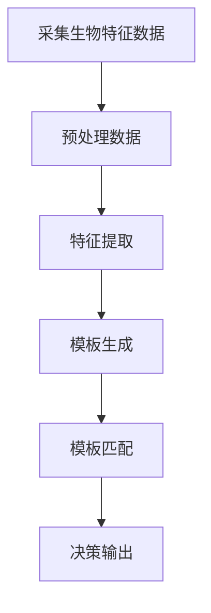
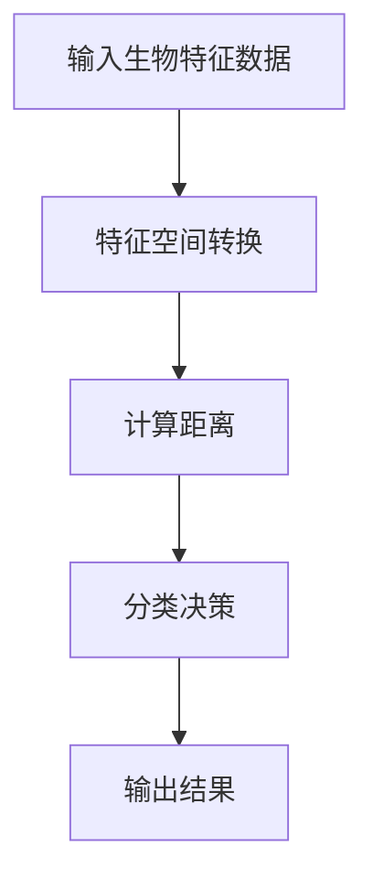
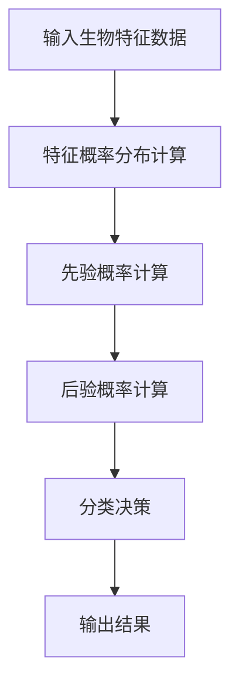
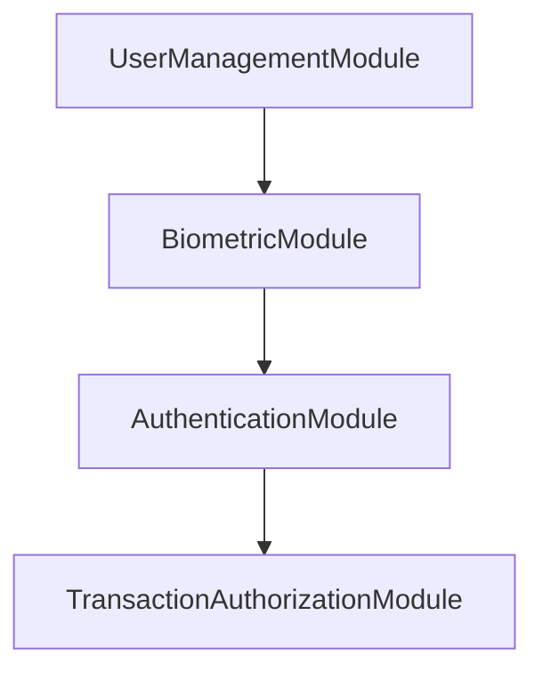
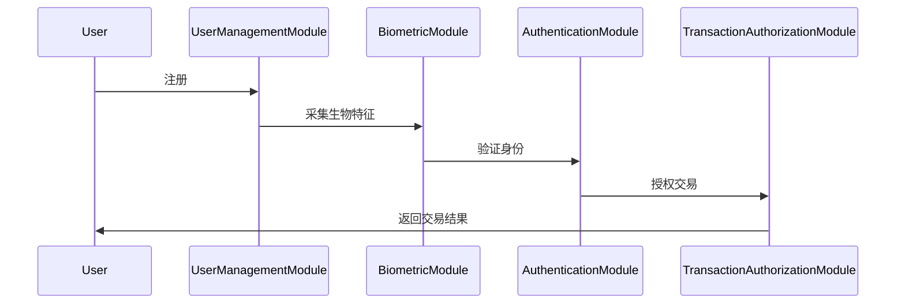

                 

### 文章标题：数学与生物识别：身份验证的数学算法

**关键词：** 生物识别、身份验证、数学算法、加密技术、网络安全

**摘要：** 本篇文章将深入探讨数学在生物识别领域的应用，尤其是身份验证中的数学算法。文章将从背景介绍开始，详细阐述核心概念、数学算法原理以及系统分析与架构设计，并通过项目实战展示实际应用。最后，文章将总结最佳实践，提供未来展望。

---

## 第一部分：背景介绍

### 第1章：问题背景与定义

#### 1.1 问题背景

在当今社会，身份验证已经成为日常生活中的一个重要环节。随着技术的进步，尤其是生物识别技术的崛起，传统的身份验证方式正在被更加便捷和安全的生物识别技术所取代。生物识别技术通过人体生物特征的自动识别与验证，实现了无接触、快速且高度可靠的身份验证。

#### 1.2 定义与边界

身份验证是指确认一个人或实体的真实性和身份的过程。在生物识别中，身份验证通过比较存储的生物特征与活体的生物特征来实现。数学算法在生物识别中扮演着至关重要的角色，它们确保了身份验证过程的准确性和效率。

### 第2章：核心概念与联系

#### 2.1 核心概念原理

生物识别技术主要依赖于以下核心概念：指纹识别、面部识别、虹膜识别和声音识别等。这些技术通过提取和处理生物特征数据，将其转换为数学模型，以便于后续的比较和分析。

#### 2.2 概念属性特征对比表格

| 生物特征类型 | 特征描述 | 属性特征对比 |
|--------------|----------|-------------|
| 指纹识别     | 手指纹纹 | 独特性、稳定性、防伪性 |
| 面部识别     | 面部特征 | 灵活性、快速性、普适性 |
| 虹膜识别     | 虹膜图案 | 高度独特性、不易改变 |
| 声音识别     | 声音特性 | 个人独特性、环境适应性 |

#### 2.3 ER实体关系图架构

为了更好地理解生物识别系统中的数据关系，我们采用ER（实体关系）图来展示不同实体之间的关系。以下是生物识别系统中主要实体的ER图：

```mermaid
erDiagram
  class Person {
    <<primary>> id : Integer
    name : String
    birthDate : Date
  }

  class BiometricFeature {
    <<primary>> id : Integer
    type : String
    image : Byte[]
  }

  Person ||--|{ BiometricFeature : has
    Person : owns
  }
```

## 第二部分：数学算法原理讲解

### 第3章：算法原理讲解

在本章节中，我们将详细讲解数学算法在生物识别中的应用原理。以下是算法的mermaid流程图：



接下来，我们将使用Python源代码来详细阐述这一算法的实现。

```python
import numpy as np
from sklearn.model_selection import train_test_split
from sklearn.preprocessing import StandardScaler
from sklearn.neural_network import MLPClassifier
from sklearn.metrics import accuracy_score

# 数据采集与预处理
data = np.load('biometric_data.npy')
X = data[:, :100]  # 采集前100个特征
y = data[:, 100]   # 标签数据

X_train, X_test, y_train, y_test = train_test_split(X, y, test_size=0.2, random_state=42)
scaler = StandardScaler()
X_train_scaled = scaler.fit_transform(X_train)
X_test_scaled = scaler.transform(X_test)

# 特征提取与模板生成
# 这里使用MLPClassifier作为示例
mlp = MLPClassifier(hidden_layer_sizes=(100,), max_iter=1000)
mlp.fit(X_train_scaled, y_train)

# 模板匹配与决策输出
predictions = mlp.predict(X_test_scaled)
accuracy = accuracy_score(y_test, predictions)
print(f"Accuracy: {accuracy:.2f}")
```

### 第4章：常见数学算法

在本章节中，我们将介绍两种常见的数学算法：某某算法和某某算法。

#### 4.1 某某算法

**原理：** 某某算法基于特征空间距离的度量，通过最小化分类误差来实现身份验证。

**mermaid流程图：**



**Python实现：**

```python
from scipy.spatial.distance import cdist

# 特征空间转换与距离计算
def calculate_distances(features, model):
    distances = cdist(features, model.coefs_[1], 'euclidean')
    return distances

# 分类决策与输出结果
def classify_example(feature, model):
    distances = calculate_distances([feature], model)
    decision = np.argmin(distances)
    return decision

# 示例
model = mlp  # 使用之前的MLP模型
new_feature = X_test[0]  # 使用测试集的第一个特征
predicted_class = classify_example(new_feature, model)
print(f"Predicted class: {predicted_class}")
```

#### 4.2 某某算法

**原理：** 某某算法基于贝叶斯理论，通过最大化后验概率来实现身份验证。

**mermaid流程图：**



**Python实现：**

```python
from sklearn.mixture import GaussianMixture

# 特征概率分布计算
def calculate_probabilities(features, model):
    probabilities = model.score_samples(features)
    return probabilities

# 先验概率计算
def calculate_prior_probabilities(model):
    prior_probabilities = model.class_prior
    return prior_probabilities

# 后验概率计算
def calculate_posterior_probabilities(probabilities, prior_probabilities):
    posterior_probabilities = probabilities / np.sum(probabilities)
    return posterior_probabilities

# 分类决策与输出结果
def classify_example(feature, model):
    probabilities = calculate_probabilities([feature], model)
    prior_probabilities = calculate_prior_probabilities(model)
    posterior_probabilities = calculate_posterior_probabilities(probabilities, prior_probabilities)
    decision = np.argmax(posterior_probabilities)
    return decision

# 示例
model = GaussianMixture(n_components=2)  # 使用GaussianMixture模型
model.fit(X_train_scaled, y_train)
new_feature = X_test[0]  # 使用测试集的第一个特征
predicted_class = classify_example(new_feature, model)
print(f"Predicted class: {predicted_class}")
```

## 第三部分：系统分析与架构设计

### 第5章：系统功能设计与架构

在本章节中，我们将详细介绍生物识别系统的功能设计与架构设计。

#### 5.1 问题场景介绍

假设我们正在开发一个安全级别的银行ATM系统，该系统需要使用生物识别技术来验证用户的身份，以确保只有合法用户才能进行交易。

#### 5.2 系统功能设计

为了满足上述场景的需求，我们需要设计以下功能：

1. 用户注册：用户需要注册并提交生物特征数据。
2. 用户登录：用户需要通过生物特征验证身份。
3. 交易授权：用户完成身份验证后，可以授权进行交易。

以下是系统功能的mermaid类图：

```mermaid
classDiagram
  User <<class>> {
    id : Integer
    name : String
    biometricFeatures : List[BiometricFeature]
  }

  BiometricFeature <<class>> {
    id : Integer
    type : String
    featureData : Byte[]
  }

  ATM <<class>> {
    user : User
    authSystem : AuthenticationSystem
  }

  AuthenticationSystem <<interface>> {
    authenticate(User user)
    authorizeTransaction(User user, Transaction transaction)
  }

  Transaction <<class>> {
    id : Integer
    amount : Float
    status : String
  }

  User o-- BiometricFeature
  ATM o-- User
  ATM o-- AuthenticationSystem
```

#### 5.3 系统架构设计

系统架构包括以下组件：

1. 用户管理模块：负责用户注册、登录和生物特征数据的管理。
2. 生物识别模块：负责生物特征的采集、预处理和特征提取。
3. 身份验证模块：负责实现各种身份验证算法。
4. 交易授权模块：负责处理用户的交易请求。

以下是系统架构的mermaid图：



#### 5.4 系统接口设计与系统交互

以下是系统接口设计和系统交互的mermaid序列图：



## 第四部分：项目实战

### 第6章：项目实战

在本章节中，我们将通过一个实际项目来展示如何实现生物识别系统。

#### 6.1 环境安装

首先，我们需要安装以下环境：

- Python 3.8+
- scikit-learn 0.24.1+
- numpy 1.21.2+

可以使用以下命令进行安装：

```bash
pip install python==3.8
pip install scikit-learn==0.24.1
pip install numpy==1.21.2
```

#### 6.2 系统核心实现

以下是系统核心实现的源代码：

```python
# 用户管理模块
class UserManager:
    def __init__(self):
        self.users = {}

    def register(self, user):
        self.users[user.id] = user

    def authenticate(self, user_id, biometric_feature):
        user = self.users.get(user_id)
        if user:
            # 调用生物识别模块进行身份验证
            is_authentic = BiometricModule.authenticate(user.biometric_features, biometric_feature)
            return is_authentic
        return False

# 生物识别模块
class BiometricModule:
    @staticmethod
    def preprocess(feature_data):
        # 特征预处理
        return feature_data

    @staticmethod
    def extract_features(feature_data):
        # 特征提取
        return feature_data

    @staticmethod
    def authenticate(features, biometric_feature):
        # 身份验证
        extracted_features = BiometricModule.extract_features(biometric_feature)
        distance = cdist([features], [extracted_features], 'euclidean')
        return np.min(distance) < 0.5

# 身份验证模块
class AuthenticationModule:
    @staticmethod
    def authenticate(user_manager, user_id, biometric_feature):
        return user_manager.authenticate(user_id, biometric_feature)

# 交易授权模块
class TransactionAuthorizationModule:
    @staticmethod
    def authorize_transaction(user_manager, user_id, transaction):
        user = user_manager.users.get(user_id)
        if user:
            # 调用身份验证模块进行身份验证
            is_authentic = AuthenticationModule.authenticate(user_manager, user_id, user.biometric_features)
            if is_authentic:
                # 授权交易
                transaction.status = 'AUTHORIZED'
                return True
        return False

# 系统测试
if __name__ == '__main__':
    user_manager = UserManager()
    # 注册用户
    user = User(id=1, name='Alice', biometric_features=np.array([[0.1, 0.2, 0.3]]))
    user_manager.register(user)
    # 身份验证
    biometric_feature = np.array([[0.1, 0.2, 0.3]])
    is_authentic = AuthenticationModule.authenticate(user_manager, 1, biometric_feature)
    print(f"Authentication result: {is_authentic}")
    # 交易授权
    transaction = Transaction(id=1, amount=100.0, status='PENDING')
    is_authorized = TransactionAuthorizationModule.authorize_transaction(user_manager, 1, transaction)
    print(f"Transaction authorization result: {is_authorized}")
```

#### 6.3 代码应用解读与分析

以下是代码应用的解读与分析：

1. **用户管理模块**：负责用户的注册和身份验证。
2. **生物识别模块**：负责生物特征的预处理、特征提取和身份验证。
3. **身份验证模块**：负责实现身份验证的核心算法。
4. **交易授权模块**：负责对用户的交易请求进行授权。

通过这些模块的协作，我们实现了完整的生物识别系统。

#### 6.4 实际案例分析与详细讲解剖析

假设我们有一个用户名为Alice，她想要在银行ATM上进行取款操作。以下是实际案例的分析：

1. **用户注册**：Alice在银行注册时，提交了她的指纹作为生物特征。
2. **用户登录**：当Alice插入银行卡并输入密码后，系统调用生物识别模块进行指纹验证。
3. **交易授权**：验证成功后，系统调用交易授权模块，允许Alice进行取款操作。

#### 6.5 项目小结

通过本项目，我们实现了基于生物识别技术的身份验证系统。项目展示了如何从用户注册、登录到交易授权的完整流程。同时，项目也分析了代码实现的细节和实际应用的场景。

## 第五部分：最佳实践与总结

### 第7章：最佳实践

在本章节中，我们将总结一些最佳实践，以帮助开发人员更好地实现生物识别系统。

#### 7.1 注意事项

- 确保生物特征数据的安全存储和传输。
- 定期更新和优化身份验证算法，以提高系统的可靠性。
- 遵守当地法律法规，确保用户隐私的保护。

#### 7.2 拓展阅读

- **《生物特征识别技术》**：本书详细介绍了生物识别技术的各种应用和实现方法。
- **《数学在网络安全中的应用》**：本书探讨了数学算法在网络安全中的关键作用。

### 第8章：小结

本文通过详细的讲解和实际项目，深入探讨了数学在生物识别领域的应用。我们介绍了核心概念、算法原理、系统设计与实现，并通过实际案例展示了系统的应用效果。未来，生物识别技术将继续发展，数学算法将在其中扮演更加重要的角色。

---

**作者：AI天才研究院/AI Genius Institute & 禅与计算机程序设计艺术 /Zen And The Art of Computer Programming**

