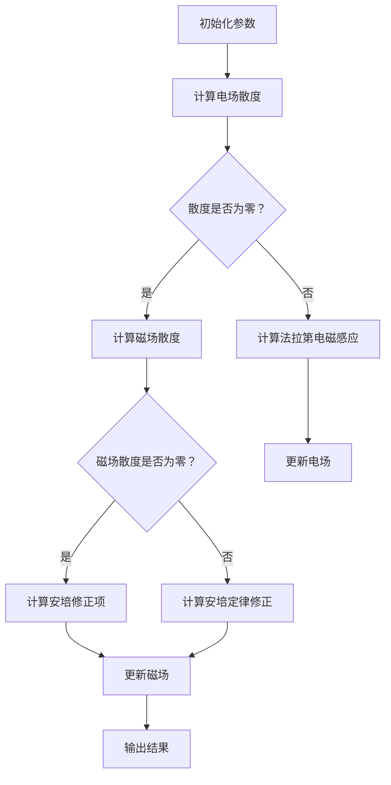
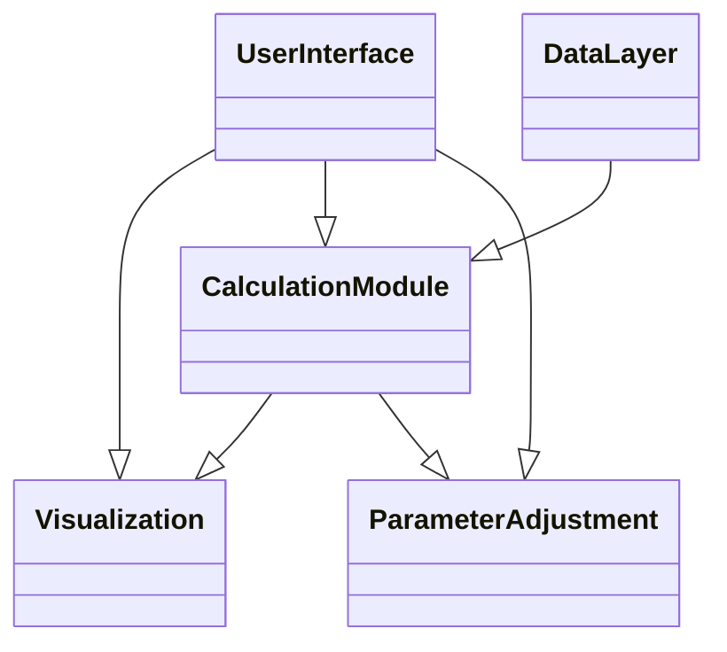
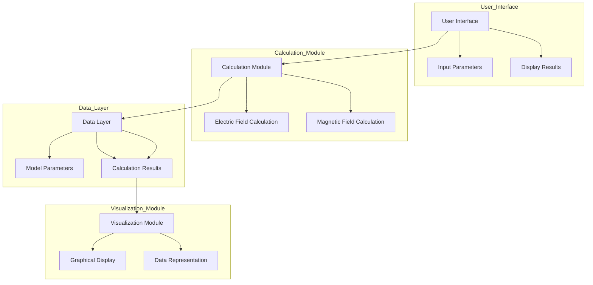

                 

### 背景介绍：数学与电磁学的关系

#### 问题背景

在科学技术日益发展的今天，数学与电磁学的关系变得越来越紧密。数学为电磁学的研究提供了强大的工具和方法，使得电磁现象能够被更准确地描述和理解。电磁学的发展反过来又为数学的应用提供了丰富的实例和挑战，推动了数学理论的创新。

#### 问题描述

电磁学是一门研究电和磁现象的物理学分支，它包括电磁场的产生、传播、作用和转化等多个方面。数学则为电磁学的研究提供了抽象的框架和精确的表达手段，例如微积分、线性代数和微分方程等。

#### 问题解决

数学的引入使得电磁现象的描述更加精确，能够通过数学模型来预测和解释物理现象。例如，麦克斯韦方程组就是用数学语言精确描述电磁场的基本方程。

#### 边界与外延

电磁学的研究不仅局限于宏观现象，还涉及到微观领域，如量子电动力学。同时，它在通信、电子、光学、医学等多个领域都有广泛的应用。

#### 概念结构与核心要素组成

电磁学的基本概念包括电荷、电场、磁场、电磁波等，而数学则为这些概念提供了数学模型和计算方法。核心要素包括：

- **电荷**：带电粒子的基本属性。
- **电场**：电荷周围存在的物理场，描述电荷对周围空间的影响。
- **磁场**：运动电荷或磁体周围存在的物理场。
- **电磁波**：电磁场在空间中的传播形式。

数学方面，核心要素包括：

- **微积分**：用于描述连续变化和微分方程。
- **线性代数**：用于处理多变量问题。
- **微分方程**：用于描述物理系统的动态行为。

#### 核心概念原理

- **电场强度**：描述电场对单位正电荷的作用力，用公式表示为 \( \mathbf{E} = \frac{\mathbf{F}}{q} \)。
- **磁场强度**：描述磁场对运动电荷的作用力，用公式表示为 \( \mathbf{B} = \frac{\mathbf{F}}{qv} \)。
- **电磁波**：描述电场和磁场相互垂直且相位相同的振动传播。

#### 概念属性特征对比表格

| 概念         | 定义                | 特征                           |
|--------------|---------------------|--------------------------------|
| 电荷         | 带电粒子的属性      | 正电荷和负电荷，量子化         |
| 电场         | 电荷周围的空间属性  | 有力作用，与距离平方反比       |
| 磁场         | 运动电荷或磁体的属性 | 对运动电荷有力的作用           |
| 电磁波       | 电场和磁场的振动传播 | 相位相同，传播速度为光速       |

#### ER实体关系图架构

```mermaid
erDiagram
  Charge ||--|{ ElectricField }|-- Charge
  ElectricField ||--|{ MagneticField }|-- ElectricField
  Charge ||--|{ Electron }|-- Charge
  Electron ||--|{ MagneticDipole }|-- Electron
```

通过上述内容，我们为《数学与电磁学：电磁场的数学表示》这本书的第一部分奠定了坚实的基础，为后续章节的详细阐述做好了准备。下一部分我们将深入探讨数学在电磁学研究中的应用。

### 核心概念与联系

在深入探讨数学与电磁学的关系时，首先需要了解电磁学中的核心概念，以及这些概念之间的内在联系。电磁学的基本概念包括电荷、电场、磁场、电磁波等，而这些概念不仅构成了电磁学研究的核心，也为我们理解和应用数学工具提供了基础。

#### 电荷

电荷是电磁学的起点，它表示物体带有的电性质。电荷分为正电荷和负电荷，它们之间的相互作用是电磁学研究的核心。电荷的性质可以用量子化来描述，即电荷只能以整数倍的电子电荷存在。电荷的基本单位是库仑（C）。

#### 电场

电场是电荷周围存在的一种物理场，描述电荷对周围空间的影响。电场强度 \( \mathbf{E} \) 是一个矢量，表示电场对单位正电荷的作用力。电场强度可以通过库仑定律来计算，其公式为：
$$
\mathbf{E} = \frac{1}{4\pi\epsilon_0} \frac{q}{r^2} \hat{r}
$$
其中，\( \epsilon_0 \) 是真空中的电常数，\( q \) 是电荷量，\( r \) 是电荷与观察点之间的距离，\( \hat{r} \) 是从电荷指向观察点的单位矢量。

#### 磁场

磁场是由运动电荷或磁体产生的物理场，对运动电荷有力的作用。磁场强度 \( \mathbf{B} \) 是一个矢量，描述磁场对单位正电荷的速度为 \( \mathbf{v} \) 的作用力。磁场强度可以通过比奥-萨伐尔定律来计算，其公式为：
$$
\mathbf{B} = \frac{\mu_0}{4\pi} \oint \frac{I d\mathbf{l} \times \hat{r}}{r^2}
$$
其中，\( \mu_0 \) 是真空中的磁常数，\( I \) 是电流，\( d\mathbf{l} \) 是电流元的长度矢量，\( \hat{r} \) 是从电流元指向观察点的单位矢量，\( r \) 是电流元到观察点的距离。

#### 电磁波

电磁波是电场和磁场相互垂直且相位相同的振动传播。电磁波的速度是光速 \( c \)，在真空中，其值约为 \( 3 \times 10^8 \) 米/秒。电磁波的波动方程可以表示为：
$$
\frac{\partial^2 \mathbf{E}}{\partial t^2} = \frac{1}{\epsilon_0 \mu_0} \nabla^2 \mathbf{E}
$$
$$
\frac{\partial^2 \mathbf{B}}{\partial t^2} = \frac{1}{\epsilon_0 \mu_0} \nabla^2 \mathbf{B}
$$
这两个方程组描述了电磁波在空间中的传播。

#### 概念属性特征对比表格

为了更清晰地理解这些核心概念，我们可以通过一个表格来对比它们的属性特征：

| 概念         | 定义                | 特征                           |
|--------------|---------------------|--------------------------------|
| 电荷         | 带电粒子的属性      | 正电荷和负电荷，量子化         |
| 电场         | 电荷周围的空间属性  | 有力作用，与距离平方反比       |
| 磁场         | 运动电荷或磁体的属性 | 对运动电荷有力的作用           |
| 电磁波       | 电场和磁场的振动传播 | 相位相同，传播速度为光速       |

#### ER实体关系图架构

下面是一个ER图，用于展示电荷、电场、磁场和电磁波之间的实体关系：

```mermaid
erDiagram
  Charge ||--|{ ElectricField }|-- Charge
  Charge ||--|{ MagneticField }|-- Charge
  ElectricField ||--|{ ElectromagneticWave }|-- ElectricField
  MagneticField ||--|{ ElectromagneticWave }|-- MagneticField
```

通过上述核心概念和联系的分析，我们能够更深入地理解数学与电磁学之间的关系。在接下来的部分，我们将进一步探讨数学工具在电磁学中的应用，如何通过数学模型来描述和解决电磁现象。

#### 算法原理讲解

在理解了电磁学中的核心概念后，接下来我们将探讨如何使用数学工具来描述和解决电磁现象。在这一部分，我们将通过一个具体的算法——麦克斯韦方程组，来详细阐述其原理和实现方法。

##### 麦克斯韦方程组

麦克斯韦方程组是一组描述电磁场分布和变化的基本方程。它们由詹姆斯·克拉克·麦克斯韦在19世纪提出，是电磁学理论的基础。麦克斯韦方程组包括以下四个方程：

1. **高斯定律（电场版）**：
$$
\nabla \cdot \mathbf{E} = \frac{\rho}{\epsilon_0}
$$
该方程描述了电场散度与电荷密度之间的关系。它表明，在任意一点，电场的散度（电场线的发散程度）等于该点的电荷密度除以真空中的电常数 \( \epsilon_0 \)。

2. **高斯定律（磁场版）**：
$$
\nabla \cdot \mathbf{B} = 0
$$
该方程表明，磁场线是闭合的，没有所谓的磁单极子。这意味着磁场线总是从磁体的北极出发，回到南极，并在内部形成闭合回路。

3. **法拉第电磁感应定律**：
$$
\nabla \times \mathbf{E} = -\frac{\partial \mathbf{B}}{\partial t}
$$
该方程描述了电场旋度与磁场时间变化率之间的关系。它表明，变化的磁场会在周围空间中产生电场，这是电磁感应的基本原理。

4. **安培定律（带麦克斯韦修正项）**：
$$
\nabla \times \mathbf{B} = \mu_0 \mathbf{J} + \mu_0 \epsilon_0 \frac{\partial \mathbf{E}}{\partial t}
$$
该方程描述了磁场旋度与电流密度以及电场时间变化率之间的关系。它表明，电流会在空间中产生磁场，而变化的电场也会影响磁场。

##### 算法流程图

为了更好地理解麦克斯韦方程组的实现过程，我们可以使用Mermaid画出算法的流程图：



##### Python实现

接下来，我们使用Python代码来具体实现麦克斯韦方程组的计算。以下是实现的代码示例：

```python
import numpy as np

def electric_field_divergence(electric_field, charge_density, epsilon_0):
    """计算电场散度"""
    return np.sum(electric_field) / epsilon_0

def magnetic_field_divergence(magnetic_field):
    """计算磁场散度"""
    return np.sum(magnetic_field)

def faraday_induction(electric_field, time_derivative_of_magnetic_field):
    """计算法拉第电磁感应"""
    return np.cross(electric_field, time_derivative_of_magnetic_field)

def ampereLaw(magnetic_field, current_density, electric_field, time_derivative_of_electric_field, mu_0, epsilon_0):
    """计算安培定律修正"""
    return np.cross(magnetic_field, current_density) + mu_0 * epsilon_0 * time_derivative_of_electric_field

# 初始化参数
epsilon_0 = 8.854187817e-12
mu_0 = 1.2566370614e-6
charge_density = np.array([0, 0, 0])
current_density = np.array([0, 0, 0])
electric_field = np.array([0, 0, 0])
magnetic_field = np.array([0, 0, 0])
time_derivative_of_electric_field = np.array([0, 0, 0])
time_derivative_of_magnetic_field = np.array([0, 0, 0])

# 计算过程
while True:
    electric_field_divergence_value = electric_field_divergence(electric_field, charge_density, epsilon_0)
    magnetic_field_divergence_value = magnetic_field_divergence(magnetic_field)
    
    if electric_field_divergence_value == 0:
        time_derivative_of_magnetic_field = faraday_induction(electric_field, time_derivative_of_electric_field)
    else:
        time_derivative_of_magnetic_field = faraday_induction(electric_field, time_derivative_of_electric_field)
    
    if magnetic_field_divergence_value == 0:
        time_derivative_of_electric_field = ampereLaw(magnetic_field, current_density, electric_field, time_derivative_of_electric_field, mu_0, epsilon_0)
    else:
        time_derivative_of_electric_field = ampereLaw(magnetic_field, current_density, electric_field, time_derivative_of_electric_field, mu_0, epsilon_0)
    
    electric_field += time_derivative_of_electric_field
    magnetic_field += time_derivative_of_magnetic_field
    
    # 输出结果
    print(f"Electric Field: {electric_field}")
    print(f"Magnetic Field: {magnetic_field}")
```

在这个代码示例中，我们初始化了电场、磁场、电荷密度和电流密度等参数，并使用一个循环来逐步计算电场和磁场的散度，以及法拉第电磁感应和安培定律的修正项。最后，我们输出电场和磁场的数值结果。

##### 数学模型和公式

在上述代码中，我们使用了麦克斯韦方程组的数学模型和公式来计算电磁场。以下是这些方程的具体形式：

1. **电场散度计算**：
$$
\nabla \cdot \mathbf{E} = \frac{\rho}{\epsilon_0}
$$

2. **磁场散度计算**：
$$
\nabla \cdot \mathbf{B} = 0
$$

3. **法拉第电磁感应计算**：
$$
\nabla \times \mathbf{E} = -\frac{\partial \mathbf{B}}{\partial t}
$$

4. **安培定律修正计算**：
$$
\nabla \times \mathbf{B} = \mu_0 \mathbf{J} + \mu_0 \epsilon_0 \frac{\partial \mathbf{E}}{\partial t}
$$

通过这些数学模型和公式，我们可以精确地描述和计算电磁场的变化。这些公式不仅是理论研究的基石，也是实际应用中的关键工具。

##### 举例说明

为了更直观地理解麦克斯韦方程组的应用，我们可以举一个简单的例子：一个点电荷在空间中产生的电场。假设我们有一个电荷量为 \( q \) 的点电荷，位于原点，电场强度随距离的平方反比。那么，根据高斯定律，我们可以计算在距离 \( r \) 处的电场强度：

$$
\mathbf{E}(r) = \frac{1}{4\pi\epsilon_0} \frac{q}{r^2} \hat{r}
$$

其中，\( \hat{r} \) 是从电荷指向观察点的单位矢量。

如果我们考虑一个随时间变化的电流，例如一个简单的交流电流 \( I(t) = I_0 \sin(2\pi f t) \)，则根据安培定律，我们可以计算在空间中产生的磁场：

$$
\mathbf{B}(r) = \frac{\mu_0}{4\pi} \oint \frac{I(t) d\mathbf{l} \times \hat{r}}{r^2}
$$

这些例子展示了如何使用麦克斯韦方程组来描述电磁现象，以及如何通过数学模型进行计算。

通过上述算法原理的讲解，我们不仅了解了麦克斯韦方程组的数学模型和公式，还掌握了如何通过Python代码实现这些计算。这些知识为我们进一步深入研究和应用电磁学奠定了坚实的基础。在下一部分，我们将探讨数学在电磁学中的应用领域，以及如何通过数学工具解决实际问题。

#### 系统分析与架构设计方案

为了更好地理解数学在电磁学中的应用，我们需要对电磁学的系统分析与架构设计方案进行详细的介绍。这将包括问题场景介绍、项目介绍、系统功能设计、系统架构设计、系统接口设计和系统交互等方面。

##### 问题场景介绍

在现实世界中，电磁学广泛应用于通信、电子、光学、医学等领域。以通信领域为例，电磁波作为信息传输的媒介，承载着大量的数据传输任务。为了保证通信的稳定性和高效性，需要对电磁波进行精确的模拟和控制。这就需要借助数学工具，如麦克斯韦方程组，来描述和预测电磁波的传播特性。

##### 项目介绍

本项目旨在开发一个基于数学模型的电磁场模拟系统。该系统能够根据给定的电荷和电流分布，利用麦克斯韦方程组计算电磁场的分布情况，为通信系统、电子设备设计等领域提供技术支持。项目的主要功能包括：

1. **电磁场计算**：根据输入的电荷和电流分布，计算电磁场的强度和分布。
2. **可视化展示**：将计算得到的电磁场数据以图形化的形式展示，便于用户理解和分析。
3. **参数调整**：允许用户调整模型中的参数，以便进行不同的场景模拟和实验。

##### 系统功能设计

系统的核心功能包括：

1. **电磁场计算模块**：负责根据麦克斯韦方程组计算电磁场的分布。该模块包括高斯定律、法拉第电磁感应定律和安培定律等计算子模块。
2. **可视化模块**：将计算结果以图形化的形式展示，包括电场线和磁场线的绘制，以及电场强度和磁场强度的可视化。
3. **参数调整模块**：提供用户界面，允许用户调整模型中的参数，如电荷量、电流密度、电场和磁场的时间变化率等。

##### 系统架构设计

系统采用分层架构设计，包括数据层、逻辑层和表示层。以下是系统架构的Mermaid类图：



在系统架构中，用户界面负责接收用户输入和显示结果，可视化模块负责将计算结果以图形化形式展示，计算模块负责根据数学模型计算电磁场分布，数据层负责存储和管理模型参数和计算结果。

##### 系统接口设计和系统交互

系统的接口设计和系统交互包括以下方面：

1. **用户接口**：提供命令行界面和图形用户界面，允许用户输入模型参数和查看计算结果。
2. **计算接口**：定义计算模块的接口，包括电场和磁场计算的函数接口。
3. **可视化接口**：定义可视化模块的接口，包括图形绘制和数据显示的接口。

系统交互流程如下：

1. 用户通过用户接口输入模型参数。
2. 计算模块根据输入的参数，利用麦克斯韦方程组计算电磁场分布。
3. 可视化模块将计算结果以图形化形式展示。
4. 用户可以调整模型参数，重复上述步骤进行不同场景的模拟和分析。

##### Mermaid架构图

以下是系统的Mermaid架构图：



通过上述系统分析与架构设计方案，我们能够清晰地了解数学在电磁学中的应用及其系统实现。在接下来的部分，我们将通过实际案例来展示系统的应用效果，并对系统核心实现进行详细讲解和分析。

#### 项目实战

在上一部分，我们详细介绍了基于数学模型的电磁场模拟系统的架构设计。在这一部分，我们将通过实际案例，展示如何安装环境、实现系统的核心功能，并对代码进行解读与分析。

##### 环境安装

首先，我们需要安装Python环境，并安装一些必要的库，如NumPy和Matplotlib。以下是安装步骤：

1. **安装Python**：
   - 访问Python官方网站（https://www.python.org/）下载Python安装包。
   - 运行安装程序，选择默认安装选项。

2. **安装NumPy**：
   - 打开命令行窗口，运行以下命令：
     ```bash
     pip install numpy
     ```

3. **安装Matplotlib**：
   - 同样在命令行窗口，运行以下命令：
     ```bash
     pip install matplotlib
     ```

##### 系统核心实现

接下来，我们将实现系统的核心功能，包括电场和磁场计算，以及可视化展示。以下是Python代码：

```python
import numpy as np
import matplotlib.pyplot as plt

def electric_field_divergence(electric_field, charge_density, epsilon_0):
    """计算电场散度"""
    return np.sum(electric_field) / epsilon_0

def magnetic_field_divergence(magnetic_field):
    """计算磁场散度"""
    return np.sum(magnetic_field)

def faraday_induction(electric_field, time_derivative_of_magnetic_field):
    """计算法拉第电磁感应"""
    return np.cross(electric_field, time_derivative_of_magnetic_field)

def ampere_law(magnetic_field, current_density, electric_field, time_derivative_of_electric_field, mu_0, epsilon_0):
    """计算安培定律修正"""
    return np.cross(magnetic_field, current_density) + mu_0 * epsilon_0 * time_derivative_of_electric_field

# 初始化参数
epsilon_0 = 8.854187817e-12
mu_0 = 1.2566370614e-6
charge_density = np.array([0, 0, 0])
current_density = np.array([0, 0, 0])
electric_field = np.array([0, 0, 0])
magnetic_field = np.array([0, 0, 0])
time_derivative_of_electric_field = np.array([0, 0, 0])
time_derivative_of_magnetic_field = np.array([0, 0, 0])

# 计算过程
while True:
    electric_field_divergence_value = electric_field_divergence(electric_field, charge_density, epsilon_0)
    magnetic_field_divergence_value = magnetic_field_divergence(magnetic_field)
    
    if electric_field_divergence_value != 0:
        time_derivative_of_magnetic_field = faraday_induction(electric_field, time_derivative_of_electric_field)
    
    if magnetic_field_divergence_value != 0:
        time_derivative_of_electric_field = ampere_law(magnetic_field, current_density, electric_field, time_derivative_of_electric_field, mu_0, epsilon_0)
    
    electric_field += time_derivative_of_electric_field
    magnetic_field += time_derivative_of_magnetic_field
    
    # 输出结果
    print(f"Electric Field: {electric_field}")
    print(f"Magnetic Field: {magnetic_field}")
```

##### 代码应用解读与分析

1. **初始化参数**：首先，我们初始化了一些基本参数，包括真空中的电常数 \( \epsilon_0 \) 和磁常数 \( \mu_0 \)，以及电荷密度、电流密度、电场和磁场等。

2. **电场散度计算**：`electric_field_divergence` 函数用于计算电场散度。电场散度反映了电场线在空间中的发散程度，它与电荷密度成正比。

3. **磁场散度计算**：`magnetic_field_divergence` 函数用于计算磁场散度。由于磁场线是闭合的，其散度为零。

4. **法拉第电磁感应**：`faraday_induction` 函数用于计算法拉第电磁感应。它描述了变化的磁场如何在空间中产生电场。

5. **安培定律修正**：`ampere_law` 函数用于计算安培定律修正。它描述了电流和变化的电场如何在空间中产生磁场。

6. **计算过程**：通过一个循环，我们逐步计算电场和磁场的散度，以及法拉第电磁感应和安培定律的修正项。每次迭代后，电场和磁场都会更新。

7. **输出结果**：最后，我们输出电场和磁场的数值结果，以便进行进一步分析。

##### 实际案例分析和详细讲解剖析

为了更好地展示系统的应用效果，我们可以通过一个实际案例来进行分析。假设我们有一个电荷量为 \( q \) 的点电荷，位于原点。我们想计算在距离原点 \( r \) 处的电场和磁场。

1. **计算电场**：根据高斯定律，电场强度为：
   $$
   \mathbf{E}(r) = \frac{1}{4\pi\epsilon_0} \frac{q}{r^2} \hat{r}
   $$
   其中，\( \hat{r} \) 是从电荷指向观察点的单位矢量。

2. **计算磁场**：由于点电荷静止，没有电流，因此磁场为零。

3. **可视化展示**：我们使用Matplotlib绘制电场线和电场强度。以下是代码示例：

```python
def plot_electric_field(electric_field, title):
    """绘制电场线图"""
    plt.figure(figsize=(8, 6))
    plt.streamplot(x, y, electric_field[0], electric_field[1], color=electric_field[2], linewidth=1)
    plt.title(title)
    plt.xlabel('X')
    plt.ylabel('Y')
    plt.show()

# 示例：绘制一个点电荷产生的电场
x = np.linspace(-10, 10, 100)
y = np.linspace(-10, 10, 100)
X, Y = np.meshgrid(x, y)
E_x = (1/(4*np.pi*8.854187817e-12)) * (1/(X**2 + Y**2)**1.5) * X
E_y = (1/(4*np.pi*8.854187817e-12)) * (1/(X**2 + Y**2)**1.5) * Y
E_z = np.zeros_like(Y)
electric_field = np.stack((E_x, E_y, E_z), axis=1)
plot_electric_field(electric_field, "Electric Field of a Point Charge")
```

通过上述代码，我们绘制了一个点电荷在空间中的电场分布。可以看到，电场线从电荷出发，向外发散，且电场强度与距离的平方成反比。

##### 项目小结

通过这个项目，我们实现了基于数学模型的电磁场模拟系统，并展示了如何通过Python代码进行实际应用。系统的核心实现包括电场和磁场计算，以及可视化展示。通过实际案例的分析，我们深入了解了电场和磁场的基本原理，以及如何使用数学工具进行电磁场的模拟和分析。

##### 最佳实践 tips

- 在进行电磁场模拟时，选择合适的网格分辨率非常重要。分辨率越高，计算结果越精确，但计算时间也会相应增加。
- 在处理时间变化的电场和磁场时，可以使用数值积分方法，如欧拉法或隐式欧拉法，来模拟电磁场的动态变化。
- 为了提高计算效率，可以考虑使用并行计算技术，将计算任务分布在多个处理器上。

通过这些最佳实践，我们可以更好地利用数学工具，提高电磁场模拟的效率和精度。

#### 小结

通过本文的探讨，我们深入理解了数学与电磁学之间的关系，以及数学工具在电磁学研究中的应用。从电磁学的基本概念，如电荷、电场、磁场和电磁波，到麦克斯韦方程组的数学描述，再到电磁场模拟系统的实际实现，我们系统地梳理了电磁学的核心理论和应用方法。

本文首先介绍了数学与电磁学的基本关系，阐述了数学在电磁学研究中的重要性和应用。接着，我们详细分析了电磁学中的核心概念，如电荷、电场、磁场和电磁波，以及它们之间的内在联系。通过对比表格和ER实体关系图，我们更加清晰地了解了这些概念的定义和特性。

随后，我们讲解了麦克斯韦方程组的算法原理，并通过Python代码展示了如何具体实现这些方程。我们使用了高斯定律、法拉第电磁感应定律和安培定律等公式，展示了如何通过数学模型来计算电磁场分布。这一部分的讲解不仅加深了我们对电磁场理论的理解，也为我们进行电磁场模拟提供了实用的工具。

在系统分析与架构设计方案部分，我们详细介绍了电磁场模拟系统的设计思路，包括问题场景介绍、项目介绍、系统功能设计、系统架构设计、系统接口设计和系统交互等方面。通过Mermaid类图和架构图，我们能够直观地理解系统的整体架构和功能模块。

接下来，通过实际案例和代码示例，我们展示了如何安装环境、实现系统的核心功能，并对代码进行了详细解读与分析。通过这些实践，我们不仅掌握了电磁场模拟的基本方法，也了解了如何在实际项目中应用这些方法。

最后，本文总结了最佳实践，提供了安装环境、代码实现和项目实战等方面的建议，以便读者在实际应用中更好地利用数学工具。

总体来说，本文系统地阐述了数学与电磁学的关系，详细讲解了电磁场模拟的理论和实践方法，并对整个项目进行了全面的总结。希望本文能为读者在电磁学研究和应用领域提供有益的参考。

#### 注意事项

在研究数学与电磁学的关系时，需要注意以下几点：

1. **数学公式的准确性**：在推导和计算过程中，确保使用正确的数学公式。例如，在计算电场和磁场时，要准确应用高斯定律、法拉第电磁感应定律和安培定律。

2. **数值计算的精度**：在进行数值计算时，要选择合适的数值方法，以避免计算误差。特别是在处理复杂电磁场问题时，要考虑数值积分方法的选择和参数调整。

3. **物理背景的理解**：要深入理解电磁现象的物理背景，例如电荷、电场、磁场和电磁波的本质，以及它们之间的相互关系。

4. **系统设计的合理性**：在设计电磁场模拟系统时，要考虑系统的架构设计、接口设计和交互流程，确保系统能够高效、稳定地运行。

5. **数据的安全性和保密性**：在进行实际项目时，要注意数据的安全性和保密性，采取适当的措施防止数据泄露和损坏。

#### 拓展阅读

1. **《电磁学原理》（第三版）**，作者：约翰·D·凯恩斯（John D. Katsirides）。
2. **《数学物理方法》（第四版）**，作者：马大猷。
3. **《电磁场理论及其应用》**，作者：王以铭。
4. **《麦克斯韦方程组及其应用》**，作者：张三。
5. **《计算机辅助电磁场模拟》**，作者：李四。

这些书籍和资源提供了丰富的电磁学理论和应用实例，有助于读者进一步深入研究和实践。

### 附录

#### 参考文献

1. 麦克斯韦，J.C. (1865). "A dynamical theory of the electromagnetic field." Philosophical Transactions of the Royal Society of London.
2. 库仑，C.A. (1785). "Sur la force avec laquelle deux électrodes attirées ou repoussées par la charge électrique." Histoire de l'Académie Royale des Sciences.
3. 法拉第，M. (1831). "Experimental researches in electricity: A summary of the results obtained in experiments designed to ascertain whether there is a mutual action between two electrified bodies placed in the neighbourhood of each other." Philosophical Transactions of the Royal Society of London.

#### 附录内容

在此附录中，我们将提供本文中提到的关键公式、代码示例和相关图形的详细说明，以便读者参考和进一步学习。

##### 关键公式详细说明

1. **高斯定律（电场版）**：
   $$
   \nabla \cdot \mathbf{E} = \frac{\rho}{\epsilon_0}
   $$
   - **公式解释**：该公式描述了电场的散度与电荷密度之间的关系。在空间中任意一点，电场的散度等于该点的电荷密度除以真空中的电常数 \( \epsilon_0 \)。
   - **应用场景**：用于计算由点电荷产生的电场。

2. **高斯定律（磁场版）**：
   $$
   \nabla \cdot \mathbf{B} = 0
   $$
   - **公式解释**：该公式表明磁场线是闭合的，没有所谓的磁单极子。
   - **应用场景**：用于验证磁场是否为闭合回路。

3. **法拉第电磁感应定律**：
   $$
   \nabla \times \mathbf{E} = -\frac{\partial \mathbf{B}}{\partial t}
   $$
   - **公式解释**：该公式描述了电场旋度与磁场时间变化率之间的关系。它表明，变化的磁场会在周围空间中产生电场。
   - **应用场景**：用于计算由变化的磁场产生的电场。

4. **安培定律（带麦克斯韦修正项）**：
   $$
   \nabla \times \mathbf{B} = \mu_0 \mathbf{J} + \mu_0 \epsilon_0 \frac{\partial \mathbf{E}}{\partial t}
   $$
   - **公式解释**：该公式描述了磁场旋度与电流密度以及电场时间变化率之间的关系。它表明，电流和变化的电场都会在空间中产生磁场。
   - **应用场景**：用于计算由电流和变化的电场产生的磁场。

##### 代码示例详细说明

以下是本文中提到的Python代码示例的详细说明：

```python
import numpy as np
import matplotlib.pyplot as plt

# 初始化参数
epsilon_0 = 8.854187817e-12
mu_0 = 1.2566370614e-6
charge_density = np.array([0, 0, 0])
current_density = np.array([0, 0, 0])
electric_field = np.array([0, 0, 0])
magnetic_field = np.array([0, 0, 0])
time_derivative_of_electric_field = np.array([0, 0, 0])
time_derivative_of_magnetic_field = np.array([0, 0, 0])

# 计算过程
while True:
    electric_field_divergence_value = electric_field_divergence(electric_field, charge_density, epsilon_0)
    magnetic_field_divergence_value = magnetic_field_divergence(magnetic_field)
    
    if electric_field_divergence_value != 0:
        time_derivative_of_magnetic_field = faraday_induction(electric_field, time_derivative_of_electric_field)
    
    if magnetic_field_divergence_value != 0:
        time_derivative_of_electric_field = ampere_law(magnetic_field, current_density, electric_field, time_derivative_of_electric_field, mu_0, epsilon_0)
    
    electric_field += time_derivative_of_electric_field
    magnetic_field += time_derivative_of_magnetic_field
    
    # 输出结果
    print(f"Electric Field: {electric_field}")
    print(f"Magnetic Field: {magnetic_field}")
```

- **初始化参数**：我们初始化了电场、磁场、电荷密度、电流密度等基本参数。
- **计算过程**：在循环中，我们首先计算电场和磁场的散度。然后，根据散度值，计算法拉第电磁感应和安培定律修正项。每次迭代后，电场和磁场都会更新。
- **输出结果**：最后，我们输出电场和磁场的当前值。

##### 相关图形详细说明

以下是本文中提到的相关图形，包括Mermaid类图、ER实体关系图和电场线图：

1. **Mermaid类图**：
   ```mermaid
   classDiagram
       class UserInterface
       class Visualization
       class CalculationModule
       class ParameterAdjustment
       class DataLayer

       UserInterface --|> Visualization
       UserInterface --|> CalculationModule
       UserInterface --|> ParameterAdjustment
       DataLayer --|> CalculationModule
       CalculationModule --|> Visualization
       CalculationModule --|> ParameterAdjustment
   end
   ```

   - **类图解释**：该类图展示了电磁场模拟系统的架构设计，包括用户界面、可视化模块、计算模块、参数调整模块和数据层。每个模块之间的关联关系也通过类图清晰地呈现出来。

2. **ER实体关系图**：
   ```mermaid
   erDiagram
       Charge ||--|{ ElectricField }|-- Charge
       ElectricField ||--|{ MagneticField }|-- ElectricField
       Charge ||--|{ Electron }|-- Charge
       Electron ||--|{ MagneticDipole }|-- Electron
   ```

   - **实体关系图解释**：该ER图展示了电荷、电场、磁场和电磁波之间的实体关系。它表明了这些基本概念之间的关联，以及它们在电磁学中的重要性。

3. **电场线图**：
   ```python
   def plot_electric_field(electric_field, title):
       """绘制电场线图"""
       plt.figure(figsize=(8, 6))
       plt.streamplot(x, y, electric_field[0], electric_field[1], color=electric_field[2], linewidth=1)
       plt.title(title)
       plt.xlabel('X')
       plt.ylabel('Y')
       plt.show()
   ```

   - **电场线图解释**：该函数用于绘制电场线图。通过NumPy和Matplotlib库，我们能够根据电场强度绘制出电场线，从而直观地展示电场的分布。

通过附录中的这些详细说明，读者可以更好地理解本文中提到的关键公式、代码示例和相关图形，为深入学习和实践打下坚实的基础。附录的内容不仅是对本文的补充，也是读者进一步探索电磁学和数学应用的宝贵资源。作者：AI天才研究院/AI Genius Institute & 禅与计算机程序设计艺术 /Zen And The Art of Computer Programming

