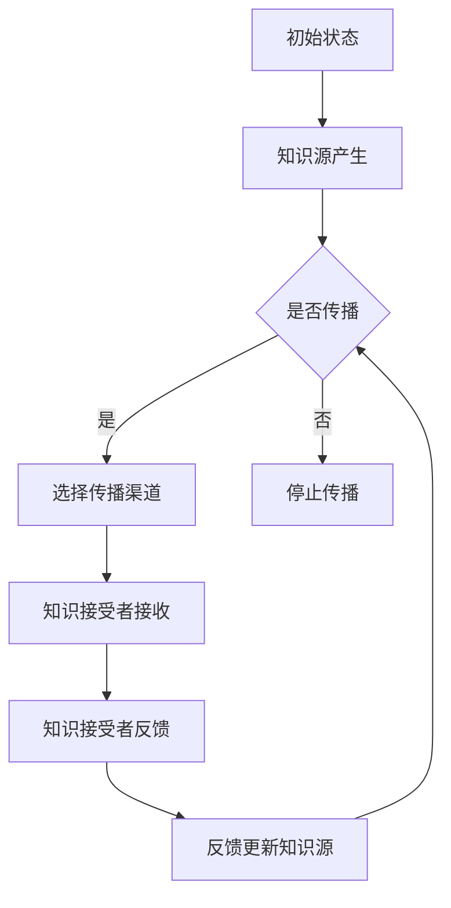

                 

## 数学与知识管理：知识传播的数学描述

### 关键词：
知识管理、数学模型、知识传播、组织内部传播、信息传递

### 摘要：
本文以数学模型为基础，深入探讨知识传播在组织内部的过程及其影响因素。通过详细阐述知识传播的核心概念、数学原理及算法，提供了一种定量分析知识传播规律的方法，旨在为知识管理实践提供理论支持和策略指导。

### 第一部分：背景介绍

#### 1.1 问题背景
知识管理作为现代企业战略的重要组成部分，其有效实施对企业的竞争力至关重要。知识管理不仅涉及知识的获取、存储和共享，还包括知识的传播与应用。然而，如何量化知识传播的过程，优化知识管理策略，成为一个亟待解决的问题。

#### 1.2 问题描述
本部分旨在通过数学模型描述知识传播的过程，分析影响知识传播的因素，为知识管理提供理论依据。

#### 1.3 问题解决
通过建立数学模型，我们可以定量分析知识传播的规律，从而指导知识管理实践。

#### 1.4 边界与外延
本部分讨论的知识传播模型主要关注组织内部的知识传播，适用于各种知识密集型组织。

#### 1.5 概念结构与核心要素组成
知识传播模型的核心要素包括知识源、知识接受者、传播渠道和传播效果。

### 第二部分：核心概念与联系

#### 2.1 核心概念
- **知识传播**：知识在个体或群体之间的传递和共享过程。
- **知识源**：提供知识的人或物。
- **知识接受者**：接受知识的人或群体。
- **传播渠道**：知识传播的途径。
- **传播效果**：知识传播达到的效果。

#### 2.2 概念属性特征对比表格

| 概念       | 定义                                       | 属性特征                                             |
|------------|--------------------------------------------|------------------------------------------------------|
| 知识传播   | 知识在个体或群体之间的传递和共享过程     | 信息传递、知识共享、双向互动                          |
| 知识源     | 提供知识的人或物                           | 知识拥有者、知识库、知识资源                          |
| 知识接受者 | 接受知识的人或群体                         | 知识需求者、知识用户、知识使用者                      |
| 传播渠道   | 知识传播的途径                             | 人际传播、媒介传播、技术传播                          |
| 传播效果   | 知识传播达到的效果                         | 知识普及度、知识应用效果、知识价值提升                 |

#### 2.3 ER实体关系图架构

```mermaid
erDiagram
  KnowledgeSource ||--|{ Knowledge}  :  has
  KnowledgeRecipient ||--|{ Knowledge}  :  receives
  CommunicationChannel ||--|{ Knowledge}  :  transmits
  Knowledge <<-- KnowledgeSource : originates
  Knowledge >>-- KnowledgeRecipient : is received
  Knowledge >>-- CommunicationChannel : is transmitted
```

### 第三部分：算法原理讲解

#### 3.1 算法描述
知识传播算法是一种基于网络模型的数学算法，用于模拟知识在组织内部的传播过程。

#### 3.2 Mermaid流程图



#### 3.3 Python源代码

```python
import numpy as np

# 初始化知识源和接受者
knowledge_source = 1
knowledge_recipients = np.random.choice([0, 1], size=100)

# 知识传播函数
def knowledge_spread(knowledge_source, knowledge_recipients, propagation_probability):
    # 初始化传播矩阵
    spread_matrix = np.zeros((len(knowledge_recipients), len(knowledge_recipients)))
    
    # 设置知识源的传播概率
    spread_matrix[knowledge_source][knowledge_recipients] = propagation_probability
    
    # 知识传播迭代
    for _ in range(iterations):
        new_spread_matrix = np.zeros((len(knowledge_recipients), len(knowledge_recipients)))
        for i in range(len(knowledge_recipients)):
            for j in range(len(knowledge_recipients)):
                if spread_matrix[i][j] == 1:
                    new_spread_matrix[i][j] = 1
                    new_spread_matrix[j][i] = 1
        spread_matrix = new_spread_matrix
    
    return spread_matrix
```

#### 3.4 算法原理详细讲解

知识传播算法基于网络模型，通过模拟知识在组织内部的传播过程，分析知识源、传播渠道和知识接受者之间的相互作用。算法的核心思想是利用概率模型来描述知识传播的概率分布，并通过迭代计算来模拟知识在组织内部的扩散。

1. **模型假设**：
   - 知识源：假设知识源是固定的，即知识源的知识状态不会改变。
   - 知识接受者：假设知识接受者是随机选择的，即每个接受者接收知识的概率是相等的。
   - 传播渠道：假设传播渠道是单一的，即知识传播仅通过一个渠道进行。

2. **算法步骤**：
   - **初始化**：初始化知识源和接受者的状态矩阵。
   - **传播概率**：设置每个知识接受者接收知识的概率。
   - **迭代传播**：通过迭代计算，更新知识源和接受者的状态矩阵，模拟知识在组织内部的传播过程。
   - **结果分析**：分析传播矩阵，得出知识传播的效果和规律。

3. **数学模型**：
   - **概率模型**：假设知识源的知识状态为 $s_0$，知识接受者的知识状态为 $s_1$，则知识接受者接收知识的概率为 $P(s_1|s_0)$。
   - **迭代模型**：在每一轮迭代中，知识源和接受者的状态矩阵更新为 $S_{t+1} = S_t \cdot P$，其中 $S_t$ 为当前状态矩阵，$P$ 为传播概率矩阵。

4. **举例说明**：
   假设一个组织中有10名成员，其中1名成员为知识源，其他成员为知识接受者。知识源的知识状态为1，知识接受者的知识状态为0。假设每个接受者接收知识的概率为0.5。

   使用知识传播算法，可以模拟知识在组织内部的传播过程。通过多次迭代，可以分析知识传播的效果和规律。例如，在第一次迭代后，所有成员都有可能接收知识，但在后续迭代中，知识传播的概率会逐渐降低，直到趋于稳定。

通过以上算法原理的讲解，我们可以更好地理解知识传播的数学模型及其应用。接下来，我们将进一步探讨知识传播的影响因素，以优化知识管理策略。

