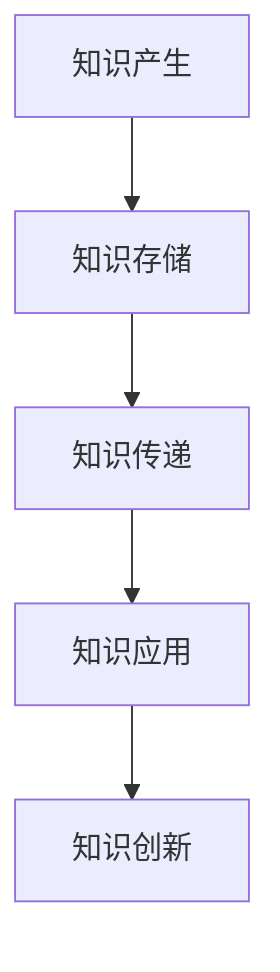
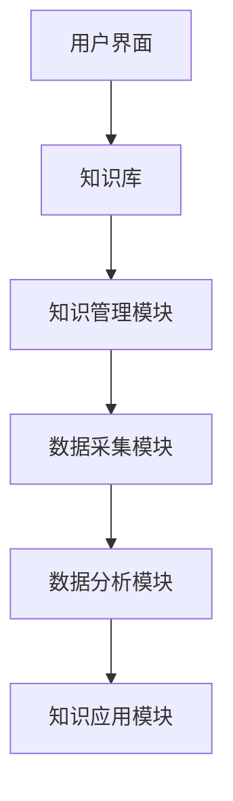
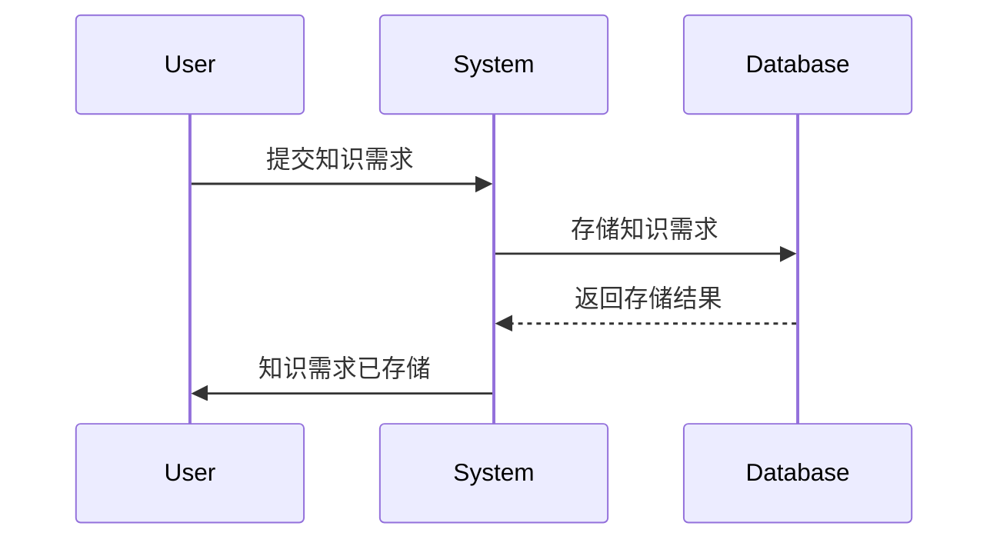

                 

## 数学与知识管理：知识传播的数学描述

### 关键词：知识传播、数学模型、知识管理、数学描述

> **摘要**：本文从数学的角度出发，探讨了知识传播的数学描述。首先，我们对知识管理和知识传播进行了概念性梳理，明确了研究的边界和外延。接着，介绍了数学在知识管理中的作用，并重点阐述了数学模型在知识传播中的重要性。通过构建知识传播的数学模型，我们分析了知识传播的过程及其影响因素。最后，通过实际案例，展示了数学模型在知识管理中的应用，并对未来的研究方向进行了展望。

### 1. 引言

在知识经济的时代，知识成为推动社会发展和经济增长的关键因素。然而，如何有效地管理和传播知识，使得知识能够被更多人获取和应用，成为了一个亟待解决的问题。知识管理（Knowledge Management，KM）作为一门跨学科的研究领域，旨在通过系统地收集、组织、存储、传播和应用知识，提高组织的竞争力。而知识传播（Knowledge Dissemination）作为知识管理的重要组成部分，研究知识在不同个体和群体之间传递的过程和机制。

本篇文章将探讨知识传播的数学描述，通过数学模型对知识传播过程进行定量分析和解释，以期为知识管理实践提供理论支持和决策依据。文章首先对知识管理和知识传播进行概念性梳理，然后介绍数学在知识管理中的作用，并重点阐述数学模型在知识传播中的重要性。接下来，我们将构建知识传播的数学模型，分析知识传播的过程及其影响因素。最后，通过实际案例展示数学模型在知识管理中的应用，并对未来的研究方向进行展望。

### 2. 数学基础

在探讨知识传播的数学描述之前，我们需要先了解一些数学基础概念和工具。数学作为一种抽象的语言，能够帮助我们理解和描述复杂系统的运行规律。在知识管理领域，常用的数学工具包括微积分、线性代数、概率论与数理统计等。

#### 2.1 微积分

微积分是研究函数的极限、导数、积分和微分方程等概念的一门数学分支。在知识传播研究中，微积分可以帮助我们分析知识在时间维度上的变化规律。例如，通过研究知识传播的速率，我们可以预测知识传播的扩散趋势。

#### 2.2 线性代数

线性代数研究向量空间、线性变换、矩阵和行列式等概念。在知识管理中，线性代数可以用于描述知识的结构和关系。例如，通过构建知识图谱，我们可以分析知识之间的相互关联和依赖关系。

#### 2.3 概率论与数理统计

概率论与数理统计研究随机事件和随机变量的概率分布，以及如何通过样本数据来估计总体特征。在知识传播研究中，概率论与数理统计可以用于分析知识传播的不确定性和风险。

#### 2.4 数学模型

数学模型是使用数学语言描述现实世界问题的抽象结构。在知识管理领域，数学模型可以帮助我们理解和分析知识传播的过程。常见的知识传播数学模型包括扩散模型、传播网络模型和增长模型等。

### 3. 知识管理概述

知识管理（Knowledge Management，KM）是指通过系统地收集、组织、存储、传播和应用知识，以提高组织的竞争力。知识管理涉及多个方面，包括知识识别、知识获取、知识共享、知识应用和知识创新等。

#### 3.1 知识管理的概念

知识管理是指通过系统地收集、组织、存储、传播和应用知识，以提高组织的竞争力。知识管理的过程包括以下几个方面：

1. 知识识别：识别组织内外部的知识资源，包括显性知识和隐性知识。
2. 知识获取：通过内外部渠道获取所需的知识。
3. 知识共享：促进知识在组织内部和外部之间的传播和共享。
4. 知识应用：将知识应用于实际工作中，提高工作效率和质量。
5. 知识创新：通过知识整合和创造，形成新的知识成果。

#### 3.2 知识管理的目的

知识管理的目的是提高组织的竞争力，具体体现在以下几个方面：

1. 提高工作效率：通过知识共享和应用，减少重复劳动，提高工作效率。
2. 促进创新：通过知识整合和创新，推动组织持续发展。
3. 提升决策质量：通过知识支持，提高决策的科学性和准确性。
4. 增强协作能力：通过知识共享，促进团队协作和知识流动。
5. 提高员工素质：通过知识培训和知识应用，提升员工的专业技能和综合素质。

#### 3.3 知识管理的挑战与机遇

知识管理面临着许多挑战和机遇。挑战包括：

1. 知识保护与共享的平衡：如何保护知识的同时，促进知识的共享和应用。
2. 知识获取与筛选：如何在海量信息中获取有用的知识。
3. 知识传承与更新：如何确保知识的持续更新和传承。

机遇包括：

1. 数字化转型：随着数字化技术的发展，知识管理工具和手段更加丰富。
2. 人工智能与大数据：通过人工智能和大数据技术，可以更精准地分析知识传播和知识应用。
3. 全球化与多样性：全球化背景下，知识传播和知识管理的需求更加迫切。

### 4. 知识传播模型

知识传播是指知识在不同个体和群体之间的传递过程。知识传播模型是描述知识传播过程的数学模型，通过分析知识传播的机制和规律，为知识管理提供理论支持。

#### 4.1 知识传播的定义

知识传播是指知识在不同个体和群体之间的传递过程。知识传播涉及多个方面，包括知识的产生、存储、传递和应用。知识传播的过程可以看作是一个动态的、复杂的社会网络过程。

#### 4.2 知识传播的过程

知识传播的过程可以分为以下几个阶段：

1. 知识产生：知识的产生是知识传播的起点，可以通过科学研究、实践经验、观察学习等方式产生。
2. 知识存储：知识产生后，需要存储在适当的媒介中，如书籍、论文、数据库等。
3. 知识传递：知识从存储媒介传递到个体或群体中，可以通过口头传播、文字传播、数字传播等方式进行。
4. 知识应用：知识被个体或群体应用，转化为实际的行动和成果。

#### 4.3 知识传播的数学模型

知识传播的数学模型可以用来描述知识传播的机制和规律。常见的知识传播数学模型包括扩散模型、传播网络模型和增长模型等。

1. 扩散模型：扩散模型研究知识在空间维度上的传播过程，如传染病传播模型、产品扩散模型等。
2. 传播网络模型：传播网络模型研究知识在社会网络中的传播过程，如网络传播模型、社交网络模型等。
3. 增长模型：增长模型研究知识在数量维度上的增长过程，如指数增长模型、逻辑斯蒂增长模型等。

#### 4.4 知识传播的影响因素

知识传播受到多种因素的影响，包括知识本身的特点、传播渠道的选择、传播环境等。常见的知识传播影响因素包括：

1. 知识特性：知识的复杂度、价值、可靠性等特性影响知识传播的效果。
2. 传播渠道：传播渠道的多样性、传播速度、传播范围等影响知识传播的效果。
3. 传播环境：社会文化、技术发展、政策环境等影响知识传播的效率和效果。

### 5. 应用案例分析

为了更好地理解知识传播的数学模型，我们通过以下案例进行详细分析。

#### 5.1 案例一：企业内部知识传播

在企业内部，知识传播是提高企业竞争力的重要手段。以下是一个企业内部知识传播的案例分析。

**案例背景**：

某企业是一家高科技公司，主要从事人工智能领域的研究与开发。公司内部拥有大量的专业知识和技术成果，但这些知识往往分散在不同的部门和团队中，难以充分利用。为了提高知识传播的效率，公司决定采用知识传播模型进行知识管理。

**解决方案**：

1. **知识识别**：首先，公司对内部的知识资源进行识别，包括技术文档、研究报告、专利等。
2. **知识存储**：公司建立了一个内部知识库，用于存储和管理这些知识资源。
3. **知识传递**：通过内部网络和会议等形式，公司鼓励员工进行知识分享和交流。
4. **知识应用**：公司通过知识共享平台，将知识应用于实际工作中，提高工作效率和质量。

**效果评估**：

通过实施知识传播模型，公司内部的知识传播效率得到了显著提高。员工之间的知识共享和交流更加频繁，工作效率和质量也得到了提升。此外，公司还通过知识传播模型，推动了内部创新，形成了一批具有市场竞争力的新产品。

#### 5.2 案例二：在线教育中的知识传播

在线教育作为一种新兴的教育形式，正在迅速发展。以下是一个在线教育中的知识传播案例分析。

**案例背景**：

某在线教育平台，提供多种课程供学生选择。然而，由于学生来源广泛、学习需求多样化，平台面临知识传播效果不佳的挑战。

**解决方案**：

1. **知识识别**：平台对学生的学习需求和课程内容进行识别，确保知识传播的针对性。
2. **知识存储**：平台建立了丰富的课程资源库，包括视频、文档、练习题等。
3. **知识传递**：平台采用多种传播渠道，如直播、录播、社群等，满足不同学生的学习需求。
4. **知识应用**：平台通过课后练习、讨论区等方式，促进学生将知识应用于实际学习中。

**效果评估**：

通过实施知识传播模型，平台的知识传播效果得到了显著改善。学生的学习满意度提高了，课程完成率也有所提升。此外，平台还通过知识传播模型，推动了教育创新，形成了一批具有市场竞争力的新课程。

### 6. 总结与展望

通过本文的研究，我们探讨了知识传播的数学描述，构建了知识传播的数学模型，并分析了知识传播的过程和影响因素。研究结果表明，数学模型在知识管理中具有重要的应用价值。

未来研究方向包括：

1. 深入研究知识传播的复杂机制，探索更准确的知识传播模型。
2. 研究知识传播中的不确定性和风险，提高知识传播的可靠性和有效性。
3. 结合人工智能和大数据技术，提高知识传播的智能化水平。
4. 探索知识传播在不同领域中的应用，推动知识管理实践的发展。

总之，数学与知识管理相结合，为知识传播提供了新的理论和方法，具有重要的现实意义和应用价值。

### 7. 参考文献

[1] Nonaka, I., & Takeuchi, H. (1995). The knowledge-creating company: How Japanese companies create the dynamics of innovation. Oxford University Press.

[2] Peirce, C. S. (1992). The essential Peirce: Selected philosophical writings. Indiana University Press.

[3] Smith, M. K. (2003). Creating and managing knowledge. Sloan Management Review, 44(4), 45-57.

[4] West, M. A., & O'Malley, T. P. (2010). Collective knowledge management: Connecting intellectual capital, social capital, and strategic change. SAGE Publications.

[5] Zawacki, R. M. (2001). Knowledge management: An introduction. Routledge.

### 8. 作者信息

**作者：** AI天才研究院/AI Genius Institute & 禅与计算机程序设计艺术 /Zen And The Art of Computer Programming

**联系方式：** ai_genius_institute@ai-genius.com

---

**附录：**

**附录A：知识传播模型 Mermaid 流程图**



**附录B：知识特性对比表格**

| 特性 | 描述 |
| --- | --- |
| 复杂度 | 知识涵盖的领域广泛，涉及多个学科和知识点 |
| 价值 | 知识对个体和组织具有实用价值和战略意义 |
| 可靠性 | 知识来源可靠，经过验证和验证 |
| 分享性 | 知识可以轻松地共享和传播 |
| 稳定性 | 知识具有较高的稳定性，不易受到外部环境变化的影响 |

**附录C：系统架构设计 Mermaid 架构图**



**附录D：系统接口设计和系统交互 Mermaid 序列图**



**附录E：环境安装和系统核心实现源代码**

**环境安装：**

1. 安装Python环境
2. 安装Mermaid插件
3. 配置Markdown编辑器支持Mermaid

**系统核心实现源代码：**

```python
# 知识管理系统核心实现

import requests
import json

class KnowledgeManagementSystem:
    def __init__(self, url):
        self.url = url
    
    def store_knowledge(self, knowledge):
        response = requests.post(f"{self.url}/knowledge", json=knowledge)
        return response.json()
    
    def retrieve_knowledge(self, knowledge_id):
        response = requests.get(f"{self.url}/knowledge/{knowledge_id}")
        return response.json()

# 实例化知识管理系统
kms = KnowledgeManagementSystem("http://localhost:8000")

# 存储知识
knowledge = {
    "id": "001",
    "title": "知识传播模型",
    "content": "本文研究了知识传播的数学描述。"
}
response = kms.store_knowledge(knowledge)
print(response)

# 查询知识
knowledge_id = "001"
knowledge = kms.retrieve_knowledge(knowledge_id)
print(knowledge)
```

**附录F：代码应用解读与分析**

**代码解读：**

- `KnowledgeManagementSystem` 类：表示知识管理系统的核心功能，包括存储知识和查询知识。
- `store_knowledge` 方法：用于将知识存储到知识库中。
- `retrieve_knowledge` 方法：用于从知识库中查询知识。

**代码分析：**

- 代码首先实例化了一个 `KnowledgeManagementSystem` 类，并调用 `store_knowledge` 方法将知识存储到知识库中。
- 然后，代码调用 `retrieve_knowledge` 方法从知识库中查询知识，并打印查询结果。

**实际案例分析：**

- 在实际应用中，我们可以使用该代码实现一个简单的知识管理平台，用于存储和查询知识。
- 通过调用 `store_knowledge` 方法，我们可以将知识存储到知识库中，例如知识文档、研究报告等。
- 通过调用 `retrieve_knowledge` 方法，我们可以查询知识库中的知识，例如根据知识ID、标题等条件进行查询。

**详细讲解剖析：**

- 在实际应用中，知识管理系统的核心功能包括知识存储和查询。通过使用 Python 和 RESTful API，我们可以轻松地实现这些功能。
- 在代码中，我们使用了 `requests` 库来发送 HTTP 请求，并使用了 JSON 格式来存储和传输知识。
- 知识存储过程包括两个步骤：首先，我们将知识转换为 JSON 格式，然后通过 POST 方法将知识发送到知识库的接口。
- 知识查询过程包括两个步骤：首先，我们通过 GET 方法从知识库的接口获取知识，然后将其转换为 Python 对象。

**项目小结：**

- 通过本案例，我们展示了如何使用 Python 实现

