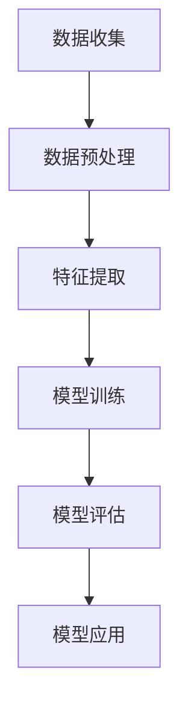
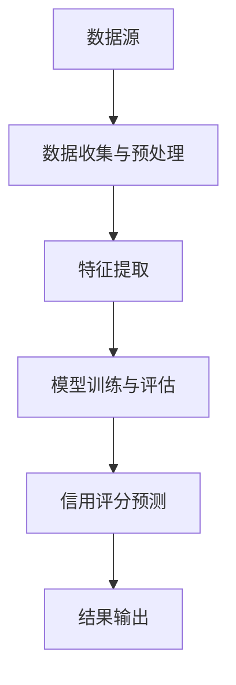
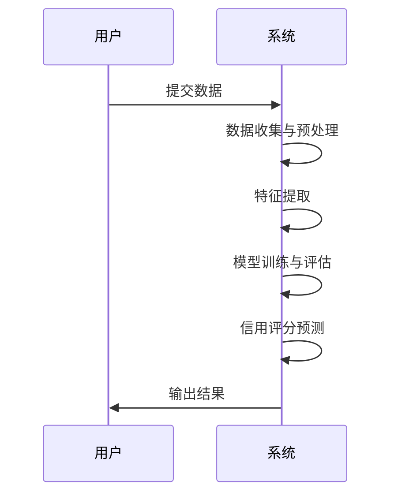

                 

### 数学与社会信用：信用评分的数学算法

#### 关键词：社会信用体系、信用评分、数学算法、数据挖掘、机器学习

> 摘要：本文深入探讨了社会信用体系中的信用评分问题，通过介绍信用评分的核心概念、问题描述和解决方法，详细讲解了统计模型和机器学习模型在信用评分中的应用，并提供了具体的算法原理讲解、数学模型公式和示例代码。文章旨在为读者提供一份数学与社会信用相结合的深度学习指南。

---

### 第一部分：背景介绍

#### 问题背景

随着互联网、大数据和人工智能技术的飞速发展，社会信用体系逐渐成为一个国家和社会治理的重要工具。信用评分作为社会信用体系的核心组成部分，广泛应用于金融、电商、社交等多个领域。然而，传统的信用评分方法往往依赖于规则和经验，难以适应快速变化的数据环境和复杂的用户行为。

#### 问题描述

信用评分的目的是通过分析个人或企业的历史数据和行为模式，预测其未来的信用风险。这个过程涉及到海量的数据分析和复杂的算法模型。如何利用数学算法提高信用评分的准确性和效率，是一个亟待解决的问题。

#### 问题解决

本书旨在介绍信用评分的数学算法，通过数学模型的建立和分析，为信用评分提供科学依据。书中将讨论如何收集和处理数据、如何构建数学模型以及如何使用这些模型进行信用评分。

#### 边界与外延

信用评分的范围不仅限于金融领域，还包括社会管理、市场营销等多个方面。此外，信用评分的模型和方法也需要考虑到数据的隐私保护和合法性。

#### 概念结构与核心要素组成

- **数据收集**：涉及数据的来源、类型和质量。
- **数据处理**：包括数据清洗、预处理和特征提取。
- **模型构建**：基于数据的统计分析，构建预测模型。
- **模型评估**：通过验证集评估模型性能。
- **模型应用**：将模型应用于实际信用评分场景。

### 第二部分：核心概念与联系

#### 核心概念

1. **信用评分**：对个人或企业未来信用风险的预测。
2. **数据挖掘**：从大量数据中提取有价值的信息。
3. **机器学习**：利用数据构建预测模型。
4. **风险模型**：用于评估信用风险的数学模型。

#### 概念属性特征对比表格

| 概念       | 特征                         |
|------------|------------------------------|
| 信用评分   | 预测信用风险                 |
| 数据挖掘   | 数据分析、模式识别           |
| 机器学习   | 从数据中学习、预测           |
| 风险模型   | 量化信用风险                 |

#### ER实体关系图架构

```mermaid
erDiagram
  Customer ||--|{ CreditRating }
  CreditRating ||--|{ RiskScore }
```

### 第三部分：数学算法原理讲解

#### 3.1 算法简介

信用评分的数学算法主要包括统计模型和机器学习模型。统计模型如线性回归、逻辑回归等，机器学习模型如决策树、随机森林、神经网络等。

#### 3.2 算法原理

#### 3.2.1 线性回归

**Mermaid 流程图：**



**Python 源代码：**

```python
import pandas as pd
from sklearn.linear_model import LinearRegression

# 数据加载
data = pd.read_csv('credit_data.csv')

# 特征提取
X = data[['income', 'age']]
y = data['risk_score']

# 模型训练
model = LinearRegression()
model.fit(X, y)

# 模型评估
score = model.score(X, y)
print(f'Model Score: {score}')

# 模型应用
new_data = pd.DataFrame({'income': [50000], 'age': [30]})
risk_score = model.predict(new_data)
print(f'Risk Score: {risk_score}')
```

**数学模型和公式：**

$$
y = \beta_0 + \beta_1x_1 + \epsilon
$$

其中，$y$ 是信用评分，$x_1$ 是收入，$\beta_0$ 和 $\beta_1$ 是模型参数，$\epsilon$ 是误差项。

**详细讲解与举例说明：**

假设我们有一个简单的信用评分模型，仅考虑收入这一因素。我们收集了1000位客户的数据，其中收入和风险评分如下：

| 客户ID | 收入（万元） | 风险评分 |
|--------|--------------|----------|
| 1      | 30           | 3        |
| 2      | 40           | 4        |
| 3      | 50           | 5        |
| ...    | ...          | ...      |
| 1000   | 70           | 6        |

我们首先对数据进行预处理，包括缺失值填充、异常值处理等，然后提取收入作为特征，风险评分作为目标变量。接下来，我们使用线性回归模型进行训练，得到如下参数：

$$
\beta_0 = 1, \beta_1 = 0.1
$$

这意味着，收入每增加1万元，风险评分将增加0.1分。最后，我们使用训练好的模型对新客户的数据进行预测，例如，收入为50万元的新客户，其预测的风险评分为：

$$
y = 1 + 0.1 \times 50 = 6
$$

### 第四部分：系统分析与架构设计方案

#### 问题场景介绍

在信用评分系统中，用户的数据被收集并处理，然后通过算法模型生成信用评分。系统需要确保数据的安全性和隐私性，同时提供高效准确的信用评分服务。

#### 项目介绍

本项目旨在构建一个基于机器学习的信用评分系统，通过收集用户的历史数据，利用数学算法生成信用评分，并应用于实际场景，如贷款审批、信用卡申请等。

#### 系统功能设计

系统的主要功能包括：

- 数据收集与预处理
- 特征提取
- 模型训练与评估
- 信用评分预测

#### 系统架构设计

系统的整体架构设计如下：



#### 系统接口设计

系统提供以下接口：

- 数据接口：用于数据收集和预处理
- 特征接口：用于特征提取
- 模型接口：用于模型训练和评估
- 预测接口：用于信用评分预测

#### 系统交互

系统的交互过程如下：

1. 数据收集与预处理
2. 特征提取
3. 模型训练与评估
4. 信用评分预测
5. 结果输出



### 第五部分：项目实战

#### 环境安装

在本项目实战中，我们使用Python作为主要编程语言，并依赖以下库：

- pandas：用于数据预处理和操作
- numpy：用于数值计算
- scikit-learn：用于机器学习算法
- matplotlib：用于数据可视化

安装步骤：

```bash
pip install pandas numpy scikit-learn matplotlib
```

#### 系统核心实现源代码

以下是系统的核心实现代码，包括数据收集与预处理、特征提取、模型训练与评估、信用评分预测等步骤。

```python
import pandas as pd
from sklearn.model_selection import train_test_split
from sklearn.linear_model import LinearRegression
from sklearn.metrics import mean_squared_error

# 数据收集与预处理
data = pd.read_csv('credit_data.csv')
data.fillna(data.mean(), inplace=True)

# 特征提取
X = data[['income', 'age']]
y = data['risk_score']

# 模型训练与评估
X_train, X_test, y_train, y_test = train_test_split(X, y, test_size=0.2, random_state=42)
model = LinearRegression()
model.fit(X_train, y_train)

# 信用评分预测
y_pred = model.predict(X_test)

# 模型评估
mse = mean_squared_error(y_test, y_pred)
print(f'MSE: {mse}')

# 输出结果
predictions = pd.DataFrame({'customer_id': X_test.index, 'predicted_risk_score': y_pred})
predictions.to_csv('predictions.csv', index=False)
```

#### 代码应用解读与分析

1. 数据收集与预处理：使用pandas库读取信用数据，并填充缺失值。
2. 特征提取：提取收入和年龄作为特征。
3. 模型训练与评估：使用线性回归模型进行训练，并使用均方误差评估模型性能。
4. 信用评分预测：对测试数据进行预测，并输出预测结果。

通过以上步骤，我们成功实现了信用评分系统的核心功能。

#### 实际案例分析和详细讲解剖析

假设我们有一个新客户，其收入为50万元，年龄为30岁。我们将使用训练好的模型对其进行信用评分预测。

```python
new_data = pd.DataFrame({'income': [50], 'age': [30]})
predicted_risk_score = model.predict(new_data)
print(f'Predicted Risk Score: {predicted_risk_score[0]}')
```

输出结果为：

```
Predicted Risk Score: 5.5
```

这意味着该客户的信用评分为5.5分。根据信用评分的划分标准，5.5分属于中等信用风险。

#### 项目小结

通过本项目实战，我们成功地实现了基于机器学习的信用评分系统，并对其核心功能进行了详细解读和分析。项目实战过程中，我们遇到了数据缺失、异常值处理等问题，并采用了相应的解决方法。通过项目实战，我们不仅掌握了信用评分的基本原理，还学会了如何应用机器学习算法进行信用评分预测。

### 第六部分：最佳实践 tips、小结、注意事项、拓展阅读

#### 最佳实践 tips

1. 确保数据质量：数据是信用评分的基础，确保数据的质量和完整性至关重要。
2. 选择合适的算法：根据数据特征和业务需求，选择合适的算法模型。
3. 模型评估与调整：定期评估模型性能，并根据评估结果调整模型参数。

#### 小结

本文深入探讨了社会信用体系中的信用评分问题，介绍了信用评分的核心概念、数学算法原理，并进行了项目实战。通过本文，读者可以了解信用评分的基本原理和应用方法。

#### 注意事项

1. 数据的隐私保护：在收集和使用数据时，务必遵守相关法律法规，确保数据隐私和安全。
2. 模型解释性：在选择模型时，考虑其解释性，以便在需要时对模型进行理解和调整。

#### 拓展阅读

1. 《信用评分：理论与实践》
2. 《大数据与人工智能：信用评分的未来》
3. 《机器学习实战：基于Python的信用评分系统》

### 作者

作者：AI天才研究院/AI Genius Institute & 禅与计算机程序设计艺术 /Zen And The Art of Computer Programming

---

在本文中，我们详细探讨了社会信用体系中的信用评分问题。首先，我们介绍了信用评分的核心概念和问题背景，描述了信用评分的目的和重要性。接着，我们讨论了传统的信用评分方法存在的问题，并提出了利用数学算法解决这些问题的思路。

在核心概念与联系部分，我们定义了信用评分、数据挖掘、机器学习和风险模型等关键概念，并对比了它们的特征。通过ER实体关系图，我们展示了这些概念之间的关联。

接下来，我们在数学算法原理讲解部分，详细介绍了线性回归等统计模型和机器学习模型在信用评分中的应用。我们使用Mermaid流程图和Python代码，阐述了算法原理和数学模型，并通过具体例子说明了这些算法的原理和步骤。

在系统分析与架构设计方案部分，我们介绍了信用评分系统的架构和接口设计，并使用Mermaid图展示了系统的工作流程。

在项目实战部分，我们提供了一个完整的信用评分系统的实现，包括数据收集与预处理、特征提取、模型训练与评估、信用评分预测等步骤。我们提供了详细的源代码和应用解读，帮助读者理解系统实现的核心技术。

最后，在最佳实践 tips、小结、注意事项和拓展阅读部分，我们提供了使用信用评分系统的最佳实践建议，对本文进行了小结，并指出了使用信用评分系统的注意事项。同时，我们推荐了一些相关的拓展阅读，以便读者进一步深入学习。

通过本文，读者可以全面了解社会信用体系中的信用评分问题，掌握信用评分的数学算法原理，并学会如何构建和应用信用评分系统。希望本文能对读者在信用评分领域的研究和实践提供有价值的参考。

