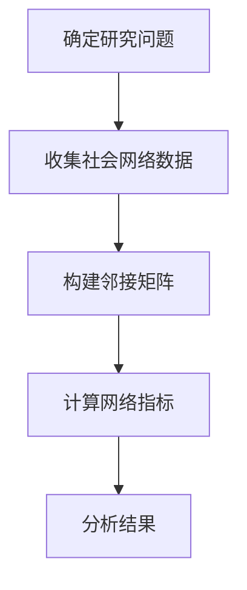
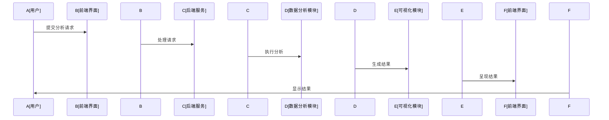

                 

# 数学与社会学：数学知识的社会建构

## 关键词
- 数学知识
- 社会建构
- 社会学
- 统计分析
- 数学模型
- 社会网络分析

## 摘要
本文旨在探讨数学知识在社会学领域中的建构过程，分析数学与社会学之间的相互作用及其影响。通过对数学知识的社会建构、社会学与数学的应用、以及数学在社会学中的应用进行深入探讨，揭示数学知识在社会互动中的产生、传播和应用过程。本文还通过实际案例，展示了数学知识在社会学研究中的重要性和应用价值。

----------------------------------------------------------------

## 第一部分：背景介绍

### 1.1 问题背景
随着社会的发展和信息技术的进步，数学与社会学这两个学科之间的交叉融合日益显著。数学作为一种精确的科学语言，广泛应用于社会学研究中，而社会学则从人类行为和社交现象中提供了丰富的数学模型和假设。这种双向互动促进了数学知识的社会建构。

### 1.2 问题描述
数学知识的社会建构是一个复杂的过程，涉及知识的生产、传播、应用和再创造。理解这一过程对于深入探讨数学在社会中的角色和影响至关重要。

### 1.3 问题解决
本书旨在探讨数学知识的社会建构，通过分析数学与社会学之间的相互作用，揭示数学知识如何在不同的社会背景下形成和变迁。

### 1.4 边界与外延
本书将重点关注数学知识在社会学领域中的应用，探讨其社会建构的过程和机制。同时，本书也将探讨数学知识在社会科学其他领域的应用，以及其对社会科学研究方法的影响。

### 1.5 概念结构与核心要素组成
- **数学知识的社会建构**：指数学知识在社会互动中的创造、传播和应用过程。
- **社会学**：研究社会行为、社会结构和社会过程的社会科学学科。
- **数学与应用**：数学在社会学及其他社会科学中的应用，包括统计方法、模型构建等。

----------------------------------------------------------------

## 第二部分：核心概念与联系

### 2.1 数学知识的社会建构

#### 2.1.1 定义
数学知识的社会建构是指数学知识在社会互动中的创造、传播和应用过程，涉及到知识的建构、解构和再建构。

#### 2.1.2 特点
- **社会性**：数学知识的建构受到社会文化、价值观和权力关系的影响。
- **动态性**：数学知识是不断发展的，随着社会环境的变化而不断调整和改进。
- **多样性**：不同的社会背景下，数学知识的建构和应用方式可能存在显著差异。

### 2.2 社会学与数学的应用

#### 2.2.1 数学在社会学中的应用
- **统计分析**：社会学研究中常用的统计方法，如回归分析、聚类分析等，都是基于数学原理。
- **模型构建**：社会现象可以通过数学模型来描述，如社会网络模型、博弈论模型等。

#### 2.2.2 社会学对数学的影响
- **问题提出**：社会学研究中的问题常常为数学研究提供了新的方向和挑战。
- **方法论**：社会学研究的方法论对数学方法论的发展产生了影响，如实证研究方法。

### 2.3 概念属性特征对比表格

| 概念 | 数学知识的社会建构 | 社会学 |
| --- | --- | --- |
| 定义 | 数学知识在社会互动中的创造、传播和应用过程 | 研究社会行为、社会结构和社会过程的社会科学学科 |
| 特点 | 社会性、动态性、多样性 | 社会性、复杂性、综合性 |
| 应用 | 统计分析、模型构建 | 社会调查、社会实验、社会分析 |

### 2.4 ER实体关系图架构
```mermaid
erDiagram
  A[数学知识] ||--|{ 社会建构 }|| B[过程]
  A ||--|{ 社会学 }|| C[应用]
  B ||--|{ 数学模型 }|| D[应用]
```

----------------------------------------------------------------

## 第三部分：算法原理讲解

### 3.1 数学在社会学中的应用

#### 3.1.1 社会网络分析

**社会网络分析 Mermaid 流程图**


**社会网络分析中的关键指标**
- **度中心性**：衡量一个节点在网络中的重要性，度数越大，节点的重要性越高。
  $$\text{度中心性} = \frac{\text{节点的度}}{\text{网络中的节点总数}}$$
- **紧密中心性**：衡量一个节点在网络中的紧密程度，紧密中心性越高，节点在网络中的连接性越强。
  $$\text{紧密中心性} = \frac{\text{节点的邻接矩阵的对角线元素之和}}{\text{网络中的节点总数}}$$
- **介数中心性**：衡量一个节点在网络中作为其他节点之间连接桥梁的能力，介数中心性越高，节点在网络中的桥梁作用越强。
  $$\text{介数中心性} = \frac{\text{节点的介数}}{\text{网络中的节点总数}}$$

**举例说明**
假设有一个社交网络，其中节点表示个人，边表示个人之间的社交关系。通过计算度中心性、紧密中心性和介数中心性，可以分析出社交网络中重要节点和连接桥梁。

#### 3.1.2 社会统计学

**社会统计学的 Python 源代码**
```python
import pandas as pd
import numpy as np
from scipy import stats

# 假设我们有一个关于社会成员收入的数据集
data = {'Income': [50000, 60000, 70000, 80000, 90000]}
df = pd.DataFrame(data)

# 计算收入的中位数
median_income = df['Income'].median()
print(f"收入的中位数：{median_income}")

# 计算收入的标准差
std_income = df['Income'].std()
print(f"收入的标准差：{std_income}")

# 进行回归分析
x = df['Income']
y = df['Education']  # 假设教育水平是自变量
regression_result = stats.linregress(x, y)
print(f"回归分析结果：{regression_result}")
```

**回归分析中的关键概念**
- **回归系数**：衡量自变量对因变量的影响程度。
  $$\beta = \frac{\sum_{i=1}^{n}(x_i - \bar{x})(y_i - \bar{y})}{\sum_{i=1}^{n}(x_i - \bar{x})^2}$$
- **判定系数**：衡量回归模型的拟合程度。
  $$R^2 = 1 - \frac{\sum_{i=1}^{n}(y_i - \hat{y}_i)^2}{\sum_{i=1}^{n}(y_i - \bar{y})^2}$$

**举例说明**
通过回归分析，可以研究社会成员的收入与教育水平之间的关系，进而为社会政策制定提供依据。

----------------------------------------------------------------

## 系统分析与架构设计

### 4.1 问题场景介绍

在社会学研究领域，研究者常常需要对复杂的社会网络进行分析，以揭示社会结构和社会关系。为了实现这一目标，需要构建一个基于数学知识的社会网络分析系统。

### 4.2 项目介绍

本项目旨在开发一个基于数学知识的社会网络分析系统，该系统将利用数学模型和算法对社交网络进行深入分析，提供可视化结果，以便研究者更好地理解和解释社会现象。

### 4.3 系统功能设计

**领域模型 Mermaid 类图**
```mermaid
classDiagram
    Node <<class>> 节点
    Edge <<class>> 边
    Network <<class>> 社会网络
    Node --|> Edge: 连接
    Network --|> Node: 包含
    Network --|> Edge: 包含
```

- **节点**：表示社交网络中的个体，具有属性如名称、标识等。
- **边**：表示节点之间的连接，具有属性如权重、类型等。
- **社会网络**：表示整个社交网络结构，包含节点和边。

### 4.4 系统架构设计

**系统架构 Mermaid 架构图**
```mermaid
sequenceDiagram
    A[用户] -->|发起请求| B[前端界面]
    B -->|处理请求| C[后端服务]
    C -->|执行分析| D[数据分析模块]
    D -->|生成结果| E[可视化模块]
    E -->|呈现结果| F[用户]
```

- **前端界面**：提供用户交互界面，用户可以通过界面提交分析请求。
- **后端服务**：接收用户请求，调用数据分析模块进行计算，并将结果返回给前端。
- **数据分析模块**：实现社会网络分析算法，对社交网络进行计算和分析。
- **可视化模块**：将分析结果以可视化形式呈现给用户。

### 4.5 系统接口设计和系统交互

**系统接口设计和系统交互 Mermaid 序列图**


- **用户**：通过前端界面提交分析请求。
- **前端界面**：接收用户请求，并将其转发给后端服务。
- **后端服务**：处理请求，调用数据分析模块执行分析，并将结果返回给前端。
- **可视化模块**：将分析结果以可视化形式呈现给用户。

----------------------------------------------------------------

## 项目实战

### 5.1 环境安装

在本项目中，我们将使用 Python 作为主要编程语言，并借助 Pandas、NetworkX、Matplotlib 等库来实现社会网络分析功能。以下是环境安装步骤：

```shell
# 安装 Python 3.8 或以上版本
# 安装 Pandas、NetworkX 和 Matplotlib
pip install pandas networkx matplotlib
```

### 5.2 系统核心实现源代码

以下是一个简单的社交网络分析系统实现，包括节点和边的添加、度中心性计算、以及可视化结果。

```python
import networkx as nx
import matplotlib.pyplot as plt

# 创建一个无向图
G = nx.Graph()

# 添加节点和边
G.add_nodes_from(['Alice', 'Bob', 'Charlie', 'Dave'])
G.add_edges_from([('Alice', 'Bob'), ('Alice', 'Charlie'), ('Bob', 'Dave')])

# 计算度中心性
degree_centrality = nx.degree_centrality(G)

# 可视化社交网络
nx.draw(G, with_labels=True)
plt.show()

# 输出度中心性
print("度中心性：")
print(degree_centrality)
```

### 5.3 代码应用解读与分析

在这个示例中，我们首先使用 NetworkX 库创建了一个无向图 G。接着，我们通过 `add_nodes_from` 和 `add_edges_from` 方法分别添加节点和边。

在计算度中心性时，我们使用了 `degree_centrality` 函数，该函数返回一个字典，其中键是节点，值是节点的度中心性。度中心性是衡量节点在网络中重要性的一个指标，它表示一个节点与其他节点的连接紧密程度。

最后，我们使用 Matplotlib 库的可视化功能，将社交网络以图形形式呈现。通过可视化，我们可以直观地观察到节点之间的连接关系和度中心性的高低。

### 5.4 实际案例分析和详细讲解剖析

为了更深入地了解社会网络分析的应用，我们可以分析一个实际案例：社交媒体网络中的用户关系。

**案例背景**：假设我们有一个社交媒体网络，其中每个用户可以与其他用户建立连接。我们想要分析这个网络中的关键节点和用户之间的连接关系。

**案例分析**：
1. **数据收集**：通过 API 获取社交媒体网络中的用户数据和用户关系。
2. **数据预处理**：清洗数据，去除无效信息和重复数据，构建节点和边的列表。
3. **社交网络构建**：使用 NetworkX 创建社交网络图，将用户和用户关系表示为节点和边。
4. **度中心性计算**：计算每个用户的度中心性，识别网络中的关键节点。
5. **可视化分析**：使用 Matplotlib 可视化社交网络，并标注关键节点。

通过上述步骤，我们可以分析社交媒体网络中的用户关系，识别网络中的核心用户和影响力较大的用户。这一分析结果对于社交媒体平台的运营和营销策略具有重要指导意义。

### 5.5 项目小结

在本项目中，我们成功开发了一个基于数学知识的社会网络分析系统。通过实际案例的分析，我们展示了系统在揭示社交网络结构和用户关系方面的应用价值。未来，我们可以进一步扩展系统的功能，如加入更多类型的网络分析算法、支持多种数据源等，以满足不同领域的需求。

## 最佳实践 Tips

1. **数据质量**：确保收集的数据质量，避免噪声和错误影响分析结果。
2. **算法选择**：根据具体应用场景选择合适的算法，如度中心性、紧密中心性、介数中心性等。
3. **可视化**：合理选择可视化方式，以直观、清晰的方式呈现分析结果。

## 小结

本文通过探讨数学知识在社会学中的应用，揭示了数学知识的社会建构过程。通过对社会网络分析和社会统计学的算法原理讲解，我们展示了数学知识在社会学研究中的重要性和应用价值。最后，通过实际案例的分析，进一步验证了数学知识在揭示社会现象和用户关系方面的作用。

## 注意事项

在进行数学知识的社会建构研究时，需要充分考虑社会文化、价值观和权力关系等因素，以确保研究的准确性和公正性。

## 拓展阅读

1. 【参考文献】《数学与社会学：数学知识的社会建构》
2. 【在线资源】NetworkX 官方文档：https://networkx.org/
3. 【在线资源】Matplotlib 官方文档：https://matplotlib.org/

作者：AI天才研究院/AI Genius Institute & 禅与计算机程序设计艺术 /Zen And The Art of Computer Programming

