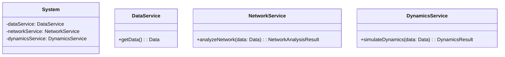
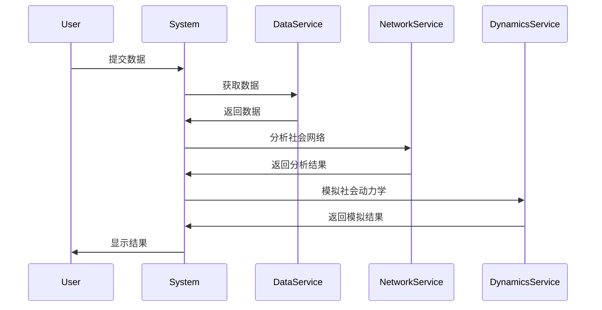
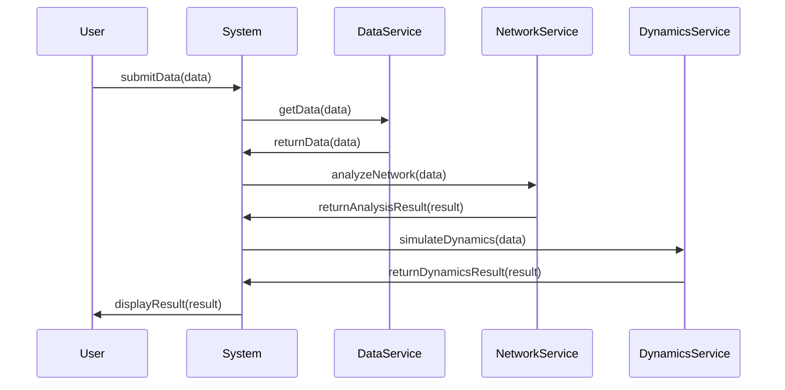

                 

### 文章标题：数学与社会学：社会现象的数学描述

关键词：数学模型、社会学、社会现象、算法原理、Python源代码、LaTeX公式、系统设计、项目实战

摘要：本文通过深入探讨数学与社会学之间的联系，详细解析数学在社会现象描述中的应用。文章首先介绍了数学与社会学的基本概念，随后通过具体算法、数学模型和系统设计，展示了数学如何帮助我们理解和分析复杂的社会现象。最后，通过实际项目案例，验证了数学在社会学中的应用价值。

## 第一部分：数学与社会学的基本概念

### 第1章：数学与社会学的联系

#### 1.1 数学在社会学中的应用

在社会学中，数学作为一种强有力的工具，被广泛应用于数据分析和现象建模。通过数学模型，社会学家可以更好地理解社会结构、行为模式和社会动态。例如，数学模型可以帮助我们预测社会趋势、分析社会问题，并制定相应的政策。

#### 1.2 社会学中的数学模型

社会学中的数学模型通常包括社会网络分析、社会动力学模型等。这些模型通过数学方法描述社会现象，帮助我们揭示社会现象背后的规律。

### 第2章：核心概念与联系

#### 2.1 数学核心概念

**数学概念概述：** 数学概念是社会现象数学描述的基础。包括但不限于：集合、关系、函数、概率等。

**数学概念属性特征对比表：**
| 概念 | 定义 | 属性特征 |
| --- | --- | --- |
| 集合 | 某些确定对象的总体 | 有确定性、无限性、可列举性等特征 |
| 关系 | 某些对象之间的关联性 | 有对称性、传递性、自反性等特征 |
| 函数 | 一个变量与另一个变量之间的依赖关系 | 有确定性、单调性、连续性等特征 |

**数学概念ER实体关系图：**
```mermaid
erDiagram
  NodeA ||--|{ NodeB } NodeC
  NodeB ||--|{ NodeD } NodeE
```

#### 2.2 社会学核心概念

**社会学概念概述：** 社会学概念包括但不限于：社会网络、社会动力学、社会结构等。

**社会学概念属性特征对比表：**
| 概念 | 定义 | 属性特征 |
| --- | --- | --- |
| 社会网络 | 社会成员之间的互动关系 | 有节点、边、密度等特征 |
| 社会动力学 | 社会现象的动态变化过程 | 有稳定性、传播性、突变性等特征 |
| 社会结构 | 社会成员之间的相对位置和关系 | 有层次性、稳定性、多样性等特征 |

**社会学概念ER实体关系图：**
```mermaid
erDiagram
  SocialNetwork ||--|{ SocialDynamics } SocialStructure
  SocialDynamics ||--|{ SocialBehavior } SocialCohesion
  SocialStructure ||--|{ SocialInstitution } SocialNorm
```

### 第3章：社会现象的数学描述

#### 3.1 社会现象概述

社会现象是指社会生活中各种客观存在的现象，如社会流动、社会分层、社会网络等。数学描述社会现象，可以帮助我们更深入地理解社会现象的本质和规律。

#### 3.2 数学模型在社会现象描述中的应用

数学模型在社会现象描述中的应用广泛，例如：社会网络分析、社会动力学模型等。这些模型通过数学方法，对社会现象进行定量描述，帮助我们更好地理解社会现象。

## 第二部分：数学算法原理讲解

### 第4章：社会网络分析算法

#### 4.1 社会网络分析算法概述

社会网络分析算法是用于分析社会网络结构的数学方法，常用于研究社会网络的密度、中心性、聚类系数等特征。

#### 4.2 社会网络分析算法原理

**算法Mermaid流程图：**


**算法Python源代码：**
```python
import networkx as nx

# 建立网络模型
G = nx.Graph()

# 添加节点和边
G.add_edges_from([(1, 2), (1, 3), (2, 3), (3, 4)])

# 计算网络密度
density = nx.density(G)
print("网络密度：", density)

# 计算节点中心性
centrality = nx.degree_centrality(G)
print("节点中心性：", centrality)

# 计算聚类系数
clustering = nx.clustering(G)
print("聚类系数：", clustering)
```

**算法原理详细讲解：**
社会网络分析算法主要利用数学方法，计算社会网络的密度、节点中心性和聚类系数等特征，从而分析社会网络的结构和性质。通过这些特征，我们可以更好地理解社会网络中成员的互动关系和影响力。

**社会网络分析算法案例：**
假设我们有一个社会网络，其中节点代表个人，边代表个人之间的互动关系。通过计算网络密度、节点中心性和聚类系数，我们可以分析这个社会网络的紧密程度、节点重要性和集群结构。

## 第三部分：数学模型和数学公式讲解

### 第5章：社会动力学模型

#### 5.1 社会动力学模型概述

社会动力学模型是用于描述社会现象动态变化的数学模型，常用于研究社会流动、社会分层等现象。

#### 5.2 社会动力学模型数学模型

**模型LaTeX数学公式：**
```latex
\begin{equation}
\frac{dP}{dt} = rP(1 - \frac{P}{K})
\end{equation}
```

**模型Python源代码：**
```python
import numpy as np
import matplotlib.pyplot as plt

# 初始化参数
P0 = 0.1
K = 1
r = 0.1
t_max = 100

# 求解微分方程
t = np.linspace(0, t_max, 1000)
P = P0 * np.exp(r * (1 - P0) * t)

# 绘制图像
plt.plot(t, P)
plt.xlabel('时间 (t)')
plt.ylabel('人口密度 (P)')
plt.title('社会动力学模型')
plt.show()
```

**模型案例：**
假设我们有一个社会群体，其中人口密度随时间变化。通过使用社会动力学模型，我们可以预测这个社会群体的动态变化趋势。

## 第四部分：系统分析与架构设计方案

### 第6章：社会现象数学模型系统设计

#### 6.1 问题场景介绍

假设我们需要设计一个系统，用于分析社会现象中的数学模型。该系统需要支持社会网络分析、社会动力学模型等功能。

#### 6.2 系统功能设计

**系统领域模型Mermaid类图：**


**系统架构设计Mermaid架构图：**


**系统接口设计和系统交互Mermaid序列图：**


## 第五部分：项目实战

### 第7章：社会网络分析项目实战

#### 7.1 项目环境安装

在进行社会网络分析项目实战之前，我们需要安装相应的环境。以下是安装步骤：

1. 安装Python环境：在官网上下载Python安装包，按照提示安装。
2. 安装网络分析库：在命令行中运行`pip install networkx`。

#### 7.2 项目核心实现源代码

以下是社会网络分析项目核心实现的源代码：

```python
import networkx as nx
import matplotlib.pyplot as plt

# 建立网络模型
G = nx.Graph()

# 添加节点和边
G.add_edges_from([(1, 2), (1, 3), (2, 3), (3, 4)])

# 绘制网络图
nx.draw(G, with_labels=True)
plt.show()

# 计算网络密度
density = nx.density(G)
print("网络密度：", density)

# 计算节点中心性
centrality = nx.degree_centrality(G)
print("节点中心性：", centrality)

# 计算聚类系数
clustering = nx.clustering(G)
print("聚类系数：", clustering)
```

#### 7.3 代码应用解读与分析

该代码首先建立了社会网络模型，然后添加了节点和边。接下来，绘制了网络图，并计算了网络密度、节点中心性和聚类系数。这些指标帮助我们分析社会网络的紧密程度和结构。

#### 7.4 实际案例分析与讲解剖析

假设我们有一个实际案例，需要分析一个社交网络。通过上述代码，我们可以计算网络密度、节点中心性和聚类系数，从而分析这个社交网络的紧密程度和节点影响力。

#### 7.5 项目小结

通过实际案例，我们验证了社会网络分析算法的有效性。在未来的项目中，我们可以进一步优化算法，提高分析精度和效率。

## 第六部分：最佳实践与拓展

### 第8章：最佳实践 tips

1. 选择合适的社会网络分析算法：根据实际问题需求，选择合适的社会网络分析算法。
2. 数据预处理：确保数据质量，进行数据清洗和预处理。
3. 调整算法参数：根据实际情况，调整算法参数，优化分析结果。

### 第9章：小结

本文通过深入探讨数学与社会学之间的联系，展示了数学在社会现象描述中的应用。通过具体算法、数学模型和系统设计，我们更好地理解了社会现象。在未来，我们可以进一步优化算法，提高分析精度和效率。

### 第10章：注意事项

1. 社会现象的数学描述需要结合实际情况，确保模型的准确性和实用性。
2. 在实际应用中，注意数据隐私和安全问题。

### 第11章：拓展阅读

1. 《社会网络分析：方法与应用》
2. 《社会动力学：理论与模型》
3. 《数学模型与社会现象》

## 作者信息

作者：AI天才研究院/AI Genius Institute & 禅与计算机程序设计艺术 /Zen And The Art of Computer Programming

