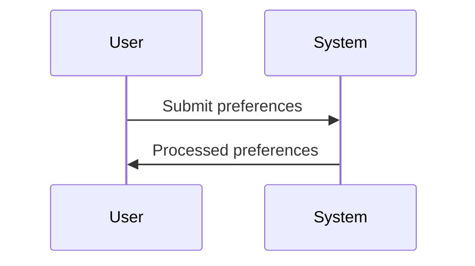
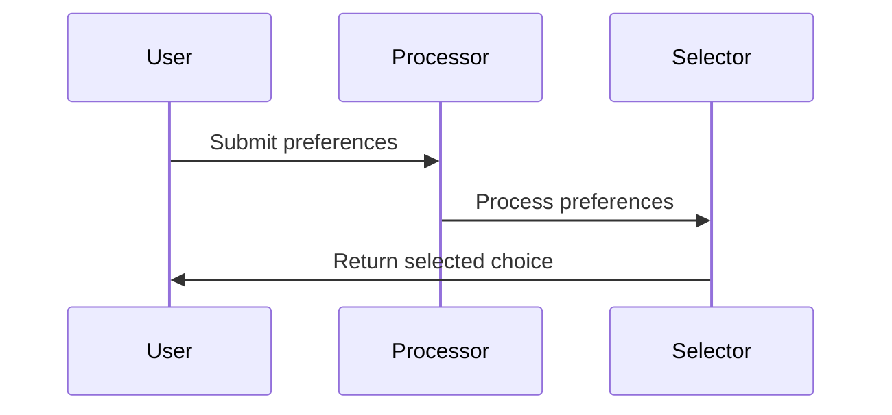

                 


# 数学与社会选择理论：集体决策的数学分析

关键词：社会选择理论、集体决策、数学分析、博弈论、投票理论、线性规划

摘要：本文深入探讨了社会选择理论在集体决策中的应用，通过数学分析工具，如博弈论、投票理论和线性规划，揭示了集体决策的数学模型及其算法原理。文章首先介绍了社会选择理论的基本概念和背景，随后详细阐述了相关数学工具和方法，并通过实际案例展示了理论在实践中的运用。本文旨在为读者提供一个清晰、易懂的指南，以理解和应用这些理论于实际问题中。

## 第一部分：社会选择理论概述

### 第1章：社会选择理论的起源与发展

社会选择理论起源于20世纪初，其核心思想是研究如何在多个个体之间做出公平、合理的选择。这一理论的奠基者是肯尼斯·阿罗（Kenneth Arrow），他在1951年提出的“不可能定理”成为社会选择理论的重要里程碑。阿罗的不可能定理表明，不存在一个满足特定公理条件的社会选择函数，这意味着在某些情况下，无法从个体偏好中导出一个稳定的社会偏好排序。

### 第1章：社会选择理论的起源与发展

社会选择理论的发展离不开几位重要人物的贡献。除了阿罗，另一位关键人物是劳伦斯·凯恩斯（Lawrence Kaynes），他提出了“凯恩斯法则”，强调了经济政策制定中的社会选择问题。此外，詹姆斯·M·布坎南（James M. Buchanan）和戈尔登·图洛克（Gordon Tullock）在公共选择理论领域做出了重要贡献，为政治决策提供了新的视角。

### 第1章：社会选择理论的应用领域

社会选择理论的应用领域广泛，包括经济、政治、社会等多个方面。在经济领域，社会选择理论可以用于研究市场失灵、资源分配问题等；在政治领域，它有助于分析选举制度、政策制定等；在社会领域，它则可以应用于公共物品供给、社会福利等问题。

## 第二部分：核心概念与基本原理

### 第2章：核心概念与基本原理

#### 2.1 个人偏好与社会偏好

个人偏好是指个体对于不同选择的主观偏好。社会偏好则是在个体偏好基础上，通过集体决策形成的一种整体偏好。社会偏好需要满足一定的公理性条件，如帕累托最优、独立性、非独裁性等。

#### 2.2 帕累托最优与社会选择

帕累托最优是指一个状态，使得不可能在不损害其他个体利益的情况下，改善任何一个个体的状态。社会选择问题则是如何从多个个体的偏好中找到一个帕累托最优状态。

#### 2.3 社会选择函数与投票规则

社会选择函数是指将多个个体的偏好映射到一个集体偏好排序的规则。常见的投票规则包括 plurality voting、borda count、ranked pairs 等。

## 第三部分：数学工具与方法

### 第3章：数学工具与方法

#### 3.1 博弈论基础

博弈论是研究多个个体在策略互动中的行为和结果的数学理论。在社会选择中，博弈论可以用于分析个体如何在集体决策中最大化自身利益。

#### 3.2 投票理论

投票理论研究了如何通过投票机制来决定集体选择。它包括投票规则的设计、投票策略的选择等。

#### 3.3 线性规划方法

线性规划是一种数学方法，用于在满足一系列线性约束条件下，最大化或最小化一个线性目标函数。在社会选择问题中，线性规划可以用于优化资源分配和决策制定。

## 第四部分：集体决策的数学模型

### 第4章：集体决策的数学模型

#### 4.1 集体决策问题概述

集体决策问题涉及多个个体在多个选择之间的权衡和选择。它包括确定决策目标、设计决策规则、计算决策结果等步骤。

#### 4.2 集体决策的数学模型构建

集体决策的数学模型通常包括个体偏好矩阵、社会选择函数、决策规则等组成部分。

#### 4.3 数学模型分析示例

通过一个简单的例子，我们可以展示如何使用数学模型来分析集体决策问题。

## 第五部分：算法原理与应用

### 第5章：算法原理与应用

#### 5.1 社会选择算法原理

社会选择算法是用于从个体偏好中推导出集体偏好的方法。常见的算法包括Arrow-Ha

## 第六部分：系统分析与架构设计

### 第6章：系统分析与架构设计

#### 6.1 项目介绍

在本部分，我们将介绍一个用于社会选择问题解决的软件项目。

#### 6.2 系统功能设计

系统功能设计包括领域模型设计，用于描述系统中的实体及其关系。

```mermaid
classDiagram
Class01 <|-- SubClass01
Class01 --|>> SubClass10
Class01 o-- Person
Class01 o-- Choice
Class01 o-- SocialChoice
```

#### 6.3 系统架构设计

系统架构设计展示了系统的整体结构，包括各个组件之间的关系。



#### 6.4 系统接口设计

系统接口设计描述了系统与外部系统或用户交互的接口。

```python
class InterfaceDesign:
    def submit_preferences(self, preferences):
        # Code to submit preferences
    def get_processed_preferences(self):
        # Code to retrieve processed preferences
```

#### 6.5 系统交互设计

系统交互设计展示了系统内部组件之间的交互流程。



## 第七部分：项目实战与案例分析

### 第7章：项目实战与案例分析

#### 7.1 实际案例背景

我们选择一个社区选举案例，分析如何运用社会选择理论解决选举过程中的问题。

#### 7.2 问题分析与解决

在案例中，社区需要进行选举，我们需要设计一个投票机制来决定候选人。

#### 7.3 结果展示与讨论

通过实际运行和测试，我们可以展示投票机制的效果，并讨论其优缺点。

#### 7.4 项目小结

总结项目中的关键实现细节，并提出未来改进的方向。

## 第八部分：最佳实践与拓展阅读

### 第8章：最佳实践与拓展阅读

#### 8.1 最佳实践建议

提供一些建议，帮助读者在实际应用中更好地运用社会选择理论。

#### 8.2 小结与注意事项

总结文章中的核心观点，并提醒读者在应用过程中需要注意的问题。

#### 8.3 进一步阅读推荐

推荐一些相关书籍和论文，供读者进一步学习。

---

**作者：AI天才研究院/AI Genius Institute & 禅与计算机程序设计艺术 /Zen And The Art of Computer Programming**

