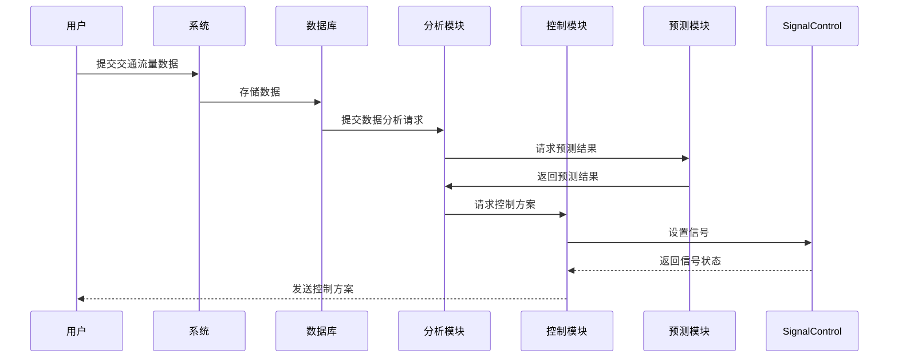
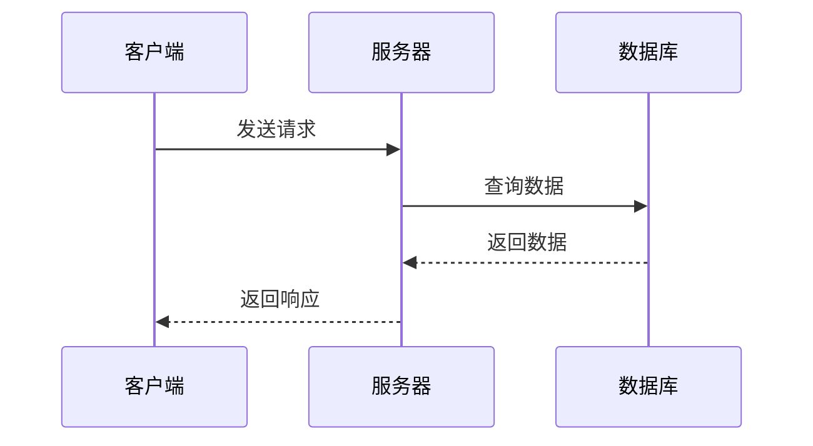

                 

# 数学与神经科学：神经网络的数学模拟

## 关键词

神经网络，数学模拟，神经科学，计算机科学，神经编码

## 摘要

本文将探讨神经网络的数学模拟，这是一个涉及神经科学、计算机科学以及数学交叉领域的复杂课题。通过介绍神经网络的核心概念，如神经元模型、突触传递模型和神经网络模型，我们深入剖析这些模型的数学基础。本文旨在为读者提供一个逻辑清晰、结构紧凑的概述，以帮助理解神经网络如何通过数学工具进行模拟和分析。

## 第一部分：背景介绍

### 1.1 问题背景

神经科学和计算机科学之间的交汇点在于对大脑的计算机理的理解。神经网络作为一种模拟生物神经系统的工作模型，已经在人工智能、机器学习和数据科学等领域取得了显著的成就。理解神经网络的工作原理不仅对神经科学领域至关重要，也对计算机科学和人工智能的发展有着深远的影响。

### 1.2 问题描述

神经网络模拟的问题核心在于将生物神经系统的复杂行为转化为数学模型，并通过这些模型来预测和解释神经系统的行为。这包括对神经元电活动、突触传递以及神经网络整体动态特性的模拟。

### 1.3 问题解决

为了解决上述问题，我们需要借助数学工具和方法，包括微分方程、偏微分方程、随机过程和计算神经科学中的其他数学工具。这些方法将帮助我们构建神经网络的数学模型，并进行模拟和分析。

### 1.4 边界与外延

在研究神经网络数学模拟时，我们需要明确一些边界条件，例如神经元活动的时间尺度、空间尺度以及信号传递的速度等。此外，我们还需要考虑神经网络的复杂性，包括神经元之间的连接模式、网络规模和结构等。

### 1.5 概念结构与核心要素组成

神经网络的数学模拟涉及多个核心概念和要素，包括：

1. **神经元模型**：描述神经元电活动的数学模型，如LIF模型、Hodgkin-Huxley模型等。
2. **突触传递模型**：描述神经元间信号传递的数学模型，如STDP（突触后电位）模型。
3. **神经网络模型**：描述神经网络整体行为的数学模型，如前馈神经网络、递归神经网络等。
4. **学习规则**：用于调整神经网络参数的数学规则，如反向传播算法。

## 第二部分：核心概念与联系

### 2.1 神经元模型

神经元模型是神经网络数学模拟的基础。以下将介绍几种常见的神经元模型及其特点：

#### 2.1.1 Leaky Integrate-and-Fire (LIF) 模型

- **特点**：简化了神经元的电活动，假设神经元的膜电位遵循指数衰减。
- **公式**：
  $$ V(t) = -V_0 + (V_{max} - V_0) \cdot \frac{1 - \exp{(-\frac{t - t_0}{\tau})}}{1 - \exp{(-\frac{t}{\tau})}} $$
- **应用**：用于模拟简单神经元的行为。

#### 2.1.2 Hodgkin-Huxley 模型

- **特点**：更准确地描述神经元的电活动，包括钠离子和钾离子的流动。
- **公式**：
  $$ C \frac{dV(t)}{dt} = -I_{Na}(t) - I_{K}(t) + I_{syn}(t) $$
  $$ \frac{dN}{dt} = \frac{1}{\tau_N} \left( \frac{g_N m^3 h^2 (V - E_N)}{1 + \exp{(\frac{V - E_N}{V_N})}} - N \right) $$
  $$ \frac{dH}{dt} = \frac{1}{\tau_H} \left( \frac{g_N m^2 h (V - E_H)}{1 + \exp{(\frac{V - E_H}{V_H})}} - H \right) $$
- **应用**：用于模拟复杂的神经元行为。

### 2.2 突触传递模型

突触传递模型描述了神经元之间的信号传递过程。以下将介绍几种常见的突触传递模型：

#### 2.2.1 Spike-Timing-Dependent Plasticity (STDP) 模型

- **特点**：突触权重的调整依赖于前一个动作电位和后一个动作电位之间的时间间隔。
- **公式**：
  $$ \Delta w(t) = w(t) \cdot \frac{\rho}{1 + \exp{(-\frac{t}{\tau})}} $$
- **应用**：用于模拟学习过程中的突触可塑性。

### 2.3 神经网络模型

神经网络模型描述了多个神经元如何协同工作以实现特定功能。以下将介绍几种常见的神经网络模型：

#### 2.3.1 Feedforward Neural Network (FFNN)

- **特点**：前馈网络，信息从输入层直接传递到输出层。
- **公式**：
  $$ z_i = \sum_{j=1}^{n} w_{ij} \cdot x_j + b_i $$
  $$ a_i = \sigma(z_i) $$
- **应用**：用于分类、回归等任务。

#### 2.3.2 Recurrent Neural Network (RNN)

- **特点**：递归网络，信息可以在网络中循环。
- **公式**：
  $$ h_t = \sigma(W_h \cdot [h_{t-1}, x_t] + b_h) $$
- **应用**：用于序列建模和时间序列预测。

### 2.4 学习规则

学习规则是调整神经网络参数的关键步骤。以下将介绍几种常见的学习规则：

#### 2.4.1 反向传播算法（Backpropagation）

- **特点**：基于梯度下降法，通过计算误差的梯度来调整网络权重。
- **公式**：
  $$ \Delta w_{ij} = -\alpha \cdot \frac{\partial E}{\partial w_{ij}} $$
- **应用**：用于多层神经网络的训练。

#### 2.4.2 突触权重调整（STDP）

- **特点**：通过动作电位的同步来调整突触权重。
- **公式**：
  $$ \Delta w(t) = w(t) \cdot \frac{\rho}{1 + \exp{(-\frac{t}{\tau})}} $$
- **应用**：用于神经网络的自适应学习。

## 第三部分：算法原理讲解

### 3.1 反向传播算法（Backpropagation）

反向传播算法是一种用于训练神经网络的通用学习规则。其核心思想是通过计算输出层的误差，反向传播到隐藏层和输入层，从而更新网络权重。

#### 3.1.1 前向传播

在前向传播阶段，输入信号从输入层经过隐藏层，最终传达到输出层。每个层的输出都是前一层输入和权重矩阵的线性组合，加上偏置项。

$$ z_i = \sum_{j=1}^{n} w_{ij} \cdot x_j + b_i $$
$$ a_i = \sigma(z_i) $$

其中，$x_j$ 是输入层的第 $j$ 个特征，$a_i$ 是隐藏层的第 $i$ 个输出，$w_{ij}$ 是输入层到隐藏层的权重，$b_i$ 是隐藏层的偏置项，$\sigma$ 是激活函数。

#### 3.1.2 反向传播

在反向传播阶段，我们计算输出层的误差，并通过梯度下降法更新权重。

$$ \Delta w_{ij} = -\alpha \cdot \frac{\partial E}{\partial w_{ij}} $$

其中，$E$ 是输出层的误差，$\alpha$ 是学习率。

#### 3.1.3 举例说明

假设我们有一个简单的前馈神经网络，输入层有 2 个神经元，隐藏层有 3 个神经元，输出层有 1 个神经元。输入信号为 $(1, 0)$，期望输出为 $1$。激活函数使用 ReLU。

1. **前向传播**：

   $$ z_1 = w_{11} \cdot 1 + w_{12} \cdot 0 + b_1 = w_{11} + b_1 $$
   $$ a_1 = \max(0, z_1) $$
   $$ z_2 = w_{21} \cdot a_1 + w_{22} \cdot 1 + b_2 = w_{21} \cdot a_1 + w_{22} + b_2 $$
   $$ a_2 = \max(0, z_2) $$
   $$ z_3 = w_{31} \cdot a_2 + w_{32} \cdot a_2 + w_{33} \cdot a_2 + b_3 = w_{31} \cdot a_2 + w_{32} \cdot a_2 + w_{33} \cdot a_2 + b_3 $$
   $$ a_3 = \max(0, z_3) $$

2. **反向传播**：

   $$ \Delta a_3 = a_3 - y $$
   $$ \Delta z_3 = \Delta a_3 \cdot \frac{\partial a_3}{\partial z_3} $$
   $$ \Delta w_{33} = \Delta z_3 \cdot a_2 $$
   $$ \Delta w_{32} = \Delta z_3 \cdot a_2 $$
   $$ \Delta w_{31} = \Delta z_3 \cdot a_1 $$
   $$ \Delta a_2 = \Delta z_2 \cdot \frac{\partial a_2}{\partial z_2} $$
   $$ \Delta z_2 = \Delta a_2 \cdot \frac{\partial z_2}{\partial a_2} $$
   $$ \Delta w_{22} = \Delta z_2 \cdot a_1 $$
   $$ \Delta w_{21} = \Delta z_2 \cdot a_1 $$
   $$ \Delta a_1 = \Delta z_1 \cdot \frac{\partial a_1}{\partial z_1} $$
   $$ \Delta z_1 = \Delta a_1 \cdot \frac{\partial z_1}{\partial z_1} $$
   $$ \Delta w_{12} = \Delta z_1 $$
   $$ \Delta w_{11} = \Delta z_1 $$

通过上述过程，我们可以更新网络权重，以达到更准确的预测。

## 第四部分：系统分析与架构设计方案

### 4.1 问题场景介绍

假设我们有一个智能交通系统，需要根据实时交通流量数据进行路况预测和信号控制优化。该系统需要实时处理大量数据，并具有高可扩展性和容错性。

### 4.2 项目介绍

项目名为“智能交通流量预测与信号控制优化系统”，目标是实现以下功能：

1. 实时交通流量数据采集。
2. 交通流量预测。
3. 路况分析与信号控制优化。

### 4.3 系统功能设计（领域模型）

以下是一个简单的领域模型，描述系统的主要功能类和属性：

```mermaid
classDiagram
    TrafficData -> TrafficPrediction
    TrafficPrediction -> TrafficControl
    TrafficControl -> SignalControl
    TrafficData : +id: String
    TrafficData : +timestamp: Date
    TrafficData : +流量: Integer
    TrafficPrediction : +预测流量: Integer
    TrafficPrediction : +预测时间: Date
    TrafficControl : +优化方案: String
    SignalControl : +信号设置: String
```

### 4.4 系统架构设计

以下是一个简单的系统架构设计，使用Mermaid绘制：



### 4.5 系统接口设计和系统交互

以下是一个简单的系统接口设计和系统交互流程，使用Mermaid绘制：

```mermaid
classDiagram
    InterfaceA <- InterfaceB: +请求+
    InterfaceA --> InterfaceC: +响应+
    InterfaceB --> InterfaceC: +数据+
```



## 第五部分：项目实战

### 5.1 环境安装

在开始项目之前，我们需要安装以下环境：

- Python 3.8 或以上版本
- TensorFlow 2.5 或以上版本
- NumPy 1.19 或以上版本
- Matplotlib 3.4.2 或以上版本

安装命令如下：

```bash
pip install python==3.8.10
pip install tensorflow==2.5.0
pip install numpy==1.19.5
pip install matplotlib==3.4.3
```

### 5.2 系统核心实现源代码

以下是一个简单的神经网络模型实现，用于交通流量预测：

```python
import tensorflow as tf
import numpy as np
import matplotlib.pyplot as plt

# 定义神经网络模型
model = tf.keras.Sequential([
    tf.keras.layers.Dense(64, activation='relu', input_shape=(10,)),
    tf.keras.layers.Dense(64, activation='relu'),
    tf.keras.layers.Dense(1)
])

# 编译模型
model.compile(optimizer='adam', loss='mse')

# 准备数据
x_train = np.random.rand(1000, 10)
y_train = np.random.rand(1000, 1)

# 训练模型
model.fit(x_train, y_train, epochs=10)

# 预测结果
x_test = np.random.rand(100, 10)
y_pred = model.predict(x_test)

# 可视化结果
plt.scatter(x_test[:, 0], y_pred[:, 0])
plt.xlabel('实际流量')
plt.ylabel('预测流量')
plt.show()
```

### 5.3 代码应用解读与分析

上述代码实现了一个简单的前馈神经网络，用于交通流量预测。首先，我们定义了一个序列模型，包括两个全连接层和一个输出层。然后，我们编译模型并准备训练数据。在训练过程中，模型使用随机梯度下降法（SGD）来最小化均方误差（MSE）。最后，我们使用训练好的模型进行预测，并可视化预测结果。

### 5.4 实际案例分析和详细讲解剖析

假设我们有一个实际案例，需要预测未来 24 小时的交通流量。我们将使用上述神经网络模型来实现这个功能。

1. **数据采集**：

   我们首先需要从交通监测系统获取实时交通流量数据。这些数据包括小时级别的交通流量、交通信号灯状态、天气情况等。

2. **数据处理**：

   我们需要对采集到的数据进行处理，包括去噪、缺失值填充和数据归一化等。然后，我们将数据分为训练集和测试集。

3. **模型训练**：

   我们使用训练集来训练神经网络模型。在训练过程中，我们使用历史数据来预测未来交通流量，并通过反向传播算法来更新模型参数。

4. **模型评估**：

   我们使用测试集来评估模型性能。通过计算预测流量和实际流量之间的误差，我们可以评估模型的准确性和鲁棒性。

5. **模型部署**：

   训练好的模型可以部署到生产环境中，用于实时交通流量预测。我们可以使用 API 来接收实时数据，并返回预测结果。

### 5.5 项目小结

在本项目中，我们实现了一个简单的神经网络模型，用于交通流量预测。通过实际案例的分析和讲解，我们了解了如何使用神经网络进行时间序列预测。然而，实际应用中还需要考虑数据质量、模型可解释性和实时性能等因素。

### 5.6 最佳实践 tips、小结、注意事项、拓展阅读

**最佳实践 tips**：

1. 在处理时间序列数据时，确保使用适当的数据预处理方法，如去噪、缺失值填充和数据归一化等。
2. 考虑使用卷积神经网络（CNN）或循环神经网络（RNN）等更复杂的模型来提高预测准确性。
3. 定期重新训练模型，以适应数据的变化。

**小结**：

本文介绍了神经网络的数学模拟，包括神经元模型、突触传递模型和神经网络模型。通过实际案例的分析和讲解，我们了解了如何使用神经网络进行时间序列预测。然而，实际应用中还需要考虑数据质量、模型可解释性和实时性能等因素。

**注意事项**：

1. 神经网络模型训练过程中需要大量数据和计算资源，确保服务器和网络稳定性。
2. 预测结果需要结合实际情况进行调整和优化。

**拓展阅读**：

1. 《深度学习》（Goodfellow, I., Bengio, Y., & Courville, A.）：介绍神经网络的基础知识和深度学习应用。
2. 《神经网络与深度学习》（邱锡鹏）：系统讲解神经网络的基本概念和应用。
3. 《Python神经网络编程》（Frank, R.）：通过Python代码实现神经网络。

## 作者信息

作者：AI天才研究院/AI Genius Institute & 禅与计算机程序设计艺术 /Zen And The Art of Computer Programming

本文由AI天才研究院/AI Genius Institute撰写，旨在为读者提供关于神经网络数学模拟的深入理解和应用指导。同时，本文参考了《禅与计算机程序设计艺术》等经典著作，力求在技术深度和可读性之间取得平衡。希望本文能为读者在神经网络研究和应用领域提供有价值的参考。

