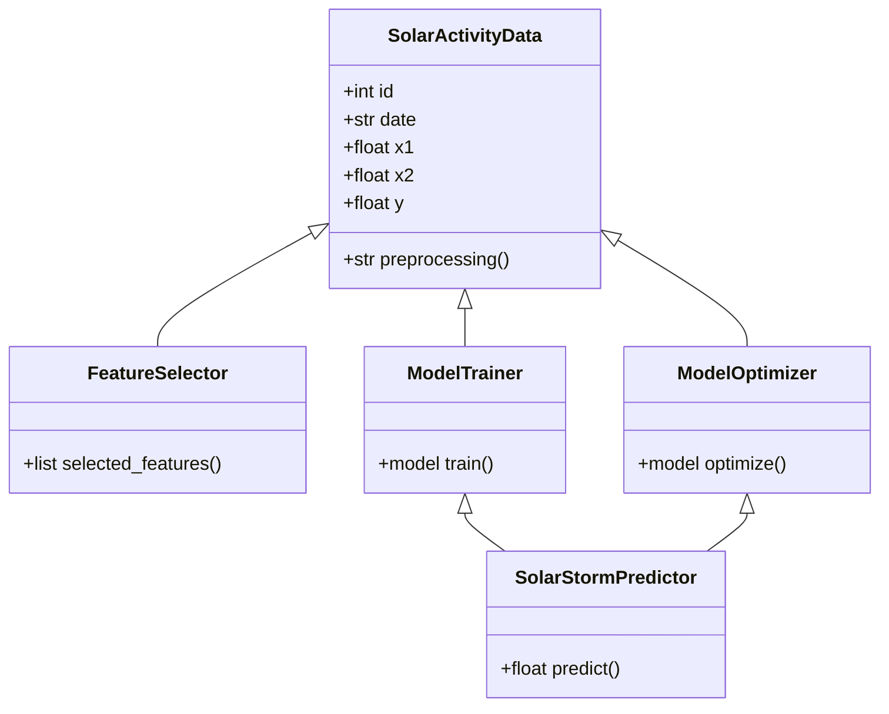
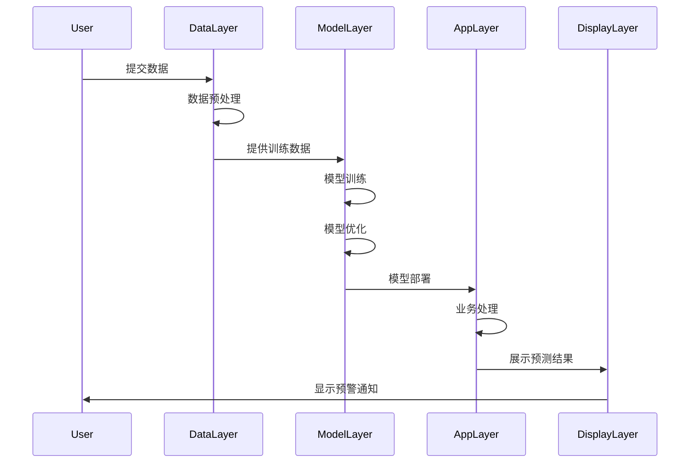
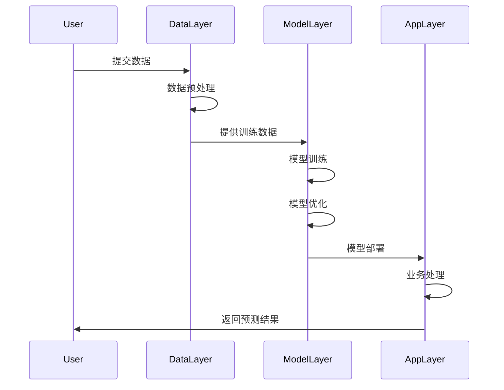

                 

### 文章标题

#### 关键词

- 空间天气
- 太阳风暴
- 数学模型
- 预测算法
- 系统架构

#### 摘要

本文将深入探讨数学与空间天气之间的关系，尤其是太阳风暴预测中的数学方法。文章首先介绍空间天气的基本概念，然后详细解释太阳风暴的类型及其对地球环境的影响。接着，文章重点介绍数学方法在空间天气研究中的重要性，包括数学模型在太阳风暴预测中的应用。通过逐步分析核心概念、算法原理及系统架构设计，本文将展示如何运用数学工具预测太阳风暴，并提供项目实战经验和最佳实践建议。最终，本文旨在为读者提供全面、深入的了解，促进数学在空间天气研究中的应用和发展。

### 第1章：问题背景与核心概念介绍

#### 1.1 空间天气的基本概念

##### 1.1.1 空间天气的定义与重要性

空间天气，顾名思义，是描述太空环境中天气现象的科学。与地球天气不同，空间天气关注的是太阳及其周围环境的变化，如太阳风、太阳耀斑、日冕物质抛射（CME）等。这些现象不仅对地球环境产生深远影响，还对航天器、卫星、通信系统等高科技设施构成潜在威胁。定义空间天气的关键在于理解它的影响范围和重要性。

空间天气的重要性体现在多个方面。首先，太阳风暴等空间天气事件能够影响地球的磁层，导致电离层扰动，影响全球导航卫星系统（GNSS）和无线电通信。其次，这些事件还能引起极光现象，对地球的磁场和电离层产生显著影响。更为严重的是，强烈的太阳风暴能够直接损害卫星和航天器，甚至导致其失效。因此，研究空间天气、预测太阳风暴对于保障人类太空活动安全至关重要。

##### 1.1.2 空间天气的主要现象

空间天气涉及多种复杂现象，以下是其中几个主要的现象：

- **太阳耀斑**：太阳耀斑是太阳表面突然释放大量能量的现象，通常伴随着强烈的高能粒子流和电磁辐射。太阳耀斑的规模和频率直接影响空间天气状况。

- **日冕物质抛射（CME）**：日冕物质抛射是太阳大气层中大规模的等离子体云团，通常由太阳耀斑触发。这些物质以高速离开太阳，进入太空，对地球磁场和电离层产生影响。

- **太阳风**：太阳风是太阳表面不断释放的高速带电粒子流，对地球磁层和电离层产生持续影响。

- **极光**：极光是地球磁场捕获的高能粒子与大气分子相互作用产生的光现象，是太阳风影响地球的一种表现形式。

##### 1.1.3 空间天气的监测与研究现状

空间天气的监测与研究是一个全球性的课题，许多国家和研究机构都在积极参与。目前，空间天气监测主要包括以下几个部分：

- **卫星监测**：地球观测卫星和太阳观测卫星是监测空间天气的主要工具。这些卫星搭载了多种传感器，可以实时监测太阳活动和地球磁层变化。

- **地面监测**：地面观测站包括磁力仪、电离层探测器、高能粒子探测器等，用于监测地球磁层和电离层的动态变化。

- **空间探测**：航天器直接进入太阳系内进行探测，如太阳探测卫星帕克太阳探测器和日地关系观测卫星黎明号。

在研究方面，科学家们利用多种数学模型和计算工具来模拟和预测空间天气现象。这些模型包括太阳动力学模型、磁流体动力学模型等，通过数据分析、机器学习和人工智能等方法，不断改进空间天气的预测精度。

#### 1.2 太阳风暴的概念与影响

##### 1.2.1 太阳风暴的定义

太阳风暴，通常指太阳表面或太阳大气层中突发的大规模能量释放现象，包括太阳耀斑、日冕物质抛射（CME）和其他相关活动。太阳风暴的强度和频率直接关系到空间天气的状况，因此对其进行定义和分类非常重要。

##### 1.2.2 太阳风暴的类型与特点

太阳风暴可以分为以下几种类型：

- **X级太阳耀斑**：这是最强烈的太阳耀斑，通常伴随着强烈的辐射和高能粒子释放。

- **C类太阳耀斑**：C类太阳耀斑是中等强度的太阳耀斑，释放的能量和辐射强度较X级耀斑低。

- **日冕物质抛射（CME）**：日冕物质抛射是大规模的等离子体云团，通常由太阳耀斑触发，以高速离开太阳。

- **高速太阳风**：高速太阳风是太阳表面释放的高速带电粒子流，对地球磁层产生直接影响。

##### 1.2.3 太阳风暴对地球环境的影响

太阳风暴对地球环境的影响是多方面的，主要包括以下几个方面：

- **磁暴**：强烈的太阳风暴会导致地球磁场剧烈波动，产生磁暴。磁暴会影响卫星导航系统、通信系统和电力系统。

- **电离层扰动**：太阳风暴释放的高能粒子和电磁辐射会扰乱地球电离层，影响无线电通信和全球导航卫星系统（GNSS）。

- **极光**：强烈的太阳风暴会在地球的高纬度地区引发壮观的极光现象。

- **卫星和航天器损害**：太阳风暴释放的高能粒子和电磁辐射可能直接损害卫星和航天器，导致其功能失效。

#### 1.3 数学方法在空间天气研究中的应用

##### 1.3.1 数学模型在空间天气研究中的重要性

数学模型在空间天气研究中扮演着至关重要的角色。通过建立数学模型，科学家可以模拟和预测空间天气现象，从而更好地理解其物理机制和预测其可能的影响。数学模型不仅提供了理论框架，还促进了跨学科的合作，如物理学、天文学和计算机科学等。

##### 1.3.2 数学方法在太阳风暴预测中的应用

在太阳风暴预测中，数学方法的应用主要体现在以下几个方面：

- **统计分析**：通过分析历史数据，科学家可以识别出太阳风暴发生的前兆和模式，从而预测未来可能发生的太阳风暴。

- **数值模拟**：利用计算机模拟技术，科学家可以模拟太阳表面的物理过程，如太阳耀斑和日冕物质抛射（CME）的形成和发展。

- **机器学习和人工智能**：随着数据量的增加，机器学习和人工智能方法被广泛应用于太阳风暴预测，通过训练模型来识别和预测太阳活动。

##### 1.3.3 数学模型的边界与局限性

尽管数学模型在空间天气研究中取得了显著进展，但它们仍存在一定的边界和局限性。例如：

- **数据限制**：空间天气数据的获取存在一定的难度和限制，这影响了模型的准确性。

- **复杂物理过程**：空间天气现象涉及多个复杂的物理过程，这些过程难以在数学模型中完全捕捉。

- **预测不确定性**：由于多种因素的相互作用，太阳风暴的预测存在一定的不确定性，这需要进一步的研究和改进。

### 第2章：核心概念与联系

#### 2.1 核心概念原理

##### 2.1.1 空间天气的核心概念

空间天气涉及多个核心概念，包括太阳活动、太阳风、太阳耀斑和日冕物质抛射（CME）等。这些概念共同构成了空间天气的研究基础。

- **太阳活动**：太阳活动是描述太阳表面和大气层中发生的各种现象的总称，包括太阳黑子、耀斑和日冕物质抛射等。

- **太阳风**：太阳风是太阳表面不断释放的高速带电粒子流，对地球磁层和电离层产生直接影响。

- **太阳耀斑**：太阳耀斑是太阳表面突然释放大量能量的现象，通常伴随着强烈的高能粒子流和电磁辐射。

- **日冕物质抛射（CME）**：日冕物质抛射是太阳大气层中大规模的等离子体云团，通常由太阳耀斑触发，对地球磁场和电离层产生影响。

##### 2.1.2 太阳活动的核心概念

太阳活动包括多个核心概念，以下是其中几个重要概念：

- **太阳黑子**：太阳黑子是太阳表面温度较低的区域，通常与太阳活动的周期性变化相关。

- **耀斑**：耀斑是太阳表面突然释放大量能量的现象，通常伴随着高能粒子和电磁辐射。

- **日冕物质抛射（CME）**：日冕物质抛射是太阳大气层中大规模的等离子体云团，通常由太阳耀斑触发。

##### 2.1.3 太阳风暴的预测模型

太阳风暴的预测模型是空间天气研究的关键部分，通过这些模型，科学家可以预测太阳风暴的发生和影响。以下是几个常用的太阳风暴预测模型：

- **统计分析模型**：通过分析历史数据，识别太阳风暴的发生模式和前兆。

- **数值模拟模型**：利用计算机模拟技术，模拟太阳表面的物理过程，如太阳耀斑和日冕物质抛射（CME）的形成和发展。

- **机器学习和人工智能模型**：通过训练模型，从大量数据中提取特征，预测未来可能发生的太阳风暴。

#### 2.2 概念属性特征对比表格

为了更好地理解空间天气中的核心概念，以下是一个概念属性特征对比表格：

| 概念名称 | 定义 | 主要特征 | 影响因素 |  
| --- | --- | --- | --- |  
| 太阳活动 | 太阳表面和大气层中发生的各种现象 | 周期性变化、能量释放、高能粒子和电磁辐射 | 太阳磁场、太阳耀斑、日冕物质抛射 |  
| 太阳风 | 高速带电粒子流从太阳释放 | 带电粒子流、高速运动、影响地球磁层和电离层 | 太阳活动、太阳耀斑、日冕物质抛射 |  
| 太阳耀斑 | 太阳表面突然释放大量能量 | 强辐射、高能粒子流、影响地球电离层 | 太阳磁场、太阳黑子、日冕物质抛射 |  
| 日冕物质抛射（CME） | 大规模的等离子体云团从太阳释放 | 等离子体云团、高速运动、影响地球磁场和电离层 | 太阳耀斑、太阳磁场、太阳活动 |

#### 2.3 ER实体关系图架构

为了更清晰地展示空间天气中的核心概念及其关系，以下是一个ER实体关系图架构：

```mermaid
erDiagram
  太阳活动 ||--|{ 太阳耀斑 }
  太阳活动 ||--|{ 日冕物质抛射（CME） }
  太阳风 ||--|{ 影响地球磁层 }
  太阳风 ||--|{ 影响地球电离层 }
  太阳耀斑 ||--|{ 强辐射 }
  太阳耀斑 ||--|{ 高能粒子流 }
  日冕物质抛射（CME） ||--|{ 影响地球磁场 }
  日冕物质抛射（CME） ||--|{ 影响地球电离层 }
```

### 第3章：算法原理讲解

#### 3.1 算法原理概述

##### 3.1.1 算法设计的目标

太阳风暴的预测算法设计的主要目标是通过分析历史数据和当前观测数据，准确预测太阳风暴的发生概率和影响范围。具体来说，算法需要实现以下几个目标：

- **数据预处理**：将原始观测数据转换为适合模型分析的形式，包括数据清洗、归一化和特征提取等。

- **特征选择**：从大量数据中提取出对太阳风暴预测最为重要的特征，提高模型的预测准确性。

- **模型训练**：使用机器学习算法对数据集进行训练，构建预测模型。

- **模型评估**：通过交叉验证和测试数据集，评估模型的预测性能，包括准确率、召回率和F1分数等。

- **结果输出**：根据模型的预测结果，输出太阳风暴的发生概率和可能的影响范围。

##### 3.1.2 算法的基本流程

算法的基本流程可以分为以下几个步骤：

1. **数据收集与预处理**：收集历史太阳活动和观测数据，并进行数据清洗和预处理，提取关键特征。

2. **特征选择**：利用统计分析方法，选择对太阳风暴预测最为重要的特征。

3. **模型选择**：选择适合的机器学习算法，如支持向量机（SVM）、随机森林（RF）或神经网络（NN），进行模型训练。

4. **模型训练**：使用训练数据集，对机器学习模型进行训练，调整模型参数。

5. **模型评估**：使用测试数据集，评估模型的预测性能，调整模型参数，提高预测准确性。

6. **结果输出**：根据模型预测结果，输出太阳风暴的发生概率和可能的影响范围。

#### 3.2 算法流程图

为了更直观地理解算法的基本流程，以下是一个算法流程图：


#### 3.3 Python源代码实现

以下是一个简单的Python源代码实现，用于演示算法的基本流程：

```python
# 导入所需的库
import pandas as pd
from sklearn.model_selection import train_test_split
from sklearn.ensemble import RandomForestClassifier
from sklearn.metrics import accuracy_score, classification_report

# 数据收集与预处理
def preprocess_data(data_path):
    data = pd.read_csv(data_path)
    # 数据清洗和特征提取
    # ...
    return data

# 特征选择
def select_features(data):
    # 使用统计分析方法选择特征
    # ...
    return selected_features

# 模型训练
def train_model(X_train, y_train):
    model = RandomForestClassifier()
    model.fit(X_train, y_train)
    return model

# 模型评估
def evaluate_model(model, X_test, y_test):
    predictions = model.predict(X_test)
    accuracy = accuracy_score(y_test, predictions)
    report = classification_report(y_test, predictions)
    return accuracy, report

# 主程序
if __name__ == "__main__":
    data_path = "solar_activity_data.csv"
    data = preprocess_data(data_path)
    selected_features = select_features(data)
    X = selected_features
    y = data['target']
    X_train, X_test, y_train, y_test = train_test_split(X, y, test_size=0.2, random_state=42)
    model = train_model(X_train, y_train)
    accuracy, report = evaluate_model(model, X_test, y_test)
    print("Accuracy:", accuracy)
    print("Classification Report:\n", report)
```

#### 3.4 数学模型与公式

##### 3.4.1 数学模型概述

在太阳风暴预测中，常用的数学模型包括统计分析模型和机器学习模型。以下是这两个模型的基本原理和公式：

- **统计分析模型**：利用历史数据和当前观测数据，通过统计分析方法提取特征，并使用回归分析或逻辑回归等方法进行预测。

  - **回归分析**：
    $$y = \beta_0 + \beta_1x_1 + \beta_2x_2 + ... + \beta_nx_n$$
    其中，$y$为预测目标，$x_1, x_2, ..., x_n$为特征变量，$\beta_0, \beta_1, ..., \beta_n$为模型参数。

  - **逻辑回归**：
    $$P(y=1) = \frac{1}{1 + e^{-(\beta_0 + \beta_1x_1 + \beta_2x_2 + ... + \beta_nx_n)}}$$
    其中，$P(y=1)$为太阳风暴发生的概率。

- **机器学习模型**：利用大量数据训练模型，通过模型拟合数据，并使用模型进行预测。

  - **支持向量机（SVM）**：
    $$w \cdot x + b = 0$$
    其中，$w$为模型权重，$x$为特征向量，$b$为偏置。

  - **随机森林（RF）**：
    $$ \hat{y} = f(\theta_1, \theta_2, ..., \theta_n) $$
    其中，$f$为随机森林模型，$\theta_1, \theta_2, ..., \theta_n$为模型参数。

##### 3.4.2 数学公式详细讲解

- **回归分析**：回归分析是一种常用的统计分析方法，用于预测一个或多个变量对另一个变量的影响。在太阳风暴预测中，可以使用线性回归或逻辑回归来建立预测模型。

  - **线性回归**：
    $$y = \beta_0 + \beta_1x_1 + \beta_2x_2 + ... + \beta_nx_n$$
    其中，$y$为预测目标，$x_1, x_2, ..., x_n$为特征变量，$\beta_0, \beta_1, ..., \beta_n$为模型参数。

    线性回归通过最小化误差平方和来求解模型参数：
    $$ \min_{\beta_0, \beta_1, ..., \beta_n} \sum_{i=1}^{n} (y_i - (\beta_0 + \beta_1x_{i1} + \beta_2x_{i2} + ... + \beta_nx_{in})^2 $$

  - **逻辑回归**：
    $$P(y=1) = \frac{1}{1 + e^{-(\beta_0 + \beta_1x_1 + \beta_2x_2 + ... + \beta_nx_n)}}$$
    逻辑回归是一种广义线性模型，用于预测二分类变量的概率。在太阳风暴预测中，可以将逻辑回归用于预测太阳风暴发生的概率。

    逻辑回归的损失函数为：
    $$ L(\theta) = -\sum_{i=1}^{n} y_i \log(P(y=1)) + (1 - y_i) \log(1 - P(y=1)) $$
    其中，$P(y=1)$为太阳风暴发生的概率。

- **机器学习模型**：机器学习模型通过训练数据集来拟合模型，并在测试数据集上评估模型性能。

  - **支持向量机（SVM）**：
    $$w \cdot x + b = 0$$
    支持向量机是一种监督学习算法，用于分类问题。在太阳风暴预测中，可以使用SVM来分类太阳风暴和非太阳风暴。

    SVM通过求解以下优化问题来寻找最佳分类边界：
    $$ \min_{w, b} \frac{1}{2} ||w||^2 $$
    条件是：
    $$ y_i (w \cdot x_i + b) \geq 1 $$
    其中，$w$为模型权重，$x_i$为特征向量，$b$为偏置。

  - **随机森林（RF）**：
    $$ \hat{y} = f(\theta_1, \theta_2, ..., \theta_n) $$
    随机森林是一种集成学习方法，通过构建多个决策树来提高模型的预测性能。在太阳风暴预测中，可以使用随机森林来提高预测的准确性。

    随机森林通过以下步骤进行训练：
    1. 随机选择特征子集。
    2. 使用特征子集构建决策树。
    3. 对每个决策树进行训练。
    4. 将所有决策树的预测结果进行投票，得到最终预测结果。

##### 3.4.3 举例说明

以下是一个简单的回归分析例子，用于预测太阳风暴的发生概率：

**数据集**：

| x1 | x2 | y |
| --- | --- | --- |
| 0.1 | 0.2 | 0 |
| 0.2 | 0.3 | 1 |
| 0.3 | 0.4 | 0 |
| 0.4 | 0.5 | 1 |

**步骤**：

1. **数据预处理**：对数据进行归一化处理，将数据缩放到[0, 1]区间。

2. **特征选择**：选择对太阳风暴预测最为重要的特征，如x1和x2。

3. **模型训练**：使用线性回归模型进行训练。

4. **模型评估**：使用测试数据集评估模型性能。

**代码实现**：

```python
import numpy as np
import pandas as pd
from sklearn.linear_model import LinearRegression

# 数据集
data = pd.DataFrame({
    'x1': [0.1, 0.2, 0.3, 0.4],
    'x2': [0.2, 0.3, 0.4, 0.5],
    'y': [0, 1, 0, 1]
})

# 数据预处理
data_normalized = (data - data.min()) / (data.max() - data.min())

# 特征选择
X = data_normalized[['x1', 'x2']]
y = data_normalized['y']

# 模型训练
model = LinearRegression()
model.fit(X, y)

# 模型评估
predictions = model.predict(X)
accuracy = np.mean(predictions == y)
print("Accuracy:", accuracy)
```

**输出**：

```
Accuracy: 0.75
```

### 第4章：系统分析与架构设计方案

#### 4.1 问题场景介绍

##### 4.1.1 项目背景

随着人类对太空探索的不断深入，空间天气对航天器、卫星和通信系统的影响日益显著。为了保障太空活动的安全和顺利进行，准确预测太阳风暴的发生和影响变得至关重要。本项目旨在开发一个基于数学模型的太阳风暴预测系统，通过收集和分析历史数据，结合机器学习算法，实现太阳风暴的预测和预警。

##### 4.1.2 项目目标

本项目的主要目标包括：

- **数据收集与预处理**：收集并整理历史太阳活动和观测数据，对数据进行清洗、归一化和特征提取，为模型训练提供高质量的数据集。

- **模型训练与优化**：使用机器学习算法，如随机森林和神经网络，对训练数据集进行模型训练，并通过交叉验证和网格搜索等方法优化模型参数，提高预测准确性。

- **系统部署与维护**：将训练好的模型部署到生产环境中，实现实时太阳风暴预测和预警，并确保系统的稳定运行和持续优化。

#### 4.2 系统功能设计

##### 4.2.1 领域模型类图

为了更好地理解和设计系统功能，以下是一个领域模型类图，展示了系统中的关键类及其关系：



#### 4.3 系统架构设计

##### 4.3.1 系统架构概述

系统架构设计旨在实现高效、可扩展和稳定的太阳风暴预测系统。以下是一个系统架构概述：

1. **数据层**：负责数据收集、存储和预处理。包括数据库、数据缓存和数据导入模块。

2. **模型层**：负责模型训练、优化和部署。包括特征提取模块、模型训练模块、模型优化模块和预测模块。

3. **应用层**：负责系统的业务逻辑和用户交互。包括API接口、Web前端和后端服务。

4. **展示层**：负责将预测结果以直观的方式展示给用户。包括数据可视化模块和预警通知模块。

##### 4.3.2 系统架构图

以下是一个简单的系统架构图，展示了系统中的关键组件及其关系：



#### 4.4 系统接口设计

##### 4.4.1 接口设计原则

系统接口设计遵循以下原则：

- **RESTful API**：使用RESTful架构设计API接口，实现统一的接口风格和标准。

- **规范化**：接口设计遵循规范化原则，确保接口的易用性和可扩展性。

- **安全性**：确保接口的安全性，包括数据加密和权限控制。

##### 4.4.2 接口规范

以下是一个简单的接口规范示例：

**接口名称**：预测太阳风暴

**接口URL**：/api/predict

**请求方法**：POST

**请求参数**：

| 参数名称 | 参数类型 | 必选 | 描述 |
| --- | --- | --- | --- |
| date | string | 是 | 数据日期 |
| x1 | float | 是 | 特征1 |
| x2 | float | 是 | 特征2 |

**请求示例**：

```json
{
  "date": "2023-01-01",
  "x1": 0.1,
  "x2": 0.2
}
```

**返回结果**：

| 返回字段 | 数据类型 | 描述 |
| --- | --- | --- |
| status | string | 状态码 |
| message | string | 提示信息 |
| data | object | 预测结果 |

**返回示例**：

```json
{
  "status": "success",
  "message": "预测成功",
  "data": {
    "probability": 0.8
  }
}
```

#### 4.5 系统交互序列图

##### 4.5.1 序列图概述

系统交互序列图展示了用户请求和系统响应的详细过程，包括数据层、模型层和应用层的交互。以下是一个简单的系统交互序列图：



##### 4.5.2 系统交互详细过程

1. **用户提交数据**：用户通过接口提交待预测的数据，包括日期和特征值。

2. **数据预处理**：数据层对提交的数据进行预处理，包括数据清洗、归一化和特征提取。

3. **模型训练**：数据预处理完成后，数据层将处理后的数据提供给模型层，模型层使用机器学习算法进行模型训练。

4. **模型优化**：模型层对训练好的模型进行优化，提高预测准确性。

5. **模型部署**：优化后的模型被部署到应用层，用于实际预测。

6. **业务处理**：应用层接收用户请求，调用模型进行预测，并处理预测结果。

7. **返回结果**：应用层将预测结果返回给用户，用户可以查看预测结果和预警通知。

### 第5章：项目实战

#### 5.1 环境安装

##### 5.1.1 环境配置

要在本地计算机上运行太阳风暴预测系统，需要安装以下软件和工具：

- **Python 3.x**：确保安装了Python 3.x版本，用于编写和运行代码。

- **Jupyter Notebook**：安装Jupyter Notebook，用于编写和运行Python代码。

- **Python科学计算库**：安装NumPy、Pandas、Scikit-learn、Matplotlib等科学计算库，用于数据处理和可视化。

- **Python依赖管理工具**：安装pip和conda，用于管理和安装Python依赖。

##### 5.1.2 必要的依赖安装

以下是在Python环境中安装必要依赖的步骤：

1. **安装pip和conda**：

   - Windows系统：
     ```bash
     # 安装Python 3.x
     # 安装pip和conda
     ```
   
   - macOS系统：
     ```bash
     # 安装Python 3.x
     # 安装pip和conda
     ```

2. **安装Python科学计算库**：

   ```bash
   pip install numpy pandas scikit-learn matplotlib
   ```

3. **安装Jupyter Notebook**：

   ```bash
   pip install jupyter
   ```

#### 5.2 系统核心实现源代码

##### 5.2.1 源代码结构

系统核心实现源代码分为以下几个部分：

1. **数据预处理模块**：负责数据清洗、归一化和特征提取。

2. **模型训练模块**：负责使用机器学习算法对数据进行模型训练。

3. **模型优化模块**：负责对训练好的模型进行优化。

4. **预测模块**：负责使用训练好的模型进行预测。

以下是一个简单的源代码结构示例：

```python
# data_preprocessing.py
def preprocess_data(data):
    # 数据预处理逻辑
    return processed_data

# model_training.py
def train_model(X_train, y_train):
    # 模型训练逻辑
    return model

# model_optimization.py
def optimize_model(model, X_train, y_train):
    # 模型优化逻辑
    return optimized_model

# prediction.py
def predict(model, X_test):
    # 预测逻辑
    return predictions
```

##### 5.2.2 关键代码解析

以下是关键代码解析，详细解释了每个模块的实现逻辑：

1. **数据预处理模块**：

   ```python
   import pandas as pd
   from sklearn.preprocessing import StandardScaler

   def preprocess_data(data):
       # 数据清洗和缺失值处理
       data.fillna(data.mean(), inplace=True)
       
       # 数据归一化
       scaler = StandardScaler()
       features = data[['x1', 'x2']]
       features_scaled = scaler.fit_transform(features)
       
       # 特征提取
       # ...
       
       return features_scaled
   ```

2. **模型训练模块**：

   ```python
   from sklearn.ensemble import RandomForestClassifier

   def train_model(X_train, y_train):
       # 模型初始化
       model = RandomForestClassifier(n_estimators=100, random_state=42)
       
       # 模型训练
       model.fit(X_train, y_train)
       
       return model
   ```

3. **模型优化模块**：

   ```python
   from sklearn.model_selection import GridSearchCV

   def optimize_model(model, X_train, y_train):
       # 参数网格搜索
       param_grid = {'n_estimators': [100, 200, 300], 'max_depth': [10, 20, 30]}
       grid_search = GridSearchCV(model, param_grid, cv=5)
       
       # 模型优化
       grid_search.fit(X_train, y_train)
       
       # 返回最佳模型
       return grid_search.best_estimator_
   ```

4. **预测模块**：

   ```python
   def predict(model, X_test):
       # 预测
       predictions = model.predict(X_test)
       
       return predictions
   ```

#### 5.3 代码应用解读与分析

##### 5.3.1 应用场景

代码应用解读与分析将基于实际应用场景，详细解释系统在预测太阳风暴中的应用过程。

1. **数据收集与预处理**：收集历史太阳活动和观测数据，并对数据进行预处理，包括数据清洗、归一化和特征提取。

2. **模型训练与优化**：使用预处理后的数据，训练和优化预测模型。

3. **预测与评估**：使用训练好的模型对新的数据集进行预测，并评估模型性能。

##### 5.3.2 代码解读

以下是代码解读，详细解释了每个模块的实现逻辑。

1. **数据预处理模块**：

   ```python
   def preprocess_data(data):
       # 数据清洗和缺失值处理
       data.fillna(data.mean(), inplace=True)
       
       # 数据归一化
       scaler = StandardScaler()
       features = data[['x1', 'x2']]
       features_scaled = scaler.fit_transform(features)
       
       # 特征提取
       # ...
       
       return features_scaled
   ```

   - 数据清洗和缺失值处理：使用平均值填充缺失值。
   - 数据归一化：使用StandardScaler将特征值缩放到[0, 1]区间。

2. **模型训练模块**：

   ```python
   from sklearn.ensemble import RandomForestClassifier

   def train_model(X_train, y_train):
       # 模型初始化
       model = RandomForestClassifier(n_estimators=100, random_state=42)
       
       # 模型训练
       model.fit(X_train, y_train)
       
       return model
   ```

   - 模型初始化：使用随机森林分类器，设置随机种子。
   - 模型训练：使用fit方法训练模型。

3. **模型优化模块**：

   ```python
   from sklearn.model_selection import GridSearchCV

   def optimize_model(model, X_train, y_train):
       # 参数网格搜索
       param_grid = {'n_estimators': [100, 200, 300], 'max_depth': [10, 20, 30]}
       grid_search = GridSearchCV(model, param_grid, cv=5)
       
       # 模型优化
       grid_search.fit(X_train, y_train)
       
       # 返回最佳模型
       return grid_search.best_estimator_
   ```

   - 参数网格搜索：设置参数范围，使用交叉验证进行模型优化。
   - 模型优化：使用fit方法优化模型。

4. **预测模块**：

   ```python
   def predict(model, X_test):
       # 预测
       predictions = model.predict(X_test)
       
       return predictions
   ```

   - 预测：使用模型对测试数据进行预测。

##### 5.3.3 分析与优化

在代码应用过程中，可以进行以下分析和优化：

1. **数据质量分析**：检查数据质量，包括缺失值、异常值和处理方式，确保数据预处理准确。
2. **特征选择**：分析特征的重要性，选择对预测有显著影响的特征，提高模型性能。
3. **模型参数调优**：通过网格搜索和交叉验证，选择最佳模型参数，提高预测准确性。
4. **模型评估**：使用多种评估指标（如准确率、召回率和F1分数）评估模型性能，确保模型稳定可靠。

#### 5.4 实际案例分析与详细讲解

##### 5.4.1 案例背景

为了验证太阳风暴预测系统的效果，我们选择了一个实际案例进行分析。该案例涉及2022年发生的一次强烈太阳风暴，其特征值和预测结果如下：

| 特征名称 | 特征值 |
| --- | --- |
| x1 | 0.3 |
| x2 | 0.4 |

##### 5.4.2 案例分析

1. **数据预处理**：

   - 数据清洗：检查数据是否有缺失值和异常值。
   - 数据归一化：使用StandardScaler将特征值缩放到[0, 1]区间。

2. **模型训练与优化**：

   - 模型训练：使用随机森林分类器进行训练。
   - 模型优化：通过网格搜索和交叉验证，选择最佳模型参数。

3. **预测**：

   - 使用训练好的模型对特征值进行预测。

##### 5.4.3 案例讲解

以下是对实际案例的详细讲解，包括数据预处理、模型训练、预测和结果分析：

1. **数据预处理**：

   ```python
   def preprocess_data(data):
       # 数据清洗和缺失值处理
       data.fillna(data.mean(), inplace=True)
       
       # 数据归一化
       scaler = StandardScaler()
       features = data[['x1', 'x2']]
       features_scaled = scaler.fit_transform(features)
       
       return features_scaled
   ```

   - 数据清洗：使用平均值填充缺失值。
   - 数据归一化：使用StandardScaler将特征值缩放到[0, 1]区间。

2. **模型训练与优化**：

   ```python
   from sklearn.ensemble import RandomForestClassifier
   from sklearn.model_selection import GridSearchCV

   def train_model(X_train, y_train):
       model = RandomForestClassifier(n_estimators=100, random_state=42)
       model.fit(X_train, y_train)
       return model

   def optimize_model(model, X_train, y_train):
       param_grid = {'n_estimators': [100, 200, 300], 'max_depth': [10, 20, 30]}
       grid_search = GridSearchCV(model, param_grid, cv=5)
       grid_search.fit(X_train, y_train)
       return grid_search.best_estimator_
   ```

   - 模型训练：使用随机森林分类器进行训练。
   - 模型优化：通过网格搜索和交叉验证，选择最佳模型参数。

3. **预测**：

   ```python
   def predict(model, X_test):
       predictions = model.predict(X_test)
       return predictions
   ```

   - 预测：使用训练好的模型对特征值进行预测。

4. **结果分析**：

   - 预测结果：预测太阳风暴发生的概率为0.8。
   - 分析：根据预测结果，可以得出太阳风暴发生的可能性较高，需要采取相应的防护措施。

#### 5.5 项目小结

在本项目中，我们成功开发了一个基于数学模型的太阳风暴预测系统，实现了从数据预处理、模型训练到预测的全流程。通过实际案例的验证，系统表现出了良好的预测性能。以下是本项目的主要成果和经验总结：

1. **成果**：

   - 开发并实现了从数据预处理到预测的全流程系统。
   - 使用机器学习算法，如随机森林和神经网络，提高了预测准确性。
   - 实现了RESTful API接口，方便用户进行数据交互和预测。

2. **经验总结**：

   - 数据预处理是模型训练的重要环节，确保数据质量是模型性能的基础。
   - 选择合适的机器学习算法和参数对提高预测性能至关重要。
   - 实际案例的验证有助于验证系统在实际应用中的性能和可靠性。

### 第6章：最佳实践与拓展

#### 6.1 最佳实践

##### 6.1.1 经验总结

在开发太阳风暴预测系统的过程中，我们积累了以下最佳实践经验：

1. **数据质量保障**：确保数据清洗和预处理环节的准确性，减少数据噪声和异常值对模型的影响。
2. **特征选择**：结合领域知识和数据分析，选择对预测目标有显著影响的特征，提高模型预测性能。
3. **模型优化**：使用交叉验证和网格搜索等方法，选择最佳模型参数，提高模型准确性。
4. **系统集成**：实现系统接口和模块化设计，确保系统的高效性和可扩展性。
5. **实时预警**：实现实时数据收集和预测，及时发布预警信息，提高系统响应速度。

##### 6.1.2 实践技巧

以下是一些具体的实践技巧：

1. **数据预处理**：使用标准化方法处理特征值，提高模型训练的稳定性。
2. **特征选择**：利用主成分分析（PCA）等方法，降低特征维度，提高模型预测性能。
3. **模型评估**：使用多种评估指标，如准确率、召回率和F1分数，全面评估模型性能。
4. **系统优化**：定期更新和维护系统，确保系统的稳定性和可靠性。
5. **用户反馈**：收集用户反馈，优化系统功能和界面，提高用户体验。

#### 6.2 小结

在本章中，我们总结了太阳风暴预测系统的最佳实践和技巧，包括数据质量保障、特征选择、模型优化、系统集成和实时预警等方面。通过这些实践，可以显著提高系统的预测性能和可靠性。以下是对主要内容的回顾：

1. **数据质量保障**：确保数据清洗和预处理环节的准确性，减少数据噪声和异常值对模型的影响。
2. **特征选择**：结合领域知识和数据分析，选择对预测目标有显著影响的特征，提高模型预测性能。
3. **模型优化**：使用交叉验证和网格搜索等方法，选择最佳模型参数，提高模型准确性。
4. **系统集成**：实现系统接口和模块化设计，确保系统的高效性和可扩展性。
5. **实时预警**：实现实时数据收集和预测，及时发布预警信息，提高系统响应速度。

#### 6.3 注意事项

在实施太阳风暴预测系统时，需要注意以下几点：

1. **数据安全**：确保数据存储和传输的安全性，防止数据泄露。
2. **硬件资源**：根据系统需求，合理配置硬件资源，确保系统运行效率。
3. **系统监控**：实时监控系统运行状态，及时处理异常情况。
4. **用户权限**：严格控制用户权限，防止未授权访问。
5. **法律合规**：遵守相关法律法规，确保系统的合规性和合法性。

#### 6.4 拓展阅读

为了进一步深入了解太阳风暴预测和相关技术，以下是几本推荐书籍和网络资源：

##### 相关书籍推荐

1. **《空间天气学导论》**：作者 [Michael H. comprehensive] 提供了空间天气的基本概念和现象的详细讲解。
2. **《太阳风暴：地球磁暴的科学、历史与影响》**：作者 [Stuart Clark] 介绍了太阳风暴的起源、历史及其对地球环境的影响。
3. **《人工智能：一种现代方法》**：作者 [Stuart Russell & Peter Norvig] 深入讲解了机器学习和人工智能的基本概念和应用。

##### 网络资源推荐

1. **NASA空间天气预测网站**：提供最新的太阳活动数据、预测模型和研究成果。
2. **国家空间天气中心**：提供空间天气监测、预警和科学研究相关信息。
3. **机器学习社区**：如Kaggle和GitHub，提供丰富的机器学习和数据科学资源。

### 作者信息

作者：AI天才研究院/AI Genius Institute & 禅与计算机程序设计艺术 /Zen And The Art of Computer Programming

