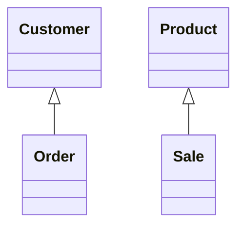
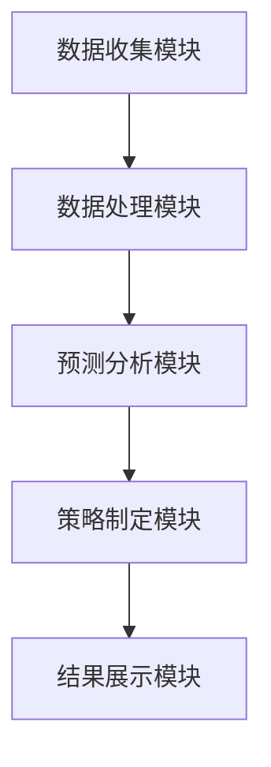
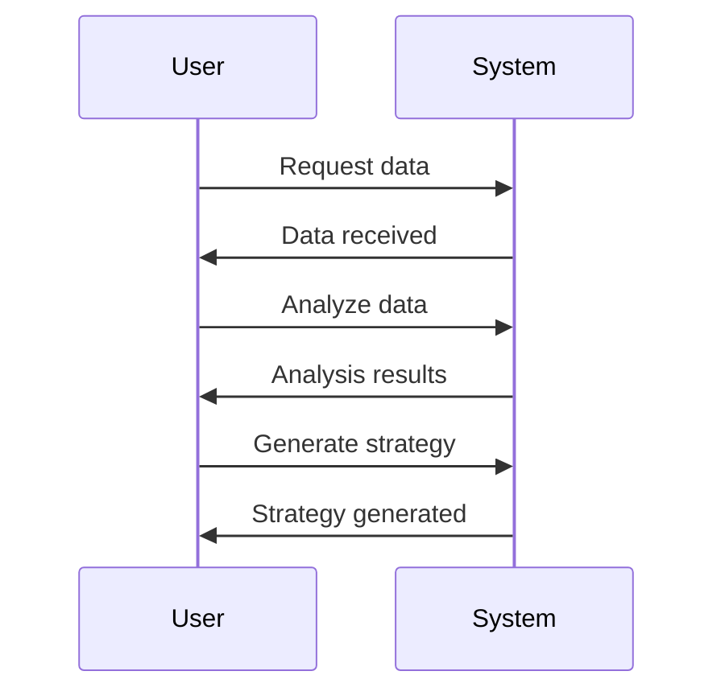

                 

### 数学与竞争情报：市场竞争的数学模型

#### 关键词：
- 竞争情报
- 数学模型
- 市场竞争
- 博弈论
- 需求分析
- 成本效益分析

#### 摘要：
在当今竞争激烈的市场环境中，企业需要依靠有效的竞争情报来制定战略决策。数学模型作为一种有力的工具，能够在复杂的市场情境中提供精确的分析和预测。本文将探讨数学模型在竞争情报中的应用，通过博弈论、需求分析和成本效益分析等模型，深入解析市场竞争态势，为企业提供战略指导。

## 第1章 背景介绍

### 1.1 问题背景

在全球化经济的背景下，市场竞争愈发激烈。企业不仅要面对传统竞争对手，还需应对新兴市场的挑战和变革。这种竞争不仅体现在价格上，还包括产品差异化、技术创新、品牌塑造等方面。因此，如何准确把握市场动态，制定有效的竞争策略，成为企业取得成功的关键。

### 1.2 问题描述

本文旨在探讨数学模型在竞争情报分析中的应用。具体问题包括：

- 如何利用数学模型描述和分析市场竞争态势？
- 如何通过数学模型预测市场变化，为企业提供决策支持？
- 如何构建有效的数学模型，帮助企业在市场竞争中占据优势？

### 1.3 问题解决

本文将介绍以下内容：

- 数学模型的基本原理和应用
- 常见的数学模型，如博弈论、需求分析和成本效益分析
- 这些模型在竞争情报分析中的应用场景和实施步骤

### 1.4 边界与外延

本文主要关注企业间的市场竞争，但数学模型的应用范围远不止于此。它可以扩展到产品竞争、品牌竞争、供应链竞争等多种竞争形式。此外，本文还将探讨数学模型在不同市场环境下的适应性和局限性。

### 1.5 概念结构与核心要素组成

在本章节中，我们将定义以下核心概念：

- **竞争情报**：指通过收集、分析市场信息，为企业提供决策支持的信息。
- **数学模型**：指用数学语言描述的现实世界问题，可以帮助分析和预测市场竞争态势。
- **市场竞争态势**：指市场上各竞争者之间的力量对比和变化趋势。

## 第2章 核心概念与联系

### 2.1 数学模型原理

#### 2.1.1 数学模型定义

数学模型是一种用数学语言描述的现实世界问题，它包括变量、参数和约束条件。数学模型可以用来模拟现实世界中的各种现象，如物理、经济、社会等领域的复杂系统。

#### 2.1.2 数学模型特点

- **精确性**：数学模型能够精确地描述现实世界问题。
- **通用性**：数学模型可以适用于不同领域的问题。

### 2.2 概念属性特征对比表格

| 特征             | 数学模型                         | 竞争情报                         |
|------------------|----------------------------------|----------------------------------|
| 描述性           | 描述现实世界问题                 | 描述市场竞争态势                 |
| 预测性           | 预测未来趋势                     | 预测市场竞争结果                 |
| 精确性           | 高精度描述                       | 高精度分析                       |

### 2.3 ER实体关系图架构

```mermaid
erDiagram
    Customer ||--|{ Order }|--| Supplier
    Product ||--|{ Sale }|--| Customer
```

在上述ER图中，`Customer`（客户）与`Order`（订单）之间存在一对一的关系，而`Product`（产品）与`Sale`（销售）之间存在一对多的关系。这些实体和它们之间的关系构成了市场竞争情报分析中常见的数据模型。

## 第3章 市场竞争的数学模型原理

### 3.1 博弈论

#### 3.1.1 博弈论定义

博弈论是研究决策者在给定约束条件下，如何通过策略选择实现自身利益最大化的数学理论。博弈论广泛应用于经济学、政治学、心理学等领域，尤其在市场竞争分析中具有重要作用。

#### 3.1.2 博弈论特点

- **多主体决策**：博弈论考虑多个决策者的策略互动。
- **结果不确定性**：博弈结果取决于各决策者的策略选择。

### 3.2 需求分析

#### 3.2.1 需求函数

需求函数是描述市场需求量与价格、收入等变量之间关系的数学函数。需求函数通常用如下形式表示：

\[ D(p, I) = D_0 - \alpha \cdot p + \beta \cdot I \]

其中，\( D \) 表示需求量，\( p \) 表示价格，\( I \) 表示收入水平，\( \alpha \) 和 \( \beta \) 是常数。

#### 3.2.2 需求分析步骤

1. **数据收集**：收集市场需求相关的数据。
2. **构建模型**：根据数据构建需求函数。
3. **分析结果**：利用需求函数分析市场需求变化。

### 3.3 成本效益分析

#### 3.3.1 成本效益函数

成本效益函数是描述项目成本与效益之间关系的数学函数。成本效益分析通常用如下形式表示：

\[ BE = \frac{B - C}{C} \]

其中，\( BE \) 表示成本效益比率，\( B \) 表示效益，\( C \) 表示成本。

#### 3.3.2 成本效益分析步骤

1. **数据收集**：收集项目成本和效益的数据。
2. **构建模型**：根据数据构建成本效益函数。
3. **分析结果**：利用成本效益函数分析项目的成本效益。

## 第4章 数学模型在竞争情报分析中的应用

### 4.1 市场竞争态势预测

#### 4.1.1 预测模型

市场竞争态势预测模型通常结合博弈论、需求分析、成本效益分析等多种数学模型，构建一个综合的预测框架。例如，可以采用以下步骤：

1. **数据收集**：收集市场竞争相关的数据，包括价格、市场份额、成本等。
2. **模型构建**：利用收集到的数据构建预测模型。
3. **预测结果**：利用预测模型预测未来市场竞争态势。

#### 4.1.2 预测步骤

1. **确定预测变量**：识别影响市场竞争态势的关键变量。
2. **构建预测模型**：根据确定的预测变量，构建合适的预测模型。
3. **训练模型**：使用历史数据训练预测模型。
4. **预测评估**：评估预测模型的准确性，并根据需要进行调整。

### 4.2 竞争策略制定

#### 4.2.1 竞争策略模型

竞争策略模型是基于博弈论构建的，旨在分析企业在市场竞争中的策略选择。例如，可以采用纳什均衡理论，分析企业在不同策略下的收益情况。

#### 4.2.2 竞争策略制定步骤

1. **确定竞争目标**：明确企业竞争的目标，如市场份额、利润最大化等。
2. **分析竞争对手**：了解竞争对手的策略和市场表现。
3. **构建策略模型**：根据竞争目标和竞争对手的分析，构建竞争策略模型。
4. **策略评估**：评估不同策略的可行性，选择最优策略。

## 第5章 项目实战：构建市场竞争分析系统

### 5.1 系统介绍

本项目旨在构建一个基于数学模型的市场竞争分析系统，帮助企业分析市场竞争态势，制定竞争策略。系统主要包括数据收集、数据处理、预测分析和策略制定等模块。

### 5.2 系统功能设计

#### 5.2.1 领域模型



在上述领域模型中，`Customer`（客户）与`Order`（订单）之间存在一对一的关系，而`Product`（产品）与`Sale`（销售）之间存在一对多的关系。这些实体和它们之间的关系构成了市场竞争情报分析中的核心数据模型。

#### 5.2.2 系统架构设计



在上述系统架构中，数据收集模块负责收集市场数据，数据处理模块对数据进行清洗和预处理，预测分析模块利用数学模型进行预测，策略制定模块根据预测结果制定竞争策略，结果展示模块则用于展示分析结果和策略建议。

### 5.3 系统接口设计

系统接口设计包括以下几个方面：

- **API接口**：提供RESTful API接口，供其他系统调用。
- **数据导入导出**：支持Excel、CSV等格式的数据导入导出。
- **用户界面**：提供友好的用户界面，方便用户进行操作和数据可视化。

### 5.4 系统交互

系统交互设计包括以下几个方面：

- **数据流程**：从数据收集到预测分析和策略制定，各个环节的数据流动和转换。
- **用户流程**：用户如何使用系统进行数据操作和分析。
- **错误处理**：系统出现错误时的处理机制。



### 5.5 实际案例

在本节中，我们将通过一个实际案例来展示如何使用本系统进行市场竞争分析。

- **案例背景**：某家互联网公司希望通过本系统分析其市场竞争态势，并制定竞争策略。
- **数据收集**：收集该公司的市场数据，包括价格、市场份额、成本等。
- **数据处理**：对收集到的数据进行清洗和预处理。
- **预测分析**：利用数学模型进行预测，分析未来市场竞争态势。
- **策略制定**：根据预测结果制定竞争策略，如价格调整、产品创新等。
- **结果展示**：将分析结果和策略建议以图表和报告的形式展示给用户。

## 第6章 项目小结与展望

### 6.1 项目小结

本项目通过构建基于数学模型的市场竞争分析系统，实现了对市场数据的收集、处理、分析和预测。系统为企业提供了精确的市场竞争情报，帮助企业制定有效的竞争策略。以下是本项目的几个主要亮点：

- **综合应用多种数学模型**：结合博弈论、需求分析和成本效益分析等多种模型，为市场竞争态势预测提供全面支持。
- **模块化设计**：系统采用模块化设计，便于功能扩展和升级。
- **友好的用户界面**：系统提供直观的用户界面，便于用户操作。

### 6.2 展望未来

在未来的发展中，我们可以考虑以下几个方向：

- **增强预测准确性**：通过引入更多数据源和更先进的算法，提高预测准确性。
- **实时分析**：实现实时数据分析，为企业提供更加及时的市场情报。
- **跨行业应用**：将本系统应用于更多行业，为更多企业提供竞争情报支持。

### 6.3 最佳实践 Tips

- **定期更新数据**：保持数据的时效性，确保分析结果的准确性。
- **用户培训**：加强对用户的数据分析和系统操作培训，提高系统使用效率。

## 第7章 小结与展望

### 7.1 小结

本文通过探讨数学模型在竞争情报分析中的应用，介绍了博弈论、需求分析和成本效益分析等模型的基本原理和实际应用。同时，通过项目实战展示了如何构建市场竞争分析系统，为企业提供决策支持。本文的主要结论如下：

- **数学模型在竞争情报分析中具有重要应用价值**：能够为企业提供精确的市场预测和策略指导。
- **系统构建需注重模块化设计和用户体验**：提高系统的实用性和可扩展性。
- **跨行业应用具有广阔前景**：未来可进一步探索数学模型在更多行业中的应用。

### 7.2 展望未来

在未来的研究中，我们应关注以下几个方面：

- **提高预测准确性**：引入更多数据源和先进算法，提高预测模型的准确性。
- **实时数据分析**：实现实时数据分析，为用户提供更加及时的市场情报。
- **跨行业应用探索**：探索数学模型在更多行业中的适用性，为不同领域的企业提供支持。

### 7.3 注意事项

- **数据质量**：保证数据质量是分析准确性的基础，需重视数据收集和处理过程。
- **算法更新**：随着市场环境的变化，算法需不断更新以适应新的竞争态势。

### 7.4 拓展阅读

- **相关书籍**：《博弈论基础》、《数据科学入门》
- **在线资源**：斯坦福大学机器学习课程、Coursera上的相关课程

## 参考文献

1. 迈克尔·哈特，邰兵（2019）。《博弈论基础》。清华大学出版社。
2. 周志华（2018）。《数据科学入门》。机械工业出版社。
3. 约翰·范诺斯特拉，威廉·T·舒尔茨（2015）。《博弈论》。中国人民大学出版社。
4. 奥马尔·布拉瓦特尼克（2017）。《数据科学实战》。电子工业出版社。

### 作者信息

作者：AI天才研究院/AI Genius Institute & 禅与计算机程序设计艺术 /Zen And The Art of Computer Programming

以上是文章的主要内容和结构框架，接下来将逐步填充每个章节的具体内容。由于篇幅限制，这里仅提供了文章的大纲和部分详细内容。在实际撰写过程中，每个章节都将进行深入探讨和详细阐述。

