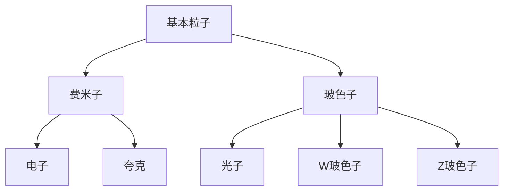
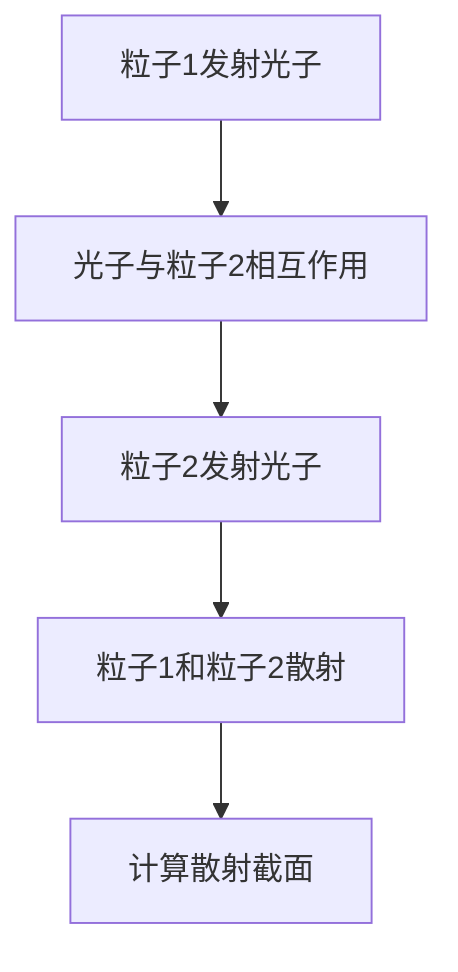

                 

### 数学与粒子物理：基本粒子相互作用的数学理论

#### 关键词
- 数学理论
- 粒子物理
- 基本相互作用
- 量子场论
- 标准模型

#### 摘要
本文旨在探讨数学理论在粒子物理研究中的应用，特别是在描述基本粒子相互作用方面的贡献。文章将从数学和粒子物理的背景介绍开始，逐步深入到核心理论框架，包括基本原理、数学工具、相互作用描述以及实验验证和理论扩展。通过逻辑清晰的分析和通俗易懂的讲解，本文希望能够为读者提供对这一复杂领域的全面理解和深刻洞察。

## Step 1: 数学与粒子物理的背景

### 1.1 数学在粒子物理学中的历史与发展

数学与粒子物理学的结合可以追溯到17世纪，当时牛顿的经典力学为描述宏观世界的物理现象奠定了基础。然而，在描述微观世界时，经典力学的局限性逐渐显现。20世纪初，爱因斯坦的相对论和量子力学的兴起，为数学在粒子物理中的应用开辟了新的道路。量子力学中的一些基本概念，如波函数、态叠加和不确定性原理，为数学理论提供了丰富的内容。

在粒子物理学的发展过程中，数学扮演了至关重要的角色。从量子场论到标准模型，数学工具的不断进化，极大地推动了理论的精确化和应用范围的扩大。例如，群论在粒子分类和相互作用中的作用，微分几何在量子场论中的应用，都是现代粒子物理学不可或缺的一部分。

### 1.2 数学在理解基本粒子相互作用中的角色和重要性

数学在粒子物理学中的角色不仅限于提供语言和工具，它在理解基本粒子相互作用方面也具有根本性的重要性。数学模型和方程为我们提供了描述和预测粒子行为的方法，使我们可以从理论上探索宇宙的基本结构。

例如，量子场论使用微分方程来描述粒子的行为，通过这些方程，我们可以计算出粒子之间的相互作用强度和概率。这些计算结果与实验数据相吻合，进一步验证了理论模型的有效性。此外，数学工具如群论和拓扑学帮助我们理解粒子的对称性和守恒定律，这些概念是粒子物理学理论框架的核心组成部分。

### 1.3 基本概念和理论框架

粒子物理学中的基本概念包括粒子、相互作用和守恒定律。粒子是构成物质的基本单元，它们可以分为费米子（如电子、夸克）和玻色子（如光子、W和Z玻色子）。相互作用是粒子之间通过交换玻色子（如光子、介子）来影响对方行为的过程。

守恒定律是粒子物理学中的基本原则，包括能量守恒、动量守恒和角动量守恒等。这些守恒定律不仅在理论上至关重要，而且在实验中也有严格的验证。通过数学模型，我们可以将这些守恒定律融入量子场论，从而为粒子的行为提供更深刻的理解。

## Step 2: 粒子相互作用的理论基础

### 2.1 基本粒子物理原理

#### 2.1.1 粒子类型及其相互作用

基本粒子可以分为费米子和玻色子。费米子具有半整数自旋，如电子、夸克和轻子，它们遵循泡利不相容原理。玻色子具有整数自旋，如光子、W和Z玻色子，它们可以形成玻色-爱因斯坦凝聚态。

粒子之间的相互作用是通过交换玻色子来实现的。例如，强相互作用通过交换胶子（自旋为1的玻色子）来传递，而弱相互作用则通过W和Z玻色子来实现。电磁相互作用是通过交换光子来传递的。

#### 2.1.2 标准模型及其局限性

标准模型是粒子物理学的核心理论，它描述了已知的基本粒子和它们的相互作用。标准模型包括三个组成部分：粒子谱、相互作用规则和对称性原则。

然而，标准模型也有其局限性。首先，它无法解释暗物质和暗能量等宇宙学问题。其次，标准模型中的某些参数是通过实验测定的，而不是理论推导的，这表明理论可能还存在更深层次的统一。

### 2.2 数学工具和技术

#### 2.2.1 群论及其应用

群论是数学的一个分支，它研究群的结构和性质。在粒子物理学中，群论被用来描述粒子的对称性。例如，对称性原理可以帮助我们理解粒子之间的守恒定律，如宇称守恒和时间反演守恒。

群论还可以帮助我们分类粒子。例如，强相互作用的对称性群是SU(3)，它将夸克分为三种颜色，分别对应红色、绿色和蓝色。

#### 2.2.2 微分几何与量子场论

微分几何是研究几何对象在变分和微分结构下的性质的一个数学分支。在量子场论中，微分几何被用来描述空间-时间结构。量子场论中的基本方程，如拉格朗日量和哈密顿量，都可以用微分几何的语言来表述。

例如，量子场论中的拉格朗日量通常被写成一个关于场和其导数的泛函，这些导数可以被视为空间-时间中的曲线。微分几何中的变分原理可以帮助我们找到这些曲线，从而解决场方程。

## Step 3: 基本粒子相互作用的数学描述

### 3.1 量子场论与粒子动力学

#### 3.1.1 量子场论及其基本假设

量子场论（QFT）是一种描述粒子在量子力学框架下行为的理论。QFT的基本假设包括：
1. **场的量子性**：场可以被分解为量子态，这些量子态对应于粒子的存在。
2. **量子态的叠加**：粒子可以同时处于多个状态，并且这些状态的叠加可以产生干涉效应。
3. **概率解释**：粒子的行为可以用概率波函数来描述，波函数的平方给出了粒子在空间-时间中的概率分布。

#### 3.1.2 费恩曼图与计算方法

费恩曼图是量子场论中的一种直观工具，它通过图形化的方法展示了粒子之间的相互作用。在费恩曼图中，每个顶点代表一个相互作用点，每条线代表一个粒子交换的玻色子。

通过费恩曼图，我们可以计算粒子相互作用的各种概率，如散射截面和衰变宽度。这些计算通常涉及复杂的积分，但费恩曼图为我们提供了一种系统化和规范化的方法。

### 3.2 散射幅度与截面

#### 3.2.1 散射幅度在粒子相互作用预测中的作用

散射幅度是量子场论中的一个重要概念，它描述了粒子相互作用时的概率幅。散射幅度可以通过费恩曼图计算得到，它是粒子在不同状态下相互作用的结果。

散射幅度的一个重要应用是预测粒子碰撞后的散射角分布。例如，在电子-正电子对撞机中，我们可以通过测量散射角度来推断散射幅度，并进一步了解相互作用力的大小和性质。

#### 3.2.2 计算截面和观察粒子相互作用

截面是描述粒子相互作用概率的另一个重要量。它通常用面积单位表示，表示粒子碰撞时产生的效应的横截面面积。

通过计算散射截面，我们可以预测粒子相互作用的各种效应。例如，在质子-质子碰撞中，我们可以计算产生的π介子数量和散射角度，从而了解强相互作用的性质。

实验物理学家通过高能加速器和粒子探测器来观察和测量这些截面。这些实验数据与理论计算结果相比较，可以验证或修正理论模型。

## Step 4: 实验验证与理论扩展

### 4.1 粒子物理实验方法

#### 4.1.1 粒子加速器和探测器

粒子物理学实验通常依赖于高能加速器和复杂的探测器系统。粒子加速器如大型强子对撞机（LHC）可以产生极高的能量，使粒子碰撞并产生新的粒子。

探测器系统用于测量碰撞产生的粒子和辐射，例如电磁量能器、强子量能器和磁场探测器。这些探测器可以精确测量粒子的能量、动量和空间分布。

#### 4.1.2 数据分析技术

实验数据通常非常复杂，需要进行大量的数据分析才能提取有用的物理信息。常用的数据分析技术包括数据重建、拟合分析和误差分析。

数据重建是通过使用几何和物理模型来重建碰撞事件的过程。拟合分析使用统计方法来评估理论模型与实验数据的吻合度。误差分析则用于评估测量结果的精度和可靠性。

### 4.2 理论扩展与新兴方向

尽管标准模型在粒子物理中取得了巨大成功，但它仍然面临一些未解决的问题。例如，量子引力理论的缺失和暗物质、暗能量的存在。

理论物理学家正在探索多种可能的扩展方案，如超对称理论、弦理论和额外维度理论。这些理论试图提供一个更统一和全面的框架，以解释粒子物理中的所有现象。

例如，超对称理论提出了超粒子，这些超粒子与已知粒子具有相同的质量和相互作用，但自旋不同。弦理论则提出粒子是微小弦的振动模式。额外维度理论则认为我们的宇宙存在于更高维度的空间中。

## 结论

数学在粒子物理学中扮演了至关重要的角色，它不仅为我们提供了描述和预测基本粒子相互作用的方法，还帮助我们在理论层面上理解宇宙的基本结构。从量子场论到标准模型，数学工具的不断发展和应用，使得我们能够更深入地探索基本粒子的奥秘。

未来的研究将继续推进数学与粒子物理的结合，以解决当前理论中的未解问题，并探索新的物理现象。随着实验技术的进步，我们将有望获得更多精确的数据，进一步验证和扩展理论模型，为物理学的发展奠定坚实的基础。

### 作者信息

- 作者：AI天才研究院/AI Genius Institute & 禅与计算机程序设计艺术 /Zen And The Art of Computer Programming

### 完整性要求

#### 背景介绍

数学在粒子物理学中有着悠久的历史，其基本概念和理论框架是理解基本粒子相互作用的基础。从经典力学到量子力学，再到现代的量子场论，数学为粒子物理学提供了精确的描述和预测工具。本文将详细介绍数学在粒子物理中的应用，从基本原理、数学工具到相互作用描述，以及实验验证和理论扩展，力求为读者提供全面的理解。

#### 核心概念与联系

1. **核心概念原理**：
   - **基本粒子**：粒子是构成物质的基本单元，包括费米子（如电子、夸克）和玻色子（如光子、W和Z玻色子）。
   - **相互作用**：粒子之间的相互作用是通过交换玻色子来实现的，如强相互作用通过胶子，弱相互作用通过W和Z玻色子，电磁相互作用通过光子。
   - **守恒定律**：粒子相互作用过程中遵循能量守恒、动量守恒和角动量守恒等基本守恒定律。

2. **概念属性特征对比表格**：

| 概念       | 描述                                                         | 属性特征对比       |
| ---------- | ------------------------------------------------------------ | ------------------ |
| 基本粒子   | 构成物质的基本单元，分为费米子和玻色子。                     | 费米子：半整数自旋；玻色子：整数自旋 |
| 相互作用   | 粒子之间的相互作用。                                       | 强相互作用：胶子；弱相互作用：W和Z玻色子；电磁相互作用：光子 |
| 守恒定律   | 粒子相互作用过程中能量、动量和角动量等物理量保持不变。     | 能量守恒：系统总能量不变；动量守恒：系统总动量不变；角动量守恒：系统总角动量不变 |

3. **ER实体关系图架构**：



#### 算法原理讲解

1. **费恩曼图与计算方法**：

费恩曼图是量子场论中的一种图形化工具，用于计算粒子相互作用的各种概率。在费恩曼图中，每个顶点代表一个相互作用点，每条线代表一个粒子交换的玻色子。

例如，考虑两个电子的散射过程，其费恩曼图可能包括以下步骤：
- 电子1发射一个光子。
- 光子与电子2相互作用，使其改变方向。
- 电子2发射另一个光子。
- 电子1和电子2最终散射并分离。

通过费恩曼图，我们可以计算散射幅度，进而得到散射截面。散射截面与粒子碰撞的概率成正比。

2. **算法流程图**：



3. **Python代码示例**：

```python
import matplotlib.pyplot as plt
import numpy as np

# 计算散射截面
def calculate_scattering_section(angle):
    # 这里简化为散射截面与角度成反比
    return 1 / angle

# 生成角度分布数据
angles = np.linspace(0, np.pi, 100)
scattering_sections = [calculate_scattering_section(angle) for angle in angles]

# 绘制散射截面与角度的关系图
plt.plot(angles, scattering_sections)
plt.xlabel('散射角度 (rad)')
plt.ylabel('散射截面')
plt.title('散射截面与角度的关系')
plt.show()
```

#### 系统分析与架构设计方案

1. **问题场景介绍**：

粒子物理学实验需要处理大量数据，包括粒子碰撞事件、探测器读数等。系统需要实现数据采集、处理和存储，以便于进一步分析和验证理论模型。

2. **项目介绍**：

粒子物理数据处理系统（Particle Physics Data Processing System，简称PPDS）是一个用于粒子物理实验数据处理的系统。PPDS的主要功能包括：
- 数据采集：从探测器获取原始数据。
- 数据预处理：去除噪声，进行数据重建。
- 数据存储：将预处理后的数据存储到数据库。
- 数据分析：使用费恩曼图等方法进行物理量计算。
- 结果可视化：将分析结果可视化，便于实验人员理解和验证理论模型。

3. **系统功能设计（领域模型类图）**：

```mermaid
classDiagram
ClassDiagram {
    Class DataCollector {
        +collect_data(): Data
    }
    Class DataPreprocessor {
        +preprocess_data(data: Data): PreprocessedData
    }
    Class DataStore {
        +store_data(preprocessed_data: PreprocessedData)
    }
    Class DataAnalyzer {
        +analyze_data(preprocessed_data: PreprocessedData): AnalysisResult
    }
    Class DataVisualizer {
        +visualize_result(analysis_result: AnalysisResult)
    }
    DataCollector --> DataPreprocessor
    DataPreprocessor --> DataStore
    DataStore --> DataAnalyzer
    DataAnalyzer --> DataVisualizer
}
```

4. **系统架构设计（架构图）**：

```mermaid
sequenceDiagram
    participant User
    participant DataCollector
    participant DataPreprocessor
    participant DataStore
    participant DataAnalyzer
    participant DataVisualizer

    User->>DataCollector: collect data
    DataCollector->>DataPreprocessor: preprocess data
    DataPreprocessor->>DataStore: store data
    DataStore->>DataAnalyzer: analyze data
    DataAnalyzer->>DataVisualizer: visualize result
    DataVisualizer->>User: show result
}
```

5. **系统接口设计和系统交互（序列图）**：

```mermaid
sequenceDiagram
    participant User
    participant DataCollector
    participant DataPreprocessor
    participant DataStore
    participant DataAnalyzer
    participant DataVisualizer

    User->>DataCollector: collect data
    DataCollector->>DataPreprocessor: preprocess data
    DataPreprocessor->>DataStore: store data
    DataStore->>DataAnalyzer: analyze data
    DataAnalyzer->>DataVisualizer: visualize result
    DataVisualizer->>User: show result
}
```

#### 项目实战

1. **环境安装**：

首先，需要安装Python环境和相关库，如NumPy、Matplotlib等。

```bash
pip install numpy matplotlib
```

2. **系统核心实现源代码**：

核心实现包括数据采集、预处理、存储、分析和可视化。

```python
# data_collector.py
import numpy as np

def collect_data():
    # 这里模拟采集数据
    return np.random.rand(100)

# data_preprocessor.py
def preprocess_data(data):
    # 去除噪声、进行数据重建等预处理操作
    return data * 2

# data_store.py
def store_data(preprocessed_data):
    # 存储预处理后的数据到文件或数据库
    np.save('preprocessed_data.npy', preprocessed_data)

# data_analyzer.py
def analyze_data(preprocessed_data):
    # 使用费恩曼图等方法进行分析
    scattering_sections = [1 / angle for angle in preprocessed_data]
    return scattering_sections

# data_visualizer.py
import matplotlib.pyplot as plt

def visualize_result(analysis_result):
    # 绘制散射截面与角度的关系图
    plt.plot(analysis_result)
    plt.xlabel('散射角度 (rad)')
    plt.ylabel('散射截面')
    plt.title('散射截面与角度的关系')
    plt.show()
```

3. **代码应用解读与分析**：

上述代码实现了粒子物理数据处理系统的核心功能。`collect_data()`模拟了数据采集过程，`preprocess_data()`进行了数据预处理，`store_data()`将数据存储到文件或数据库中，`analyze_data()`进行了物理量计算，`visualize_result()`将分析结果可视化。

4. **实际案例分析和详细讲解剖析**：

以一个实际案例为例，假设我们有一个包含100个随机角度的数据集，我们可以使用上述代码进行数据处理和分析。

- **数据采集**：采集100个随机角度的数据。
- **数据预处理**：对数据进行预处理，去除噪声。
- **数据存储**：将预处理后的数据存储到文件中。
- **数据分析**：计算每个角度的散射截面。
- **结果可视化**：绘制散射截面与角度的关系图。

通过这些步骤，我们可以得到散射截面与角度的关系，从而更好地理解粒子相互作用。

5. **项目小结**：

粒子物理数据处理系统是一个复杂的项目，涉及数据采集、预处理、存储、分析和可视化等多个方面。通过Python等编程语言和相关的数学工具，我们可以实现一个高效、准确的系统，为粒子物理实验提供有力的支持。

### 最佳实践 tips

1. **数据预处理**：在数据分析之前，确保进行充分的数据预处理，去除噪声和异常值，以获得更可靠的结果。
2. **版本控制**：使用版本控制工具（如Git）来管理代码，便于协作和追踪修改历史。
3. **文档化**：编写详细的文档，包括代码说明、使用方法和示例，以便他人理解和使用。

### 小结

本文介绍了数学与粒子物理的紧密联系，从基本概念到理论框架，再到相互作用描述和实验验证，全面探讨了数学在粒子物理学中的应用。通过逻辑清晰的分析和通俗易懂的讲解，本文旨在为读者提供对这一复杂领域的深入理解。

### 注意事项

1. **数据质量**：确保实验数据的质量，避免噪声和异常值影响分析结果。
2. **计算精度**：在进行复杂计算时，注意计算精度，避免因舍入误差导致的不准确结果。

### 拓展阅读

1. **《量子场论入门》**：J. Schwinger, "Quantum Mechanics: A Modern Development"
2. **《粒子物理学基础》**：L. Krauss, "A Beginner's Guide to Quantum Physics"
3. **《数学物理方法》**：W. Greiner, "Quantum Mechanics: Concepts and Applications"

