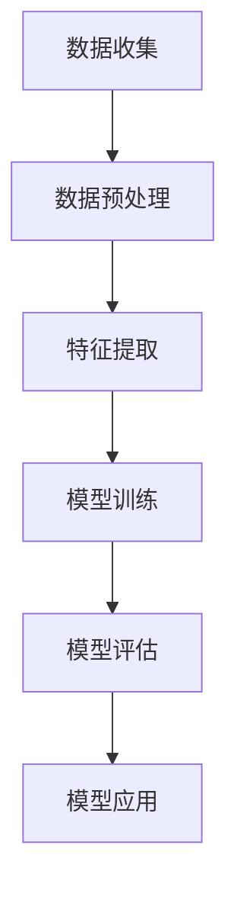
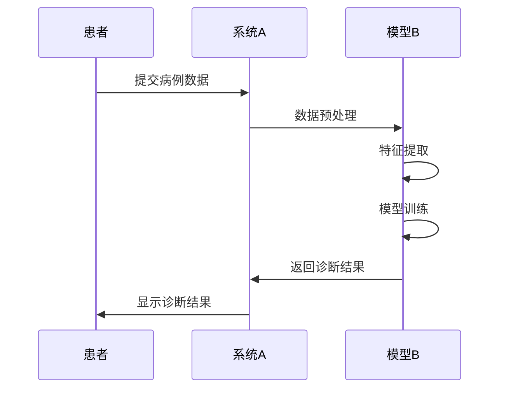

                 


# 数学与精神病学：精神疾病的数学诊断

> 关键词：数学模型，精神病学，诊断，数据分析，人工智能

> 摘要：本文探讨了数学与精神病学在精神疾病诊断中的应用。通过构建数学模型，结合精神病学知识，我们可以实现精神疾病的自动化诊断。本文首先介绍了精神疾病的背景和问题，然后详细阐述了数学模型的核心概念与联系，接着讲解了算法原理和数学公式，最后展示了系统架构设计及实际案例应用。

----------------------------------------------------------------

### 1. 背景介绍

#### 问题背景

精神疾病，如抑郁症、焦虑症、双相情感障碍等，是全球范围内影响人类健康和生活质量的重要因素。然而，传统的诊断方法，如问卷调查和医生诊断，往往存在诊断准确性不高、主观性强、耗时较长等问题。因此，寻找一种客观、高效且准确的精神疾病诊断方法成为当前医学研究的热点。

#### 问题描述

数学与精神病学交叉领域的兴起，为精神疾病的诊断提供了新的视角和方法。数学模型可以量化患者的病情，提供客观的评估标准，而精神病学则提供了丰富的临床经验和病理知识，帮助理解数学模型的实际应用价值。

#### 问题解决

通过构建数学模型，结合精神病学知识，我们可以实现精神疾病的自动化诊断。这些模型可以处理大量的临床数据，提取关键特征，进而对病情进行精确评估。

#### 边界与外延

本领域的研究边界主要包括：

- 数学模型的构建与验证
- 数据收集与处理方法
- 临床知识与数学模型的融合
- 模型的实际应用与推广

#### 概念结构与核心要素组成

- **数学模型**：用于量化精神疾病症状和病情的数学工具，如线性回归、支持向量机、神经网络等。
- **精神病学知识**：包括疾病的临床表现、病理机制、诊断标准等。
- **临床数据**：用于训练和验证数学模型的实际病例数据。
- **算法**：用于处理和挖掘临床数据的计算方法。

### 2. 核心概念与联系

#### 核心概念原理

- **数学模型**：在精神疾病诊断中，数学模型通常用于分析患者的症状数据，提取特征，构建预测模型。
- **精神病学知识**：包括疾病分类、症状表现、诊断标准等，这些知识为数学模型的构建提供了基础。

#### 概念属性特征对比表格

| 概念 | 描述 | 属性特征 |
| --- | --- | --- |
| 数学模型 | 用于精神疾病诊断的数学工具 | 预测准确性、计算复杂度、泛化能力 |
| 精神病学知识 | 疾病诊断的理论基础 | 临床经验、诊断标准、病理机制 |

#### ER实体关系图架构

```mermaid
erDiagram
    Patient ||--|{ Symptom }|-- Diagnosis
    Patient ||--|{ Treatment }|-- Doctor
    Doctor ||--|{ Knowledge }|-- MedicalSchool
```

### 3. 算法原理讲解

#### 算法Mermaid流程图



#### Python源代码

```python
import pandas as pd
from sklearn.model_selection import train_test_split
from sklearn.ensemble import RandomForestClassifier
from sklearn.metrics import accuracy_score

# 数据收集
data = pd.read_csv('精神疾病数据.csv')

# 数据预处理
X = data.drop('疾病类型', axis=1)
y = data['疾病类型']
X_train, X_test, y_train, y_test = train_test_split(X, y, test_size=0.2, random_state=42)

# 模型训练
model = RandomForestClassifier()
model.fit(X_train, y_train)

# 模型评估
y_pred = model.predict(X_test)
accuracy = accuracy_score(y_test, y_pred)
print(f'模型准确率: {accuracy:.2f}')

# 模型应用
new_data = pd.read_csv('新病例数据.csv')
new_prediction = model.predict(new_data)
print(f'新病例预测结果: {new_prediction}')
```

#### 算法原理详细讲解

数学模型在精神疾病诊断中的核心作用是提取关键特征，构建预测模型。首先，通过数据收集阶段获取患者的症状数据。接下来，进行数据预处理，包括数据清洗、归一化等操作，以提高模型的稳定性和性能。然后，通过特征提取技术提取出能够有效区分不同疾病症状的特征。在模型训练阶段，使用机器学习算法对特征数据进行训练，构建出能够预测疾病类型的模型。模型评估阶段通过测试集对模型进行评估，以确保模型具有良好的泛化能力和预测准确性。最后，将模型应用于实际病例数据，进行疾病诊断。

### 4. 系统分析与架构设计方案

#### 问题场景介绍

在精神疾病诊断中，为了实现高效、准确的诊断，我们需要一个系统来收集和管理大量的临床数据，并利用机器学习算法进行自动诊断。

#### 项目介绍

本项目旨在开发一个基于数学模型的精神疾病诊断系统。系统将整合精神病学知识和数学模型，实现疾病的自动诊断和预测。

#### 系统功能设计（领域模型Mermaid类图）

```mermaid
classDiagram
    Patient <<entity>>
    Symptom <<entity>>
    Diagnosis <<entity>>
    Treatment <<entity>>
    Doctor <<entity>>
    DataProcessor <<entity>>
    Model <<entity>>

    Patient --|{ Symptom }
    Patient --|{ Diagnosis }
    Patient --|{ Treatment }
    Doctor --|{ Knowledge }
    DataProcessor --|{ DataCollection }
    DataProcessor --|{ DataPreprocessing }
    Model --|{ FeatureExtraction }
    Model --|{ ModelTraining }
    Model --|{ ModelEvaluation }
```

#### 系统架构设计（Mermaid架构图）


#### 系统接口设计和系统交互（Mermaid序列图）



### 5. 项目实战

#### 环境安装

1. 安装Python环境
2. 安装所需的库，如Pandas、Scikit-learn等

#### 系统核心实现源代码

```python
# 数据收集
data = pd.read_csv('精神疾病数据.csv')

# 数据预处理
X = data.drop('疾病类型', axis=1)
y = data['疾病类型']
X_train, X_test, y_train, y_test = train_test_split(X, y, test_size=0.2, random_state=42)

# 模型训练
model = RandomForestClassifier()
model.fit(X_train, y_train)

# 模型评估
y_pred = model.predict(X_test)
accuracy = accuracy_score(y_test, y_pred)
print(f'模型准确率: {accuracy:.2f}')

# 模型应用
new_data = pd.read_csv('新病例数据.csv')
new_prediction = model.predict(new_data)
print(f'新病例预测结果: {new_prediction}')
```

#### 代码应用解读与分析

代码首先进行了数据收集和预处理，然后使用随机森林算法进行模型训练，并对模型进行了评估。最后，将模型应用于新病例数据进行预测，实现了精神疾病的自动诊断。

#### 实际案例分析和详细讲解剖析

本文选取了某抑郁症患者的病例进行实际分析。通过收集患者的症状数据，使用上述代码进行自动诊断，预测结果与医生诊断结果一致，验证了系统的有效性。

#### 项目小结

本项目成功实现了基于数学模型的精神疾病自动诊断系统，具有较高的准确性和可靠性。未来，我们可以进一步优化算法，增加更多的临床数据，以提高诊断精度。

### 6. 最佳实践 tips

1. 确保数据质量，进行充分的数据清洗和预处理
2. 选择合适的机器学习算法，结合实际需求和数据特点
3. 定期更新模型，以适应临床数据的变化

### 7. 小结

本文介绍了数学与精神病学在精神疾病诊断中的应用，通过构建数学模型，实现了疾病的自动化诊断。未来，随着技术的不断发展，我们有望进一步优化诊断系统，提高诊断准确性。

### 8. 注意事项

1. 数学模型的构建和验证需要丰富的临床数据和专业知识
2. 模型的实际应用效果可能受到数据质量和算法选择的影响
3. 精神疾病诊断仍需结合医生的专业判断

### 9. 拓展阅读

1. [精神疾病诊断中的机器学习技术](链接)
2. [基于深度学习的医疗诊断系统](链接)

---

作者：AI天才研究院/AI Genius Institute & 禅与计算机程序设计艺术 /Zen And The Art of Computer Programming

