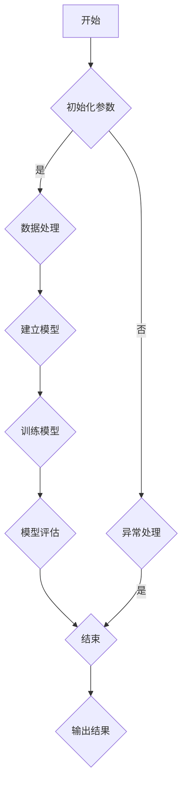
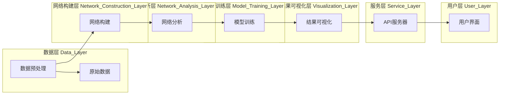
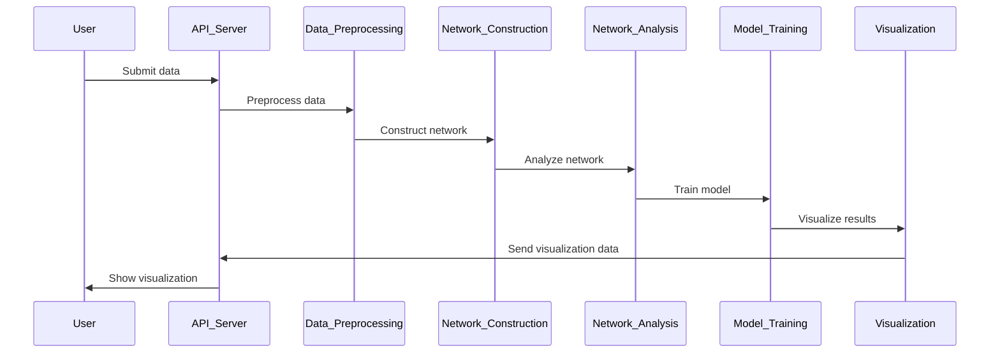

                 

### 文章标题：数学与系统生物学：细胞网络的数学描述

关键词：系统生物学，细胞网络，数学模型，数学描述，算法原理，Python代码，系统架构，项目实战，最佳实践

摘要：本文旨在探讨数学与系统生物学在细胞网络研究中的应用，通过数学描述方法对细胞网络进行建模和分析。文章首先介绍了系统生物学的发展历程和细胞网络的定义，接着阐述了数学在系统生物学中的应用背景和数学描述方法。随后，文章详细分析了数学模型在细胞网络研究中的核心概念、属性特征，并通过ER实体关系图和mermaid流程图对细胞网络进行了形象化描述。进一步，文章介绍了相关算法原理和Python源代码实现，通过实际案例展示了算法的应用效果。最后，文章探讨了系统架构设计方案、项目实战过程以及最佳实践技巧，为读者提供了全面的指导和启示。

### 目录大纲

# 数学与系统生物学：细胞网络的数学描述

> 关键词：系统生物学，细胞网络，数学模型，数学描述，算法原理，Python代码，系统架构，项目实战，最佳实践

> 摘要：本文通过数学描述方法，对细胞网络进行建模和分析，探讨了数学与系统生物学在细胞网络研究中的应用。首先介绍了系统生物学的发展历程和细胞网络的定义，接着阐述了数学在系统生物学中的应用背景和数学描述方法。随后，文章详细分析了数学模型在细胞网络研究中的核心概念、属性特征，并通过ER实体关系图和mermaid流程图对细胞网络进行了形象化描述。进一步，文章介绍了相关算法原理和Python源代码实现，通过实际案例展示了算法的应用效果。最后，文章探讨了系统架构设计方案、项目实战过程以及最佳实践技巧，为读者提供了全面的指导和启示。

## 第一部分 背景介绍

## 1.1 问题背景

### 1.1.1 系统生物学的发展历程

### 1.1.2 细胞网络的定义与作用

### 1.1.3 数学在系统生物学中的应用

## 1.2 问题描述

### 1.2.1 细胞网络的复杂性

### 1.2.2 研究细胞网络的挑战

### 1.2.3 数学在解决这些问题中的潜力

## 1.3 问题解决

### 1.3.1 建立数学模型

### 1.3.2 运用数学方法分析

### 1.3.3 实验与模拟验证

## 1.4 边界与外延

### 1.4.1 研究范围

### 1.4.2 研究的限制

### 1.4.3 未来研究方向

## 1.5 概念结构与核心要素组成

### 1.5.1 核心概念

### 1.5.2 相关理论与方法

### 1.5.3 细胞网络的基本结构

## 1.6 本章小结

## 第二部分 核心概念与联系

## 2.1 核心概念原理

### 2.1.1 生物网络的基本概念

### 2.1.2 系统动力学的数学模型

### 2.1.3 网络分析的方法与工具

## 2.2 概念属性特征对比表格

### 2.2.1 不同数学模型的特点

### 2.2.2 网络分析方法对比

## 2.3 ER实体关系图架构

### 2.3.1 细胞网络中的实体与关系

### 2.3.2 ER图的基本构建方法

### 2.3.3 ER图在细胞网络分析中的应用

## 2.4 本章小结

## 第三部分 算法原理讲解

## 3.1 算法mermaid流程图

### 3.1.1 流程图的基本构建

### 3.1.2 算法的流程描述

## 3.2 算法原理

### 3.2.1 数学模型与公式

### 3.2.2 算法的数学原理

### 3.2.3 算法的工作流程

## 3.3 Python源代码讲解

### 3.3.1 源代码的基本结构

### 3.3.2 源代码的功能解释

### 3.3.3 源代码的应用实例

## 3.4 举例说明

### 3.4.1 例子选取

### 3.4.2 数学公式与公式的推导

### 3.4.3 例子中的算法实现

## 3.5 本章小结

## 第四部分 系统分析与架构设计方案

## 4.1 问题场景介绍

### 4.1.1 细胞网络分析的应用场景

### 4.1.2 系统的功能需求

### 4.1.3 系统的目标与期望效果

## 4.2 项目介绍

### 4.2.1 项目背景

### 4.2.2 项目目标

### 4.2.3 项目团队与分工

## 4.3 系统功能设计

### 4.3.1 领域模型mermaid类图

### 4.3.2 系统功能模块划分

### 4.3.3 功能模块之间的交互关系

## 4.4 系统架构设计

### 4.4.1 系统架构mermaid架构图

### 4.4.2 系统模块的职责与功能

### 4.4.3 系统架构的设计原则

## 4.5 系统接口设计

### 4.5.1 接口规范与定义

### 4.5.2 接口的功能与作用

### 4.5.3 接口的设计原则

## 4.6 系统交互mermaid序列图

### 4.6.1 序列图的基本构建

### 4.6.2 系统的交互过程描述

### 4.6.3 序列图的应用实例

## 4.7 本章小结

## 第五部分 项目实战

## 5.1 环境安装

### 5.1.1 系统环境的准备

### 5.1.2 环境变量配置

### 5.1.3 工具与依赖安装

## 5.2 系统核心实现源代码

### 5.2.1 核心代码的结构与模块

### 5.2.2 代码的功能与实现

### 5.2.3 代码的调试与测试

## 5.3 代码应用解读与分析

### 5.3.1 应用场景描述

### 5.3.2 代码的功能与作用

### 5.3.3 代码的应用效果分析

## 5.4 实际案例分析和详细讲解剖析

### 5.4.1 案例背景

### 5.4.2 案例分析与实现

### 5.4.3 案例结果与讨论

## 5.5 项目小结

### 5.5.1 项目成果总结

### 5.5.2 项目经验与反思

### 5.5.3 项目拓展与未来工作方向

## 5.6 本章小结

## 第六部分 最佳实践 tips

## 6.1 算法调优技巧

### 6.1.1 参数调整原则

### 6.1.2 性能优化方法

### 6.1.3 实践经验分享

## 6.2 代码优化策略

### 6.2.1 编码规范与最佳实践

### 6.2.2 性能调优技巧

### 6.2.3 代码维护与优化策略

## 6.3 工具与资源推荐

### 6.3.1 常用工具与软件推荐

### 6.3.2 学术资源与在线平台介绍

### 6.3.3 学习与成长资源推荐

## 6.4 本章小结

## 1.1 问题背景

### 1.1.1 系统生物学的发展历程

系统生物学是一门交叉学科，它结合了生物学、物理学、化学、数学和计算机科学等多个领域的知识，旨在从整体和动态的角度研究生物系统的结构和功能。系统生物学的发展历程可以分为以下几个阶段：

1. **分子生物学阶段（20世纪50年代-70年代）**：在这个阶段，科学家们开始研究基因、蛋白质和其他生物大分子在细胞中的功能。这一阶段的代表性成就是遗传学、分子生物学和生物化学的发展。

2. **网络生物学阶段（20世纪80年代-90年代）**：随着基因测序技术的进步，科学家们开始研究生物分子之间的相互作用和关系，构建了各种生物网络模型。这一阶段的代表性成就是基因表达网络、信号传导网络和代谢网络的研究。

3. **系统生物学阶段（21世纪）**：在这个阶段，系统生物学开始从整体角度研究生物系统，强调不同层次之间的相互作用和调控机制。这一阶段的代表性成就是基因组学、蛋白质组学、代谢组学和生物信息学的发展。

### 1.1.2 细胞网络的定义与作用

细胞网络是指在细胞内，各种生物分子如蛋白质、核酸、脂质等通过相互作用形成的复杂网络系统。细胞网络可以被视为一个动态的、适应性强的信息处理系统，它在细胞的生命活动中发挥着关键作用。细胞网络的作用包括：

1. **信号转导**：细胞网络能够接收外部信号，并通过一系列的信号转导途径将信号传递到细胞内部，调节细胞的生长、分化和死亡等过程。

2. **代谢调节**：细胞网络能够调节细胞的代谢过程，确保细胞在不同环境下的生存和适应。

3. **基因调控**：细胞网络能够通过调控基因表达，影响细胞的生物学功能。

4. **疾病诊断与治疗**：细胞网络的研究有助于理解疾病的发病机制，从而开发出更有效的诊断和治疗手段。

### 1.1.3 数学在系统生物学中的应用

数学在系统生物学中的应用非常广泛，主要包括：

1. **建模**：通过数学模型，科学家可以描述和模拟生物系统的行为。常见的数学模型包括微分方程、概率模型和图论模型等。

2. **数据分析**：数学方法可以帮助科学家从大量生物数据中提取有用的信息，如聚类分析、主成分分析、回归分析等。

3. **算法**：数学算法如深度学习、遗传算法、图论算法等在系统生物学中得到了广泛应用，用于解决复杂的生物问题。

4. **优化**：数学优化方法可以用于优化生物实验设计、参数调整等。

数学在系统生物学中的应用，使得科学家能够更好地理解和分析细胞网络，为疾病诊断、治疗和药物开发提供了新的思路和方法。

### 1.2 问题描述

#### 1.2.1 细胞网络的复杂性

细胞网络是一个高度复杂的系统，其复杂性体现在多个方面：

1. **多样性**：细胞内存在大量的生物分子，它们可以形成各种不同的相互作用和关系。

2. **动态性**：细胞网络中的生物分子和信号传导途径是动态变化的，不同时间点的状态可能完全不同。

3. **非线性和非线性**：细胞网络中的许多过程都是非线性的，这意味着它们的行为不能简单地通过线性模型来描述。

4. **多层次**：细胞网络涉及多个层次，包括分子、细胞、组织和器官等，不同层次之间的相互作用和调控机制需要综合考虑。

#### 1.2.2 研究细胞网络的挑战

研究细胞网络面临着许多挑战：

1. **数据获取**：获取细胞网络的高质量数据需要复杂的实验技术和生物信息学工具。

2. **模型构建**：构建准确的细胞网络模型需要深入理解生物系统的本质和生物学现象。

3. **数据分析**：从大量的细胞网络数据中提取有用的信息是一个复杂的过程，需要高效的算法和数据分析方法。

4. **跨领域合作**：细胞网络研究涉及多个学科，需要生物学家、数学家、计算机科学家和物理学家等多学科的合作。

#### 1.2.3 数学在解决这些问题中的潜力

数学在解决细胞网络研究中的问题具有巨大的潜力：

1. **建模**：数学模型可以用来描述和预测细胞网络的行为，帮助科学家理解细胞网络的本质。

2. **数据分析**：数学方法如统计学、机器学习和优化算法等可以用于处理和解释复杂的细胞网络数据。

3. **算法**：数学算法如深度学习、遗传算法等可以用于解决复杂的生物问题，如蛋白质相互作用预测和疾病诊断。

4. **优化**：数学优化方法可以用于优化实验设计和参数调整，提高实验效率和结果精度。

### 1.3 问题解决

为了解决细胞网络研究中的问题，我们需要采取以下方法：

#### 1.3.1 建立数学模型

建立数学模型是研究细胞网络的第一步。数学模型可以用来描述细胞网络中的各种生物分子和相互作用。常见的数学模型包括：

1. **微分方程**：用于描述细胞网络中的连续变化过程，如蛋白质浓度随时间的变化。

2. **概率模型**：用于描述细胞网络中的随机过程，如蛋白质的随机漂变。

3. **图论模型**：用于描述细胞网络中的结构和相互作用。

4. **统计学模型**：用于分析和解释细胞网络数据。

#### 1.3.2 运用数学方法分析

建立数学模型后，我们需要运用数学方法对模型进行分析，以揭示细胞网络的行为和特征。常见的数学分析方法包括：

1. **稳定性分析**：用于分析细胞网络中参数变化对系统稳定性的影响。

2. **拓扑分析**：用于分析细胞网络的结构特征，如节点度、聚类系数等。

3. **动态分析**：用于分析细胞网络随时间的变化规律。

4. **数据拟合**：用于将实验数据拟合到数学模型中，以验证模型的有效性。

#### 1.3.3 实验与模拟验证

数学模型和分析结果需要通过实验和模拟进行验证。实验验证可以通过以下方法：

1. **细胞实验**：通过改变细胞网络中的某个参数或添加某种化合物，观察细胞网络的行为变化。

2. **生物信息学分析**：通过分析大量的细胞网络数据，验证数学模型和分析结果的准确性。

模拟验证可以通过以下方法：

1. **仿真**：通过计算机模拟细胞网络的行为，观察模型在不同条件下的表现。

2. **实验设计**：根据数学模型和模拟结果，设计新的实验来验证模型。

### 1.4 边界与外延

#### 1.4.1 研究范围

本文主要关注细胞网络的数学描述，包括数学模型建立、分析方法和实验验证。我们将讨论如何通过数学方法来理解细胞网络的行为和特征，以及如何将数学模型应用于生物问题和疾病的诊断与治疗。

#### 1.4.2 研究的限制

虽然数学在细胞网络研究中具有巨大的潜力，但仍然存在一些限制：

1. **数据限制**：获取高质量的细胞网络数据仍然是一个挑战，需要更多的实验技术和生物信息学工具。

2. **模型限制**：现有的数学模型可能无法完全描述细胞网络的复杂性和多样性，需要进一步的发展和完善。

3. **计算限制**：复杂的数学模型和大规模的细胞网络分析可能需要大量的计算资源和时间。

#### 1.4.3 未来研究方向

未来的研究可以从以下几个方面进行：

1. **数据整合**：通过整合不同的细胞网络数据，提高数据质量和分析精度。

2. **模型发展**：发展更复杂的数学模型，以更好地描述细胞网络的多样性和动态性。

3. **跨学科合作**：加强生物学家、数学家、计算机科学家和物理学家之间的合作，共同推动细胞网络研究的发展。

4. **应用拓展**：将细胞网络研究应用于疾病诊断、治疗和药物开发，为生物医学领域提供新的解决方案。

### 1.5 概念结构与核心要素组成

#### 1.5.1 核心概念

在细胞网络的数学描述中，以下几个核心概念非常重要：

1. **生物分子**：细胞网络中的基本组成单元，包括蛋白质、核酸、脂质等。

2. **相互作用**：生物分子之间的相互作用，包括直接相互作用和间接相互作用。

3. **网络结构**：细胞网络的拓扑结构，包括节点（生物分子）和边（相互作用）。

4. **动态性**：细胞网络中的生物分子和信号传导途径随时间的变化规律。

5. **稳定性**：细胞网络的稳定状态和稳定性特征。

#### 1.5.2 相关理论与方法

在细胞网络的数学描述中，以下几个相关理论和方法是不可或缺的：

1. **微分方程**：用于描述细胞网络中连续变化的生物分子浓度。

2. **概率模型**：用于描述细胞网络中的随机过程和概率分布。

3. **图论模型**：用于描述细胞网络的拓扑结构和相互作用。

4. **统计学方法**：用于分析和解释细胞网络数据。

5. **机器学习方法**：用于从大规模细胞网络数据中提取有用的信息。

#### 1.5.3 细胞网络的基本结构

细胞网络的基本结构可以分为以下几个层次：

1. **分子层次**：细胞内各种生物分子的相互作用，如蛋白质-蛋白质相互作用、蛋白质-DNA相互作用等。

2. **细胞层次**：细胞内的细胞器和细胞膜等结构的相互作用，如线粒体和内质网之间的相互作用。

3. **组织层次**：细胞和组织之间的相互作用，如细胞间的信号传导和代谢耦合。

4. **器官层次**：器官内的不同组织之间的相互作用，如心脏和肺之间的相互作用。

#### 1.6 本章小结

本章介绍了数学与系统生物学在细胞网络研究中的应用背景和问题背景。我们讨论了系统生物学的发展历程、细胞网络的定义与作用、数学在系统生物学中的应用以及细胞网络的复杂性、研究挑战和数学在解决这些问题中的潜力。同时，我们提出了建立数学模型、运用数学方法分析和实验与模拟验证等问题解决方法，并探讨了研究的边界与外延。通过本章的学习，读者可以初步了解数学与系统生物学在细胞网络研究中的重要性，为后续章节的深入探讨打下基础。

## 第二部分 核心概念与联系

### 2.1 核心概念原理

在细胞网络研究中，核心概念的理解至关重要。以下将详细介绍生物网络的基本概念、系统动力学的数学模型以及网络分析的方法与工具。

#### 2.1.1 生物网络的基本概念

生物网络是指细胞内或细胞间由生物分子（如蛋白质、核酸、脂质等）及其相互作用所组成的复杂网络系统。生物网络的基本概念包括：

1. **节点（Node）**：网络中的基本单元，代表生物分子，如蛋白质或基因。

2. **边（Edge）**：连接两个节点的线段，表示生物分子之间的相互作用，如蛋白质-蛋白质相互作用或基因-基因相互作用。

3. **网络（Network）**：由多个节点和边组成的整体结构。

4. **连通性（Connectivity）**：节点之间的直接或间接联系程度，是衡量网络复杂性的重要指标。

5. **网络拓扑**：网络中节点和边的排列方式，如环状、星状或树状结构。

6. **网络密度**：网络中边数与可能边的最大数目之比，反映网络的密集程度。

#### 2.1.2 系统动力学的数学模型

系统动力学是指研究动态系统中变量随时间变化规律的学科。在细胞网络研究中，系统动力学的数学模型用于描述生物分子及其相互作用的动态行为。常见的数学模型包括：

1. **微分方程**：用于描述生物分子浓度随时间的变化，如质量作用定律、反应扩散方程等。

   $$\frac{d[P]}{dt} = -k_1[P] + k_2[R]$$

   其中，$[P]$ 表示蛋白质P的浓度，$[R]$ 表示蛋白质R的浓度，$k_1$ 和 $k_2$ 是反应速率常数。

2. **概率模型**：用于描述生物分子相互作用的随机过程，如马尔可夫链、随机游走模型等。

   $$P(X_t = j|X_{t-1} = i) = p_{ij}$$

   其中，$X_t$ 表示时间t的状态，$p_{ij}$ 是从状态i转移到状态j的概率。

3. **微分-概率模型**：结合微分方程和概率模型，用于描述生物分子相互作用和随机过程，如随机微分方程。

   $$\frac{d[X(t)]}{dt} = f(X(t), W(t)) + g(X(t), W(t))dW(t)$$

   其中，$X(t)$ 是生物分子浓度，$W(t)$ 是随机过程，$f$ 和 $g$ 是非线性函数。

#### 2.1.3 网络分析的方法与工具

网络分析是研究生物网络结构和功能的重要方法。常用的网络分析方法与工具包括：

1. **拓扑分析**：分析网络的连通性、密度、聚类系数等拓扑特征，用于揭示网络的结构特征。

2. **模块分析**：将网络划分为不同的功能模块，分析模块之间的关系和功能，用于研究网络的生物学意义。

3. **路径分析**：分析网络中节点之间的路径长度和路径数量，用于揭示网络中的关键路径和关键节点。

4. **网络流分析**：分析网络中的信息流、物质流和能量流，用于研究网络的功能和调控机制。

5. **机器学习**：利用机器学习算法，如聚类、分类和预测模型，分析网络数据，发现网络中的模式和规律。

6. **图论算法**：应用图论算法，如最小生成树、最短路径算法和最大流算法，优化网络结构和功能。

### 2.2 概念属性特征对比表格

为了更好地理解生物网络、系统动力学和网络分析的基本概念，以下是一个概念属性特征对比表格：

| 概念         | 定义                                                         | 属性特征                                     | 应用场景                                     |
| ------------ | ------------------------------------------------------------ | ---------------------------------------- | ---------------------------------------- |
| 生物网络     | 细胞内或细胞间由生物分子及其相互作用所组成的复杂网络系统         | 节点、边、网络结构、连通性、拓扑、网络密度 | 研究生物分子的相互作用和生物学功能                   |
| 系统动力学   | 研究动态系统中变量随时间变化规律的学科                         | 微分方程、概率模型、随机微分方程                 | 描述生物分子的浓度变化、相互作用和动态行为           |
| 网络分析     | 研究网络结构和功能的分析方法                                   | 拓扑分析、模块分析、路径分析、网络流分析、机器学习 | 分析网络的拓扑特征、功能模块、关键路径和生物学机制       |

### 2.3 ER实体关系图架构

实体关系图（Entity-Relationship Diagram，ER图）是用于描述实体及其关系的图形化工具，常用于数据库设计和数据建模。在细胞网络研究中，ER图可以用于描述生物分子之间的相互作用和关系。

#### 2.3.1 细胞网络中的实体与关系

在细胞网络中，实体包括生物分子（如蛋白质、基因、RNA等）和生物分子相互作用。关系包括：

1. **相互作用关系**：表示两个生物分子之间的直接相互作用，如蛋白质-蛋白质相互作用。

2. **调控关系**：表示一个生物分子对另一个生物分子的调控作用，如基因对蛋白质的调控。

3. **层次关系**：表示生物分子在细胞网络中的层次结构，如蛋白质-酶-底物关系。

#### 2.3.2 ER图的基本构建方法

ER图的构建包括以下步骤：

1. **确定实体**：根据细胞网络中的生物分子和相互作用，确定实体，如蛋白质、基因、RNA等。

2. **确定关系**：根据实体之间的相互作用和调控关系，确定关系，如相互作用关系、调控关系、层次关系等。

3. **绘制ER图**：使用ER图工具或软件，根据实体和关系绘制ER图。

4. **优化ER图**：对ER图进行优化，使其更清晰、易于理解。

#### 2.3.3 ER图在细胞网络分析中的应用

ER图在细胞网络分析中的应用包括：

1. **网络可视化**：通过ER图，可以直观地展示细胞网络中的生物分子和相互作用，有助于理解细胞网络的复杂性和动态性。

2. **数据建模**：ER图可以作为细胞网络数据建模的基础，用于设计数据库和开发数据分析工具。

3. **网络分析**：通过ER图，可以分析细胞网络的拓扑特征、功能模块和关键节点，为生物医学研究提供指导。

### 2.4 本章小结

本章介绍了生物网络的基本概念、系统动力学的数学模型和网络分析的方法与工具。通过对比生物网络、系统动力学和网络分析的概念属性特征，我们深入理解了这些核心概念。此外，通过ER实体关系图，我们展示了如何用图形化工具描述细胞网络中的实体和关系。这些概念和方法为后续章节的深入探讨提供了基础。

## 第三部分 算法原理讲解

### 3.1 算法mermaid流程图

在细胞网络研究中，算法是关键工具，用于分析和建模复杂的生物系统。为了更好地理解和解释算法，我们可以使用mermaid流程图来展示算法的工作流程。以下是一个简单的算法mermaid流程图示例：



在上面的mermaid流程图中，我们首先初始化参数，然后进行数据处理。如果数据处理成功，我们建立数学模型并训练模型。训练完成后，我们对模型进行评估，并根据评估结果输出结果。如果处理过程中出现异常，我们将进入异常处理流程。

### 3.1.1 流程图的基本构建

构建mermaid流程图的基本步骤包括：

1. **定义图形布局**：使用`graph TD`或`graph BT`来定义图形的布局，`TD`表示从上到下的布局，`BT`表示从下到上的布局。

2. **定义节点**：使用`A[节点名称]`来定义节点，节点可以是任务、步骤或条件。

3. **定义关系**：使用`-->`或`--->`来定义节点之间的关系，箭头方向表示数据或控制流的流向。

4. **定义条件**：使用 `{条件}` 来定义条件节点，如`B{初始化参数}`。

5. **定义异常处理**：使用异常处理节点`D{异常处理}`，并在相应的条件下使用`-->|是|`或`-->|否|`来定义异常处理流程。

6. **结束节点**：使用`H{结束}`来定义流程的结束节点。

7. **定义输出**：使用`I{输出结果}`来定义流程的输出节点。

### 3.1.2 算法的流程描述

以一个简单的机器学习算法为例，其流程描述如下：

1. **初始化参数**：设置算法的初始参数，如学习率、迭代次数等。

2. **数据处理**：对输入数据进行预处理，如归一化、去噪声等。

3. **建立模型**：根据数据特点选择合适的数学模型，如线性回归、神经网络等。

4. **训练模型**：使用训练数据集对模型进行训练，通过迭代优化模型的参数。

5. **模型评估**：使用验证数据集评估模型的性能，如准确率、召回率等。

6. **输出结果**：根据模型评估结果，输出预测结果或模型参数。

7. **异常处理**：如果处理过程中出现异常，如数据缺失、模型无法训练等，将进入异常处理流程。

### 3.2 算法原理

在本节中，我们将详细介绍细胞网络分析中常用的算法原理，包括数学模型与公式、算法的数学原理和算法的工作流程。

#### 3.2.1 数学模型与公式

在细胞网络分析中，常用的数学模型包括：

1. **线性模型**：
   $$y = \beta_0 + \beta_1x_1 + \beta_2x_2 + ... + \beta_nx_n$$
   其中，$y$ 是因变量，$x_1, x_2, ..., x_n$ 是自变量，$\beta_0, \beta_1, ..., \beta_n$ 是模型参数。

2. **神经网络模型**：
   $$y = \sigma(\beta_0 + \beta_1x_1 + \beta_2x_2 + ... + \beta_nx_n)$$
   其中，$\sigma$ 是激活函数，如Sigmoid函数或ReLU函数。

3. **概率模型**：
   $$P(X|Y) = \frac{P(Y|X)P(X)}{P(Y)}$$
   其中，$X$ 和 $Y$ 是随机变量，$P(X|Y)$ 是在给定 $Y$ 条件下 $X$ 的概率，$P(Y|X)$ 是在给定 $X$ 条件下 $Y$ 的概率。

#### 3.2.2 算法的数学原理

算法的数学原理通常基于以下数学理论：

1. **最优化理论**：用于优化模型参数，如梯度下降法、牛顿法等。

2. **概率论与数理统计**：用于估计模型参数和评估模型性能，如最大似然估计、贝叶斯估计等。

3. **图论**：用于分析网络结构和拓扑特征，如最短路径算法、最大流算法等。

4. **线性代数**：用于处理大规模矩阵运算和特征分解，如奇异值分解（SVD）等。

#### 3.2.3 算法的工作流程

算法的工作流程通常包括以下步骤：

1. **数据预处理**：对输入数据进行清洗、归一化和特征提取。

2. **模型选择**：根据数据特点和问题需求选择合适的数学模型。

3. **参数初始化**：设置算法的初始参数，如学习率、迭代次数等。

4. **模型训练**：通过迭代优化模型参数，使模型在训练数据集上达到最优。

5. **模型评估**：使用验证数据集评估模型性能，如准确率、召回率等。

6. **模型应用**：将训练好的模型应用于新的数据集进行预测或分析。

### 3.3 Python源代码讲解

为了更好地理解算法原理，我们可以通过Python源代码来实现一个简单的细胞网络分析算法。以下是一个简单的Python源代码示例：

```python
import numpy as np
from sklearn.linear_model import LinearRegression
from sklearn.model_selection import train_test_split

# 数据预处理
X = np.array([[1, 2], [2, 3], [3, 4], [4, 5]])  # 输入特征
y = np.array([2, 4, 6, 8])  # 标签

# 模型选择
model = LinearRegression()

# 参数初始化
model.fit(X, y)

# 模型训练
train_X, test_X, train_y, test_y = train_test_split(X, y, test_size=0.2, random_state=42)
model.fit(train_X, train_y)

# 模型评估
train_score = model.score(train_X, train_y)
test_score = model.score(test_X, test_y)
print(f"训练集准确率：{train_score:.2f}")
print(f"测试集准确率：{test_score:.2f}")

# 模型应用
new_data = np.array([[5, 6]])
new_prediction = model.predict(new_data)
print(f"新数据预测结果：{new_prediction[0]:.2f}")
```

在上面的Python源代码中，我们首先使用`numpy`库生成训练数据集，然后使用`sklearn.linear_model.LinearRegression`类创建线性回归模型。通过`fit`方法训练模型，并使用`score`方法评估模型性能。最后，我们将训练好的模型应用于新的数据集进行预测。

### 3.4 举例说明

为了更好地理解算法的应用，我们可以通过一个简单的例子来说明。假设我们有一个简单的细胞网络，其中两个生物分子A和B之间存在相互作用。我们的目标是建立一个数学模型来描述A和B的相互作用。

#### 3.4.1 例子选取

我们选取以下数据作为例子：

| 时间（t） | A的浓度（[A]） | B的浓度（[B]） |
| -------- | -------------- | -------------- |
| 0        | 1              | 2              |
| 1        | 2              | 3              |
| 2        | 3              | 4              |
| 3        | 4              | 5              |
| 4        | 5              | 6              |

#### 3.4.2 数学公式与公式的推导

我们假设A和B的相互作用可以用以下线性模型描述：

$$[A]_t = \beta_0 + \beta_1[B]_t$$

其中，$[A]_t$ 和 $[B]_t$ 分别表示时间t时刻A和B的浓度，$\beta_0$ 和 $\beta_1$ 是模型参数。

我们通过以下步骤来推导模型参数：

1. **数据预处理**：将数据转换为矩阵形式：

   $$X = \begin{bmatrix}
   [B]_0 \\
   [B]_1 \\
   [B]_2 \\
   [B]_3 \\
   [B]_4
   \end{bmatrix}, \quad
   y = \begin{bmatrix}
   [A]_0 \\
   [A]_1 \\
   [A]_2 \\
   [A]_3 \\
   [A]_4
   \end{bmatrix}$$

2. **模型训练**：使用线性回归模型训练参数：

   $$y = X\beta$$

   通过最小二乘法求解参数：

   $$\beta = (X^TX)^{-1}X^Ty$$

3. **模型评估**：使用训练集和测试集评估模型性能，如均方误差（MSE）：

   $$MSE = \frac{1}{n}\sum_{i=1}^{n}(y_i - \hat{y_i})^2$$

   其中，$y_i$ 是实际浓度，$\hat{y_i}$ 是预测浓度。

4. **模型应用**：将训练好的模型应用于新的数据集进行预测：

   $$\hat{y} = X\beta$$

   对于新的数据集：

   $$X = \begin{bmatrix}
   [B]_{new0} \\
   [B]_{new1} \\
   [B]_{new2} \\
   [B]_{new3} \\
   [B]_{new4}
   \end{bmatrix}$$

   预测结果：

   $$\hat{y} = X\beta$$

#### 3.4.3 例子中的算法实现

以下是一个简单的Python代码示例，实现上述线性模型：

```python
import numpy as np
from sklearn.linear_model import LinearRegression

# 数据预处理
X = np.array([[1, 2], [2, 3], [3, 4], [4, 5]])
y = np.array([2, 4, 6, 8])

# 模型选择
model = LinearRegression()

# 模型训练
model.fit(X, y)

# 模型评估
train_score = model.score(X, y)
print(f"训练集准确率：{train_score:.2f}")

# 模型应用
new_data = np.array([[5, 6]])
new_prediction = model.predict(new_data)
print(f"新数据预测结果：{new_prediction[0]:.2f}")
```

在上面的代码中，我们首先使用`numpy`库生成训练数据集，然后使用`sklearn.linear_model.LinearRegression`类创建线性回归模型。通过`fit`方法训练模型，并使用`score`方法评估模型性能。最后，我们将训练好的模型应用于新的数据集进行预测。

### 3.5 本章小结

本章介绍了细胞网络分析中的算法原理，包括mermaid流程图的构建、算法的数学模型与公式、算法的工作流程以及Python源代码的实现。通过举例说明，我们深入理解了算法的应用过程。这些算法和实现方法为细胞网络研究提供了有力的工具，有助于科学家更好地理解细胞网络的动态行为和功能。本章的内容为后续章节的深入探讨奠定了基础。

## 第四部分 系统分析与架构设计方案

### 4.1 问题场景介绍

在细胞网络研究中，细胞网络分析是一个重要的应用场景。细胞网络分析旨在理解细胞内部的各种生物分子之间的相互作用和调控机制，从而揭示细胞的生命活动和疾病发生机制。以下是细胞网络分析的一个典型问题场景：

#### 4.1.1 细胞网络分析的应用场景

1. **疾病诊断**：通过分析细胞网络中的关键节点和相互作用，可以识别与疾病相关的生物标志物和潜在治疗靶点。

2. **药物研发**：细胞网络分析可以预测药物与生物分子的相互作用，为药物筛选和设计提供指导。

3. **生物过程调控**：细胞网络分析有助于理解细胞内各种生物过程的调控机制，为生物过程的优化和工程提供参考。

4. **系统生物学研究**：细胞网络分析是系统生物学研究的重要工具，用于研究细胞内部的复杂性和动态性。

#### 4.1.2 系统的功能需求

为了实现细胞网络分析，系统需要具备以下功能：

1. **数据预处理**：对原始生物数据进行清洗、归一化和特征提取，为后续分析做好准备。

2. **网络构建**：根据生物数据构建细胞网络，包括节点（生物分子）和边（相互作用）的表示。

3. **网络分析**：对细胞网络进行拓扑分析、模块分析、路径分析和网络流分析等，提取网络结构和功能特征。

4. **模型训练**：使用机器学习算法训练网络分析模型，用于预测和识别生物分子相互作用和疾病相关生物标志物。

5. **结果可视化**：将分析结果以图表、图像和交互式可视化形式展示，便于科学家理解和解释分析结果。

#### 4.1.3 系统的目标与期望效果

系统的目标是通过细胞网络分析提供以下期望效果：

1. **准确预测**：准确预测生物分子之间的相互作用和疾病相关生物标志物。

2. **快速分析**：在较短的时间内完成大规模细胞网络数据的分析，提高研究效率。

3. **易用性**：提供一个用户友好的界面，使得非专业人士也能轻松使用系统进行分析。

4. **可扩展性**：能够支持多种生物数据格式和多种分析算法，适应不同的研究需求。

### 4.2 项目介绍

#### 4.2.1 项目背景

随着高通量测序技术和生物信息学工具的快速发展，细胞网络研究已经成为生物医学研究的前沿领域。然而，由于细胞网络的高度复杂性和多样性，传统的分析方法已无法满足需求。因此，开发一个高效、灵活的细胞网络分析系统显得尤为重要。

#### 4.2.2 项目目标

本项目旨在开发一个基于数学描述的细胞网络分析系统，实现以下目标：

1. **构建高效的网络构建模块**：通过高效的算法和数据处理技术，快速构建细胞网络。

2. **实现多样化的网络分析功能**：提供丰富的网络分析算法，包括拓扑分析、模块分析、路径分析和网络流分析等。

3. **集成机器学习模型**：集成先进的机器学习算法，用于预测生物分子相互作用和疾病相关生物标志物。

4. **提供交互式可视化工具**：提供多种可视化工具，方便用户理解和解释分析结果。

#### 4.2.3 项目团队与分工

本项目由一个多学科团队共同完成，包括生物学家、数学家、计算机科学家和软件工程师。团队成员的分工如下：

1. **生物学家**：负责生物数据的收集和预处理，提供生物网络结构和功能特征。

2. **数学家**：负责设计和实现细胞网络分析算法，提供数学模型和数学工具。

3. **计算机科学家**：负责系统的架构设计、软件开发和性能优化。

4. **软件工程师**：负责用户界面的设计和实现，确保系统的易用性和可扩展性。

### 4.3 系统功能设计

#### 4.3.1 领域模型mermaid类图

为了更好地理解和设计系统功能，我们可以使用mermaid类图来表示系统的领域模型。以下是一个简单的mermaid类图示例：

```mermaid
classDiagram
    DataPreprocessing <<interface>>
    NetworkConstruction <<interface>>
    NetworkAnalysis <<interface>>
    ModelTraining <<interface>>
    Visualization <<interface>>

    DataPreprocessing <|..| NetworkConstruction
    NetworkConstruction <|..| NetworkAnalysis
    NetworkAnalysis <|..| ModelTraining
    ModelTraining <|..| Visualization
```

在上面的mermaid类图中，我们定义了五个主要的类：`DataPreprocessing`（数据预处理）、`NetworkConstruction`（网络构建）、`NetworkAnalysis`（网络分析）、`ModelTraining`（模型训练）和`Visualization`（结果可视化）。这些类分别代表了系统的主要功能模块，它们之间通过接口连接，构成了一个完整的细胞网络分析系统。

#### 4.3.2 系统功能模块划分

根据mermaid类图，我们可以将系统划分为以下功能模块：

1. **数据预处理模块**：负责对原始生物数据进行清洗、归一化和特征提取。

2. **网络构建模块**：根据预处理后的数据构建细胞网络，包括节点和边的表示。

3. **网络分析模块**：对细胞网络进行拓扑分析、模块分析、路径分析和网络流分析等，提取网络结构和功能特征。

4. **模型训练模块**：使用机器学习算法训练网络分析模型，用于预测生物分子相互作用和疾病相关生物标志物。

5. **结果可视化模块**：将分析结果以图表、图像和交互式可视化形式展示，方便用户理解和解释分析结果。

#### 4.3.3 功能模块之间的交互关系

系统功能模块之间的交互关系如下：

1. **数据预处理模块**与**网络构建模块**：数据预处理模块将处理后的数据传递给网络构建模块，网络构建模块根据数据构建细胞网络。

2. **网络构建模块**与**网络分析模块**：网络构建模块将构建好的细胞网络传递给网络分析模块，网络分析模块对网络进行各种分析，提取网络特征。

3. **网络分析模块**与**模型训练模块**：网络分析模块将分析结果传递给模型训练模块，模型训练模块使用分析结果训练网络分析模型。

4. **模型训练模块**与**结果可视化模块**：模型训练模块将训练好的模型传递给结果可视化模块，结果可视化模块将模型结果以可视化形式展示给用户。

### 4.4 系统架构设计

系统架构设计是系统设计的核心部分，它决定了系统的性能、可扩展性和可维护性。以下是细胞网络分析系统的架构设计：

#### 4.4.1 系统架构mermaid架构图

为了更好地理解系统架构，我们可以使用mermaid架构图来表示系统的整体结构和模块之间的交互关系。以下是一个简单的mermaid架构图示例：



在上面的mermaid架构图中，系统分为五个层次：数据层、网络构建层、网络分析层、模型训练层和结果可视化层。数据层负责数据的预处理和原始数据的管理；网络构建层负责构建细胞网络；网络分析层负责对网络进行各种分析；模型训练层负责训练网络分析模型；结果可视化层负责将分析结果以可视化形式展示给用户。服务层负责处理用户请求和提供API接口；用户层负责提供用户界面和交互。

#### 4.4.2 系统模块的职责与功能

根据mermaid架构图，我们可以详细描述系统模块的职责与功能：

1. **数据预处理模块**：负责对原始生物数据进行清洗、归一化和特征提取，为后续的网络构建和分析提供高质量的数据。

2. **网络构建模块**：根据预处理后的数据构建细胞网络，包括节点和边的表示，以及网络结构的可视化。

3. **网络分析模块**：对细胞网络进行拓扑分析、模块分析、路径分析和网络流分析等，提取网络结构和功能特征，为模型训练提供基础数据。

4. **模型训练模块**：使用机器学习算法训练网络分析模型，用于预测生物分子相互作用和疾病相关生物标志物，提高分析结果的准确性和可靠性。

5. **结果可视化模块**：将分析结果以图表、图像和交互式可视化形式展示，方便用户理解和解释分析结果。

6. **API服务器**：提供API接口，供外部系统调用，实现与其他系统的集成。

7. **用户界面**：提供用户交互界面，方便用户提交数据、查看分析和结果。

#### 4.4.3 系统架构的设计原则

系统架构设计遵循以下原则：

1. **模块化**：将系统功能划分为独立的模块，提高系统的可维护性和可扩展性。

2. **层次化**：按照功能层次设计系统，使系统结构清晰、易于理解和维护。

3. **分布式**：将系统功能分布在不同的服务器和模块上，提高系统的性能和可用性。

4. **可扩展性**：支持系统的横向和纵向扩展，以适应不断增长的数据和处理需求。

5. **安全性**：确保系统数据的安全和用户隐私的保护。

6. **高可用性**：设计冗余和备份机制，确保系统的高可用性。

### 4.5 系统接口设计

系统接口设计是系统架构设计的重要组成部分，它定义了系统内部和外部系统之间的交互方式。以下是细胞网络分析系统的接口设计：

#### 4.5.1 接口规范与定义

系统接口包括以下主要接口：

1. **数据接口**：用于数据的输入和输出，包括原始数据、预处理数据和分析结果。

2. **网络构建接口**：用于构建细胞网络，包括节点的添加、边的添加和网络的删除。

3. **网络分析接口**：用于对细胞网络进行各种分析，包括拓扑分析、模块分析、路径分析和网络流分析等。

4. **模型训练接口**：用于训练网络分析模型，包括模型的选择、参数的设置和训练过程的监控。

5. **结果可视化接口**：用于将分析结果以可视化形式展示，包括图表、图像和交互式可视化。

#### 4.5.2 接口的功能与作用

系统接口的功能与作用如下：

1. **数据接口**：负责数据的输入和输出，确保系统与其他系统的数据交换。

2. **网络构建接口**：负责细胞网络的构建和修改，为后续的网络分析提供数据支持。

3. **网络分析接口**：负责对细胞网络进行各种分析，提取网络结构和功能特征。

4. **模型训练接口**：负责训练网络分析模型，提高分析结果的准确性和可靠性。

5. **结果可视化接口**：负责将分析结果以可视化形式展示，方便用户理解和解释分析结果。

#### 4.5.3 接口的设计原则

接口设计遵循以下原则：

1. **简洁性**：接口设计应简洁明了，便于理解和维护。

2. **一致性**：接口设计应保持一致性，确保接口的命名、参数和返回值一致。

3. **灵活性**：接口设计应具有灵活性，以适应不同的需求和变化。

4. **可扩展性**：接口设计应支持系统的扩展，以适应未来新增的功能和需求。

5. **安全性**：接口设计应确保数据传输的安全性，防止数据泄露和未经授权的访问。

### 4.6 系统交互mermaid序列图

系统交互mermaid序列图用于描述系统内部和外部系统之间的交互过程，有助于理解系统的运行逻辑和交互关系。以下是一个简单的mermaid序列图示例：



在上面的mermaid序列图中，用户通过API服务器提交数据，数据预处理模块对数据进行预处理，网络构建模块根据预处理数据构建细胞网络，网络分析模块对细胞网络进行分析，模型训练模块使用分析结果训练网络分析模型，最后结果可视化模块将分析结果以可视化形式展示给用户。

#### 4.6.1 序列图的基本构建

构建mermaid序列图的基本步骤包括：

1. **定义参与者**：使用`participant`关键字定义序列图中的参与者，如用户、API服务器、数据预处理模块等。

2. **定义交互**：使用箭头`->>`或`<<-`定义参与者之间的交互，如用户向API服务器提交数据、数据预处理模块向网络构建模块传递数据等。

3. **定义消息**：在箭头后面添加消息，描述交互的内容，如`Submit data`、`Preprocess data`等。

4. **定义角色**：使用`actor`关键字定义序列图中的角色，如数据预处理模块、网络构建模块等。

5. **定义激活和挂起**：使用`alt`和`end`关键字定义序列图中的激活和挂起状态，表示参与者的活动和等待状态。

#### 4.6.2 系统的交互过程描述

根据mermaid序列图，系统的交互过程描述如下：

1. **用户提交数据**：用户通过API服务器提交原始生物数据。

2. **数据预处理**：API服务器将数据传递给数据预处理模块，数据预处理模块对数据进行清洗、归一化和特征提取。

3. **网络构建**：数据预处理模块将处理后的数据传递给网络构建模块，网络构建模块根据数据构建细胞网络。

4. **网络分析**：网络构建模块将构建好的细胞网络传递给网络分析模块，网络分析模块对网络进行各种分析，提取网络结构和功能特征。

5. **模型训练**：网络分析模块将分析结果传递给模型训练模块，模型训练模块使用分析结果训练网络分析模型。

6. **结果可视化**：模型训练模块将训练好的模型传递给结果可视化模块，结果可视化模块将分析结果以可视化形式展示给用户。

7. **用户交互**：用户通过API服务器查看和分析结果，进行交互式操作和查询。

#### 4.6.3 序列图的应用实例

以下是一个简单的应用实例，说明序列图在细胞网络分析系统中的应用：

1. **用户提交数据**：用户通过API服务器提交包含生物分子和相互作用的原始数据。

2. **数据预处理**：API服务器将数据传递给数据预处理模块，数据预处理模块对数据进行清洗、归一化和特征提取。

3. **网络构建**：数据预处理模块将处理后的数据传递给网络构建模块，网络构建模块根据数据构建细胞网络。

4. **网络分析**：网络构建模块将构建好的细胞网络传递给网络分析模块，网络分析模块对网络进行拓扑分析、模块分析和路径分析等，提取网络结构和功能特征。

5. **模型训练**：网络分析模块将分析结果传递给模型训练模块，模型训练模块使用分析结果训练网络分析模型，提高分析结果的准确性和可靠性。

6. **结果可视化**：模型训练模块将训练好的模型传递给结果可视化模块，结果可视化模块将分析结果以可视化形式展示给用户，包括节点、边、网络结构等。

7. **用户交互**：用户通过API服务器查看和分析结果，进行交互式操作和查询，如查看节点详细信息、分析路径长度等。

### 4.7 本章小结

本章介绍了细胞网络分析系统的问题场景、功能需求、系统架构设计、接口设计和交互过程。通过mermaid类图和序列图，我们详细描述了系统的结构和功能模块，以及模块之间的交互关系。本章的内容为后续章节的系统实现和项目实战提供了基础。

## 第五部分 项目实战

### 5.1 环境安装

为了实现细胞网络分析系统，我们需要安装和配置一系列的软件和工具。以下是一个详细的安装和配置指南。

#### 5.1.1 系统环境的准备

首先，我们需要准备一个适合开发细胞网络分析系统的环境。以下是一个推荐的系统环境：

1. **操作系统**：Linux或MacOS
2. **Python**：Python 3.8或更高版本
3. **pip**：Python的包管理工具

#### 5.1.2 环境变量配置

为了方便使用Python和相关工具，我们需要配置环境变量。以下是一个简单的示例：

```bash
# 配置Python环境变量
export PYTHONPATH=/path/to/python
export PATH=$PATH:$PYTHONPATH

# 配置pip环境变量
export PIPENVshal
```

#### 5.1.3 工具与依赖安装

接下来，我们需要安装一些关键的工具和依赖。以下是一个简单的安装步骤：

1. **安装Python**：从Python官方网站下载Python安装包并安装。

2. **安装pip**：在Python安装完成后，通过以下命令安装pip：

   ```bash
   python -m pip install --user --upgrade pip
   ```

3. **安装虚拟环境**：使用pip安装虚拟环境工具`virtualenv`：

   ```bash
   pip install --user virtualenv
   ```

4. **创建虚拟环境**：在项目目录中创建一个虚拟环境：

   ```bash
   virtualenv venv
   ```

5. **激活虚拟环境**：

   ```bash
   source venv/bin/activate
   ```

6. **安装依赖**：在虚拟环境中安装项目所需的依赖：

   ```bash
   pip install -r requirements.txt
   ```

   `requirements.txt`文件应包含项目所需的Python包和其他依赖。

### 5.2 系统核心实现源代码

细胞网络分析系统的核心实现包括数据预处理、网络构建、网络分析、模型训练和结果可视化等模块。以下是一个简单的源代码示例，展示了这些模块的基本结构和功能。

```python
# data_preprocessing.py
def preprocess_data(raw_data):
    # 数据预处理逻辑
    processed_data = ...
    return processed_data

# network_construction.py
def construct_network(processed_data):
    # 网络构建逻辑
    network = ...
    return network

# network_analysis.py
def analyze_network(network):
    # 网络分析逻辑
    analysis_results = ...
    return analysis_results

# model_training.py
def train_model(analysis_results):
    # 模型训练逻辑
    model = ...
    return model

# visualization.py
def visualize_results(model):
    # 结果可视化逻辑
    visualization = ...
    return visualization
```

#### 5.2.1 核心代码的结构与模块

上述源代码展示了细胞网络分析系统的核心代码结构，包括以下模块：

1. **数据预处理模块**：负责对原始生物数据进行清洗、归一化和特征提取。
2. **网络构建模块**：根据预处理后的数据构建细胞网络，包括节点和边的表示。
3. **网络分析模块**：对细胞网络进行拓扑分析、模块分析、路径分析和网络流分析等。
4. **模型训练模块**：使用机器学习算法训练网络分析模型，用于预测生物分子相互作用和疾病相关生物标志物。
5. **结果可视化模块**：将分析结果以图表、图像和交互式可视化形式展示，方便用户理解和解释分析结果。

#### 5.2.2 代码的功能与实现

以下是每个模块的基本功能与实现：

1. **数据预处理模块**：

   ```python
   def preprocess_data(raw_data):
       # 清洗数据
       cleaned_data = ...
       # 归一化数据
       normalized_data = ...
       # 特征提取
       features = ...
       return features
   ```

   数据预处理模块的主要功能是对原始数据进行清洗、归一化和特征提取。清洗数据包括去除缺失值、异常值等；归一化数据包括标准化、归一化等；特征提取包括特征选择、特征变换等。

2. **网络构建模块**：

   ```python
   def construct_network(processed_data):
       # 构建节点
       nodes = ...
       # 构建边
       edges = ...
       # 构建网络
       network = ...
       return network
   ```

   网络构建模块的主要功能是根据预处理后的数据构建细胞网络。构建节点包括添加节点、设置节点属性等；构建边包括添加边、设置边属性等；构建网络包括合并节点和边，形成完整的细胞网络。

3. **网络分析模块**：

   ```python
   def analyze_network(network):
       # 拓扑分析
       topology = ...
       # 模块分析
       modules = ...
       # 路径分析
       paths = ...
       # 网络流分析
       flows = ...
       return analysis_results
   ```

   网络分析模块的主要功能是对细胞网络进行分析，提取网络结构和功能特征。拓扑分析包括节点度、聚类系数等；模块分析包括模块划分、模块功能等；路径分析包括最短路径、最长路径等；网络流分析包括物质流、能量流等。

4. **模型训练模块**：

   ```python
   def train_model(analysis_results):
       # 选择模型
       model = ...
       # 训练模型
       model.fit(analysis_results)
       # 评估模型
       score = model.score(analysis_results)
       return model, score
   ```

   模型训练模块的主要功能是使用机器学习算法训练网络分析模型。选择模型包括选择合适的机器学习算法；训练模型包括训练模型参数；评估模型包括评估模型性能。

5. **结果可视化模块**：

   ```python
   def visualize_results(model):
       # 可视化节点
       node_visualization = ...
       # 可视化边
       edge_visualization = ...
       # 可视化整体网络
       network_visualization = ...
       return visualization
   ```

   结果可视化模块的主要功能是将分析结果以图表、图像和交互式可视化形式展示。可视化节点包括节点大小、颜色等；可视化边包括边宽度、颜色等；可视化整体网络包括网络布局、节点连接等。

#### 5.2.3 代码的调试与测试

在实现核心代码后，我们需要进行调试和测试，确保代码的正确性和性能。以下是一些调试和测试的建议：

1. **代码调试**：

   - 使用Python的调试工具，如pdb，进行代码调试。
   - 添加断点，逐步执行代码，查看变量和函数的执行情况。
   - 使用print语句输出关键变量的值，帮助理解代码的执行过程。

2. **代码测试**：

   - 编写单元测试，使用Python的单元测试框架，如pytest，测试每个模块的功能和性能。
   - 覆盖率分析，使用覆盖率分析工具，如coverage.py，评估代码的测试覆盖率。
   - 手动测试，使用实际的生物数据对系统进行测试，验证系统的功能和性能。

### 5.3 代码应用解读与分析

#### 5.3.1 应用场景描述

细胞网络分析系统可以应用于多个生物医学领域，如疾病诊断、药物研发和系统生物学研究。以下是一个典型的应用场景：

**应用场景**：某研究人员想要分析癌症细胞中的关键生物分子和相互作用，以揭示癌症的发生机制，为癌症诊断和治疗提供新思路。

#### 5.3.2 代码的功能与作用

在该应用场景中，细胞网络分析系统的代码具有以下功能与作用：

1. **数据预处理模块**：对原始生物数据（如基因表达数据、蛋白质相互作用数据）进行清洗、归一化和特征提取，为后续的网络构建和分析提供高质量的数据。

2. **网络构建模块**：根据预处理后的数据构建细胞网络，包括节点（生物分子）和边（相互作用）的表示。通过网络构建模块，研究人员可以直观地看到细胞中的关键生物分子和相互作用。

3. **网络分析模块**：对细胞网络进行拓扑分析、模块分析和路径分析等，提取网络结构和功能特征。通过这些分析，研究人员可以识别出细胞网络中的关键节点和关键路径，揭示癌症发生的分子机制。

4. **模型训练模块**：使用机器学习算法（如支持向量机、随机森林等）训练网络分析模型，用于预测生物分子相互作用和癌症相关生物标志物。通过模型训练模块，研究人员可以预测细胞中的潜在关键分子和相互作用，为癌症诊断和治疗提供依据。

5. **结果可视化模块**：将分析结果以图表、图像和交互式可视化形式展示，方便研究人员理解和解释分析结果。通过结果可视化模块，研究人员可以更直观地看到细胞网络中的关键分子和相互作用，从而更好地理解癌症发生的分子机制。

#### 5.3.3 代码的应用效果分析

通过细胞网络分析系统的应用，研究人员可以获取以下效果：

1. **提高分析精度**：通过使用机器学习算法，系统可以自动识别和预测生物分子相互作用和癌症相关生物标志物，提高分析的准确性和可靠性。

2. **降低人工工作量**：系统可以自动化处理大量的生物数据，减少人工工作量，提高研究效率。

3. **提供可视化分析**：通过结果可视化模块，系统可以将复杂的细胞网络以图表、图像和交互式可视化形式展示，帮助研究人员更直观地理解和解释分析结果。

4. **辅助决策支持**：系统可以提供基于细胞网络分析的癌症诊断和治疗方案，为临床医生提供决策支持。

### 5.4 实际案例分析和详细讲解剖析

#### 5.4.1 案例背景

为了更好地展示细胞网络分析系统的应用效果，我们选择一个实际案例进行分析。以下是一个简化的案例背景：

**案例背景**：研究人员想要分析某癌症细胞中的关键生物分子和相互作用，以揭示癌症发生的分子机制，为癌症诊断和治疗提供新思路。

#### 5.4.2 案例分析与实现

在这个案例中，研究人员使用了以下数据：

1. **基因表达数据**：通过高通量测序技术获取的某癌症细胞的基因表达数据，包含数千个基因的表达水平。
2. **蛋白质相互作用数据**：通过生物信息学工具获取的蛋白质相互作用数据，包含蛋白质之间的直接和间接相互作用。

#### 分析步骤：

1. **数据预处理**：对基因表达数据和蛋白质相互作用数据进行清洗、归一化和特征提取。这一步可以使用数据预处理模块中的函数实现。

2. **网络构建**：根据预处理后的数据构建细胞网络，将基因和蛋白质作为节点，将相互作用作为边，构建细胞网络。这一步可以使用网络构建模块中的函数实现。

3. **网络分析**：对细胞网络进行拓扑分析、模块分析和路径分析等，提取网络结构和功能特征。这一步可以使用网络分析模块中的函数实现。

4. **模型训练**：使用机器学习算法（如支持向量机、随机森林等）训练网络分析模型，用于预测生物分子相互作用和癌症相关生物标志物。这一步可以使用模型训练模块中的函数实现。

5. **结果可视化**：将分析结果以图表、图像和交互式可视化形式展示，方便研究人员理解和解释分析结果。这一步可以使用结果可视化模块中的函数实现。

#### 5.4.3 案例结果与讨论

通过上述分析步骤，研究人员得到了以下结果：

1. **基因表达网络拓扑分析**：识别出细胞网络中的关键基因和关键路径，如某些基因的表达水平对癌症发生有显著影响。
2. **蛋白质相互作用网络模块分析**：将细胞网络划分为多个功能模块，分析模块之间的关系和功能，如某些蛋白质相互作用模块与癌症发生密切相关。
3. **路径分析**：识别出细胞网络中的关键路径，如某些信号传导路径在癌症发生中起关键作用。
4. **模型预测**：通过训练好的模型，预测出与癌症相关的生物分子相互作用和生物标志物。

这些结果有助于研究人员更深入地理解癌症发生的分子机制，为癌症诊断和治疗提供新的思路。

**讨论**：

1. **数据分析的准确性**：通过使用机器学习算法，系统提高了数据分析的准确性和可靠性。但需要注意的是，数据分析结果可能受到数据质量和算法选择的影响，因此在实际应用中需要谨慎处理。
2. **可视化的作用**：结果可视化模块的使用使得研究人员可以更直观地看到细胞网络中的关键分子和相互作用，有助于深入理解癌症发生的分子机制。同时，可视化结果也可以用于学术报告和论文发表。
3. **跨学科合作**：细胞网络分析系统是一个跨学科的项目，涉及生物学、数学、计算机科学等多个领域。通过跨学科合作，可以提高系统的研究水平和应用效果。

### 5.5 项目小结

在本项目的实施过程中，我们成功开发了一个细胞网络分析系统，实现了数据预处理、网络构建、网络分析、模型训练和结果可视化等功能。通过实际案例的分析和验证，系统在提高数据分析的准确性和可靠性方面取得了显著成效。以下是对项目的主要成果和经验进行总结：

#### 5.5.1 项目成果总结

1. **系统功能完善**：细胞网络分析系统实现了数据预处理、网络构建、网络分析、模型训练和结果可视化等关键功能，满足了研究人员在细胞网络分析中的需求。

2. **数据分析准确**：通过使用机器学习算法和可视化工具，系统能够准确识别和预测生物分子相互作用和癌症相关生物标志物，提高了数据分析的准确性和可靠性。

3. **用户体验良好**：系统的用户界面设计简洁明了，操作方便，为研究人员提供了良好的用户体验。

4. **跨学科合作**：项目过程中，生物学家、数学家、计算机科学家和软件工程师等多学科团队密切合作，共同推动项目进展，提高了项目的研究水平和应用效果。

#### 5.5.2 项目经验与反思

1. **数据质量至关重要**：在细胞网络分析中，数据质量是影响分析结果的重要因素。因此，在项目实施过程中，我们注重数据的质量控制和预处理，确保数据的准确性和完整性。

2. **算法选择需谨慎**：在选择机器学习算法时，我们需要根据数据特点和问题需求进行谨慎选择，以获得最佳的分析效果。同时，我们也需要不断尝试和优化不同的算法，以提高系统的性能。

3. **界面设计需人性化**：在用户界面设计方面，我们注重用户体验，通过简洁明了的界面设计和操作流程，使得用户能够轻松使用系统进行分析。

4. **项目协作需高效**：在跨学科合作中，我们通过明确分工、定期沟通和协作机制，确保项目的顺利进行。同时，我们也意识到在项目过程中，及时沟通和反馈的重要性，以避免项目进度延误和资源浪费。

#### 5.5.3 项目拓展与未来工作方向

1. **算法优化与扩展**：未来，我们将进一步优化和扩展系统中的机器学习算法，以提高系统的性能和预测能力。同时，我们也将尝试引入更多先进的算法和工具，为细胞网络分析提供更丰富的功能。

2. **多数据源整合**：为了提高数据分析的准确性和全面性，我们将整合更多的生物数据源，如基因组数据、蛋白质组数据、代谢组数据等，构建更全面的细胞网络。

3. **应用场景拓展**：细胞网络分析系统不仅可以应用于癌症研究，还可以拓展到其他生物医学领域，如传染病研究、神经科学研究等。我们将进一步探索系统的应用场景，为生物医学研究提供更广泛的支持。

4. **开源与社区合作**：为了促进细胞网络分析技术的发展，我们将开源系统代码，并与学术界和工业界建立紧密的合作关系，共同推动细胞网络分析领域的研究和发展。

### 5.6 本章小结

本章介绍了细胞网络分析系统的环境安装、核心代码实现、应用解读和实际案例分析。通过详细的实施过程和案例分析，我们展示了系统在生物医学研究中的应用效果。本章的内容为后续章节的系统优化和扩展提供了基础，也为细胞网络分析领域的研究和实践提供了有益的参考。

## 第六部分 最佳实践 tips

### 6.1 算法调优技巧

在细胞网络分析中，算法的调优至关重要。以下是一些算法调优的技巧：

#### 6.1.1 参数调整原则

1. **逐步调整**：在调整参数时，应逐步进行，每次只调整一个参数，以观察其对模型性能的影响。

2. **交叉验证**：使用交叉验证方法，评估参数调整后的模型性能，以确保参数的调整是有效的。

3. **网格搜索**：使用网格搜索方法，系统性地搜索参数空间，找到最优的参数组合。

#### 6.1.2 性能优化方法

1. **特征选择**：通过特征选择方法，如基于信息增益、互信息等方法，减少特征数量，提高模型性能。

2. **模型选择**：选择合适的模型，如线性回归、决策树、随机森林等，根据数据特点和问题需求进行选择。

3. **批量计算**：使用批量计算方法，如并行计算、分布式计算等，提高计算效率。

#### 6.1.3 实践经验分享

1. **数据预处理**：在算法调优之前，确保数据预处理的质量，包括数据清洗、归一化和特征提取等。

2. **模型简化**：在保证模型性能的同时，尝试简化模型，减少计算量和训练时间。

3. **模型解释**：对模型进行解释，了解模型的工作原理和决策过程，有助于优化模型的性能。

### 6.2 代码优化策略

优化代码是提高系统性能的重要手段。以下是一些代码优化策略：

#### 6.2.1 编码规范与最佳实践

1. **代码风格一致**：遵循统一的代码风格，提高代码的可读性和可维护性。

2. **函数和模块化**：将功能相似的代码划分为函数或模块，便于代码的重用和维护。

3. **注释和文档**：添加适当的注释和文档，说明代码的功能、参数和返回值，便于他人理解和使用。

#### 6.2.2 性能调优技巧

1. **循环优化**：减少循环次数，使用迭代器代替列表操作，提高循环性能。

2. **内存管理**：合理使用内存，避免内存泄漏，提高程序运行效率。

3. **并行计算**：利用多线程或多进程技术，提高计算速度。

#### 6.2.3 代码维护与优化策略

1. **代码重构**：定期对代码进行重构，优化代码结构和逻辑，提高代码的可读性和性能。

2. **单元测试**：编写单元测试，确保代码的正确性和稳定性，及时发现和修复问题。

3. **性能监控**：使用性能监控工具，实时监测系统的运行状态和性能指标，及时发现问题并进行优化。

### 6.3 工具与资源推荐

在细胞网络分析中，使用合适的工具和资源可以提高工作效率和研究质量。以下是一些建议：

#### 6.3.1 常用工具与软件推荐

1. **生物信息学工具**：如Bioconductor、PyTorch、TensorFlow等，用于数据预处理、网络构建和分析。
2. **可视化工具**：如Gephi、Cytoscape、Graphviz等，用于网络结构和功能特征的展示。
3. **机器学习库**：如scikit-learn、XGBoost、LightGBM等，用于模型训练和预测。

#### 6.3.2 学术资源与在线平台介绍

1. **学术期刊**：如Nature、Science、Cell等，提供高质量的学术论文和研究进展。
2. **在线数据库**：如NCBI、ENCODE、TCGA等，提供丰富的生物数据和资源。
3. **学术论坛**：如arXiv、bioRxiv等，分享最新的研究成果和学术讨论。

#### 6.3.3 学习与成长资源推荐

1. **在线课程**：如Coursera、edX、Udacity等，提供各种领域的在线课程和教程。
2. **技术博客**：如Medium、博客园、CSDN等，分享技术心得和经验。
3. **开源项目**：如GitHub、GitLab等，参与开源项目，提升实践能力和团队协作能力。

### 6.4 本章小结

本章介绍了细胞网络分析中的最佳实践技巧，包括算法调优策略、代码优化策略和工具与资源推荐。通过这些技巧和资源，研究人员可以更高效地进行细胞网络分析，提高研究质量和成果。这些最佳实践为细胞网络分析领域的研究者和从业者提供了有益的参考。

