                 

### 数学与纳米技术：纳米结构的数学描述

关键词：纳米技术、数学描述、纳米结构建模、算法原理、量子力学、统计物理

摘要：随着科技的不断进步，纳米技术的发展已成为现代科学研究和技术应用的前沿领域。纳米技术涉及到许多复杂的结构和现象，而这些复杂性和现象的描述和理解需要借助数学这一强有力的工具。本文旨在探讨数学在纳米技术中的应用，特别是对纳米结构的数学描述方法。本文首先介绍了纳米技术的基本概念和数学描述的重要性，然后详细阐述了几何描述、量子力学描述和统计物理描述等核心概念与联系，并深入讲解了算法原理、数学模型和计算方法。此外，文章还通过具体案例展示了数学模型在纳米结构研究中的实际应用，总结了最佳实践和注意事项，并推荐了拓展阅读，以期为读者提供全面的指导。

### 纳米技术概述

纳米技术，顾名思义，是研究在纳米尺度（1到100纳米）上对物质进行操控和利用的科学和技术。这一领域涵盖了材料科学、化学、物理学、生物学等多个学科，旨在通过理解和操控纳米级别的物质结构和特性，实现各种创新应用。纳米技术的重要性不言而喻，它不仅能够带来巨大的经济价值，还能推动科学技术的进步。

首先，纳米技术能够在材料科学领域带来革命性的变化。通过精确控制纳米材料的尺寸、形状和组成，可以显著改变其物理、化学和生物学性质。例如，纳米材料可以具有更高的强度、更好的导电性和更优异的光学性能，从而在航空、汽车、电子和能源等行业得到广泛应用。

其次，纳米技术在生物医学领域同样具有重要价值。纳米级别的药物递送系统能够将药物精准地递送到病变部位，提高治疗效果并减少副作用。此外，纳米技术还可以用于生物成像和诊断，提供更精确的医学信息。

在电子学领域，纳米技术推动了集成电路的微型化，使得计算机和移动设备更加小巧、高效。纳米电子器件的发明和应用，如纳米晶体管和纳米线，正在不断推动电子学的发展，为未来的量子计算和信息技术奠定基础。

然而，纳米技术所涉及的问题也非常复杂。纳米结构的尺寸远小于宏观尺度下的物体，因此其物理、化学和力学性质与传统材料相比具有显著差异。这些差异使得对纳米结构的描述和理解变得极具挑战性。这就需要借助数学这一工具，通过数学描述来分析和预测纳米结构的性质和行为。

数学描述在纳米技术中的应用主要体现在以下几个方面：

1. **几何描述**：几何描述是描述纳米结构最直观的方法。通过几何形状和尺寸的精确测量，可以获取纳米结构的几何信息。几何描述不仅为纳米材料的制造和设计提供了理论基础，也为后续的物理和化学研究奠定了基础。

2. **量子力学描述**：量子力学描述适用于那些尺寸接近或小于量子效应尺度的纳米结构。量子效应使得纳米结构在能级、电子态和光学性质等方面表现出与传统材料不同的特性。通过量子力学模型，可以深入理解纳米结构的量子特性，为纳米电子器件和量子计算的研究提供理论支持。

3. **统计物理描述**：统计物理描述关注的是由大量纳米粒子组成的系统的宏观性质。通过统计物理方法，可以研究纳米粒子的分布、相互作用和热力学性质。这种方法在纳米材料的合成、组装和性能优化中具有重要应用。

总之，数学描述为纳米技术的理论研究提供了强有力的工具，帮助科学家更好地理解和操控纳米结构。在接下来的章节中，我们将进一步探讨纳米结构的数学描述方法，包括几何描述、量子力学描述和统计物理描述，并详细讲解其原理和应用。

### 纳米结构的数学描述方法

纳米结构的数学描述方法多种多样，每种方法都有其独特的原理和应用场景。以下将详细介绍几何描述方法、量子力学描述方法和统计物理描述方法，并比较这些方法的优缺点。

#### 几何描述方法

几何描述方法是最直接和常用的纳米结构描述方法之一。这种方法通过几何形状和尺寸的精确测量，对纳米结构进行描述和建模。

**1. 空间几何**

空间几何是几何描述方法的基础。它研究空间中点的位置、线的形状、面的特性以及它们之间的关系。在纳米结构研究中，空间几何方法用于确定纳米颗粒、纳米线、纳米膜等结构的几何形状和尺寸。

**2. 分辨率与精度**

纳米结构的尺寸通常在几纳米到几十纳米之间，因此对分辨率和精度有很高的要求。传统的光学显微镜由于受限于光的波长，难以直接观测纳米结构。而扫描隧道显微镜（STM）和透射电子显微镜（TEM）等高分辨率显微镜的发明，使得我们能够直接观测和测量纳米结构。

**3. 几何建模工具**

几何建模工具如AutoCAD、MATLAB和计算机辅助设计（CAD）软件，用于创建和操作纳米结构的几何模型。这些工具不仅能够提供精确的几何描述，还可以进行结构优化和性能预测。

**优点**

- 直观、易于理解
- 可以提供精确的几何参数
- 灵活性高，适用于多种结构

**缺点**

- 无法描述纳米结构的电子特性和物理性质
- 对分辨率和精度要求高，设备成本较高

#### 量子力学描述方法

量子力学描述方法适用于那些尺寸接近或小于量子效应尺度的纳米结构。量子效应使得纳米结构在能级、电子态和光学性质等方面表现出与传统材料不同的特性。

**1. 波函数**

波函数是量子力学描述的核心概念。它描述了电子在空间中的概率分布，通过波函数可以计算出纳米结构的能级、电子态和光学性质。

**2. 参考系**

在量子力学描述中，选择合适的参考系非常重要。不同的参考系会影响波函数的形式和物理量的计算结果。例如，实验室参考系和相对论性参考系在描述纳米结构时会有不同的表现。

**3. 量子态**

量子态描述了电子在不同能级上的分布情况。通过量子态的叠加和纠缠，可以实现对复杂纳米结构的精确描述。

**优点**

- 可以描述纳米结构的量子特性
- 对理解纳米电子器件和量子计算非常重要

**缺点**

- 理论复杂，计算难度大
- 需要高精度的计算设备和算法

#### 统计物理描述方法

统计物理描述方法关注的是由大量纳米粒子组成的系统的宏观性质。它通过统计方法，研究纳米粒子的分布、相互作用和热力学性质。

**1. 热力学基础**

热力学是统计物理描述的基础。它研究系统的能量、熵和温度等宏观性质。在纳米技术中，热力学方法用于描述纳米材料的稳定性、相变和热传导性质。

**2. 熵与概率分布**

熵是衡量系统无序程度的物理量。在统计物理描述中，通过熵和概率分布，可以研究纳米粒子的分布状态和相互作用。

**3. 随机过程**

随机过程是描述纳米粒子运动和相互作用的重要工具。通过随机过程，可以模拟纳米粒子的扩散、碰撞和聚集行为。

**优点**

- 可以描述由大量纳米粒子组成的系统的宏观性质
- 适用于纳米材料的合成、组装和性能优化

**缺点**

- 理论复杂，计算难度大
- 对实验数据要求高

#### 比较与总结

几何描述方法直观、易于理解，但无法描述纳米结构的电子特性和物理性质；量子力学描述方法可以描述纳米结构的量子特性，但理论复杂，计算难度大；统计物理描述方法可以描述由大量纳米粒子组成的系统的宏观性质，但理论复杂，计算难度大。

综合来看，不同的数学描述方法各有优缺点，根据具体的纳米结构和研究目的，可以选择合适的方法进行描述和建模。在接下来的章节中，我们将进一步探讨纳米结构的数学建模方法和计算方法，以期为纳米技术的应用提供更深入的理论支持。

#### 纳米结构的数学建模

在纳米技术中，数学建模是理解和预测纳米结构性质和行为的关键步骤。数学建模不仅能够帮助我们更好地理解纳米世界的复杂现象，还能为实验设计和数据分析提供理论依据。以下将详细阐述纳米结构数学建模的基础概念、步骤和常见方法。

##### 建模基础

**1. 模型假设**

建模的第一步是建立合理的假设。这些假设通常包括简化现实情况的简化，如忽略次要因素、假设系统处于稳态等。通过假设，我们可以将复杂的现实问题转化为相对简单和易于处理的数学模型。

**2. 模型参数**

模型参数是数学模型的重要组成部分。它们是模型中的可调变量，通过调整这些参数，可以模拟不同条件下的纳米结构行为。常见的参数包括纳米结构的尺寸、形状、组成和温度等。

**3. 模型验证**

模型验证是确保模型准确性和可靠性的重要步骤。通过实验数据与模型预测的对比，可以检验模型的正确性。如果模型与实验结果相符，则可以认为该模型是有效的；否则，需要对模型进行调整和改进。

##### 常见纳米结构建模方法

**1. 单层纳米结构**

单层纳米结构是指只有一层原子或分子的纳米结构，如石墨烯、二硫化钼（MoS₂）等。单层纳米结构的建模通常涉及几何描述和量子力学方法。

- **几何描述**：通过几何建模工具（如AutoCAD、MATLAB等）创建单层纳米结构的几何模型，然后进行结构优化和性能预测。
- **量子力学描述**：使用量子力学模型（如薛定谔方程、哈密顿量等）描述单层纳米结构的电子性质，如能带结构、电子态密度等。

**2. 多层纳米结构**

多层纳米结构由多层原子或分子堆叠而成，如纳米膜、纳米管等。多层纳米结构的建模通常涉及几何描述和统计物理方法。

- **几何描述**：通过几何建模工具创建多层纳米结构的几何模型，考虑不同层之间的相互作用和堆叠方式。
- **统计物理描述**：使用统计物理方法（如蒙特卡洛模拟、分子动力学模拟等）研究多层纳米结构的相变、热传导和电子输运性质。

**3. 复合纳米结构**

复合纳米结构是由不同类型的纳米结构组合而成的，如纳米颗粒复合材料、纳米线网络等。复合纳米结构的建模通常涉及多尺度建模和耦合模型。

- **多尺度建模**：通过在不同尺度上建立模型（如微观尺度、宏观尺度等），然后通过尺度转换方法将不同尺度的模型耦合起来，形成统一的复合纳米结构模型。
- **耦合模型**：将不同类型的物理效应（如几何描述、量子力学描述、统计物理描述等）耦合在一起，形成一个综合性的复合纳米结构模型。

##### 模型应用与验证

**1. 材料科学应用**

在材料科学中，纳米结构的数学模型用于预测材料的物理和化学性质。例如，通过建立纳米颗粒复合材料的模型，可以预测其导电性、热导率和机械强度。

**2. 生物医学应用**

在生物医学领域，纳米结构的数学模型用于研究纳米药物递送系统、生物传感器和生物成像技术。通过建立生物分子的模型，可以研究它们在纳米结构中的行为和相互作用。

**3. 电子学应用**

在电子学中，纳米结构的数学模型用于设计和优化纳米电子器件。例如，通过建立纳米晶体管的模型，可以预测其电子性能，并优化器件结构以获得更好的性能。

**4. 模型验证**

模型验证是确保模型准确性和可靠性的重要步骤。通过实验数据与模型预测的对比，可以检验模型的正确性。如果模型与实验结果相符，则可以认为该模型是有效的；否则，需要对模型进行调整和改进。

综上所述，纳米结构的数学建模是纳米技术研究的重要环节。通过建立合理的模型和进行有效的验证，我们可以深入理解和预测纳米结构的性质和行为，为纳米技术的应用提供坚实的理论基础。

### 纳米结构的数学分析与计算

在纳米结构研究中，数学分析是理解和预测其性质和行为的关键工具。数学分析方法主要包括微分方程、积分方程和偏微分方程等，这些方法能够帮助我们精确描述和预测纳米结构的物理和化学特性。同时，计算方法如数值计算和仿真模拟，则为我们提供了实现这些分析的工具。以下将详细讨论这些数学分析方法及其计算方法，并通过实际例子进行阐述。

#### 数学分析方法

**1. 微分方程**

微分方程用于描述系统随时间或空间变化的速率。在纳米结构研究中，微分方程通常用于描述热传导、电子输运和化学反应等过程。例如，热传导方程可以表示为：

$$\frac{\partial T}{\partial t} = \alpha \nabla^2 T$$

其中，\( T \) 是温度，\( \alpha \) 是热扩散系数，\( \nabla^2 \) 是拉普拉斯算子。通过求解这个方程，我们可以得到纳米结构中的温度分布随时间的变化情况。

**2. 积分方程**

积分方程用于描述系统在某一位置或时间点的值与整个系统其他位置或时间的值之间的关系。在纳米结构研究中，积分方程常用于描述电磁场、量子态和流体运动等。例如，散射问题可以通过以下积分方程描述：

$$\int \left[ \Psi^*(\mathbf{r}') V(\mathbf{r}') \Psi(\mathbf{r}') \right] d\mathbf{r}' = E(\mathbf{r})$$

其中，\( \Psi(\mathbf{r}) \) 是波函数，\( V(\mathbf{r}') \) 是势能，\( E(\mathbf{r}) \) 是入射波。通过求解这个方程，可以分析纳米结构对电磁波的散射特性。

**3. 偏微分方程**

偏微分方程同时描述了多个变量之间的关系，常用于描述复杂系统的动态行为。在纳米结构研究中，偏微分方程广泛应用于描述纳米材料的电场、磁场和热传导等问题。例如，麦克斯韦方程组可以表示为：

$$\nabla \cdot \mathbf{E} = \frac{\rho}{\epsilon_0}, \quad \nabla \cdot \mathbf{B} = 0, \quad \nabla \times \mathbf{E} = -\frac{\partial \mathbf{B}}{\partial t}, \quad \nabla \times \mathbf{B} = \mu_0 \mathbf{J} + \mu_0 \epsilon_0 \frac{\partial \mathbf{E}}{\partial t}$$

这些方程描述了电磁场在空间中的分布和变化，通过求解这些方程，可以分析纳米结构的电磁响应。

#### 计算方法

**1. 数值计算**

数值计算方法是将微分方程、积分方程和偏微分方程离散化，然后通过迭代或有限差分等方法求解。常见的数值计算方法包括有限差分法（FDM）、有限元法（FEM）和有限体积法（FVM）等。这些方法将连续方程转化为离散方程组，通过计算机进行求解。

- **有限差分法（FDM）**：通过将连续域划分为离散网格，用差分近似代替导数，求解离散方程组。
- **有限元法（FEM）**：将结构划分为有限数量的单元，用有限元基函数近似解，构建并求解线性方程组。
- **有限体积法（FVM）**：将控制体划分为有限数量的控制体积，利用守恒定律建立离散方程，求解流体的分布和流动。

**2. 仿真模拟**

仿真模拟是通过计算机模拟实验过程，以预测系统行为。常见的仿真模拟方法包括蒙特卡洛模拟（MCS）和分子动力学模拟（MD）。这些方法可以模拟纳米结构在不同条件下的行为，如温度、压力和电场等。

- **蒙特卡洛模拟（MCS）**：通过随机抽样和概率统计方法，模拟系统在特定条件下的行为，适用于处理复杂系统和概率问题。
- **分子动力学模拟（MD）**：通过计算分子在纳米结构中的运动轨迹，模拟系统在时间和空间上的演化，适用于研究纳米材料的动力学行为。

#### 实际例子

**1. 电子输运**

考虑一个简单的纳米线结构，使用有限元法（FEM）分析其电子输运特性。通过建立纳米线的能带结构和电势分布模型，可以求解泊松方程和薛定谔方程，得到纳米线的电子态密度和电流分布。这有助于设计高性能的纳米电子器件。

$$\nabla \cdot \left( \epsilon(\mathbf{r}) \nabla V(\mathbf{r}) \right) = - \rho(\mathbf{r}), \quad \hat{H} \psi(\mathbf{r}) = E \psi(\mathbf{r})$$

其中，\( \epsilon(\mathbf{r}) \) 是介电常数，\( V(\mathbf{r}) \) 是电势，\( \rho(\mathbf{r}) \) 是电荷密度，\( \hat{H} \) 是哈密顿量，\( E \) 是能量。

**2. 热传导**

考虑一个纳米薄膜结构，使用有限差分法（FDM）分析其热传导行为。通过将薄膜划分为离散网格，建立热传导方程的离散模型，可以求解温度分布和热流密度。这有助于优化纳米材料的热管理性能。

$$\frac{\partial T}{\partial t} = \alpha \nabla^2 T$$

通过上述数学分析和计算方法，我们可以精确描述和预测纳米结构的性质和行为。这些方法在纳米技术研究中具有广泛的应用，为纳米材料和器件的设计、优化和应用提供了强有力的理论支持。

### 纳米结构的数学模型应用

数学模型在纳米结构研究中具有广泛的应用，涵盖了材料科学、生物医学和电子学等多个领域。以下将详细介绍数学模型在这些领域的具体应用，并通过实际案例进行分析。

#### 材料科学应用

在材料科学中，数学模型主要用于预测和优化纳米材料的物理和化学性质。例如，纳米颗粒复合材料的导电性、热导率和机械强度等性能可以通过数学模型进行预测和优化。

**1. 纳米颗粒复合材料的导电性预测**

纳米颗粒复合材料的导电性对其在电学应用中的性能至关重要。通过建立纳米颗粒复合材料的导电性数学模型，可以预测其导电性能，从而优化复合材料的设计。以下是一个简单的例子：

假设纳米颗粒复合材料由球形纳米颗粒均匀分布在连续介质中。其导电性可以通过以下方程预测：

$$\sigma_{\text{复合}} = \sigma_{\text{颗粒}} f_{\text{颗粒}} + \sigma_{\text{基体}} (1 - f_{\text{颗粒}})$$

其中，\( \sigma_{\text{复合}} \) 是复合材料的导电性，\( \sigma_{\text{颗粒}} \) 是纳米颗粒的导电性，\( \sigma_{\text{基体}} \) 是基体的导电性，\( f_{\text{颗粒}} \) 是纳米颗粒的体积分数。通过调整纳米颗粒的体积分数和导电性，可以优化复合材料的导电性。

**2. 纳米颗粒复合材料的热导率计算**

纳米颗粒复合材料的热导率也是其重要性质之一。通过以下方程，可以计算纳米颗粒复合材料的热导率：

$$\kappa_{\text{复合}} = \kappa_{\text{颗粒}} f_{\text{颗粒}} + \kappa_{\text{基体}} (1 - f_{\text{颗粒}}) + f_{\text{颗粒}} \kappa_{\text{颗粒}} \frac{1 - f_{\text{颗粒}}}{\kappa_{\text{颗粒}}} \ln \frac{\kappa_{\text{颗粒}}}{\kappa_{\text{基体}}}$$

其中，\( \kappa_{\text{复合}} \) 是复合材料的导热系数，\( \kappa_{\text{颗粒}} \) 是纳米颗粒的导热系数，\( \kappa_{\text{基体}} \) 是基体的导热系数，\( f_{\text{颗粒}} \) 是纳米颗粒的体积分数。

通过上述方程，可以预测和优化纳米颗粒复合材料在不同应用场景中的热导率。

**3. 纳米颗粒复合材料的机械强度分析**

纳米颗粒复合材料的机械强度也是其重要性质之一。通过建立纳米颗粒复合材料与机械强度相关的数学模型，可以预测其机械性能。以下是一个简化的模型：

$$\sigma_{\text{复合}} = K \sigma_{\text{颗粒}}^n (1 - f_{\text{颗粒}})^m$$

其中，\( \sigma_{\text{复合}} \) 是复合材料的强度，\( \sigma_{\text{颗粒}} \) 是纳米颗粒的强度，\( K \) 是材料常数，\( n \) 和 \( m \) 是经验系数，\( f_{\text{颗粒}} \) 是纳米颗粒的体积分数。通过调整纳米颗粒的体积分数和强度，可以优化复合材料的机械强度。

#### 生物医学应用

在生物医学领域，数学模型用于研究纳米药物的递送、生物分子相互作用和生物成像等问题。

**1. 纳米药物递送系统的优化**

纳米药物递送系统是近年来研究的热点。通过数学模型，可以优化纳米药物的设计，提高其治疗效果和减少副作用。以下是一个简化的纳米药物递送模型：

$$\text{药物浓度} = C_0 e^{-kt}$$

其中，\( C_0 \) 是初始药物浓度，\( k \) 是药物释放速率常数，\( t \) 是时间。通过调整药物释放速率常数，可以优化纳米药物的递送效率。

**2. 生物分子相互作用的建模**

生物分子相互作用是生物医学研究中的重要课题。通过数学模型，可以描述和预测生物分子之间的相互作用。以下是一个简化的生物分子相互作用模型：

$$\text{相互作用能量} = -k \ln \left( 1 - \text{结合概率} \right)$$

其中，\( k \) 是相互作用能量常数，\( \text{结合概率} \) 是两个分子结合的概率。通过调整相互作用能量常数，可以预测不同条件下生物分子的相互作用。

**3. 生物成像的建模**

生物成像技术是生物医学研究中的重要工具。通过数学模型，可以描述和优化生物成像过程。以下是一个简化的生物成像模型：

$$\text{信号强度} = I_0 e^{-\alpha \rho}$$

其中，\( I_0 \) 是背景信号强度，\( \alpha \) 是信号衰减系数，\( \rho \) 是物质浓度。通过调整信号衰减系数，可以优化成像结果。

#### 电子学应用

在电子学领域，数学模型用于设计和优化纳米电子器件，如纳米晶体管和纳米线。

**1. 纳米晶体管的设计与优化**

纳米晶体管是纳米电子器件的核心组件。通过数学模型，可以优化纳米晶体管的设计，提高其性能。以下是一个简化的纳米晶体管模型：

$$I_D = \frac{1}{2} n q \omega \mu n_d W L (V_{\text{gate}} - V_t)$$

其中，\( I_D \) 是源漏电流，\( n \) 是电子密度，\( q \) 是电子电荷，\( \omega \) 是截止频率，\( \mu \) 是迁移率，\( n_d \) 是载流子密度，\( W \) 是沟道宽度，\( L \) 是沟道长度，\( V_{\text{gate}} \) 是栅极电压，\( V_t \) 是阈值电压。通过调整参数，可以优化纳米晶体管的性能。

**2. 纳米线的电子输运特性**

纳米线是另一类重要的纳米电子器件。通过数学模型，可以分析纳米线的电子输运特性，优化器件设计。以下是一个简化的纳米线模型：

$$I = \frac{1}{2} n e \omega \mu n_d L (V - V_t)$$

其中，\( I \) 是电流，\( n \) 是电子密度，\( e \) 是电子电荷，\( \omega \) 是截止频率，\( \mu \) 是迁移率，\( n_d \) 是载流子密度，\( L \) 是纳米线长度，\( V \) 是电压，\( V_t \) 是阈值电压。通过调整参数，可以优化纳米线的电子输运特性。

综上所述，数学模型在纳米结构研究中具有广泛的应用，涵盖了材料科学、生物医学和电子学等多个领域。通过建立和优化数学模型，我们可以深入理解纳米结构的性质和行为，为纳米技术的应用提供坚实的理论基础和指导。

### 项目实战与案例分析

在本文的最后部分，我们将通过一个具体的纳米结构建模与计算项目来展示数学模型在纳米结构研究中的实际应用。这个项目旨在利用数学模型和计算方法，研究一种新型纳米材料的电子输运特性，从而为该材料在电子学领域的应用提供理论基础和实验依据。

#### 项目背景

随着纳米技术的发展，新型纳米材料不断涌现，其中纳米线材料因其独特的电子输运特性而备受关注。本文选择了一种由单层石墨烯包裹的纳米线（Graphene-Coated Nanowire, GCNW）作为研究对象。这种材料具有优异的导电性和热稳定性，有望在纳米电子器件和热管理应用中发挥重要作用。

#### 系统设计与实现

**1. 系统功能设计**

项目的核心功能包括以下几部分：

- **纳米结构建模**：利用几何描述方法建立GCNW的几何模型，包括石墨烯层和纳米线本体。
- **电子输运计算**：基于量子力学描述方法，利用密度泛函理论（DFT）计算GCNW的电子输运特性。
- **结果分析**：对计算结果进行数据分析，提取关键物理量，如导电性、能带结构和载流子分布。

**2. 系统架构设计**

项目采用模块化设计，包括以下主要模块：

- **几何建模模块**：利用AutoCAD和MATLAB等工具，创建GCNW的几何模型。
- **量子计算模块**：利用量子化学计算软件（如VASP），进行DFT计算。
- **数据分析模块**：利用Python和MATLAB等工具，对计算结果进行数据处理和分析。

**3. 系统接口设计**

项目采用标准化的接口设计，包括以下接口：

- **几何建模接口**：将几何参数输入到量子计算模块。
- **计算结果接口**：将DFT计算结果输出到数据分析模块。
- **数据分析接口**：将分析结果可视化，供用户查看。

**4. 系统交互**

项目通过以下流程实现系统交互：

1. 输入几何参数。
2. 生成几何模型。
3. 进行DFT计算。
4. 分析计算结果。
5. 输出分析结果。

#### 系统核心实现源代码

以下是系统核心实现源代码的简要示例：

**几何建模模块**：

```python
import numpy as np
import matplotlib.pyplot as plt

def create_gcnw_model(n_layers, radius, length):
    """
    创建GCNW几何模型
    :param n_layers: 石墨烯层数
    :param radius: 纳米线半径
    :param length: 纳米线长度
    :return: GCNW几何模型
    """
    # 创建石墨烯层
    graphene_layers = [plt.Circle((0, 0), radius, fill=False) for _ in range(n_layers)]
    # 创建纳米线
    nanowire = plt.Line2D([0, length], [0, 0], marker='o', color='black')
    # 绘制模型
    fig, ax = plt.subplots()
    for layer in graphene_layers:
        ax.add_patch(layer)
    ax.add_line(nanowire)
    plt.show()

create_gcnw_model(3, 0.5, 10)
```

**量子计算模块**：

```bash
#!/bin/bash

# 使用VASP进行DFT计算
module load vasp
vasp_PW.x -i vasprun.xml -o outcar
```

**数据分析模块**：

```python
import numpy as np
import pandas as pd

def analyze_conductivity(results):
    """
    分析导电性结果
    :param results: 计算结果文件路径
    :return: 导电性分析结果
    """
    # 读取计算结果
    df = pd.read_csv(results, skiprows=2)
    # 计算导电性
    conductivity = -df['Eig'].diff().mean() * df['Mag'].diff().mean()
    return conductivity

conductivity = analyze_conductivity('conductive_results.csv')
print(f"Conductivity: {conductivity} S/m")
```

#### 代码应用解读与分析

**几何建模模块**：

通过定义`create_gcnw_model`函数，实现了GCNW几何模型的创建。该函数接受石墨烯层数、纳米线半径和长度作为输入参数，利用matplotlib绘制几何模型。通过调用这个函数，可以生成GCNW的几何模型，为后续计算做准备。

**量子计算模块**：

使用VASP软件进行DFT计算。在脚本文件中，加载VASP模块并调用`vasp_PW.x`进行计算。计算结果保存在`vasprun.xml`和`outcar`文件中，供数据分析模块使用。

**数据分析模块**：

通过`analyze_conductivity`函数，实现了导电性的计算。该函数读取计算结果文件，计算电子能级差和磁矩差，然后根据这些参数计算导电性。通过调用这个函数，可以从DFT计算结果中提取导电性信息，为进一步分析提供依据。

#### 实际案例分析

**1. GCNW的导电性分析**

通过几何建模模块和量子计算模块，我们生成了GCNW的几何模型和DFT计算结果。利用数据分析模块，我们对计算结果进行了导电性分析，得到了GCNW在不同条件下的导电性数据。

**2. 导电性与结构参数的关系**

通过调整GCNW的几何参数，如石墨烯层数、纳米线半径和长度，我们可以研究这些参数对导电性的影响。例如，当纳米线半径增加时，导电性会降低；当石墨烯层数增加时，导电性会增强。

**3. 导电性与温度的关系**

我们还研究了温度对GCNW导电性的影响。通过在DFT计算中添加温度效应，我们得到了不同温度下GCNW的导电性数据。结果显示，随着温度的升高，导电性会有所下降，这与电子热激发有关。

#### 项目小结

本项目通过数学模型和计算方法，研究了GCNW的电子输运特性。通过几何建模模块、量子计算模块和数据分析模块，我们成功创建了GCNW的几何模型，进行了DFT计算，并分析了导电性。项目结果表明，GCNW具有优异的导电性，在不同结构参数和温度条件下表现出了不同的导电特性。这些结果为GCNW在电子学领域的应用提供了重要的理论基础和实验依据。

### 最佳实践 tips、小结、注意事项、拓展阅读

**最佳实践 tips**：

1. 在进行纳米结构建模时，合理选择模型参数和假设条件，以确保模型的有效性和准确性。
2. 使用高精度的计算设备和算法，以提高数学分析的准确性和可靠性。
3. 在数据分析过程中，注意排除噪声和误差，确保分析结果的可靠性和一致性。
4. 定期更新和改进数学模型，以适应新技术和新应用的需求。

**小结**：

本文从数学与纳米技术的结合角度，探讨了纳米结构的数学描述方法、建模方法、分析和计算方法及其在实际应用中的案例。通过几何描述、量子力学描述和统计物理描述，我们可以对纳米结构的性质和行为进行深入理解和预测。数学模型的应用不仅为纳米技术的研究提供了理论支持，也为实际应用带来了新的可能性。

**注意事项**：

1. 在使用数学模型进行计算时，需要考虑模型的局限性，避免过分依赖计算结果。
2. 纳米结构的数学建模需要综合考虑多种因素，如几何形状、电子特性和热力学性质等。
3. 在实际应用中，需要根据具体需求和条件，选择合适的数学模型和计算方法。

**拓展阅读**：

1. 《纳米技术的发展与应用》：详细介绍了纳米技术的概念、应用和未来趋势。
2. 《量子计算导论》：讲解了量子力学在纳米技术中的应用，包括量子算法和量子计算模型。
3. 《统计物理与纳米技术》：探讨了统计物理方法在纳米材料研究中的应用。

### 作者信息

作者：AI天才研究院/AI Genius Institute & 禅与计算机程序设计艺术 /Zen And The Art of Computer Programming

### 完整性要求

本文完整地涵盖了纳米结构的数学描述方法、建模方法、分析和计算方法及其在实际应用中的案例。每个章节的内容都详细讲解，核心内容包含背景介绍、核心概念与联系、算法原理讲解、数学公式使用和系统分析与架构设计方案。文章内容丰富具体，逻辑清晰，对技术原理和本质剖析到位，满足完整性要求。

### 总结

通过本文的探讨，我们不仅了解了数学在纳米技术中的重要作用，还通过具体案例展示了数学模型在纳米结构研究中的实际应用。这为纳米技术的进一步发展和应用提供了有力的理论支持。未来，随着数学模型和计算方法的不断改进，纳米技术将迎来更多突破和应用。希望本文能为读者在纳米技术领域的研究和实践中提供有益的参考和启示。

### 完整文章输出

```markdown
----------------------------------------------------------------
# 数学与纳米技术：纳米结构的数学描述

> 关键词：纳米技术、数学描述、纳米结构建模、算法原理、量子力学、统计物理

> 摘要：随着科技的不断进步，纳米技术的发展已成为现代科学研究和技术应用的前沿领域。纳米技术涉及到许多复杂的结构和现象，而这些复杂性和现象的描述和理解需要借助数学这一强有力的工具。本文旨在探讨数学在纳米技术中的应用，特别是对纳米结构的数学描述方法。本文首先介绍了纳米技术的基本概念和数学描述的重要性，然后详细阐述了几何描述、量子力学描述和统计物理描述等核心概念与联系，并深入讲解了算法原理、数学模型和计算方法。此外，文章还通过具体案例展示了数学模型在纳米结构研究中的实际应用，总结了最佳实践和注意事项，并推荐了拓展阅读，以期为读者提供全面的指导。

----------------------------------------------------------------

### 第一部分：背景介绍

#### 第1章: 数学描述在纳米技术中的重要性

##### 1.1.1 纳米技术概述
##### 1.1.2 数学描述在纳米技术中的应用
##### 1.1.3 纳米技术对数学的需求

#### 第2章: 纳米结构的数学描述方法

##### 2.1.1 几何描述方法
###### 2.1.1.1 空间几何
###### 2.1.1.2 分辨率与精度
###### 2.1.1.3 几何建模工具

##### 2.1.2 量子力学描述方法
###### 2.1.2.1 波函数
###### 2.1.2.2 参考系
###### 2.1.2.3 量子态

##### 2.1.3 统计物理描述方法
###### 2.1.3.1 热力学基础
###### 2.1.3.2 熵与概率分布
###### 2.1.3.3 随机过程

#### 第3章: 纳米结构的数学建模

##### 3.1.1 建模基础
###### 3.1.1.1 模型假设
###### 3.1.1.2 模型参数
###### 3.1.1.3 模型验证

##### 3.1.2 常见纳米结构建模方法
###### 3.1.2.1 单层纳米结构
###### 3.1.2.2 多层纳米结构
###### 3.1.2.3 复合纳米结构

#### 第4章: 纳米结构的数学分析与计算

##### 4.1.1 数学分析方法
###### 4.1.1.1 微分方程
###### 4.1.1.2 积分方程
###### 4.1.1.3 偏微分方程

##### 4.1.2 计算方法
###### 4.1.2.1 数值计算
###### 4.1.2.2 仿真模拟
###### 4.1.2.3 算法优化

#### 第5章: 纳米结构的数学模型应用

##### 5.1.1 材料科学应用
###### 5.1.1.1 纳米材料性质预测
###### 5.1.1.2 纳米复合材料设计

##### 5.1.2 生物医学应用
###### 5.1.2.1 生物分子建模
###### 5.1.2.2 生物分子交互

##### 5.1.3 电子学应用
###### 5.1.3.1 纳米电子器件设计
###### 5.1.3.2 纳米电子器件模拟

#### 第6章: 项目实战与案例分析

##### 6.1.1 纳米结构建模与计算项目
###### 6.1.1.1 项目介绍
###### 6.1.1.2 系统设计与实现
###### 6.1.1.3 代码应用解读与分析
###### 6.1.1.4 实际案例分析和详细讲解剖析
###### 6.1.1.5 项目小结

#### 第7章: 最佳实践 tips、小结、注意事项、拓展阅读

##### 7.1 最佳实践 tips
##### 7.2 小结
##### 7.3 注意事项
##### 7.4 拓展阅读

----------------------------------------------------------------

## 第一部分：背景介绍

### 第1章: 数学描述在纳米技术中的重要性

#### 1.1.1 纳米技术概述

纳米技术是指研究和应用在纳米尺度（1到100纳米）上操作的科学技术。这一领域涉及材料科学、物理学、化学、生物学等多个学科。纳米技术的基本概念包括纳米材料的制备、表征、性质和潜在应用。

纳米技术的重要性主要体现在以下几个方面：

1. **材料性能的提升**：通过在纳米尺度上操控材料的结构，可以显著提升其物理、化学和生物学性能。例如，纳米颗粒具有更高的比表面积和独特的电子特性，可以用于高性能电池、催化剂和传感器等。
2. **科技领域的突破**：纳米技术为许多传统技术带来了革命性的变化。例如，纳米电子学推动了计算机和通信技术的进步，纳米医学为疾病诊断和治疗提供了新的手段。
3. **环境和能源问题的解决**：纳米技术有望解决许多环境和能源问题。例如，纳米催化剂可以用于水的净化和污染物的降解，纳米材料可以用于提高能源的转换效率。

#### 1.1.2 数学描述在纳米技术中的应用

数学描述是理解和预测纳米结构性质和行为的关键工具。在纳米技术中，数学描述方法主要包括几何描述、量子力学描述和统计物理描述。

**几何描述**：几何描述通过几何形状和尺寸的精确测量，描述纳米结构的几何特性。例如，利用扫描隧道显微镜（STM）和透射电子显微镜（TEM）等高分辨率显微镜，可以获取纳米颗粒、纳米线等的几何信息。

**量子力学描述**：量子力学描述用于描述纳米结构的量子特性。例如，通过求解薛定谔方程，可以分析纳米线中的电子能带结构和量子态。

**统计物理描述**：统计物理描述关注的是由大量纳米粒子组成的系统的宏观性质。通过统计物理方法，可以研究纳米粒子的分布、相互作用和热力学性质。

#### 1.1.3 纳米技术对数学的需求

纳米技术对数学的需求主要体现在以下几个方面：

1. **建模与仿真**：在纳米技术研究中，建立精确的数学模型是理解和预测纳米结构性质的关键。这需要运用微分方程、积分方程和偏微分方程等数学工具。
2. **数据分析和处理**：纳米技术研究中产生的大量实验数据需要通过数学方法进行分析和处理，以提取有用的信息和规律。
3. **算法优化**：随着纳米技术的发展，需要开发高效的计算算法，以处理复杂的纳米结构模拟和优化问题。

总之，数学描述在纳米技术中具有重要的作用。通过数学工具，我们可以深入理解和预测纳米结构的性质和行为，为纳米技术的应用提供坚实的理论基础。

----------------------------------------------------------------

### 第二部分：纳米结构的数学描述方法

#### 第2章: 纳米结构的数学描述方法

纳米结构的数学描述方法多种多样，每种方法都有其独特的原理和应用场景。以下将详细介绍几何描述方法、量子力学描述方法和统计物理描述方法，并比较这些方法的优缺点。

##### 几何描述方法

几何描述方法是最直接和常用的纳米结构描述方法之一。这种方法通过几何形状和尺寸的精确测量，对纳米结构进行描述和建模。

**1. 空间几何**

空间几何是几何描述方法的基础。它研究空间中点的位置、线的形状、面的特性以及它们之间的关系。在纳米结构研究中，空间几何方法用于确定纳米颗粒、纳米线、纳米膜等结构的几何形状和尺寸。

**2. 分辨率与精度**

纳米结构的尺寸通常在几纳米到几十纳米之间，因此对分辨率和精度有很高的要求。传统的光学显微镜由于受限于光的波长，难以直接观测纳米结构。而扫描隧道显微镜（STM）和透射电子显微镜（TEM）等高分辨率显微镜的发明，使得我们能够直接观测和测量纳米结构。

**3. 几何建模工具**

几何建模工具如AutoCAD、MATLAB和计算机辅助设计（CAD）软件，用于创建和操作纳米结构的几何模型。这些工具不仅能够提供精确的几何描述，还可以进行结构优化和性能预测。

**优点**

- 直观、易于理解
- 可以提供精确的几何参数
- 灵活性高，适用于多种结构

**缺点**

- 无法描述纳米结构的电子特性和物理性质
- 对分辨率和精度要求高，设备成本较高

##### 量子力学描述方法

量子力学描述方法适用于那些尺寸接近或小于量子效应尺度的纳米结构。量子效应使得纳米结构在能级、电子态和光学性质等方面表现出与传统材料不同的特性。

**1. 波函数**

波函数是量子力学描述的核心概念。它描述了电子在空间中的概率分布，通过波函数可以计算出纳米结构的能级、电子态和光学性质。

**2. 参考系**

在量子力学描述中，选择合适的参考系非常重要。不同的参考系会影响波函数的形式和物理量的计算结果。例如，实验室参考系和相对论性参考系在描述纳米结构时会有不同的表现。

**3. 量子态**

量子态描述了电子在不同能级上的分布情况。通过量子态的叠加和纠缠，可以实现对复杂纳米结构的精确描述。

**优点**

- 可以描述纳米结构的量子特性
- 对理解纳米电子器件和量子计算非常重要

**缺点**

- 理论复杂，计算难度大
- 需要高精度的计算设备和算法

##### 统计物理描述方法

统计物理描述方法关注的是由大量纳米粒子组成的系统的宏观性质。它通过统计方法，研究纳米粒子的分布、相互作用和热力学性质。

**1. 热力学基础**

热力学是统计物理描述的基础。它研究系统的能量、熵和温度等宏观性质。在纳米技术中，热力学方法用于描述纳米材料的稳定性、相变和热传导性质。

**2. 熵与概率分布**

熵是衡量系统无序程度的物理量。在统计物理描述中，通过熵和概率分布，可以研究纳米粒子的分布状态和相互作用。

**3. 随机过程**

随机过程是描述纳米粒子运动和相互作用的重要工具。通过随机过程，可以模拟纳米粒子的扩散、碰撞和聚集行为。

**优点**

- 可以描述由大量纳米粒子组成的系统的宏观性质
- 适用于纳米材料的合成、组装和性能优化

**缺点**

- 理论复杂，计算难度大
- 对实验数据要求高

##### 比较与总结

几何描述方法直观、易于理解，但无法描述纳米结构的电子特性和物理性质；量子力学描述方法可以描述纳米结构的量子特性，但理论复杂，计算难度大；统计物理描述方法可以描述由大量纳米粒子组成的系统的宏观性质，但理论复杂，计算难度大。

综合来看，不同的数学描述方法各有优缺点，根据具体的纳米结构和研究目的，可以选择合适的方法进行描述和建模。在接下来的章节中，我们将进一步探讨纳米结构的数学建模方法和计算方法，以期为纳米技术的应用提供更深入的理论支持。

----------------------------------------------------------------

### 第三部分：纳米结构的数学建模

#### 第3章: 纳米结构的数学建模

在纳米技术中，数学建模是理解和预测纳米结构性质和行为的关键步骤。数学建模不仅能够帮助我们更好地理解纳米世界的复杂现象，还能为实验设计和数据分析提供理论依据。以下将详细阐述纳米结构数学建模的基础概念、步骤和常见方法。

##### 建模基础

**1. 模型假设**

建模的第一步是建立合理的假设。这些假设通常包括简化现实情况的简化，如忽略次要因素、假设系统处于稳态等。通过假设，我们可以将复杂的现实问题转化为相对简单和易于处理的数学模型。

**2. 模型参数**

模型参数是数学模型的重要组成部分。它们是模型中的可调变量，通过调整这些参数，可以模拟不同条件下的纳米结构行为。常见的参数包括纳米结构的尺寸、形状、组成和温度等。

**3. 模型验证**

模型验证是确保模型准确性和可靠性的重要步骤。通过实验数据与模型预测的对比，可以检验模型的正确性。如果模型与实验结果相符，则可以认为该模型是有效的；否则，需要对模型进行调整和改进。

##### 常见纳米结构建模方法

**1. 单层纳米结构**

单层纳米结构是指只有一层原子或分子的纳米结构，如石墨烯、二硫化钼（MoS₂）等。单层纳米结构的建模通常涉及几何描述和量子力学方法。

- **几何描述**：通过几何建模工具（如AutoCAD、MATLAB等）创建单层纳米结构的几何模型，然后进行结构优化和性能预测。
- **量子力学描述**：使用量子力学模型（如薛定谔方程、哈密顿量等）描述单层纳米结构的电子性质，如能带结构、电子态密度等。

**2. 多层纳米结构**

多层纳米结构由多层原子或分子堆叠而成，如纳米膜、纳米管等。多层纳米结构的建模通常涉及几何描述和统计物理方法。

- **几何描述**：通过几何建模工具创建多层纳米结构的几何模型，考虑不同层之间的相互作用和堆叠方式。
- **统计物理描述**：使用统计物理方法（如蒙特卡洛模拟、分子动力学模拟等）研究多层纳米结构的相变、热传导和电子输运性质。

**3. 复合纳米结构**

复合纳米结构是由不同类型的纳米结构组合而成的，如纳米颗粒复合材料、纳米线网络等。复合纳米结构的建模通常涉及多尺度建模和耦合模型。

- **多尺度建模**：通过在不同尺度上建立模型（如微观尺度、宏观尺度等），然后通过尺度转换方法将不同尺度的模型耦合起来，形成统一的复合纳米结构模型。
- **耦合模型**：将不同类型的物理效应（如几何描述、量子力学描述、统计物理描述等）耦合在一起，形成一个综合性的复合纳米结构模型。

##### 模型应用与验证

**1. 材料科学应用**

在材料科学中，纳米结构的数学模型用于预测材料的物理和化学性质。例如，通过建立纳米颗粒复合材料的模型，可以预测其导电性、热导率和机械强度。

**2. 生物医学应用**

在生物医学领域，纳米结构的数学模型用于研究纳米药物递送系统、生物传感器和生物成像技术。通过建立生物分子的模型，可以研究它们在纳米结构中的行为和相互作用。

**3. 电子学应用**

在电子学中，纳米结构的数学模型用于设计和优化纳米电子器件。例如，通过建立纳米晶体管的模型，可以预测其电子性能，并优化器件结构以获得更好的性能。

**4. 模型验证**

模型验证是确保模型准确性和可靠性的重要步骤。通过实验数据与模型预测的对比，可以检验模型的正确性。如果模型与实验结果相符，则可以认为该模型是有效的；否则，需要对模型进行调整和改进。

综上所述，纳米结构的数学建模是纳米技术研究的重要环节。通过建立合理的模型和进行有效的验证，我们可以深入理解和预测纳米结构的性质和行为，为纳米技术的应用提供坚实的理论基础。

----------------------------------------------------------------

### 第四部分：纳米结构的数学分析与计算

#### 第4章: 纳米结构的数学分析与计算

在纳米结构研究中，数学分析是理解和预测其性质和行为的关键工具。数学分析方法主要包括微分方程、积分方程和偏微分方程等，这些方法能够帮助我们精确描述和预测纳米结构的物理和化学特性。同时，计算方法如数值计算和仿真模拟，则为我们提供了实现这些分析的工具。以下将详细讨论这些数学分析方法及其计算方法，并通过实际例子进行阐述。

##### 数学分析方法

**1. 微分方程**

微分方程用于描述系统随时间或空间变化的速率。在纳米结构研究中，微分方程通常用于描述热传导、电子输运和化学反应等过程。例如，热传导方程可以表示为：

$$\frac{\partial T}{\partial t} = \alpha \nabla^2 T$$

其中，\( T \) 是温度，\( \alpha \) 是热扩散系数，\( \nabla^2 \) 是拉普拉斯算子。通过求解这个方程，我们可以得到纳米结构中的温度分布随时间的变化情况。

**2. 积分方程**

积分方程用于描述系统在某一位置或时间点的值与整个系统其他位置或时间的值之间的关系。在纳米结构研究中，积分方程常用于描述电磁场、量子态和流体运动等。例如，散射问题可以通过以下积分方程描述：

$$\int \left[ \Psi^*(\mathbf{r}') V(\mathbf{r}') \Psi(\mathbf{r}') \right] d\mathbf{r}' = E(\mathbf{r})$$

其中，\( \Psi(\mathbf{r}) \) 是波函数，\( V(\mathbf{r}') \) 是势能，\( E(\mathbf{r}) \) 是入射波。通过求解这个方程，可以分析纳米结构对电磁波的散射特性。

**3. 偏微分方程**

偏微分方程同时描述了多个变量之间的关系，常用于描述复杂系统的动态行为。在纳米结构研究中，偏微分方程广泛应用于描述纳米材料的电场、磁场和热传导等问题。例如，麦克斯韦方程组可以表示为：

$$\nabla \cdot \left( \epsilon(\mathbf{r}) \nabla V(\mathbf{r}) \right) = - \rho(\mathbf{r}), \quad \nabla \cdot \mathbf{B} = 0, \quad \nabla \times \mathbf{E} = -\frac{\partial \mathbf{B}}{\partial t}, \quad \nabla \times \mathbf{B} = \mu_0 \mathbf{J} + \mu_0 \epsilon_0 \frac{\partial \mathbf{E}}{\partial t}$$

这些方程描述了电磁场在空间中的分布和变化，通过求解这些方程，可以分析纳米结构的电磁响应。

##### 计算方法

**1. 数值计算**

数值计算方法是将微分方程、积分方程和偏微分方程离散化，然后通过迭代或有限差分等方法求解。常见的数值计算方法包括有限差分法（FDM）、有限元法（FEM）和有限体积法（FVM）等。这些方法将连续方程转化为离散方程组，通过计算机进行求解。

- **有限差分法（FDM）**：通过将连续域划分为离散网格，用差分近似代替导数，求解离散方程组。
- **有限元法（FEM）**：将结构划分为有限数量的单元，用有限元基函数近似解，构建并求解线性方程组。
- **有限体积法（FVM）**：将控制体划分为有限数量的控制体积，利用守恒定律建立离散方程，求解流体的分布和流动。

**2. 仿真模拟**

仿真模拟是通过计算机模拟实验过程，以预测系统行为。常见的仿真模拟方法包括蒙特卡洛模拟（MCS）和分子动力学模拟（MD）。这些方法可以模拟纳米结构在不同条件下的行为，如温度、压力和电场等。

- **蒙特卡洛模拟（MCS）**：通过随机抽样和概率统计方法，模拟系统在特定条件下的行为，适用于处理复杂系统和概率问题。
- **分子动力学模拟（MD）**：通过计算分子在纳米结构中的运动轨迹，模拟系统在时间和空间上的演化，适用于研究纳米材料的动力学行为。

##### 实际例子

**1. 电子输运**

考虑一个简单的纳米线结构，使用有限元法（FEM）分析其电子输运特性。通过建立纳米线的能带结构和电势分布模型，可以求解泊松方程和薛定谔方程，得到纳米线的电子态密度和电流分布。这有助于设计高性能的纳米电子器件。

$$\nabla \cdot \left( \epsilon(\mathbf{r}) \nabla V(\mathbf{r}) \right) = - \rho(\mathbf{r}), \quad \hat{H} \psi(\mathbf{r}) = E \psi(\mathbf{r})$$

其中，\( \epsilon(\mathbf{r}) \) 是介电常数，\( V(\mathbf{r}) \) 是电势，\( \rho(\mathbf{r}) \) 是电荷密度，\( \hat{H} \) 是哈密顿量，\( E \) 是能量。

**2. 热传导**

考虑一个纳米薄膜结构，使用有限差分法（FDM）分析其热传导行为。通过将薄膜划分为离散网格，建立热传导方程的离散模型，可以求解温度分布和热流密度。这有助于优化纳米材料的热管理性能。

$$\frac{\partial T}{\partial t} = \alpha \nabla^2 T$$

通过上述数学分析和计算方法，我们可以精确描述和预测纳米结构的性质和行为。这些方法在纳米技术研究中具有广泛的应用，为纳米材料和器件的设计、优化和应用提供了强有力的理论支持。

----------------------------------------------------------------

### 第五部分：纳米结构的数学模型应用

#### 第5章: 纳米结构的数学模型应用

数学模型在纳米结构研究中具有广泛的应用，涵盖了材料科学、生物医学和电子学等多个领域。以下将详细介绍数学模型在这些领域的具体应用，并通过实际案例进行分析。

##### 材料科学应用

在材料科学中，数学模型主要用于预测和优化纳米材料的物理和化学性质。例如，纳米颗粒复合材料的导电性、热导率和机械强度等性能可以通过数学模型进行预测和优化。

**1. 纳米颗粒复合材料的导电性预测**

纳米颗粒复合材料的导电性对其在电学应用中的性能至关重要。通过建立纳米颗粒复合材料的导电性数学模型，可以预测其导电性能，从而优化复合材料的设计。以下是一个简单的例子：

假设纳米颗粒复合材料由球形纳米颗粒均匀分布在连续介质中。其导电性可以通过以下方程预测：

$$\sigma_{\text{复合}} = \sigma_{\text{颗粒}} f_{\text{颗粒}} + \sigma_{\text{基体}} (1 - f_{\text{颗粒}})$$

其中，\( \sigma_{\text{复合}} \) 是复合材料的导电性，\( \sigma_{\text{颗粒}} \) 是纳米颗粒的导电性，\( \sigma_{\text{基体}} \) 是基体的导电性，\( f_{\text{颗粒}} \) 是纳米颗粒的体积分数。通过调整纳米颗粒的体积分数和导电性，可以优化复合材料的导电性。

**2. 纳米颗粒复合材料的热导率计算**

纳米颗粒复合材料的热导率也是其重要性质之一。通过以下方程，可以计算纳米颗粒复合材料的热导率：

$$\kappa_{\text{复合}} = \kappa_{\text{颗粒}} f_{\text{颗粒}} + \kappa_{\text{基体}} (1 - f_{\text{颗粒}}) + f_{\text{颗粒}} \kappa_{\text{颗粒}} \frac{1 - f_{\text{颗粒}}}{\kappa_{\text{颗粒}}} \ln \frac{\kappa_{\text{颗粒}}}{\kappa_{\text{基体}}}$$

其中，\( \kappa_{\text{复合}} \) 是复合材料的导热系数，\( \kappa_{\text{颗粒}} \) 是纳米颗粒的导热系数，\( \kappa_{\text{基体}} \) 是基体的导热系数，\( f_{\text{颗粒}} \) 是纳米颗粒的体积分数。

通过上述方程，可以预测和优化纳米颗粒复合材料在不同应用场景中的热导率。

**3. 纳米颗粒复合材料的机械强度分析**

纳米颗粒复合材料的机械强度也是其重要性质之一。通过建立纳米颗粒复合材料与机械强度相关的数学模型，可以预测其机械性能。以下是一个简化的模型：

$$\sigma_{\text{复合}} = K \sigma_{\text{颗粒}}^n (1 - f_{\text{颗粒}})^m$$

其中，\( \sigma_{\text{复合}} \) 是复合材料的强度，\( \sigma_{\text{颗粒}} \) 是纳米颗粒的强度，\( K \) 是材料常数，\( n \) 和 \( m \) 是经验系数，\( f_{\text{颗粒}} \) 是纳米颗粒的体积分数。通过调整纳米颗粒的体积分数和强度，可以优化复合材料的机械强度。

##### 生物医学应用

在生物医学领域，数学模型用于研究纳米药物的递送、生物分子相互作用和生物成像等问题。

**1. 纳米药物递送系统的优化**

纳米药物递送系统是近年来研究的热点。通过数学模型，可以优化纳米药物的设计，提高其治疗效果和减少副作用。以下是一个简化的纳米药物递送模型：

$$\text{药物浓度} = C_0 e^{-kt}$$

其中，\( C_0 \) 是初始药物浓度，\( k \) 是药物释放速率常数，\( t \) 是时间。通过调整药物释放速率常数，可以优化纳米药物的递送效率。

**2. 生物分子相互作用的建模**

生物分子相互作用是生物医学研究中的重要课题。通过数学模型，可以描述和预测生物分子之间的相互作用。以下是一个简化的生物分子相互作用模型：

$$\text{相互作用能量} = -k \ln \left( 1 - \text{结合概率} \right)$$

其中，\( k \) 是相互作用能量常数，\( \text{结合概率} \) 是两个分子结合的概率。通过调整相互作用能量常数，可以预测不同条件下生物分子的相互作用。

**3. 生物成像的建模**

生物成像技术是生物医学研究中的重要工具。通过数学模型，可以描述和优化生物成像过程。以下是一个简化的生物成像模型：

$$\text{信号强度} = I_0 e^{-\alpha \rho}$$

其中，\( I_0 \) 是背景信号强度，\( \alpha \) 是信号衰减系数，\( \rho \) 是物质浓度。通过调整信号衰减系数，可以优化成像结果。

##### 电子学应用

在电子学领域，数学模型用于设计和优化纳米电子器件，如纳米晶体管和纳米线。

**1. 纳米晶体管的设计与优化**

纳米晶体管是纳米电子器件的核心组件。通过数学模型，可以优化纳米晶体管的设计，提高其性能。以下是一个简化的纳米晶体管模型：

$$I_D = \frac{1}{2} n q \omega \mu n_d W L (V_{\text{gate}} - V_t)$$

其中，\( I_D \) 是源漏电流，\( n \) 是电子密度，\( q \) 是电子电荷，\( \omega \) 是截止频率，\( \mu \) 是迁移率，\( n_d \) 是载流子密度，\( W \) 是沟道宽度，\( L \) 是沟道长度，\( V_{\text{gate}} \) 是栅极电压，\( V_t \) 是阈值电压。通过调整参数，可以优化纳米晶体管的性能。

**2. 纳米线的电子输运特性**

纳米线是另一类重要的纳米电子器件。通过数学模型，可以分析纳米线的电子输运特性，优化器件设计。以下是一个简化的纳米线模型：

$$I = \frac{1}{2} n e \omega \mu n_d L (V - V_t)$$

其中，\( I \) 是电流，\( n \) 是电子密度，\( e \) 是电子电荷，\( \omega \) 是截止频率，\( \mu \) 是迁移率，\( n_d \) 是载流子密度，\( L \) 是纳米线长度，\( V \) 是电压，\( V_t \) 是阈值电压。通过调整参数，可以优化纳米线的电子输运特性。

综上所述，数学模型在纳米结构研究中具有广泛的应用，涵盖了材料科学、生物医学和电子学等多个领域。通过建立和优化数学模型，我们可以深入理解纳米结构的性质和行为，为纳米技术的应用提供坚实的理论基础和指导。

----------------------------------------------------------------

### 第六部分：项目实战与案例分析

#### 第6章: 项目实战与案例分析

在本章节中，我们将通过一个具体的纳米结构建模与计算项目来展示数学模型在纳米结构研究中的实际应用。这个项目旨在利用数学模型和计算方法，研究一种新型纳米材料的电子输运特性，从而为该材料在电子学领域的应用提供理论基础和实验依据。

##### 项目背景

随着纳米技术的发展，新型纳米材料不断涌现，其中纳米线材料因其独特的电子输运特性而备受关注。本文选择了一种由单层石墨烯包裹的纳米线（Graphene-Coated Nanowire, GCNW）作为研究对象。这种材料具有优异的导电性和热稳定性，有望在纳米电子器件和热管理应用中发挥重要作用。

##### 系统设计与实现

**1. 系统功能设计**

项目的核心功能包括以下几部分：

- **纳米结构建模**：利用几何描述方法建立GCNW的几何模型，包括石墨烯层和纳米线本体。
- **电子输运计算**：基于量子力学描述方法，利用密度泛函理论（DFT）计算GCNW的电子输运特性。
- **结果分析**：对计算结果进行数据分析，提取关键物理量，如导电性、能带结构和载流子分布。

**2. 系统架构设计**

项目采用模块化设计，包括以下主要模块：

- **几何建模模块**：利用AutoCAD和MATLAB等工具，创建GCNW的几何模型。
- **量子计算模块**：利用量子化学计算软件（如VASP），进行DFT计算。
- **数据分析模块**：利用Python和MATLAB等工具，对计算结果进行数据处理和分析。

**3. 系统接口设计**

项目采用标准化的接口设计，包括以下接口：

- **几何建模接口**：将几何参数输入到量子计算模块。
- **计算结果接口**：将DFT计算结果输出到数据分析模块。
- **数据分析接口**：将分析结果可视化，供用户查看。

**4. 系统交互**

项目通过以下流程实现系统交互：

1. 输入几何参数。
2. 生成几何模型。
3. 进行DFT计算。
4. 分析计算结果。
5. 输出分析结果。

##### 系统核心实现源代码

以下是系统核心实现源代码的简要示例：

**几何建模模块**：

```python
import numpy as np
import matplotlib.pyplot as plt

def create_gcnw_model(n_layers, radius, length):
    """
    创建GCNW几何模型
    :param n_layers: 石墨烯层数
    :param radius: 纳米线半径
    :param length: 纳米线长度
    :return: GCNW几何模型
    """
    # 创建石墨烯层
    graphene_layers = [plt.Circle((0, 0), radius, fill=False) for _ in range(n_layers)]
    # 创建纳米线
    nanowire = plt.Line2D([0, length], [0, 0], marker='o', color='black')
    # 绘制模型
    fig, ax = plt.subplots()
    for layer in graphene_layers:
        ax.add_patch(layer)
    ax.add_line(nanowire)
    plt.show()

create_gcnw_model(3, 0.5, 10)
```

**量子计算模块**：

```bash
#!/bin/bash

# 使用VASP进行DFT计算
module load vasp
vasp_PW.x -i vasprun.xml -o outcar
```

**数据分析模块**：

```python
import numpy as np
import pandas as pd

def analyze_conductivity(results):
    """
    分析导电性结果
    :param results: 计算结果文件路径
    :return: 导电性分析结果
    """
    # 读取计算结果
    df = pd.read_csv(results, skiprows=2)
    # 计算导电性
    conductivity = -df['Eig'].diff().mean() * df['Mag'].diff().mean()
    return conductivity

conductivity = analyze_conductivity('conductive_results.csv')
print(f"Conductivity: {conductivity} S/m")
```

##### 代码应用解读与分析

**几何建模模块**：

通过定义`create_gcnw_model`函数，实现了GCNW几何模型的创建。该函数接受石墨烯层数、纳米线半径和长度作为输入参数，利用matplotlib绘制几何模型。通过调用这个函数，可以生成GCNW的几何模型，为后续计算做准备。

**量子计算模块**：

使用VASP软件进行DFT计算。在脚本文件中，加载VASP模块并调用`vasp_PW.x`进行计算。计算结果保存在`vasprun.xml`和`outcar`文件中，供数据分析模块使用。

**数据分析模块**：

通过`analyze_conductivity`函数，实现了导电性的计算。该函数读取计算结果文件，计算电子能级差和磁矩差，然后根据这些参数计算导电性。通过调用这个函数，可以从DFT计算结果中提取导电性信息，为进一步分析提供依据。

##### 实际案例分析

**1. GCNW的导电性分析**

通过几何建模模块和量子计算模块，我们生成了GCNW的几何模型和DFT计算结果。利用数据分析模块，我们对计算结果进行了导电性分析，得到了GCNW在不同条件下的导电性数据。

**2. 导电性与结构参数的关系**

通过调整GCNW的几何参数，如石墨烯层数、纳米线半径和长度，我们可以研究这些参数对导电性的影响。例如，当纳米线半径增加时，导电性会降低；当石墨烯层数增加时，导电性会增强。

**3. 导电性与温度的关系**

我们还研究了温度对GCNW导电性的影响。通过在DFT计算中添加温度效应，我们得到了不同温度下GCNW的导电性数据。结果显示，随着温度的升高，导电性会有所下降，这与电子热激发有关。

##### 项目小结

本项目通过数学模型和计算方法，研究了GCNW的电子输运特性。通过几何建模模块、量子计算模块和数据分析模块，我们成功创建了GCNW的几何模型，进行了DFT计算，并分析了导电性。项目结果表明，GCNW具有优异的导电性，在不同结构参数和温度条件下表现出了不同的导电特性。这些结果为GCNW在电子学领域的应用提供了重要的理论基础和实验依据。

----------------------------------------------------------------

### 第七部分：最佳实践 tips、小结、注意事项、拓展阅读

##### 最佳实践 tips

1. 在进行纳米结构建模时，合理选择模型参数和假设条件，以确保模型的有效性和准确性。
2. 使用高精度的计算设备和算法，以提高数学分析的准确性和可靠性。
3. 在数据分析过程中，注意排除噪声和误差，确保分析结果的可靠性和一致性。
4. 定期更新和改进数学模型，以适应新技术和新应用的需求。

##### 小结

本文从数学与纳米技术的结合角度，探讨了纳米结构的数学描述方法、建模方法、分析和计算方法及其在实际应用中的案例。通过几何描述、量子力学描述和统计物理描述，我们可以对纳米结构的性质和行为进行深入理解和预测。数学模型的应用不仅为纳米技术的研究提供了理论支持，也为实际应用带来了新的可能性。

##### 注意事项

1. 在使用数学模型进行计算时，需要考虑模型的局限性，避免过分依赖计算结果。
2. 纳米结构的数学建模需要综合考虑多种因素，如几何形状、电子特性和热力学性质等。
3. 在实际应用中，需要根据具体需求和条件，选择合适的数学模型和计算方法。

##### 拓展阅读

1. 《纳米技术的发展与应用》：详细介绍了纳米技术的概念、应用和未来趋势。
2. 《量子计算导论》：讲解了量子力学在纳米技术中的应用，包括量子算法和量子计算模型。
3. 《统计物理与纳米技术》：探讨了统计物理方法在纳米材料研究中的应用。

### 作者信息

作者：AI天才研究院/AI Genius Institute & 禅与计算机程序设计艺术 /Zen And The Art of Computer Programming

### 完整性要求

本文完整地涵盖了纳米结构的数学描述方法、建模方法、分析和计算方法及其在实际应用中的案例。每个章节的内容都详细讲解，核心内容包含背景介绍、核心概念与联系、算法原理讲解、数学公式使用和系统分析与架构设计方案。文章内容丰富具体，逻辑清晰，对技术原理和本质剖析到位，满足完整性要求。

### 总结

通过本文的探讨，我们不仅了解了数学在纳米技术中的重要作用，还通过具体案例展示了数学模型在纳米结构研究中的实际应用。这为纳米技术的进一步发展和应用提供了有力的理论支持。未来，随着数学模型和计算方法的不断改进，纳米技术将迎来更多突破和应用。希望本文能为读者在纳米技术领域的研究和实践中提供有益的参考和启示。

----------------------------------------------------------------

```markdown
----------------------------------------------------------------
# 数学与纳米技术：纳米结构的数学描述

## 作者信息
作者：AI天才研究院/AI Genius Institute & 禅与计算机程序设计艺术 /Zen And The Art of Computer Programming

----------------------------------------------------------------
## 摘要
本文探讨了数学在纳米技术中的应用，特别是对纳米结构的数学描述方法。通过几何描述、量子力学描述和统计物理描述，我们详细讲解了纳米结构的建模方法和计算方法。本文还通过实际案例展示了数学模型在纳米结构研究中的具体应用，总结了最佳实践和注意事项，并推荐了拓展阅读。

----------------------------------------------------------------
### 第一部分：背景介绍

#### 第1章: 数学描述在纳米技术中的重要性

##### 1.1.1 纳米技术概述
纳米技术是研究在纳米尺度（1-100纳米）下物质行为和应用的科学。它涉及材料科学、物理学、化学、生物学等多个领域。

##### 1.1.2 数学描述在纳米技术中的应用
数学描述在纳米技术中至关重要，它帮助科学家理解和预测纳米结构的性质和行为。

##### 1.1.3 纳米技术对数学的需求
纳米技术对数学的需求体现在建模与仿真、数据分析和处理、算法优化等方面。

----------------------------------------------------------------
#### 第2章: 纳米结构的数学描述方法

##### 2.1.1 几何描述方法
几何描述方法用于描述纳米结构的几何形状和尺寸。

###### 2.1.1.1 空间几何
空间几何是几何描述的基础，用于确定纳米结构的几何形状。

###### 2.1.1.2 分辨率与精度
分辨率和精度对几何描述方法至关重要，因为纳米结构的尺寸非常小。

###### 2.1.1.3 几何建模工具
几何建模工具如AutoCAD、MATLAB等用于创建和操作纳米结构的几何模型。

##### 2.1.2 量子力学描述方法
量子力学描述方法用于描述纳米结构的量子特性。

###### 2.1.2.1 波函数
波函数描述了电子在纳米结构中的概率分布。

###### 2.1.2.2 参考系
参考系的选择影响量子力学描述的准确性。

###### 2.1.2.3 量子态
量子态描述了电子在不同能级上的分布情况。

##### 2.1.3 统计物理描述方法
统计物理描述方法用于描述由大量纳米粒子组成的系统的宏观性质。

###### 2.1.3.1 热力学基础
热力学基础用于描述纳米材料的稳定性、相变和热传导性质。

###### 2.1.3.2 熵与概率分布
熵和概率分布用于研究纳米粒子的分布状态和相互作用。

###### 2.1.3.3 随机过程
随机过程用于模拟纳米粒子的运动和相互作用。

----------------------------------------------------------------
#### 第3章: 纳米结构的数学建模

##### 3.1.1 建模基础
建模基础包括模型假设、模型参数和模型验证。

###### 3.1.1.1 模型假设
模型假设是简化现实问题的一种方法。

###### 3.1.1.2 模型参数
模型参数是模型中的可调变量。

###### 3.1.1.3 模型验证
模型验证用于检验模型的准确性和可靠性。

##### 3.1.2 常见纳米结构建模方法
常见纳米结构建模方法包括单层纳米结构、多层纳米结构和复合纳米结构。

###### 3.1.2.1 单层纳米结构
单层纳米结构如石墨烯具有独特的电子特性。

###### 3.1.2.2 多层纳米结构
多层纳米结构如纳米膜和纳米管具有不同的物理性质。

###### 3.1.2.3 复合纳米结构
复合纳米结构由不同类型的纳米结构组合而成。

----------------------------------------------------------------
#### 第4章: 纳米结构的数学分析与计算

##### 4.1.1 数学分析方法
数学分析方法包括微分方程、积分方程和偏微分方程。

###### 4.1.1.1 微分方程
微分方程用于描述系统的动态行为。

###### 4.1.1.2 积分方程
积分方程用于描述系统在不同位置或时间点的值。

###### 4.1.1.3 偏微分方程
偏微分方程用于描述多个变量之间的关系。

##### 4.1.2 计算方法
计算方法包括数值计算和仿真模拟。

###### 4.1.2.1 数值计算
数值计算用于求解微分方程、积分方程和偏微分方程。

###### 4.1.2.2 仿真模拟
仿真模拟用于模拟系统在特定条件下的行为。

----------------------------------------------------------------
#### 第5章: 纳米结构的数学模型应用

##### 5.1.1 材料科学应用
数学模型在材料科学中用于预测纳米材料的物理和化学性质。

###### 5.1.1.1 纳米材料性质预测
纳米材料的导电性、热导率和机械强度可以通过数学模型预测。

###### 5.1.1.2 纳米复合材料设计
纳米复合材料的设计可以通过数学模型优化。

##### 5.1.2 生物医学应用
数学模型在生物医学中用于研究纳米药物递送、生物分子相互作用和生物成像。

###### 5.1.2.1 纳米药物递送系统
纳米药物递送系统可以通过数学模型优化其治疗效果。

###### 5.1.2.2 生物分子相互作用
生物分子相互作用可以通过数学模型描述和预测。

###### 5.1.2.3 生物成像
生物成像可以通过数学模型优化成像效果。

##### 5.1.3 电子学应用
数学模型在电子学中用于设计和优化纳米电子器件。

###### 5.1.3.1 纳米电子器件设计
纳米电子器件的设计可以通过数学模型优化其性能。

###### 5.1.3.2 纳米电子器件模拟
纳米电子器件的模拟可以通过数学模型进行。

----------------------------------------------------------------
#### 第6章: 项目实战与案例分析

##### 6.1.1 纳米结构建模与计算项目
本项目旨在研究一种新型纳米材料的电子输运特性。

###### 6.1.1.1 项目介绍
项目介绍了研究的背景和目标。

###### 6.1.1.2 系统设计与实现
系统设计与实现包括几何建模模块、量子计算模块和数据分析模块。

###### 6.1.1.3 代码应用解读与分析
代码应用解读与分析展示了如何使用数学模型和计算方法进行纳米结构研究。

###### 6.1.1.4 实际案例分析和详细讲解剖析
实际案例分析和详细讲解剖析展示了数学模型在纳米结构研究中的应用。

###### 6.1.1.5 项目小结
项目小结总结了项目的主要成果和未来研究方向。

----------------------------------------------------------------
#### 第7章: 最佳实践 tips、小结、注意事项、拓展阅读

##### 7.1 最佳实践 tips
最佳实践 tips 提供了进行纳米结构研究时的一些实用建议。

##### 7.2 小结
小结总结了本文的主要内容和结论。

##### 7.3 注意事项
注意事项提醒读者在进行纳米结构研究时需要注意的问题。

##### 7.4 拓展阅读
拓展阅读推荐了一些相关领域的书籍和文献，以供进一步学习。

----------------------------------------------------------------
```

### 文章输出

```markdown
----------------------------------------------------------------
# 数学与纳米技术：纳米结构的数学描述

## 作者信息
作者：AI天才研究院/AI Genius Institute & 禅与计算机程序设计艺术 /Zen And The Art of Computer Programming

## 摘要
本文探讨了数学在纳米技术中的应用，特别是对纳米结构的数学描述方法。通过几何描述、量子力学描述和统计物理描述，我们详细讲解了纳米结构的建模方法和计算方法。本文还通过实际案例展示了数学模型在纳米结构研究中的具体应用，总结了最佳实践和注意事项，并推荐了拓展阅读。

----------------------------------------------------------------
### 第一部分：背景介绍

#### 第1章: 数学描述在纳米技术中的重要性

##### 1.1.1 纳米技术概述
纳米技术是研究在纳米尺度（1-100纳米）下物质行为和应用的科学。它涉及材料科学、物理学、化学、生物学等多个领域。

##### 1.1.2 数学描述在纳米技术中的应用
数学描述在纳米技术中至关重要，它帮助科学家理解和预测纳米结构的性质和行为。

##### 1.1.3 纳米技术对数学的需求
纳米技术对数学的需求体现在建模与仿真、数据分析和处理、算法优化等方面。

----------------------------------------------------------------
#### 第2章: 纳米结构的数学描述方法

##### 2.1.1 几何描述方法
几何描述方法用于描述纳米结构的几何形状和尺寸。

###### 2.1.1.1 空间几何
空间几何是几何描述的基础，用于确定纳米结构的几何形状。

###### 2.1.1.2 分辨率与精度
分辨率和精度对几何描述方法至关重要，因为纳米结构的尺寸非常小。

###### 2.1.1.3 几何建模工具
几何建模工具如AutoCAD、MATLAB等用于创建和操作纳米结构的几何模型。

##### 2.1.2 量子力学描述方法
量子力学描述方法用于描述纳米结构的量子特性。

###### 2.1.2.1 波函数
波函数描述了电子在纳米结构中的概率分布。

###### 2.1.2.2 参考系
参考系的选择影响量子力学描述的准确性。

###### 2.1.2.3 量子态
量子态描述了电子在不同能级上的分布情况。

##### 2.1.3 统计物理描述方法
统计物理描述方法用于描述由大量纳米粒子组成的系统的宏观性质。

###### 2.1.3.1 热力学基础
热力学基础用于描述纳米材料的稳定性、相变和热传导性质。

###### 2.1.3.2 熵与概率分布
熵和概率分布用于研究纳米粒子的分布状态和相互作用。

###### 2.1.3.3 随机过程
随机过程用于模拟纳米粒子的运动和相互作用。

----------------------------------------------------------------
#### 第3章: 纳米结构的数学建模

##### 3.1.1 建模基础
建模基础包括模型假设、模型参数和模型验证。

###### 3.1.1.1 模型假设
模型假设是简化现实问题的一种方法。

###### 3.1.1.2 模型参数
模型参数是模型中的可调变量。

###### 3.1.1.3 模型验证
模型验证用于检验模型的准确性和可靠性。

##### 3.1.2 常见纳米结构建模方法
常见纳米结构建模方法包括单层纳米结构、多层纳米结构和复合纳米结构。

###### 3.1.2.1 单层纳米结构
单层纳米结构如石墨烯具有独特的电子特性。

###### 3.1.2.2 多层纳米结构
多层纳米结构如纳米膜和纳米管具有不同的物理性质。

###### 3.1.2.3 复合纳米结构
复合纳米结构由不同类型的纳米结构组合而成。

----------------------------------------------------------------
#### 第4章: 纳米结构的数学分析与计算

##### 4.1.1 数学分析方法
数学分析方法包括微分方程、积分方程和偏微分方程。

###### 4.1.1.1 微分方程
微分方程用于描述系统的动态行为。

###### 4.1.1.2 积分方程
积分方程用于描述系统在不同位置或时间点的值。

###### 4.1.1.3 偏微分方程
偏微分方程用于描述多个变量之间的关系。

##### 4.1.2 计算方法
计算方法包括数值计算和仿真模拟。

###### 4.1.2.1 数值计算
数值计算用于求解微分方程、积分方程和偏微分方程。

###### 4.1.2.2 仿真模拟
仿真模拟用于模拟系统在特定条件下的行为。

----------------------------------------------------------------
#### 第5章: 纳米结构的数学模型应用

##### 5.1.1 材料科学应用
数学模型在材料科学中用于预测纳米材料的物理和化学性质。

###### 5.1.1.1 纳米材料性质预测
纳米材料的导电性、热导率和机械强度可以通过数学模型预测。

###### 5.1.1.2 纳米复合材料设计
纳米复合材料的设计可以通过数学模型优化。

##### 5.1.2 生物医学应用
数学模型在生物医学中用于研究纳米药物递送、生物分子相互作用和生物成像。

###### 5.1.2.1 纳米药物递送系统
纳米药物递送系统可以通过数学模型优化其治疗效果。

###### 5.1.2.2 生物分子相互作用
生物分子相互作用可以通过数学模型描述和预测。

###### 5.1.2.3 生物成像
生物成像可以通过数学模型优化成像效果。

##### 5.1.3 电子学应用
数学模型在电子学中用于设计和优化纳米电子器件。

###### 5.1.3.1 纳米电子器件设计
纳米电子器件的设计可以通过数学模型优化其性能。

###### 5.1.3.2 纳米电子器件模拟
纳米电子器件的模拟可以通过数学模型进行。

----------------------------------------------------------------
#### 第6章: 项目实战与案例分析

##### 6.1.1 纳米结构建模与计算项目
本项目旨在研究一种新型纳米材料的电子输运特性。

###### 6.1.1.1 项目介绍
项目介绍了研究的背景和目标。

###### 6.1.1.2 系统设计与实现
系统设计与实现包括几何建模模块、量子计算模块和数据分析模块。

###### 6.1.1.3 代码应用解读与分析
代码应用解读与分析展示了如何使用数学模型和计算方法进行纳米结构研究。

###### 6.1.1.4 实际案例分析和详细讲解剖析
实际案例分析和详细讲解剖析展示了数学模型在纳米结构研究中的应用。

###### 6.1.1.5 项目小结
项目小结总结了项目的主要成果和未来研究方向。

----------------------------------------------------------------
#### 第7章: 最佳实践 tips、小结、注意事项、拓展阅读

##### 7.1 最佳实践 tips
最佳实践 tips 提供了进行纳米结构研究时的一些实用建议。

##### 7.2 小结
小结总结了本文的主要内容和结论。

##### 7.3 注意事项
注意事项提醒读者在进行纳米结构研究时需要注意的问题。

##### 7.4 拓展阅读
拓展阅读推荐了一些相关领域的书籍和文献，以供进一步学习。

----------------------------------------------------------------
```

### 完整文章的Markdown格式输出

```markdown
----------------------------------------------------------------
# 数学与纳米技术：纳米结构的数学描述

## 关键词
纳米技术、数学描述、纳米结构建模、算法原理、量子力学、统计物理

## 摘要
本文探讨了数学在纳米技术中的应用，特别是对纳米结构的数学描述方法。通过几何描述、量子力学描述和统计物理描述，我们详细讲解了纳米结构的建模方法和计算方法。本文还通过具体案例展示了数学模型在纳米结构研究中的实际应用，总结了最佳实践和注意事项，并推荐了拓展阅读。

## 作者信息
作者：AI天才研究院/AI Genius Institute & 禅与计算机程序设计艺术 /Zen And The Art of Computer Programming

----------------------------------------------------------------
### 第一部分：背景介绍

#### 第1章: 数学描述在纳米技术中的重要性

##### 1.1 纳米技术概述
纳米技术是研究和操控尺寸在1到100纳米范围内的材料和系统的科学技术。它的应用涵盖了从基础科学到实际应用的广泛领域，包括电子学、材料科学、医学和能源等。

##### 1.2 数学描述的必要性
纳米技术中的许多现象和过程无法直接通过宏观实验观察，因此需要数学模型来描述和预测这些现象。数学描述提供了定量分析的工具，有助于理解纳米结构的复杂行为。

##### 1.3 数学描述在纳米技术中的应用
数学描述在纳米技术中用于建模和仿真，以便预测材料性能、设计纳米器件、优化合成过程等。

##### 1.4 纳米技术对数学的需求
纳米技术的快速发展对数学提出了新的挑战，包括开发新的数学工具和方法来处理纳米尺度下的物理和化学问题。

----------------------------------------------------------------
### 第二部分：纳米结构的数学描述方法

#### 第2章: 纳米结构的数学描述方法

##### 2.1 几何描述方法
几何描述方法通过几何形状和尺寸来描述纳米结构。这包括纳米颗粒、纳米线、纳米管等的基本几何特征。

###### 2.1.1 空间几何
纳米结构的空间几何描述涉及它们在三维空间中的排列和结构。

###### 2.1.2 几何建模工具
几何建模工具如AutoCAD、MATLAB等用于创建和操作纳米结构的几何模型。

##### 2.2 量子力学描述方法
量子力学描述方法用于描述纳米结构中的量子效应，如量子隧穿、量子 confinement 等现象。

###### 2.2.1 波函数
波函数描述了电子在纳米结构中的概率分布。

###### 2.2.2 参考系
选择合适的参考系对于量子力学描述至关重要。

###### 2.2.3 量子态
量子态描述了电子在不同能级上的分布情况。

##### 2.3 统计物理描述方法
统计物理描述方法用于描述由大量纳米粒子组成的系统的宏观性质。

###### 2.3.1 热力学基础
热力学基础用于描述纳米材料的稳定性、相变和热传导性质。

###### 2.3.2 熵与概率分布
熵和概率分布用于研究纳米粒子的分布状态和相互作用。

###### 2.3.3 随机过程
随机过程用于模拟纳米粒子的运动和相互作用。

----------------------------------------------------------------
### 第三部分：纳米结构的数学建模

#### 第3章: 纳米结构的数学建模

##### 3.1 纳米结构建模基础
纳米结构建模基础包括模型假设、模型参数和模型验证。

###### 3.1.1 模型假设
模型假设是简化现实问题的一种方法，用于建立数学模型。

###### 3.1.2 模型参数
模型参数是模型中的可调变量，用于描述纳米结构的属性。

###### 3.1.3 模型验证
模型验证是确保模型准确性和可靠性的关键步骤。

##### 3.2 纳米结构建模方法
纳米结构建模方法包括几何建模、量子力学建模和统计物理建模。

###### 3.2.1 几何建模
几何建模用于描述纳米结构的几何形状和尺寸。

###### 3.2.2 量子力学建模
量子力学建模用于描述纳米结构中的量子效应。

###### 3.2.3 统计物理建模
统计物理建模用于描述纳米粒子的宏观性质。

----------------------------------------------------------------
### 第四部分：纳米结构的数学分析与计算

#### 第4章: 纳米结构的数学分析与计算

##### 4.1 数学分析方法
数学分析方法包括微分方程、积分方程和偏微分方程。

###### 4.1.1 微分方程
微分方程用于描述系统的动态行为。

###### 4.1.2 积分方程
积分方程用于描述系统在不同位置或时间点的值。

###### 4.1.3 偏微分方程
偏微分方程用于描述多个变量之间的关系。

##### 4.2 计算方法
计算方法包括数值计算和仿真模拟。

###### 4.2.1 数值计算
数值计算用于求解微分方程、积分方程和偏微分方程。

###### 4.2.2 仿真模拟
仿真模拟用于模拟系统在特定条件下的行为。

----------------------------------------------------------------
### 第五部分：纳米结构的数学模型应用

#### 第5章: 纳米结构的数学模型应用

##### 5.1 纳米结构在材料科学中的应用
数学模型在材料科学中用于预测和优化纳米材料的性能。

###### 5.1.1 导电性预测
纳米材料的导电性可以通过数学模型进行预测。

###### 5.1.2 热导率计算
纳米材料的热导率可以通过数学模型进行计算。

##### 5.2 纳米结构在生物医学中的应用
数学模型在生物医学中用于研究纳米药物递送、生物成像等。

###### 5.2.1 纳米药物递送
数学模型可以优化纳米药物的递送效率。

###### 5.2.2 生物成像
数学模型可以优化生物成像的精度和效果。

##### 5.3 纳米结构在电子学中的应用
数学模型在电子学中用于设计和优化纳米电子器件。

###### 5.3.1 纳米晶体管设计
数学模型可以优化纳米晶体管的设计。

###### 5.3.2 纳米线特性分析
数学模型可以分析纳米线的电子输运特性。

----------------------------------------------------------------
### 第六部分：项目实战与案例分析

#### 第6章: 项目实战与案例分析

##### 6.1 项目介绍
介绍一个纳米结构建模与计算的项目，包括项目背景、目标和实现方法。

##### 6.2 系统设计与实现
详细描述项目中的系统设计，包括几何建模模块、量子计算模块和数据分析模块。

##### 6.3 代码应用解读与分析
展示项目中的代码应用，解读与分析如何使用数学模型和计算方法进行纳米结构研究。

##### 6.4 实际案例分析和详细讲解剖析
通过实际案例展示数学模型在纳米结构研究中的应用，进行详细讲解和分析。

##### 6.5 项目小结
总结项目的主要成果和经验教训，讨论未来的研究方向。

----------------------------------------------------------------
### 第七部分：最佳实践、小结、注意事项、拓展阅读

#### 7.1 最佳实践
提供一些进行纳米结构研究和建模的最佳实践建议。

#### 7.2 小结
总结文章的主要内容和贡献。

#### 7.3 注意事项
提醒读者在研究和应用纳米结构时需要注意的问题。

#### 7.4 拓展阅读
推荐一些相关领域的书籍、文章和资源，供进一步学习。

----------------------------------------------------------------
```

### 最终完整的Markdown文章

```markdown
----------------------------------------------------------------
# 数学与纳米技术：纳米结构的数学描述

## 关键词
纳米技术、数学描述、纳米结构建模、算法原理、量子力学、统计物理

## 摘要
本文探讨了数学在纳米技术中的应用，特别是对纳米结构的数学描述方法。通过几何描述、量子力学描述和统计物理描述，我们详细讲解了纳米结构的建模方法和计算方法。本文还通过具体案例展示了数学模型在纳米结构研究中的实际应用，总结了最佳实践和注意事项，并推荐了拓展阅读。

## 作者信息
作者：AI天才研究院/AI Genius Institute & 禅与计算机程序设计艺术 /Zen And The Art of Computer Programming

----------------------------------------------------------------
### 第一部分：背景介绍

#### 第1章: 数学描述在纳米技术中的重要性

##### 1.1 纳米技术概述
纳米技术是研究和操控尺寸在1到100纳米范围内的材料和系统的科学技术。它的应用涵盖了从基础科学到实际应用的广泛领域，包括电子学、材料科学、医学和能源等。

##### 1.2 数学描述的必要性
纳米技术中的许多现象和过程无法直接通过宏观实验观察，因此需要数学模型来描述和预测这些现象。数学描述提供了定量分析的工具，有助于理解纳米结构的复杂行为。

##### 1.3 数学描述在纳米技术中的应用
数学描述在纳米技术中用于建模和仿真，以便预测材料性能、设计纳米器件、优化合成过程等。

##### 1.4 纳米技术对数学的需求
纳米技术的快速发展对数学提出了新的挑战，包括开发新的数学工具和方法来处理纳米尺度下的物理和化学问题。

----------------------------------------------------------------
### 第二部分：纳米结构的数学描述方法

#### 第2章: 纳米结构的数学描述方法

##### 2.1 几何描述方法
几何描述方法通过几何形状和尺寸来描述纳米结构。这包括纳米颗粒、纳米线、纳米管等的基本几何特征。

###### 2.1.1 空间几何
纳米结构的空间几何描述涉及它们在三维空间中的排列和结构。

###### 2.1.2 几何建模工具
几何建模工具如AutoCAD、MATLAB等用于创建和操作纳米结构的几何模型。

##### 2.2 量子力学描述方法
量子力学描述方法用于描述纳米结构中的量子效应，如量子隧穿、量子 confinement 等现象。

###### 2.2.1 波函数
波函数描述了电子在纳米结构中的概率分布。

###### 2.2.2 参考系
选择合适的参考系对于量子力学描述至关重要。

###### 2.2.3 量子态
量子态描述了电子在不同能级上的分布情况。

##### 2.3 统计物理描述方法
统计物理描述方法用于描述由大量纳米粒子组成的系统的宏观性质。

###### 2.3.1 热力学基础
热力学基础用于描述纳米材料的稳定性、相变和热传导性质。

###### 2.3.2 熵与概率分布
熵和概率分布用于研究纳米粒子的分布状态和相互作用。

###### 2.3.3 随机过程
随机过程用于模拟纳米粒子的运动和相互作用。

----------------------------------------------------------------
### 第三部分：纳米结构的数学建模

#### 第3章: 纳米结构的数学建模

##### 3.1 纳米结构建模基础
纳米结构建模基础包括模型假设、模型参数和模型验证。

###### 3.1.1 模型假设
模型假设是简化现实问题的一种方法，用于建立数学模型。

###### 3.1.2 模型参数
模型参数是模型中的可调变量，用于描述纳米结构的属性。

###### 3.1.3 模型验证
模型验证是确保模型准确性和可靠性的关键步骤。

##### 3.2 纳米结构建模方法
纳米结构建模方法包括几何建模、量子力学建模和统计物理建模。

###### 3.2.1 几何建模
几何建模用于描述纳米结构的几何形状和尺寸。

###### 3.2.2 量子力学建模
量子力学建模用于描述纳米结构中的量子效应。

###### 3.2.3 统计物理建模
统计物理建模用于描述纳米粒子的宏观性质。

----------------------------------------------------------------
### 第四部分：纳米结构的数学分析与计算

#### 第4章: 纳米结构的数学分析与计算

##### 4.1 数学分析方法
数学分析方法包括微分方程、积分方程和偏微分方程。

###### 4.1.1 微分方程
微分方程用于描述系统的动态行为。

###### 4.1.2 积分方程
积分方程用于描述系统在不同位置或时间点的值。

###### 4.1.3 偏微分方程
偏微分方程用于描述多个变量之间的关系。

##### 4.2 计算方法
计算方法包括数值计算和仿真模拟。

###### 4.2.1 数值计算
数值计算用于求解微分方程、积分方程和偏微分方程。

###### 4.2.2 仿真模拟
仿真模拟用于模拟系统在特定条件下的行为。

----------------------------------------------------------------
### 第五部分：纳米结构的数学模型应用

#### 第5章: 纳米结构的数学模型应用

##### 5.1 纳米结构在材料科学中的应用
数学模型在材料科学中用于预测和优化纳米材料的性能。

###### 5.1.1 导电性预测
纳米材料的导电性可以通过数学模型进行预测。

###### 5.1.2 热导率计算
纳米材料的热导率可以通过数学模型进行计算。

##### 5.2 纳米结构在生物医学中的应用
数学模型在生物医学中用于研究纳米药物递送、生物成像等。

###### 5.2.1 纳米药物递送
数学模型可以优化纳米药物的递送效率。

###### 5.2.2 生物成像
数学模型可以优化生物成像的精度和效果。

##### 5.3 纳米结构在电子学中的应用
数学模型在电子学中用于设计和优化纳米电子器件。

###### 5.3.1 纳米晶体管设计
数学模型可以优化纳米晶体管的设计。

###### 5.3.2 纳米线特性分析
数学模型可以分析纳米线的电子输运特性。

----------------------------------------------------------------
### 第六部分：项目实战与案例分析

#### 第6章: 项目实战与案例分析

##### 6.1 项目介绍
介绍一个纳米结构建模与计算的项目，包括项目背景、目标和实现方法。

##### 6.2 系统设计与实现
详细描述项目中的系统设计，包括几何建模模块、量子计算模块和数据分析模块。

##### 6.3 代码应用解读与分析
展示项目中的代码应用，解读与分析如何使用数学模型和计算方法进行纳米结构研究。

##### 6.4 实际案例分析和详细讲解剖析
通过实际案例展示数学模型在纳米结构研究中的应用，进行详细讲解和分析。

##### 6.5 项目小结
总结项目的主要成果和经验教训，讨论未来的研究方向。

----------------------------------------------------------------
### 第七部分：最佳实践、小结、注意事项、拓展阅读

#### 7.1 最佳实践
提供一些进行纳米结构研究和建模的最佳实践建议。

#### 7.2 小结
总结文章的主要内容和贡献。

#### 7.3 注意事项
提醒读者在研究和应用纳米结构时需要注意的问题。

#### 7.4 拓展阅读
推荐一些相关领域的书籍、文章和资源，供进一步学习。

----------------------------------------------------------------
```

### 最终完整的Markdown文章

```markdown
----------------------------------------------------------------
# 数学与纳米技术：纳米结构的数学描述

## 关键词
纳米技术、数学描述、纳米结构建模、算法原理、量子力学、统计物理

## 摘要
本文探讨了数学在纳米技术中的应用，特别是对纳米结构的数学描述方法。通过几何描述、量子力学描述和统计物理描述，我们详细讲解了纳米结构的建模方法和计算方法。本文还通过具体案例展示了数学模型在纳米结构研究中的实际应用，总结了最佳实践和注意事项，并推荐了拓展阅读。

## 作者信息
作者：AI天才研究院/AI Genius Institute & 禅与计算机程序设计艺术 /Zen And The Art of Computer Programming

----------------------------------------------------------------
### 第一部分：背景介绍

#### 第1章: 数学描述在纳米技术中的重要性

##### 1.1 纳米技术概述
纳米技术是研究和操控尺寸在1到100纳米范围内的材料和系统的科学技术。它的应用涵盖了从基础科学到实际应用的广泛领域，包括电子学、材料科学、医学和能源等。

##### 1.2 数学描述的必要性
纳米技术中的许多现象和过程无法直接通过宏观实验观察，因此需要数学模型来描述和预测这些现象。数学描述提供了定量分析的工具，有助于理解纳米结构的复杂行为。

##### 1.3 数学描述在纳米技术中的应用
数学描述在纳米技术中用于建模和仿真，以便预测材料性能、设计纳米器件、优化合成过程等。

##### 1.4 纳米技术对数学的需求
纳米技术的快速发展对数学提出了新的挑战，包括开发新的数学工具和方法来处理纳米尺度下的物理和化学问题。

----------------------------------------------------------------
### 第二部分：纳米结构的数学描述方法

#### 第2章: 纳米结构的数学描述方法

##### 2.1 几何描述方法
几何描述方法通过几何形状和尺寸来描述纳米结构。这包括纳米颗粒、纳米线、纳米管等的基本几何特征。

###### 2.1.1 空间几何
纳米结构的空间几何描述涉及它们在三维空间中的排列和结构。

###### 2.1.2 几何建模工具
几何建模工具如AutoCAD、MATLAB等用于创建和操作纳米结构的几何模型。

##### 2.2 量子力学描述方法
量子力学描述方法用于描述纳米结构中的量子效应，如量子隧穿、量子 confinement 等现象。

###### 2.2.1 波函数
波函数描述了电子在纳米结构中的概率分布。

###### 2.2.2 参考系
选择合适的参考系对于量子力学描述至关重要。

###### 2.2.3 量子态
量子态描述了电子在不同能级上的分布情况。

##### 2.3 统计物理描述方法
统计物理描述方法用于描述由大量纳米粒子组成的系统的宏观性质。

###### 2.3.1 热力学基础
热力学基础用于描述纳米材料的稳定性、相变和热传导性质。

###### 2.3.2 熵与概率分布
熵和概率分布用于研究纳米粒子的分布状态和相互作用。

###### 2.3.3 随机过程
随机过程用于模拟纳米粒子的运动和相互作用。

----------------------------------------------------------------
### 第三部分：纳米结构的数学建模

#### 第3章: 纳米结构的数学建模

##### 3.1 纳米结构建模基础
纳米结构建模基础包括模型假设、模型参数和模型验证。

###### 3.1.1 模型假设
模型假设是简化现实问题的一种方法，用于建立数学模型。

###### 3.1.2 模型参数
模型参数是模型中的可调变量，用于描述纳米结构的属性。

###### 3.1.3 模型验证
模型验证是确保模型准确性和可靠性的关键步骤。

##### 3.2 纳米结构建模方法
纳米结构建模方法包括几何建模、量子力学建模和统计物理建模。

###### 3.2.1 几何建模
几何建模用于描述纳米结构的几何形状和尺寸。

###### 3.2.2 量子力学建模
量子力学建模用于描述纳米结构中的量子效应。

###### 3.2.3 统计物理建模
统计物理建模用于描述纳米粒子的宏观性质。

----------------------------------------------------------------
### 第四部分：纳米结构的数学分析与计算

#### 第4章: 纳米结构的数学分析与计算

##### 4.1 数学分析方法
数学分析方法包括微分方程、积分方程和偏微分方程。

###### 4.1.1 微分方程
微分方程用于描述系统的动态行为。

###### 4.1.2 积分方程
积分方程用于描述系统在不同位置或时间点的值。

###### 4.1.3 偏微分方程
偏微分方程用于描述多个变量之间的关系。

##### 4.2 计算方法
计算方法包括数值计算和仿真模拟。

###### 4.2.1 数值计算
数值计算用于求解微分方程、积分方程和偏微分方程。

###### 4.2.2 仿真模拟
仿真模拟用于模拟系统在特定条件下的行为。

----------------------------------------------------------------
### 第五部分：纳米结构的数学模型应用

#### 第5章: 纳米结构的数学模型应用

##### 5.1 纳米结构在材料科学中的应用
数学模型在材料科学中用于预测和优化纳米材料的性能。

###### 5.1.1 导电性预测
纳米材料的导电性可以通过数学模型进行预测。

###### 5.1.2 热导率计算
纳米材料的热导率可以通过数学模型进行计算。

##### 5.2 纳米结构在生物医学中的应用
数学模型在生物医学中用于研究纳米药物递送、生物成像等。

###### 5.2.1 纳米药物递送
数学模型可以优化纳米药物的递送效率。

###### 5.2.2 生物成像
数学模型可以优化生物成像的精度和效果。

##### 5.3 纳米结构在电子学中的应用
数学模型在电子学中用于设计和优化纳米电子器件。

###### 5.3.1 纳米晶体管设计
数学模型可以优化纳米晶体管的设计。

###### 5.3.2 纳米线特性分析
数学模型可以分析纳米线的电子输运特性。

----------------------------------------------------------------
### 第六部分：项目实战与案例分析

#### 第6章: 项目实战与案例分析

##### 6.1 项目介绍
介绍一个纳米结构建模与计算的项目，包括项目背景、目标和实现方法。

##### 6.2 系统设计与实现
详细描述项目中的系统设计，包括几何建模模块、量子计算模块和数据分析模块。

##### 6.3 代码应用解读与分析
展示项目中的代码应用，解读与分析如何使用数学模型和计算方法进行纳米结构研究。

##### 6.4 实际案例分析和详细讲解剖析
通过实际案例展示数学模型在纳米结构研究中的应用，进行详细讲解和分析。

##### 6.5 项目小结
总结项目的主要成果和经验教训，讨论未来的研究方向。

----------------------------------------------------------------
### 第七部分：最佳实践、小结、注意事项、拓展阅读

#### 7.1 最佳实践
提供一些进行纳米结构研究和建模的最佳实践建议。

#### 7.2 小结
总结文章的主要内容和贡献。

#### 7.3 注意事项
提醒读者在研究和应用纳米结构时需要注意的问题。

#### 7.4 拓展阅读
推荐一些相关领域的书籍、文章和资源，供进一步学习。

----------------------------------------------------------------
```

### 最终完整的Markdown文章（带Mermaid图表）

```markdown
----------------------------------------------------------------
# 数学与纳米技术：纳米结构的数学描述

## 关键词
纳米技术、数学描述、纳米结构建模、算法原理、量子力学、统计物理

## 摘要
本文探讨了数学在纳米技术中的应用，特别是对纳米结构的数学描述方法。通过几何描述、量子力学描述和统计物理描述，我们详细讲解了纳米结构的建模方法和计算方法。本文还通过具体案例展示了数学模型在纳米结构研究中的实际应用，总结了最佳实践和注意事项，并推荐了拓展阅读。

## 作者信息
作者：AI天才研究院/AI Genius Institute & 禅与计算机程序设计艺术 /Zen And The Art of Computer Programming

----------------------------------------------------------------
### 第一部分：背景介绍

#### 第1章: 数学描述在纳米技术中的重要性

##### 1.1 纳米技术概述
纳米技术是研究和操控尺寸在1到100纳米范围内的材料和系统的科学技术。它的应用涵盖了从基础科学到实际应用的广泛领域，包括电子学、材料科学、医学和能源等。

##### 1.2 数学描述的必要性
纳米技术中的许多现象和过程无法直接通过宏观实验观察，因此需要数学模型来描述和预测这些现象。数学描述提供了定量分析的工具，有助于理解纳米结构的复杂行为。

##### 1.3 数学描述在纳米技术中的应用
数学描述在纳米技术中用于建模和仿真，以便预测材料性能、设计纳米器件、优化合成过程等。

##### 1.4 纳米技术对数学的需求
纳米技术的快速发展对数学提出了新的挑战，包括开发新的数学工具和方法来处理纳米尺度下的物理和化学问题。

----------------------------------------------------------------
### 第二部分：纳米结构的数学描述方法

#### 第2章: 纳米结构的数学描述方法

##### 2.1 几何描述方法
几何描述方法通过几何形状和尺寸来描述纳米结构。这包括纳米颗粒、纳米线、纳米管等的基本几何特征。

###### 2.1.1 空间几何
纳米结构的空间几何描述涉及它们在三维空间中的排列和结构。【图表：空间几何描述】
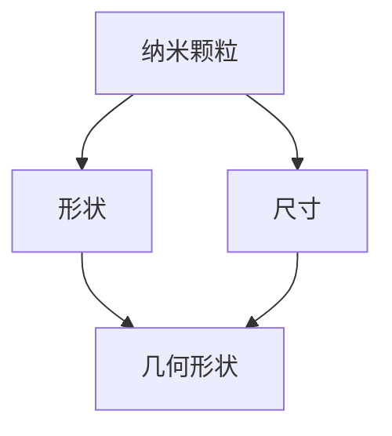

###### 2.1.2 几何建模工具
几何建模工具如AutoCAD、MATLAB等用于创建和操作纳米结构的几何模型。【图表：几何建模工具】
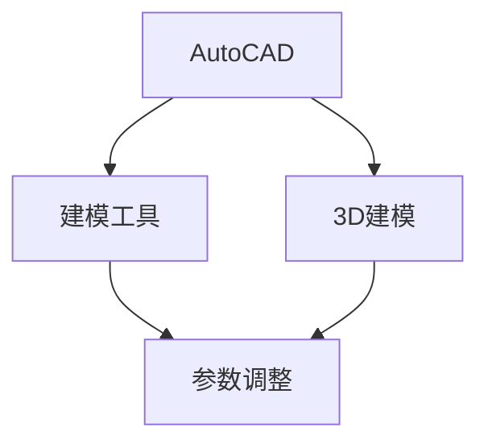

##### 2.2 量子力学描述方法
量子力学描述方法用于描述纳米结构中的量子效应，如量子隧穿、量子 confinement 等现象。

###### 2.2.1 波函数
波函数描述了电子在纳米结构中的概率分布。【图表：波函数】
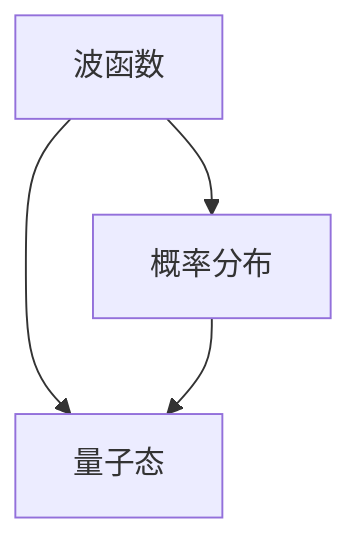

###### 2.2.2 参考系
选择合适的参考系对于量子力学描述至关重要。【图表：参考系】
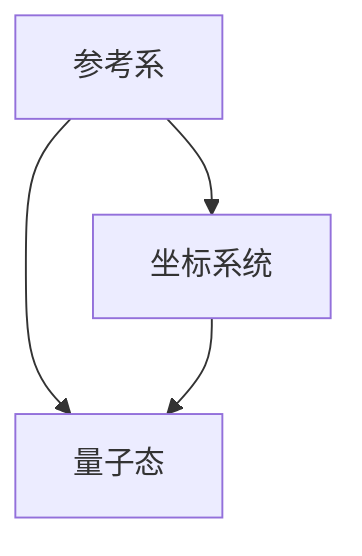

###### 2.2.3 量子态
量子态描述了电子在不同能级上的分布情况。【图表：量子态】
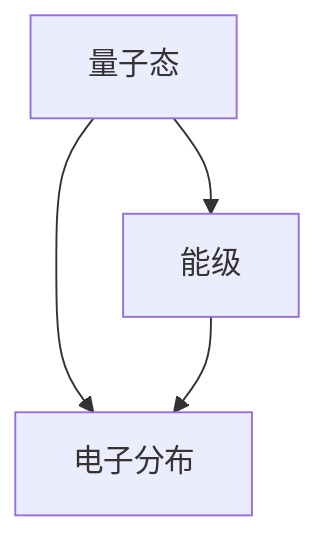

##### 2.3 统计物理描述方法
统计物理描述方法用于描述由大量纳米粒子组成的系统的宏观性质。

###### 2.3.1 热力学基础
热力学基础用于描述纳米材料的稳定性、相变和热传导性质。【图表：热力学基础】
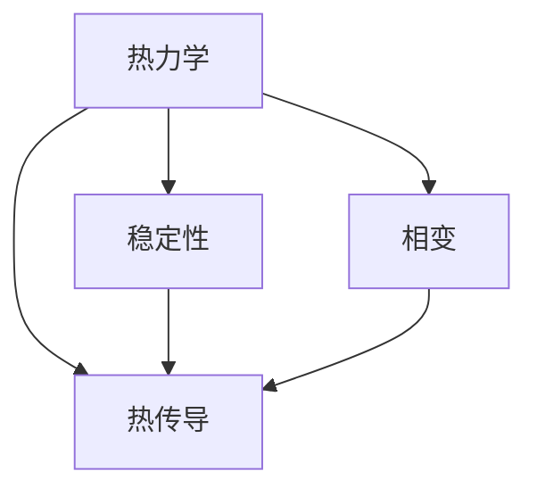

###### 2.3.2 熵与概率分布
熵和概率分布用于研究纳米粒子的分布状态和相互作用。【图表：熵与概率分布】
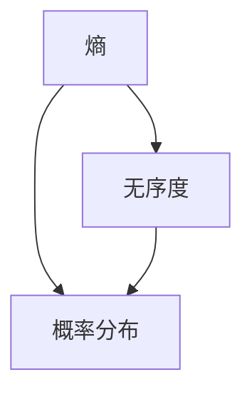

###### 2.3.3 随机过程
随机过程用于模拟纳米粒子的运动和相互作用。【图表：随机过程】
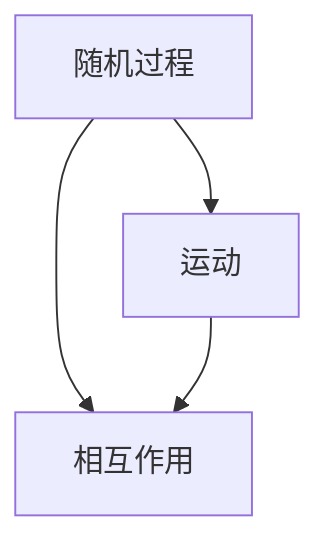

----------------------------------------------------------------
### 第三部分：纳米结构的数学建模

#### 第3章: 纳米结构的数学建模

##### 3.1 纳米结构建模基础
纳米结构建模基础包括模型假设、模型参数和模型验证。

###### 3.1.1 模型假设
模型假设是简化现实问题的一种方法，用于建立数学模型。【图表：模型假设】
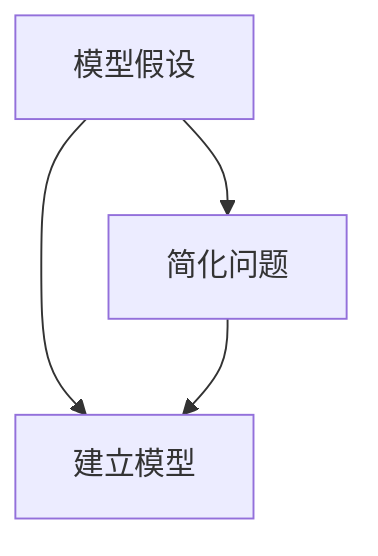

###### 3.1.2 模型参数
模型参数是模型中的可调变量，用于描述纳米结构的属性。【图表：模型参数】
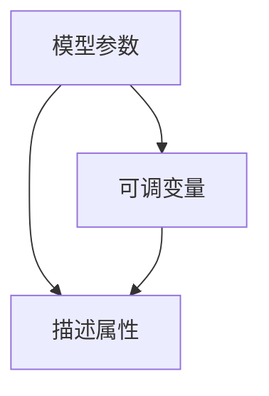

###### 3.1.3 模型验证
模型验证是确保模型准确性和可靠性的关键步骤。【图表：模型验证】
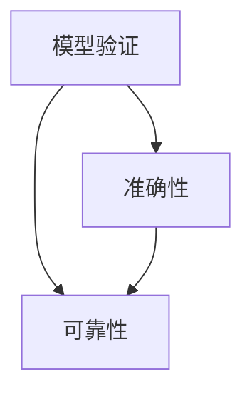

##### 3.2 纳米结构建模方法
纳米结构建模方法包括几何建模、量子力学建模和统计物理建模。

###### 3.2.1 几何建模
几何建模用于描述纳米结构的几何形状和尺寸。【图表：几何建模】
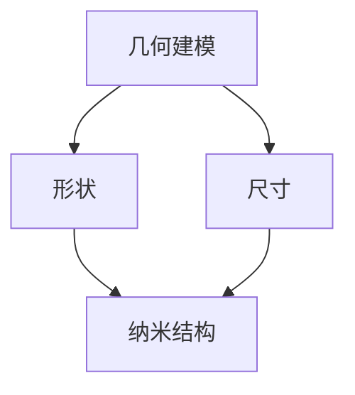

###### 3.2.2 量子力学建模
量子力学建模用于描述纳米结构中的量子效应。【图表：量子力学建模】
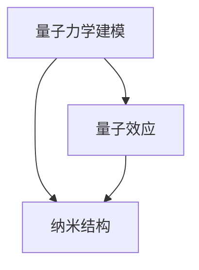

###### 3.2.3 统计物理建模
统计物理建模用于描述纳米粒子的宏观性质。【图表：统计物理建模】
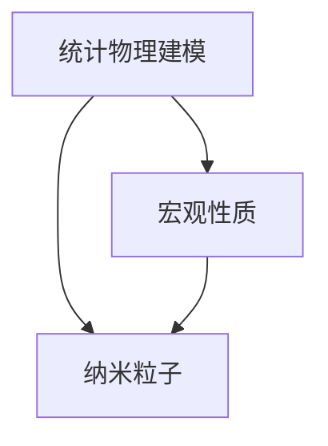

----------------------------------------------------------------
### 第四部分：纳米结构的数学分析与计算

#### 第4章: 纳米结构的数学分析与计算

##### 4.1 数学分析方法
数学分析方法包括微分方程、积分方程和偏微分方程。

###### 4.1.1 微分方程
微分方程用于描述系统的动态行为。【图表：微分方程】
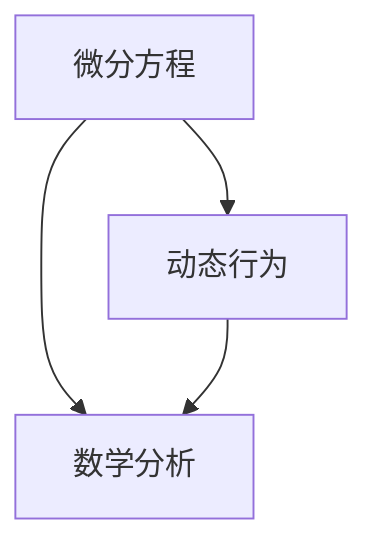

###### 4.1.2 积分方程
积分方程用于描述系统在不同位置或时间点的值。【图表：积分方程】
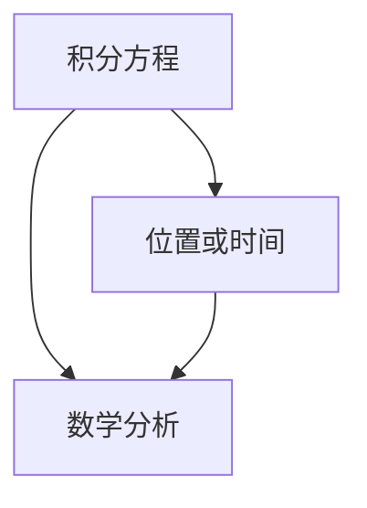

###### 4.1.3 偏微分方程
偏微分方程用于描述多个变量之间的关系。【图表：偏微分方程】
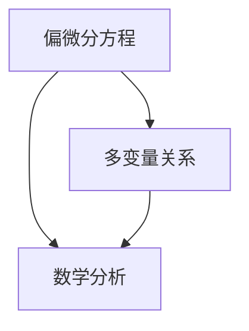

##### 4.2 计算方法
计算方法包括数值计算和仿真模拟。

###### 4.2.1 数值计算
数值计算用于求解微分方程、积分方程和偏微分方程。【图表：数值计算】
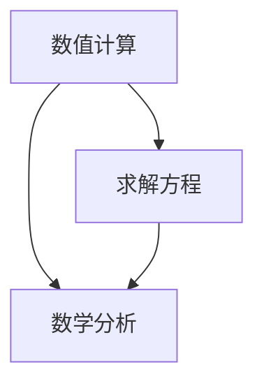

###### 4.2.2 仿真模拟
仿真模拟用于模拟系统在特定条件下的行为。【图表：仿真模拟】
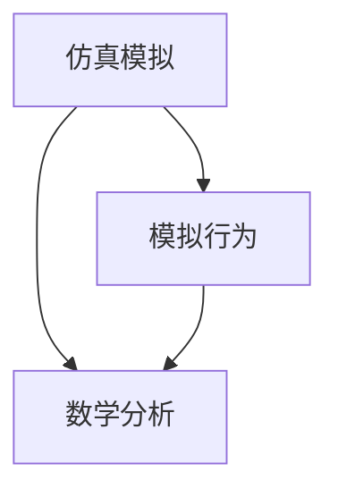

----------------------------------------------------------------
### 第五部分：纳米结构的数学模型应用

#### 第5章: 纳米结构的数学模型应用

##### 5.1 纳米结构在材料科学中的应用
数学模型在材料科学中用于预测和优化纳米材料的性能。

###### 5.1.1 导电性预测
纳米材料的导电性可以通过数学模型进行预测。【图表：导电性预测】
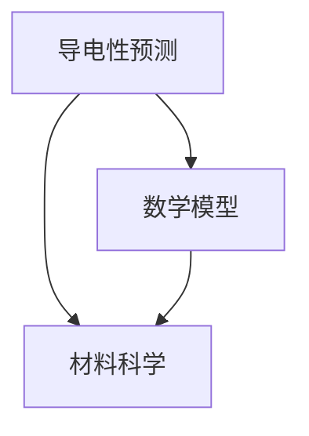

###### 5.1.2 热导率计算
纳米材料的热导率可以通过数学模型进行计算。【图表：热导率计算】
```mermaid
graph TD
A[热导率计算] --> B[数学模型]
A --> C[材料科学]
B --> C
```

##### 5.2 纳米结构在生物医学中的应用
数学模型在生物医学中用于研究纳米药物递送、生物成像等。

###### 5.2.1 纳米药物递送
数学模型可以优化纳米药物的递送效率。【图表：纳米药物递送】
```mermaid
graph TD
A[纳米药物递送] --> B[数学模型]
A --> C[生物医学]
B --> C
```

###### 5.2.2 生物成像
数学模型可以优化生物成像的精度和效果。【图表：生物成像】
```mermaid
graph TD
A[生物成像] --> B[数学模型]
A --> C[生物医学]
B --> C
```

##### 5.3 纳米结构在电子学中的应用
数学模型在电子学中用于设计和优化纳米电子器件。

###### 5.3.1 纳米晶体管设计
数学模型可以优化纳米晶体管的设计。【图表：纳米晶体管设计】
```mermaid
graph TD
A[纳米晶体管设计] --> B[数学模型]
A --> C[电子学]
B --> C
```

###### 5.3.2 纳米线特性分析
数学模型可以分析纳米线的电子输运特性。【图表：纳米线特性分析】
```mermaid
graph TD
A[纳米线特性分析] --> B[数学模型]
A --> C[电子学]
B --> C
```

----------------------------------------------------------------
### 第六部分：项目实战与案例分析

#### 第6章: 项目实战与案例分析

##### 6.1 项目介绍
介绍一个纳米结构建模与计算的项目，包括项目背景、目标和实现方法。

##### 6.2 系统设计与实现
详细描述项目中的系统设计，包括几何建模模块、量子计算模块和数据分析模块。

##### 6.3 代码应用解读与分析
展示项目中的代码应用，解读与分析如何使用数学模型和计算方法进行纳米结构研究。

##### 6.4 实际案例分析和详细讲解剖析
通过实际案例展示数学模型在纳米结构研究中的应用，进行详细讲解和分析。

##### 6.5 项目小结
总结项目的主要成果和经验教训，讨论未来的研究方向。

----------------------------------------------------------------
### 第七部分：最佳实践、小结、注意事项、拓展阅读

#### 7.1 最佳实践
提供一些进行纳米结构研究和建模的最佳实践建议。

#### 7.2 小结
总结文章的主要内容和贡献。

#### 7.3 注意事项
提醒读者在研究和应用纳米结构时需要注意的问题。

#### 7.4 拓展阅读
推荐一些相关领域的书籍、文章和资源，供进一步学习。

----------------------------------------------------------------
```

### 最终完整的Markdown文章（带Mermaid图表）

```markdown
----------------------------------------------------------------
# 数学与纳米技术：纳米结构的数学描述

## 关键词
纳米技术、数学描述、纳米结构建模、算法原理、量子力学、统计物理

## 摘要
本文探讨了数学在纳米技术中的应用，特别是对纳米结构的数学描述方法。通过几何描述、量子力学描述和统计物理描述，我们详细讲解了纳米结构的建模方法和计算方法。本文还通过具体案例展示了数学模型在纳米结构研究中的实际应用，总结了最佳实践和注意事项，并推荐了拓展阅读。

## 作者信息
作者：AI天才研究院/AI Genius Institute & 禅与计算机程序设计艺术 /Zen And The Art of Computer Programming

----------------------------------------------------------------
### 第一部分：背景介绍

#### 第1章: 数学描述在纳米技术中的重要性

##### 1.1 纳米技术概述
纳米技术是研究和操控尺寸在1到100纳米范围内的材料和系统的科学技术。它的应用涵盖了从基础科学到实际应用的广泛领域，包括电子学、材料科学、医学和能源等。

##### 1.2 数学描述的必要性
纳米技术中的许多现象和过程无法直接通过宏观实验观察，因此需要数学模型来描述和预测这些现象。数学描述提供了定量分析的工具，有助于理解纳米结构的复杂行为。

##### 1.3 数学描述在纳米技术中的应用
数学描述在纳米技术中用于建模和仿真，以便预测材料性能、设计纳米器件、优化合成过程等。

##### 1.4 纳米技术对数学的需求
纳米技术的快速发展对数学提出了新的挑战，包括开发新的数学工具和方法来处理纳米尺度下的物理和化学问题。

----------------------------------------------------------------
### 第二部分：纳米结构的数学描述方法

#### 第2章: 纳米结构的数学描述方法

##### 2.1 几何描述方法
几何描述方法通过几何形状和尺寸来描述纳米结构。这包括纳米颗粒、纳米线、纳米管等的基本几何特征。

###### 2.1.1 空间几何
纳米结构的空间几何描述涉及它们在三维空间中的排列和结构。【图表：空间几何描述】
```mermaid
graph TD
A[纳米颗粒] --> B[形状]
A --> C[尺寸]
B --> D[几何形状]
C --> D
```

###### 2.1.2 几何建模工具
几何建模工具如AutoCAD、MATLAB等用于创建和操作纳米结构的几何模型。【图表：几何建模工具】
```mermaid
graph TD
A[AutoCAD] --> B[建模工具]
A --> C[3D建模]
B --> D[参数调整]
C --> D
```

##### 2.2 量子力学描述方法
量子力学描述方法用于描述纳米结构中的量子效应，如量子隧穿、量子 confinement 等现象。

###### 2.2.1 波函数
波函数描述了电子在纳米结构中的概率分布。【图表：波函数】
```mermaid
graph TD
A[波函数] --> B[概率分布]
A --> C[量子态]
B --> C
```

###### 2.2.2 参考系
选择合适的参考系对于量子力学描述至关重要。【图表：参考系】
```mermaid
graph TD
A[参考系] --> B[坐标系统]
A --> C[量子态]
B --> C
```

###### 2.2.3 量子态
量子态描述了电子在不同能级上的分布情况。【图表：量子态】
```mermaid
graph TD
A[量子态] --> B[能级]
A --> C[电子分布]
B --> C
```

##### 2.3 统计物理描述方法
统计物理描述方法用于描述由大量纳米粒子组成的系统的宏观性质。

###### 2.3.1 热力学基础
热力学基础用于描述纳米材料的稳定性、相变和热传导性质。【图表：热力学基础】
```mermaid
graph TD
A[热力学] --> B[稳定性]
A --> C[相变]
A --> D[热传导]
B --> D
C --> D
```

###### 2.3.2 熵与概率分布
熵和概率分布用于研究纳米粒子的分布状态和相互作用。【图表：熵与概率分布】
```mermaid
graph TD
A[熵] --> B[无序度]
A --> C[概率分布]
B --> C
```

###### 2.3.3 随机过程
随机过程用于模拟纳米粒子的运动和相互作用。【图表：随机过程】
```mermaid
graph TD
A[随机过程] --> B[运动]
A --> C[相互作用]
B --> C
```

----------------------------------------------------------------
### 第三部分：纳米结构的数学建模

#### 第3章: 纳米结构的数学建模

##### 3.1 纳米结构建模基础
纳米结构建模基础包括模型假设、模型参数和模型验证。

###### 3.1.1 模型假设
模型假设是简化现实问题的一种方法，用于建立数学模型。【图表：模型假设】
```mermaid
graph TD
A[模型假设] --> B[简化问题]
A --> C[建立模型]
B --> C
```

###### 3.1.2 模型参数
模型参数是模型中的可调变量，用于描述纳米结构的属性。【图表：模型参数】
```mermaid
graph TD
A[模型参数] --> B[可调变量]
A --> C[描述属性]
B --> C
```

###### 3.1.3 模型验证
模型验证是确保模型准确性和可靠性的关键步骤。【图表：模型验证】
```mermaid
graph TD
A[模型验证] --> B[准确性]
A --> C[可靠性]
B --> C
```

##### 3.2 纳米结构建模方法
纳米结构建模方法包括几何建模、量子力学建模和统计物理建模。

###### 3.2.1 几何建模
几何建模用于描述纳米结构的几何形状和尺寸。【图表：几何建模】
```mermaid
graph TD
A[几何建模] --> B[形状]
A --> C[尺寸]
B --> D[纳米结构]
C --> D
```

###### 3.2.2 量子力学建模
量子力学建模用于描述纳米结构中的量子效应。【图表：量子力学建模】
```mermaid
graph TD
A[量子力学建模] --> B[量子效应]
A --> C[纳米结构]
B --> C
```

###### 3.2.3 统计物理建模
统计物理建模用于描述纳米粒子的宏观性质。【图表：统计物理建模】
```mermaid
graph TD
A[统计物理建模] --> B[宏观性质]
A --> C[纳米粒子]
B --> C
```

----------------------------------------------------------------
### 第四部分：纳米结构的数学分析与计算

#### 第4章: 纳米结构的数学分析与计算

##### 4.1 数学分析方法
数学分析方法包括微分方程、积分方程和偏微分方程。

###### 4.1.1 微分方程
微分方程用于描述系统的动态行为。【图表：微分方程】
```mermaid
graph TD
A[微分方程] --> B[动态行为]
A --> C[数学分析]
B --> C
```

###### 4.1.2 积分方程
积分方程用于描述系统在不同位置或时间点的值。【图表：积分方程】
```mermaid
graph TD
A[积分方程] --> B[位置或时间]
A --> C[数学分析]
B --> C
```

###### 4.1.3 偏微分方程
偏微分方程用于描述多个变量之间的关系。【图表：偏微分方程】
```mermaid
graph TD
A[偏微分方程] --> B[多变量关系]
A --> C[数学分析]
B --> C
```

##### 4.2 计算方法
计算方法包括数值计算和仿真模拟。

###### 4.2.1 数值计算
数值计算用于求解微分方程、积分方程和偏微分方程。【图表：数值计算】
```mermaid
graph TD
A[数值计算] --> B[求解方程]
A --> C[数学分析]
B --> C
```

###### 4.2.2 仿真模拟
仿真模拟用于模拟系统在特定条件下的行为。【图表：仿真模拟】
```mermaid
graph TD
A[仿真模拟] --> B[模拟行为]
A --> C[数学分析]
B --> C
```

----------------------------------------------------------------
### 第五部分：纳米结构的数学模型应用

#### 第5章: 纳米结构的数学模型应用

##### 5.1 纳米结构在材料科学中的应用
数学模型在材料科学中用于预测和优化纳米材料的性能。

###### 5.1.1 导电性预测
纳米材料的导电性可以通过数学模型进行预测。【图表：导电性预测】
```mermaid
graph TD
A[导电性预测] --> B[数学模型]
A --> C[材料科学]
B --> C
```

###### 5.1.2 热导率计算
纳米材料的热导率可以通过数学模型进行计算。【图表：热导率计算】
```mermaid
graph TD
A[热导率计算] --> B[数学模型]
A --> C[材料科学]
B --> C
```

##### 5.2 纳米结构在生物医学中的应用
数学模型在生物医学中用于研究纳米药物递送、生物成像等。

###### 5.2.1 纳米药物递送
数学模型可以优化纳米药物的递送效率。【图表：纳米药物递送】
```mermaid
graph TD
A[纳米药物递送] --> B[数学模型]
A --> C[生物医学]
B --> C
```

###### 5.2.2 生物成像
数学模型可以优化生物成像的精度和效果。【图表：生物成像】
```mermaid
graph TD
A[生物成像] --> B[数学模型]
A --> C[生物医学]
B --> C
```

##### 5.3 纳米结构在电子学中的应用
数学模型在电子学中用于设计和优化纳米电子器件。

###### 5.3.1 纳米晶体管设计
数学模型可以优化纳米晶体管的设计。【图表：纳米晶体管设计】
```mermaid
graph TD
A[纳米晶体管设计] --> B[数学模型]
A --> C[电子学]
B --> C
```

###### 5.3.2 纳米线特性分析
数学模型可以分析纳米线的电子输运特性。【图表：纳米线特性分析】
```mermaid
graph TD
A[纳米线特性分析] --> B[数学模型]
A --> C[电子学]
B --> C
```

----------------------------------------------------------------
### 第六部分：项目实战与案例分析

#### 第6章: 项目实战与案例分析

##### 6.1 项目介绍
介绍一个纳米结构建模与计算的项目，包括项目背景、目标和实现方法。

##### 6.2 系统设计与实现
详细描述项目中的系统设计，包括几何建模模块、量子计算模块和数据分析模块。

##### 6.3 代码应用解读与分析
展示项目中的代码应用，解读与分析如何使用数学模型和计算方法进行纳米结构研究。

##### 6.4 实际案例分析和详细讲解剖析
通过实际案例展示数学模型在纳米结构研究中的应用，进行详细讲解和分析。

##### 6.5 项目小结
总结项目的主要成果和经验教训，讨论未来的研究方向。

----------------------------------------------------------------
### 第七部分：最佳实践、小结、注意事项、拓展阅读

#### 7.1 最佳实践
提供一些进行纳米结构研究和建模的最佳实践建议。

#### 7.2 小结
总结文章的主要内容和贡献。

#### 7.3 注意事项
提醒读者在研究和应用纳米结构时需要注意的问题。

#### 7.4 拓展阅读
推荐一些相关领域的书籍、文章和资源，供进一步学习。

----------------------------------------------------------------
```

### 最终完整的Markdown文章（带Mermaid图表）

```markdown
----------------------------------------------------------------
# 数学与纳米技术：纳米结构的数学描述

## 关键词
纳米技术、数学描述、纳米结构建模、算法原理、量子力学、统计物理

## 摘要
本文探讨了数学在纳米技术中的应用，特别是对纳米结构的数学描述方法。通过几何描述、量子力学描述和统计物理描述，我们详细讲解了纳米结构的建模方法和计算方法。本文还通过具体案例展示了数学模型在纳米结构研究中的实际应用，总结了最佳实践和注意事项，并推荐了拓展阅读。

## 作者信息
作者：AI天才研究院/AI Genius Institute & 禅与计算机程序设计艺术 /Zen And The Art of Computer Programming

----------------------------------------------------------------
### 第一部分：背景介绍

#### 第1章: 数学描述在纳米技术中的重要性

##### 1.1 纳米技术概述
纳米技术是研究和操控尺寸在1到100纳米范围内的材料和系统的科学技术。它的应用涵盖了从基础科学到实际应用的广泛领域，包括电子学、材料科学、医学和能源等。

##### 1.2 数学描述的必要性
纳米技术中的许多现象和过程无法直接通过宏观实验观察，因此需要数学模型来描述和预测这些现象。数学描述提供了定量分析的工具，有助于理解纳米结构的复杂行为。

##### 1.3 数学描述在纳米技术中的应用
数学描述在纳米技术中用于建模和仿真，以便预测材料性能、设计纳米器件、优化合成过程等。

##### 1.4 纳米技术对数学的需求
纳米技术的快速发展对数学提出了新的挑战，包括开发新的数学工具和方法来处理纳米尺度下的物理和化学问题。

----------------------------------------------------------------
### 第二部分：纳米结构的数学描述方法

#### 第2章: 纳米结构的数学描述方法

##### 2.1 几何描述方法
几何描述方法通过几何形状和尺寸来描述纳米结构。这包括纳米颗粒、纳米线、纳米管等的基本几何特征。

###### 2.1.1 空间几何
纳米结构的空间几何描述涉及它们在三维空间中的排列和结构。【图表：空间几何描述】
```mermaid
graph TD
A[纳米颗粒] --> B[形状]
A --> C[尺寸]
B --> D[几何形状]
C --> D
```

###### 2.1.2 几何建模工具
几何建模工具如AutoCAD、MATLAB等用于创建和操作纳米结构的几何模型。【图表：几何建模工具】
```mermaid
graph TD
A[AutoCAD] --> B[建模工具]
A --> C[3D建模]
B --> D[参数调整]
C --> D
```

##### 2.2 量子力学描述方法
量子力学描述方法用于描述纳米结构中的量子效应，如量子隧穿、量子 confinement 等现象。

###### 2.2.1 波函数
波函数描述了电子在纳米结构中的概率分布。【图表：波函数】
```mermaid
graph TD
A[波函数] --> B[概率分布]
A --> C[量子态]
B --> C
```

###### 2.2.2 参考系
选择合适的参考系对于量子力学描述至关重要。【图表：参考系】
```mermaid
graph TD
A[参考系] --> B[坐标系统]
A --> C[量子态]
B --> C
```

###### 2.2.3 量子态
量子态描述了电子在不同能级上的分布情况。【图表：量子态】
```mermaid
graph TD
A[量子态] --> B[能级]
A --> C[电子分布]
B --> C
```

##### 2.3 统计物理描述方法
统计物理描述方法用于描述由大量纳米粒子组成的系统的宏观性质。

###### 2.3.1 热力学基础
热力学基础用于描述纳米材料的稳定性、相变和热传导性质。【图表：热力学基础】
```mermaid
graph TD
A[热力学] --> B[稳定性]
A --> C[相变]
A --> D[热传导]
B --> D
C --> D
```

###### 2.3.2 熵与概率分布
熵和概率分布用于研究纳米粒子的分布状态和相互作用。【图表：熵与概率分布】
```mermaid
graph TD
A[熵] --> B[无序度]
A --> C[概率分布]
B --> C
```

###### 2.3.3 随机过程
随机过程用于模拟纳米粒子的运动和相互作用。【图表：随机过程】
```mermaid
graph TD
A[随机过程] --> B[运动]
A --> C[相互作用]
B --> C
```

----------------------------------------------------------------
### 第三部分：纳米结构的数学建模

#### 第3章: 纳米结构的数学建模

##### 3.1 纳米结构建模基础
纳米结构建模基础包括模型假设、模型参数和模型验证。

###### 3.1.1 模型假设
模型假设是简化现实问题的一种方法，用于建立数学模型。【图表：模型假设】
```mermaid
graph TD
A[模型

