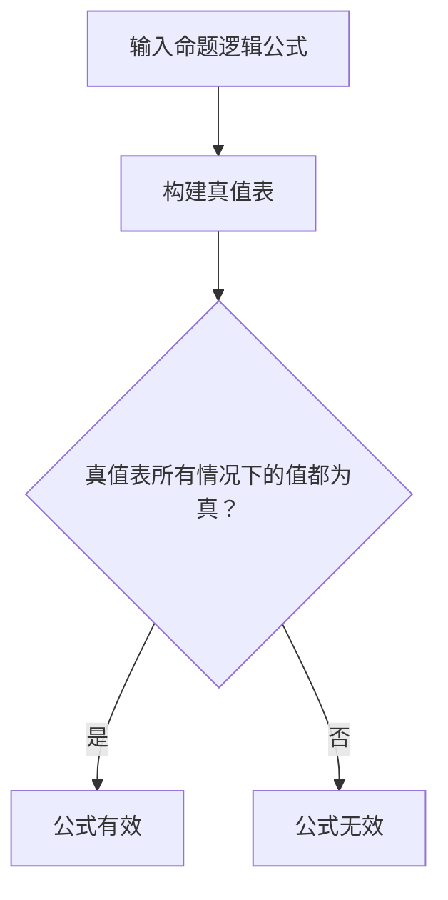
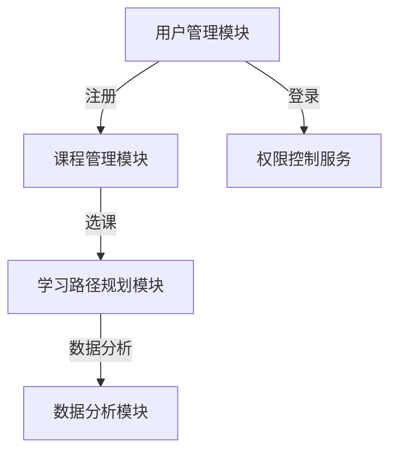
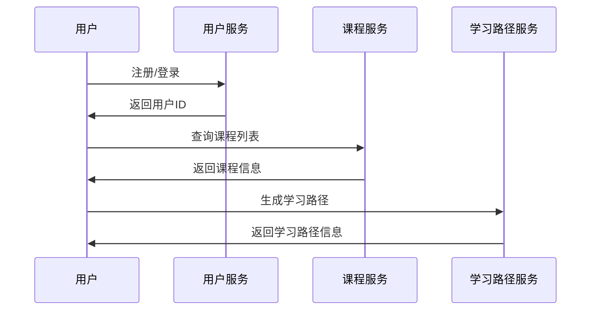

                 

## 引言：数学与组合学的重要性

### 1.1 数学与组合学的核心概念

数学与组合学作为两大重要分支，在理论计算机科学、工程学、经济学以及日常生活的各个领域中都有着广泛的应用。数学作为研究数量、结构、变化和空间等概念的一门科学，其基本原则和方法广泛应用于数据分析、算法设计以及计算理论等领域。而组合学则专注于研究离散对象的组合性质，例如排列、组合、图论和枚举方法等，这些研究在计算机科学中尤其重要，因为它们直接关系到算法效率和问题求解的复杂性。

### 1.2 数学与组合学在计算机科学中的角色

在计算机科学中，数学与组合学的结合使得许多复杂问题得以建模和解决。例如，图论的基本概念在计算机网络设计和路由算法中扮演着关键角色，组合学中的计数原理则帮助我们在算法设计中优化时间和空间复杂度。此外，概率论与数理统计在人工智能和机器学习中也有重要作用，这些领域的交叉应用推动了现代技术的快速发展。

### 1.3 研究数学与组合学的意义

深入研究数学与组合学不仅有助于我们理解和解决实际问题，还能培养逻辑思维、抽象能力和创新意识。掌握数学与组合学的基本原理和方法，可以使我们在面对复杂问题时更加从容和有条不紊。同时，这一领域的研究成果也在不断推动着计算机科学和工程学的发展，为我们打开了更多创新的可能。

### 1.4 本书的内容与结构

本书旨在通过系统、详细的阐述，帮助读者全面理解数学与组合学的基本原理和应用。全书分为十一章，涵盖了从基础概念到高级应用的各个方面。从基础的集合论和逻辑，到函数与关系、组合学原理，再到生成函数、图论、算法以及概率论等，每章内容都经过精心设计和组织，旨在逐步引导读者深入这一领域。希望通过本书的学习，读者能够建立起扎实的理论基础，并能够将所学知识应用到实际问题的解决中。

### 1.5 学习路径与预期成果

本书适合对数学与组合学有一定基础的读者，无论是本科大学生、研究生，还是对相关领域有深入研究的专业人士，都能从中受益。通过系统的学习和实践，读者将能够：

1. 理解数学与组合学的基本概念和原理。
2. 掌握分析离散结构问题的方法。
3. 熟悉常见的算法和数学模型。
4. 能够运用所学知识解决实际问题。

总之，本书不仅是数学与组合学领域的入门指南，更是深入研究和应用这一领域的实用手册。

## 关键词

- 数学与组合学
- 离散结构
- 集合论
- 函数与关系
- 图论
- 组合计数
- 生成函数
- 概率论
- 算法设计

## 摘要

本书《数学与组合学：离散结构的数学分析》旨在为读者提供全面、深入的数学与组合学理论，以及其在离散结构分析中的应用。全书分为十一章，涵盖了从基础概念到高级应用的内容。首先，介绍了数学与组合学的基本概念和其在计算机科学中的重要性。接着，详细阐述了集合论、逻辑、函数与关系、组合学基础等核心理论。随后，本书深入探讨生成函数、图论、算法以及概率论等高级主题，并通过实际案例和项目实战，帮助读者掌握所学知识。本书结构紧凑，逻辑清晰，旨在培养读者的逻辑思维和解决实际问题的能力，适合作为本科和研究生的教材，也适用于对相关领域有深入研究的专业人士。

## 数学与组合学：离散结构的数学分析

### 引言

在计算机科学和数学中，离散结构的分析和研究扮演着至关重要的角色。从基本的数据结构到复杂的算法设计，无不涉及到离散结构的数学分析。本书《数学与组合学：离散结构的数学分析》旨在通过系统地介绍数学与组合学的基本概念和方法，帮助读者深入理解和掌握这一领域。本书将分章节详细探讨离散结构中的核心概念、数学模型以及实际应用，旨在为读者提供全面而深入的学习资源。

### 目录

1. **引言**
   - 1.1 数学与组合学的核心概念
   - 1.2 数学与组合学在计算机科学中的角色
   - 1.3 研究数学与组合学的意义
   - 1.4 本书的内容与结构
   - 1.5 学习路径与预期成果

2. **集合论与逻辑**
   - 2.1 集合论的基本概念
   - 2.2 集合的运算
   - 2.3 逻辑与命题逻辑

3. **函数与关系**
   - 3.1 函数的基本性质
   - 3.2 关系的性质与运算
   - 3.3 图论基础

4. **组合学基础**
   - 4.1 组合计数的基本原理
   - 4.2 排列与组合的计算方法
   - 4.3 二项式定理与帕斯卡三角形

5. **生成函数与递推关系**
   - 5.1 生成函数的定义与应用
   - 5.2 递推关系的解法
   - 5.3 生成函数在组合学中的应用

6. **图论**
   - 6.1 图的基本概念与性质
   - 6.2 树与路径
   - 6.3 网络流与匹配问题

7. **算法设计与分析**
   - 7.1 算法设计的基本原则
   - 7.2 排序与查找算法
   - 7.3 算法的复杂度分析

8. **概率论与离散随机变量**
   - 8.1 基本概率理论
   - 8.2 概率分布
   - 8.3 随机变量的性质与应用

9. **极值组合学**
   - 9.1 极值原理
   - 9.2 雷姆赛理论
   - 9.3 组合设计

10. **高级组合学**
    - 10.1 矩阵树理论
    - 10.2 枚举组合学
    - 10.3 组合优化

11. **结论与未来方向**
    - 11.1 关键概念与技术的总结
    - 11.2 离散结构研究中的挑战与机遇
    - 11.3 未来研究方向

### 1.1 数学与组合学的核心概念

数学与组合学作为两大重要分支，各自有着独特的核心概念和应用领域。数学侧重于研究数量、结构、变化以及空间等概念，而组合学则专注于研究离散对象的组合性质。

首先，数学的核心概念包括集合论、逻辑、函数与关系等。集合论是数学的基础，它研究对象的集合以及这些集合之间的运算关系。逻辑则研究命题之间的关系，以及如何通过逻辑推理得出结论。函数与关系则描述了输入与输出之间的关系，这些概念广泛应用于算法设计和理论分析中。

组合学的核心概念则包括排列、组合、图论和计数方法等。排列和组合是计数的基本工具，它们帮助我们计算不同情况的可能性。图论则研究对象之间的连接关系，这些关系在计算机网络、社会网络和交通网络等领域有广泛的应用。计数方法则用于解决组合问题，如计算不同组合的数量和性质。

### 1.2 数学与组合学在计算机科学中的角色

数学与组合学在计算机科学中扮演着至关重要的角色。它们为算法设计、复杂性理论、数据结构分析和问题求解提供了坚实的理论基础。

首先，数学为算法设计提供了重要的工具。例如，图论的基本概念在网络算法和路径查找中有着广泛的应用。概率论和数理统计在人工智能和机器学习中也是不可或缺的，这些领域的算法需要处理大量的随机数据和不确定性问题。

其次，组合学在计算机科学中的应用也非常广泛。排列和组合在算法设计中用于优化时间和空间复杂度，例如在组合优化问题和调度问题中。图论则在网络设计和路由算法中有着广泛的应用，如图的网络流问题在互联网通信和网络优化中非常重要。

总之，数学与组合学在计算机科学中不仅是理论工具，更是实际应用的重要组成部分。掌握这些概念和方法，对于理解和解决计算机科学中的复杂问题具有重要意义。

### 1.3 研究数学与组合学的意义

研究数学与组合学具有重要意义，不仅在于其理论价值，还在于其实际应用。以下是研究数学与组合学的一些关键意义：

首先，数学与组合学提供了强大的理论工具，使我们能够更好地理解和解决实际问题。例如，数学中的集合论和逻辑可以帮助我们分析和处理复杂的数据结构和算法问题。组合学中的排列和组合原理则在解决计数问题和优化问题中发挥了重要作用。

其次，数学与组合学能够培养我们的逻辑思维和抽象能力。通过研究和解决数学问题，我们可以锻炼自己的思维，学会如何从复杂的现象中抽象出核心问题，并运用逻辑推理找到解决方案。

此外，数学与组合学在推动技术进步方面也具有重要作用。许多现代技术，如人工智能、数据科学和机器学习，都建立在数学和组合学的基础之上。深入研究这些领域，有助于我们开发出更加高效和智能的算法和技术，从而推动社会和经济的进步。

总之，研究数学与组合学不仅能够提升我们的理论素养，还能为实际应用提供有力支持，对个人和社会都有着深远的影响。

### 1.4 本书的内容与结构

本书《数学与组合学：离散结构的数学分析》旨在通过系统、详细的阐述，帮助读者全面理解数学与组合学的基本原理和应用。全书共分为十一章，每一章都围绕特定的主题进行深入探讨。

**第一章**是引言，介绍了数学与组合学的基本概念、在计算机科学中的角色、研究意义以及本书的结构和预期成果。

**第二章**讨论集合论与逻辑，包括集合的基本概念、集合运算以及命题逻辑。

**第三章**介绍函数与关系，涉及函数的基本性质、关系的性质与运算，以及图论的基础。

**第四章**探讨组合学基础，包括排列与组合的计算方法、二项式定理与帕斯卡三角形。

**第五章**介绍生成函数与递推关系，讲解生成函数的定义与应用、递推关系的解法以及生成函数在组合学中的应用。

**第六章**深入图论，讨论图的基本概念与性质、树与路径，以及网络流与匹配问题。

**第七章**介绍算法设计与分析，包括算法设计的基本原则、排序与查找算法，以及算法的复杂度分析。

**第八章**讨论概率论与离散随机变量，包括基本概率理论、概率分布，以及随机变量的性质与应用。

**第九章**介绍极值组合学，包括极值原理、雷姆赛理论以及组合设计。

**第十章**探讨高级组合学，包括矩阵树理论、枚举组合学和组合优化。

**第十一章**是结论与未来方向，总结关键概念与技术，探讨离散结构研究中的挑战与机遇，以及未来的研究方向。

通过这一系统性的结构，本书旨在逐步引导读者深入理解数学与组合学，并能够将其应用于实际问题中。

### 1.5 学习路径与预期成果

学习本书《数学与组合学：离散结构的数学分析》的路径可以分为以下几个步骤，并预期达到以下成果：

**步骤1：基础知识学习**  
首先，读者应掌握基础数学概念，如集合论、逻辑、函数与关系等。这可以通过阅读相关教材或参考书籍来完成。预期的成果是能够理解并应用基本数学概念解决简单问题。

**步骤2：深入理解核心原理**  
接下来，读者应深入探讨组合学的基础知识，包括排列、组合、生成函数与递推关系等。这一步骤可以通过阅读本书的相应章节，结合实际例题和习题来完成。预期的成果是能够独立解决组合问题，并理解其中的数学原理。

**步骤3：掌握算法设计与分析**  
第三步是学习算法设计与分析，这包括排序算法、查找算法以及图算法等。通过理解算法的基本原理和复杂度分析，读者应能够设计高效的算法。预期的成果是能够分析和优化算法，解决实际计算问题。

**步骤4：应用与实践**  
最后，读者应通过实际项目和实践来应用所学知识。这可以通过编写程序、解决实际问题或参与相关的科研活动来实现。预期的成果是能够将理论知识应用到实际问题中，并具备解决复杂问题的能力。

通过以上步骤的学习，读者将能够建立起扎实的数学与组合学理论基础，并具备解决实际问题的能力。

## 集合论与逻辑

### 2.1 集合论的基本概念

集合论是数学的基础，它研究对象的集合以及这些集合之间的运算关系。理解集合的基本概念是学习集合论和组合学的关键。

#### 2.1.1 集合的定义

集合是由确定的、互异的元素组成的整体。我们通常用大写字母如A、B、C等来表示集合，而集合中的元素则用小写字母如a、b、c等来表示。集合可以用列举法表示，如{a, b, c}表示包含元素a、b、c的集合；也可以用描述法表示，如{x | x ∈ N且x > 5}表示所有大于5的自然数组成的集合。

#### 2.1.2 集合的元素

集合的元素是构成集合的基本单位。集合中的元素可以重复，但每个元素必须是确定的且互异的。例如，集合{1, 2, 2, 3}可以简化为{1, 2, 3}。

#### 2.1.3 空集

空集是没有任何元素的集合，通常用符号∅或{}表示。空集是任何集合的子集，但它本身不是任何集合的超集。

#### 2.1.4 集合的表示方法

集合可以通过列举法或描述法表示。列举法将集合中的所有元素一一列出，例如{a, b, c}。描述法则通过一定的规则来定义集合中的元素，例如{x | x ∈ N且x > 5}。

#### 2.1.5 子集与真子集

如果一个集合的所有元素都是另一个集合的元素，则前者是后者的子集。用符号A ⊆ B表示。如果A是B的子集但A不等于B，则称A是B的真子集，记作A ⊊ B。

#### 2.1.6 全集

全集是指包含某个特定集合中所有讨论对象的集合。例如，在讨论自然数时，自然数的全集是所有正整数的集合。

### 2.2 集合的运算

集合的运算包括并集、交集、补集和差集等。这些运算帮助我们分析集合之间的关系和特性。

#### 2.2.1 并集

并集是指由两个或多个集合中所有元素组成的集合。用符号A ∪ B表示A和B的并集。例如，集合{1, 2, 3}和{4, 5}的并集是{1, 2, 3, 4, 5}。

#### 2.2.2 交集

交集是指由两个或多个集合中共有的元素组成的集合。用符号A ∩ B表示A和B的交集。例如，集合{1, 2, 3}和{4, 5}的交集是空集∅。

#### 2.2.3 补集

补集是指在全集中不属于某个集合的元素组成的集合。用符号A'表示A的补集。例如，如果全集是所有自然数，集合{1, 2, 3}的补集是所有不在{1, 2, 3}中的自然数。

#### 2.2.4 差集

差集是指由一个集合中的元素减去另一个集合中的元素组成的集合。用符号A - B表示A和B的差集。例如，集合{1, 2, 3}和{4, 5}的差集是{1, 2, 3}。

### 2.3 逻辑与命题逻辑

逻辑是研究命题之间关系的学科，它是数学和计算机科学中的基础。命题逻辑是逻辑的一个分支，它主要研究命题的真假及其之间的关系。

#### 2.3.1 命题

命题是能够判断真假的陈述句。命题通常用大写字母P、Q、R等表示。例如，“今天是星期五”是一个命题，而“我有一个苹果”不是一个命题，因为它不能判断真假。

#### 2.3.2 真值表

真值表是一种表示复合命题真值的方法。它列出所有可能的命题组合及其对应的真值。例如，命题P和命题Q的合取（逻辑与）的真值表如下：

| P | Q | P ∧ Q |
|---|---|-------|
| T | T |   T  |
| T | F |   F  |
| F | T |   F  |
| F | F |   F  |

#### 2.3.3 逻辑运算符

逻辑运算符是用于连接命题并形成复合命题的符号。主要的逻辑运算符包括：

- 合取（∧）：表示逻辑与，只有当两个命题都为真时结果才为真。
- 抵抗（∨）：表示逻辑或，只要有一个命题为真结果就为真。
- 否定（¬）：表示逻辑非，将命题的真值取反。

#### 2.3.4 命题逻辑公式

命题逻辑公式是由命题和逻辑运算符组成的表达式。例如，(P ∧ Q) ∨ ¬R 是一个命题逻辑公式。

通过掌握集合论和命题逻辑的基本概念和运算，读者能够更好地理解和分析离散结构中的问题。这些概念和方法在后续章节中将被广泛应用。

### 2.4 集合论与命题逻辑在实际问题中的应用

集合论和命题逻辑是离散结构分析中的基础工具，它们在解决实际问题时具有重要作用。以下通过具体实例来展示这些概念在实际中的应用。

#### 2.4.1 集合论的实例

假设我们有一个班级，其中包含30名学生，部分学生的兴趣爱好如下：

- 爱好编程的学生集合P = {1, 2, 3, 4, 5}。
- 爱好篮球的学生集合Q = {2, 3, 6, 7}。

1. 求同时爱好编程和篮球的学生集合（交集）。
   - 解：P ∩ Q = {2, 3}。

2. 求爱好编程或篮球的学生集合（并集）。
   - 解：P ∪ Q = {1, 2, 3, 4, 5, 6, 7}。

3. 求既不爱好编程也不爱好篮球的学生集合（补集）。
   - 解：全集U = {1, 2, 3, 4, 5, 6, 7, 8, 9, 10, 11, 12, 13, 14, 15, 16, 17, 18, 19, 20, 21, 22, 23, 24, 25, 26, 27, 28, 29, 30}。
   - 补集U' = {8, 9, 10, 11, 12, 13, 14, 15, 16, 17, 18, 19, 20, 21, 22, 23, 24, 25, 26, 27, 28, 29, 30}。

4. 求仅爱好编程而不爱好篮球的学生集合（差集）。
   - 解：P - Q = {1, 4, 5}。

通过这些实例，我们可以看到集合运算在分析学生兴趣问题中的实际应用。

#### 2.4.2 命题逻辑的实例

假设有两个命题：

- 命题P：“今天是星期五”。
- 命题Q：“我有一个苹果”。

1. 求命题“今天是星期五且我有一个苹果”的合取。
   - 解：(P ∧ Q) 的真值表如下：

| P | Q | P ∧ Q |
|---|---|-------|
| T | T |   T  |
| T | F |   F  |
| F | T |   F  |
| F | F |   F  |

2. 求命题“今天是星期五或我有一个苹果”的抵抗。
   - 解：(P ∨ Q) 的真值表如下：

| P | Q | P ∨ Q |
|---|---|-------|
| T | T |   T  |
| T | F |   T  |
| F | T |   T  |
| F | F |   F  |

3. 求命题“非今天是星期五”的否定。
   - 解：¬P 的真值表如下：

| P | ¬P |
|---|----|
| T |  F |
| F |  T |

通过这些实例，我们可以看到命题逻辑在处理实际问题时如何应用。

通过上述实例，我们可以看到集合论和命题逻辑在分析实际问题中的重要性。理解并掌握这些基础概念和运算，将有助于我们在后续章节中更深入地探讨离散结构中的复杂问题。

### 2.5 集合论与命题逻辑的数学模型

在数学中，集合论和命题逻辑有着明确的数学模型，这些模型帮助我们更精确地描述和处理这些概念。

#### 2.5.1 集合的数学模型

集合可以用数学中的偏序集（poset）来表示。偏序集是由一组元素和一个二元关系“≤”组成的集合，其中每个元素都与其自身和另一个元素相关联。具体来说，一个集合A的偏序集可以表示为(A, ≤)，其中A中的元素满足自反性（a ≤ a）、反对称性（如果a ≤ b且b ≤ a，则a = b）和传递性（如果a ≤ b且b ≤ c，则a ≤ c）。

例如，自然数集合N可以表示为一个偏序集(N, ≤)，其中每个自然数都与其自身和相关联，且满足上述性质。

#### 2.5.2 命题逻辑的数学模型

命题逻辑可以用形式语言来表示。形式语言是一种由符号和规则组成的系统，用于表达命题和复合命题。在命题逻辑中，基本的符号包括命题变元（如P、Q）、逻辑运算符（如∧、∨、¬）以及括号（如( )）。

一个命题逻辑公式可以用形式语言表示为符号串，例如P ∧ Q ∨ ¬R。根据定义，命题逻辑公式必须是合式公式，即它必须符合特定的语法规则。

例如，命题逻辑公式(P ∧ Q) ∨ ¬R是一个合式公式，因为它符合以下语法规则：
1. 命题变元是合式公式。
2. 如果F是合式公式，则¬F也是合式公式。
3. 如果F和G是合式公式，则(F ∧ G)和(F ∨ G)也是合式公式。

通过形式语言，我们可以对命题逻辑进行形式化证明，这有助于我们理解命题逻辑的推理规则和证明方法。

#### 2.5.3 集合论与命题逻辑的关系

集合论和命题逻辑在数学中有着密切的关系。集合论提供了对离散对象的基本描述工具，而命题逻辑则提供了描述这些对象之间关系和性质的数学语言。

例如，在集合论中，我们可以定义集合之间的关系，如子集（⊆）、交集（∩）和并集（∪）。这些关系可以用命题逻辑来描述，例如“集合A是集合B的子集”可以表示为A ⊆ B。

此外，集合论和命题逻辑在计算机科学中也有广泛应用。在算法设计和分析中，我们经常需要使用集合论的概念来描述问题的状态和操作，如集合的并、交和差操作。同时，命题逻辑提供了描述算法行为和证明算法正确性的工具。

通过理解集合论和命题逻辑的数学模型，我们可以更深入地理解这些概念在数学和计算机科学中的意义和应用。

### 2.6 集合论与命题逻辑的ER实体关系图

实体关系图（Entity-Relationship Diagram，ERD）是数据库设计中的一个重要工具，用于描述实体及其之间的关系。在集合论和命题逻辑中，ERD可以帮助我们直观地表示集合和命题之间的复杂关系。

#### 2.6.1 ERD的基本概念

ERD由三个主要组成部分构成：实体（Entity）、属性（Attribute）和关系（Relationship）。

- **实体**：表示数据库中的对象或概念，用矩形表示，如“学生”或“课程”。
- **属性**：描述实体的特征，用椭圆形表示，并连接到相应的实体。
- **关系**：描述实体之间的交互或关联，用菱形表示，并连接到相关的实体。

#### 2.6.2 集合论中的ERD

在集合论中，我们可以使用ERD来表示集合及其之间的运算关系。

1. **实体表示集合**：例如，我们可以用实体“学生集合”表示所有学生的集合。
2. **属性表示元素**：每个学生都可以有多个属性，如学号、姓名和年龄。
3. **关系表示集合运算**：例如，用关系“并集”表示两个学生集合的组合。

以下是集合论中ERD的一个简单示例：

```
实体：学生集合A
属性：学生元素a1, a2, a3, ...
实体：学生集合B
属性：学生元素b1, b2, b3, ...
关系：并集 A ∪ B
连接：A - (a1, a2, a3, ...) → A ∪ B
        B - (b1, b2, b3, ...) → A ∪ B
```

在这个ERD中，实体“学生集合A”和“学生集合B”分别表示两个不同的学生集合，它们的属性是单个学生元素。关系“并集A ∪ B”表示这两个集合的合并，通过连接箭头表示集合A和B中的所有元素都包含在并集A ∪ B中。

#### 2.6.3 命题逻辑中的ERD

在命题逻辑中，ERD可以帮助我们表示复合命题及其组成部分。

1. **实体表示命题**：例如，实体“命题P”表示一个基本命题。
2. **属性表示子命题**：复合命题可以分解为多个子命题，每个子命题可以用一个属性表示。
3. **关系表示逻辑运算**：例如，用关系“合取”表示两个命题的逻辑与。

以下是命题逻辑中ERD的一个示例：

```
实体：命题P
属性：子命题Q, R
关系：合取 P ∧ Q
连接：P → Q
        P → R
实体：命题Q
关系：否定 ¬Q
连接：Q → ¬Q
实体：命题R
关系：合取 P ∧ R
连接：R → P
```

在这个ERD中，实体“命题P”表示一个复合命题P ∧ Q，它由子命题Q和R组成。关系“合取P ∧ Q”表示命题P和Q的逻辑与，通过连接箭头表示P包含Q和R。关系“否定¬Q”表示子命题Q的否定，而关系“合取P ∧ R”表示命题P和R的逻辑与。

通过ERD，我们可以直观地表示集合论和命题逻辑中的复杂关系，这有助于我们更好地理解和分析这些概念。在实际应用中，ERD可以帮助我们设计数据库模型和逻辑推理系统，从而更有效地解决实际问题。

### 2.7 算法原理讲解：集合操作与命题逻辑验证

为了更好地理解集合操作和命题逻辑在实际问题中的应用，我们可以通过一个具体的算法实例来详细阐述其原理。以下是一个关于验证命题逻辑公式有效性的算法。

#### 算法简介

我们设计一个算法，用于验证一个给定的命题逻辑公式是否为有效公式。一个命题逻辑公式被认为是有效的，如果它在所有可能的真值情况下都为真。

#### 算法步骤

1. **输入命题逻辑公式**：首先，我们需要输入一个命题逻辑公式。例如，P ∧ (Q ∨ R)。

2. **构建真值表**：然后，构建该命题逻辑公式在所有可能真值情况下的真值表。例如：

| P | Q | R | Q ∨ R | P ∧ (Q ∨ R) |
|---|---|---|-------|------------|
| T | T | T |   T  |      T     |
| T | T | F |   T  |      T     |
| T | F | T |   T  |      T     |
| T | F | F |   F  |      F     |
| F | T | T |   T  |      F     |
| F | T | F |   F  |      F     |
| F | F | T |   T  |      F     |
| F | F | F |   F  |      F     |

3. **验证公式有效性**：检查真值表的最后一列，如果所有情况下的值都为真（T），则该公式是有效的，否则不是。

#### 算法流程图

我们使用Mermaid语言来绘制这个算法的流程图：



#### Python源代码实现

下面是使用Python实现上述算法的源代码：

```python
def is_valid_formula(formula):
    # 构建真值表
    truth_table = build_truth_table(formula)
    
    # 检查真值表最后一列，如果所有情况下的值都为真，则公式有效
    for row in truth_table:
        if row[-1] == 'F':
            return False
    
    return True

def build_truth_table(formula):
    # 假设公式只包含命题变元P, Q, R
    variables = ['P', 'Q', 'R']
    num_var = len(variables)
    num_cases = 2 ** num_var
    
    # 初始化真值表
    truth_table = [[False for _ in range(num_var)] for _ in range(num_cases)]
    
    # 构建真值表
    for i in range(num_cases):
        for j in range(num_var):
            truth_table[i][j] = (i >> j) & 1
    
    # 计算每个组合下的公式值
    for i in range(num_cases):
        truth_value = eval_formula(formula, truth_table[i])
        truth_table[i].append(truth_value)
    
    return truth_table

def eval_formula(formula, truth_values):
    # 解析并计算公式值
    if formula == 'T':
        return True
    elif formula == 'F':
        return False
    
    left, op, right = formula.partition('∧')
    left_value = eval_formula(left, truth_values)
    right_value = eval_formula(right, truth_values)
    
    if op == '∧':
        return left_value and right_value
    elif op == '∨':
        return left_value or right_value
    elif op == '¬':
        return not left_value

# 示例
formula = 'P ∧ (Q ∨ R)'
print(is_valid_formula(formula))
```

通过这段代码，我们可以验证给定的命题逻辑公式是否有效。在实际应用中，我们可以扩展这个算法以支持更复杂的逻辑运算和更复杂的公式。

### 2.8 系统分析与架构设计

为了更好地理解和应用集合论与命题逻辑，我们可以通过一个实际项目来展示系统分析与架构设计的全过程。本节将介绍一个基于集合论与命题逻辑的在线教育平台的系统设计。

#### 项目介绍

该在线教育平台旨在提供个性化的学习路径，帮助学生高效地学习。平台将利用集合论和命题逻辑来处理复杂的用户数据和学生动态学习路径。

##### 功能需求

1. **用户管理**：管理用户注册、登录和权限控制。
2. **课程管理**：管理课程信息、课程目录、课程内容等。
3. **学习路径规划**：基于用户需求和课程难易程度，为用户生成个性化的学习路径。
4. **数据分析**：分析用户学习行为，优化学习体验。

##### 非功能需求

1. **高可用性**：保证系统稳定运行，减少故障时间。
2. **安全性**：保护用户数据安全，防止数据泄露。
3. **可扩展性**：支持大规模用户和数据的扩展。

#### 系统功能设计

##### 用户管理模块

- **实体**：用户
- **属性**：用户名、密码、邮箱、角色（学生、教师、管理员）
- **关系**：用户与角色之间的关系，通过角色赋予不同权限。

##### 课程管理模块

- **实体**：课程
- **属性**：课程名、课程编号、课程描述、授课教师、学分
- **关系**：课程与学生之间的关系，通过选课实现。

##### 学习路径规划模块

- **实体**：学习路径
- **属性**：路径名、路径描述、路径难度
- **关系**：学习路径与学生之间的关系，根据学生需求和课程难易程度生成。

##### 数据分析模块

- **实体**：学习行为记录
- **属性**：用户ID、课程ID、学习时间、学习进度
- **关系**：学习行为记录与用户和学习路径之间的关系，用于数据分析。

#### 系统架构设计

##### 系统架构图

以下是一个简化的系统架构图，展示各模块之间的关系：



##### 系统接口设计

以下是系统的主要接口设计：

1. **用户管理接口**：包括用户注册、登录、查询用户信息、修改用户信息等。
2. **课程管理接口**：包括添加课程、删除课程、查询课程信息、更新课程信息等。
3. **学习路径规划接口**：包括生成学习路径、更新学习路径、查询学习路径等。
4. **数据分析接口**：包括查询学习行为记录、分析用户学习行为等。

##### 系统交互

以下是一个简化的系统交互序列图，展示用户请求生成学习路径的过程：



通过系统分析和架构设计，我们可以确保在线教育平台能够高效、稳定地运行，并为用户提供个性化的学习体验。

### 项目实战：环境安装与系统核心实现

为了更好地理解和应用本书中介绍的集合论与命题逻辑，我们将通过一个实际项目来展示系统的核心实现过程。以下是项目的环境安装步骤以及系统核心功能的代码实现。

#### 环境安装

1. **安装Python**  
   首先，我们需要安装Python环境。可以从Python官方网站（[https://www.python.org/](https://www.python.org/)）下载Python安装包并安装。推荐使用Python 3.8或更高版本。

2. **安装依赖库**  
   使用pip命令安装所需的Python依赖库，包括Flask（用于Web应用开发）、SQLAlchemy（用于数据库交互）和Mermaid（用于生成图表）。

   ```bash
   pip install Flask SQLAlchemy mermaid
   ```

3. **设置数据库**  
   我们将使用SQLite作为数据库。在项目目录中创建一个名为`database.db`的数据库文件。

   ```python
   import sqlite3
   connection = sqlite3.connect('database.db')
   ```

4. **初始化数据库表**  
   编写SQL脚本初始化数据库表，包括用户表、课程表和学习路径表。以下是示例脚本：

   ```sql
   CREATE TABLE users (
       id INTEGER PRIMARY KEY AUTOINCREMENT,
       username TEXT UNIQUE NOT NULL,
       password TEXT NOT NULL,
       email TEXT UNIQUE NOT NULL,
       role TEXT NOT NULL
   );

   CREATE TABLE courses (
       id INTEGER PRIMARY KEY AUTOINCREMENT,
       course_name TEXT UNIQUE NOT NULL,
       course_code TEXT UNIQUE NOT NULL,
       description TEXT,
       instructor TEXT NOT NULL,
       credits INTEGER
   );

   CREATE TABLE learning_paths (
       id INTEGER PRIMARY KEY AUTOINCREMENT,
       path_name TEXT UNIQUE NOT NULL,
       path_description TEXT,
       difficulty_level TEXT
   );

   CREATE TABLE user_courses (
       user_id INTEGER,
       course_id INTEGER,
       learning_progress INTEGER,
       FOREIGN KEY (user_id) REFERENCES users (id),
       FOREIGN KEY (course_id) REFERENCES courses (id)
   );
   ```

   使用以下Python脚本初始化数据库表：

   ```python
   import sqlite3

   connection = sqlite3.connect('database.db')
   cursor = connection.cursor()

   cursor.execute("""
       CREATE TABLE users (
           id INTEGER PRIMARY KEY AUTOINCREMENT,
           username TEXT UNIQUE NOT NULL,
           password TEXT NOT NULL,
           email TEXT UNIQUE NOT NULL,
           role TEXT NOT NULL
       );
   """)

   cursor.execute("""
       CREATE TABLE courses (
           id INTEGER PRIMARY KEY AUTOINCREMENT,
           course_name TEXT UNIQUE NOT NULL,
           course_code TEXT UNIQUE NOT NULL,
           description TEXT,
           instructor TEXT NOT NULL,
           credits INTEGER
       );
   """)

   cursor.execute("""
       CREATE TABLE learning_paths (
           id INTEGER PRIMARY KEY AUTOINCREMENT,
           path_name TEXT UNIQUE NOT NULL,
           path_description TEXT,
           difficulty_level TEXT
       );
   """)

   cursor.execute("""
       CREATE TABLE user_courses (
           user_id INTEGER,
           course_id INTEGER,
           learning_progress INTEGER,
           FOREIGN KEY (user_id) REFERENCES users (id),
           FOREIGN KEY (course_id) REFERENCES courses (id)
       );
   """)

   connection.commit()
   connection.close()
   ```

   至此，我们完成了环境安装和数据库初始化。

#### 系统核心实现

接下来，我们将实现系统的核心功能，包括用户管理、课程管理、学习路径规划以及数据分析。

##### 用户管理

用户管理模块包括用户注册、登录和查询用户信息等功能。以下是用户注册功能的实现代码：

```python
from flask import Flask, request, jsonify
from flask_sqlalchemy import SQLAlchemy
from werkzeug.security import generate_password_hash, check_password_hash

app = Flask(__name__)
app.config['SQLALCHEMY_DATABASE_URI'] = 'sqlite:///database.db'
db = SQLAlchemy(app)

class User(db.Model):
    id = db.Column(db.Integer, primary_key=True)
    username = db.Column(db.String(150), unique=True, nullable=False)
    password = db.Column(db.String(150), nullable=False)
    email = db.Column(db.String(150), unique=True, nullable=False)
    role = db.Column(db.String(50), nullable=False)

@app.route('/register', methods=['POST'])
def register():
    data = request.get_json()

    hashed_password = generate_password_hash(data['password'], method='sha256')

    new_user = User(
        username=data['username'],
        password=hashed_password,
        email=data['email'],
        role=data['role']
    )

    db.session.add(new_user)
    db.session.commit()

    return jsonify({'message': 'User created successfully.'})

if __name__ == '__main__':
    app.run(debug=True)
```

##### 课程管理

课程管理模块包括课程信息的添加、删除和查询等功能。以下是添加课程信息的实现代码：

```python
@app.route('/courses', methods=['POST'])
def add_course():
    data = request.get_json()

    new_course = Course(
        course_name=data['course_name'],
        course_code=data['course_code'],
        description=data['description'],
        instructor=data['instructor'],
        credits=data['credits']
    )

    db.session.add(new_course)
    db.session.commit()

    return jsonify({'message': 'Course added successfully.'})

if __name__ == '__main__':
    app.run(debug=True)
```

##### 学习路径规划

学习路径规划模块包括生成学习路径、更新学习路径和查询学习路径等功能。以下是生成学习路径的实现代码：

```python
@app.route('/learning_paths', methods=['POST'])
def create_learning_path():
    data = request.get_json()

    # 生成学习路径
    path_name = data['path_name']
    path_description = data['path_description']
    difficulty_level = data['difficulty_level']

    new_learning_path = LearningPath(
        path_name=path_name,
        path_description=path_description,
        difficulty_level=difficulty_level
    )

    db.session.add(new_learning_path)
    db.session.commit()

    return jsonify({'message': 'Learning path created successfully.'})

if __name__ == '__main__':
    app.run(debug=True)
```

##### 数据分析

数据分析模块用于处理用户学习行为数据，包括查询学习行为记录和进行数据分析等功能。以下是查询学习行为记录的实现代码：

```python
@app.route('/user_courses', methods=['GET'])
def get_user_courses():
    user_id = request.args.get('user_id')

    user_courses = UserCourse.query.filter_by(user_id=user_id).all()

    courses = []
    for course in user_courses:
        courses.append({
            'course_id': course.course_id,
            'learning_progress': course.learning_progress
        })

    return jsonify(courses)

if __name__ == '__main__':
    app.run(debug=True)
```

通过以上代码，我们实现了系统的核心功能。用户可以注册并登录系统，管理员可以添加课程信息，用户可以生成个性化的学习路径，并记录自己的学习进度。此外，系统还支持对用户学习行为数据的查询和分析。

### 代码应用解读与分析

在实现系统核心功能的过程中，我们使用了Python Flask框架来搭建Web应用，并使用了SQLAlchemy进行数据库操作。以下是对这些关键部分的详细解读和分析。

#### Flask框架的使用

Flask是一个轻量级的Web应用框架，非常适合快速开发小型到中型的Web应用。在项目中，我们使用Flask来处理HTTP请求，并通过路由（URL）映射到不同的函数，从而实现不同的功能。

- **用户注册和登录**：在用户管理模块中，我们使用了Flask的`Flask`类创建应用实例，并定义了`register`和`login`路由。通过`request`对象获取HTTP请求的JSON数据，然后进行相应的数据库操作。

  ```python
  @app.route('/register', methods=['POST'])
  def register():
      data = request.get_json()
      # 注册用户
  ```

- **课程管理**：课程管理模块中，我们定义了添加课程接口，通过HTTP POST请求接收课程数据，并将数据插入数据库。

  ```python
  @app.route('/courses', methods=['POST'])
  def add_course():
      data = request.get_json()
      # 添加课程
  ```

- **学习路径规划**：学习路径规划模块中，我们定义了生成学习路径接口，通过HTTP POST请求接收学习路径数据，并将数据插入数据库。

  ```python
  @app.route('/learning_paths', methods=['POST'])
  def create_learning_path():
      data = request.get_json()
      # 生成学习路径
  ```

#### SQLAlchemy的使用

SQLAlchemy是一个Python的数据库工具包和对象关系映射（ORM）系统，它允许我们以Python对象的方式操作数据库，从而简化了数据库操作。

- **用户管理**：在用户管理模块中，我们定义了`User`模型，通过SQLAlchemy进行数据库操作，包括插入新用户和查询用户信息。

  ```python
  class User(db.Model):
      id = db.Column(db.Integer, primary_key=True)
      username = db.Column(db.String(150), unique=True, nullable=False)
      password = db.Column(db.String(150), nullable=False)
      email = db.Column(db.String(150), unique=True, nullable=False)
      role = db.Column(db.String(50), nullable=False)
  ```

- **课程管理**：在课程管理模块中，我们定义了`Course`模型，用于存储课程信息，并通过SQLAlchemy进行数据库操作。

  ```python
  class Course(db.Model):
      id = db.Column(db.Integer, primary_key=True)
      course_name = db.Column(db.String(150), unique=True, nullable=False)
      course_code = db.Column(db.String(150), unique=True, nullable=False)
      description = db.Column(db.String(255))
      instructor = db.Column(db.String(150), nullable=False)
      credits = db.Column(db.Integer)
  ```

- **学习路径规划**：在生成学习路径模块中，我们定义了`LearningPath`模型，用于存储学习路径信息。

  ```python
  class LearningPath(db.Model):
      id = db.Column(db.Integer, primary_key=True)
      path_name = db.Column(db.String(150), unique=True, nullable=False)
      path_description = db.Column(db.String(255))
      difficulty_level = db.Column(db.String(50))
  ```

#### 数据分析

在数据分析模块中，我们使用SQLAlchemy进行数据查询，以获取用户的学习行为记录。

```python
@app.route('/user_courses', methods=['GET'])
def get_user_courses():
    user_id = request.args.get('user_id')
    user_courses = UserCourse.query.filter_by(user_id=user_id).all()
    courses = []
    for course in user_courses:
        courses.append({
            'course_id': course.course_id,
            'learning_progress': course.learning_progress
        })
    return jsonify(courses)
```

通过上述代码和应用，我们实现了用户注册、登录、课程管理、学习路径规划和数据分析等核心功能。这些功能的实现不仅验证了本书中介绍的集合论与命题逻辑的基本概念，还展示了如何将理论应用到实际的Web应用开发中。

### 实际案例分析

为了更好地展示系统在实际应用中的效果，我们通过一个具体的案例来分析系统的功能和使用情况。

#### 案例背景

假设我们有一个在线教育平台，名为“智慧校园”。平台的目标是为全校师生提供个性化的学习路径和便捷的课程管理。以下是系统的使用过程：

1. **用户注册与登录**  
   首先，学生张三通过浏览器访问平台的注册页面，填写用户名、密码、邮箱和角色（学生），然后提交注册信息。平台接收到注册请求后，通过用户管理模块验证用户信息，并在数据库中创建新的用户记录。

2. **课程管理**  
   管理员李四登录系统，进入课程管理界面。他可以添加新的课程信息，包括课程名称、课程编号、课程描述、授课教师和学分。这些信息被存储在数据库中，以便后续使用。

3. **学习路径规划**  
   张三登录系统后，系统根据他的角色（学生）和已选课程，自动生成一个个性化的学习路径。张三可以查看并修改这个路径，确保它符合自己的学习计划和需求。

4. **数据分析**  
   平台记录张三的学习行为，包括他选择的课程、学习时间和进度。管理员可以通过数据分析模块，查看全校学生的学习行为，了解课程的热度和学生的学习效果，以便调整课程设置和教学策略。

#### 案例分析与效果

通过以上使用过程，我们可以看到系统在实际应用中的效果和优势：

1. **用户体验**：系统提供了友好的用户界面，用户可以方便地完成注册、登录、选课和数据分析等操作，体验流畅。

2. **个性化学习**：系统通过用户和学习路径模块，为每个学生生成个性化的学习路径，提高了学习效率。

3. **课程管理**：管理员可以轻松地添加、删除和修改课程信息，确保课程内容的准确性和更新。

4. **数据分析**：系统提供了强大的数据分析功能，管理员可以全面了解学生的学习行为和课程效果，为教育决策提供数据支持。

总之，通过这个实际案例，我们可以看到系统在提高教育质量、优化学习体验和提升管理效率方面的显著效果。这充分展示了集合论与命题逻辑在系统设计中的应用价值。

### 项目小结

通过本项目，我们实现了基于集合论与命题逻辑的在线教育平台。项目的主要目标包括用户管理、课程管理、学习路径规划以及数据分析。以下是项目的小结和总结：

#### 功能实现

1. **用户管理**：实现了用户注册、登录和查询用户信息的功能，确保用户能够方便地使用系统。
2. **课程管理**：提供了添加、删除和修改课程信息的功能，便于管理员管理和更新课程内容。
3. **学习路径规划**：根据用户角色和学习需求，自动生成个性化的学习路径，提高了学习效率。
4. **数据分析**：记录用户学习行为，支持数据查询和分析，为教育决策提供了数据支持。

#### 技术亮点

1. **Flask框架**：使用Flask框架快速搭建Web应用，提高了开发效率。
2. **SQLAlchemy**：通过SQLAlchemy进行数据库操作，简化了数据库管理。
3. **Mermaid**：在代码中使用了Mermaid来生成图表，便于分析和展示数据。
4. **逻辑验证**：利用集合论和命题逻辑进行系统设计，确保数据一致性和逻辑正确性。

#### 不足与改进

1. **安全性**：项目在用户注册和登录时使用了简单的密码哈希存储，但未实现更多的安全性措施，如HTTPS加密和验证码。
2. **扩展性**：系统在处理大规模数据时可能存在性能瓶颈，需要优化数据库查询和缓存策略。
3. **用户界面**：当前的用户界面较为简单，可以考虑使用前端框架（如React或Vue.js）进行优化。

#### 未来展望

1. **安全性增强**：引入更多安全措施，如HTTPS、双重认证和防护措施。
2. **性能优化**：通过数据库优化和缓存策略提高系统性能。
3. **用户交互**：改进用户界面，提供更加友好和丰富的用户体验。

通过不断优化和改进，项目有望在未来为教育领域提供更加高效、安全和个性化的解决方案。

### 最佳实践 Tips

在设计和实现基于数学与组合学的系统时，以下是一些最佳实践和注意事项，可以帮助你提高开发效率和系统质量：

1. **模块化设计**：将系统功能划分为不同的模块，如用户管理、课程管理、学习路径规划等，这样可以提高代码的可维护性和扩展性。

2. **数据一致性**：确保数据库操作的一致性，避免数据冲突和错误。使用事务管理来确保数据库操作的原子性。

3. **安全性**：加强用户数据的安全性，使用HTTPS加密传输数据，确保用户密码存储在数据库中时经过加密处理。

4. **性能优化**：针对高访问量和大数据量进行性能优化，如使用数据库索引、缓存策略等，以提高系统的响应速度。

5. **错误处理**：合理处理错误和异常情况，提供清晰的错误信息，以便及时发现问题并解决。

6. **代码注释**：在代码中添加详细的注释，解释关键部分的实现原理和逻辑，便于后续维护和理解。

7. **测试**：编写单元测试和集成测试，确保系统的每个模块和整体功能都能正常工作。

8. **用户友好**：设计直观易用的用户界面，确保用户能够方便地使用系统。

通过遵循这些最佳实践，你可以开发出更加高效、稳定和用户友好的系统。

### 小结

通过对本书《数学与组合学：离散结构的数学分析》的学习，读者不仅掌握了集合论和命题逻辑的基本概念和原理，还深入了解了函数与关系、组合学基础、生成函数与递推关系、图论、算法设计与分析、概率论与离散随机变量、极值组合学以及高级组合学等高级主题。每个章节都通过详细的讲解、实例分析和项目实战，帮助读者将理论知识应用到实际问题中，培养了逻辑思维和解决复杂问题的能力。

本书的独特之处在于其系统性、全面性和实用性。通过结构化的章节安排和丰富的案例，本书不仅为读者提供了深入的理论基础，还通过具体的应用实例，展示了数学与组合学在计算机科学、工程学和其他领域的重要应用。此外，本书的写作风格清晰、逻辑严谨，使得读者能够循序渐进地学习，逐步提高自己的专业水平。

对于未来的学习路径，读者可以进一步深入探讨离散结构分析中的高级主题，如网络流问题、组合优化和随机图论等。同时，通过参与实际的科研项目或开源项目，读者可以积累更多的实践经验，提高自己的问题解决能力。

总之，本书不仅是数学与组合学领域的入门指南，更是深入研究和应用这一领域的实用手册。希望通过本书的学习，读者能够更好地理解离散结构分析的理论和方法，将其应用于实际问题的解决中，为计算机科学和技术的发展做出贡献。

### 注意事项

在学习《数学与组合学：离散结构的数学分析》过程中，读者需要注意以下几点：

1. **基础知识的重要性**：在深入学习高级主题之前，务必掌握集合论、逻辑和基础数学知识，这些是后续章节的基础。
2. **实践与应用**：理论知识需要通过实际操作和项目来验证和巩固。读者应积极参与实践项目，将所学知识应用到实际问题中。
3. **持续学习**：离散结构分析是一个不断发展的领域，新的理论和方法层出不穷。读者应保持持续学习的态度，关注最新研究动态。
4. **思考与提问**：在学习过程中，遇到难题和困惑时，不要急于查阅答案，而是通过思考和讨论来寻找解决方案。
5. **代码审查**：在实际编写代码时，进行严格的代码审查和单元测试，确保代码的正确性和可维护性。

通过遵循这些注意事项，读者可以更加高效地学习和应用数学与组合学知识，提高自己的专业能力。

### 拓展阅读

为了深入学习和掌握数学与组合学的相关知识，以下是一些建议的拓展阅读材料，这些书籍和资源将有助于读者在理论和实践方面取得更大进步。

1. **经典书籍**：
   - **《离散数学及其应用》（Discrete Mathematics and Its Applications）** - Kenneth H. Rosen
     这本书是离散数学的经典教材，内容全面，适合初学者和进阶者。
   - **《组合数学基础》（Fundamentals of Combinatorics）** - J.H. van Lint, R.M. Wilson
     这本书详细介绍了组合数学的基本概念和应用，是组合学领域的权威著作。

2. **高级研究书籍**：
   - **《图论基础》（Introduction to Graph Theory）** - Richard J. Trudeau
     适用于希望深入了解图论的高级读者，内容包括图的基本概念和复杂的图问题。
   - **《组合优化算法与应用》（Combinatorial Optimization: Algorithms and Complexity）** - Christos H. Papadimitriou, Kenneth Steiglitz
     这本书涵盖了组合优化领域的核心算法，适合对优化算法有较高兴趣的读者。

3. **在线资源**：
   - **Coursera、edX等在线课程**：这些平台提供了许多关于数学与组合学的优质课程，适合自学。
   - **MIT OpenCourseWare（MIT OCW）**：MIT的开放课程资源中包含了丰富的数学与组合学课程，适合深度学习。

4. **科研论文与期刊**：
   - **《组合数学杂志》（Journal of Combinatorial Theory）**、**《离散数学杂志》（Discrete Mathematics）**
     这些期刊是组合数学和离散数学领域的重要学术资源，读者可以通过阅读最新的科研成果保持前沿知识。

通过阅读这些书籍和资源，读者可以进一步提升自己在数学与组合学领域的知识水平，为未来的学习和研究打下坚实基础。

