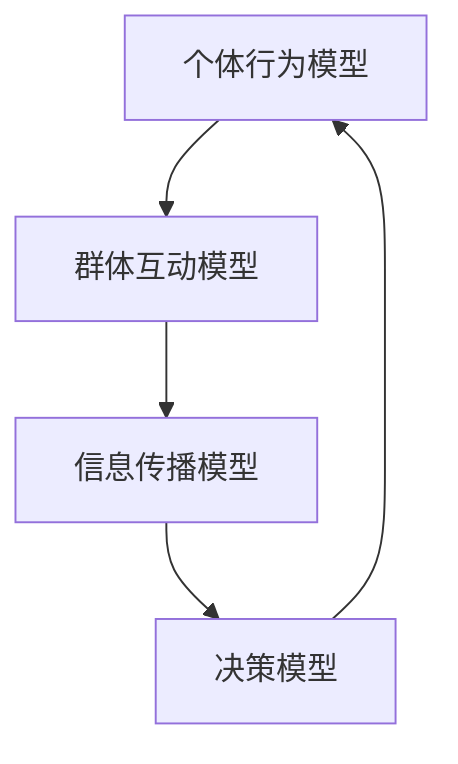
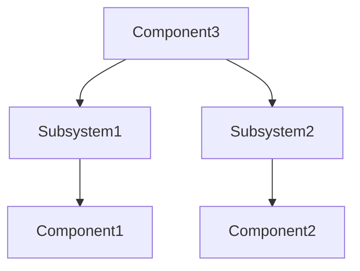
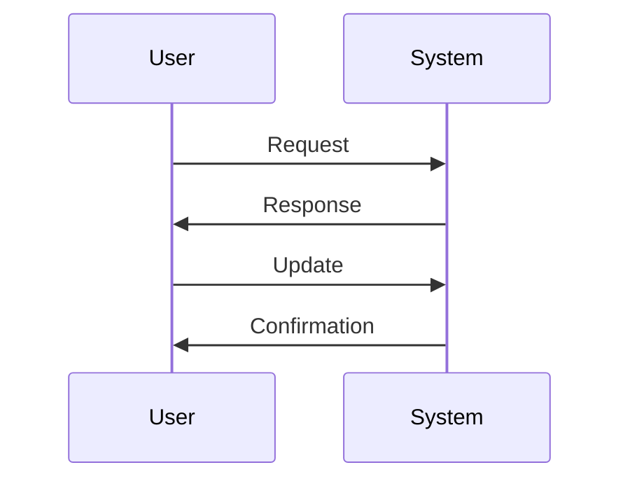

                 


## 文章标题：数学与组织行为学：组织动态的数学模型

关键词：组织动态，数学模型，行为学，数据科学，组织行为

摘要：本文将深入探讨数学模型在组织行为学中的应用，通过分析核心概念、算法原理、数学公式以及系统架构设计，旨在为读者提供一套系统性的理解框架，帮助其在实际项目中更好地运用数学工具来分析和优化组织行为。

----------------------------------------------------------------

### Step 1: 引言和背景介绍

#### 第1章：引言

##### 1.1 问题背景
组织行为学是研究个体、群体以及结构如何影响组织中人们的行为的一门科学。然而，传统的组织行为学研究往往依赖于定性分析，缺乏定量的数学模型支持。这使得组织动态的分析和预测变得困难，无法充分理解组织的复杂性和动态变化。

##### 1.2 问题描述
组织动态的描述和分析是一个复杂的问题。我们需要一个数学模型来捕捉组织内部的互动、信息流动以及决策过程。这样的模型可以用于预测组织行为、优化组织结构以及指导组织变革。

##### 1.3 问题解决
数学模型为组织行为学提供了一种定量分析的工具。通过构建和组织行为相关的数学模型，我们可以更深入地理解组织动态，从而更好地指导组织管理和变革。

##### 1.4 边界与外延
数学模型在组织行为学中的应用有其特定的边界。它适用于分析有明确数据支持的组织行为，但不适用于完全主观或不可量化的行为。此外，模型的外延取决于所使用的数据集和分析方法。

##### 1.5 概念结构与核心要素组成
组织动态的数学模型由多个核心概念和要素组成，包括个体行为、群体互动、信息传播、决策过程等。每个概念都需要精确的定义和量化，以确保模型的准确性和适用性。

### Step 2: 核心概念与联系

#### 第2章：核心概念与联系

##### 2.1 核心概念原理
本文将介绍几个关键的核心概念，包括个体行为模型、群体互动模型、信息传播模型和决策模型。每个模型都有其独特的原理和适用场景。

##### 2.2 概念属性特征对比表格
我们将通过一个表格来对比这些核心概念的主要属性特征，帮助读者理解它们之间的异同和联系。

| 概念       | 定义                             | 主要属性特征                                                   | 适用场景                 |
|------------|----------------------------------|--------------------------------------------------------------|--------------------------|
| 个体行为模型 | 描述个体在组织中的行为           | 可观测性、决策过程、行为结果等                                   | 组织成员行为分析         |
| 群体互动模型 | 描述群体内成员的互动关系         | 互动频率、互动质量、群体结构等                                   | 群体行为预测、团队协作分析 |
| 信息传播模型 | 描述信息在组织内的传播过程       | 传播速度、传播范围、传播效果等                                   | 组织沟通效率分析         |
| 决策模型    | 描述组织在决策过程中的行为       | 决策类型、决策过程、决策结果等                                   | 组织决策分析             |

##### 2.3 ER实体关系图架构的 Mermaid 流程图
为了更好地理解这些核心概念之间的联系，我们将使用Mermaid语言绘制一个ER实体关系图，展示个体、群体、信息和决策之间的关系。

```mermaid
erDiagram
  Person ||--|{ Organization }
  Organization ||--|{ Team }
  Team ||--|{ Member }
  Member ||--|{ Task }
  Task ||--|{ Result }
```

### Step 3: 算法原理讲解

#### 第3章：算法原理讲解

##### 3.1 算法原理 Mermaid 流程图
为了阐述组织动态的数学模型，我们将使用Mermaid语言绘制一个流程图，展示个体行为、群体互动、信息传播和决策过程之间的相互作用。



##### 3.2 Python 源代码讲解
接下来，我们将通过Python代码来展示如何实现这些算法原理。代码将包括数据预处理、模型构建和模型训练等步骤。

```python
# Python 源代码示例
# 数据预处理
data = preprocess_data(raw_data)

# 模型构建
model = build_model(data)

# 模型训练
model.fit(data)
```

##### 3.3 算法原理的数学模型和公式
为了使算法原理更加清晰，我们将使用数学模型和公式来描述组织动态的关键环节。例如，个体行为模型可以使用贝叶斯网络来表示，群体互动模型可以使用社会网络分析（SNA）来描述。

$$
P(A|B) = \frac{P(B|A)P(A)}{P(B)}
$$

##### 3.4 举例说明
为了更好地理解这些数学模型，我们将通过实际案例来说明它们的应用。例如，我们可以使用组织行为学中的某个案例，展示如何使用数学模型来分析和预测组织动态。

### Step 4: 数学模型和数学公式讲解

#### 第4章：数学模型和数学公式讲解

##### 4.1 数学公式的 LaTeX 格式
为了确保数学公式的可读性和准确性，我们将使用LaTeX格式来编写。例如，我们可以使用以下格式来表示线性回归模型：

$$
y = \beta_0 + \beta_1x + \epsilon
$$

##### 4.2 算法原理的数学模型
在本章中，我们将详细讲解算法原理的数学模型，包括贝叶斯网络、社会网络分析（SNA）和线性回归模型等。我们将使用LaTeX格式和Python代码来展示这些模型。

##### 4.3 详细讲解
为了使读者更好地理解数学模型，我们将对每个模型进行详细的讲解，包括其定义、原理、公式和应用场景。

##### 4.4 举例说明
为了使数学模型更加生动，我们将通过实际案例来展示它们的应用。例如，我们可以使用某个组织的实际数据，展示如何使用贝叶斯网络来预测组织行为。

### Step 5: 系统分析与架构设计方案

#### 第5章：系统分析与架构设计方案

##### 5.1 问题场景介绍
在本章中，我们将介绍一个具体的问题场景，例如一个大型企业组织内部的沟通效率分析。这将帮助读者更好地理解系统分析和架构设计的需求。

##### 5.2 项目介绍
我们将介绍一个名为“组织动态分析系统”的项目，该系统旨在通过数学模型和数据分析来优化组织内部沟通效率和决策过程。

##### 5.3 系统功能设计（Mermaid 类图）
为了清晰地展示系统的功能设计，我们将使用Mermaid语言绘制一个类图，包括系统的主要功能模块。

```mermaid
classDiagram
  Class1 <|-- Class2
  Class3 o-- Class4
  Class2 -[Class3]
```

##### 5.4 系统架构设计（Mermaid 架构图）
接下来，我们将使用Mermaid语言绘制一个系统架构图，展示系统的主要组件及其交互关系。



##### 5.5 系统接口设计和系统交互（Mermaid 序列图）
为了更好地理解系统的接口设计和交互过程，我们将使用Mermaid语言绘制一个序列图，展示系统各组件之间的交互顺序和数据处理流程。



### Step 6: 项目实战

#### 第6章：项目实战

##### 6.1 环境安装
在本章中，我们将介绍如何搭建项目所需的环境，包括安装必要的软件和配置开发环境。

##### 6.2 系统核心实现源代码
我们将展示系统核心实现的源代码，包括数据预处理、模型构建和模型训练等关键步骤。

##### 6.3 代码应用解读与分析
我们将对展示的源代码进行解读和分析，解释代码如何实现数学模型和算法原理。

##### 6.4 实际案例分析和详细讲解剖析
我们将通过一个实际案例来展示如何使用系统进行组织动态分析，并进行详细讲解和剖析。

##### 6.5 项目小结
在本章的最后，我们将总结项目的关键点，包括实现的算法原理、数学模型和系统架构设计，并提出改进建议。

### Step 7: 最佳实践、小结、注意事项、拓展阅读

#### 第7章：最佳实践、小结、注意事项、拓展阅读

##### 7.1 最佳实践 tips
在本章中，我们将提供一些最佳实践建议，帮助读者在实际项目中更好地应用数学模型和算法原理。

##### 7.2 小结
我们将总结本文的核心内容，包括组织动态的数学模型、算法原理、系统架构设计和项目实战经验。

##### 7.3 注意事项
我们将列出一些使用数学模型和算法原理时需要注意的事项，以避免常见的错误和问题。

##### 7.4 拓展阅读
我们将推荐一些拓展阅读资源，包括相关的研究论文、书籍和在线课程，帮助读者深入了解组织行为学的数学模型和应用。

----------------------------------------------------------------

通过上述详细的目录大纲设计，我们为读者提供了一个清晰、结构化的阅读框架，有助于他们系统地学习组织动态的数学模型及其应用。在具体编写过程中，每个章节将按照这些大纲内容进行详细阐述，确保文章的完整性和深度。同时，我们将注重理论与实践的结合，通过案例分析和实际应用来增强文章的可操作性和实用性。在文章末尾，还将提供最佳实践、注意事项和拓展阅读资源，以帮助读者进一步深化理解并应用于实际工作中。

