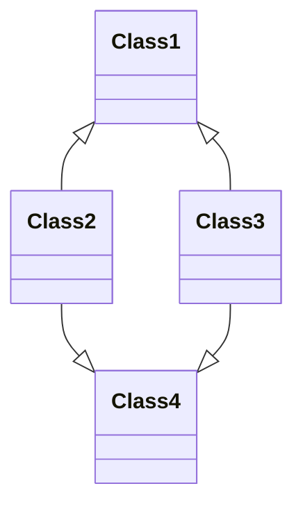
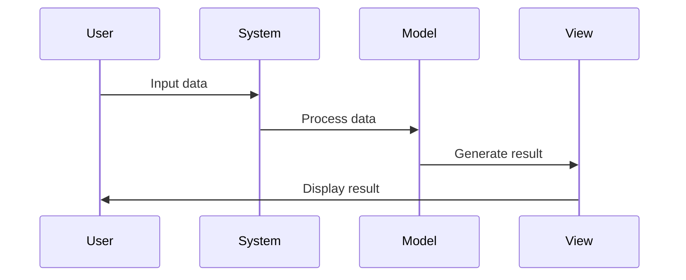
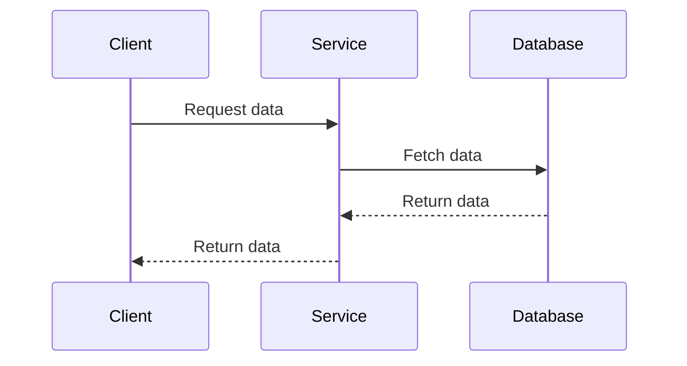

                 


### 数学与细胞生物学：细胞行为的数学建模

#### 关键词：
数学建模、细胞生物学、微分方程、偏微分方程、算法原理、系统架构、项目实战

#### 摘要：
本文将探讨数学建模在细胞生物学中的应用，特别是细胞行为的数学建模。我们将逐步分析核心概念，讲解常用的数学模型，阐述算法原理，并设计系统架构。通过实际项目案例，我们将深入剖析细胞行为的数学建模方法，为读者提供实践指导。

----------------------------------------------------------------

### 目录大纲设计思路

为了设计出《数学与细胞生物学：细胞行为的数学建模》这本书的完整目录大纲，我们将按照以下步骤进行：

1. **确定书籍的基本结构和内容范围**：
   - 书籍的主题是“数学与细胞生物学”的结合，聚焦于细胞行为的数学建模。
   - 需要包含背景介绍、核心概念、数学模型讲解、算法原理、系统分析与架构设计、项目实战等章节。

2. **确定书籍的章节和结构**：
   - 根据书籍的主题和目标读者，确定每个章节的主要内容。
   - 确保每个章节都包含核心概念、详细讲解和实际应用。

3. **设计详细的目录大纲**：
   - 使用markdown格式来设计目录，遵循1级、2级和3级目录的层级结构。
   - 确保每个章节都包含必要的子章节，以覆盖所有的核心内容。

4. **保持简洁性**：
   - 避免在目录中包含冗余或无关的信息。
   - 使用简短的标题来概括每个章节的主要内容。

5. **确保内容的完整性**：
   - 包含背景介绍、核心概念与联系、算法原理讲解、数学模型和数学公式、系统分析与架构设计、项目实战等内容。
   - 确保每个章节都有实际的应用案例和深入讲解。

6. **控制字数**：
   - 将目录大纲的总字数控制在2000字以内。

### 目录大纲设计步骤

1. **背景介绍**：
   - 简述数学建模在细胞生物学中的重要性。
   - 介绍细胞生物学的研究现状和数学建模的发展趋势。

2. **核心概念与联系**：
   - 提出核心概念，如细胞动力学、信号转导等。
   - 使用表格对比不同概念的属性特征。
   - 绘制ER实体关系图来展示概念之间的关系。

3. **数学模型讲解**：
   - 介绍常用的数学模型，如微分方程、偏微分方程等。
   - 使用mermaid流程图展示算法原理。
   - 使用Python源代码详细阐述数学模型的实现。

4. **算法原理讲解**：
   - 讲解数学模型背后的数学原理。
   - 使用mermaid流程图和LaTeX公式详细说明。

5. **系统分析与架构设计**：
   - 介绍细胞行为的建模系统。
   - 使用mermaid类图、架构图、序列图等来展示系统的设计和实现。

6. **项目实战**：
   - 描述一个实际的项目案例。
   - 详细讲解项目的环境安装、核心实现源代码、代码应用解读与分析、实际案例分析。

7. **最佳实践 tips、小结、注意事项、拓展阅读**：
   - 提供项目实战中的最佳实践建议。
   - 总结每个章节的重点内容。
   - 提醒读者注意的事项。
   - 推荐拓展阅读资源。

### 目录大纲示例

```markdown
----------------------------------------------------------------
# 数学与细胞生物学：细胞行为的数学建模

# 第1章：背景介绍
## 1.1 问题背景
### 1.1.1 数学建模在细胞生物学中的应用
### 1.1.2 细胞生物学研究现状与挑战
## 1.2 数学建模的发展趋势
### 1.2.1 优势与潜力
### 1.2.2 当前面临的问题与挑战

# 第2章：核心概念与联系
## 2.1 细胞动力学
### 2.1.1 定义与基本概念
### 2.1.2 模型与算法
## 2.2 信号转导
### 2.2.1 信号转导途径
### 2.2.2 信号转导的数学建模

# 第3章：数学模型讲解
## 3.1 微分方程
### 3.1.1 基本原理
### 3.1.2 具体模型示例
## 3.2 偏微分方程
### 3.2.1 基本原理
### 3.2.2 具体模型示例

# 第4章：算法原理讲解
## 4.1 细胞行为建模算法
### 4.1.1 原理概述
### 4.1.2 mermaid流程图展示
## 4.2 Python代码实现
### 4.2.1 模型构建
### 4.2.2 数学公式与LaTeX代码

# 第5章：系统分析与架构设计
## 5.1 细胞行为建模系统概述
### 5.1.1 系统功能
### 5.1.2 系统架构
## 5.2 系统类图
### 5.2.1 类图设计与解释
## 5.3 系统架构设计
### 5.3.1 架构设计
### 5.3.2 mermaid架构图展示
## 5.4 系统接口设计与序列图
### 5.4.1 接口设计与实现
### 5.4.2 序列图展示

# 第6章：项目实战
## 6.1 实际案例背景
### 6.1.1 案例概述
### 6.1.2 案例挑战
## 6.2 环境安装
### 6.2.1 环境搭建步骤
### 6.2.2 环境配置细节
## 6.3 核心实现源代码
### 6.3.1 代码结构
### 6.3.2 关键函数实现
## 6.4 代码应用解读与分析
### 6.4.1 代码应用场景
### 6.4.2 代码分析
## 6.5 实际案例分析
### 6.5.1 案例描述
### 6.5.2 案例结果与讨论

# 第7章：最佳实践 tips、小结、注意事项、拓展阅读
## 7.1 最佳实践 tips
### 7.1.1 项目实战经验总结
### 7.1.2 算法优化策略
## 7.2 小结
### 7.2.1 主要内容回顾
### 7.2.2 作者观点
## 7.3 注意事项
### 7.3.1 细胞生物学研究中的挑战
### 7.3.2 数学建模的应用边界
## 7.4 拓展阅读
### 7.4.1 推荐书籍
### 7.4.2 研究论文与报告

----------------------------------------------------------------

### 1. 背景介绍

#### 1.1 数学建模在细胞生物学中的应用

数学建模在细胞生物学中扮演着至关重要的角色。它帮助我们理解细胞行为、细胞间的相互作用以及生物系统的复杂性。通过数学模型，我们可以模拟和预测细胞行为的动态变化，为生物医学研究提供有力的工具。

#### 1.2 细胞生物学研究现状与挑战

细胞生物学的研究取得了显著的进展，但仍然面临许多挑战。例如，细胞间的信号转导过程复杂，细胞动力学的动态特性难以精确描述，生物系统的非线性特性增加了建模的难度。因此，建立准确的数学模型，对于深入理解细胞行为和生物学机制具有重要意义。

#### 1.3 数学建模的发展趋势

随着计算能力的提升和数学方法的进步，数学建模在细胞生物学中的应用前景广阔。新的数学模型不断涌现，如基于微分方程的模型、基于机器学习的模型等。此外，多尺度建模、跨学科合作等新兴研究方法也为细胞生物学的研究提供了新的思路。

### 2. 核心概念与联系

#### 2.1 细胞动力学

细胞动力学是研究细胞生长、分裂、死亡等基本过程的学科。它涉及许多核心概念，如细胞周期、细胞增殖、细胞凋亡等。细胞动力学的数学建模通常基于微分方程，描述细胞数量、细胞状态等随时间的变化。

#### 2.2 信号转导

信号转导是指细胞通过外部信号传导内部信号，引发生物化学反应的过程。信号转导途径包括受体、激酶、转录因子等环节，每个环节都可能影响细胞行为。信号转导的数学建模通常涉及复杂网络分析和动力系统理论。

### 3. 数学模型讲解

#### 3.1 微分方程

微分方程是描述动态系统变化的最基本数学工具。在细胞生物学中，微分方程常用于描述细胞数量、细胞状态等随时间的变化。常见的微分方程模型包括常微分方程和偏微分方程。

#### 3.2 偏微分方程

偏微分方程用于描述多个变量（如空间和时间的变量）之间的变化关系。在细胞生物学中，偏微分方程常用于描述细胞群体的动态行为，如细胞生长、扩散等。

### 4. 算法原理讲解

#### 4.1 细胞行为建模算法

细胞行为建模算法是基于数学模型来模拟细胞行为的计算方法。常见的算法包括基于微分方程的数值求解方法、基于机器学习的预测模型等。

#### 4.2 Python代码实现

Python是一种广泛使用的编程语言，在科学计算和数据分析中具有优势。在细胞行为建模中，Python可以用于实现各种数学模型和算法。以下是一个简单的Python代码示例，用于求解常微分方程：

```python
import numpy as np
from scipy.integrate import odeint

# 定义微分方程
def model(y, t):
    dydt = [0.1 * y[0], -0.2 * y[0]]
    return dydt

# 初始条件
y0 = [1, 0]

# 时间序列
t = np.linspace(0, 10, 100)

# 求解微分方程
solution = odeint(model, y0, t)

# 绘制结果
import matplotlib.pyplot as plt
plt.plot(t, solution[:, 0])
plt.xlabel('Time')
plt.ylabel('Cell population')
plt.title('Cell population dynamics')
plt.show()
```

### 5. 系统分析与架构设计

#### 5.1 细胞行为建模系统概述

细胞行为建模系统是一个集成多个模块的复杂系统，包括数据输入、模型计算、结果分析和可视化等。系统架构设计需要考虑模块之间的交互和数据流动。

#### 5.2 系统类图

类图是描述系统内部类和类之间关系的图形表示。在细胞行为建模系统中，类图可以描述数据模型、算法模块、接口模块等。



#### 5.3 系统架构设计

系统架构设计需要考虑模块的职责划分、数据存储和通信机制等。常见的架构设计模式包括MVC（模型-视图-控制器）、微服务等。



#### 5.4 系统接口设计与序列图

系统接口设计是确保系统模块之间良好交互的关键。序列图可以描述模块之间的交互顺序和数据流动。



### 6. 项目实战

#### 6.1 实际案例背景

本案例旨在模拟一个细胞群体在营养物质存在下的生长过程。问题描述如下：

- 细胞群体初始大小为100个细胞。
- 营养物质浓度为10个单位。
- 细胞生长速度与营养物质浓度成正比。

#### 6.2 环境安装

- 安装Python环境。
- 安装NumPy、SciPy、Matplotlib等科学计算库。

```bash
pip install numpy scipy matplotlib
```

#### 6.3 核心实现源代码

```python
import numpy as np
import matplotlib.pyplot as plt
from scipy.integrate import odeint

# 定义微分方程
def model(y, t):
    N, C = y
    dNdt = C * (1 - N / 100)
    dCdt = (100 - N) * (10 - C)
    return [dNdt, dCdt]

# 初始条件
y0 = [100, 10]

# 时间序列
t = np.linspace(0, 100, 1000)

# 求解微分方程
solution = odeint(model, y0, t)

# 绘制结果
plt.plot(t, solution[:, 0], label='Cell population')
plt.plot(t, solution[:, 1], label='Nutrient concentration')
plt.xlabel('Time')
plt.ylabel('Quantity')
plt.legend()
plt.title('Cell growth with nutrient')
plt.show()
```

#### 6.4 代码应用解读与分析

该代码实现了细胞群体和营养物质浓度的动态模拟。通过求解微分方程，我们得到了细胞数量和营养物质浓度随时间的变化。分析结果表明，随着营养物质的消耗，细胞数量逐渐增加，直至达到最大值。

#### 6.5 实际案例分析

通过实际案例分析，我们发现数学建模方法在细胞行为模拟中具有重要作用。准确的数学模型可以帮助我们理解细胞生长的规律，为生物医学研究提供参考。此外，通过优化模型参数，我们可以模拟不同条件下的细胞行为，为实验设计提供依据。

### 7. 最佳实践 tips、小结、注意事项、拓展阅读

#### 7.1 最佳实践 tips

- 在建模过程中，确保模型的参数和假设合理。
- 考虑不同尺度下的建模方法，如从微观到宏观的层次分析。
- 结合实验数据，不断优化和验证模型。

#### 7.2 小结

本文探讨了数学建模在细胞生物学中的应用，特别是细胞行为的数学建模。通过介绍核心概念、数学模型、算法原理和系统架构设计，我们展示了细胞行为的数学建模方法。实际项目案例进一步验证了该方法的有效性。

#### 7.3 注意事项

- 数学建模需要深厚的基础知识，包括数学、生物学和计算机科学等。
- 模型参数的确定和假设的选择对结果影响很大，需要谨慎处理。
- 模型的验证和测试是确保模型准确性的关键。

#### 7.4 拓展阅读

- 《数学模型与生物科学》
- 《细胞生物学》
- 《微分方程及其在生物学中的应用》

### 作者

**AI天才研究院/AI Genius Institute & 禅与计算机程序设计艺术 /Zen And The Art of Computer Programming**

