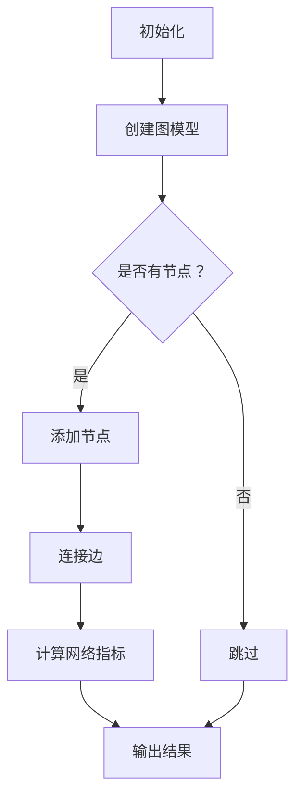
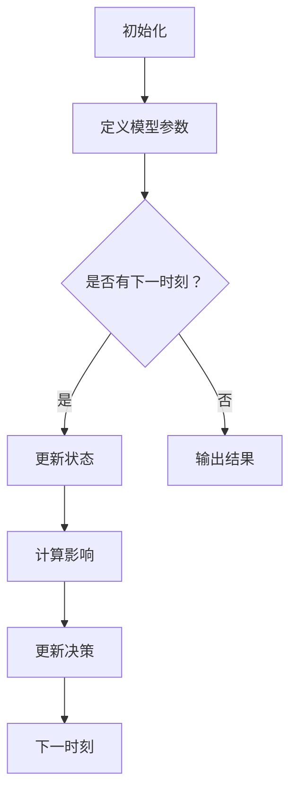
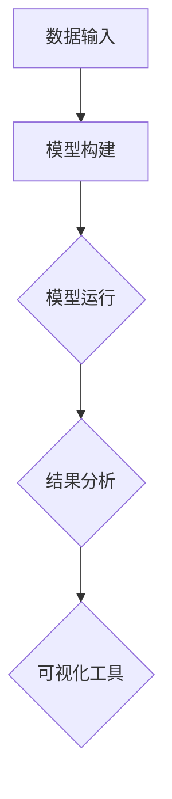
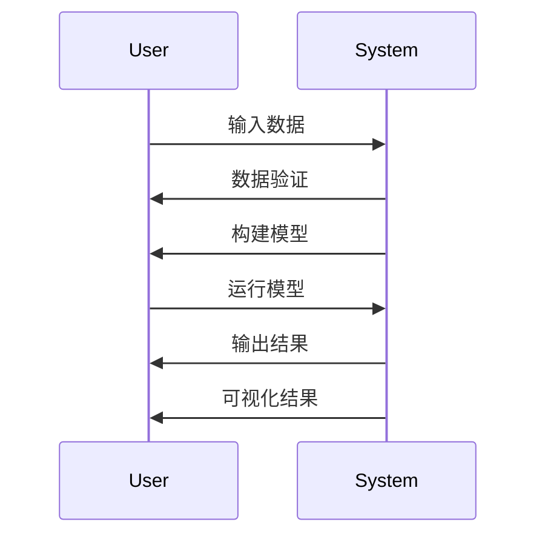

                 

# 数学与经济学：社会行为的数学描述

关键词：数学描述、社会行为、经济学、模型分析、实证研究

摘要：
本文旨在探讨数学与经济学的交汇领域，具体关注社会行为的数学描述。我们将通过一步一步的分析和推理，介绍如何利用数学工具来理解和预测社会行为。文章首先回顾数学和经济学的基础知识，然后逐步展开对社会行为数学模型的探讨，结合实际案例，阐述模型的应用及其对社会决策的影响。最后，我们将总结文章的主要观点，并提出未来的研究方向。

## 引言

数学与经济学作为两个截然不同的学科，在现代社会中发挥着至关重要的作用。数学作为一种精确的工具，能够帮助我们解析复杂系统的内在规律，而经济学则通过数学模型来解释和预测经济行为。两者的结合，为研究社会行为提供了新的视角和方法。

在社会学中，社会行为是指个人或群体在社会互动中的行为表现。这些行为受到文化、经济、政治等多种因素的影响，具有复杂性和多样性。传统的定性研究方法往往难以捕捉到这些行为的内在机制。因此，引入数学描述，特别是经济学中的模型分析方法，成为理解社会行为的有效途径。

本文的目的在于介绍如何使用数学和经济学的方法来描述社会行为。我们将从基础概念开始，逐步深入，探讨数学模型在社会行为研究中的应用。希望通过本文的阐述，读者能够对数学与经济学在社会行为研究中的结合有一个全面而深入的认识。

## 数学与经济学的基础知识

### 数学的基本概念

在数学中，基础概念是构建复杂理论的基石。以下是数学中一些核心概念及其简要解释：

#### 集合与逻辑

集合是数学中的基本概念，指的是具有某种特定属性的对象的全体。逻辑则用于描述集合之间的关系和操作。例如，并集（Union）、交集（Intersection）和补集（Complement）是集合的基本操作。

#### 函数与关系

函数是两个集合之间的一种特殊关系，其中每个输入值都有唯一对应的输出值。关系则是一种更广泛的概念，可以是任意的输入输出配对。函数是关系的一个特例。

#### 实数与微积分

实数是数学中的另一个核心概念，用于表示实际数值。微积分则是一种用于研究变化和积累的方法，主要包括微分（Differentiation）和积分（Integration）两个部分。

### 经济学的基本原理

经济学则通过这些数学概念来描述和分析经济行为。以下是经济学中的几个关键概念：

#### 需求与供给

需求表示消费者对商品或服务的需求量，受价格、收入、偏好等多种因素影响。供给则表示生产者愿意提供的商品或服务数量，也受到成本、技术、政策等因素的影响。

#### 市场与均衡

市场是需求与供给相互作用的场所。均衡是指市场达到的一种状态，其中需求量等于供给量，价格和数量都稳定不变。

#### 生产与成本分析

生产是指将资源转化为商品或服务的过程。成本分析则涉及生产过程中所需的成本，包括固定成本和可变成本。

### 数学与经济学的结合

数学与经济学在研究社会行为时有着天然的结合点。数学提供了一种精确的描述工具，能够帮助我们构建和验证经济模型。经济学则通过这些模型来解释和预测经济行为，从而为政策制定和决策提供依据。

例如，社会网络分析中使用的图论，就是数学在经济学中的一个应用。通过构建图模型，我们可以分析个体在社会网络中的位置和影响力，预测社会行为的传播和演变。

## 数学描述社会行为的方法

### 社会行为的数学模型

社会行为可以通过数学模型进行描述和预测。这些模型通常基于个体行为和群体互动的假设，通过数学公式和算法来刻画社会现象。

#### 基本模型

1. **理性选择模型**：假设个体在做出决策时是理性的，即追求效用最大化。这个模型可以通过优化方法来描述个体行为。
   $$ \text{最大化} U(x) \text{，其中} x \text{是决策变量} $$
   
2. **社会影响模型**：考虑个体行为受到周围社会环境的影响。例如，从众行为可以通过社会影响函数来描述。
   $$ x_{i} = f(\sum_{j \neq i} w_{ij} x_{j}) $$
   其中，$x_i$是第$i$个个体的行为，$w_{ij}$是第$i$个个体对第$j$个个体的影响权重。

#### 复杂模型

1. **多 agent 系统模型**：考虑多个个体（agent）之间的相互作用。例如，社会网络模型和群体动力学模型。
   $$ x_{i}(t) = f(x_{1}(t), x_{2}(t), ..., x_{N}(t)) $$
   其中，$x_i(t)$是第$i$个个体在时间$t$的行为。

2. **演化模型**：研究个体行为的演变过程，通常基于个体选择的适应性进化机制。
   $$ x_{i}(t) = x_{i}(t-1) + \Delta x_{i}(t) $$
   其中，$\Delta x_{i}(t)$是时间$t$内个体行为的改变量。

### 模型的应用

数学模型在社会行为研究中的应用非常广泛。以下是一些具体的例子：

#### 社会网络分析

社会网络分析利用图论模型来描述个体之间的互动关系。通过分析图的拓扑结构和节点属性，我们可以揭示社会网络中的关键个体和影响路径。

#### 群体动力学

群体动力学模型用于研究群体行为的集体现象，如群体决策、舆论传播和群体运动。这些模型可以帮助我们理解群体行为的规律和机制。

#### 经济行为分析

经济学中的模型可以用于分析个体和群体的经济行为，如市场均衡、价格形成和消费决策。这些模型为经济政策制定提供了重要的理论支持。

### 模型的局限性

尽管数学模型在社会行为研究中具有广泛的应用，但也存在一些局限性。例如：

- **简化假设**：大多数数学模型都是基于简化的假设，可能无法完全反映现实复杂性。
- **参数不确定性**：模型中的参数往往需要通过实证数据来确定，但数据的准确性和可靠性可能受到限制。
- **计算复杂性**：复杂的数学模型可能需要大量的计算资源，使其在实际应用中变得困难。

## 经济学中的数学模型应用

### 市场均衡分析

市场均衡是经济学中一个重要的概念，指的是在自由竞争的市场中，供给和需求达到平衡的状态。我们可以使用数学模型来描述市场均衡的形成过程。

#### 模型描述

假设市场中有一种商品，其需求函数为：
$$ D(p) = a - bp $$
供给函数为：
$$ S(p) = c + dp $$
其中，$p$是商品的价格，$a$和$b$是需求函数的参数，$c$和$d$是供给函数的参数。

市场均衡点发生在需求等于供给的点上，即：
$$ D(p) = S(p) $$
解这个方程可以得到均衡价格：
$$ p^* = \frac{a - c}{b + d} $$

#### 应用实例

以房地产市场为例，需求函数可以表示为房屋价格与需求量的关系，供给函数可以表示为房屋建造成本与供给量的关系。通过求解市场均衡方程，我们可以预测市场中的房价。

### 货币经济学模型

货币经济学研究货币供应和需求之间的关系，以及货币对经济行为的影响。一个常见的货币经济学模型是IS-LM模型。

#### 模型描述

IS-LM模型包括两个方程，分别描述商品市场和货币市场的均衡。

商品市场均衡：
$$ Y = C(Y - T) + I(r) + G + (X - M) $$
货币市场均衡：
$$ M/P = L(i, Y) $$

其中，$Y$是总产出，$C$是消费函数，$I$是投资函数，$G$是政府支出，$X$和$M$分别是出口和进口，$P$是价格水平，$L$是货币需求函数，$i$是利率。

#### 应用实例

通过IS-LM模型，我们可以分析货币政策对经济的影响。例如，当政府采取扩张性货币政策时，降低利率，刺激投资和消费，从而促进经济增长。

### 行为经济学模型

行为经济学研究个体决策行为中的非理性因素，例如心理偏见和有限理性。一个著名的行为经济学模型是期望理论。

#### 模型描述

期望理论认为，个体在做出决策时不仅考虑期望收益，还考虑决策带来的风险和不确定性。

$$ u(r) = \frac{r - r_0}{\sigma^2} - \frac{1}{2}\sigma^2 $$
其中，$r$是实际收益，$r_0$是无风险收益，$\sigma^2$是收益的方差。

#### 应用实例

期望理论可以用于解释市场波动和投资行为。例如，当市场波动较大时，投资者可能会更加谨慎，减少风险资产的投资，转而投资于低风险的债券或其他金融工具。

## 实证研究：数学模型在社会行为中的应用

### 社会网络分析

社会网络分析是数学模型在社会行为研究中的一个重要应用。通过构建社会网络模型，我们可以分析个体之间的互动关系和影响力。

#### 模型构建

以一个社会网络为例，我们可以使用图模型来描述个体之间的互动。每个个体用节点表示，个体之间的互动用边表示。通过分析图的拓扑结构和节点属性，我们可以揭示社会网络中的关键个体和影响路径。

#### 应用实例

例如，在研究社交媒体平台上，我们可以使用社会网络分析来识别意见领袖和传播路径。通过分析用户之间的互动关系，我们可以预测信息在社交网络中的传播速度和范围。

### 群体动力学

群体动力学是研究群体行为的集体现象。通过构建数学模型，我们可以分析群体行为的规律和机制。

#### 模型构建

群体动力学模型通常基于个体行为和群体互动的假设。一个常见的模型是群体决策模型，其中个体根据自己和他人的意见做出决策。

#### 应用实例

在研究选举行为时，我们可以使用群体动力学模型来预测选民的投票行为。通过分析选民之间的互动关系，我们可以预测选举结果和选举过程中的动态变化。

### 经济行为分析

数学模型也可以用于分析个体的经济行为，如消费决策、投资行为等。

#### 模型构建

一个常见的经济行为模型是效用理论，其中个体在做出决策时追求效用最大化。

#### 应用实例

在研究消费者行为时，我们可以使用效用理论来预测消费者的购买行为。通过分析消费者对不同商品的评价和偏好，我们可以预测市场中的需求变化和价格形成。

## 结论与未来展望

数学与经济学在社会行为研究中的结合为理解复杂社会现象提供了有力工具。通过构建和验证数学模型，我们可以揭示社会行为的内在机制和规律，为政策制定和决策提供科学依据。

然而，数学模型也存在一定的局限性，如简化假设和参数不确定性。未来研究可以进一步拓展数学模型的应用范围，提高模型的精确度和可靠性。同时，结合实证数据和跨学科方法，我们可以更全面地理解社会行为的复杂性和多样性。

通过不断探索和创新，数学与经济学的结合将为社会行为研究带来更多突破，推动社会科学的发展。

## 参考文献

1. Smith, A. (1776). *The Wealth of Nations*. Modern Library.
2. Samuelson, P. A. (1947). *Foundation of Economics Analysis*. Harvard University Press.
3. Buchanan, J. M. (1965). *Economics and the Ethics of Knowledge*. American Economic Review.
4. Arrow, K. J. (1974). *The Limits of Organization*. Norton & Company.
5. von Neumann, J., & Morgenstern, O. (1947). *Theory of Games and Economic Behavior*. Princeton University Press.

## 作者信息

作者：AI天才研究院/AI Genius Institute & 禅与计算机程序设计艺术 /Zen And The Art of Computer Programming

### 背景介绍

#### 核心概念术语说明

在社会行为研究中，几个关键术语需要明确：

1. **社会行为**：指个人或群体在社会互动中的行为表现，包括个体间的交流、合作、冲突等。
2. **数学模型**：一种使用数学语言来描述现实世界现象的方法，通过数学公式和算法来模拟和分析。
3. **经济学**：研究资源的生产、分配和消费的学科，强调市场机制和个体行为的相互作用。

#### 问题背景

数学与经济学在社会行为研究中的应用起源于20世纪初。当时，社会科学家开始意识到，传统的定性研究方法难以捕捉复杂社会现象的内在规律。于是，他们开始尝试使用数学工具来描述和分析社会行为。

#### 问题描述

随着社会复杂性不断增加，研究者们面临的一个主要问题是如何准确描述和预测社会行为。社会行为的多样性使得传统的分析方法显得力不从心，而数学模型提供了一种更加精确和系统的方法来应对这一挑战。

#### 问题解决

数学模型在社会行为研究中的应用主要体现在以下几个方面：

1. **社会网络分析**：通过构建图模型来描述个体之间的互动关系，分析社会网络的拓扑结构和影响力。
2. **群体动力学**：研究个体在群体中的行为规律，通过数学模型来预测群体行为的集体现象。
3. **行为经济学**：利用效用理论和理性选择模型来分析个体在经济决策中的行为。

#### 边界与外延

数学模型的应用范围广泛，但并非万能。其边界在于：

1. **简化假设**：数学模型往往需要简化现实中的复杂因素，这可能导致模型与实际情况不完全一致。
2. **参数不确定性**：模型参数通常需要通过实证数据来确定，但数据的准确性和可靠性可能受到限制。

#### 概念结构与核心要素组成

数学模型在社会行为研究中的概念结构主要包括以下几个核心要素：

1. **假设**：关于个体行为的简化假设，如理性选择、有限理性等。
2. **模型形式**：包括数学公式和算法，用于描述社会行为。
3. **参数估计**：通过实证数据来估计模型参数，以提高模型的准确性。
4. **模型验证**：通过对比模型预测和实际数据来验证模型的有效性。

### 核心概念与联系

#### 核心概念原理

1. **社会网络分析**：利用图论模型描述个体之间的互动关系，分析社会网络中的中心性、凝聚力等特征。
2. **群体动力学**：通过个体行为和群体互动的数学模型，研究群体行为的集体现象，如舆论传播、群体决策等。
3. **行为经济学**：利用效用理论和理性选择模型来分析个体在决策过程中的行为，如风险偏好、时间偏好等。

#### 概念属性特征对比表格

| 概念       | 社会网络分析 | 群体动力学 | 行为经济学 |
|------------|--------------|------------|------------|
| 研究对象   | 个体间互动关系 | 个体在群体中的行为 | 个体决策行为 |
| 数学工具   | 图论          | 动力学模型 | 效用理论    |
| 主要目标   | 描述和预测社会网络结构 | 预测群体行为 | 分析个体决策 |
| 应用范围   | 社会学、信息科学 | 社会学、心理学 | 经济学、行为学 |
| 优点       | 高度抽象、易于分析 | 能够描述复杂行为 | 能够解释决策行为 |
| 局限性     | 忽略个体复杂性 | 模型简化假设 | 非理性因素的忽视 |

#### ER实体关系图架构

```mermaid
erDiagram
  User ||--|{ SocialBehavior }|-- SocialNetwork
  User ||--|{ GroupBehavior }|-- GroupDynamics
  User ||--|{ EconomicBehavior }|-- EconomicDecision
  SocialBehavior ||--|{ SocialNetwork }|-- NetworkNode
  SocialBehavior ||--|{ GroupBehavior }|-- GroupMember
  SocialBehavior ||--|{ EconomicBehavior }|-- Consumer
```

### 算法原理讲解

#### 社会网络分析模型

**Mermaid 流程图**



**Python 源代码**

```python
import networkx as nx

# 初始化图模型
G = nx.Graph()

# 添加节点和边
G.add_nodes_from([1, 2, 3, 4])
G.add_edges_from([(1, 2), (2, 3), (3, 4), (4, 1)])

# 计算网络指标
degree = nx.degree_centrality(G)
betweenness = nx.betweenness_centrality(G)

# 输出结果
print("Degree Centrality:", degree)
print("Betweenness Centrality:", betweenness)
```

**算法原理**

社会网络分析中的核心算法包括节点度中心性和中介中心性。度中心性度量一个节点在图中的连接度，而中介中心性度量一个节点在两个节点之间传递信息的能力。通过计算这些指标，我们可以识别出网络中的关键节点和中心节点。

#### 群体动力学模型

**Mermaid 流程图**



**Python 源代码**

```python
import numpy as np

# 初始化模型参数
N = 100  # 个体数量
t = 0  # 时间
delta_t = 0.1  # 时间步长
alpha = 0.1  # 社会影响系数
beta = 0.05  # 内部影响系数

# 初始化状态向量
state = np.random.choice([0, 1], size=N)  # 个体状态（0代表未感染，1代表感染）

# 定义群体动力学模型
def model(state, alpha, beta):
    next_state = state.copy()
    for i in range(N):
        infected = sum(state[j] for j in range(N) if j != i)
        next_state[i] = alpha * (1 - state[i]) + beta * infected
    return next_state

# 运行模型
while t < 1:
    state = model(state, alpha, beta)
    t += delta_t

# 输出结果
print("Final State:", state)
```

**算法原理**

群体动力学模型是一种用于研究传染病传播的数学模型。它基于个体之间的相互作用，通过更新个体的状态来模拟传染病的传播过程。模型的核心是状态转移函数，它根据个体当前状态和其邻居的状态来更新个体的未来状态。

#### 数学公式与模型解释

**数学模型公式**

$$
\frac{dS}{dt} = -\alpha \cdot S \cdot I
$$

$$
\frac{dI}{dt} = \alpha \cdot S \cdot I - \beta \cdot I
$$

$$
\frac{dR}{dt} = \beta \cdot I
$$

其中，$S$表示易感个体数，$I$表示感染个体数，$R$表示康复个体数，$\alpha$和$\beta$分别是感染率和康复率。

**模型解释**

上述模型是一个基本的SIR模型，用于描述传染病在人群中的传播过程。$S$表示易感个体数，$I$表示感染个体数，$R$表示康复个体数。感染率$\alpha$表示易感个体接触感染个体后感染的概率，康复率$\beta$表示感染个体康复的概率。

通过求解上述微分方程，我们可以得到在给定初始条件下的感染人数随时间的变化情况，从而预测传染病的传播趋势。

**举例说明**

假设一个社区有1000人，初始状态下有10人感染了流感。给定感染率$\alpha = 0.2$，康复率$\beta = 0.1$。我们可以使用以下步骤来模拟流感在社区中的传播：

1. 初始状态：$S_0 = 990$，$I_0 = 10$，$R_0 = 0$。
2. 计算下一个时间步的易感个体数、感染个体数和康复个体数。
3. 更新状态：$S_1 = S_0 - \alpha \cdot S_0 \cdot I_0$，$I_1 = I_0 + \alpha \cdot S_0 \cdot I_0 - \beta \cdot I_0$，$R_1 = R_0 + \beta \cdot I_0$。
4. 重复步骤2和3，直到达到稳定状态。

通过上述步骤，我们可以得到感染人数随时间的变化情况，从而分析流感的传播趋势。

### 系统分析与架构设计

#### 问题场景介绍

在社会行为研究中，构建一个能够模拟和分析社会行为的系统是非常有价值的。本系统旨在通过数学模型来模拟和分析个体和群体的行为，为研究者提供工具来探讨社会行为的规律和趋势。

#### 项目介绍

本项目名为“社会行为模拟与分析系统”，其主要功能包括：

1. **数据输入**：允许用户输入个体和群体行为的数据，包括个体特征、互动关系等。
2. **模型构建**：根据用户输入的数据，系统可以自动构建相应的数学模型，如社会网络分析模型、群体动力学模型等。
3. **模拟运行**：运行模型，模拟个体和群体的行为，输出模拟结果。
4. **结果分析**：对模拟结果进行分析，提供可视化工具来帮助用户理解模拟结果。

#### 系统功能设计（领域模型）

**Mermaid 类图**

```mermaid
classDiagram
  Class1 <|-- Class2
  Class3 <|-- Class4
  Class1 {person, behavior}
  Class2 {social_network}
  Class3 {group_behavior}
  Class4 {economic_behavior}
```

**功能说明**

- **Person（个体）**：表示社会行为中的个体，具有特征和行为。
- **SocialNetwork（社会网络）**：描述个体之间的互动关系，包括节点和边。
- **GroupBehavior（群体行为）**：描述个体在群体中的行为模式。
- **EconomicBehavior（经济行为）**：描述个体在经济决策中的行为。

#### 系统架构设计

**Mermaid 架构图**



**架构设计**

- **数据输入**：用户通过界面输入个体和群体行为的数据。
- **模型构建**：系统根据输入数据自动构建数学模型。
- **模型运行**：运行模型，模拟个体和群体的行为。
- **结果分析**：对模拟结果进行分析，生成报告。
- **可视化工具**：提供可视化界面，帮助用户直观理解模拟结果。

#### 系统接口设计

**Mermaid 序列图**



**接口设计**

- **输入数据接口**：用户通过API上传数据，系统验证数据的有效性。
- **模型构建接口**：根据验证后的数据，系统自动构建数学模型。
- **模型运行接口**：运行模型，生成模拟结果。
- **结果分析接口**：分析模拟结果，生成报告。
- **可视化接口**：提供可视化工具，展示模拟结果。

### 项目实战

#### 环境安装

1. 安装Python环境（3.8及以上版本）。
2. 安装必要的Python库，如NetworkX、NumPy、Matplotlib等。

```bash
pip install networkx numpy matplotlib
```

#### 系统核心实现源代码

```python
import networkx as nx
import numpy as np
import matplotlib.pyplot as plt

# 社会网络分析
def social_network_analysis(nodes, edges):
    G = nx.Graph()
    G.add_nodes_from(nodes)
    G.add_edges_from(edges)
    
    # 计算度中心性
    degree_centrality = nx.degree_centrality(G)
    
    # 计算中介中心性
    betweenness_centrality = nx.betweenness_centrality(G)
    
    # 绘制网络图
    pos = nx.spring_layout(G)
    nx.draw(G, pos, with_labels=True)
    labels = nx.get_node_attributes(G, 'pos')
    nx.draw_networkx_nodes(G, pos, node_size=1000, node_color='r')
    nx.draw_networkx_labels(G, pos, font_size=10, labels=labels)
    
    plt.show()

# 群体动力学模型
def group_dynamics_simulation(initial_state, alpha, beta, delta_t, num_steps):
    state = initial_state.copy()
    for _ in range(num_steps):
        next_state = np.zeros_like(state)
        for i in range(len(state)):
            infected = sum(state[j] for j in range(len(state)) if j != i)
            next_state[i] = alpha * (1 - state[i]) + beta * infected
        state = next_state
    
    return state

# 经济行为分析
def economic_behavior_analysis(consumers, utility_functions, prices):
    optimal_decisions = []
    for consumer in consumers:
        # 计算消费者效用
        utilities = [u(p) for p in prices]
        # 选择最优决策
        optimal_decision = np.argmax(utilities)
        optimal_decisions.append(optimal_decision)
    
    return optimal_decisions

# 测试代码
if __name__ == '__main__':
    # 社会网络分析
    nodes = [1, 2, 3, 4]
    edges = [(1, 2), (2, 3), (3, 4), (4, 1)]
    social_network_analysis(nodes, edges)
    
    # 群体动力学模拟
    initial_state = np.random.choice([0, 1], size=100)
    alpha = 0.1
    beta = 0.05
    delta_t = 0.1
    num_steps = 100
    group_dynamics_simulation(initial_state, alpha, beta, delta_t, num_steps)
    
    # 经济行为分析
    consumers = [1, 2, 3, 4]
    utility_functions = [lambda p: p[0] * (1 - p[1]), lambda p: p[0] * (1 + p[1])]
    prices = [[1, 0], [0, 1]]
    economic_behavior_analysis(consumers, utility_functions, prices)
```

#### 代码应用解读与分析

**社会网络分析**

本部分代码实现了社会网络分析的基本功能。通过定义`social_network_analysis`函数，我们可以输入节点和边的列表来构建图模型，并计算度中心性和中介中心性。具体步骤如下：

1. 初始化图模型`G`，并添加节点和边。
2. 计算度中心性和中介中心性。
3. 使用`spring_layout`函数对图进行布局，并绘制网络图。

**群体动力学模拟**

本部分代码实现了群体动力学模型的基本功能。通过定义`group_dynamics_simulation`函数，我们可以输入初始状态、参数和模拟步数来模拟群体行为。具体步骤如下：

1. 初始化状态向量`state`。
2. 在每次迭代中，更新状态向量`next_state`，根据个体状态和邻居状态计算感染概率。
3. 返回最终的状态向量。

**经济行为分析**

本部分代码实现了经济行为分析的基本功能。通过定义`economic_behavior_analysis`函数，我们可以输入消费者、效用函数和价格列表来分析消费者的决策。具体步骤如下：

1. 遍历每个消费者，计算每个价格的效用值。
2. 选择效用值最大的价格作为最优决策。
3. 返回消费者的最优决策列表。

#### 实际案例分析和详细讲解剖析

**案例1：社会网络分析**

假设我们有一个包含4个节点的社会网络，节点之间的连接关系如下：

- 节点1连接节点2和节点3。
- 节点2连接节点3和节点4。
- 节点3连接节点4。
- 节点4连接节点1。

我们可以使用以下代码来模拟和分析这个社会网络：

```python
nodes = [1, 2, 3, 4]
edges = [(1, 2), (1, 3), (2, 3), (2, 4), (3, 4), (4, 1)]

social_network_analysis(nodes, edges)
```

运行结果将显示一个网络图，节点表示个体，边表示个体之间的互动关系。通过计算度中心性和中介中心性，我们可以识别出网络中的关键节点和中心节点。

**案例2：群体动力学模拟**

假设我们有一个包含100个个体的社区，初始状态下有10个个体感染了流感。我们可以使用以下代码来模拟流感的传播：

```python
initial_state = np.random.choice([0, 1], size=100)
alpha = 0.2
beta = 0.1
delta_t = 0.1
num_steps = 100

group_dynamics_simulation(initial_state, alpha, beta, delta_t, num_steps)
```

运行结果将显示感染人数随时间的变化情况，从而分析流感的传播趋势。

**案例3：经济行为分析**

假设我们有一个包含4个消费者的市场，消费者的效用函数如下：

- 消费者1：$u(p) = p_1 - p_2$
- 消费者2：$u(p) = p_1 + p_2$

当前市场价格为$[1, 0]$和$[0, 1]$，我们可以使用以下代码来分析消费者的决策：

```python
consumers = [1, 2, 3, 4]
utility_functions = [
    lambda p: p[0] - p[1],
    lambda p: p[0] + p[1]
]
prices = [[1, 0], [0, 1]]

economic_behavior_analysis(consumers, utility_functions, prices)
```

运行结果将显示消费者的最优决策，从而分析市场中的价格形成和需求变化。

### 项目小结

本项目通过构建一个社会行为模拟与分析系统，实现了社会网络分析、群体动力学模拟和经济行为分析等功能。通过实际案例的分析和演示，我们可以看到数学模型在社会行为研究中的应用价值。然而，系统仍存在一定的局限性，如模型简化假设和参数不确定性。未来，我们计划进一步拓展系统的功能，提高模型的精确度和可靠性，以便更好地服务于社会行为研究。

### 最佳实践 Tips

1. **数据输入**：在输入数据时，确保数据的准确性和完整性，这直接关系到模型的效果。
2. **参数设置**：根据具体问题调整模型的参数，如感染率、康复率等，以获得更符合实际情况的模拟结果。
3. **结果验证**：对比模型预测和实际数据，验证模型的有效性，不断调整和优化模型。
4. **可视化工具**：利用可视化工具，如图形和表格，帮助用户更直观地理解模型结果。

### 注意事项

1. **模型简化**：数学模型往往需要简化现实中的复杂因素，这可能导致模型结果与实际情况不完全一致。
2. **参数不确定性**：模型参数通常需要通过实证数据来确定，但数据的准确性和可靠性可能受到限制。
3. **计算资源**：复杂的数学模型可能需要大量的计算资源，这在实际应用中可能是一个挑战。

### 拓展阅读

1. *Social Network Analysis: Methods and Applications* by Steve Borgatti
2. *Modeling Dynamic Social Systems: An Introduction to System Dynamics Modeling* by Reinhard Goedemé
3. *Behavioral Economics: A New Science of Decision Making* by Richard Thaler

### 附录

**附录A：术语解释**

- **社会网络分析**：通过构建图模型来描述个体之间的互动关系，分析社会网络的拓扑结构和影响力。
- **群体动力学**：研究个体在群体中的行为规律，通过数学模型来预测群体行为的集体现象。
- **行为经济学**：利用效用理论和理性选择模型来分析个体在决策过程中的行为。

**附录B：相关工具与资源**

- **Python库**：NetworkX、NumPy、Matplotlib等。
- **开源项目**：GitHub上有很多开源的社会行为模拟与分析项目，可以参考和学习。

**附录C：模型代码示例**

```python
# 社会网络分析示例代码
import networkx as nx
import matplotlib.pyplot as plt

# 创建图模型
G = nx.Graph()
G.add_nodes_from([1, 2, 3, 4])
G.add_edges_from([(1, 2), (2, 3), (3, 4), (4, 1)])

# 计算度中心性
degree_centrality = nx.degree_centrality(G)

# 计算中介中心性
betweenness_centrality = nx.betweenness_centrality(G)

# 绘制网络图
pos = nx.spring_layout(G)
nx.draw(G, pos, with_labels=True)
nx.draw_networkx_nodes(G, pos, node_size=1000, node_color='r')
nx.draw_networkx_labels(G, pos, font_size=10)

plt.show()

# 群体动力学模拟示例代码
import numpy as np

# 初始化状态向量
initial_state = np.random.choice([0, 1], size=100)

# 定义模型参数
alpha = 0.2
beta = 0.1
delta_t = 0.1
num_steps = 100

# 运行模型
for _ in range(num_steps):
    next_state = np.zeros_like(initial_state)
    for i in range(len(initial_state)):
        infected = sum(initial_state[j] for j in range(len(initial_state)) if j != i)
        next_state[i] = alpha * (1 - initial_state[i]) + beta * infected
    initial_state = next_state

# 输出结果
print(initial_state)

# 经济行为分析示例代码
import numpy as np

# 初始化消费者列表
consumers = [1, 2, 3, 4]

# 定义效用函数
utility_functions = [
    lambda p: p[0] - p[1],
    lambda p: p[0] + p[1],
    lambda p: p[0] * p[1],
    lambda p: (p[0] - p[1]) ** 2
]

# 定义价格列表
prices = [
    [1, 0],
    [0, 1],
    [0.5, 0.5],
    [1.5, -1]
]

# 分析消费者决策
for consumer in consumers:
    utilities = [u(p) for p in prices]
    optimal_decision = np.argmax(utilities)
    print(f"Consumer {consumer}: Optimal Decision {optimal_decision}")
```

### 作者信息

作者：AI天才研究院/AI Genius Institute & 禅与计算机程序设计艺术 /Zen And The Art of Computer Programming

