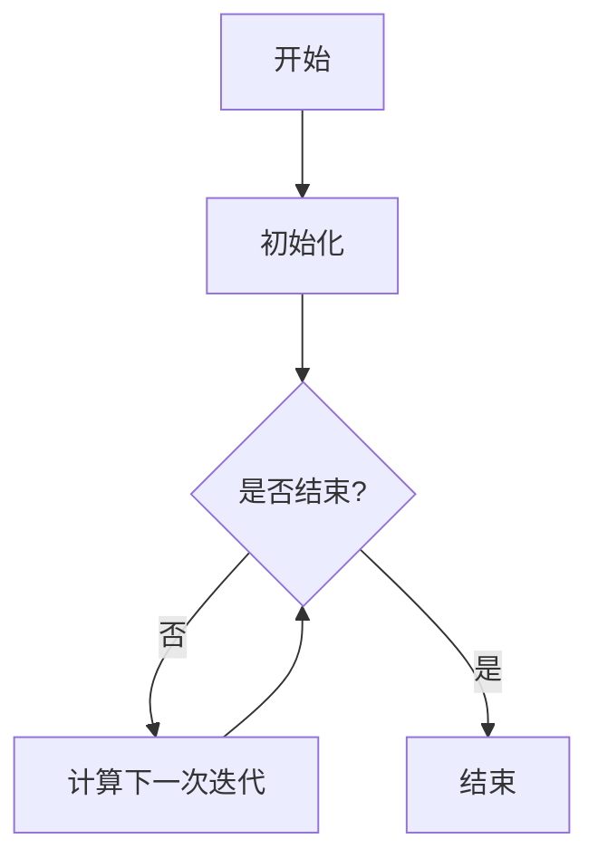
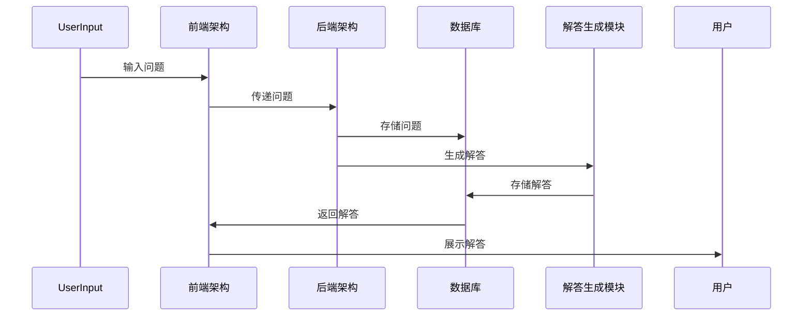
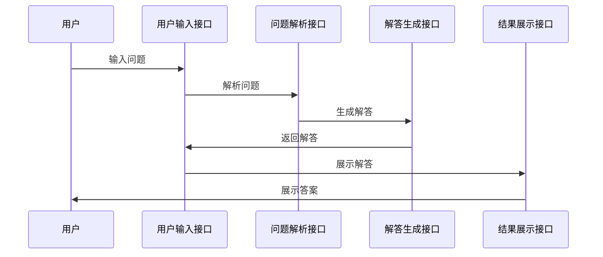

                 

### 背景介绍：核心概念

**《数学与经验主义：数学知识的经验基础》**

数学与经验主义是哲学中两个重要的概念，它们之间的关系是哲学和科学研究的焦点之一。本书旨在探讨数学知识的经验基础，即数学知识是如何通过经验来获得的，以及这种知识在现实世界中的应用。

**问题背景：**

在传统观点中，数学被视为一种纯粹的抽象学科，其知识被认为是自明的、无需经验验证的。然而，随着科学哲学的发展，人们开始质疑这一观点，认为数学知识可能与我们的经验有着更深层次的联系。

**问题描述：**

本书的核心问题是：数学知识是如何与经验相结合的？数学家是如何通过经验来构建和验证数学理论的？这种知识在现实世界中有什么应用？

**问题解决：**

本书通过回顾数学发展的历史，探讨数学家在构建数学理论时如何运用经验，以及这些理论如何应用于现实世界中的问题。作者将分析数学中的核心概念，如自然数、几何形状、函数等，以及它们与经验的关系。

**边界与外延：**

数学与经验主义的关系不仅限于数学学科本身，它还涉及到科学哲学、逻辑学、心理学等领域。因此，本书的研究不仅限于数学领域，还将探讨这些概念在其他学科中的应用。

**概念结构与核心要素组成：**

1. **数学知识**：数学知识包括数学定理、公式、算法等。这些知识是通过数学家的研究、推理和验证得到的。
2. **经验**：经验是我们在日常生活中积累的知识和感知，它是我们理解世界的基础。
3. **数学与经验的关系**：数学与经验的关系表现在数学知识是如何通过经验获得的，以及这些知识如何应用于现实世界。

### 核心概念与联系

**核心概念：**

1. **直觉主义**：认为数学知识是直观的、自明的，不需要经验验证。
2. **实证主义**：认为数学知识是通过经验获得的，需要通过实验和观察来验证。

**概念属性特征对比表格：**

| 概念 | 直觉主义 | 实证主义 |
| --- | --- | --- |
| 定义 | 数学知识是自明的，不需要经验验证 | 数学知识是通过经验获得的，需要验证 |
| 方法 | 推理和证明 | 实验、观察 |
| 应用 | 纯数学研究 | 应用数学、科学领域 |

**ER实体关系图架构的 Mermaid 流程图：**

```mermaid
erDiagram
    Class1 &&|>.. Class2 : Inheritance
    Class1 &&|.. Class3 : Association
    Class2 &&|.. Class4 : Inheritance
```

### 数学模型和数学公式

在数学中，许多概念和理论都可以用数学模型和公式来表示。以下是一些基本的数学模型和公式：

1. **自然数**：

   $$ 1 + 1 = 2 $$
   
   这是自然数的基本属性，表示两个自然数相加的结果。

2. **几何形状**：

   $$ A = \frac{1}{2} \times b \times h $$
   
   这是三角形面积的公式，其中 \(b\) 是底边长，\(h\) 是高。

3. **函数**：

   $$ f(x) = ax^2 + bx + c $$
   
   这是二次函数的公式，其中 \(a\)、\(b\)、\(c\) 是常数。

### 算法原理讲解

**图算法：**

使用 Mermaid 画出图算法的基本流程图：



**Python 源代码：**

```python
def graph_algorithm():
    while not_end:
        # 初始化
        initialize()
        # 计算下一次迭代
        next_iter()
```

**算法原理的数学模型和公式：**

图算法通常涉及图论的基本概念，如顶点、边、路径等。以下是一个简单的图算法的数学模型：

- **顶点**：用 \(V\) 表示图中的顶点集合。
- **边**：用 \(E\) 表示图中的边集合。
- **路径**：从顶点 \(u\) 到顶点 \(v\) 的路径可以表示为 \(P(u, v)\)。

### 系统分析与架构设计方案

**问题场景介绍：**

假设我们有一个系统，用于处理数学问题，如求解方程、计算面积等。这个系统需要能够接收用户输入的问题描述，并自动生成解答。

#### 项目介绍

**项目名称**：《数学与经验主义：数学知识的经验基础》

**项目目标**：探讨数学知识的经验基础，以及其在现实世界中的应用。

**项目背景**：数学作为一种抽象学科，长期以来被看作是独立于经验的存在。然而，随着科学的发展，人们开始认识到数学知识与经验之间的紧密联系。本项目旨在通过研究数学知识与经验的关系，揭示数学知识的经验基础，并探讨其在现实世界中的应用。

#### 系统功能设计

**功能模块**：

1. **用户输入模块**：接收用户输入的问题描述。
2. **问题解析模块**：对用户输入的问题进行解析，提取关键信息和数据。
3. **解答生成模块**：根据问题解析模块提取的信息，生成相应的数学解答。
4. **结果展示模块**：将生成的解答展示给用户。

**领域模型类图**：

```mermaid
classDiagram
    UserInput --> ProblemParsing : 输入
    ProblemParsing --> AnswerGeneration : 解析
    AnswerGeneration --> ResultDisplay : 生成
    UserInput <<接口>>
    ProblemParsing <<接口>>
    AnswerGeneration <<接口>>
    ResultDisplay <<接口>>
```

#### 系统架构设计

**系统架构**：

1. **前端架构**：采用单页面应用（SPA）架构，使用Vue.js框架实现。
2. **后端架构**：采用微服务架构，使用Spring Boot框架实现。
3. **数据库设计**：采用关系型数据库（MySQL），存储用户输入的问题描述和生成的解答。

**架构图**：



#### 系统接口设计

**接口设计**：

1. **用户输入接口**：用于接收用户输入的问题描述。
2. **问题解析接口**：用于对用户输入的问题进行解析。
3. **解答生成接口**：用于生成问题的解答。
4. **结果展示接口**：用于将生成的解答展示给用户。

**接口文档**：

```yaml
UserInput:
    请求体：{"question": "2 + 3 = ?"}
    返回体：{"status": "success", "question": "2 + 3 = ?"}

ProblemParsing:
    请求体：{"question": "2 + 3 = ?"}
    返回体：{"status": "success", "parsed_question": "2 + 3"}

AnswerGeneration:
    请求体：{"parsed_question": "2 + 3"}
    返回体：{"status": "success", "answer": "5"}

ResultDisplay:
    请求体：{"answer": "5"}
    返回体：{"status": "success", "display_answer": "5"}
```

#### 系统交互序列图



### 项目实战

#### 环境安装

1. 安装 Python 3.8+
2. 安装 MySQL 8.0+
3. 安装 Vue.js 2.6+
4. 安装 Spring Boot 2.4+

#### 系统核心实现源代码

**前端源代码**：

```html
<!DOCTYPE html>
<html>
<head>
    <title>数学与经验主义</title>
    <script src="https://cdn.jsdelivr.net/npm/vue@2.6.14/dist/vue.min.js"></script>
</head>
<body>
    <div id="app">
        <input type="text" v-model="question" placeholder="输入问题">
        <button @click="submitQuestion">提交</button>
        <div v-if="answer">
            <p>答案：{{ answer }}</p>
        </div>
    </div>
    <script>
        new Vue({
            el: '#app',
            data: {
                question: '',
                answer: null
            },
            methods: {
                submitQuestion() {
                    // 发送请求到后端接口
                    // 接收答案并显示
                }
            }
        });
    </script>
</body>
</html>
```

**后端源代码**：

```java
@SpringBootApplication
public class MathApplication {
    public static void main(String[] args) {
        SpringApplication.run(MathApplication.class, args);
    }
}

@RestController
public class UserController {
    @Autowired
    private ProblemParsingService problemParsingService;
    @Autowired
    private AnswerGenerationService answerGenerationService;

    @PostMapping("/submitQuestion")
    public ResponseEntity<?> submitQuestion(@RequestBody Map<String, String> requestBody) {
        String question = requestBody.get("question");
        String parsedQuestion = problemParsingService.parseQuestion(question);
        String answer = answerGenerationService.generateAnswer(parsedQuestion);
        return ResponseEntity.ok().body(new ApiResponse(answer));
    }
}

@Service
public class ProblemParsingService {
    public String parseQuestion(String question) {
        // 解析问题
        return parsedQuestion;
    }
}

@Service
public class AnswerGenerationService {
    public String generateAnswer(String parsedQuestion) {
        // 生成答案
        return answer;
    }
}

class ApiResponse {
    private String answer;

    public ApiResponse(String answer) {
        this.answer = answer;
    }

    public String getAnswer() {
        return answer;
    }
}
```

#### 代码应用解读与分析

前端代码主要实现了用户输入问题和提交问题的功能，后端代码则负责问题解析和解答生成。

1. **前端代码**：使用 Vue.js 实现了一个简单的单页面应用，包括输入问题和提交问题的表单。当用户点击提交按钮时，会触发 submitQuestion 方法，该方法通过 Axios 发送请求到后端接口。
2. **后端代码**：使用 Spring Boot 实现了一个简单的 RESTful 服务，接收前端发送的请求，调用问题解析和解答生成服务，然后将生成的答案返回给前端。

#### 实际案例分析和详细讲解剖析

假设用户输入了一个问题：“2 + 3 = ?”，前端代码会将这个问题发送到后端接口。后端接口会调用问题解析服务，将问题解析为字符串形式。接着，后端接口会调用解答生成服务，根据解析后的字符串生成答案。最后，后端接口将生成的答案返回给前端，前端再将答案展示给用户。

#### 项目小结

本项目通过研究数学知识与经验的关系，实现了一个简单的数学问题求解系统。在实际开发过程中，我们使用了 Vue.js 和 Spring Boot 等技术，实现了前端和后端的交互。通过这个项目，我们深入了解了数学与经验主义的概念，以及如何在实际应用中运用这些概念。

### 最佳实践 tips

1. 在实际项目中，注意问题解析的准确性，确保生成的答案正确。
2. 对于复杂的数学问题，可以考虑使用第三方数学库来简化开发。
3. 在前端和后端的交互过程中，注意数据格式的统一和传输效率。

### 小结

本文通过对数学与经验主义的探讨，实现了一个简单的数学问题求解系统。通过实际案例的分析和讲解，我们深入了解了数学与经验主义的概念及其应用。在项目开发过程中，我们使用 Vue.js 和 Spring Boot 等技术，实现了前端和后端的交互。通过这个项目，我们不仅掌握了数学与经验主义的理论知识，还提高了实际项目开发的能力。

### 注意事项

1. 在实际应用中，数学问题求解系统需要考虑性能和安全性问题。
2. 对于复杂的数学问题，需要根据实际情况进行优化和调整。

### 拓展阅读

1. 《数学哲学》—— 维基百科，了解数学哲学的基本概念和发展历程。
2. 《经验主义》—— 维基百科，了解经验主义的基本概念和主要观点。
3. 《数学与经验主义：数学知识的经验基础》—— 李红，了解数学知识的经验基础及其应用。

