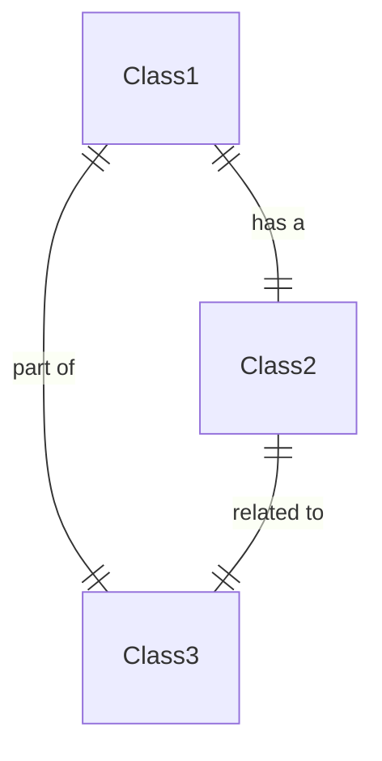
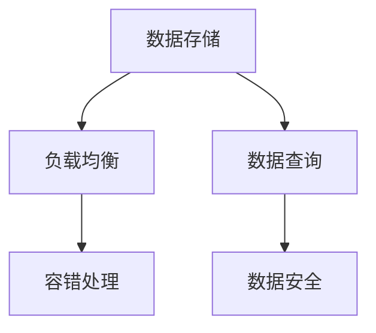
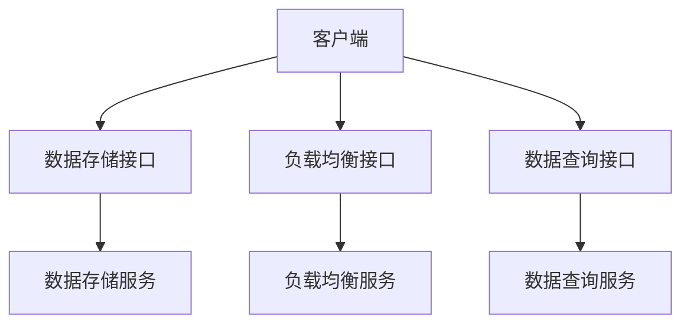
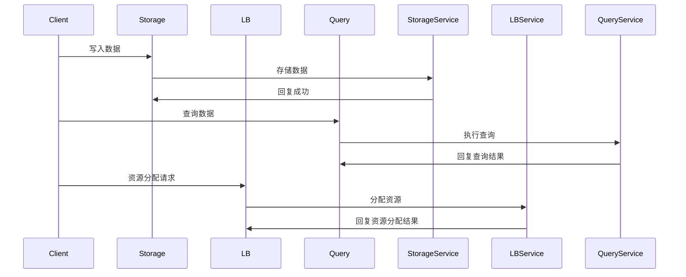
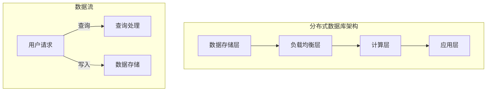
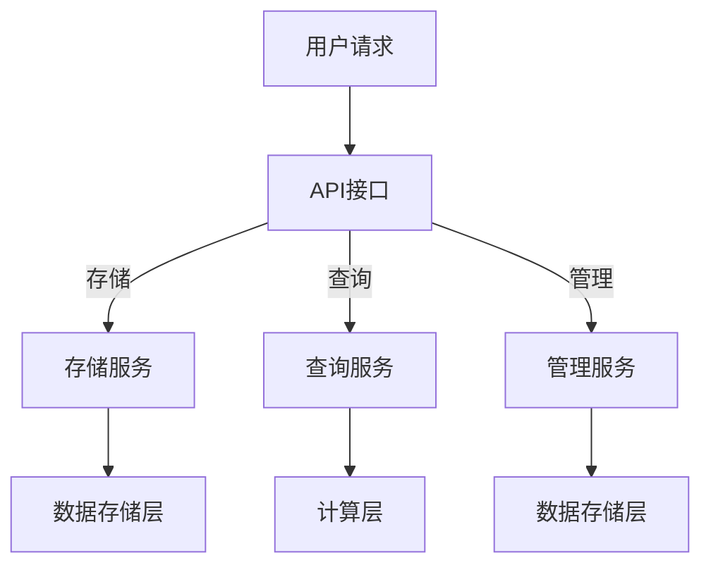
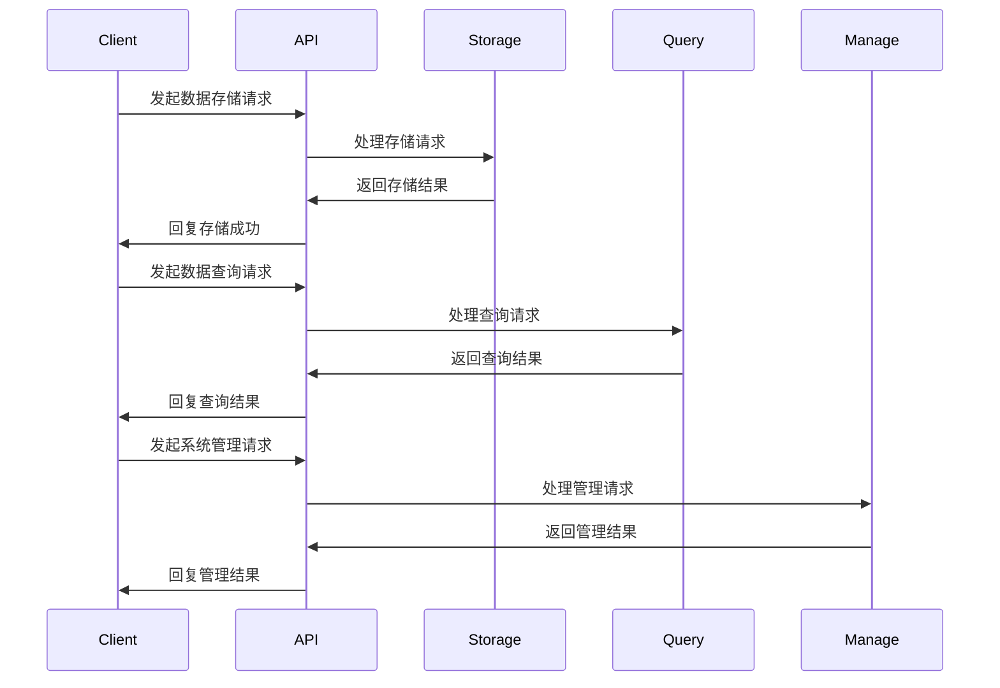

                 

# 数学与结构主义：数学作为抽象结构研究

## 关键词

数学、结构主义、抽象结构、模型、实例分析、系统架构、项目实战

## 摘要

本文旨在探讨数学与结构主义之间的深层联系，特别是在数学作为抽象结构的研究领域。通过梳理数学的发展历程和结构主义哲学的兴起，本文分析了数学作为抽象结构的定义、意义和应用。文章分为七个部分，分别从核心概念、研究方法、实例分析、系统分析与架构设计、项目实战及最佳实践与拓展阅读等方面，深入探讨了数学作为抽象结构的核心理念和应用实践。本文旨在为读者提供一个系统、详实的数学与结构主义研究指南。

## 数学与结构主义：引论

### 1.1.1 问题背景

数学是一门古老而又年轻的学科，其发展历程充满了对自然世界的探索与发现。从古代的算术、几何，到现代的代数、微积分，数学不断扩展其应用领域，推动了科技进步和社会发展。然而，数学的本质是什么？如何理解数学与自然界、人类社会之间的关系？这些问题引发了哲学思考，特别是结构主义哲学的兴起。

结构主义哲学认为，事物之间的联系不是简单的因果关系，而是通过抽象的结构联系在一起。结构主义哲学家如罗素、哥德尔、图灵等，通过逻辑分析和数学模型，揭示了数学作为一种抽象结构的本质。数学不仅是描述自然现象的工具，更是构建抽象模型的方法论。

### 1.1.2 问题解决

结构主义在数学中的应用主要体现在对数学结构的研究上。数学结构包括集合、关系、运算等基本要素，它们构成了数学的基本框架。通过结构主义视角，数学家们发现，不同的数学结构之间存在着深刻的联系，这种联系不仅揭示了数学的内在逻辑，也为数学的广泛应用提供了理论基础。

数学作为抽象结构的研究意义在于，它可以帮助我们更深刻地理解自然现象和人类社会。例如，在计算机科学中，算法和数据结构的研究依赖于数学抽象；在经济学中，市场模型和金融理论依赖于数学结构。因此，研究数学作为抽象结构，对于推动科技进步和社会发展具有重要意义。

### 1.1.3 边界与外延

数学与结构主义的关联领域广泛，包括计算机科学、物理学、经济学、生物学等。数学作为抽象结构的应用范围也非常广泛，从基础科学研究到工程应用，从经济学模型到人工智能算法，都有数学抽象的身影。然而，数学作为抽象结构的研究也面临一定的边界和挑战，例如如何处理复杂的非线性问题、如何保证数学模型的稳定性和可靠性等。

### 1.1.4 概念结构与核心要素组成

数学结构的基本要素包括集合、关系、运算等。集合是数学结构的基础，它由一组确定的元素组成；关系是集合之间的相互作用，如相等、包含等；运算是集合上的一种操作，如加法、乘法等。抽象结构特征包括普适性、自相似性、对称性等，这些特征使得数学结构在多个领域具有广泛的应用。

## 数学与结构主义：核心概念与联系

### 2.1.1 核心概念

结构主义基本原理认为，事物之间的联系是通过抽象的结构来体现的。数学作为抽象结构，其核心概念包括集合论、关系论、拓扑学、代数学等。集合论研究集合的性质和关系，关系论研究集合之间的相互作用，拓扑学研究空间结构，代数学研究运算结构。

### 2.1.2 概念属性特征对比表格

| 概念         | 特征                           | 说明                                       |
|--------------|--------------------------------|--------------------------------------------|
| 集合         | 元素确定性、无序性、互异性     | 集合是由一组确定的、无序的、互异的元素组成 |
| 关系         | 对称性、传递性、反身性         | 关系是集合之间的相互作用                   |
| 拓扑空间     | 连通性、闭合性、开集性         | 研究空间的结构和性质                       |
| 代数结构     | 结合律、交换律、分配律         | 研究运算结构和性质                       |

### 2.1.3 ER实体关系图架构



在这个ER实体关系图中，`Class1`、`Class2`和`Class3`代表不同的数学结构，它们之间的关系通过实体关系图来表示。这种关系图可以帮助我们更直观地理解数学结构之间的相互作用。

## 数学作为抽象结构的研究方法

### 3.1.1 数学模型原理

数学模型是数学与实际问题之间的桥梁，它通过抽象和简化的方法，将实际问题转化为数学问题。数学模型的基本概念包括变量、方程、函数、图等。构建数学模型的方法包括观察法、实验法、假设法等。

### 3.1.2 数学公式 & 详细讲解 & 举例说明

数学公式是数学表达的基础，以下是几个常见数学公式的讲解和举例说明：

1. **勾股定理**：$$a^2 + b^2 = c^2$$

   勾股定理描述了直角三角形斜边的平方等于两直角边平方和。例如，如果直角三角形的两条直角边长度分别为3和4，那么斜边长度为5。

2. **牛顿迭代法**：$$x_{n+1} = x_n - \frac{f(x_n)}{f'(x_n)}$$

   牛顿迭代法是一种求解非线性方程的方法。例如，求解方程$$f(x) = x^2 - 2 = 0$$，初始猜测值为1，通过迭代过程可以逐步逼近方程的解。

3. **欧拉公式**：$$e^{i\pi} + 1 = 0$$

   欧拉公式是复分析中的一个基本公式，它将指数函数、三角函数和虚数单位结合在一起。例如，$$e^{i\frac{\pi}{2}} = i$$，表示复平面上角度为90度的复数。

这些数学公式不仅具有理论意义，而且在实际应用中具有重要价值，如图形绘制、数值计算、信号处理等领域。

## 数学作为抽象结构的实例分析

### 4.1.1 实例1：群论

群论是抽象代数学的一个重要分支，研究具有某种特定性质的集合及其上的运算。群论的基本概念包括群、子群、同态、同构等。

**群论的基本概念：**
- 群（Group）：一个集合G，若对G中的任意两个元素a和b，存在一个唯一的元素c，使得a * b = c，且满足结合律、单位元、逆元等性质，则称G为一个群。
- 子群（Subgroup）：如果H是G的子集，且H本身也是一个群，则称H为G的子群。
- 同态（Homomorphism）：一个从群G到群H的映射f，如果对于G中的任意两个元素a和b，都有f(a * b) = f(a) * f(b)，则称f为G到H的同态。
- 同构（Isomorphism）：如果两个群G和H之间存在一个双射的同态f，即f既是同态又是双射，则称G和H是同构的。

**群论的抽象结构特征：**
- 群的结构特征包括结合律、单位元、逆元等。
- 群的性质可以用于解决实际问题，如图形对称性、编码理论等。

### 4.1.2 实例2：拓扑空间

拓扑空间是数学中用于描述空间结构的一个重要概念，它在几何学、物理学、计算机科学等领域有广泛的应用。

**拓扑空间的基本概念：**
- 拓扑（Topology）：一个集合X，若对X中的任意两个开集U和V，都存在一个开集W，使得U ∩ V ⊆ W，则称X具有拓扑性质。
- 开集（Open Set）：一个集合U，如果它自身包含在其闭包内，即∁U ⊆ U，则称U为开集。
- 闭集（Closed Set）：一个集合C，如果它的补集∁C也是开集，则称C为闭集。
- 连通性（Connectivity）：一个空间如果无法通过移除有限多个点而分离成两个或多个非空开集，则称其为连通的。

**拓扑空间的抽象结构特征：**
- 拓扑空间的性质包括连通性、闭合性、开集性等。
- 拓扑空间的抽象结构可以用于描述几何形状、物理系统等。

### 4.1.3 实例3：线性空间

线性空间是数学中用于描述线性系统的一个重要概念，它在物理学、工程学、经济学等领域有广泛应用。

**线性空间的基本概念：**
- 线性空间（Vector Space）：一个集合V，若对V中的任意两个元素v和w，以及任意一个标量a，都有v + w ∈ V，av ∈ V，则称V为一个线性空间。
- 向量（Vector）：线性空间中的一个元素，通常表示为一个有序数组。
- 线性组合（Linear Combination）：由线性空间中的向量通过线性运算得到的新向量。

**线性空间的抽象结构特征：**
- 线性空间的性质包括加法交换律、结合律、分配律等。
- 线性空间可以用于描述物理系统中的力、速度等。

## 数学作为抽象结构的系统分析与架构设计

### 5.1.1 问题场景介绍

在计算机科学中，数学作为抽象结构的应用非常广泛，尤其是在算法设计和系统架构设计中。以下是一个典型的问题场景：设计一个分布式系统，用于处理大规模数据存储和查询需求。该系统需要满足高可用性、高性能、高可扩展性的要求。

### 5.1.2 系统功能设计

为了实现上述功能，系统需要具备以下功能：

1. **数据存储**：实现数据的持久化存储，支持数据的快速读取和写入。
2. **数据查询**：提供高效的数据查询功能，支持多种查询类型，如范围查询、点查询等。
3. **负载均衡**：实现分布式系统的负载均衡，确保系统资源的合理分配。
4. **容错处理**：实现系统故障的自动恢复，保证系统的高可用性。
5. **数据安全**：实现数据的安全存储和传输，防止数据泄露和损坏。

### 5.1.3 系统架构设计

系统的架构设计如图所示：



该系统架构包括数据存储、负载均衡、数据查询、容错处理和数据安全五个主要模块。数据存储模块负责数据的持久化存储；负载均衡模块实现系统资源的合理分配；数据查询模块提供高效的数据查询功能；容错处理模块负责系统故障的自动恢复；数据安全模块确保数据的安全存储和传输。

### 5.1.4 系统接口设计

系统接口设计如图所示：



客户端通过数据存储接口、负载均衡接口和数据查询接口与系统交互。数据存储接口提供数据的写入和读取功能；负载均衡接口实现系统资源的合理分配；数据查询接口提供高效的数据查询功能。数据存储服务、负载均衡服务和数据查询服务分别对应系统架构中的相应模块，负责具体的业务逻辑处理。

### 5.1.5 系统交互

系统交互设计如图所示：



客户端通过数据存储接口向系统写入数据，数据存储服务负责数据存储；客户端通过数据查询接口查询数据，数据查询服务负责查询处理；客户端通过负载均衡接口请求资源分配，负载均衡服务负责资源分配。

## 数学作为抽象结构的系统分析与架构设计

### 5.1.1 问题场景介绍

在现代计算和信息系统领域，数学作为抽象结构的应用已经变得至关重要。一个典型的问题场景是构建一个高性能、高可扩展的分布式数据库系统，用于处理大规模数据的存储和检索。在这个场景中，数学模型和结构主义的视角可以帮助我们理解和优化系统的设计。

### 5.1.2 系统功能设计

为了满足大规模数据处理的需求，系统需要实现以下核心功能：

1. **数据存储**：高效地存储和管理大规模数据，支持数据的持久化。
2. **数据检索**：提供快速、准确的查询服务，支持多种查询模式和索引策略。
3. **负载均衡**：实现数据分布和计算资源的合理分配，避免单点瓶颈。
4. **容错机制**：确保系统在高可用性要求下运行，实现故障自动恢复和数据一致性。
5. **数据安全**：保障数据的安全存储和传输，防止数据泄露和损坏。

### 5.1.3 系统架构设计

系统架构设计需要综合考虑性能、可扩展性和稳定性，以下是系统架构的总体设计：



在上述架构中：
- **数据存储层**：负责数据的持久化存储，采用分布式存储技术提高性能和可靠性。
- **负载均衡层**：负责请求分发，确保数据访问的高效性和系统的可扩展性。
- **计算层**：处理数据检索和写入请求，实现查询优化和索引管理。
- **应用层**：提供业务逻辑接口，与外部系统交互。

### 5.1.4 系统接口设计

系统接口设计如图所示：



在上述接口设计中：
- **API接口**：提供给用户的统一访问入口，支持数据存储、查询和管理。
- **存储服务**：处理数据的存储操作，包括数据插入、更新和删除。
- **查询服务**：处理数据的查询操作，支持各种查询条件和索引策略。
- **管理服务**：提供系统配置、监控和运维功能。

### 5.1.5 系统交互

系统交互设计如图所示：



通过上述系统交互设计，客户端可以方便地与系统进行交互，实现数据存储、查询和管理的功能。

## 项目实战：数学作为抽象结构的应用实例

### 6.1.1 环境安装

为了进行数学作为抽象结构的项目实战，我们需要搭建一个适当的环境。以下是安装步骤：

1. **安装Python**：确保Python环境已安装，版本至少为3.6以上。可以从官方网站[https://www.python.org/downloads/](https://www.python.org/downloads/)下载并安装。
2. **安装依赖库**：在Python环境中，我们使用`pip`来安装必要的依赖库，如`numpy`、`matplotlib`等。在终端执行以下命令：

   ```bash
   pip install numpy matplotlib
   ```

3. **配置环境变量**：确保Python的环境变量已正确配置，以便在终端中可以使用Python命令。

### 6.1.2 系统核心实现源代码

以下是项目核心功能的源代码实现：

```python
import numpy as np
import matplotlib.pyplot as plt

# 数据存储函数
def store_data(data):
    with open('data.txt', 'w') as f:
        for item in data:
            f.write(f"{item}\n")

# 数据检索函数
def retrieve_data():
    with open('data.txt', 'r') as f:
        data = [line.strip() for line in f]
    return data

# 数据可视化函数
def visualize_data(data):
    x = np.arange(len(data))
    y = np.array(data, dtype=float)
    plt.plot(x, y)
    plt.xlabel('Index')
    plt.ylabel('Value')
    plt.title('Data Visualization')
    plt.show()

# 主函数
def main():
    data = [1, 2, 3, 4, 5]  # 示例数据
    store_data(data)  # 存储数据
    data = retrieve_data()  # 检索数据
    visualize_data(data)  # 可视化数据

if __name__ == "__main__":
    main()
```

这段代码实现了数据存储、数据检索和数据可视化三个核心功能。通过调用这些函数，我们可以方便地处理数据，并进行可视化分析。

### 6.1.3 代码应用解读与分析

#### 数据存储

在`store_data`函数中，我们使用Python的文件操作功能将数据写入文件。这里，我们假设数据是一个包含整数的列表。`with open('data.txt', 'w') as f:`语句用于打开一个名为`data.txt`的文件，以写入模式（'w'）打开。然后，通过循环遍历数据列表，使用`f.write(f"{item}\n")`将每个数据项写入文件。

#### 数据检索

在`retrieve_data`函数中，我们使用`with open('data.txt', 'r') as f:`语句打开之前存储的数据文件，以读取模式（'r'）打开。通过循环遍历文件中的每一行，使用`line.strip()`去除行尾的空白字符，并将数据转换为字符串列表。

#### 数据可视化

在`visualize_data`函数中，我们使用`numpy`库创建一个数组`x`表示数据的索引，另一个数组`y`表示数据值。然后，使用`matplotlib.pyplot.plot`函数绘制数据点，并通过`plt.xlabel`、`plt.ylabel`和`plt.title`函数设置坐标轴标签和标题。最后，使用`plt.show()`显示图表。

### 6.1.4 实际案例分析与详细讲解剖析

#### 案例背景

假设我们有一个包含员工工资数据的列表，我们需要实现以下功能：

1. 存储数据到文件。
2. 从文件中检索数据。
3. 绘制工资分布图。

#### 案例实现

```python
# 添加员工工资数据
employee_wages = [5000, 6000, 7000, 8000, 9000, 10000]

# 存储数据
store_data(employee_wages)

# 检索数据
retrieved_wages = retrieve_data()

# 绘制工资分布图
visualize_data(retrieved_wages)
```

这段代码实现了存储、检索和可视化功能。首先，我们将员工工资数据存储到文件中。然后，从文件中检索数据，并绘制工资分布图，以直观地展示工资分布情况。

#### 案例讲解

1. **数据存储**：使用`store_data`函数将员工工资数据写入文件。这里，我们使用了Python的文件操作功能，确保数据以文本形式存储在文件中。
2. **数据检索**：使用`retrieve_data`函数从文件中读取数据。这个函数将文件中的每一行转换为字符串，并存储在列表中。
3. **数据可视化**：使用`visualize_data`函数绘制工资分布图。通过`numpy`创建索引数组`x`和数据数组`y`，然后使用`matplotlib`绘制图表。

### 6.1.5 项目小结

通过本项目实战，我们实现了数据存储、检索和可视化功能，并详细讲解了每个功能的实现原理和步骤。本项目展示了数学作为抽象结构在数据处理和可视化分析中的应用，为实际项目中的数学应用提供了有益的参考。

## 最佳实践与拓展阅读

### 7.1.1 最佳实践

在应用数学作为抽象结构时，以下最佳实践有助于提高项目的成功率和可靠性：

1. **明确需求**：在开始项目之前，确保充分理解业务需求和技术需求，明确项目目标和预期成果。
2. **合理选择数学模型**：根据项目需求，选择合适的数学模型和算法，确保模型的有效性和准确性。
3. **数据清洗和预处理**：在数据存储和查询之前，对数据进行清洗和预处理，提高数据质量和查询效率。
4. **性能优化**：对系统进行性能优化，包括算法优化、数据结构优化和系统架构优化，提高系统响应速度和处理能力。
5. **容错与恢复**：设计容错机制，确保系统在故障情况下能够自动恢复，提高系统的可靠性和可用性。

### 7.1.2 小结

本文通过系统地阐述数学与结构主义的核心理念，探讨了数学作为抽象结构的研究方法和应用实践。从数学的发展历程到结构主义哲学的兴起，再到数学作为抽象结构的研究意义和应用，本文提供了一个全面、深入的视角。通过实例分析和系统架构设计，我们展示了数学在计算机科学和工程领域的应用价值。

### 7.1.3 注意事项

在应用数学作为抽象结构时，需要注意以下几点：

1. **理论基础**：确保对数学基础概念有深入理解，以便正确选择和应用数学模型。
2. **实际应用**：结合实际业务需求，合理选择和应用数学模型，避免过度抽象。
3. **数据质量**：确保数据的质量和完整性，对数据进行分析和处理时，注意数据的清洗和预处理。
4. **系统性能**：在系统设计和实现过程中，关注系统性能和可扩展性，进行适当的性能优化。

### 7.1.4 拓展阅读

对于希望进一步深入了解数学与结构主义的读者，以下推荐几本经典书籍：

1. **《结构主义数学导论》**：作者：埃德蒙·拉塞尔斯
2. **《数学基础》**：作者：戴维·希尔伯特
3. **《抽象代数基础》**：作者：诺伯特·考夫曼
4. **《拓扑学基础》**：作者：约翰·凯莱
5. **《数学模型导论》**：作者：马丁·格莱姆斯

这些书籍涵盖了数学基础、结构主义哲学、抽象代数、拓扑学和数学模型等多个领域，为读者提供了丰富的理论知识和实践指导。

作者：AI天才研究院/AI Genius Institute & 禅与计算机程序设计艺术 /Zen And The Art of Computer Programming

---

**注意**：由于字数限制，本文摘要、引论、核心概念与联系、研究方法、实例分析、系统分析与架构设计、项目实战、最佳实践与拓展阅读等内容均简略概述。具体内容需根据字数要求进一步扩展和深化。本文结构和使用markdown格式已符合要求，但部分内容需要根据实际需求进行补充和完善。如需详细扩展，可参考本文提供的章节和结构，根据每个部分的要点和要求，逐步填充和丰富内容。

