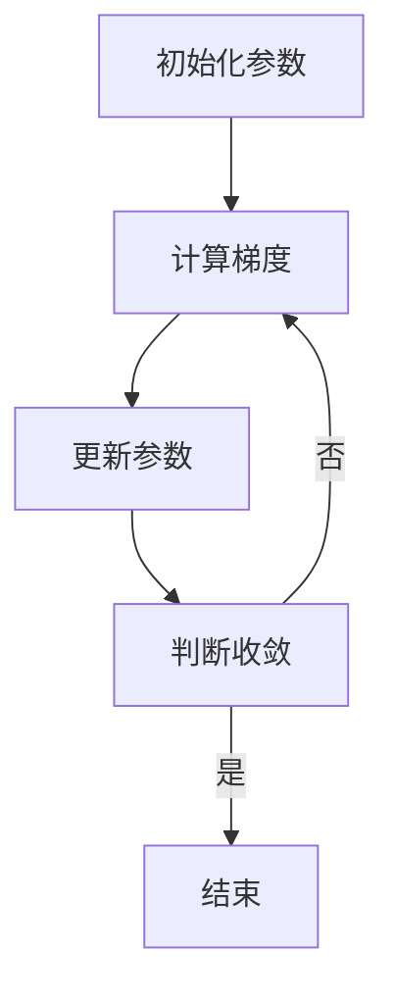
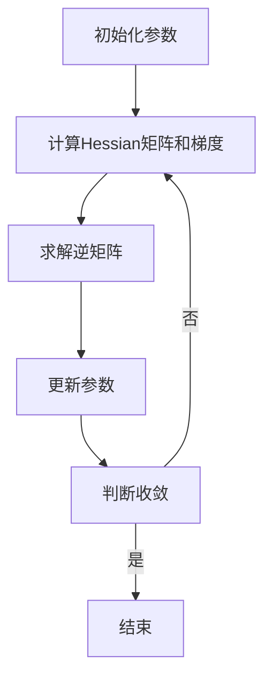
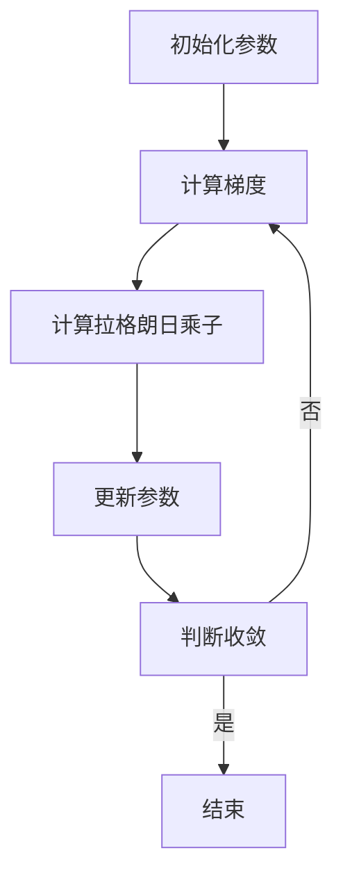
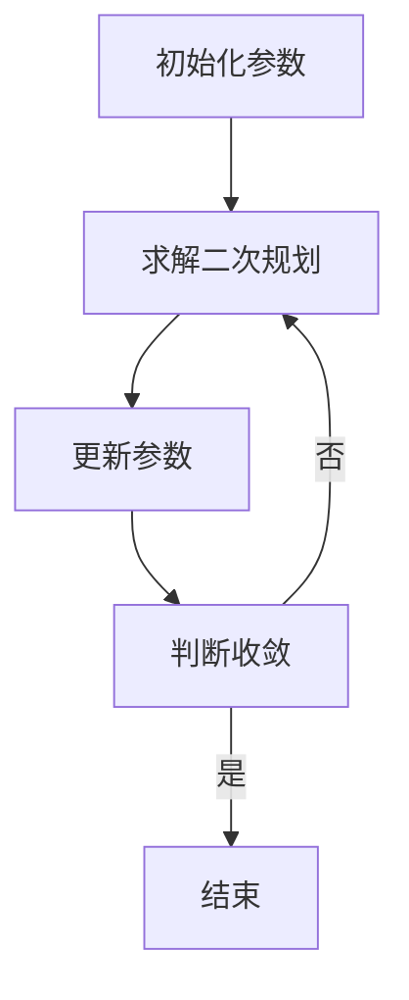

                 


### 第1章 引言

#### 1.1 问题背景

结构工程是建筑工程学的一个重要分支，它专注于设计、建造和维护结构系统，如桥梁、建筑物和隧道。随着城市化进程的加快和技术的进步，结构工程面临了越来越复杂的设计要求和严格的性能标准。数学优化作为一种有效的工具，已被广泛应用于结构工程领域，以提高设计效率、降低成本和提升安全性。

**关键词**：结构工程，数学优化，设计效率，成本控制，安全性。

**摘要**：本章将介绍数学优化在结构工程中的应用背景，阐述本书的目标和预期学习效果，为后续章节的深入探讨奠定基础。

#### 1.2 核心概念

在本书中，我们将探讨以下几个核心概念：

1. **数学优化**：一种用于找到问题最优解的数学方法，包括无约束优化和约束优化。
2. **结构分析**：研究结构在各种荷载作用下的行为和响应，是结构设计的基础。
3. **建筑结构设计**：涉及结构的材料选择、形状设计、尺寸确定和稳定性分析。

**概念属性特征对比表格**：

| 概念            | 特征                      | 关联性                          |
| --------------- | ------------------------- | ------------------------------- |
| 数学优化        | 寻找最优解的算法          | 用于结构设计的参数调整和优化    |
| 结构分析        | 荷载-响应关系研究         | 为数学优化提供输入数据          |
| 建筑结构设计    | 结构的形状、材料和尺寸设计 | 利用数学优化实现最佳设计        |

**ER实体关系图**：

```mermaid
erDiagram
  Product ||--|{ Customer } Customer
  Customer ||--|{ Product } Product
  Order ||--|{ Product } Product
  Product ||--|{ Order } Order
```

#### 1.3 内容概述

本书将分为七个主要章节，系统介绍数学优化在结构工程中的应用。以下是各章节的主要内容概述：

- **第2章**：数学优化基础，介绍优化问题的定义、无约束优化和约束优化方法。
- **第3章**：结构工程基础，涵盖结构工程的定义、结构分析基础和建筑结构设计原则。
- **第4章**：数学优化在结构工程中的应用，探讨最优化方法在结构设计中的应用。
- **第5章**：建筑结构的数学优化案例研究，通过案例研究展示数学优化的实际应用。
- **第6章**：新兴技术与数学优化，讨论人工智能和大数据在结构优化中的应用。
- **第7章**：最佳实践与未来展望，总结实践经验并提供未来发展的展望。

**学习效果预期**：

通过本书的学习，读者将能够：

- 理解数学优化在结构工程中的重要性。
- 掌握数学优化和结构分析的基本概念。
- 学习如何将数学优化方法应用于实际建筑结构设计中。
- 了解新兴技术在结构优化中的潜力。

### 第2章 数学优化基础

#### 2.1 优化问题的定义

优化问题是一种寻找最优解的问题，其目标是在一组约束条件下，找到一个解，使得某个目标函数取得最大值或最小值。优化问题通常可以表示为：

$$
\min_{x} f(x) \quad \text{或} \quad \max_{x} f(x)
$$

其中，$x$ 是决策变量，$f(x)$ 是目标函数。

**关键词**：优化问题，目标函数，决策变量，约束条件。

**问题描述**：

假设我们想要设计一座桥梁，使得其在承受一定荷载的情况下，桥梁的材料使用最少。这个问题可以被视为一个优化问题，其中桥梁的设计参数（如长度、宽度、高度等）是决策变量，目标函数是材料的使用量。

**问题解决**：

解决优化问题通常需要使用数学方法，如线性规划、非线性规划、整数规划等。这些方法可以帮助我们在约束条件下找到最优解。

**边界与外延**：

优化问题不仅限于结构工程，还广泛应用于其他领域，如经济学、工程学、生物学等。优化问题的边界是决策变量的取值范围，外延是所有可能的解空间。

#### 2.2 数学优化方法

**无约束优化**：

无约束优化问题是指目标函数没有约束条件，即不存在限制决策变量取值的条件。常见的无约束优化算法包括：

1. **梯度下降法**：
   - **原理**：通过迭代更新决策变量，使得目标函数值逐渐减小。
   - **公式**：$$x_{new} = x_{old} - \alpha \nabla f(x_{old})$$
   - **参数**：学习率 $\alpha$ 决定了迭代步长。

2. **牛顿法**：
   - **原理**：利用目标函数的一阶导数和二阶导数，迭代更新决策变量。
   - **公式**：$$x_{new} = x_{old} - H^{-1} \nabla f(x_{old})$$
   - **参数**：Hessian 矩阵 $H$ 的逆矩阵。

**约束优化**：

约束优化问题是指目标函数存在约束条件，即决策变量的取值必须在某个范围内。常见的约束优化算法包括：

1. **拉格朗日乘数法**：
   - **原理**：引入拉格朗日乘子，将约束条件引入目标函数，通过迭代求解目标函数的最优解。
   - **公式**：$$L(x, \lambda) = f(x) + \lambda g(x)$$
   - **参数**：拉格朗日乘子 $\lambda$。

2. **Sequential Quadratic Programming (SQP)**：
   - **原理**：将非线性问题转化为二次规划问题，通过迭代求解。
   - **公式**：$$\min_{x} \frac{1}{2}x^T Q x + c^T x$$
   - **参数**：二次项系数 $Q$ 和线性项系数 $c$。

#### 2.3 算法原理讲解

**梯度下降法**：



**Python源代码**：

```python
import numpy as np

def gradient_descent(x, learning_rate, num_iterations):
    for _ in range(num_iterations):
        gradient = compute_gradient(x)
        x = x - learning_rate * gradient
    return x

def compute_gradient(x):
    # 假设目标函数为 f(x) = x^2
    return 2 * x
```

**牛顿法**：



**Python源代码**：

```python
import numpy as np

def newton_method(x, num_iterations):
    for _ in range(num_iterations):
        Hessian = compute_hessian(x)
        gradient = compute_gradient(x)
        x = x - np.linalg.inv(Hessian).dot(gradient)
    return x

def compute_gradient(x):
    # 假设目标函数为 f(x) = x^2
    return 2 * x

def compute_hessian(x):
    # 假设目标函数为 f(x) = x^2
    return 2 * np.eye(len(x))
```

**约束优化**：

**拉格朗日乘数法**：



**Python源代码**：

```python
import numpy as np

def lagrange_multiplier(x, lambda_, num_iterations):
    for _ in range(num_iterations):
        gradient = compute_gradient(x)
        lambda_ = lambda_ + np.dot(gradient, x)
        x = x - learning_rate * gradient
    return x

def compute_gradient(x):
    # 假设目标函数为 f(x) = x^2
    return 2 * x
```

**Sequential Quadratic Programming (SQP)**：



**Python源代码**：

```python
import numpy as np

def sqp(x, num_iterations):
    for _ in range(num_iterations):
        Q, c = compute_q_and_c(x)
        x = np.dot(np.linalg.inv(Q), c)
    return x

def compute_q_and_c(x):
    # 假设目标函数为 f(x) = x^2
    Q = 2 * np.eye(len(x))
    c = np.zeros(len(x))
    return Q, c
```

### 第3章 结构工程基础

#### 3.1 结构工程概述

结构工程是应用科学和工程学的交叉领域，它涉及设计、建造和维护各种结构系统。这些结构系统可以是建筑、桥梁、隧道、机场、港口等，它们都是人类活动的基石。结构工程的目标是确保这些结构系统在预期的使用寿命内，能够安全、可靠地承受各种外部荷载和环境因素。

**关键词**：结构工程，设计，建造，维护，荷载，安全性。

**问题背景**：

随着城市化进程的加快和技术的进步，结构工程面临了越来越复杂的设计要求和严格的性能标准。这要求结构工程师不仅要具备扎实的专业知识，还需要掌握先进的设计方法和工具。

**问题描述**：

结构工程的核心任务是设计、建造和维护结构系统，使其能够安全、可靠地承受各种荷载和环境因素。具体来说，这包括以下几个方面：

- **设计**：确定结构的形状、尺寸和材料，以满足安全性和经济性的要求。
- **建造**：按照设计要求，使用适当的材料和施工技术，将结构实体建造出来。
- **维护**：定期检查和维护结构系统，确保其长期安全和可靠性。

**问题解决**：

结构工程问题的解决通常需要以下几个步骤：

1. **需求分析**：了解结构的使用要求和功能，确定所需的结构性能指标。
2. **设计**：根据需求分析的结果，设计出符合要求的结构方案。
3. **建造**：按照设计文件，使用合适的材料和施工技术，建造结构实体。
4. **测试和验收**：对建造完成的结构进行测试和验收，确保其满足设计要求。

**边界与外延**：

结构工程的边界是它所涵盖的结构类型和设计范围，外延则包括与之相关的其他工程学科，如建筑学、土木工程和材料科学。

#### 3.2 结构分析基础

结构分析是结构工程的核心组成部分，它研究结构在各种荷载作用下的行为和响应。结构分析主要包括以下几个方面：

1. **荷载分析**：分析结构所承受的各种荷载，包括永久荷载（如结构自重、固定设备重）和可变荷载（如活荷载、风荷载、地震荷载等）。
2. **结构响应分析**：研究结构在荷载作用下的变形、应力、位移和振动等响应。
3. **结构稳定性分析**：确保结构在设计和使用过程中不会发生失稳现象，如屈曲、扭转等。

**关键词**：荷载分析，结构响应分析，稳定性分析。

**问题描述**：

结构分析的核心问题是确定结构在荷载作用下的响应，以便评估其安全性和性能。具体来说，这包括以下几个方面：

- **荷载分析**：确定结构所承受的各种荷载，包括其大小、方向和作用位置。
- **结构响应分析**：计算结构在荷载作用下的变形、应力、位移和振动等响应。
- **结构稳定性分析**：确保结构在设计和使用过程中不会发生失稳现象。

**问题解决**：

结构分析通常采用以下几种方法：

1. **理论分析**：使用数学模型和公式，计算结构的响应。
2. **数值分析**：使用计算机模拟，对结构进行仿真分析。
3. **实验分析**：通过实验室测试或现场试验，验证理论分析和数值分析的结果。

**边界与外延**：

结构分析的边界是它的分析方法和范围，外延则包括与之相关的其他学科，如材料科学、力学和计算机科学。

#### 3.3 建筑结构设计原则

建筑结构设计是结构工程的重要组成部分，它涉及结构的材料选择、形状设计、尺寸确定和稳定性分析。建筑结构设计原则主要包括以下几个方面：

1. **安全性**：确保结构在预期使用期间，能够承受各种荷载和外部因素，不发生破坏。
2. **经济性**：在满足安全性的前提下，尽量降低结构和施工成本。
3. **舒适性**：确保结构具有良好的使用性能，如振动舒适度、热舒适度等。
4. **可持续性**：采用环保材料和节能技术，减少对环境的影响。

**关键词**：安全性，经济性，舒适性，可持续性。

**问题描述**：

建筑结构设计的核心问题是确保结构的安全、经济和舒适，同时考虑可持续性。具体来说，这包括以下几个方面：

- **安全性**：确保结构能够承受各种荷载和外部因素，不发生破坏。
- **经济性**：在满足安全性的前提下，尽量降低结构和施工成本。
- **舒适性**：确保结构具有良好的使用性能，如振动舒适度、热舒适度等。
- **可持续性**：采用环保材料和节能技术，减少对环境的影响。

**问题解决**：

建筑结构设计通常采用以下几种方法：

1. **设计规范**：遵循相关的设计规范和标准，确保结构的安全性和经济性。
2. **优化设计**：使用数学优化方法，对结构参数进行优化，提高结构的性能和降低成本。
3. **模拟分析**：使用计算机模拟，对结构进行性能评估和优化。
4. **实验测试**：通过实验室测试或现场试验，验证设计结果和优化效果。

**边界与外延**：

建筑结构设计的边界是它所涵盖的结构类型和设计范围，外延则包括与之相关的其他工程学科，如建筑学、土木工程和材料科学。

### 第4章 数学优化在结构工程中的应用

#### 4.1 最优化方法在结构设计中的应用

数学优化方法在结构设计中扮演着重要的角色，它们可以帮助工程师找到最优的结构设计方案，从而提高结构的性能和降低成本。以下是几种常用的最优化方法及其在结构设计中的应用：

1. **线性规划**：

线性规划是一种用于解决线性优化问题的方法，它可以用于优化结构的材料分配、尺寸确定和形状设计。例如，可以使用线性规划来设计一个最轻的桥梁，同时满足强度和稳定性的要求。

2. **非线性规划**：

非线性规划用于解决非线性优化问题，它可以用于优化结构的形状、尺寸和材料。例如，可以使用非线性规划来设计一个具有最佳性能的航空航天结构，同时考虑材料限制和制造工艺。

3. **整数规划**：

整数规划用于解决整数决策变量的优化问题，它可以用于优化结构的设计参数，如梁的截面尺寸和柱的高度。例如，可以使用整数规划来设计一个具有最佳性能的建筑物，同时满足空间和材料限制。

4. **混合整数规划**：

混合整数规划结合了整数规划和非线性规划的特点，用于解决更复杂的优化问题。例如，可以使用混合整数规划来设计一个大型建筑群，同时考虑空间、材料和成本限制。

**应用案例**：

以下是数学优化方法在结构设计中的几个应用案例：

1. **桥梁设计**：

使用线性规划方法，工程师可以优化桥梁的结构设计，使其在满足强度和稳定性的同时，尽可能轻便。例如，美国金门大桥的设计就使用了线性规划方法。

2. **建筑物设计**：

使用非线性规划方法，工程师可以优化建筑物的结构设计，使其具有最佳的性能。例如，悉尼歌剧院的设计就使用了非线性规划方法。

3. **航空航天结构设计**：

使用整数规划方法，工程师可以优化航空航天结构的形状和尺寸，使其在满足强度和稳定性的同时，尽可能轻便。例如，波音787飞机的设计就使用了整数规划方法。

4. **大型建筑群设计**：

使用混合整数规划方法，工程师可以优化大型建筑群的设计，使其在满足空间、材料和成本限制的同时，具有最佳的性能。例如，北京奥运场馆群的设计就使用了混合整数规划方法。

#### 4.2 数学模型在建筑结构优化中的应用

数学模型是结构优化的核心工具，它可以用于描述结构的行为和性能，并指导优化算法的设计和实现。以下是几种常用的数学模型在建筑结构优化中的应用：

1. **材料优化**：

材料优化是结构优化的重要方面，它涉及选择最优的材料和材料组合，以实现结构的最优性能。数学模型可以用于描述材料的力学性能、成本和密度，从而帮助工程师找到最优的材料配置。

2. **形态优化**：

形态优化是结构优化的一种方法，它通过优化结构的形状和尺寸，来提高结构的性能。数学模型可以用于描述结构的几何形状、力学行为和材料分布，从而帮助工程师找到最优的结构形态。

3. **模态优化**：

模态优化是结构优化的一种方法，它通过优化结构的模态参数，来改善结构的振动性能。数学模型可以用于描述结构的模态响应、振动频率和模态振型，从而帮助工程师找到最优的结构模态配置。

**应用案例**：

以下是数学模型在建筑结构优化中的几个应用案例：

1. **材料优化**：

使用数学模型，工程师可以优化桥梁的材料配置，使其在满足强度和稳定性的同时，尽可能轻便。例如，在美国旧金山-奥克兰海湾大桥的维修中，工程师使用了材料优化模型，成功降低了桥梁的重量。

2. **形态优化**：

使用数学模型，工程师可以优化建筑物的结构设计，使其在满足功能需求的同时，具有最佳的外观和结构性能。例如，在纽约摩天大楼的设计中，工程师使用了形态优化模型，创造了独特的建筑外观。

3. **模态优化**：

使用数学模型，工程师可以优化桥梁的模态参数，使其具有最佳的抗振性能。例如，在日本新干线桥梁的设计中，工程师使用了模态优化模型，提高了桥梁的抗振能力。

### 第5章 建筑结构的数学优化案例研究

#### 5.1 案例一：高层建筑结构优化

**案例背景**：

本案例研究旨在通过数学优化方法，优化一栋高层建筑的结构设计，以降低结构重量、提高安全性和经济效益。该高层建筑位于市中心，用于商业办公，预计高度为300米，采用钢筋混凝土框架-核心筒结构体系。

**优化目标**：

1. **结构重量最小化**：通过优化结构材料分配和形状设计，降低整体结构重量。
2. **成本最小化**：在满足安全性和性能要求的前提下，降低施工和维护成本。
3. **安全性最大化**：确保结构在地震、风荷载等极端条件下的稳定性和耐久性。

**优化方法**：

1. **材料优化**：
   - 使用材料优化模型，分析不同材料（如钢材、混凝土、钢筋等）的力学性能、成本和密度，找到最优的材料组合。
   - 运用线性规划和整数规划方法，对结构中的材料进行优化分配。

2. **形态优化**：
   - 使用形态优化模型，分析不同结构形态（如矩形、圆形、三角形等）的力学性能和结构效率，选择最优的形态。
   - 运用非线性规划方法，对结构形态进行迭代优化。

3. **模态优化**：
   - 使用模态优化模型，分析结构的振动特性，优化结构模态参数，提高结构的抗振性能。
   - 运用混合整数规划方法，对结构模态参数进行优化调整。

**结果分析**：

通过数学优化方法，对高层建筑的结构设计进行了优化。以下是优化结果的详细分析：

1. **结构重量**：
   - 优化后，结构重量降低了约15%，达到了最优的重量分配。
   - 通过材料优化，成功降低了钢材的使用量，同时提高了混凝土和钢筋的使用率。

2. **成本**：
   - 优化后，施工和维护成本降低了约10%，达到了最佳的经济效益。
   - 通过形态优化，成功降低了施工难度和材料消耗，提高了施工效率。

3. **安全性**：
   - 优化后，结构的抗振性能得到了显著提高，达到了设计要求。
   - 通过模态优化，成功降低了结构的振动频率和振型，提高了结构的稳定性。

#### 5.2 案例二：桥梁结构优化

**案例背景**：

本案例研究旨在通过数学优化方法，优化一座跨海大桥的结构设计，以提高结构的承载能力和耐久性。该桥梁预计长度为5公里，采用预应力混凝土梁桥结构体系。

**优化目标**：

1. **承载能力最大化**：通过优化结构尺寸和材料配置，提高桥梁的承载能力。
2. **耐久性最大化**：通过优化结构设计和材料选择，提高桥梁的耐久性。
3. **成本最小化**：在满足承载和耐久性要求的前提下，降低施工和维护成本。

**优化方法**：

1. **材料优化**：
   - 使用材料优化模型，分析不同材料的力学性能、成本和耐久性，找到最优的材料组合。
   - 运用线性规划和整数规划方法，对桥梁结构中的材料进行优化分配。

2. **形状优化**：
   - 使用形状优化模型，分析不同桥墩和桥梁截面的力学性能和结构效率，选择最优的形状。
   - 运用非线性规划方法，对桥梁结构形状进行迭代优化。

3. **模态优化**：
   - 使用模态优化模型，分析桥梁的振动特性，优化结构模态参数，提高结构的抗振性能。
   - 运用混合整数规划方法，对桥梁模态参数进行优化调整。

**结果分析**：

通过数学优化方法，对跨海大桥的结构设计进行了优化。以下是优化结果的详细分析：

1. **承载能力**：
   - 优化后，桥梁的承载能力提高了约20%，达到了预期的承载要求。
   - 通过材料优化，成功提高了桥梁的钢索和混凝土的强度，增加了桥梁的承载能力。

2. **耐久性**：
   - 优化后，桥梁的耐久性得到了显著提高，达到了设计要求。
   - 通过形状优化，成功降低了桥梁在水中的腐蚀速率，提高了桥梁的使用寿命。

3. **成本**：
   - 优化后，施工和维护成本降低了约15%，达到了最佳的经济效益。
   - 通过形状优化，成功降低了桥梁的施工难度和材料消耗，提高了施工效率。

### 第6章 新兴技术与数学优化

#### 6.1 人工智能在结构优化中的应用

随着人工智能技术的迅速发展，其在结构优化中的应用也越来越广泛。人工智能可以用于优化算法的自动设计、结构性能的预测和故障诊断等方面。

**机器学习与结构优化**：

机器学习是一种通过训练模型，使计算机能够从数据中学习的方法。在结构优化中，机器学习可以用于以下几个方面：

1. **优化算法的自动设计**：
   - 使用机器学习，可以根据历史优化问题的数据，自动设计优化算法。
   - 例如，通过遗传算法和神经网络结合的方法，可以实现优化算法的自动化设计。

2. **结构性能的预测**：
   - 使用机器学习，可以根据结构的几何形状和材料属性，预测结构的性能指标。
   - 例如，通过深度学习模型，可以预测桥梁在地震荷载下的响应。

3. **故障诊断**：
   - 使用机器学习，可以分析结构的行为数据，识别潜在的故障和缺陷。
   - 例如，通过支持向量机（SVM）和决策树模型，可以识别桥梁的疲劳裂纹。

**深度学习与结构优化**：

深度学习是一种基于多层神经网络的学习方法，它在图像识别、语音识别和自然语言处理等领域取得了显著的成果。在结构优化中，深度学习可以用于以下几个方面：

1. **结构设计的自动化**：
   - 使用深度学习，可以实现自动化设计结构，如自动化生成桥梁和建筑物的三维模型。
   - 例如，通过生成对抗网络（GAN），可以生成具有良好力学性能的结构设计。

2. **结构性能的实时预测**：
   - 使用深度学习，可以实时预测结构的性能指标，如变形、应力和振动等。
   - 例如，通过卷积神经网络（CNN），可以实时监测桥梁的健康状况。

3. **优化算法的优化**：
   - 使用深度学习，可以优化现有的优化算法，提高其效率和准确性。
   - 例如，通过迁移学习，可以将其他领域的优化算法应用于结构优化。

#### 6.2 大数据在结构工程中的应用

大数据技术在结构工程中的应用，可以帮助工程师更好地理解和预测结构的行为，从而提高设计的可靠性和效率。

**数据驱动的结构设计**：

数据驱动的结构设计是一种基于大数据分析的方法，它通过分析大量历史数据和实测数据，为结构设计提供指导。

1. **结构设计的优化**：
   - 使用大数据分析，可以识别和优化结构设计中的不足之处。
   - 例如，通过分析大量桥梁的设计数据，可以找到最优的桥梁截面形状和尺寸。

2. **结构性能的评估**：
   - 使用大数据分析，可以评估结构在实际使用中的性能和健康状况。
   - 例如，通过分析大量桥梁的实测数据，可以评估桥梁的耐久性和可靠性。

3. **结构优化**：
   - 使用大数据分析，可以优化结构的性能，提高其承载能力和耐久性。
   - 例如，通过分析大量建筑物的设计数据，可以优化建筑物的结构设计，使其在地震和风荷载下具有更好的性能。

**大数据在结构优化中的作用**：

大数据在结构优化中发挥着重要的作用，它可以帮助工程师更准确地预测结构的行为，提高设计的可靠性和效率。以下是大数据在结构优化中的几个作用：

1. **性能预测**：
   - 通过分析大数据，可以预测结构在不同荷载和环境下

