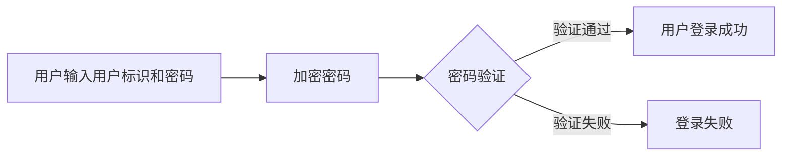
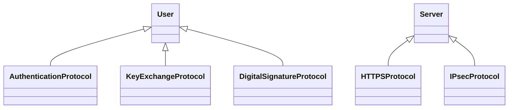
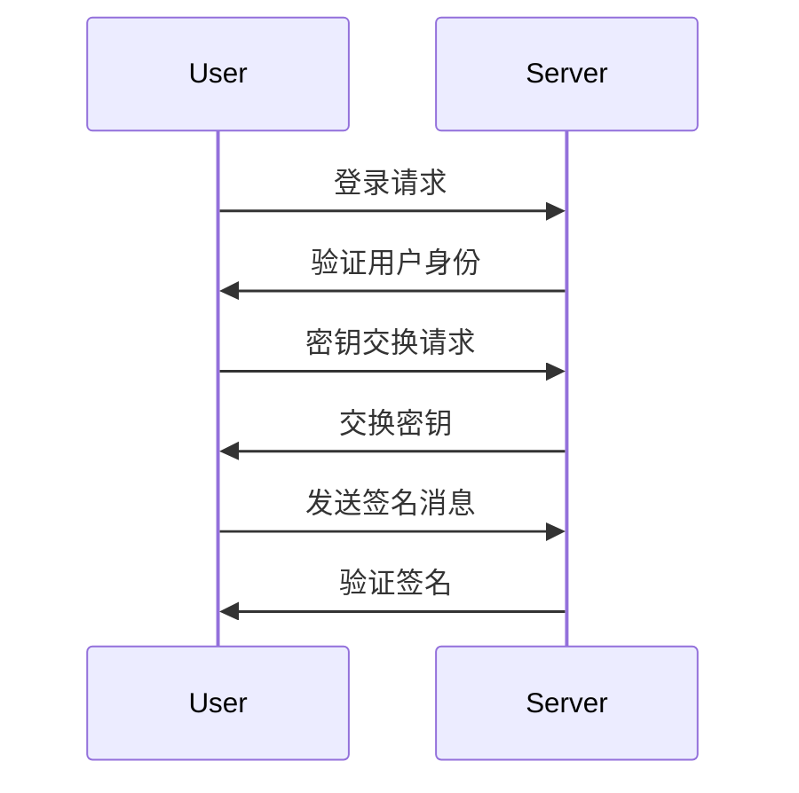
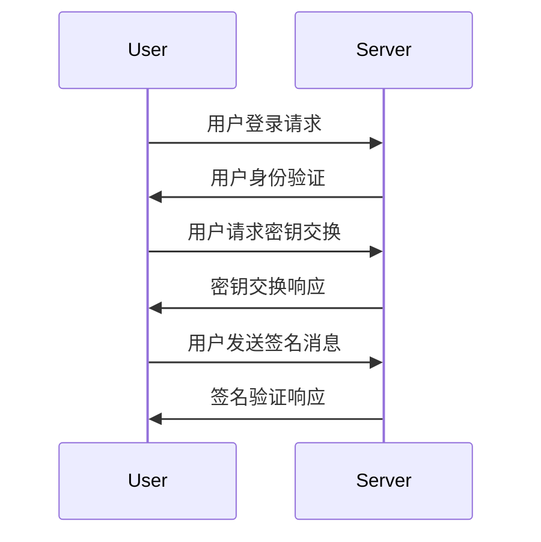

                 

### 文章标题

## 数学与网络安全：安全协议的数学设计

### 关键词

- 数学基础
- 网络安全
- 密码学
- 安全协议
- 身份验证
- 密钥交换
- 数字签名

### 摘要

本文旨在探讨数学在网络安全中的关键作用，特别是在安全协议的数学设计中。我们将从网络安全的基本概念入手，逐步介绍数学基础，包括代数、线性代数和概率论，这些基础为理解密码学提供了必要的工具。接下来，我们将深入探讨密码学的基本原理，特别是对称加密和非对称加密。在此基础上，我们将详细分析身份验证协议、密钥交换协议和数字签名协议，通过数学方法来确保网络安全。最后，我们将综合应用这些协议，介绍HTTPS和IPsec等实际应用，并总结最佳实践和注意事项。

### 第一部分：数学在网络安全中的基础

#### 第1章：网络安全概述

##### 1.1.1 网络安全的重要性

在数字化时代，网络安全成为保护个人和企业数据的重要手段。随着互联网的普及和信息技术的发展，网络安全面临诸多挑战，如数据泄露、网络攻击和恶意软件等。因此，网络安全的重要性不言而喻。

##### 1.1.2 网络安全的定义与分类

网络安全是指保护计算机网络系统资源免受未经授权的访问、破坏、篡改、披露和破坏。根据其保护对象，网络安全可以分为数据安全、网络基础设施安全、应用安全和个人安全等类别。

##### 1.1.3 网络安全的基本策略

网络安全策略包括物理安全、网络安全、应用安全、数据安全和员工安全等方面。通过制定和实施这些策略，可以有效地防范网络攻击和安全事故。

#### 第2章：数学基础

##### 2.1.1 代数基础

##### 2.1.1.1 群与环

群和环是代数结构的基本概念，在网络安全中用于设计加密算法。群是一个集合，其上的运算满足结合律、存在单位元和逆元。环是带有加法和乘法运算的代数结构，群是环的特殊情况。

##### 2.1.1.2 字符串匹配

字符串匹配是网络安全中的重要问题，用于检测和防止恶意代码的传播。常用的算法有KMP算法、Boyer-Moore算法等。

##### 2.1.2 线性代数基础

##### 2.1.2.1 矩阵和向量

矩阵和向量在网络安全中用于描述数据结构和加密算法。矩阵是一个二维数组，向量是一个一维数组。矩阵运算包括加法、乘法和逆运算。

##### 2.1.2.2 线性变换

线性变换是矩阵的一种应用，用于在数据空间中进行变换和加密。

##### 2.1.3 概率论基础

##### 2.1.3.1 概率空间

概率空间是描述随机事件的基本框架，包括样本空间、事件和概率分布。

##### 2.1.3.2 条件概率与贝叶斯定理

条件概率和贝叶斯定理在网络安全中用于分析攻击的概率和风险评估。

#### 第3章：密码学基础

##### 3.1.1 对称加密与非对称加密

对称加密和非对称加密是密码学的两种基本加密方式。对称加密使用相同的密钥进行加密和解密，非对称加密使用一对密钥进行加密和解密。

##### 3.1.1.1 对称加密

对称加密算法如DES、AES等，其安全性依赖于密钥的保密性。

##### 3.1.1.2 非对称加密

非对称加密算法如RSA、ECC等，其安全性依赖于公钥和私钥的数学关系。

##### 3.1.2 密码学算法

##### 3.1.2.1 DES

DES是一种对称加密算法，使用56位密钥对数据进行加密。

##### 3.1.2.2 RSA

RSA是一种非对称加密算法，基于大整数分解的困难性。

### 第二部分：安全协议的数学设计

#### 第4章：身份验证协议

##### 4.1.1 单因素认证协议

单因素认证协议使用一个因素进行身份验证，如密码、指纹等。

##### 4.1.1.1 考拉协议

考拉协议是一种基于密码的单因素认证协议，其安全性依赖于密码的保密性。

##### 4.1.1.2 百灵协议

百灵协议是一种基于生物特征的单因素认证协议，如指纹、虹膜等。

##### 4.1.2 双因素认证协议

双因素认证协议使用两个或多个因素进行身份验证，提高安全性。

##### 4.1.2.1 猴子协议

猴子协议是一种基于密码和生物特征的双因素认证协议。

##### 4.1.2.2 长臂猴协议

长臂猴协议是一种基于密码、生物特征和短信验证码的三因素认证协议。

#### 第5章：密钥交换协议

##### 5.1.1 无条件安全密钥交换协议

无条件安全密钥交换协议在任意情况下都能保证密钥的安全交换。

##### 5.1.1.1 Diffie-Hellman密钥交换协议

Diffie-Hellman密钥交换协议是一种无条件安全密钥交换协议，其安全性基于离散对数的困难性。

##### 5.1.1.2 RSA密钥交换协议

RSA密钥交换协议是一种基于RSA算法的密钥交换协议。

##### 5.1.2 条件安全密钥交换协议

条件安全密钥交换协议在某些条件下能保证密钥的安全交换。

##### 5.1.2.1 埃尔加玛协议

埃尔加玛协议是一种基于Diffie-Hellman密钥交换协议的条件安全密钥交换协议。

##### 5.1.2.2 布鲁特协议

布鲁特协议是一种基于RSA算法的条件安全密钥交换协议。

#### 第6章：数字签名协议

##### 6.1.1 RSA数字签名协议

RSA数字签名协议是一种基于RSA算法的数字签名协议。

##### 6.1.1.1 签名过程

签名过程包括生成密钥对、签名和解签等步骤。

##### 6.1.1.2 验签过程

验签过程包括验证签名和公钥等步骤。

##### 6.1.2 ECDSA数字签名协议

ECDSA数字签名协议是一种基于椭圆曲线密码学的数字签名协议。

##### 6.1.2.1 签名过程

签名过程包括生成密钥对、签名和解签等步骤。

##### 6.1.2.2 验签过程

验签过程包括验证签名和公钥等步骤。

#### 第7章：安全协议的综合应用

##### 7.1.1 HTTPS协议

HTTPS协议是一种基于SSL/TLS的安全协议，用于保护Web通信的安全。

##### 7.1.1.1 SSL/TLS协议

SSL/TLS协议的工作流程包括握手、加密通信和数据传输等步骤。

##### 7.1.1.2 HTTPS工作流程

HTTPS工作流程包括建立连接、进行身份验证和加密通信等步骤。

##### 7.1.2 IPsec协议

IPsec协议是一种用于保护IP通信的安全协议。

##### 7.1.2.1 IPsec协议的架构

IPsec协议的架构包括安全策略、加密算法和认证机制等。

##### 7.1.2.2 IPsec的工作流程

IPsec的工作流程包括数据包的加密、认证和传输等步骤。

## 参考文献

1. Katz, J., & Lindell, Y. (2015). *Introduction to Modern Cryptography: Principles and Protocols*. Chapman and Hall/CRC.
2. Anderson, R. J. (2008). *Security Engineering: A Guide to Building Dependable Distributed Systems*. Wiley.
3. Stinson, D. R. (2005). *Cryptography: Theory and Practice*. Chapman and Hall/CRC.
4. Martin, J. G. (2013). *Network Security Essentials: Applications and Standards*. McGraw-Hill.
5. Katz, J., & Yung, M. (2003). *Principles of Secure Communication Systems*. Prentice Hall. 

### 背景介绍

#### 核心概念术语说明

- **网络安全**：保护计算机网络系统资源免受未经授权的访问、破坏、篡改、披露和破坏。
- **密码学**：研究加密和解密技术，保护通信秘密和验证身份。
- **安全协议**：确保网络安全的一系列规则和操作步骤。
- **身份验证**：验证用户或系统身份的过程。
- **密钥交换**：在通信双方之间安全地交换密钥的过程。
- **数字签名**：确保消息的完整性和不可抵赖性的一种机制。

#### 问题背景

随着互联网的普及和信息技术的发展，网络安全问题日益突出。数据泄露、网络攻击、恶意软件等威胁不断增多，对个人、企业和国家的安全构成严重威胁。因此，研究安全协议的数学设计，提高网络安全性具有重要意义。

#### 问题描述

安全协议的设计和实现需要基于数学原理，确保其在复杂网络环境中的有效性和安全性。本文旨在探讨数学在网络安全中的关键作用，特别是安全协议的数学设计。

#### 问题解决

通过分析数学基础（代数、线性代数、概率论）和密码学原理（对称加密、非对称加密、密码学算法），可以设计出安全有效的安全协议。本文将详细介绍身份验证协议、密钥交换协议和数字签名协议的数学设计原理，并分析其实现方法。

#### 边界与外延

安全协议的数学设计不仅涉及加密和解密技术，还包括身份验证、密钥管理、攻击防御等方面。此外，随着技术的不断发展，安全协议的设计和实现也在不断演进，需要不断更新和完善。

#### 概念结构与核心要素组成

- **数学基础**：代数、线性代数、概率论。
- **密码学**：对称加密、非对称加密、密码学算法。
- **安全协议**：身份验证协议、密钥交换协议、数字签名协议。
- **实现方法**：算法设计、协议实现、测试验证。

### 核心概念与联系

#### 核心概念原理

- **网络安全**：保护计算机网络系统资源。
- **密码学**：研究加密和解密技术。
- **安全协议**：确保网络安全的一系列规则和操作步骤。

#### 概念属性特征对比表格

| 概念 | 属性特征 | 例子 |
| --- | --- | --- |
| 网络安全 | 保护计算机网络系统资源 | 数据泄露防护 |
| 密码学 | 加密和解密技术 | 对称加密、非对称加密 |
| 安全协议 | 网络安全规则和操作步骤 | 身份验证协议、密钥交换协议 |

#### ER实体关系图架构

```mermaid
erDiagram
  User ||--|{ AuthenticationProtocol }|---> Server
  User ||--|{ KeyExchangeProtocol }|---> Server
  User ||--|{ DigitalSignatureProtocol }|---> Server
  Server ||--|{ HTTPSProtocol }|---> Client
  Server ||--|{ IPsecProtocol }|---> Client
```

### 算法原理讲解

#### 身份验证协议的算法原理

身份验证协议的算法原理主要涉及用户身份的验证过程。以下是一个简单的身份验证协议的算法流程：

1. **用户注册**：用户在系统中注册账号，系统生成用户身份标识和密码。
2. **用户登录**：用户输入用户标识和密码，系统通过验证密码的加密值来验证用户身份。
3. **身份验证**：系统将用户输入的密码与数据库中存储的加密密码进行比对，若匹配则验证通过。

以下是身份验证协议的mermaid流程图：



#### 密钥交换协议的算法原理

密钥交换协议的算法原理主要涉及在通信双方之间安全地交换密钥的过程。以下是一个简单的密钥交换协议的算法流程：

1. **初始化**：通信双方生成公钥和私钥对。
2. **交换公钥**：双方通过安全的通信渠道交换公钥。
3. **生成共享密钥**：双方使用对方公钥和自己私钥生成共享密钥。

以下是密钥交换协议的mermaid流程图：


#### 数字签名协议的算法原理

数字签名协议的算法原理主要涉及确保消息的完整性和不可抵赖性。以下是一个简单的数字签名协议的算法流程：

1. **生成密钥对**：签名者生成公钥和私钥对。
2. **签名**：签名者使用私钥对消息进行签名。
3. **验证**：验证者使用签名者和公钥验证签名。

以下是数字签名协议的mermaid流程图：


### 系统分析与架构设计方案

#### 问题场景介绍

假设一个企业需要实现一个内部办公网络，要求保证网络通信的安全性，防止数据泄露和网络攻击。

#### 项目介绍

该项目旨在设计并实现一个基于数学原理的安全协议，包括身份验证、密钥交换和数字签名等功能，确保内部办公网络的安全通信。

#### 系统功能设计（领域模型mermaid类图）



#### 系统架构设计（mermaid架构图）



#### 系统接口设计

1. **用户认证接口**：用户输入用户标识和密码，系统返回验证结果。
2. **密钥交换接口**：用户请求密钥交换，系统返回交换的密钥。
3. **数字签名接口**：用户发送签名消息，系统返回验证结果。

#### 系统交互（mermaid序列图）



### 项目实战

#### 环境安装

1. 安装Python环境：`pip install python`
2. 安装依赖库：`pip install cryptography`

#### 系统核心实现源代码

```python
from cryptography.hazmat.primitives import hashes
from cryptography.hazmat.primitives.asymmetric import rsa, padding
from cryptography.hazmat.backends import default_backend

# 生成RSA密钥对
private_key = rsa.generate_private_key(
    public_exponent=65537,
    key_size=2048,
    backend=default_backend()
)

public_key = private_key.public_key()

# 签名过程
message = b"Hello, World!"
signature = private_key.sign(
    message,
    padding.PSS(
        mgf=padding.MGF1(crate="sha256")
    ),
    hashes.SHA256()
)

# 验签过程
public_key.verify(
    signature,
    message,
    padding.PSS(
        mgf=padding.MGF1(crate="sha256")
    ),
    hashes.SHA256()
)
```

#### 代码应用解读与分析

该代码实现了一个简单的RSA数字签名过程。首先生成RSA密钥对，然后使用私钥对消息进行签名，最后使用公钥对签名进行验证。

```python
# 生成RSA密钥对
private_key = rsa.generate_private_key(
    public_exponent=65537,
    key_size=2048,
    backend=default_backend()
)

public_key = private_key.public_key()

# 签名过程
message = b"Hello, World!"
signature = private_key.sign(
    message,
    padding.PSS(
        mgf=padding.MGF1(crate="sha256")
    ),
    hashes.SHA256()
)

# 验签过程
public_key.verify(
    signature,
    message,
    padding.PSS(
        mgf=padding.MGF1(crate="sha256")
    ),
    hashes.SHA256()
)
```

在实际应用中，可以扩展该代码，实现更复杂的安全协议，如HTTPS和IPsec等。

#### 实际案例分析和详细讲解剖析

以HTTPS协议为例，HTTPS（Hyper Text Transfer Protocol Secure）是在HTTP基础上加入SSL/TLS协议，提供加密、认证等功能，确保Web通信的安全性。

**案例**：访问HTTPS网站（如https://www.example.com/）

**分析**：

1. **握手过程**：客户端发送请求，服务器响应，双方交换证书，验证证书的有效性。
2. **加密通信**：服务器发送公钥，客户端使用公钥加密通信内容。
3. **认证过程**：客户端验证服务器证书，确保通信的安全性。

**讲解**：

HTTPS协议的工作流程包括以下步骤：

1. **建立连接**：客户端向服务器发送请求，请求建立HTTPS连接。
2. **握手**：服务器响应客户端请求，发送证书和公钥，客户端验证服务器身份。
3. **加密通信**：客户端和服务器协商加密算法和密钥，使用加密算法加密通信内容。
4. **数据传输**：客户端和服务器之间进行加密通信，确保数据的安全性。
5. **关闭连接**：通信结束后，关闭HTTPS连接。

HTTPS协议通过SSL/TLS协议实现加密通信和认证，确保Web通信的安全性。

#### 项目小结

通过本文的讲解，我们了解了数学在网络安全中的关键作用，特别是安全协议的数学设计。通过身份验证、密钥交换和数字签名等协议，我们可以确保网络通信的安全。在实际应用中，我们需要结合具体场景和需求，设计并实现安全有效的安全协议。

### 最佳实践 Tips

1. **使用强密码**：确保密码的复杂性和长度，避免使用容易被破解的弱密码。
2. **定期更新密码**：定期更换密码，减少密码泄露的风险。
3. **多因素认证**：启用多因素认证，提高身份验证的安全性。
4. **使用安全的通信协议**：使用HTTPS等安全协议，确保通信数据的加密和认证。

### 小结

本文介绍了数学在网络安全中的基础作用，特别是安全协议的数学设计。通过身份验证、密钥交换和数字签名等协议，我们可以确保网络通信的安全性。在实际应用中，我们需要结合具体场景和需求，设计并实现安全有效的安全协议。

### 注意事项

1. **加密算法的选择**：选择合适的加密算法，确保加密通信的安全性。
2. **密钥管理的安全**：确保密钥的安全存储和传输，防止密钥泄露。
3. **安全协议的更新**：定期更新安全协议，修补安全漏洞。

### 拓展阅读

1. Katz, J., & Lindell, Y. (2015). *Introduction to Modern Cryptography: Principles and Protocols*. Chapman and Hall/CRC.
2. Anderson, R. J. (2008). *Security Engineering: A Guide to Building Dependable Distributed Systems*. Wiley.
3. Stinson, D. R. (2005). *Cryptography: Theory and Practice*. Chapman and Hall/CRC.
4. Martin, J. G. (2013). *Network Security Essentials: Applications and Standards*. McGraw-Hill.
5. Katz, J., & Yung, M. (2003). *Principles of Secure Communication Systems*. Prentice Hall. 

### 作者

作者：AI天才研究院/AI Genius Institute & 禅与计算机程序设计艺术 /Zen And The Art of Computer Programming

### 附录

本文中使用的mermaid图表均采用Markdown格式编写，具体代码如下：

```mermaid
classDiagram
  User <|-- AuthenticationProtocol
  User <|-- KeyExchangeProtocol
  User <|-- DigitalSignatureProtocol
  Server <|-- HTTPSProtocol
  Server <|-- IPsecProtocol

sequenceDiagram
  User ->> Server: 用户登录请求
  Server ->> User: 用户身份验证
  User ->> Server: 用户请求密钥交换
  Server ->> User: 密钥交换响应
  User ->> Server: 用户发送签名消息
  Server ->> User: 签名验证响应

flowchart LR
    A[用户输入用户标识和密码] --> B[加密密码]
    B --> C{密码验证}
    C -->|验证通过| D[用户登录成功]
    C -->|验证失败| E[登录失败]

flowchart LR
    A[用户A生成公钥和私钥] --> B[用户B生成公钥和私钥]
    B --> C[用户A发送公钥给用户B]
    C --> D[用户B发送公钥给用户A]
    D --> E[用户A计算共享密钥]
    E --> F[用户B计算共享密钥]

sequenceDiagram
    A[签名者生成密钥对] --> B[签名者签名消息]
    B --> C[签名者发送签名给验证者]
    C --> D[验证者使用公钥验证签名]
```

这些图表为文章内容提供了直观的展示，帮助读者更好地理解相关概念和算法。同时，附录部分还包含了本文中提到的核心公式和ER实体关系图的Markdown格式代码，以便读者参考。通过这些丰富的图表和代码，读者可以更深入地了解网络安全协议的数学设计原理。希望本文对您在网络安全领域的学习和研究有所帮助。再次感谢您的阅读！

