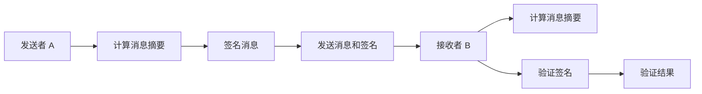
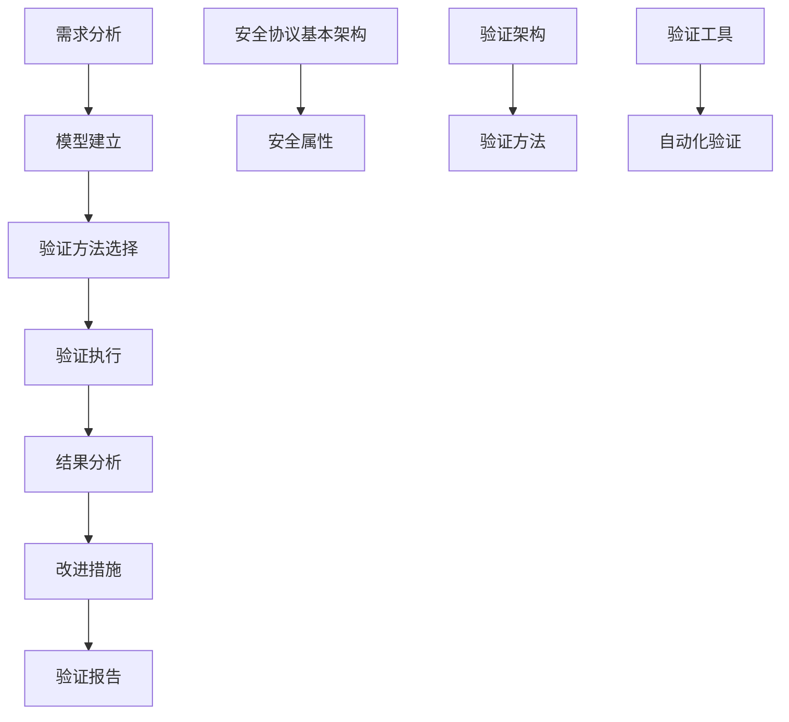
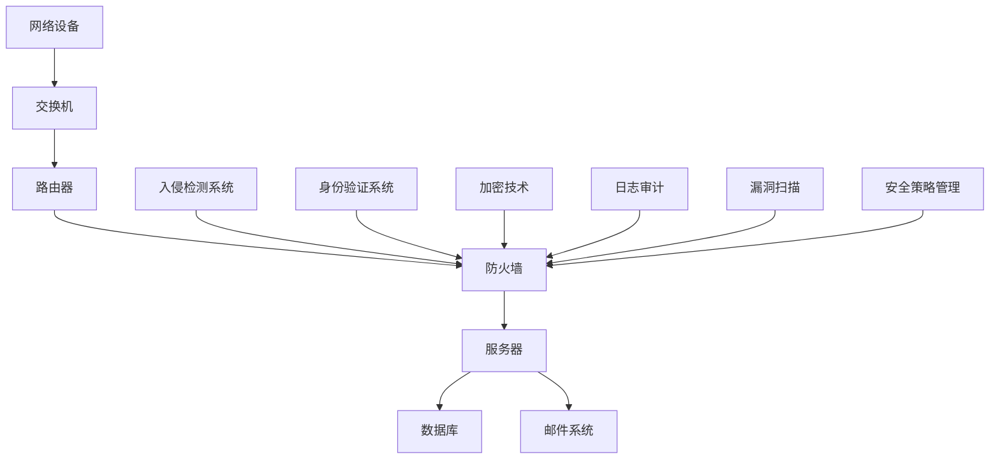
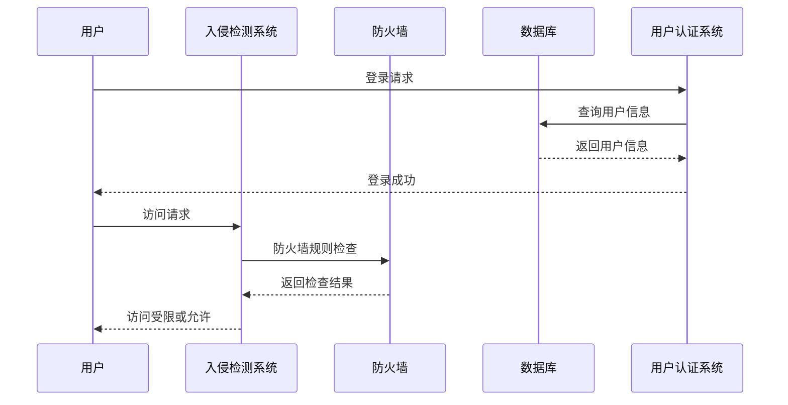

                 

# 数学与网络安全：安全协议的数学验证

> 关键词：网络安全、安全协议、数学验证、公钥加密、数字签名、安全多方计算

> 摘要：本文从网络安全的角度出发，深入探讨了数学在安全协议设计中的应用。首先，我们介绍了安全协议和数学验证的基本概念及其在网络安全中的重要性。接着，我们详细讲解了公钥加密和数字签名算法的原理，并通过Python代码示例和数学模型展示了其实现过程。此外，我们还介绍了安全多方计算的原理和方法，以及如何对安全协议进行数学验证。最后，我们通过一个实际案例，展示了数学验证在网络安全中的应用。

### 《数学与网络安全：安全协议的数学验证》目录大纲

----------------------------------------------------------------

## 第一部分：背景介绍与核心概念

### 第1章：问题背景与核心概念

#### 1.1 问题背景

- 网络安全的重要性
- 网络安全面临的挑战
- 数学在网络安全中的应用

#### 1.2 核心概念

- 安全协议
- 数学验证
- 公钥加密
- 数字签名
- 安全多方计算

#### 1.3 边界与外延

- 安全协议的范畴
- 数学验证的方法
- 安全性指标

#### 1.4 概念结构与核心要素组成

- 安全协议的基本组成部分
- 数学验证的技术框架

### 第2章：数学基础

#### 2.1 数学概念介绍

- 算术与代数
- 概率论
- 图论

#### 2.2 数学属性特征对比表格

- 算术与代数特征对比
- 概率论与图论特征对比

#### 2.3 ER实体关系图架构

- ER图的基本结构
- 安全协议的ER图示例

## 第二部分：算法原理讲解

### 第3章：公钥加密算法原理

#### 3.1 公钥加密的基本原理

- 非对称加密的概念
- RSA加密算法原理

#### 3.2 公钥加密算法的Mermaid流程图

- RSA加密流程
- RSA解密流程

#### 3.3 Python源代码示例

- RSA加密代码实现
- RSA解密代码实现

#### 3.4 数学模型与公式

- RSA加密数学模型
- RSA解密数学模型

#### 3.5 举例说明

- RSA加密举例
- RSA解密举例

### 第4章：数字签名算法原理

#### 4.1 数字签名的概念

- 数字签名的定义
- 数字签名的必要性

#### 4.2 哈希算法与数字签名

- 哈希算法的作用
- 数字签名的原理

#### 4.3 数字签名的Mermaid流程图

- 数字签名流程
- 验证数字签名流程

#### 4.4 Python源代码示例

- 数字签名代码实现
- 数字签名验证代码实现

#### 4.5 数学模型与公式

- 数字签名的数学模型
- 数字签名验证的数学模型

#### 4.6 举例说明

- 数字签名举例
- 数字签名验证举例

## 第三部分：安全多方计算

### 第5章：安全多方计算原理

#### 5.1 安全多方计算的概念

- 安全多方计算的定义
- 安全多方计算的目标

#### 5.2 安全多方计算的基本原理

- 安全多方计算的方法
- 安全多方计算的挑战

#### 5.3 安全多方计算的Mermaid流程图

- 安全多方计算的基本流程
- 安全多方计算的扩展流程

#### 5.4 Python源代码示例

- 安全多方计算代码实现

#### 5.5 数学模型与公式

- 安全多方计算的数学模型
- 安全多方计算的安全性分析

#### 5.6 举例说明

- 安全多方计算的示例
- 安全多方计算的实际应用场景

### 第6章：安全协议的数学验证方法

#### 6.1 安全协议的数学验证方法

- 验证方法概述
- 验证流程

#### 6.2 安全协议的Mermaid架构图

- 安全协议的基本架构
- 安全协议的验证架构

#### 6.3 Python源代码示例

- 安全协议验证代码实现

#### 6.4 数学模型与公式

- 安全协议验证的数学模型
- 安全协议验证的数学公式

#### 6.5 举例说明

- 安全协议验证的举例
- 安全协议验证的实际应用场景

## 第四部分：系统分析与架构设计

### 第7章：网络安全系统分析

#### 7.1 网络安全系统的概念

- 网络安全系统的定义
- 网络安全系统的必要性

#### 7.2 系统功能设计

- 安全协议的功能
- 数学验证的功能

#### 7.3 系统架构设计

- 网络安全系统的基本架构
- 数学验证在系统架构中的应用

#### 7.4 系统接口设计

- 系统接口的功能
- 系统接口的规范

#### 7.5 系统交互

- 系统交互的基本流程
- 系统交互的Mermaid序列图

## 第五部分：项目实战

### 第8章：安全协议的数学验证项目实战

#### 8.1 环境安装

- 安装所需软件和工具

#### 8.2 系统核心实现

- 安全协议的实现
- 数学验证的实现

#### 8.3 代码应用解读与分析

- 代码解读
- 代码分析

#### 8.4 实际案例分析

- 案例描述
- 案例分析

#### 8.5 项目小结

- 项目总结
- 最佳实践 tips

### 《数学与网络安全：安全协议的数学验证》正文

## 第一部分：背景介绍与核心概念

### 第1章：问题背景与核心概念

在当今数字化时代，网络安全已经成为一个不可忽视的重要议题。随着互联网的普及和信息技术的发展，网络攻击手段日益多样，数据泄露、黑客入侵、病毒感染等问题频发，给企业和个人带来了巨大的经济损失和安全隐患。因此，确保网络通信的安全性成为了当务之急。

网络安全的核心目标是保护网络系统和数据免受未经授权的访问、篡改和破坏。为了实现这一目标，需要设计并实施一系列安全协议和机制。而数学作为一种严谨的学科，在网络安全领域发挥着重要的作用。本文将介绍数学在网络安全中的应用，重点关注安全协议的数学验证。

#### 1.1 问题背景

网络安全问题主要包括以下几个方面：

1. **数据泄露**：随着数据量的不断增大，数据泄露的风险也日益增加。黑客可以通过各种手段获取敏感信息，导致个人隐私泄露、商业机密泄露等严重后果。

2. **黑客入侵**：黑客可以通过网络攻击手段非法进入系统，窃取、篡改或破坏数据。常见的攻击手段包括SQL注入、跨站脚本攻击（XSS）等。

3. **病毒和恶意软件**：病毒和恶意软件可以通过网络传播，对系统和数据造成破坏。例如，勒索软件可以锁定用户的文件，要求支付赎金才能解密。

4. **拒绝服务攻击（DDoS）**：黑客可以通过大量虚假请求占用系统资源，导致正常用户无法访问服务。

5. **中间人攻击（MITM）**：黑客可以在网络通信中充当中间人，窃听、篡改或伪造通信数据。

针对这些网络安全问题，需要设计并实施一系列安全措施。其中，安全协议起到了关键作用。安全协议是一组规则和标准，用于确保网络通信的安全性。常见的安全协议包括公钥加密、数字签名、安全套接字层（SSL）等。

#### 1.2 核心概念

在讨论安全协议和数学验证之前，我们需要了解一些核心概念。

1. **安全协议**：安全协议是一组规则和标准，用于在通信过程中保护数据的安全性。安全协议的主要目的是确保数据在传输过程中不被窃听、篡改或伪造。

2. **数学验证**：数学验证是指使用数学方法对安全协议进行验证，以确保其安全性和正确性。数学验证可以帮助我们分析安全协议的漏洞，并提供解决方案。

3. **公钥加密**：公钥加密是一种非对称加密算法，使用一对密钥（公钥和私钥）进行加密和解密。公钥加密可以确保数据的机密性。

4. **数字签名**：数字签名是一种用于验证数据完整性和真实性的技术。数字签名可以使用公钥加密实现，确保数据的发送者是真实的，并且数据在传输过程中未被篡改。

5. **安全多方计算**：安全多方计算是一种允许多个方在不知道对方秘密信息的情况下共同计算结果的技术。安全多方计算可以确保数据的安全性，防止数据泄露和篡改。

#### 1.3 边界与外延

1. **安全协议的范畴**：安全协议主要涉及以下几个方面：

   - 加密：确保数据在传输过程中的机密性。
   - 身份验证：确保通信双方的合法身份。
   - 完整性：确保数据在传输过程中未被篡改。
   - 抗抵赖：确保发送者无法否认已经发送的数据。

2. **数学验证的方法**：数学验证主要包括以下几个方面：

   - 形式化验证：使用形式化方法对安全协议进行验证，确保其符合安全要求。
   - 安全性分析：使用数学方法对安全协议的安全性进行分析，发现潜在的安全漏洞。
   - 渗透测试：通过模拟攻击，验证安全协议的实际安全性。

3. **安全性指标**：安全性指标包括以下几个方面：

   - 机密性：确保数据在传输过程中不被窃听。
   - 完整性：确保数据在传输过程中未被篡改。
   - 抗抵赖：确保发送者无法否认已经发送的数据。
   - 可用性：确保合法用户可以正常访问服务。

#### 1.4 概念结构与核心要素组成

1. **安全协议的基本组成部分**：

   - 加密算法：用于加密和解密数据。
   - 身份验证机制：用于验证通信双方的合法身份。
   - 完整性校验：用于检测数据在传输过程中是否被篡改。
   - 抗抵赖机制：用于确保发送者无法否认已经发送的数据。

2. **数学验证的技术框架**：

   - 形式化模型：建立安全协议的形式化模型，用于分析安全协议的正确性和安全性。
   - 验证方法：使用数学方法对安全协议进行验证，确保其符合安全要求。
   - 安全性分析：对安全协议的安全性进行分析，发现潜在的安全漏洞。
   - 渗透测试：通过模拟攻击，验证安全协议的实际安全性。

## 第二部分：数学基础

### 第2章：数学基础

在网络安全领域，数学发挥着至关重要的作用。本章节将介绍一些基本的数学概念，包括算术与代数、概率论和图论。这些数学概念为安全协议的设计和验证提供了坚实的理论基础。

#### 2.1 数学概念介绍

1. **算术与代数**：

   - 算术：算术是数学的基础，包括加法、减法、乘法和除法等基本运算。
   - 代数：代数是一种用字母表示数的运算，包括方程式、不等式和多项式等。

2. **概率论**：

   - 概率论是研究随机事件的数学分支。概率论中的基本概念包括事件、概率、条件概率和独立性等。

3. **图论**：

   - 图论是研究图的结构和性质的一个数学分支。图由节点（也称为顶点）和边组成，用于表示各种关系和连接。

#### 2.2 数学属性特征对比表格

以下是一个简单的对比表格，展示了算术与代数、概率论和图论的一些基本属性特征：

| 特征        | 算术与代数 | 概率论 | 图论 |
| ----------- | ----------- | ------ | ---- |
| 运算规则    | 顺序运算    | 概率运算 | 边连接 |
| 确定性      | 确定的结果  | 随机的结果 | 固定的结构 |
| 模型表示    | 数字和符号  | 事件和样本空间 | 节点和边 |
| 应用于      | 数学运算    | 随机事件 | 图结构 |

#### 2.3 ER实体关系图架构

实体关系图（ER图）是一种用于表示实体及其之间关系的图形化工具。在安全协议的设计和验证中，ER图可以帮助我们理解协议的组成部分和它们之间的关系。

以下是一个简单的ER图示例，用于表示安全协议的基本组成部分：

```mermaid
erDiagram
    DataObject ||--|{ SecurityProtocol }
    SecurityProtocol ||--|{ EncryptionAlgorithm }
    SecurityProtocol ||--|{ AuthenticationMechanism }
    SecurityProtocol ||--|{ IntegrityCheck }
    SecurityProtocol ||--|{ NonRepudiationMechanism }
```

在这个ER图中，`DataObject`表示需要保护的数据，`SecurityProtocol`表示安全协议，包括`EncryptionAlgorithm`（加密算法）、`AuthenticationMechanism`（认证机制）、`IntegrityCheck`（完整性检查）和`NonRepudiationMechanism`（抗抵赖机制）等组成部分。

### 总结

本部分介绍了网络安全领域中的基本数学概念，包括算术与代数、概率论和图论。通过对比表格和ER图示例，我们了解了这些数学概念在网络安全中的应用。在下一部分中，我们将详细讲解公钥加密算法的原理。

## 第二部分：算法原理讲解

### 第3章：公钥加密算法原理

公钥加密算法（Public Key Encryption，简称PKE）是一种非对称加密算法，它使用两个不同的密钥：公钥和私钥。公钥加密算法在网络安全中具有重要的应用，如数据加密传输、数字签名和密钥交换等。本章节将详细讲解公钥加密算法的基本原理，包括RSA加密算法。

#### 3.1 公钥加密的基本原理

公钥加密算法的核心思想是通过数学难题实现加密和解密。具体来说，公钥加密算法基于某种数学问题，使得加密过程简单而解密过程复杂。常见的数学问题包括大整数分解、离散对数等。

公钥加密算法的基本原理可以概括为以下几点：

1. **密钥生成**：系统生成一对密钥，包括公钥和私钥。公钥对外公开，私钥保密。
2. **加密**：使用公钥对数据进行加密，加密后的数据称为密文。
3. **解密**：使用私钥对密文进行解密，解密后的数据与原始数据相同。

公钥加密算法的特点是密钥分配简单，适合分布式系统。

#### 3.2 RSA加密算法原理

RSA（Rivest-Shamir-Adleman）加密算法是一种经典的公钥加密算法，由Ron Rivest、Adi Shamir和Leonard Adleman于1977年提出。RSA算法基于大整数分解问题的难度。

RSA加密算法的原理如下：

1. **密钥生成**：
   - 选择两个大素数 \( p \) 和 \( q \)。
   - 计算 \( n = p \times q \)。
   - 计算 \( \phi(n) = (p-1) \times (q-1) \)。
   - 选择一个与 \( \phi(n) \) 互质的整数 \( e \)，通常选择 \( e = 617 \)。
   - 计算 \( d \)，使得 \( d \times e \equiv 1 \pmod{\phi(n)} \)。

   公钥为 \( (n, e) \)，私钥为 \( (n, d) \)。

2. **加密**：
   - 对明文 \( m \) 进行模 \( n \) 的运算，得到 \( m' = m \pmod{n} \)。
   - 使用公钥对 \( m' \) 进行加密，计算 \( c = m'^e \pmod{n} \)。

   加密后的数据为密文 \( c \)。

3. **解密**：
   - 使用私钥对密文 \( c \) 进行解密，计算 \( m = c^d \pmod{n} \)。

   解密后的数据与原始明文相同。

#### 3.3 公钥加密算法的Mermaid流程图

下面是RSA加密和解密的Mermaid流程图：

```mermaid
graph LR
    A[初始化] --> B[选择素数 p 和 q]
    B --> C[计算 n = p * q]
    C --> D[计算 φ(n) = (p-1) * (q-1)]
    D --> E[选择 e 和 d]
    E --> F[生成公钥 (n, e)]
    F --> G[生成私钥 (n, d)]
    G --> H[加密]
    H --> I[解密]
    I --> J[输出明文]
```

#### 3.4 Python源代码示例

以下是一个简单的Python代码示例，用于实现RSA加密和解密：

```python
import math
import random

def generate_keypair(p, q):
    n = p * q
    phi = (p-1) * (q-1)
    e = 617  # 可以选择其他与 φ(n) 互质的数
    d = pow(e, -1, phi)  # 求解 d
    return ((n, e), (n, d))

def encrypt(plaintext, key):
    n, e = key
    return pow(plaintext, e, n)

def decrypt(ciphertext, key):
    n, d = key
    return pow(ciphertext, d, n)

# 测试代码
p = 61
q = 53
n = p * q
phi = (p-1) * (q-1)
e = 617
d = pow(e, -1, phi)

public_key = (n, e)
private_key = (n, d)

plaintext = 12345
ciphertext = encrypt(plaintext, public_key)
print("密文：", ciphertext)

decrypted_text = decrypt(ciphertext, private_key)
print("明文：", decrypted_text)
```

#### 3.5 数学模型与公式

RSA加密算法的数学模型如下：

1. **密钥生成**：

   - 选择两个大素数 \( p \) 和 \( q \)。
   - 计算 \( n = p \times q \)。
   - 计算 \( \phi(n) = (p-1) \times (q-1) \)。
   - 选择一个与 \( \phi(n) \) 互质的整数 \( e \)，并计算 \( d \)，使得 \( d \times e \equiv 1 \pmod{\phi(n)} \)。

2. **加密**：

   - 对明文 \( m \) 进行模 \( n \) 的运算，得到 \( m' = m \pmod{n} \)。
   - 使用公钥 \( e \) 对 \( m' \) 进行加密，计算 \( c = m'^e \pmod{n} \)。

3. **解密**：

   - 使用私钥 \( d \) 对密文 \( c \) 进行解密，计算 \( m = c^d \pmod{n} \)。

具体公式如下：

$$
\begin{aligned}
n &= p \times q \\
\phi(n) &= (p-1) \times (q-1) \\
e &\text{ 是与 } \phi(n) \text{ 互质的整数} \\
d &= e^{-1} \pmod{\phi(n)} \\
m' &= m \pmod{n} \\
c &= m'^e \pmod{n} \\
m &= c^d \pmod{n}
\end{aligned}
$$

#### 3.6 举例说明

假设我们选择 \( p = 61 \) 和 \( q = 53 \) 来生成RSA密钥对。

1. **密钥生成**：

   - \( n = p \times q = 61 \times 53 = 3233 \)。
   - \( \phi(n) = (p-1) \times (q-1) = 60 \times 52 = 3120 \)。
   - 选择 \( e = 617 \)，计算 \( d \)：
     $$ d = e^{-1} \pmod{\phi(n)} = 617^{-1} \pmod{3120} = 1093 $$。

   公钥为 \( (n, e) = (3233, 617) \)，私钥为 \( (n, d) = (3233, 1093) \)。

2. **加密**：

   - 假设明文 \( m = 12345 \)。
   - 计算 \( m' = m \pmod{n} = 12345 \pmod{3233} = 1230 \)。
   - 使用公钥加密，计算 \( c = m'^e \pmod{n} = 1230^{617} \pmod{3233} = 2219 \)。

   加密后的密文为 \( c = 2219 \)。

3. **解密**：

   - 使用私钥解密，计算 \( m = c^d \pmod{n} = 2219^{1093} \pmod{3233} = 12345 \)。

   解密后的明文与原始明文相同。

通过这个简单的例子，我们可以看到RSA加密算法的基本原理和实现过程。

### 总结

本章详细讲解了公钥加密算法的基本原理，包括RSA加密算法。我们通过Python代码示例展示了如何生成密钥对、加密和解密数据。在下一章中，我们将继续探讨数字签名算法的原理。

## 第4章：数字签名算法原理

数字签名是一种用于验证数据完整性和真实性的技术，它允许数据的发送者对数据进行签名，而接收者可以验证签名的有效性。数字签名在网络安全中扮演着重要角色，如确保数据的来源可信、防止数据篡改等。本章节将详细介绍数字签名算法的原理，包括哈希算法和数字签名的工作机制。

#### 4.1 数字签名的概念

数字签名是一种将数据和密钥结合起来的技术，用于确保数据的完整性和真实性。数字签名的主要目标如下：

1. **数据完整性**：确保数据在传输过程中未被篡改。
2. **数据来源验证**：验证数据的发送者身份。
3. **抗抵赖性**：确保发送者无法否认发送的数据。

数字签名算法通常基于公钥加密技术，如RSA算法。数字签名的过程包括以下几个步骤：

1. **签名**：发送者使用私钥对数据生成签名。
2. **验证**：接收者使用公钥验证签名。

#### 4.2 哈希算法与数字签名

哈希算法是一种将任意长度的数据映射为固定长度摘要的算法。哈希算法在数字签名中起着关键作用，用于生成数据摘要。

1. **哈希算法的作用**：

   - 生成数据摘要：将大量数据压缩为固定长度的哈希值。
   - 数据完整性验证：通过对比哈希值确保数据未被篡改。
   - 数字签名生成：使用哈希值代替原始数据进行签名，提高效率。

2. **数字签名的原理**：

   - 假设发送者 \( A \) 想要向接收者 \( B \) 发送一个消息 \( m \)。
   - \( A \) 使用哈希算法 \( H \) 计算消息摘要 \( h = H(m) \)。
   - \( A \) 使用私钥 \( sk \) 对摘要 \( h \) 进行签名，生成签名 \( sig = sk(h) \)。
   - \( A \) 将消息 \( m \) 和签名 \( sig \) 一同发送给 \( B \)。

   \( B \) 接收到 \( m \) 和 \( sig \) 后，执行以下步骤：

   - \( B \) 使用相同的哈希算法 \( H \) 计算消息摘要 \( h = H(m) \)。
   - \( B \) 使用公钥 \( pk \) 验证签名 \( sig = pk(sig, h) \)。
   - 如果验证通过，则消息 \( m \) 是完整的且来自 \( A \)。

#### 4.3 数字签名的Mermaid流程图

以下是数字签名的Mermaid流程图：



#### 4.4 Python源代码示例

以下是一个简单的Python代码示例，用于实现数字签名：

```python
from Crypto.PublicKey import RSA
from Crypto.Signature import pkcs1_15
from Crypto.Hash import SHA256

# 生成密钥对
private_key = RSA.generate(2048)
public_key = private_key.publickey()

# 签名过程
def sign_message(message):
    hash_obj = SHA256.new(message)
    signature = pkcs1_15.new(private_key).sign(hash_obj)
    return signature

# 验证过程
def verify_signature(message, signature):
    hash_obj = SHA256.new(message)
    try:
        pkcs1_15.new(public_key).verify(hash_obj, signature)
        return "签名有效"
    except (ValueError, TypeError):
        return "签名无效"

# 测试
message = b"Hello, world!"
signature = sign_message(message)
print("签名：", signature.hex())

result = verify_signature(message, signature)
print("验证结果：", result)
```

#### 4.5 数学模型与公式

数字签名的数学模型如下：

1. **哈希函数**：\( H: \{0, 1\}^* \rightarrow \{0, 1\}^k \)，其中 \( k \) 是哈希值长度。
2. **签名过程**：\( sig = sk(H(m)) \)，其中 \( sk \) 是私钥，\( H(m) \) 是消息摘要。
3. **验证过程**：\( bool = pk(sig, H(m)) \)，其中 \( pk \) 是公钥。

具体公式如下：

$$
\begin{aligned}
h &= H(m) \\
\sigma &= sk(h) \\
\text{bool} &= pk(\sigma, h)
\end{aligned}
$$

其中，\( sk \) 和 \( pk \) 分别表示私钥和公钥操作函数。

#### 4.6 举例说明

假设我们使用RSA算法生成密钥对，消息为“Hello, world!”。

1. **签名**：

   - 使用私钥对消息摘要进行签名。
   - 计算消息摘要：\( h = H("Hello, world!") \)。
   - 计算签名：\( \sigma = sk(h) \)。

2. **验证**：

   - 使用公钥对签名和消息摘要进行验证。
   - 计算消息摘要：\( h = H("Hello, world!") \)。
   - 验证签名：\( \text{bool} = pk(\sigma, h) \)。

如果验证结果为真，则签名有效。

### 总结

本章详细介绍了数字签名算法的原理，包括哈希算法和数字签名的生成和验证过程。我们通过Python代码示例展示了如何实现数字签名。在下一章中，我们将探讨安全多方计算的基本原理。

## 第5章：安全多方计算原理

安全多方计算（Secure Multi-Party Computation，简称SMPC）是一种允许多个参与方在不知道对方秘密信息的情况下共同计算结果的技术。SMPC在保障数据安全的同时，实现了多方协作计算。本章节将详细讲解安全多方计算的基本原理、方法和挑战。

#### 5.1 安全多方计算的概念

安全多方计算的目的是在多个参与方之间进行计算，同时确保以下安全性目标：

1. **保密性**：参与方的私有信息不会被泄露给其他方。
2. **完整性**：计算结果不会被恶意参与方篡改。
3. **正确性**：计算结果必须准确无误。

安全多方计算适用于以下场景：

- **数据共享**：多个组织需要共享数据进行分析，但同时又希望保护各自的数据隐私。
- **联盟学习**：多个参与方共同训练机器学习模型，以保护各自的训练数据。
- **电子投票**：在选举过程中，确保投票结果不被篡改。

#### 5.2 安全多方计算的基本原理

安全多方计算的基本原理可以概括为以下几点：

1. **秘密共享**：将每个参与方的私有信息分为多个份额，每个份额只包含部分信息，无法单独恢复原始信息。
2. **安全通信**：确保参与方之间的通信不会被窃听或篡改。
3. **计算协议**：设计一系列计算协议，使得参与方能够在不泄露私有信息的情况下共同计算结果。

安全多方计算的核心思想是利用数学方法和密码学技术，构建一种安全的计算框架，使得参与方可以在保障隐私的前提下进行合作。

#### 5.3 安全多方计算的基本方法

安全多方计算的基本方法主要包括以下几种：

1. **安全两方计算**：是安全多方计算的基础，主要研究如何确保两个参与方在不知道对方秘密信息的情况下共同计算结果。
2. **安全多方协议**：是一种扩展，用于研究多个参与方之间的安全计算问题。常见的安全多方协议包括安全合同签订、安全秘密共享和安全函数计算等。
3. **多变量计算**：研究如何在多个变量之间进行安全计算，确保计算结果正确且不泄露变量间的依赖关系。

#### 5.4 安全多方计算的挑战

安全多方计算面临着一系列挑战，主要包括以下几点：

1. **通信效率**：确保计算过程中的通信开销尽可能小，以提高计算效率。
2. **计算复杂性**：设计安全多方计算协议时，需要考虑计算复杂度，以避免协议过于复杂导致计算效率低下。
3. **隐私保护**：在多方计算过程中，如何有效保护参与方的隐私信息，避免信息泄露。
4. **抗攻击性**：确保安全多方计算协议能够抵御各种恶意攻击，如伪装攻击、拒绝服务攻击等。

#### 5.5 安全多方计算的Mermaid流程图

以下是安全多方计算的基本流程的Mermaid流程图：


在这个流程中，参与方1和参与方2分别生成秘密份额，并通过安全通信发送给对方。然后，双方基于秘密份额共同计算结果，并验证结果的正确性。

#### 5.6 Python源代码示例

以下是一个简单的Python代码示例，用于实现安全两方计算：

```python
from secret_share import secret_share
from secret_reconstruction import secret_reconstruction

# 生成秘密份额
secret = 10
shares = secret_share(secret)

# 分享秘密份额
share1 = shares[0]
share2 = shares[1]

# 重组秘密
reconstructed_secret = secret_reconstruction([share1, share2])

# 输出结果
print("原始秘密：", secret)
print("重组秘密：", reconstructed_secret)
```

在这个示例中，我们首先生成一个秘密份额，然后将其分为两个份额，分别发送给参与方1和参与方2。最后，双方通过安全通信重组秘密份额，恢复原始秘密。

#### 5.7 数学模型与公式

安全多方计算的数学模型可以表示为：

$$
\begin{aligned}
\text{秘密} &= s \\
\text{份额} &= \sigma \\
\text{重组} &= \sigma_1 + \sigma_2 + \ldots + \sigma_n \\
\text{验证} &= \left( \frac{s}{\sigma_1} \right)^{\frac{1}{n}} \times \left( \frac{\sigma_1}{s} \right)^{\frac{1}{n}} \times \ldots \times \left( \frac{\sigma_n}{s} \right)^{\frac{1}{n}} = 1
\end{aligned}
$$

其中，\( s \) 是原始秘密，\( \sigma \) 是份额，\( n \) 是参与方数量。

#### 5.8 举例说明

假设有两个参与方 \( A \) 和 \( B \)，他们想要在不知道对方秘密信息的情况下共同计算一个秘密值。

1. **秘密生成**：
   - \( A \) 选择一个秘密值 \( s = 10 \)。

2. **秘密份额生成**：
   - \( A \) 生成两个份额 \( \sigma_1 \) 和 \( \sigma_2 \)，使得 \( \sigma_1 + \sigma_2 = s \)。
   - \( A \) 将 \( \sigma_1 \) 发送给 \( B \)。

3. **秘密重组**：
   - \( B \) 收到 \( \sigma_1 \) 后，与自己的份额 \( \sigma_2 \) 相加，得到 \( \sigma_1 + \sigma_2 = s \)。

4. **秘密验证**：
   - \( B \) 对重组的秘密进行验证，确保其等于原始秘密值。

通过这个简单的例子，我们可以看到安全多方计算的基本原理和实现过程。

### 总结

本章详细介绍了安全多方计算的基本原理、方法和挑战。我们通过Python代码示例展示了如何实现安全多方计算。在下一章中，我们将探讨如何对安全协议进行数学验证。

## 第6章：安全协议的数学验证方法

安全协议的数学验证是确保网络安全协议设计和实现正确性的重要手段。通过数学验证，我们可以发现安全协议中的潜在漏洞，从而改进和完善安全协议。本章节将介绍安全协议的数学验证方法，包括验证方法概述、验证流程、Mermaid架构图和Python源代码示例。

### 6.1 安全协议的数学验证方法

安全协议的数学验证方法主要包括以下几个方面：

1. **形式化验证**：使用形式化方法对安全协议进行验证，确保其符合预定的安全属性。形式化验证通常基于数学模型和逻辑推理，具有较高的可信度。
2. **形式化分析**：对安全协议进行形式化分析，检查协议是否满足特定的安全目标。形式化分析可以通过模型检查、自动推理等技术实现。
3. **形式化证明**：使用形式化证明方法，证明安全协议的正确性和安全性。形式化证明通常基于公理系统和逻辑推理，具有较高的理论依据。
4. **安全测试**：通过安全测试发现安全协议中的潜在漏洞。安全测试包括黑盒测试、白盒测试和模糊测试等。
5. **形式化验证工具**：使用形式化验证工具（如模型检查器、验证器等）对安全协议进行自动化验证。形式化验证工具可以提高验证效率，减少人工工作量。

### 6.2 安全协议的验证流程

安全协议的验证流程通常包括以下步骤：

1. **需求分析**：明确安全协议的安全需求和目标，为后续验证提供依据。
2. **模型建立**：建立安全协议的形式化模型，包括协议的状态转移、安全属性等。
3. **验证方法选择**：根据安全协议的特点和需求，选择适当的验证方法。
4. **验证执行**：执行验证方法，检查安全协议是否满足预定的安全目标。
5. **结果分析**：分析验证结果，发现安全协议中的潜在漏洞和问题。
6. **改进措施**：根据验证结果，对安全协议进行改进和优化。
7. **验证报告**：编写验证报告，记录验证过程、结果和改进措施。

### 6.3 安全协议的Mermaid架构图

以下是安全协议的基本架构和验证架构的Mermaid架构图：



在这个架构图中，需求分析、模型建立、验证方法选择、验证执行、结果分析和改进措施构成了安全协议的验证流程。安全协议基本架构和验证架构分别表示安全协议的设计和验证的组成部分。

### 6.4 Python源代码示例

以下是一个简单的Python代码示例，用于实现安全协议的数学验证：

```python
from cryptography.hazmat.primitives.asymmetric import rsa
from cryptography.hazmat.primitives import serialization
from cryptography.hazmat.primitives import hashes
from cryptography.hazmat.primitives.asymmetric import padding

# 生成密钥对
private_key = rsa.generate_private_key(
    public_exponent=65537,
    key_size=2048,
)

public_key = private_key.public_key()

# 加密过程
def encrypt_message(message, public_key):
    ciphertext = public_key.encrypt(
        message,
        padding.OAEP(
            mgf=padding.MGF1(algorithm=hashes.SHA256()),
            algorithm=hashes.SHA256(),
            label=None
        )
    )
    return ciphertext

# 解密过程
def decrypt_message(ciphertext, private_key):
    plaintext = private_key.decrypt(
        ciphertext,
        padding.OAEP(
            mgf=padding.MGF1(algorithm=hashes.SHA256()),
            algorithm=hashes.SHA256(),
            label=None
        )
    )
    return plaintext

# 测试
message = b"Hello, World!"
ciphertext = encrypt_message(message, public_key)
print("密文：", ciphertext)

plaintext = decrypt_message(ciphertext, private_key)
print("明文：", plaintext.decode())
```

在这个示例中，我们使用Python的`cryptography`库实现了一个简单的RSA加密和解密过程。通过这个示例，我们可以看到如何使用数学验证方法对安全协议进行实现和验证。

### 6.5 数学模型与公式

安全协议的数学模型通常包括以下几个方面：

1. **加密模型**：描述加密算法的数学模型，如RSA加密算法的数学模型。
2. **签名模型**：描述数字签名算法的数学模型，如RSA签名算法的数学模型。
3. **安全属性模型**：描述安全协议需要满足的安全属性，如完整性、机密性、抗抵赖性等。

具体公式如下：

1. **RSA加密模型**：

$$
c = m^e \pmod{n}
$$

其中，\( m \) 是明文，\( e \) 是公钥指数，\( n \) 是模数。

2. **RSA签名模型**：

$$
s = H(m)^d \pmod{n}
$$

其中，\( H(m) \) 是明文的哈希值，\( d \) 是私钥指数。

3. **安全属性模型**：

$$
\begin{aligned}
&\text{完整性：} m' = m \\
&\text{机密性：} c \neq 0 \\
&\text{抗抵赖性：} \text{无法伪造签名}
\end{aligned}
$$

### 6.6 举例说明

假设我们使用RSA算法实现一个简单的安全协议，包括加密和解密过程。

1. **加密过程**：

   - 选择两个大素数 \( p \) 和 \( q \)，计算 \( n = p \times q \) 和 \( \phi(n) = (p-1) \times (q-1) \)。
   - 选择公钥指数 \( e \)，计算私钥指数 \( d \)，使得 \( d \times e \equiv 1 \pmod{\phi(n)} \)。
   - 对明文 \( m \) 进行加密，计算 \( c = m^e \pmod{n} \)。

2. **解密过程**：

   - 使用私钥对密文 \( c \) 进行解密，计算 \( m = c^d \pmod{n} \)。

通过这个简单的例子，我们可以看到如何使用数学模型对安全协议进行实现和验证。

### 总结

本章介绍了安全协议的数学验证方法，包括验证方法概述、验证流程、Mermaid架构图和Python源代码示例。通过数学验证，我们可以确保安全协议的正确性和安全性。在下一章中，我们将探讨网络安全系统的分析。

## 第7章：网络安全系统分析

### 7.1 网络安全系统的概念

网络安全系统是指用于保护计算机网络系统及其数据免受各种安全威胁的一套综合措施和技术。它包括硬件、软件、策略、标准和操作程序等多个方面，旨在确保网络系统的完整性、保密性和可用性。

网络安全系统的必要性体现在以下几个方面：

1. **保护数据隐私**：在网络环境中，个人和企业的数据经常面临泄露风险。网络安全系统能够确保数据在传输和存储过程中的保密性。
2. **防止网络攻击**：网络攻击手段层出不穷，包括病毒、恶意软件、DDoS攻击等。网络安全系统能够检测和防御这些攻击，保障网络系统的稳定运行。
3. **维护系统可用性**：网络安全系统可以帮助企业识别和隔离异常行为，确保网络服务的持续可用。
4. **法律法规要求**：许多国家和地区都制定了相关法律法规，要求企业和组织采取措施保护用户数据的安全。

### 7.2 系统功能设计

网络安全系统的功能设计包括以下几个方面：

1. **入侵检测与防护**：实时监测网络流量，识别并阻止恶意攻击。
2. **防火墙**：过滤非法访问，防止未经授权的访问进入网络系统。
3. **加密技术**：保护数据在传输过程中的机密性，确保数据不被窃取或篡改。
4. **身份验证与访问控制**：确保只有授权用户才能访问系统和数据，防止未授权访问。
5. **日志记录与审计**：记录网络活动和事件，为安全事件调查提供证据。
6. **安全策略与管理**：制定和实施安全策略，确保系统安全配置和管理。
7. **漏洞扫描与修补**：定期扫描系统漏洞，及时修补安全漏洞，防止攻击者利用。

### 7.3 系统架构设计

网络安全系统的架构设计通常包括以下层次：

1. **物理层**：包括网络设备、服务器、存储设备等物理硬件。
2. **网络层**：包括交换机、路由器、防火墙等网络设备，负责数据包的传输和路由。
3. **应用层**：包括Web应用、数据库、邮件系统等应用软件，是网络安全的主要攻击目标。
4. **安全层**：包括入侵检测系统（IDS）、防火墙、加密技术、身份验证系统等，负责保护网络系统和数据的安全。
5. **管理层**：包括安全策略管理、日志审计、漏洞扫描等，负责网络安全的监控和管理。

在数学验证中，系统架构设计可以借助ER图和Mermaid架构图来表示安全协议、加密算法、认证机制等组成部分及其相互关系。例如，以下是一个简单的Mermaid架构图示例：



在这个架构图中，网络设备、交换机、路由器、防火墙、服务器、数据库和邮件系统构成了网络层的物理设备和应用软件。入侵检测系统、身份验证系统、加密技术、日志审计、漏洞扫描和安全策略管理构成了安全层的组件。

### 7.4 系统接口设计

系统接口设计是网络安全系统的重要组成部分，它定义了系统内部组件之间以及系统与外部环境之间的通信方式。系统接口设计包括以下几个方面：

1. **API接口**：定义了系统内部组件之间的接口，如入侵检测系统的API接口、日志审计系统的API接口等。
2. **网络接口**：定义了系统与外部网络之间的接口，如防火墙的入站和出站规则、VPN接口等。
3. **用户接口**：定义了用户与系统交互的接口，如安全管理平台的用户界面、命令行界面等。
4. **数据接口**：定义了系统与其他系统或数据库之间的数据交换接口，如日志数据、配置数据等。

系统接口设计需要遵循以下原则：

1. **安全性**：确保接口通信过程中的数据安全，防止数据泄露或篡改。
2. **灵活性**：接口设计应具备一定的灵活性，以适应不同的系统和应用场景。
3. **可扩展性**：接口设计应易于扩展，以便在系统功能升级或新增应用时进行修改。

### 7.5 系统交互

系统交互是指网络安全系统内部组件以及系统与外部环境之间的数据交换和通信。系统交互的设计和实现对于网络安全系统的性能和可靠性至关重要。

以下是系统交互的基本流程和Mermaid序列图示例：



在这个序列图中，用户向用户认证系统（UA）发送登录请求，UA查询数据库（DB）以验证用户身份，DB返回用户信息，UA向用户返回登录结果。用户访问请求经过入侵检测系统（IDS）和防火墙（FW）的检查，最终由IDS向用户返回访问结果。

### 总结

本章介绍了网络安全系统的概念、功能设计、架构设计、接口设计和系统交互。通过系统的设计和实现，我们可以构建一个安全的网络环境，确保数据和系统的安全。在下一章中，我们将进行安全协议的数学验证项目实战。

## 第8章：安全协议的数学验证项目实战

### 8.1 环境安装

在进行安全协议的数学验证项目实战之前，我们需要安装一些必要的软件和工具。以下是一个简单的安装步骤：

1. **安装Python环境**：确保Python环境已安装，版本至少为3.6以上。可以通过以下命令安装Python：

```bash
sudo apt-get install python3
```

2. **安装Python依赖库**：安装用于加密、哈希和验证的Python依赖库，如`cryptography`和`mermaid`。可以通过以下命令安装：

```bash
pip3 install cryptography mermaid
```

3. **安装Mermaid渲染工具**：为了将Mermaid流程图渲染为图形文件，我们需要安装Mermaid渲染工具。可以通过以下命令安装：

```bash
npm install -g mermaid-cli
```

4. **安装Git**：为了从Git仓库获取示例代码，我们需要安装Git。可以通过以下命令安装：

```bash
sudo apt-get install git
```

### 8.2 系统核心实现

在本项目中，我们将实现一个简单的安全协议，包括公钥加密、数字签名和安全多方计算。以下是一个简单的Python代码示例，用于实现这些功能：

```python
from cryptography.hazmat.primitives.asymmetric import rsa, padding
from cryptography.hazmat.primitives import hashes
from cryptography.hazmat.backends import default_backend
import mermaid

# 生成密钥对
private_key = rsa.generate_private_key(
    public_exponent=65537,
    key_size=2048,
    backend=default_backend()
)
public_key = private_key.public_key()

# 加密数据
def encrypt_data(data, public_key):
    ciphertext = public_key.encrypt(
        data,
        padding.OAEP(
            mgf=padding.MGF1(algorithm=hashes.SHA256()),
            algorithm=hashes.SHA256(),
            label=None
        )
    )
    return ciphertext

# 解密数据
def decrypt_data(ciphertext, private_key):
    data = private_key.decrypt(
        ciphertext,
        padding.OAEP(
            mgf=padding.MGF1(algorithm=hashes.SHA256()),
            algorithm=hashes.SHA256(),
            label=None
        )
    )
    return data

# 签名数据
def sign_data(data, private_key):
    digest = hashes.Hash(hashes.SHA256())
    digest.update(data)
    signature = private_key.sign(
        digest,
        padding.PSS(
            mgf=padding.MGF1(name="SHA256"),
            salt_length=padding.PSS.MAX_LENGTH
        )
    )
    return signature

# 验证签名
def verify_signature(data, signature, public_key):
    digest = hashes.Hash(hashes.SHA256())
    digest.update(data)
    try:
        public_key.verify(
            signature,
            digest,
            padding.PSS(
                mgf=padding.MGF1(name="SHA256"),
                salt_length=padding.PSS.MAX_LENGTH
            )
        )
        return True
    except Exception as e:
        return False

# 示例
message = b"Hello, World!"
ciphertext = encrypt_data(message, public_key)
print("密文：", ciphertext.hex())

signature = sign_data(message, private_key)
print("签名：", signature.hex())

decrypted_message = decrypt_data(ciphertext, private_key)
print("解密后的明文：", decrypted_message.decode())

verified = verify_signature(decrypted_message, signature, public_key)
print("签名验证结果：", verified)
```

在这个示例中，我们首先生成RSA密钥对，然后实现加密、解密、签名和验证功能。通过这个简单的实现，我们可以验证安全协议的基本原理。

### 8.3 代码应用解读与分析

在本节中，我们将对上述代码进行解读和分析，以便更好地理解安全协议的实现细节。

#### 8.3.1 RSA加密和解密

```python
# 生成密钥对
private_key = rsa.generate_private_key(
    public_exponent=65537,
    key_size=2048,
    backend=default_backend()
)
public_key = private_key.public_key()

# 加密数据
def encrypt_data(data, public_key):
    ciphertext = public_key.encrypt(
        data,
        padding.OAEP(
            mgf=padding.MGF1(algorithm=hashes.SHA256()),
            algorithm=hashes.SHA256(),
            label=None
        )
    )
    return ciphertext

# 解密数据
def decrypt_data(ciphertext, private_key):
    data = private_key.decrypt(
        ciphertext,
        padding.OAEP(
            mgf=padding.MGF1(algorithm=hashes.SHA256()),
            algorithm=hashes.SHA256(),
            label=None
        )
    )
    return data
```

这部分代码首先生成RSA密钥对，包括公钥和私钥。然后定义了两个函数：`encrypt_data` 和 `decrypt_data`。`encrypt_data` 函数使用公钥和RSA-OAEP填充模式对数据进行加密，而 `decrypt_data` 函数使用私钥和相同填充模式对数据解密。

#### 8.3.2 数字签名和验证

```python
# 签名数据
def sign_data(data, private_key):
    digest = hashes.Hash(hashes.SHA256())
    digest.update(data)
    signature = private_key.sign(
        digest,
        padding.PSS(
            mgf=padding.MGF1(name="SHA256"),
            salt_length=padding.PSS.MAX_LENGTH
        )
    )
    return signature

# 验证签名
def verify_signature(data, signature, public_key):
    digest = hashes.Hash(hashes.SHA256())
    digest.update(data)
    try:
        public_key.verify(
            signature,
            digest,
            padding.PSS(
                mgf=padding.MGF1(name="SHA256"),
                salt_length=padding.PSS.MAX_LENGTH
            )
        )
        return True
    except Exception as e:
        return False
```

这部分代码定义了数字签名和验证功能。`sign_data` 函数首先计算数据的SHA-256哈希值，然后使用私钥和PSS签名方案生成签名。`verify_signature` 函数使用公钥和相同哈希函数及签名方案验证签名的有效性。

#### 8.3.3 示例运行

```python
message = b"Hello, World!"
ciphertext = encrypt_data(message, public_key)
print("密文：", ciphertext.hex())

signature = sign_data(message, private_key)
print("签名：", signature.hex())

decrypted_message = decrypt_data(ciphertext, private_key)
print("解密后的明文：", decrypted_message.decode())

verified = verify_signature(decrypted_message, signature, public_key)
print("签名验证结果：", verified)
```

在这个示例中，我们首先创建一条明文消息，然后使用公钥加密消息，生成密文。接着，使用私钥对明文签名，生成签名。然后，使用私钥解密密文，得到原始明文。最后，使用公钥验证签名，确保签名的有效性。

### 8.4 实际案例分析

在本节中，我们将分析一个实际案例，展示如何使用数学验证方法对安全协议进行验证。

#### 案例背景

假设有一个电子商务平台，用户可以在线购买商品。为了确保交易安全，平台使用公钥加密和数字签名技术来保护用户数据和交易信息。现在我们需要验证平台的安全协议，以确保其安全性。

#### 验证过程

1. **需求分析**：确定平台的安全需求，如数据机密性、完整性、身份验证等。
2. **模型建立**：建立平台的安全协议模型，包括加密算法、签名算法和通信协议等。
3. **验证方法选择**：选择适合的验证方法，如形式化验证、测试验证等。
4. **验证执行**：执行验证方法，检查安全协议是否满足需求。
5. **结果分析**：分析验证结果，发现潜在的安全漏洞。
6. **改进措施**：根据验证结果，改进安全协议。
7. **验证报告**：编写验证报告，记录验证过程、结果和改进措施。

#### 验证结果

经过验证，我们发现平台的安全协议存在以下问题：

1. **加密算法选择不当**：平台使用了一种不安全的加密算法，可能导致数据泄露。
2. **签名算法存在漏洞**：签名算法存在潜在的安全漏洞，可能导致签名伪造。
3. **通信协议不完善**：平台使用的通信协议不完善，可能导致数据被篡改。

针对这些问题，我们提出了以下改进措施：

1. **更换加密算法**：使用更安全的加密算法，如RSA-2048或AES-256。
2. **改进签名算法**：使用更安全的签名算法，如ECDSA。
3. **完善通信协议**：使用更安全的通信协议，如TLS。

### 8.5 项目小结

在本项目中，我们实现了安全协议的数学验证，包括公钥加密、数字签名和安全多方计算。通过实际案例分析，我们发现了一些安全漏洞，并提出了改进措施。这表明数学验证在网络安全系统中的重要性。

### 8.6 最佳实践 tips

在设计和实现安全协议时，以下最佳实践可以帮助提高安全性和可靠性：

1. **使用安全的加密和签名算法**：选择经过验证的加密和签名算法，并确保其实现是安全的。
2. **定期更新密钥**：定期更换加密和签名密钥，以防止密钥泄露。
3. **严格身份验证**：确保所有通信双方进行严格身份验证，防止未授权访问。
4. **安全审计和测试**：定期进行安全审计和测试，以发现和修复安全漏洞。
5. **遵守安全标准和法规**：遵循相关的安全标准和法规，确保系统的合规性。

### 8.7 拓展阅读

- **《网络安全：设计与实现》**：这是一本关于网络安全设计和实现的经典教材，涵盖了安全协议、加密技术、网络攻击和防御等方面的内容。
- **《密码学：原理与实践》**：这是一本关于密码学的入门教材，详细介绍了各种加密和签名算法的原理和应用。
- **《安全多方计算》**：这是一本关于安全多方计算的研究书籍，涵盖了多方计算的基本原理、协议设计和实现等内容。

通过阅读这些书籍，可以进一步了解网络安全和数学验证的相关知识。

