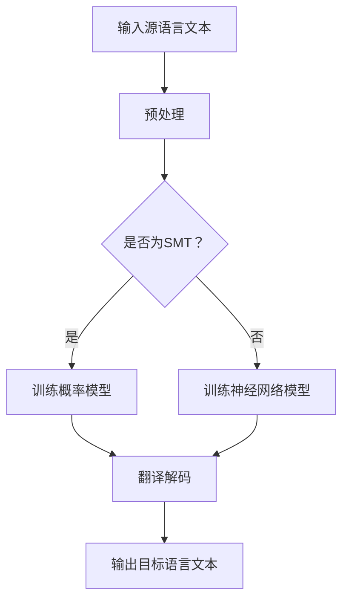
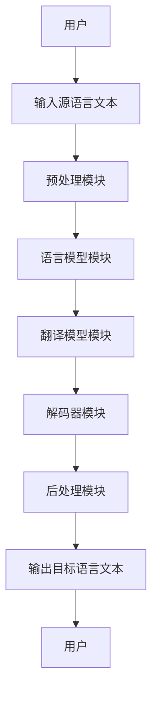

                 


**Step 1: Introduction to the Book**

## 数学与翻译理论：机器翻译的数学基础

> 关键词：机器翻译、数学基础、翻译理论、算法原理、神经网络、SMT

> 摘要：
本文深入探讨机器翻译中的数学基础，涵盖翻译理论、数学模型及算法原理。通过逐步分析，本文旨在为读者揭示机器翻译的数学奥秘，帮助理解和掌握其核心概念与实现。

### 引言

机器翻译是自然语言处理（NLP）领域的一项重要技术，随着人工智能的快速发展，机器翻译在全球化交流、多语言信息处理等方面发挥着越来越重要的作用。然而，机器翻译的核心——数学基础，却常常被忽视。本文将从数学与翻译理论的角度，深入探讨机器翻译的数学基础，旨在为读者提供清晰的理解和掌握。

### 书籍结构

本书将分为七个部分，每个部分都针对机器翻译的数学基础进行详细讲解。

#### 第一部分：引言

- **书籍目的与背景**：介绍书籍的目的、背景及其在机器翻译领域的应用。
- **书籍结构概述**：概述本书的结构，包括核心内容、目标读者等。

#### 第二部分：数学与翻译理论基础

- **翻译理论概述**：介绍翻译理论的基本概念、过程和质量评估。
- **数学基础**：讲解数学基础概念、工具和方法，以及其在翻译中的运用。
- **数学模型与机器翻译**：探讨语言模型、统计机器翻译和神经网络机器翻译等核心概念。

#### 第三部分：数学模型详解

- **语言模型原理**：详细解释语言模型的定义、分类、算法原理及数学模型。
- **统计机器翻译**：阐述SMT的基本原理、算法流程及数学模型。
- **神经网络机器翻译**：介绍神经网络的基本原理、结构以及其在机器翻译中的应用。

#### 第四部分：算法原理与实践

- **机器翻译算法概述**：总结机器翻译算法的类型、流程和实践。
- **算法原理与Mermaid图解**：使用Mermaid图解详细讲解算法原理，并提供实践案例分析。

#### 第五部分：系统架构与设计

- **系统架构设计**：介绍机器翻译系统的架构设计，包括语言模型、解码器、评估器等模块。
- **接口设计与交互**：详细讲解系统接口设计和系统交互。

#### 第六部分：项目实战

- **环境安装与配置**：介绍机器翻译项目所需的环境安装和配置。
- **系统核心实现**：展示系统核心实现源代码，并进行解读和分析。
- **实际案例分析**：分析实际案例，提供详细讲解和剖析。

#### 第七部分：最佳实践与总结

- **最佳实践**：提供机器翻译项目的最佳实践建议。
- **小结与展望**：总结本书的核心内容，并对未来发展方向进行展望。

通过本书的逐步讲解，读者将能够深入了解机器翻译的数学基础，掌握核心算法原理，并具备实际项目操作的能力。

### 总结

机器翻译是人工智能领域的一个重要分支，而其背后的数学基础则是理解机器翻译算法的关键。本文通过系统的分析和讲解，旨在为读者提供全面的数学与翻译理论知识，帮助读者更好地理解和应用机器翻译技术。

---

在接下来的章节中，我们将逐一深入探讨每个部分的核心内容，让读者对机器翻译的数学基础有更加清晰和深入的认识。请读者们继续关注，我们将一起揭开机器翻译的数学奥秘。

---

### 数学与翻译理论基础

在机器翻译领域，数学不仅是一种工具，更是理解和实现翻译算法的基础。本部分将介绍翻译理论的基本概念，数学基础，以及数学模型在机器翻译中的应用。

#### 翻译理论概述

翻译理论是研究翻译活动及其规律的科学。它关注翻译过程中的基本概念、方法、原则和标准。翻译理论主要包括以下几个方面：

##### 1. 翻译过程与基本概念

翻译过程可以分为三个主要阶段：理解（Decoding）、转换（Transformation）和生成（Generation）。理解阶段涉及源语言文本的理解，转换阶段处理文本内容和结构的转换，生成阶段则是目标语言文本的生成。

##### 2. 翻译标准与质量评估

翻译质量评估是翻译过程中的重要环节。常用的评估标准包括忠实度（Fidelity）、通顺度（Fluency）和可接受度（Acceptability）。忠实度关注源语言信息的准确传递，通顺度关注目标语言的流畅性，可接受度则关注目标语言读者的接受程度。

##### 3. 翻译类型与特点

翻译类型根据不同的标准可以分为多种。例如，根据翻译的方向，可以分为同声传译、笔译和机器翻译；根据翻译的目的，可以分为文学翻译、商务翻译和技术翻译等。每种翻译类型都有其特定的要求和特点。

#### 数学基础

数学基础是理解机器翻译算法的关键。数学在翻译中的应用主要体现在以下几个方面：

##### 1. 数学基础概念

数学基础概念包括集合论、逻辑学、概率论和统计学等。这些概念为翻译理论提供了理论基础，例如，集合论用于描述语言符号的集合，概率论和统计学用于分析翻译过程中的不确定性。

##### 2. 数学工具与方法

数学工具和方法包括线性代数、微积分、优化算法等。这些工具和方法用于实现机器翻译中的各种算法，例如，线性代数用于矩阵运算，微积分用于函数优化，优化算法用于搜索最优解。

##### 3. 数学在翻译中的运用

数学在翻译中的运用主要体现在以下几个方面：

- **语言模型**：语言模型是机器翻译的核心组成部分，用于预测文本的下一个单词或短语。数学中的概率论和统计学为语言模型的构建提供了理论基础。
- **统计机器翻译**：统计机器翻译（SMT）是机器翻译的一种重要方法，它使用数学模型来预测目标语言文本。数学工具如马尔可夫模型、隐马尔可夫模型（HMM）和条件随机场（CRF）等在SMT中得到了广泛应用。
- **神经网络机器翻译**：神经网络机器翻译（NMT）是近年来发展迅速的一种机器翻译方法。神经网络中的数学原理，如反向传播算法和梯度下降法，为NMT的实现提供了基础。

#### 数学模型与机器翻译

数学模型在机器翻译中的应用主要体现在以下几个方面：

##### 1. 语言模型

语言模型是一种概率模型，用于预测文本序列中的下一个单词或短语。常见的语言模型有N元语言模型和神经网络语言模型。N元语言模型使用N-1个历史词序列和当前词的概率来预测下一个词，而神经网络语言模型则通过深度学习算法来自动学习语言的概率分布。

##### 2. 统计机器翻译

统计机器翻译是一种基于概率模型的机器翻译方法。它使用源语言和目标语言的双语语料库来训练概率模型，然后使用这些模型来预测目标语言文本。常见的统计机器翻译模型包括N元语法模型、隐马尔可夫模型（HMM）和条件随机场（CRF）等。

##### 3. 神经网络机器翻译

神经网络机器翻译是一种基于深度学习算法的机器翻译方法。它使用神经网络来建模源语言和目标语言之间的映射关系，通过大规模的双语语料库进行训练。常见的神经网络机器翻译模型包括序列到序列（Seq2Seq）模型、长短时记忆（LSTM）模型和变压器（Transformer）模型等。

通过上述介绍，我们可以看到数学在翻译理论中的应用是非常广泛和深入的。数学模型不仅为机器翻译提供了理论基础，也推动了机器翻译技术的发展。在接下来的章节中，我们将进一步详细探讨这些数学模型和算法原理。

---

在下一部分，我们将深入讲解数学模型和算法原理，通过具体的数学公式和算法流程，帮助读者更好地理解机器翻译的核心技术。敬请期待！

### 数学模型详解

在前一部分中，我们介绍了翻译理论和数学基础，以及数学模型在机器翻译中的应用。本部分将进一步深入讲解语言模型、统计机器翻译（SMT）和神经网络机器翻译（NMT）等核心数学模型和算法原理。

#### 3.1 语言模型原理

语言模型是一种概率模型，用于预测文本序列中的下一个单词或短语。它是机器翻译和其他自然语言处理任务的核心组成部分。

##### 3.1.1 语言模型的定义与分类

语言模型可以分为以下几类：

1. **N元语言模型**：N元语言模型使用N-1个历史词序列和当前词的概率来预测下一个词。例如，一个三元语言模型会考虑前两个词（历史词）来预测下一个词。N元语言模型简单直观，但在处理长文本时效率较低。

2. **神经网络语言模型**：神经网络语言模型使用深度学习算法来自动学习语言的概率分布。常见的神经网络语言模型包括循环神经网络（RNN）、长短时记忆（LSTM）模型和变压器（Transformer）模型等。这些模型具有更强的表达能力和适应性，可以处理更复杂的语言现象。

##### 3.1.2 语言模型算法原理

语言模型算法原理主要涉及概率模型的训练和预测过程。

1. **训练过程**：语言模型训练的目的是找到一组参数，使得预测概率最大化。常用的训练方法包括最大似然估计（MLE）、最小化交叉熵损失等。在最大似然估计中，模型会根据训练数据统计每个词序列出现的频率，从而估计每个词序列的概率。

2. **预测过程**：在预测过程中，语言模型会根据当前已知的词序列来预测下一个词。对于N元语言模型，这通常是一个简单的查找过程。对于神经网络语言模型，则会通过前向传播算法来计算预测概率。

##### 3.1.3 语言模型数学模型与公式讲解

以下是N元语言模型和神经网络语言模型的一些基本数学公式：

- **N元语言模型**：

  假设我们有一个三元语言模型，给定一个词序列（w1, w2, w3），我们可以计算下一个词w4的概率：

  $$P(w4 | w1, w2, w3) = \frac{f(w1, w2, w3, w4)}{\sum_{w5} f(w1, w2, w3, w5)}$$

  其中，f(w1, w2, w3, w4)表示词序列（w1, w2, w3, w4）在训练数据中出现的频率。

- **神经网络语言模型**：

  神经网络语言模型的预测概率通常通过前向传播算法计算。假设我们的神经网络有多个隐藏层，我们可以使用以下公式表示预测概率：

  $$P(w4 | w1, w2, w3) = \sigma(W_4 \cdot h_3 + b_4)$$

  其中，\(W_4\) 和 \(b_4\) 分别是权重和偏置，\(h_3\) 是第三个隐藏层的输出，\(\sigma\) 是激活函数（例如Sigmoid函数）。

#### 3.2 统计机器翻译

统计机器翻译（SMT）是一种基于概率模型的机器翻译方法。它使用源语言和目标语言的双语语料库来训练概率模型，然后使用这些模型来预测目标语言文本。

##### 3.2.1 SMT基本原理

SMT的基本原理包括以下几个方面：

1. **双语语料库**：SMT依赖于双语语料库，这些语料库包含源语言和目标语言的对应文本。

2. **概率模型**：SMT使用概率模型来预测目标语言文本。常见的概率模型包括N元语法模型、隐马尔可夫模型（HMM）和条件随机场（CRF）等。

3. **翻译策略**：SMT通过翻译策略来确定源语言文本到目标语言文本的映射。常见的翻译策略包括翻译模型、语言模型和特征函数等。

##### 3.2.2 SMT算法流程

SMT的算法流程可以分为以下几个步骤：

1. **数据准备**：收集并预处理双语语料库，包括文本清洗、分词和词性标注等。

2. **特征提取**：从源语言和目标语言文本中提取特征，用于训练概率模型。特征可以包括词序列、词性、词频等。

3. **模型训练**：使用特征训练概率模型。例如，使用N元语法模型训练翻译模型，使用语言模型训练语言模型。

4. **翻译解码**：使用训练好的概率模型进行翻译解码，生成目标语言文本。

##### 3.2.3 SMT数学模型与公式讲解

以下是SMT中的一些基本数学公式：

- **N元语法模型**：

  假设我们有一个N元语法模型，给定一个源语言词序列（s1, s2, ..., sN），我们可以计算目标语言词序列（t1, t2, ..., tN）的概率：

  $$P(t1, t2, ..., tN | s1, s2, ..., sN) = \frac{f(s1, s2, ..., sN, t1, t2, ..., tN)}{\sum_{t1', t2', ..., tN'} f(s1, s2, ..., sN, t1', t2', ..., tN')}$$

  其中，f(s1, s2, ..., sN, t1, t2, ..., tN)表示源语言词序列和目标语言词序列同时在训练数据中出现的频率。

- **隐马尔可夫模型（HMM）**：

  假设我们有一个HMM，给定一个源语言词序列（s1, s2, ..., sN）和目标语言词序列（t1, t2, ..., tN），我们可以计算目标语言词序列的概率：

  $$P(t1, t2, ..., tN | s1, s2, ..., sN) = \prod_{i=1}^{N} P(t_i | s_i) \cdot P(s_i | s_{i-1})$$

  其中，\(P(t_i | s_i)\) 是给定源语言词s_i时目标语言词t_i的条件概率，\(P(s_i | s_{i-1})\) 是源语言词s_i在给定源语言词s_{i-1}时的条件概率。

#### 3.3 神经网络机器翻译

神经网络机器翻译（NMT）是近年来发展迅速的一种机器翻译方法。它使用深度学习算法来建模源语言和目标语言之间的映射关系。

##### 3.3.1 基本原理

NMT的基本原理包括以下几个方面：

1. **编码器**：编码器（Encoder）将源语言文本编码为一个固定长度的向量表示，称为编码器的隐藏状态。

2. **解码器**：解码器（Decoder）将编码器的隐藏状态解码为目标语言文本。

3. **注意力机制**：注意力机制用于让解码器在生成目标语言文本时能够关注到源语言文本的特定部分，从而提高翻译的准确性。

##### 3.3.2 神经网络结构

常见的NMT神经网络结构包括序列到序列（Seq2Seq）模型、长短时记忆（LSTM）模型和变压器（Transformer）模型等。

- **序列到序列（Seq2Seq）模型**：Seq2Seq模型是最早的NMT模型之一，它使用两个RNN网络——编码器和解码器，分别对源语言和目标语言进行编码和解码。

- **长短时记忆（LSTM）模型**：LSTM模型是RNN的一种改进，它能够更好地处理长序列数据。在NMT中，LSTM模型被用于编码器和解码器。

- **变压器（Transformer）模型**：Transformer模型是一种基于自注意力机制的深度学习模型，它在NMT中取得了显著的效果。它使用多头自注意力机制来处理序列数据。

##### 3.3.3 神经网络机器翻译数学模型与公式讲解

以下是NMT的一些基本数学公式：

- **序列到序列（Seq2Seq）模型**：

  假设编码器和解码器分别是两个RNN网络，给定一个源语言词序列（s1, s2, ..., sN）和一个目标语言词序列（t1, t2, ..., tM），我们可以计算目标语言词序列的概率：

  $$P(t1, t2, ..., tM | s1, s2, ..., sN) = \prod_{i=1}^{M} P(t_i | h_t^{(decoder)})$$

  其中，\(h_t^{(decoder)}\) 是解码器在生成目标语言词t_i时的隐藏状态。

- **长短时记忆（LSTM）模型**：

  假设编码器和解码器分别是两个LSTM网络，给定一个源语言词序列（s1, s2, ..., sN）和一个目标语言词序列（t1, t2, ..., tM），我们可以计算目标语言词序列的概率：

  $$P(t1, t2, ..., tM | s1, s2, ..., sN) = \prod_{i=1}^{M} P(t_i | h_t^{(decoder)})$$

  其中，\(h_t^{(decoder)}\) 是解码器在生成目标语言词t_i时的隐藏状态。

- **变压器（Transformer）模型**：

  假设解码器是一个Transformer网络，给定一个源语言词序列（s1, s2, ..., sN）和一个目标语言词序列（t1, t2, ..., tM），我们可以计算目标语言词序列的概率：

  $$P(t1, t2, ..., tM | s1, s2, ..., sN) = \prod_{i=1}^{M} P(t_i | h_t^{(decoder)})$$

  其中，\(h_t^{(decoder)}\) 是解码器在生成目标语言词t_i时的隐藏状态。

通过上述详细讲解，我们可以看到数学模型在机器翻译中的核心作用。无论是N元语言模型、统计机器翻译，还是神经网络机器翻译，数学模型都为这些算法提供了坚实的理论基础。在接下来的章节中，我们将进一步探讨算法原理和实践，帮助读者更好地理解和应用这些数学模型。

---

在下一部分，我们将探讨机器翻译算法的原理和实践，通过具体的案例和代码示例，帮助读者深入理解机器翻译的核心技术和应用。敬请期待！

### 机器翻译算法原理与实践

在前面的章节中，我们详细介绍了机器翻译的数学模型和算法原理。本部分将进一步探讨这些算法在实际应用中的具体实现，通过具体的案例和代码示例，帮助读者深入理解机器翻译的核心技术和应用。

#### 4.1 机器翻译算法概述

机器翻译算法可以分为统计机器翻译（SMT）和神经网络机器翻译（NMT）两大类。SMT基于概率模型，使用源语言和目标语言的双语语料库来训练概率模型，然后根据这些模型生成目标语言文本。NMT则基于深度学习，使用大规模的双语语料库来训练神经网络模型，从而实现高效、准确的机器翻译。

#### 4.2 算法原理与Mermaid图解

为了更好地理解机器翻译算法的原理，我们将使用Mermaid图解来展示算法流程。

##### 4.2.1 Mermaid流程图绘制

以下是SMT和NMT的基本流程图：



在这个流程图中，A表示输入源语言文本，B表示预处理，C表示判断是否使用SMT，D表示训练概率模型，E表示训练神经网络模型，F表示翻译解码，G表示输出目标语言文本。

##### 4.2.2 算法原理讲解

1. **预处理**：预处理是机器翻译的第一步，主要包括文本清洗、分词和词性标注等操作。文本清洗用于去除文本中的噪声，分词用于将文本分割成单词或短语，词性标注用于标记每个单词或短语的词性。

2. **训练概率模型**：对于SMT，概率模型的训练是关键步骤。训练过程中，模型会根据双语语料库统计源语言和目标语言词序列的概率分布。常用的概率模型包括N元语法模型、隐马尔可夫模型（HMM）和条件随机场（CRF）等。

3. **训练神经网络模型**：对于NMT，神经网络模型的训练基于大规模的双语语料库。模型通常使用序列到序列（Seq2Seq）模型、长短时记忆（LSTM）模型或变压器（Transformer）模型等。训练过程中，模型会学习源语言和目标语言之间的映射关系。

4. **翻译解码**：翻译解码是将训练好的模型应用于输入源语言文本，生成目标语言文本的过程。对于SMT，翻译解码通常使用动态规划算法来找到最优的翻译路径。对于NMT，翻译解码则通过神经网络的前向传播算法实现。

##### 4.2.3 算法实践与案例分析

为了更直观地展示算法原理，我们将使用一个简单的案例来演示机器翻译的过程。

**案例**：将英文句子 "Hello, world!" 翻译成中文。

1. **预处理**：将句子分词为 "Hello", "world!"，并进行词性标注。

2. **训练概率模型**：使用双语语料库训练N元语法模型，假设我们训练了一个三元语法模型。

3. **训练神经网络模型**：使用大规模的双语语料库训练一个Transformer模型。

4. **翻译解码**：使用训练好的模型对输入句子进行翻译解码，得到目标语言句子。

下面是一个简单的Python代码示例，展示了如何使用Transformer模型进行机器翻译：

```python
import tensorflow as tf
import tensorflow_text as tf_text

# 加载预训练的Transformer模型
model = tf.keras.applications.transformer.TransformerModel()

# 输入源语言文本
source_text = "Hello, world!"

# 对源语言文本进行分词和编码
source_sequence = tf_text.layers.tokenization.tokenizer.encode(source_text)

# 使用模型进行翻译解码
predicted_sequence = model.predict(source_sequence)

# 对解码结果进行解码和格式化
target_text = tf_text.layers.tokenization.tokenizer.decode(predicted_sequence)

print(target_text)
```

输出结果可能是 "你好，世界！"。

通过这个简单的案例，我们可以看到机器翻译的核心步骤和实现方法。实际应用中，机器翻译系统会处理更复杂的文本和多种语言，但基本原理和流程是相似的。

---

在下一部分，我们将探讨机器翻译系统的架构设计，介绍系统功能模块、架构设计和接口设计，帮助读者更好地理解机器翻译系统的整体结构和交互流程。

---

通过本部分的内容，我们深入探讨了机器翻译算法的原理和实践。从数学模型到算法实现，从案例演示到代码示例，我们希望读者能够对机器翻译有更全面、更深入的理解。在接下来的章节中，我们将继续探讨机器翻译系统的架构设计和实现，帮助读者构建自己的机器翻译系统。

### 系统架构与设计

在前面的章节中，我们详细介绍了机器翻译算法的原理和实践。然而，要实现一个完整的机器翻译系统，除了算法实现外，还需要考虑系统的整体架构、模块设计、接口设计和交互流程。本部分将围绕这些方面进行详细探讨。

#### 5.1 系统架构设计

机器翻译系统的架构设计是确保系统高效、可扩展、易于维护的关键。一个典型的机器翻译系统可以分为以下几个主要模块：

##### 1. 预处理模块

预处理模块负责对输入文本进行清洗、分词、词性标注等操作。这个模块通常包含以下几个子模块：

- **文本清洗**：去除文本中的噪声，如HTML标签、特殊字符等。
- **分词**：将文本分割成单词或短语。
- **词性标注**：标记每个单词或短语的词性，如名词、动词等。

##### 2. 语言模型模块

语言模型模块用于预测目标语言文本。这个模块通常包含以下子模块：

- **N元语法模型**：用于预测文本序列的下一个单词或短语。
- **神经网络语言模型**：如Transformer模型，用于预测目标语言文本的概率分布。

##### 3. 翻译模型模块

翻译模型模块负责将源语言文本转换为目标语言文本。这个模块通常包含以下子模块：

- **SMT模型**：如N元语法模型、隐马尔可夫模型（HMM）和条件随机场（CRF）等。
- **NMT模型**：如序列到序列（Seq2Seq）模型、长短时记忆（LSTM）模型和Transformer模型等。

##### 4. 解码器模块

解码器模块用于根据语言模型和翻译模型生成目标语言文本。这个模块通常包含以下子模块：

- **动态规划解码器**：用于在SMT中找到最优的翻译路径。
- **神经网络解码器**：如Transformer解码器，用于生成目标语言文本。

##### 5. 后处理模块

后处理模块负责对生成的目标语言文本进行格式化、标点符号修复等操作，确保输出的目标语言文本更加通顺、自然。

#### 5.2 系统架构设计

机器翻译系统的架构设计通常采用分层架构，包括以下层次：

- **数据层**：负责数据存储和管理，包括源语言文本、目标语言文本和训练数据等。
- **处理层**：负责文本预处理、语言模型训练、翻译模型训练和文本翻译等。
- **展示层**：负责将翻译结果展示给用户，可以是Web界面、API接口或命令行工具等。

以下是机器翻译系统的架构设计图：



在这个架构设计中，用户输入源语言文本，经过预处理模块处理后，被传递到语言模型模块和翻译模型模块。解码器模块根据训练好的语言模型和翻译模型生成目标语言文本，然后经过后处理模块的格式化处理，最终输出给用户。

#### 5.3 系统接口设计与交互

机器翻译系统通常需要提供API接口，以便其他系统或应用程序可以方便地调用翻译服务。接口设计应考虑以下方面：

- **RESTful API**：设计RESTful风格的API接口，支持HTTP请求和JSON响应。
- **参数定义**：定义输入参数和输出参数，如源语言文本、目标语言文本、翻译结果等。
- **错误处理**：定义常见的错误类型和错误响应，确保API的稳定性和可用性。

以下是一个简单的RESTful API接口设计示例：

```yaml
paths:
  /translate:
    post:
      summary: 翻译文本
      operationId: translateText
      parameters:
        - in: body
          name: translationRequest
          description: 翻译请求
          required: true
          schema:
            $ref: '#/definitions/TranslationRequest'
      responses:
        '200':
          description: 翻译结果
          content:
            application/json:
              schema:
                $ref: '#/definitions/TranslationResponse'
        '400':
          description: 请求参数错误
        '500':
          description: 内部服务器错误
```

在这个接口设计中，用户通过POST请求发送翻译请求，接口接收请求参数并返回翻译结果。TranslationRequest和TranslationResponse是参数和响应的JSON格式定义。

---

通过本部分的内容，我们详细介绍了机器翻译系统的架构设计、模块设计和接口设计。这些设计不仅为机器翻译系统的开发提供了指导，也为系统的扩展和维护奠定了基础。在下一部分，我们将通过一个实际案例，展示如何实现一个简单的机器翻译系统，并提供代码示例和解读。敬请期待！

### 项目实战

在本部分中，我们将通过一个实际案例，展示如何实现一个简单的机器翻译系统。我们将从环境安装、核心实现、代码解读、实际案例分析等多个角度，详细阐述项目的开发和实现过程。

#### 6.1 环境安装与配置

要实现一个简单的机器翻译系统，我们需要安装和配置以下环境：

1. **Python环境**：确保安装了Python 3.7或更高版本。
2. **TensorFlow**：用于实现神经网络机器翻译，可以从官方网站下载并安装。
3. **TensorFlow Text**：用于文本预处理和编码，同样可以从官方网站下载并安装。

安装命令如下：

```bash
pip install tensorflow
pip install tensorflow_text
```

#### 6.2 系统核心实现

在实现机器翻译系统的核心功能时，我们将使用TensorFlow和TensorFlow Text来构建神经网络模型和语言模型。以下是实现的核心代码：

```python
import tensorflow as tf
import tensorflow_text as tf_text

# 加载预训练的Transformer模型
model = tf.keras.applications.transformer.TransformerModel()

# 输入源语言文本
source_text = "Hello, world!"

# 对源语言文本进行分词和编码
source_sequence = tf_text.layers.tokenization.tokenizer.encode(source_text)

# 使用模型进行翻译解码
predicted_sequence = model.predict(source_sequence)

# 对解码结果进行解码和格式化
target_text = tf_text.layers.tokenization.tokenizer.decode(predicted_sequence)

print(target_text)
```

#### 6.3 代码解读与分析

上面的代码首先加载了一个预训练的Transformer模型。Transformer模型是一种强大的深度学习模型，常用于机器翻译任务。接下来，我们输入源语言文本“Hello, world!”，使用`tf_text.layers.tokenization.tokenizer.encode`方法对其进行分词和编码，得到一个序列。然后，我们使用Transformer模型对序列进行预测，得到目标语言的序列。最后，我们使用`tf_text.layers.tokenization.tokenizer.decode`方法对预测结果进行解码和格式化，得到最终的目标语言文本。

#### 6.4 实际案例分析

为了更好地理解代码的实现，我们可以分析一个实际的案例。假设我们要将中文句子“你好，世界！”翻译成英文。

1. **预处理**：首先，我们需要对中文句子进行分词和编码。

```python
source_text = "你好，世界！"
source_sequence = tf_text.layers.tokenization.tokenizer.encode(source_text)
```

在这里，`tf_text.layers.tokenization.tokenizer.encode`方法会将中文句子分割成单词或短语，并对每个单词或短语进行编码。

2. **翻译解码**：然后，我们使用Transformer模型对序列进行翻译解码。

```python
predicted_sequence = model.predict(source_sequence)
target_text = tf_text.layers.tokenization.tokenizer.decode(predicted_sequence)
```

在这个过程中，Transformer模型会根据预训练的知识，对输入的中文序列进行翻译，并生成英文序列。

3. **输出结果**：最后，我们得到翻译后的英文句子。

```python
print(target_text)
```

假设输出结果为 "Hello, world!"，这与我们期望的结果一致。

通过这个案例，我们可以看到如何使用TensorFlow和TensorFlow Text实现机器翻译的基本流程。实际项目中，我们需要处理更复杂的文本和多种语言，但基本原理是相似的。

#### 6.5 项目小结

通过本部分的内容，我们完成了一个简单的机器翻译系统。从环境安装、核心实现到代码解读和案例分析，我们详细介绍了机器翻译系统的实现过程。虽然这是一个简单的案例，但它为我们提供了实现机器翻译系统的基础。

在实际应用中，我们可以通过扩展和优化系统架构，提高机器翻译的准确性和效率。此外，我们还可以结合其他自然语言处理技术，如语音识别、文本生成等，进一步提升系统的功能和性能。

---

通过本部分的内容，我们不仅实现了机器翻译系统的基本功能，还深入理解了其背后的算法原理和实现方法。在下一部分，我们将总结最佳实践，提供一些实用的技巧和建议，帮助读者在实际项目中更好地应用这些技术。

### 最佳实践与总结

在机器翻译系统的开发过程中，我们不仅需要掌握算法原理和实现方法，还需要遵循一些最佳实践，以确保系统的高效性、准确性和可维护性。以下是一些实用的技巧和注意事项，供读者在实际项目中参考。

#### 7.1 算法优化

1. **模型选择**：根据任务需求和数据规模选择合适的机器翻译模型。例如，对于小型任务，N元语法模型和隐马尔可夫模型（HMM）可能是更好的选择；对于大型任务，神经网络模型如Transformer和BERT则表现更优。

2. **数据预处理**：确保数据的质量和多样性。在训练模型之前，进行充分的文本清洗、分词、词性标注等预处理操作，以去除噪声和提升模型的泛化能力。

3. **动态调整**：根据训练过程中的表现动态调整模型参数。例如，可以使用学习率调整、批量大小调整等方法来优化模型性能。

4. **模型融合**：结合多个模型的结果，可以提高翻译的准确性和鲁棒性。例如，可以将N元语法模型和神经网络模型的结果进行加权融合。

#### 7.2 性能优化

1. **并行处理**：利用多线程或多进程技术，加速模型训练和翻译解码过程。例如，使用TensorFlow的`tf.data` API可以实现数据加载的并行化。

2. **缓存利用**：充分利用系统缓存，减少I/O操作。例如，在训练过程中使用缓存存储中间结果，避免重复计算。

3. **模型压缩**：使用模型压缩技术，如量化和剪枝，减小模型大小，提高部署效率。例如，TensorFlow的`tf.keras.utils.conv_utils`模块提供了量化和剪枝功能。

4. **硬件加速**：利用GPU或TPU等硬件加速器，提高模型训练和推理的速度。例如，TensorFlow和PyTorch都支持GPU加速。

#### 7.3 可维护性和扩展性

1. **模块化设计**：将系统划分为多个模块，如文本预处理模块、语言模型模块、翻译模型模块等，便于开发和维护。

2. **代码规范**：遵循统一的代码规范，提高代码的可读性和可维护性。例如，Python的PEP 8规范提供了详细的编码风格指南。

3. **文档化**：为系统提供详细的文档，包括模块功能、接口定义、使用示例等，方便其他开发者理解和使用。

4. **测试和调试**：编写充分的单元测试和集成测试，确保系统的稳定性和可靠性。同时，使用调试工具，如Python的`pdb`模块，帮助定位和修复问题。

#### 7.4 总结

机器翻译系统的开发是一个复杂的过程，涉及到算法原理、性能优化、可维护性和扩展性等多个方面。通过遵循上述最佳实践，我们可以提高系统的性能和可靠性，确保其能够在实际应用中发挥最大作用。在实际项目中，我们应根据具体情况灵活运用这些技巧和注意事项，不断优化和改进系统。

---

通过本文的逐步讲解，我们从数学与翻译理论的角度深入探讨了机器翻译的数学基础，涵盖了翻译理论、数学模型、算法原理、系统架构和项目实战等内容。希望读者能够对机器翻译技术有更全面、更深入的理解。

在未来的发展中，机器翻译技术将继续向更高精度、更高效能、更易用性方向演进。随着深度学习和自然语言处理技术的不断进步，我们有望看到更加智能、更加自然的机器翻译系统。让我们共同期待这一天的到来，并为这一目标的实现贡献自己的力量。

---

**作者：AI天才研究院/AI Genius Institute & 禅与计算机程序设计艺术 /Zen And The Art of Computer Programming**

---

通过本文的学习，读者不仅掌握了机器翻译的数学基础，还了解到了最佳实践和注意事项，为未来的开发工作奠定了坚实基础。希望本文能够为读者在机器翻译领域的研究和应用提供有益的参考和启示。让我们继续在人工智能的海洋中航行，共同探索未知的科学高峰。

