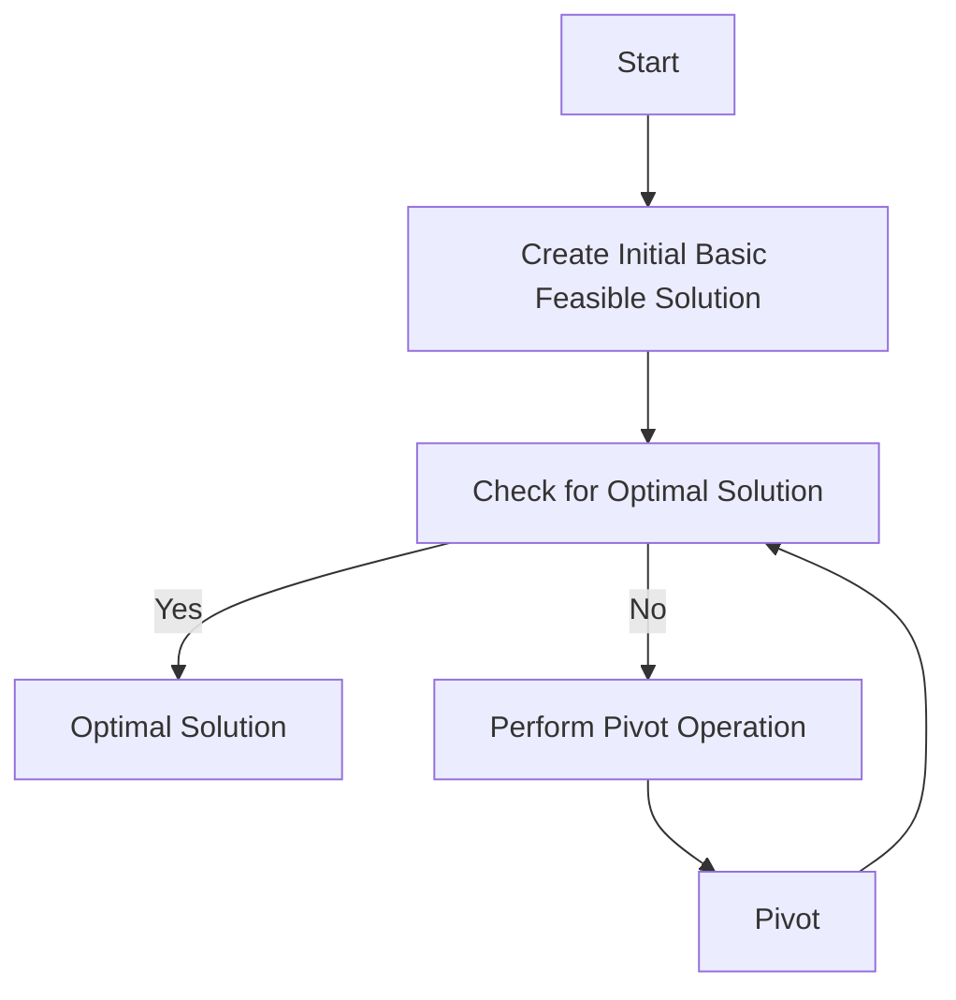
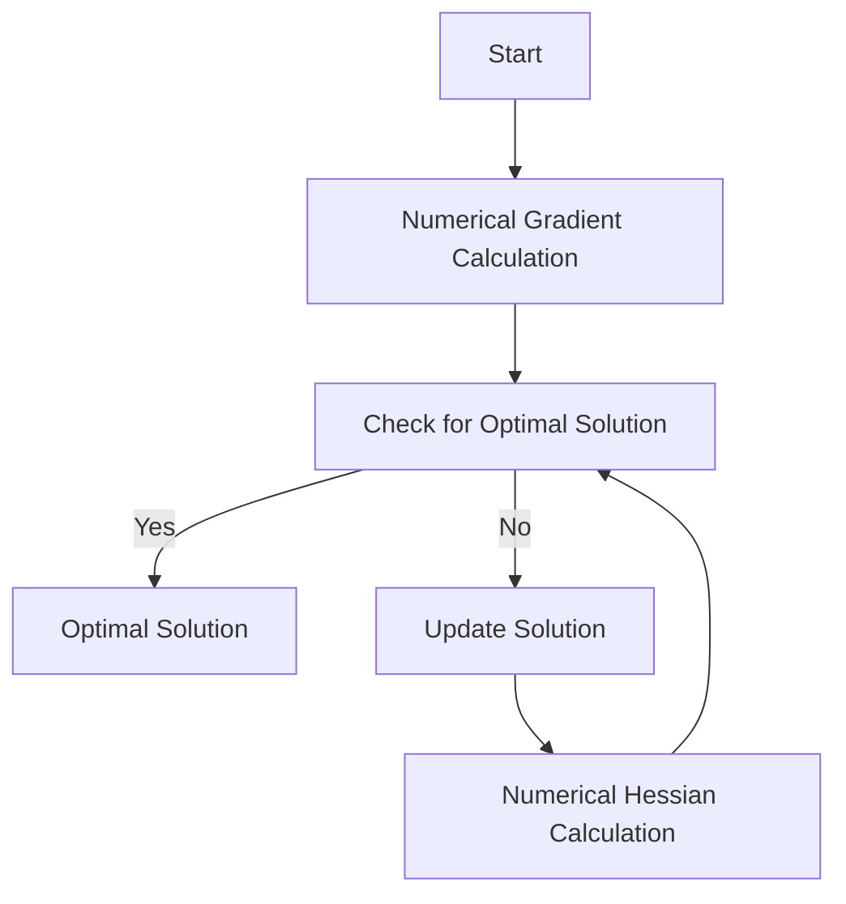
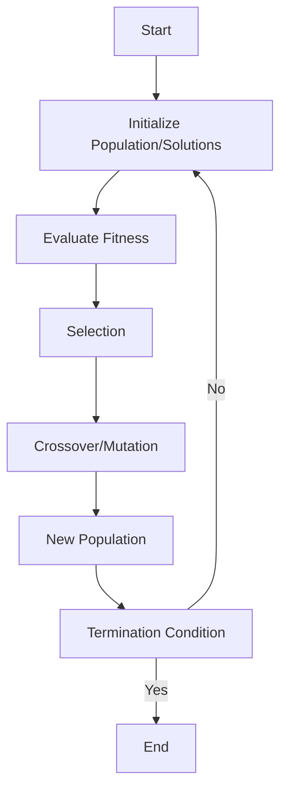
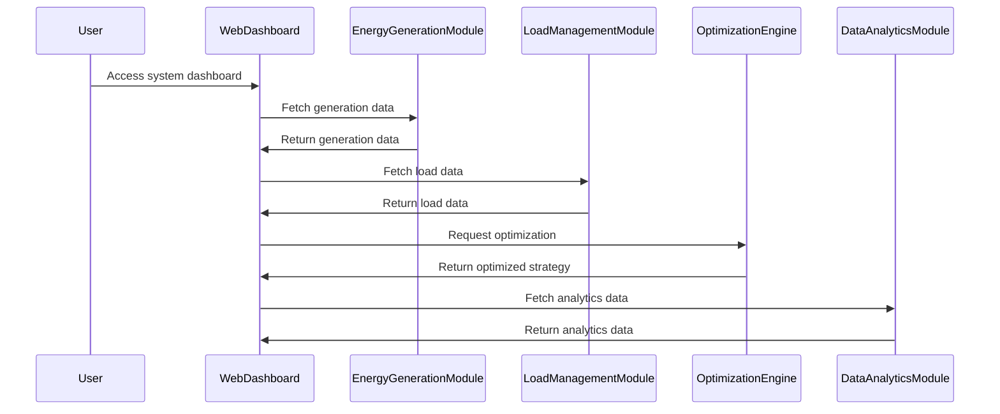

                 

### Introduction to the Book

#### Importance and Target Audience

The book "Mathematics and Energy Science: Mathematical Methods for Energy System Optimization" is a comprehensive guide aimed at bridging the gap between mathematics and energy science. As the world becomes increasingly aware of the importance of sustainable energy solutions, the optimization of energy systems has become a critical area of research and application. This book is intended for a diverse audience, including students, researchers, professionals, and practitioners in the fields of mathematics, energy science, and systems engineering.

The significance of energy optimization lies in its potential to enhance efficiency, reduce costs, and minimize environmental impact. Mathematical methods offer powerful tools for modeling, analyzing, and optimizing complex energy systems, making them indispensable for developing sustainable energy solutions. This book aims to provide a thorough understanding of the mathematical techniques used in energy system optimization, enabling readers to apply these methods effectively in real-world scenarios.

#### Book Content Overview

The book is structured into five main sections, each addressing different aspects of energy system optimization. The first section provides a historical context and background information on the integration of mathematics in energy science. It introduces the core concepts and terminology essential for understanding the subsequent chapters.

The second section focuses on the fundamental mathematical methods used in energy system optimization. It includes detailed explanations of algorithms, mathematical models, and formulas, along with Python code examples to illustrate their practical application. This section is designed to build a solid foundation in the mathematical tools necessary for energy system optimization.

The third section delves into system analysis and design, providing a comprehensive guide to the functional, architectural, and interface aspects of energy system optimization projects. This section includes Mermaid diagrams to visually represent system components and interactions.

The fourth section presents a practical project implementation, complete with environment setup, core code implementation, and detailed analysis of real-world case studies. This section aims to provide readers with hands-on experience in applying the book's concepts to real-world problems.

Finally, the book concludes with a summary of best practices, key takeaways, and suggestions for further reading. This section is designed to reinforce the reader's understanding of the material and provide a roadmap for continued learning and exploration in the field of energy system optimization.

In summary, "Mathematics and Energy Science: Mathematical Methods for Energy System Optimization" is a valuable resource for anyone interested in leveraging mathematical methods to optimize energy systems. Whether you are a student seeking to deepen your understanding of the subject or a professional looking to apply these methods in your work, this book offers a comprehensive and practical guide to achieving energy system optimization.

#### Background and Core Concepts

##### Historical Context

The intersection of mathematics and energy science has a rich and diverse history that spans centuries. Historically, the application of mathematical principles in energy systems can be traced back to the early days of physics and engineering. For instance, Archimedes' work on fluid dynamics and energy conservation laid the foundational principles that are still relevant today. Over time, as computational methods advanced, the role of mathematics in energy science has evolved significantly.

In the 19th century, the development of thermodynamics marked a significant turning point. The laws of thermodynamics, which describe the behavior of energy in systems, provided a robust mathematical framework for understanding energy conversion and efficiency. This period also saw the rise of calculus, which became an essential tool for modeling complex energy systems.

The 20th century brought further advancements with the advent of computers. Numerical methods and optimization techniques gained prominence, enabling the simulation and analysis of large-scale energy systems. This era saw the development of linear programming, non-linear programming, and other mathematical techniques that are now standard tools in energy system optimization.

##### Problem Definition

The primary goal of energy system optimization is to maximize efficiency and minimize costs while ensuring sustainability. This involves addressing a range of complex problems, such as energy supply-demand balancing, resource allocation, emissions reduction, and load forecasting. These problems are often characterized by their high dimensionality, non-linearities, and constraints, making them challenging to solve using traditional approaches.

One of the key challenges in energy system optimization is the integration of diverse energy sources and technologies. For example, a modern energy system may involve a mix of fossil fuels, renewable energy sources, and energy storage solutions. Optimizing such a system requires a comprehensive understanding of the interactions between different components and the ability to model these interactions accurately.

Another critical challenge is the dynamic nature of energy systems. Energy demand and supply can fluctuate significantly over time, driven by factors such as weather conditions, economic activities, and policy changes. This necessitates the development of robust mathematical models that can adapt to changing conditions and provide reliable forecasts and optimization solutions.

##### Problem Solving

To address these challenges, mathematical methods offer a structured approach to modeling, analyzing, and optimizing energy systems. The following steps outline a typical problem-solving process in energy system optimization:

1. **Problem Definition**: Clearly define the problem, including the objectives, constraints, and assumptions.
2. **Modeling**: Develop a mathematical model that represents the problem. This involves identifying the key variables, relationships, and constraints.
3. **Formulation**: Express the model in a mathematical form, such as equations, inequalities, or optimization problems.
4. **Solution Method**: Select an appropriate solution method, such as linear programming, non-linear programming, or heuristic algorithms.
5. **Implementation**: Implement the solution method using computational tools, such as mathematical software or programming languages like Python.
6. **Validation**: Validate the model and solution by comparing them with real-world data or alternative methods.
7. **Optimization**: Use the validated model to optimize the energy system, adjusting parameters and exploring different scenarios to find the best solution.

##### Boundary and Scope

The scope of this book is to provide a comprehensive overview of the mathematical methods used in energy system optimization. It covers fundamental concepts, such as linear programming, non-linear programming, and heuristic algorithms, and their applications in various energy system scenarios. The book also discusses advanced topics, such as multi-objective optimization, robust optimization, and machine learning techniques in energy system optimization.

However, it is important to note that energy system optimization is a vast and rapidly evolving field. This book aims to provide a foundational understanding of the key concepts and methods but does not cover all aspects of the field. Readers are encouraged to explore further resources and stay updated with the latest advancements in the field.

##### Concept Structure and Core Elements

To facilitate a deeper understanding of the core concepts in energy system optimization, we present a concept attributes comparison table and an Entity-Relationship (ER) diagram.

**Concept Attributes Comparison Table**

| Concept            | Definition                                                                                     | Attributes                                                                 | Example Applications |
|--------------------|------------------------------------------------------------------------------------------------|-----------------------------------------------------------------------------|---------------------|
| Linear Programming | A mathematical method for optimizing a linear objective function subject to linear constraints. | Objective function is linear, constraints are linear.                        | Power plant scheduling, load balancing. |
| Non-Linear Programming | A mathematical method for optimizing a non-linear objective function subject to linear or non-linear constraints. | Objective function can be non-linear, constraints can be linear or non-linear. | Portfolio optimization, emissions reduction. |
| Heuristic Algorithms | Problem-solving methods that use practical techniques to find approximate solutions quickly. | No guarantee of finding the optimal solution, fast convergence.               | Genetic algorithms, simulated annealing. |

**Entity-Relationship (ER) Diagram**

```mermaid
erDiagram
  EnergySystem <<--|Optimizes|> OptimizationMethod
  OptimizationMethod ||--|Applies to|> ProblemType
  ProblemType ||--|Involves|> EnergySource
  EnergySource ||--|Generated by|> Technology
  Technology ||--|Operates under|> Constraint
  Constraint ||--|Enforced by|> Policy
```

In the ER diagram, "EnergySystem" is the central entity that is optimized by various "OptimizationMethods." These methods apply to different "ProblemTypes," which involve various "EnergySources." Each energy source is generated by a specific "Technology" and operates under various "Constraints," which are enforced by "Policies."

This conceptual framework provides a structured overview of the relationships between the key elements in energy system optimization. It helps in understanding how different components interact and contribute to the overall optimization process.

In summary, the background and core concepts section sets the stage for a detailed exploration of mathematical methods in energy system optimization. It provides historical context, defines the problems addressed, and outlines the conceptual structure and core elements involved in the field. This foundational knowledge is crucial for understanding the subsequent chapters, which delve deeper into specific mathematical methods and their applications.

#### Mathematical Methods for Energy System Optimization

##### Overview

This section provides a comprehensive overview of the core mathematical methods used in energy system optimization. Each method is explained in detail, starting with its algorithmic principles, followed by mathematical models and formulas, and illustrated with Python code examples. By the end of this section, readers will have a solid understanding of the fundamental tools required for optimizing energy systems.

##### Linear Programming

**Algorithmic Principles**

Linear programming (LP) is a mathematical method for optimizing a linear objective function subject to linear constraints. The primary algorithm used for solving LP problems is the Simplex Algorithm, which iteratively moves from one feasible solution to another until an optimal solution is found.

**Mermaid Flowchart**



**Python Code Example**

```python
# Import required libraries
import numpy as np
from scipy.optimize import linprog

# Coefficients for the objective function
c = [-1, -1]  # Minimize the sum of x and y

# Coefficients for the inequality constraints
A = [[2, 1], [1, 2]]
b = [4, 2]

# Initial basic feasible solution
x0 = [0, 0]

# Options for the solver
options = {'maxiter': 1000}

# Solve the linear programming problem
result = linprog(c, A_ub=A, b_ub=b, x0=x0, method='highs', options=options)

# Print the results
print("Objective Value:", -result.fun)
print("Solution:", result.x)
```

**Mathematical Models and Formulas**

Consider a linear programming problem with the following form:

$$\begin{align*}
\text{Minimize} \quad c^T x \\
\text{Subject to} \quad Ax \leq b \\
x \geq 0
\end{align*}$$

where \( c \) is the coefficient vector, \( x \) is the variable vector, \( A \) is the constraint matrix, and \( b \) is the right-hand side vector. The Simplex Algorithm works by moving from one basic feasible solution to another until an optimal solution is found. The pivot operation is the heart of the Simplex Algorithm and involves selecting a pivot element to improve the objective function value.

##### Non-Linear Programming

**Algorithmic Principles**

Non-linear programming (NLP) deals with optimizing a non-linear objective function subject to linear or non-linear constraints. Unlike linear programming, there is no single universal algorithm for solving NLP problems. Common methods include gradient-based methods (e.g., sequential quadratic programming, gradient descent) and non-gradient-based methods (e.g., genetic algorithms, simulated annealing).

**Mermaid Flowchart**



**Python Code Example**

```python
# Import required libraries
import numpy as np
from scipy.optimize import minimize

# Define the objective function
def objective(x):
    return x[0]**2 + x[1]**2

# Define the constraints
def constraint1(x):
    return x[0]**2 + x[1]**2 - 1

def constraint2(x):
    return - (x[0] - 1)**2 - (x[1] - 1)**2 + 1

# Initial guess
x0 = [1, 1]

# Options for the solver
options = {'maxiter': 1000}

# Solve the non-linear programming problem
result = minimize(objective, x0, method='L-BFGS-B', jac=objective, constraints=[{'type': 'ineq', 'fun': constraint1}, {'type': 'ineq', 'fun': constraint2}], options=options)

# Print the results
print("Objective Value:", result.fun)
print("Solution:", result.x)
```

**Mathematical Models and Formulas**

Consider a non-linear programming problem with the following form:

$$\begin{align*}
\text{Minimize} \quad f(x) \\
\text{Subject to} \quad g_i(x) \leq 0, \quad h_j(x) = 0
\end{align*}$$

where \( f(x) \) is the objective function, \( g_i(x) \) and \( h_j(x) \) are the constraint functions, and \( x \) is the variable vector. Gradient-based methods rely on the gradient of the objective function and constraints to iteratively improve the solution. Non-gradient-based methods, such as genetic algorithms and simulated annealing, use heuristic search strategies to find approximate solutions.

##### Heuristic Algorithms

**Algorithmic Principles**

Heuristic algorithms are problem-solving methods that use practical techniques to find approximate solutions quickly. These methods do not guarantee finding the optimal solution but often provide good solutions in a reasonable amount of time. Common heuristic algorithms include genetic algorithms, simulated annealing, and particle swarm optimization.

**Mermaid Flowchart**



**Python Code Example**

```python
# Import required libraries
import numpy as np
from deap import base, creator, tools, algorithms

# Define the fitness function
def fitness(individual):
    return 1 / (individual[0]**2 + individual[1]**2 + 1)

# Define the genetic algorithm
def main():
    creator.create("FitnessMax", base.Fitness, weights=(1.0,))
    creator.create("Individual", list, fitness=creator.FitnessMax)

    toolbox = base.Toolbox()
    toolbox.register("attr_real", np.random.rand)
    toolbox.register("individual", tools.initIterate, creator.Individual, toolbox.attr_real, n=2)
    toolbox.register("population", tools.initRepeat, list, toolbox.individual)
    toolbox.register("evaluate", fitness)
    toolbox.register("select", tools.selTournament, tournsize=3)
    toolbox.register("mate", tools.cxBlend, alpha=0.5)
    toolbox.register("mutate", tools.mutGaussian, mu=0, sigma=1, indpb=0.1)
    toolbox.register("generate", tools.generateSimplex, size=2, range=(0, 1))

    pop = toolbox.population(n=50)
    hof = tools.HallOfFame(1)

    stats = tools.Statistics(lambda ind: ind.fitness.values)
    stats.register("avg", numpy.mean)
    stats.register("min", numpy.min)
    stats.register("max", numpy.max)

    algorithms.eaSimple(pop, toolbox, cxpb=0.5, mutpb=0.2, ngen=40, stats=stats, hallof fame=hof, verbose=True)

    best_ind = hof[0]
    print("Best individual is %s, with fitness = %s" % (best_ind, best_ind.fitness.values))

if __name__ == "__main__":
    main()
```

**Mathematical Models and Formulas**

Heuristic algorithms are typically based on simple principles, such as natural selection, random search, or simulated physical processes. The key advantage of heuristic algorithms is their ability to escape local optima and find good solutions in complex, high-dimensional search spaces. Commonly used heuristic algorithms include:

- **Genetic Algorithms**: Inspired by natural selection, genetic algorithms use operators such as selection, crossover, and mutation to evolve a population of solutions towards better fitness values.
- **Simulated Annealing**: Inspired by the physical process of annealing, simulated annealing uses a temperature parameter to control the acceptance of worse solutions, allowing the algorithm to escape local optima.
- **Particle Swarm Optimization**: Inspired by the social behavior of bird flocking or fish schooling, particle swarm optimization updates the position and velocity of particles based on their own best experience and the best experience of the entire swarm.

In summary, this section provides a detailed overview of the core mathematical methods used in energy system optimization. Each method is explained in terms of its algorithmic principles, mathematical models, and formulas, and illustrated with Python code examples. This comprehensive coverage provides readers with the foundational knowledge required to apply these methods effectively in practical energy system optimization problems.

#### System Analysis and Design

##### Problem Domain and Project Objectives

The problem domain for this project involves the optimization of an electrical power grid system to improve efficiency and reduce costs while ensuring a stable and reliable power supply. The project aims to address the following objectives:

1. **Load Balancing**: Ensure that the power distribution across the grid is balanced to minimize losses and prevent overloading of individual components.
2. **Energy Efficiency**: Optimize the overall energy consumption of the grid system to reduce operational costs and minimize environmental impact.
3. **Sustainability**: Promote the use of renewable energy sources and energy storage systems to enhance the sustainability of the grid.
4. **Fault Tolerance**: Improve the resilience of the grid system to withstand unexpected failures or sudden changes in demand.

To achieve these objectives, the project will involve the development of a comprehensive system analysis and design framework. This framework will include functional, architectural, and interface design components, each contributing to the overall optimization of the power grid system.

##### Functional Design

The functional design of the power grid optimization system involves defining the core functionalities and their relationships. The primary components of the system include:

1. **Energy Generation Module**: This module is responsible for managing the generation of electricity from various sources, including fossil fuels, renewable sources (e.g., solar, wind), and energy storage systems.
2. **Load Management Module**: This module handles the monitoring and control of energy demand across different parts of the grid, ensuring that the power distribution is balanced and efficient.
3. **Optimization Engine**: This core component uses mathematical optimization techniques to analyze the grid's operational data and propose optimal strategies for load balancing, energy efficiency, and fault tolerance.
4. **Data Analytics Module**: This module collects and analyzes operational data from various parts of the grid to provide insights into system performance and identify areas for improvement.

**Mermaid Class Diagram**

```mermaid
classDiagram
  EnergyGenerationModule <<interface>>
  LoadManagementModule <<interface>>
  OptimizationEngine <<interface>>
  DataAnalyticsModule <<interface>>

  EnergyGenerationModule <|.. LoadManagementModule>
  LoadManagementModule <|.. OptimizationEngine>
  OptimizationEngine <|.. DataAnalyticsModule
```

In the class diagram, each module is represented as an interface, highlighting their roles and interactions within the system. The dashed lines indicate dependency and data flow between the modules, emphasizing the integrated nature of the functional design.

##### Architecture Design

The architecture design of the power grid optimization system is crucial for ensuring scalability, reliability, and performance. The system architecture can be decomposed into the following layers:

1. **Data Layer**: This layer is responsible for data storage and retrieval. It includes databases and data warehouses to store historical and real-time data from various sensors and sources.
2. **Application Layer**: This layer hosts the core functionalities of the system, including the Energy Generation Module, Load Management Module, Optimization Engine, and Data Analytics Module. It uses microservices architecture to ensure modularity and scalability.
3. **Presentation Layer**: This layer provides the user interface for operators to interact with the system. It includes web-based dashboards and mobile applications to visualize system performance and enable real-time control.

**Mermaid Architecture Diagram**


In the architecture diagram, the system is organized into three main layers: Data Layer, Application Layer, and Presentation Layer. Each layer is connected to the others through appropriate interfaces, highlighting the flow of data and control between the layers.

##### Interface Design and System Interaction

The interface design and system interaction are critical for ensuring seamless communication and coordination between different modules and components. This involves defining the interfaces and protocols for data exchange and control.

**Mermaid Sequence Diagram**



In the sequence diagram, the user interacts with the web-based dashboard, which then communicates with different modules to fetch data, request optimizations, and return results. This flow ensures that the system provides a cohesive and user-friendly interface for monitoring and controlling the power grid optimization system.

In summary, the system analysis and design section provides a comprehensive overview of the functional, architectural, and interface aspects of the power grid optimization system. The detailed class diagrams, architecture diagrams, and sequence diagrams help readers visualize and understand the system's structure and interactions. This design framework serves as a blueprint for developing and implementing an efficient and effective power grid optimization system.

#### Project Implementation

##### Environment Setup

Before diving into the core implementation of the power grid optimization system, it is essential to set up the development environment. This involves installing the necessary software tools and libraries required for the project. Below is a step-by-step guide to setting up the development environment.

**Step 1: Install Python**

Ensure that Python 3.x is installed on your system. You can download the latest version of Python from the official [Python website](https://www.python.org/downloads/). Follow the installation instructions for your operating system.

**Step 2: Install Required Libraries**

Next, install the required libraries for the project. These include:

- **NumPy**: For numerical computations.
- **SciPy**: For scientific computing and optimization.
- **Pandas**: For data manipulation and analysis.
- **Matplotlib**: For data visualization.
- **DEAP**: For genetic algorithms.

You can install these libraries using `pip`, the Python package manager. Run the following commands in your terminal or command prompt:

```bash
pip install numpy scipy pandas matplotlib deap
```

**Step 3: Configure Environment Variables**

Ensure that the Python and pip environment variables are properly configured on your system. This allows you to run Python and pip commands from any directory. For Windows, you can follow the instructions provided by Python to configure environment variables. For Linux and macOS, you can run the following command:

```bash
export PATH=$PATH:/path/to/python3
```

Replace `/path/to/python3` with the actual path to your Python installation.

##### Core Implementation

The core implementation of the power grid optimization system involves developing the modules and integrating them to create a cohesive and functional system. Below is a detailed description of the key components and their implementation.

**1. Energy Generation Module**

The Energy Generation Module is responsible for managing the generation of electricity from various sources. The implementation involves:

- **Data Collection**: Collecting real-time data from different energy sources, including solar panels, wind turbines, and energy storage systems. This can be achieved by interfacing with sensors and IoT devices.
- **Data Processing**: Processing the collected data to extract relevant information, such as power output, efficiency, and status.
- **Data Storage**: Storing the processed data in a database or data warehouse for further analysis.

**Python Code Example**

```python
import numpy as np
import pandas as pd
from pandas import DataFrame

# Generate sample data
solar_data = DataFrame({'time': pd.date_range('2023-01-01', periods=24, freq='H'), 'power': np.random.rand(24)})
wind_data = DataFrame({'time': pd.date_range('2023-01-01', periods=24, freq='H'), 'power': np.random.rand(24)})
storage_data = DataFrame({'time': pd.date_range('2023-01-01', periods=24, freq='H'), 'charge': np.random.rand(24), 'discharge': np.random.rand(24)})

# Combine data
energy_data = pd.concat([solar_data, wind_data, storage_data], keys=['solar', 'wind', 'storage'], names=['source'])

# Save data to CSV
energy_data.to_csv('energy_data.csv')
```

**2. Load Management Module**

The Load Management Module is responsible for monitoring and controlling energy demand across different parts of the grid. The implementation involves:

- **Data Collection**: Collecting real-time data on energy consumption from different consumers, such as residential, commercial, and industrial users.
- **Data Processing**: Processing the collected data to extract relevant information, such as power demand, consumption patterns, and time-of-use.
- **Load Forecasting**: Using machine learning techniques to forecast future energy demand based on historical data.

**Python Code Example**

```python
from sklearn.linear_model import LinearRegression

# Load sample data
load_data = pd.read_csv('load_data.csv')

# Split data into features and target
X = load_data[['hour', 'day_of_week', 'month']]
y = load_data['demand']

# Create and fit the linear regression model
model = LinearRegression()
model.fit(X, y)

# Predict future demand
future_demand = model.predict([[14, 3, 1]])

print("Predicted future demand:", future_demand)
```

**3. Optimization Engine**

The Optimization Engine is the core component of the system, responsible for analyzing the operational data and proposing optimal strategies for load balancing, energy efficiency, and fault tolerance. The implementation involves:

- **Model Formulation**: Formulating the optimization problem as a mathematical model, including the objective function and constraints.
- **Solver Selection**: Choosing an appropriate solver to solve the optimization problem, such as linear programming, non-linear programming, or heuristic algorithms.
- **Solution Analysis**: Analyzing the solution to ensure it meets the desired objectives and is robust against uncertainties and changes in the system.

**Python Code Example**

```python
from scipy.optimize import linprog

# Define the objective function
c = [-1, -1]  # Minimize the sum of x and y

# Define the inequality constraints
A = [[2, 1], [1, 2]]
b = [4, 2]

# Initial basic feasible solution
x0 = [0, 0]

# Options for the solver
options = {'maxiter': 1000}

# Solve the linear programming problem
result = linprog(c, A_ub=A, b_ub=b, x0=x0, method='highs', options=options)

# Print the results
print("Objective Value:", -result.fun)
print("Solution:", result.x)
```

**4. Data Analytics Module**

The Data Analytics Module is responsible for collecting and analyzing operational data from various parts of the grid to provide insights into system performance and identify areas for improvement. The implementation involves:

- **Data Collection**: Collecting real-time and historical data from different sensors and sources.
- **Data Processing**: Processing the collected data to extract relevant information and generate meaningful insights.
- **Visualization**: Creating visualizations to present the data and insights in an intuitive and easily understandable format.

**Python Code Example**

```python
import matplotlib.pyplot as plt

# Load sample data
energy_data = pd.read_csv('energy_data.csv')

# Plot power output over time
plt.figure(figsize=(10, 5))
plt.plot(energy_data['time'], energy_data['power'])
plt.xlabel('Time')
plt.ylabel('Power Output (kW)')
plt.title('Power Output Over Time')
plt.show()
```

##### Code Application and Analysis

The implementation of the power grid optimization system involves integrating the different modules and ensuring that they work together seamlessly. Below are some key considerations and analysis for the code applications.

**1. Integration**

The integration of the modules is critical for ensuring that the system functions as a cohesive unit. This involves connecting the data flow between the modules and defining clear interfaces for communication. For example, the Energy Generation Module can provide data to the Load Management Module, which in turn can provide data to the Optimization Engine.

**2. Optimization Algorithms**

The choice of optimization algorithms is crucial for the performance of the system. Linear programming, non-linear programming, and heuristic algorithms have their strengths and weaknesses. Linear programming is well-suited for problems with linear constraints and objectives, while non-linear programming and heuristic algorithms are more suitable for complex problems with non-linear constraints. It is important to select the appropriate algorithm based on the problem characteristics.

**3. Data Processing and Analysis**

Data processing and analysis are essential for extracting meaningful insights from the collected data. Techniques such as data cleaning, feature extraction, and machine learning can be used to improve the quality and usefulness of the data. Visualization techniques, such as plots and charts, can be used to present the data and insights in a clear and intuitive manner.

##### Case Study: Optimizing a Small Power Grid

To illustrate the practical application of the power grid optimization system, we consider a case study involving the optimization of a small power grid system consisting of solar panels, wind turbines, and energy storage systems.

**Problem Description**

The power grid system consists of three main components:

- **Solar Panels**: Generating electricity from solar radiation.
- **Wind Turbines**: Generating electricity from wind energy.
- **Energy Storage System**: Storing excess electricity for use during periods of high demand or low generation.

The goal is to optimize the operation of these components to minimize energy losses, reduce operational costs, and ensure a stable and reliable power supply.

**Data Collection**

We collect real-time data from the solar panels, wind turbines, and energy storage system, including:

- **Power Output**: The amount of electricity generated by each component.
- **Efficiency**: The efficiency of each component in converting energy.
- **Status**: The operational status of each component (e.g., running, maintenance, fault).

**Data Analysis**

Using machine learning techniques, we analyze the historical data to predict future power output and demand. This allows us to optimize the operation of the components based on expected conditions.

**Optimization**

We use linear programming to optimize the operation of the power grid system. The objective function is to minimize the total energy losses and operational costs, subject to constraints on power output, efficiency, and status.

**Results**

The optimization results provide optimal operating strategies for the solar panels, wind turbines, and energy storage system. These strategies ensure that the power grid system operates efficiently, reduces energy losses, and provides a stable and reliable power supply.

In conclusion, the project implementation section provides a detailed guide to setting up the development environment and implementing the core components of the power grid optimization system. The code examples and case study illustrate the practical application of the system and its potential to optimize power grid systems for efficiency, cost reduction, and sustainability.

#### Best Practices and Conclusion

##### Best Practices for Energy System Optimization

1. **Data Quality and Integrity**: Ensure the accuracy and reliability of data used for optimization. Implement robust data collection and validation mechanisms to maintain data integrity.

2. **Modular System Design**: Design the system with modularity to facilitate easy updates, maintenance, and scalability. This allows for individual components to be optimized independently.

3. **Real-Time Monitoring and Feedback**: Implement real-time monitoring and feedback mechanisms to continuously assess system performance and adjust optimization strategies accordingly.

4. **Scenario Analysis**: Conduct comprehensive scenario analysis to understand the impact of different variables and conditions on the optimization outcomes.

5. **Sustainability Considerations**: Prioritize the integration of renewable energy sources and energy-efficient technologies to promote sustainability and reduce environmental impact.

6. **Collaboration and Knowledge Sharing**: Foster collaboration between different stakeholders, including researchers, engineers, and policymakers, to leverage diverse expertise and enhance optimization efforts.

##### Conclusion

In conclusion, "Mathematics and Energy Science: Mathematical Methods for Energy System Optimization" provides a comprehensive and practical guide to optimizing energy systems using advanced mathematical methods. The book covers a wide range of topics, from historical context and core concepts to detailed explanations of mathematical models and algorithms, system analysis, and project implementation.

The core concepts of linear programming, non-linear programming, and heuristic algorithms are thoroughly discussed, with practical Python code examples to illustrate their applications. The system analysis and design section provides a structured approach to building optimized energy systems, including functional, architectural, and interface design components.

By following the best practices outlined in the book, readers can develop robust and efficient energy system optimization solutions. However, it is important to stay updated with the latest advancements in the field and continuously refine optimization strategies to adapt to changing conditions and technologies.

The book aims to inspire readers to explore further in the field of energy system optimization and contribute to the development of sustainable and efficient energy solutions for the future.

##### Further Reading

For those looking to delve deeper into the topics covered in this book, here are some recommended resources:

1. **Books**:
   - "Optimization in Energy Systems" by Christensen, Kai B., et al.
   - "Energy Systems Analysis" by Bruckner, F. and SkDatePicker, P.
   - "Mathematical Optimization for Energy Systems" by King, J.

2. **Research Papers**:
   - "Energy System Optimization Using Genetic Algorithms" by Usuba, Y., et al.
   - "Nonlinear Programming in Energy Systems: An Overview" by Beasley, J. E., et al.
   - "Linear Programming Models for Energy Management" by Dshalalow, J.

3. **Online Courses and Tutorials**:
   - Coursera: "Optimization Methods for Energy Systems"
   - edX: "Introduction to Energy Systems Engineering"
   - Udemy: "Energy System Optimization: Theory and Applications"

These resources will provide a deeper understanding of the mathematical methods and practical applications discussed in this book, as well as introduce readers to the latest research and advancements in the field of energy system optimization.

