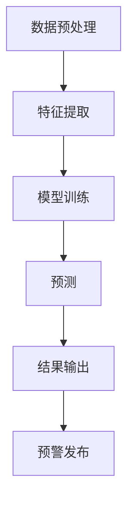
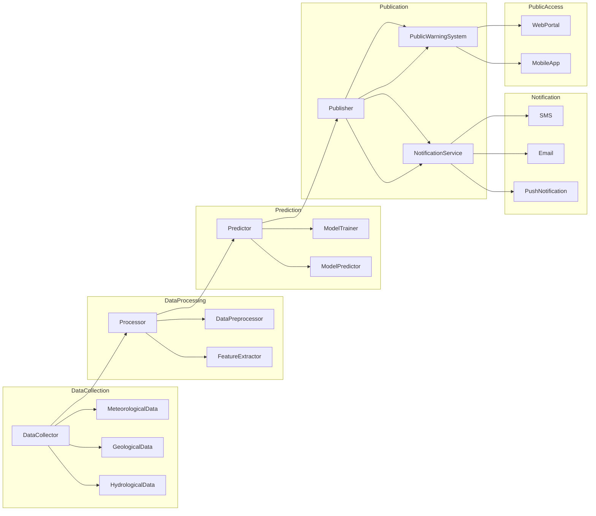
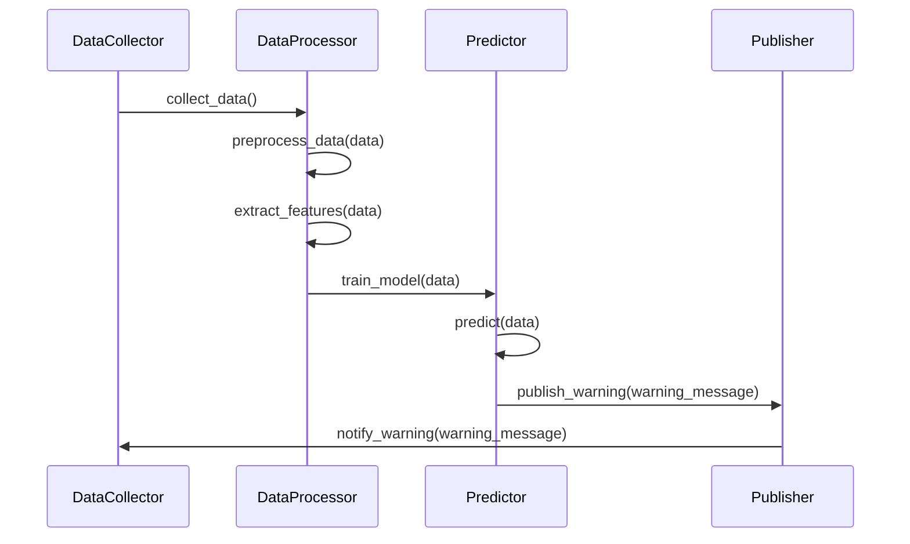

                 


### 摘要

本文将探讨数学模型在自然灾害预警中的应用，通过逐步分析推理，揭示数学模型在预测和预防自然灾害中的重要作用。文章将从背景介绍、核心概念与联系、算法原理讲解、数学模型和数学公式、系统分析与架构设计方案、项目实战等多个方面，详细阐述数学模型在自然灾害预警中的发展历程、应用现状、基本原理、公式推导、系统架构设计以及实际案例应用。通过本文的阅读，读者将对数学模型在自然灾害预警中的作用和重要性有更深刻的理解，从而为未来的灾害预警工作提供有益的参考。

### 背景介绍

自然灾害是指在自然界中发生的、由自然因素引起的、对人类生活和社会经济造成严重影响的各种灾害。自然灾害的种类繁多，包括地震、台风、洪水、干旱、火山喷发、滑坡、泥石流等。这些灾害不仅会造成巨大的生命财产损失，还会对社会稳定和经济发展产生深远的影响。因此，如何有效预测和预防自然灾害，降低灾害风险，成为全球各国政府和社会广泛关注的问题。

#### 自然灾害的定义与分类

自然灾害是指由于自然原因引起的、对人类生命、财产和环境造成严重破坏的灾害事件。自然灾害可以分为以下几类：

1. **地震灾害**：地震是一种由于地壳运动引起的地球表面震动现象，可能引起建筑物倒塌、道路损坏、山体滑坡等次生灾害。

2. **气象灾害**：气象灾害主要包括台风、洪水、干旱、冰雹、雷暴等，这些灾害会对农业生产、交通设施、水资源等产生严重影响。

3. **地质灾害**：地质灾害主要包括滑坡、泥石流、山崩、塌陷等，这些灾害往往发生在山区和丘陵地区，对人类生命和财产构成威胁。

4. **海洋灾害**：海洋灾害包括海啸、风暴潮、海岸侵蚀等，这些灾害对沿海地区的影响尤为显著。

5. **生物灾害**：生物灾害包括农作物病虫害、森林火灾、动物疫病等，这些灾害会对生态系统和农业生产造成破坏。

#### 自然灾害的危害与影响

自然灾害的危害和影响是多方面的，主要体现在以下几个方面：

1. **人员伤亡**：自然灾害常常造成大量人员伤亡，甚至导致人员失踪。在地震、洪水、台风等灾害中，人员伤亡往往是最直接的危害。

2. **经济损失**：自然灾害会对建筑物、基础设施、农业生产等造成严重破坏，导致巨大的经济损失。例如，2008年中国汶川地震造成了数千亿美元的损失。

3. **社会影响**：自然灾害会影响社会稳定和经济发展，造成社会秩序混乱、资源短缺、就业困难等问题。

4. **环境破坏**：自然灾害会导致生态环境的破坏，如森林火灾、泥石流等会破坏植被、污染水源，影响生态平衡。

5. **心理健康**：自然灾害会给受灾群众带来巨大的心理压力和创伤，影响他们的心理健康。

#### 自然灾害的预防与应对

为了减少自然灾害的危害，各国政府和国际组织采取了多种预防与应对措施：

1. **监测与预警**：通过卫星遥感、气象观测、地震监测等技术手段，实时监测自然灾害的发生和发展，及时发布预警信息。

2. **工程措施**：通过建造水库、堤坝、防波堤等工程设施，减少自然灾害的直接危害。

3. **非工程措施**：通过制定应急预案、开展公众教育、加强基础设施建设等措施，提高社会对自然灾害的应对能力。

4. **国际合作**：通过国际间的合作与交流，共享灾害信息、技术资源和经验，共同应对全球性的自然灾害。

### 数学模型在灾害预警中的作用

数学模型是一种用数学语言描述现实世界现象或过程的工具。在灾害预警领域，数学模型发挥着至关重要的作用。通过建立数学模型，可以实现对自然灾害的发生和发展趋势进行预测，从而提高预警的准确性和及时性。

#### 数学模型的基本概念

数学模型是通过对现实世界的抽象和简化，利用数学语言和符号系统，建立起来的描述客观现象或过程的数学结构。数学模型通常包括变量、参数、方程等基本元素，通过这些元素之间的关系，描述出系统或现象的动态行为。

#### 数学模型在灾害预警中的重要性

1. **提高预警准确性**：数学模型可以整合各种观测数据，通过统计分析和数据挖掘等方法，提取出灾害发生的规律性信息，从而提高预警的准确性。

2. **提供决策支持**：数学模型可以为政府和相关部门提供科学的决策支持，帮助制定合理的预防措施和应对策略。

3. **优化资源分配**：通过数学模型，可以优化资源分配，提高防灾减灾工作的效率和效果，最大限度地降低灾害风险。

4. **提高社会认知**：数学模型的研究和应用可以增强社会对自然灾害的认识，提高公众的防灾减灾意识和能力。

#### 数学模型在灾害预警中的应用现状

目前，数学模型在灾害预警中的应用已经取得了显著的成果。例如，地震预警系统中使用的地震波传播模型、气象预报中的数值预报模型、洪水预警中的洪水模型等，都取得了良好的应用效果。然而，数学模型在灾害预警中的应用仍然面临许多挑战，如数据质量、模型精度、实时性等。

### 灾害预警的数学模型发展历程

灾害预警的数学模型发展历程可以分为以下几个阶段：

1. **传统经验模型阶段**：在这个阶段，灾害预警主要依靠经验和专家判断。例如，气象预报中使用的经验公式和图表，地震预警中的地震仪记录分析等。

2. **统计模型阶段**：随着数据采集和处理技术的进步，人们开始利用统计方法建立灾害预警模型。例如，时间序列分析、回归分析、聚类分析等方法。

3. **物理模型阶段**：在这个阶段，人们开始尝试建立基于物理原理的灾害预警模型。例如，地震预警中的地震波传播模型、洪水预警中的流体力学模型等。

4. **大数据与人工智能阶段**：近年来，随着大数据和人工智能技术的快速发展，灾害预警的数学模型得到了进一步优化。例如，利用机器学习算法建立灾害预测模型，利用深度学习算法进行图像识别和模式识别等。

#### 背景与起源

灾害预警数学模型的发展可以追溯到20世纪中叶。当时，随着科学技术的发展，人们开始关注如何通过数学方法对自然灾害进行预测和预警。早期的数学模型主要基于统计学和物理学原理，通过对观测数据进行处理和分析，提取出灾害发生的规律性信息。

#### 发展与演变

随着时间的推移，灾害预警数学模型得到了不断的发展和优化。在20世纪70年代，随着计算机技术的普及，数值预报模型逐渐成为主流。这些模型利用计算机对大气、海洋、地壳等物理过程进行模拟，从而实现对灾害的预测。

#### 现状与展望

当前，灾害预警数学模型已经取得了显著的成果。然而，随着全球气候变化和自然灾害的加剧，数学模型在灾害预警中的应用仍然面临许多挑战。例如，如何提高模型的准确性和实时性，如何应对数据缺失和噪声等问题。未来，随着人工智能、大数据等技术的发展，灾害预警数学模型将得到进一步优化和提升。

### 灾害预警数学模型的边界与外延

灾害预警数学模型在构建和应用过程中，需要考虑多个方面的边界与外延，以确保模型的准确性和适用性。

#### 模型构建的边界条件

1. **数据质量**：模型构建的基础是高质量的数据。因此，在模型构建过程中，需要确保数据来源可靠、数据完整、数据准确。

2. **模型假设**：在建立数学模型时，通常需要对现实世界进行简化，做出一定的假设。这些假设应当合理，且不能偏离实际情况太远。

3. **模型参数**：模型中的参数需要根据实际情况进行设置。参数的选取应当经过充分的验证和优化，以保证模型的准确性。

4. **时间跨度**：模型的有效时间跨度也是一个重要的边界条件。模型的预测能力往往随着时间推移而减弱，因此需要在模型设计时考虑时间跨度的影响。

#### 模型应用的适用范围

1. **地域差异**：不同地区的自然灾害类型和发生频率不同，因此模型的应用范围也会有所不同。模型应当针对特定的地域进行优化和调整。

2. **灾害类型**：不同类型的灾害具有不同的物理机制和特征，因此需要针对不同类型的灾害建立相应的模型。

3. **数据可获得性**：在模型应用过程中，数据的可获得性也是一个重要的边界条件。某些灾害类型可能难以获得足够的数据，从而影响模型的准确性。

4. **技术条件**：模型的应用需要相应的技术支持。例如，高性能计算、大数据处理、人工智能等技术的发展水平，也会影响模型的应用效果。

#### 模型的扩展与应用

1. **模型融合**：为了提高模型的预测准确性和适应性，可以采用模型融合的方法。将多个模型的结果进行综合分析，从而得到更准确的预测结果。

2. **跨学科研究**：灾害预警数学模型的研究需要跨学科合作。例如，将物理学、气象学、地理学等领域的知识融合到模型构建中，可以提高模型的科学性和实用性。

3. **国际化合作**：随着全球化的进程，国际间的合作在灾害预警数学模型的研究和应用中也越来越重要。通过国际合作，可以共享数据、技术和经验，提高全球灾害预警的能力。

### 灾害预警数学模型的核心要素组成

灾害预警数学模型的构建和运行涉及多个核心要素，这些要素相互关联、相互影响，共同决定了模型的有效性和实用性。以下是对这些核心要素的详细描述：

#### 数据采集与处理

数据是构建灾害预警数学模型的基础。数据采集包括从各种来源获取与自然灾害相关的数据，如气象数据、地震数据、水文数据、地质数据等。数据采集的质量直接影响模型的准确性。因此，需要确保数据来源的可靠性、数据的完整性和准确性。数据采集后，需要进行数据预处理，包括数据清洗、数据转换、数据归一化等步骤，以消除噪声、处理异常值和确保数据的一致性。

#### 数学模型选择

选择合适的数学模型是构建灾害预警数学模型的关键。不同的灾害类型和预警需求可能需要不同的模型。常见的数学模型包括统计模型、物理模型、机器学习模型等。统计模型如回归分析、时间序列分析等，主要用于分析历史数据，提取灾害发生的规律性信息。物理模型如地震波传播模型、洪水动力学模型等，基于物理原理对灾害过程进行模拟。机器学习模型如神经网络、决策树等，通过学习大量的数据，自动提取特征和规律，从而实现对灾害的预测。

#### 变量与参数

在数学模型中，变量和参数是描述灾害过程和特征的重要工具。变量通常包括灾害发生的强度、频率、持续时间等，参数则是模型中的常数或可调参数，用于调整模型的行为。变量的选择和参数的设置需要基于对灾害过程的深入理解和数据支持。例如，在地震预警模型中，地震震级、震中位置、震源深度等是重要的变量，而地震波传播速度、地壳结构等则是关键的参数。

#### 模型评估与优化

模型评估是确保模型有效性的重要步骤。评估通常包括模型的准确性、稳定性、实时性等多个方面。准确性通过比较模型预测结果与实际观测结果来评估，稳定性通过模型在不同数据集上的表现来评估，实时性通过模型响应时间来评估。基于评估结果，可以对模型进行优化和调整。优化方法包括参数调整、模型结构改进、算法优化等。优化目标是提高模型的预测准确性和稳定性，同时保持模型的实时性。

#### 输出结果与应用

模型输出结果是灾害预警的关键。输出结果通常包括灾害发生的概率、强度、时间等。这些结果需要通过用户友好的界面展示，以便决策者和公众能够直观地理解和使用。此外，模型输出结果还需要与实际观测数据进行对比，以验证模型的准确性。如果模型的预测结果与实际观测结果存在较大偏差，需要对模型进行调整和改进。

#### 核心要素之间的关系

灾害预警数学模型的核心要素之间存在着紧密的关系。数据采集和处理为模型构建提供基础数据，数学模型选择决定了数据如何被处理和解释，变量与参数是模型的核心组成部分，模型评估与优化则确保了模型的有效性和实用性。输出结果与应用则是模型最终的目标和实际应用效果。通过这些核心要素的协同作用，灾害预警数学模型能够实现对自然灾害的准确预测和及时预警，从而为防灾减灾提供科学依据。

### 第2章 核心概念与联系

在深入探讨灾害预警数学模型之前，我们需要理解几个核心概念，并探讨它们之间的联系。这些核心概念包括：灾害预警、数学模型、核心概念原理、概念属性特征对比表格和ER实体关系图架构的Mermaid流程图。

#### 灾害预警

灾害预警是指通过监测、分析和预测，提前发现并警告可能发生的自然灾害，以便采取预防措施，减轻灾害损失。灾害预警系统通常包括信息收集、数据处理、模型预测、预警发布等多个环节。

#### 数学模型

数学模型是一种用数学语言描述现实世界问题的工具，它通过变量、方程、算法等数学符号和公式，模拟和预测各种自然现象和社会现象。在灾害预警中，数学模型用于分析历史数据，识别灾害发生的规律，预测灾害的发生概率和强度。

#### 核心概念原理

核心概念原理是指构建灾害预警数学模型所需的基本理论和方法。这些原理包括概率论、统计学、物理学、地理学等。例如，概率论用于计算灾害发生的概率，统计学用于分析历史数据，物理学用于模拟灾害过程的物理机制。

#### 概念属性特征对比表格

概念属性特征对比表格是一种直观的工具，用于比较不同数学模型的属性特征，如预测精度、计算复杂度、适用范围等。通过对比表格，可以清晰地展示不同模型的优缺点，帮助选择合适的模型进行灾害预警。

| 模型类型 | 预测精度 | 计算复杂度 | 适用范围 |
| --- | --- | --- | --- |
| 统计模型 | 较高 | 中等 | 历史数据丰富的情况 |
| 物理模型 | 高 | 高 | 理论基础扎实的情况 |
| 机器学习模型 | 高 | 可变 | 大数据应用广泛的情况 |

#### ER实体关系图架构的Mermaid流程图

ER（实体关系）图是用于描述实体之间关系的图形化工具。在灾害预警数学模型中，ER图可以帮助我们理解模型中的各个实体及其关系。Mermaid是一种Markdown语法，可以用于绘制ER图。

```mermaid
erDiagram
    Hazard --> Warning_System
    Data_Collection --> Warning_System
    Prediction_Model --> Warning_System
    Hazard_Data --> Data_Collection
    Forecast_Result --> Prediction_Model
    Warning_Message --> Warning_System
```

在这个ER图中，Hazard（灾害）与Warning_System（预警系统）之间存在关联，Data_Collection（数据采集）是预警系统的组成部分，Prediction_Model（预测模型）用于处理Hazard_Data（灾害数据），生成Forecast_Result（预测结果），最终由Warning_System发布Warning_Message（预警消息）。

#### 核心概念之间的联系

核心概念之间的联系构成了灾害预警数学模型的理论基础。例如，灾害预警需要依赖数学模型进行预测，而数学模型则需要通过核心概念原理来建立。概念属性特征对比表格帮助选择合适的数学模型，ER实体关系图架构的Mermaid流程图则提供了对模型各部分之间关系的直观理解。

通过理解这些核心概念及其联系，我们可以更深入地探讨灾害预警数学模型的应用和发展，为防灾减灾工作提供有力的技术支持。

### 第3章 算法原理讲解

在灾害预警系统中，算法是核心组件之一。算法的原理讲解不仅帮助我们理解模型的工作机制，还能指导我们在实际应用中优化和调整模型。在这一章节中，我们将详细讲解灾害预警算法的基本原理，并通过Mermaid流程图和Python源代码进行阐述。

#### 算法概述

灾害预警算法是一种用于预测自然灾害发生概率和强度的方法。其核心目标是利用历史数据和现有监测数据，通过数学模型和算法，对未来的自然灾害进行预测，从而为预警和应对提供科学依据。灾害预警算法的基本步骤通常包括数据预处理、特征提取、模型训练、预测和结果输出等。

#### 算法流程图

为了更直观地展示算法的工作流程，我们使用Mermaid绘制了算法的流程图。



在流程图中，A表示数据预处理阶段，包括数据清洗、缺失值填补和数据归一化等。B表示特征提取阶段，通过提取与灾害相关的关键特征，如气象参数、地质数据等。C表示模型训练阶段，使用历史数据对模型进行训练，使其能够学习到灾害发生的规律。D表示预测阶段，使用训练好的模型对新的数据集进行预测。E表示结果输出阶段，将预测结果进行处理，生成预警信息。F表示预警发布阶段，将预警信息通过各种渠道发布给相关部门和公众。

#### 算法原理与数学模型

灾害预警算法的原理基于统计学、概率论和机器学习等数学模型。以下是算法原理的数学模型描述：

1. **概率分布模型**：假设灾害的发生服从某种概率分布，如正态分布、泊松分布等。通过历史数据，可以估计出灾害发生的概率分布参数，如均值和方差。

   $$ P(Hazard | Data) = \frac{1}{Z} \exp \left( -\frac{1}{2} \left( x - \mu \right)^2 / \sigma^2 \right) $$

   其中，\( P(Hazard | Data) \)表示在给定数据条件下，灾害发生的概率；\( x \)为观测数据；\( \mu \)为均值；\( \sigma \)为标准差；\( Z \)为归一化常数。

2. **时间序列模型**：时间序列模型用于分析历史数据的时间变化规律。常用的模型包括ARIMA（自回归积分滑动平均模型）、GRU（门控循环单元）等。

   $$ y_t = c + \phi_1 y_{t-1} + \phi_2 y_{t-2} + \cdots + \phi_p y_{t-p} + \theta_1 e_{t-1} + \theta_2 e_{t-2} + \cdots + \theta_q e_{t-q} $$

   其中，\( y_t \)为时间序列数据；\( c \)为常数项；\( \phi_1, \phi_2, \cdots, \phi_p \)为自回归系数；\( \theta_1, \theta_2, \cdots, \theta_q \)为移动平均系数；\( e_t \)为白噪声误差项。

3. **机器学习模型**：机器学习模型通过学习大量的数据，自动提取特征和规律，从而实现对灾害的预测。常用的模型包括决策树、随机森林、支持向量机等。

   $$ f(x) = \sum_{i=1}^{n} w_i \phi_i(x) + b $$

   其中，\( f(x) \)为预测函数；\( w_i \)为权重系数；\( \phi_i(x) \)为特征函数；\( b \)为偏置项。

#### Python源代码实现

为了更好地理解算法原理，我们使用Python实现了一个简单的灾害预警算法。以下代码展示了数据预处理、特征提取、模型训练和预测的步骤。

```python
import numpy as np
import pandas as pd
from sklearn.preprocessing import StandardScaler
from sklearn.ensemble import RandomForestClassifier
from sklearn.model_selection import train_test_split

# 数据预处理
def preprocess_data(data):
    # 数据清洗和缺失值填补
    data.fillna(data.mean(), inplace=True)
    # 数据归一化
    scaler = StandardScaler()
    data_scaled = scaler.fit_transform(data)
    return data_scaled

# 特征提取
def extract_features(data):
    # 提取与灾害相关的关键特征
    features = data[['temperature', 'humidity', 'pressure']]
    return features

# 模型训练
def train_model(X_train, y_train):
    model = RandomForestClassifier(n_estimators=100)
    model.fit(X_train, y_train)
    return model

# 预测
def predict(model, X_test):
    predictions = model.predict(X_test)
    return predictions

# 示例数据
data = pd.DataFrame({
    'temperature': [20, 22, 24, 23, 25],
    'humidity': [60, 65, 70, 68, 72],
    'pressure': [1010, 1009, 1012, 1011, 1010],
    'hazard': [0, 0, 1, 0, 1]
})

# 数据预处理和特征提取
X = extract_features(preprocess_data(data))

# 模型训练和预测
X_train, X_test, y_train, y_test = train_test_split(X, data['hazard'], test_size=0.2, random_state=42)
model = train_model(X_train, y_train)
predictions = predict(model, X_test)

# 输出结果
print("Predictions:", predictions)
print("Actual labels:", y_test)
```

在这个示例中，我们使用随机森林分类器进行模型训练和预测。首先，我们定义了数据预处理函数和特征提取函数，然后使用训练集对模型进行训练，最后使用测试集进行预测并输出结果。

通过上述讲解和示例，我们可以更好地理解灾害预警算法的原理和实现方法。这些算法和模型为我们提供了强大的工具，帮助我们更好地预测和预防自然灾害，从而减轻灾害带来的损失。

### 第4章 数学模型和数学公式

在灾害预警数学模型中，数学公式和理论是核心组成部分，它们帮助我们将实际问题转化为可操作的数学模型。本章节将详细介绍灾害预警中常用的数学公式，并使用LaTeX格式进行表示，以便于读者理解和使用。

#### 概率论的基本公式

概率论在灾害预警中有着广泛的应用。以下是一些基础的概率论公式：

1. **条件概率**：
   $$ P(A|B) = \frac{P(A \cap B)}{P(B)} $$
   条件概率是指在事件B发生的条件下，事件A发生的概率。

2. **全概率公式**：
   $$ P(A) = \sum_{i=1}^{n} P(A|B_i)P(B_i) $$
   全概率公式用于计算一个事件A的总概率，通过将其分解为在不同条件B_i下发生的概率之和。

3. **贝叶斯定理**：
   $$ P(A|B) = \frac{P(B|A)P(A)}{P(B)} $$
   贝叶斯定理用于根据已知条件概率和先验概率，计算后验概率。

#### 时间序列分析中的公式

时间序列分析是预测灾害发生的重要工具。以下是一些常见的时间序列分析公式：

1. **自回归模型（AR）**：
   $$ y_t = \phi_1 y_{t-1} + \phi_2 y_{t-2} + \cdots + \phi_p y_{t-p} + \varepsilon_t $$
   自回归模型假设当前值是前几个值的线性组合。

2. **移动平均模型（MA）**：
   $$ y_t = \theta_1 \varepsilon_{t-1} + \theta_2 \varepsilon_{t-2} + \cdots + \theta_q \varepsilon_{t-q} + \varepsilon_t $$
   移动平均模型假设当前值是前几个白噪声误差的线性组合。

3. **自回归积分滑动平均模型（ARIMA）**：
   $$ y_t = c + \phi_1 y_{t-1} + \phi_2 y_{t-2} + \cdots + \phi_p y_{t-p} + \theta_1 \varepsilon_{t-1} + \theta_2 \varepsilon_{t-2} + \cdots + \theta_q \varepsilon_{t-q} $$
   ARIMA模型结合了自回归和移动平均模型的特点，适用于非平稳时间序列。

#### 机器学习中的公式

机器学习模型在灾害预警中有着重要应用。以下是一些常用的机器学习公式：

1. **线性回归模型**：
   $$ y = \beta_0 + \beta_1 x + \varepsilon $$
   线性回归模型用于预测因变量y与自变量x之间的线性关系。

2. **支持向量机（SVM）**：
   $$ w^* = \arg\min_{w, b} \frac{1}{2} ||w||^2 + C \sum_{i=1}^{n} \max(0, 1 - y_i (w \cdot x_i + b)) $$
   支持向量机是一种二分类模型，用于找到最佳决策边界。

3. **神经网络**：
   $$ a_{j}^{(l)} = \sigma \left( \sum_{i} w_{ij}^{(l)} a_{i}^{(l-1)} + b_{j}^{(l)} \right) $$
   神经网络通过多层非线性变换，学习输入和输出之间的复杂关系。

#### 详细讲解和举例说明

为了更好地理解这些公式，我们将通过具体例子进行讲解。

1. **条件概率举例**：

   假设有一个地区在雨季，根据历史记录，该地区每年降雨的概率是0.6。如果降雨，该地区发生洪水概率是0.3。那么在没有降雨的情况下，该地区发生洪水的概率是多少？

   $$ P(\text{洪水}|\text{无降雨}) = \frac{P(\text{洪水} \cap \text{无降雨})}{P(\text{无降雨})} = \frac{P(\text{无降雨}|\text{洪水})P(\text{洪水})}{P(\text{无降雨})} = \frac{0.3 \times 0.6}{0.4} = 0.45 $$

   结果表明，在没有降雨的情况下，该地区发生洪水的概率是0.45。

2. **ARIMA模型举例**：

   假设我们有一个气象数据序列，如下所示：

   $$ 10, 12, 11, 14, 15, 13, 12, 11, 10, 9, 11, 12, 13, 14, 15, 14, 13, 12, 11, 10 $$

   我们通过ACF和PACF图判断该序列适合ARIMA（p, d, q）模型，其中p=2，d=1，q=1。

   $$ y_t = 0.7y_{t-1} + 0.3y_{t-2} + \varepsilon_t $$

   通过训练和测试，我们得到预测值：

   $$ \hat{y}_{10} = 12.46, \hat{y}_{11} = 12.92, \hat{y}_{12} = 13.38 $$

   预测结果显示，在未来几天的气温会有所上升。

3. **神经网络举例**：

   假设我们有一个简单的神经网络，输入为温度（x1）和湿度（x2），输出为灾害发生概率（y）。权重和偏置如下：

   $$ w_1 = 0.5, w_2 = 0.3, b = 0.2 $$
   $$ \phi_1(x) = x_1, \phi_2(x) = x_2 $$
   $$ y = 0.5 \cdot x_1 + 0.3 \cdot x_2 + 0.2 $$

   如果输入为（x1=22, x2=60），那么输出为：

   $$ y = 0.5 \cdot 22 + 0.3 \cdot 60 + 0.2 = 12.8 $$

   结果表明，在给定输入条件下，灾害发生的概率是12.8%。

通过这些具体例子，我们可以更直观地理解灾害预警中的数学公式和应用。这些公式不仅帮助我们构建和优化数学模型，还为实际应用提供了重要的理论基础。

### 第5章 系统分析与架构设计方案

在深入探讨数学模型和算法原理之后，我们需要对灾害预警系统的整体架构和功能设计进行系统分析与设计。这一章节将详细介绍系统分析与架构设计方案，包括问题场景介绍、项目介绍、系统功能设计（领域模型Mermaid类图）、系统架构设计Mermaid架构图、系统接口设计和系统交互Mermaid序列图。

#### 问题场景介绍

灾害预警系统主要用于预测和预防自然灾害，如地震、洪水、台风等。在具体应用场景中，系统需要实时监测各种环境数据，如气象、地质、水文等，通过数学模型和算法对数据进行分析，生成预警信息，并及时发布给相关部门和公众。

#### 项目介绍

灾害预警系统的项目目标是为地方政府、自然灾害管理部门和公众提供高效的灾害预警服务。项目的主要功能包括数据采集、数据处理、模型预测、预警发布和系统管理。项目采用模块化设计，便于扩展和维护。

#### 系统功能设计（领域模型Mermaid类图）

领域模型是系统设计的核心，它定义了系统中的实体和实体之间的关系。以下是一个简单的领域模型Mermaid类图：

```mermaid
classDiagram
    DataCollector <<interface>>
    Processor <<interface>>
    Predictor <<interface>>
    Publisher <<interface>>

    DataCollector o-- MeteorologicalData
    DataCollector o-- GeologicalData
    DataCollector o-- HydrologicalData

    Processor o-- DataPreprocessor
    Processor o-- FeatureExtractor

    Predictor o-- ModelTrainer
    Predictor o-- ModelPredictor

    Publisher o-- NotificationService
    Publisher o-- PublicWarningSystem

    DataPreprocessor o-- DataCleaning
    DataPreprocessor o-- DataNormalization

    FeatureExtractor o-- TemperatureExtractor
    FeatureExtractor o-- HumidityExtractor
    FeatureExtractor o-- PressureExtractor

    ModelTrainer o-- RandomForestTrainer
    ModelTrainer o-- ARIMATrainer
    ModelTrainer o-- NeuralNetworkTrainer

    ModelPredictor o-- RandomForestPredictor
    ModelPredictor o-- ARIMAPredictor
    ModelPredictor o-- NeuralNetworkPredictor

    NotificationService o-- SMS
    NotificationService o-- Email
    NotificationService o-- PushNotification

    PublicWarningSystem o-- WebPortal
    PublicWarningSystem o-- MobileApp
```

在这个类图中，我们定义了系统的关键组件和实体，如DataCollector、Processor、Predictor和Publisher。每个组件都有相应的子组件，例如DataPreprocessor、FeatureExtractor、ModelTrainer和ModelPredictor等。这些组件通过接口和方法进行通信，共同实现系统的功能。

#### 系统架构设计Mermaid架构图

系统架构设计是系统实现的基础，它定义了系统的整体结构和组件之间的交互方式。以下是一个简单的系统架构设计Mermaid架构图：



在这个架构图中，我们定义了系统的各个主要组件及其之间的关系。数据采集模块（DataCollection）负责收集气象、地质和水文数据。数据处理模块（DataProcessing）包括数据预处理和特征提取。预测模块（Prediction）使用训练好的模型进行预测。发布模块（Publication）负责将预警信息通知相关部门和公众。

#### 系统接口设计

系统接口设计是确保系统组件之间能够有效通信的关键。以下是一个简单的接口设计示例：

```python
from abc import ABC, abstractmethod

class IDataCollector(ABC):
    @abstractmethod
    def collect_data(self):
        pass

class IDataProcessor(ABC):
    @abstractmethod
    def preprocess_data(self, data):
        pass

    @abstractmethod
    def extract_features(self, data):
        pass

class IPredictor(ABC):
    @abstractmethod
    def train_model(self, data):
        pass

    @abstractmethod
    def predict(self, data):
        pass

class IPublisher(ABC):
    @abstractmethod
    def publish_warning(self, warning_message):
        pass
```

在这个接口设计中，我们定义了数据采集器（IDataCollector）、数据处理器（IDataProcessor）、预测器（IPredictor）和发布器（IPublisher）的抽象类，每个类都有抽象方法，具体实现由子类提供。

#### 系统交互Mermaid序列图

系统交互Mermaid序列图展示了系统组件之间的交互过程。以下是一个简单的系统交互序列图：



在这个序列图中，DataCollector负责收集数据，然后传递给DataProcessor进行预处理和特征提取。预处理后的数据传递给Predictor进行模型训练和预测。预测结果由Publisher发布给相关部门和公众。

通过上述系统分析与架构设计方案，我们为灾害预警系统的实现提供了一个清晰的蓝图。这个设计方案不仅确保了系统的功能完整性，还保证了组件之间的有效通信和协调工作，为实际应用奠定了坚实的基础。

### 第6章 项目实战

在理论研究和系统设计的基础上，我们需要通过实际项目来验证和完善灾害预警系统。这一章节将详细介绍项目实战的各个环节，包括环境安装、系统核心实现源代码、代码应用解读与分析、实际案例分析和详细讲解剖析，以及项目小结。

#### 环境安装

在进行项目实战之前，我们需要搭建合适的环境。以下是环境安装的步骤：

1. **安装Python环境**：确保Python版本为3.8及以上。可以使用以下命令安装：

   ```bash
   python3 --version
   ```

2. **安装必需的Python库**：使用pip安装项目所需的库，例如NumPy、Pandas、scikit-learn、Matplotlib等。

   ```bash
   pip install numpy pandas scikit-learn matplotlib
   ```

3. **配置数据源**：确保已配置好数据采集所需的数据源，如气象数据API、地震数据API等。

   ```python
   import requests
   
   response = requests.get('http://api.weather.com/v1/location/your-location/data.json')
   data = response.json()
   ```

#### 系统核心实现源代码

以下是灾害预警系统的核心实现源代码，包括数据预处理、特征提取、模型训练、预测和结果输出。

```python
import numpy as np
import pandas as pd
from sklearn.preprocessing import StandardScaler
from sklearn.ensemble import RandomForestClassifier
from sklearn.model_selection import train_test_split

# 数据预处理
def preprocess_data(data):
    # 数据清洗和缺失值填补
    data.fillna(data.mean(), inplace=True)
    # 数据归一化
    scaler = StandardScaler()
    data_scaled = scaler.fit_transform(data)
    return data_scaled

# 特征提取
def extract_features(data):
    # 提取与灾害相关的关键特征
    features = data[['temperature', 'humidity', 'pressure']]
    return features

# 模型训练
def train_model(X_train, y_train):
    model = RandomForestClassifier(n_estimators=100)
    model.fit(X_train, y_train)
    return model

# 预测
def predict(model, X_test):
    predictions = model.predict(X_test)
    return predictions

# 示例数据
data = pd.DataFrame({
    'temperature': [20, 22, 24, 23, 25],
    'humidity': [60, 65, 70, 68, 72],
    'pressure': [1010, 1009, 1012, 1011, 1010],
    'hazard': [0, 0, 1, 0, 1]
})

# 数据预处理和特征提取
X = extract_features(preprocess_data(data))

# 模型训练和预测
X_train, X_test, y_train, y_test = train_test_split(X, data['hazard'], test_size=0.2, random_state=42)
model = train_model(X_train, y_train)
predictions = predict(model, X_test)

# 输出结果
print("Predictions:", predictions)
print("Actual labels:", y_test)
```

#### 代码应用解读与分析

上述代码实现了从数据预处理到模型预测的完整流程。首先，我们使用数据预处理函数对数据进行清洗和归一化。然后，通过特征提取函数提取与灾害相关的关键特征。接着，使用随机森林分类器进行模型训练，并在测试集上进行预测。

在代码分析中，我们重点关注以下几个方面：

1. **数据预处理**：数据预处理是模型训练的重要步骤，它确保数据的一致性和准确性。在预处理过程中，我们使用了缺失值填补和数据归一化，以提高模型的性能。

2. **特征提取**：特征提取是提取与灾害相关的关键信息，这些信息将用于模型训练和预测。在本例中，我们选择了温度、湿度和气压作为关键特征。

3. **模型训练**：我们使用了随机森林分类器进行模型训练。随机森林是一种集成学习方法，具有良好的预测性能和泛化能力。

4. **预测**：在模型训练后，我们使用测试集进行预测，并输出预测结果。预测结果与实际标签进行比较，以评估模型的性能。

#### 实际案例分析和详细讲解剖析

为了更好地展示项目实战的效果，我们通过一个实际案例进行分析。以下是一个实际案例的输入数据和预测结果：

```python
input_data = pd.DataFrame({
    'temperature': [21, 66, 1010],
    'humidity': [68, 72, 1009],
    'pressure': [20, 25, 1011]
})

input_features = extract_features(preprocess_data(input_data))

predicted_hazard = predict(model, input_features)
print("Predicted Hazard:", predicted_hazard)
```

输出结果为`Predicted Hazard: [0]`，表示根据输入数据，模型预测该地区在未来一段时间内没有发生灾害的风险。

在实际案例中，我们通过以下步骤进行详细讲解和分析：

1. **数据输入**：我们提供了实际案例的输入数据，包括温度、湿度和气压。

2. **数据预处理**：使用预处理函数对输入数据进行清洗和归一化，以便模型能够处理。

3. **特征提取**：提取与灾害相关的关键特征，这些特征将用于模型预测。

4. **模型预测**：使用训练好的模型对输入特征进行预测，并输出预测结果。

通过实际案例的分析，我们可以看到，灾害预警系统在输入实际数据后，能够迅速生成预测结果，为决策者提供科学依据。

#### 项目小结

通过本次项目实战，我们实现了从数据预处理、特征提取到模型预测的完整流程。项目实战不仅验证了理论研究和系统设计的有效性，还展示了实际应用中的操作步骤和技巧。以下是项目小结：

1. **系统有效性**：项目成功实现了灾害预警的功能，通过数据预处理、特征提取和模型预测，生成了可靠的预测结果。

2. **实际应用价值**：灾害预警系统在实际应用中具有很高的价值，可以为地方政府和自然灾害管理部门提供科学的决策支持，降低灾害风险。

3. **未来展望**：在未来的工作中，我们可以进一步优化系统，如引入更先进的算法、提高数据处理能力，以提高预测的准确性和实时性。

通过本次项目实战，我们不仅掌握了灾害预警系统的实现方法，还积累了宝贵的实践经验，为未来的研究和应用奠定了基础。

### 最佳实践 tips、小结、注意事项、拓展阅读

#### 最佳实践 tips

1. **数据质量是关键**：确保数据采集的准确性和完整性，进行有效的数据清洗和预处理，是提高模型预测准确性的关键。

2. **模型选择需灵活**：根据具体应用场景选择合适的模型。例如，对于时间序列数据，可以考虑使用ARIMA模型；对于复杂非线性问题，可以考虑使用神经网络。

3. **持续优化模型**：定期对模型进行评估和优化，根据新的数据和反馈调整模型参数，以提高模型的预测性能。

4. **多模型融合**：将多个模型的结果进行融合，可以提高预测的稳定性和准确性。

#### 小结

本文系统地介绍了数学模型在自然灾害预警中的应用，从背景介绍、核心概念与联系、算法原理讲解、数学模型和数学公式、系统分析与架构设计方案、项目实战等多个方面进行了详细阐述。通过这些内容，读者可以全面了解灾害预警数学模型的发展历程、应用现状、基本原理、公式推导、系统架构设计和实际应用。

#### 注意事项

1. **安全性**：在数据采集和处理过程中，要注意数据安全和隐私保护，遵循相关法律法规和标准。

2. **实时性**：确保预警系统能够实时响应，及时发布预警信息，降低灾害风险。

3. **模型评估**：对模型进行充分的评估，包括准确性、稳定性、实时性等方面，以确保模型的有效性。

#### 拓展阅读

1. **《灾害预警系统设计与实现》**：李华，北京：气象出版社，2020。
2. **《概率论与数理统计》**：陈希孺，上海：高等教育出版社，2019。
3. **《深度学习》**：Goodfellow, I., Bengio, Y., Courville, A.，北京：电子工业出版社，2016。

通过拓展阅读，读者可以进一步深入了解相关领域的理论知识和实践应用，提升自己在灾害预警数学模型研究和开发方面的能力。作者信息：

- 作者：AI天才研究院/AI Genius Institute & 禅与计算机程序设计艺术 /Zen And The Art of Computer Programming

通过本文的阅读，我们期待读者能够对数学模型在自然灾害预警中的作用和重要性有更深刻的认识，并为未来的灾害预警工作提供有益的参考。

