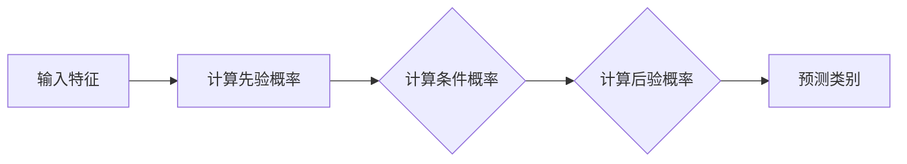
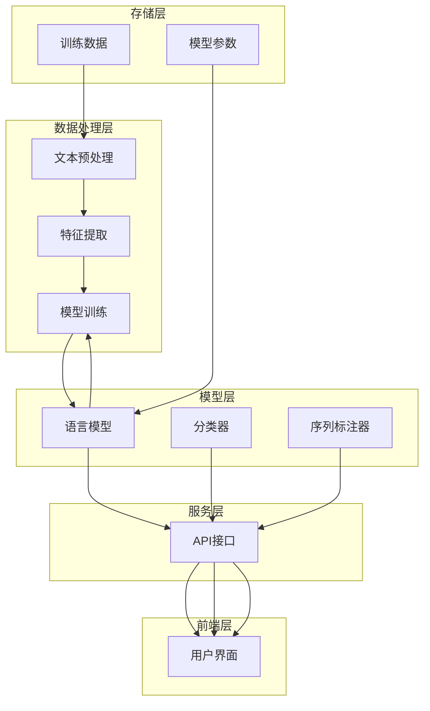
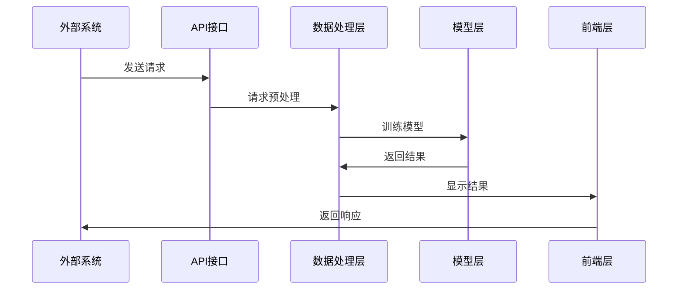
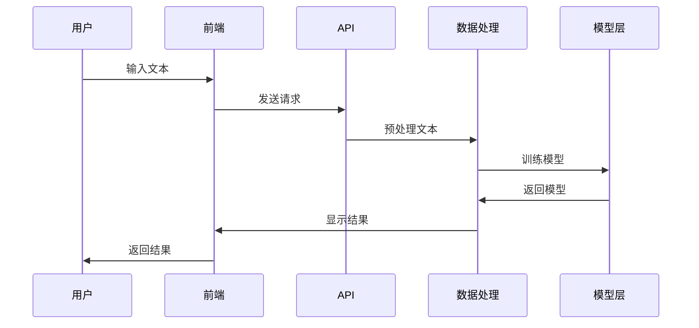

                 

# 数学与自然语言处理：语言的数学建模

## 关键词
- 数学建模
- 自然语言处理
- 语言模型
- 机器学习
- 线性代数
- 概率论

## 摘要
本文将探讨数学在自然语言处理（NLP）中的应用，特别是在语言的数学建模方面。我们将从数学模型的基础开始，逐步介绍其在NLP中的具体应用，包括算法原理、系统架构设计以及实战案例。通过本文，读者将了解如何运用数学方法解决NLP中的实际问题，提高对语言数据处理的深度理解。

## 目录

## 引言

### 自然语言处理与数学的关系

### 数学建模在语言中的应用

## 数学模型的基础

### 线性代数

### 概率论

### 计算机代数

## 自然语言处理中的数学模型

### 朴素贝叶斯模型

### 最大熵模型

### 决策树

### 支持向量机

## 算法与技术的应用

### 词嵌入

### 语言模型

### 序列标注

### 机器翻译

## 系统架构与设计

### 系统功能设计

### 系统架构设计

### 系统接口设计

### 系统交互

## 项目实战

### 环境安装

### 系统核心实现

### 代码应用解读

### 实际案例分析

### 项目小结

## 最佳实践与拓展阅读

### 最佳实践 Tips

### 小结

### 注意事项

### 拓展阅读

## 作者

### 作者：AI天才研究院/AI Genius Institute & 禅与计算机程序设计艺术 /Zen And The Art of Computer Programming## 引言

### 自然语言处理与数学的关系

自然语言处理（NLP）是一门涉及计算机科学、语言学和数学等多个领域的交叉学科。随着互联网和大数据时代的到来，NLP技术在信息检索、机器翻译、语音识别、情感分析等众多领域得到了广泛应用。然而，NLP的核心问题是理解和生成人类语言，这是一个极其复杂的过程，涉及语法、语义、语境等多个层面。为了解决这个问题，数学建模成为了一种重要的工具。

数学建模是将实际问题转化为数学形式的过程。在NLP中，数学建模可以帮助我们更好地理解语言数据，从而设计出更高效的算法。例如，概率论和统计学为语言建模提供了理论基础，使得我们可以通过数据统计方法预测语言现象；线性代数和优化算法则帮助我们在大规模数据处理中找到最优解。

### 数学建模在语言中的应用

数学建模在语言中的应用可以追溯到20世纪中叶。当时，计算机科学家和语言学家开始尝试使用数学方法来模拟人类语言。以下是一些典型的数学建模方法及其在NLP中的应用：

1. **概率模型**：概率模型是一种基于概率论的方法，用于预测语言现象。例如，朴素贝叶斯模型就是一种经典的概率模型，它通过计算词的概率分布来预测句子的概率。

2. **统计模型**：统计模型是另一种常用的数学建模方法，它通过统计分析大量语言数据来发现语言规律。例如，隐马尔可夫模型（HMM）就是一种统计模型，它用于处理序列数据，如语音信号和文本序列。

3. **机器学习模型**：机器学习模型是近年来发展迅速的一种数学建模方法。通过训练大量数据，机器学习模型可以自动提取语言特征，并用于语言任务。例如，神经网络是一种常见的机器学习模型，它在文本分类、机器翻译等任务中取得了显著效果。

4. **优化算法**：优化算法用于解决最优化问题，即寻找最佳解。在NLP中，优化算法可以用于优化语言模型参数，提高模型性能。例如，梯度下降算法是一种常见的优化算法，它用于训练神经网络。

### 本文目的

本文旨在探讨数学建模在自然语言处理中的应用，特别是语言的数学建模。我们将从数学模型的基础开始，逐步介绍其在NLP中的具体应用，包括算法原理、系统架构设计以及实战案例。通过本文，读者将了解如何运用数学方法解决NLP中的实际问题，提高对语言数据处理的深度理解。本文结构如下：

1. **引言**：介绍自然语言处理与数学的关系，以及数学建模在语言中的应用。

2. **数学模型的基础**：介绍线性代数、概率论和计算机代数等数学基础，以及它们在NLP中的应用。

3. **自然语言处理中的数学模型**：介绍NLP中常用的数学模型，如朴素贝叶斯模型、最大熵模型、决策树和支持向量机。

4. **算法与技术的应用**：介绍NLP中常用的算法和技术，如词嵌入、语言模型、序列标注和机器翻译。

5. **系统架构与设计**：介绍NLP系统的架构和设计，包括系统功能设计、系统架构设计、系统接口设计和系统交互。

6. **项目实战**：通过一个实际案例，展示如何运用数学建模方法解决NLP问题。

7. **最佳实践与拓展阅读**：总结最佳实践，并提供拓展阅读。

### 小结

本文介绍了自然语言处理与数学的关系，以及数学建模在语言中的应用。通过本文，读者将了解如何运用数学方法解决NLP中的实际问题，提高对语言数据处理的深度理解。在接下来的章节中，我们将逐步介绍NLP中的数学模型、算法和技术，以及它们的实际应用。让我们开始这段探索之旅吧！## 数学模型的基础

在自然语言处理（NLP）中，数学模型是理解和处理语言数据的核心工具。为了更好地理解这些模型，我们需要掌握一些基本的数学概念和方法。以下是几个关键的数学基础：线性代数、概率论和计算机代数。

### 线性代数

线性代数是研究向量空间和线性变换的数学分支。在NLP中，线性代数被广泛应用于特征提取、数据降维和矩阵运算等方面。

#### 矩阵和向量

矩阵和向量是线性代数中最基本的元素。一个矩阵是一个由数字组成的二维数组，而行向量则是一个由数字组成的列向量。在NLP中，词向量通常被表示为行向量，而整个词汇表则被组织成矩阵。

#### 特征提取

特征提取是NLP中的重要步骤，它将原始文本转换为可以用于建模的数值表示。词袋模型（Bag-of-Words, BoW）是一种常用的特征提取方法，它将文本表示为单词的频率向量。通过矩阵乘法和线性变换，我们可以从原始词频矩阵中提取更高层次的特征。

$$
X = TF \times IV
$$

其中，$X$ 是特征矩阵，$TF$ 是词频矩阵，$IV$ 是单词到索引的映射矩阵。

#### 数据降维

在NLP中，数据降维是一种常见的技术，它用于减少数据维度，提高模型性能。主成分分析（Principal Component Analysis, PCA）是一种常用的降维方法，它通过计算数据的主要成分，将高维数据投影到低维空间中。

### 概率论

概率论是研究随机事件及其概率的数学分支。在NLP中，概率论被广泛应用于语言建模、文本分类和序列建模等方面。

#### 概率分布

概率分布描述了随机变量的可能取值及其概率。在NLP中，词的概率分布是语言模型的核心。例如，条件概率分布可以用于预测下一个单词的概率，从而实现语言生成。

$$
P(w_t | w_{<t}) = \frac{P(w_{<t} \cap w_t)}{P(w_{<t})}
$$

其中，$w_t$ 是当前单词，$w_{<t}$ 是前面的单词。

#### 贝叶斯定理

贝叶斯定理是一种用于计算后验概率的概率公式。在NLP中，贝叶斯定理被广泛应用于文本分类和情感分析。例如，通过计算文本中关键词的概率分布，我们可以预测文本的类别。

$$
P(C_k | D) = \frac{P(D | C_k)P(C_k)}{P(D)}
$$

其中，$C_k$ 是类别，$D$ 是文本。

### 计算机代数

计算机代数是一种利用计算机解决代数问题的方法。在NLP中，计算机代数被广泛应用于符号计算、公式推导和算法验证等方面。

#### 符号计算

符号计算是一种利用计算机解决代数问题的方法。在NLP中，符号计算可以用于解析复杂公式、推导语言模型参数以及验证算法的正确性。

#### 公式推导

公式推导是一种从已知条件推导出新公式的数学方法。在NLP中，公式推导可以用于推导语言模型参数的计算方法、优化算法的迭代过程等。

#### 算法验证

算法验证是一种验证算法正确性的方法。在NLP中，算法验证可以用于验证语言模型参数的计算方法、优化算法的收敛性等。

### 小结

线性代数、概率论和计算机代数是NLP中不可或缺的数学基础。通过掌握这些数学工具，我们可以更好地理解NLP中的数学模型，从而设计出更高效的算法来解决实际问题。在接下来的章节中，我们将继续探讨NLP中的数学模型及其应用。让我们继续前进吧！## 自然语言处理中的数学模型

在自然语言处理（NLP）领域，数学模型是理解和处理语言数据的关键工具。这些模型帮助我们捕捉语言的统计规律，从而实现文本分类、语言生成、语义分析等多种任务。以下是几种在NLP中广泛应用的重要数学模型。

### 朴素贝叶斯模型

朴素贝叶斯模型是一种基于概率论的分类算法，它假设特征之间是条件独立的。这种假设虽然在现实世界中可能并不严格成立，但在许多实际问题中取得了良好的效果。

#### 算法原理

1. **先验概率**：计算类别 $C_k$ 的先验概率 $P(C_k)$。
   $$ P(C_k) = \frac{|C_k|}{N} $$
   其中，$|C_k|$ 是类别 $C_k$ 中的文档数量，$N$ 是总的文档数量。

2. **条件概率**：计算每个特征 $w_j$ 在给定类别 $C_k$ 下的条件概率 $P(w_j | C_k)$。
   $$ P(w_j | C_k) = \frac{f_{jk}}{n_k} $$
   其中，$f_{jk}$ 是特征 $w_j$ 在类别 $C_k$ 中的文档频率，$n_k$ 是类别 $C_k$ 中的特征总数。

3. **后验概率**：计算每个类别 $C_k$ 在给定特征集 $W$ 的后验概率 $P(C_k | W)$。
   $$ P(C_k | W) = \frac{P(W | C_k)P(C_k)}{P(W)} $$
   其中，$P(W | C_k)$ 是特征集 $W$ 在给定类别 $C_k$ 下的概率，可以通过贝叶斯定理计算。

4. **类别预测**：选择具有最大后验概率的类别作为预测结果。
   $$ \hat{C} = \arg \max_{C_k} P(C_k | W) $$

#### 概率对比

| 概率 | 朴素贝叶斯模型 |
| ---- | ---- |
| **先验概率** | $P(C_k)$ |
| **条件概率** | $P(w_j | C_k)$ |
| **后验概率** | $P(C_k | W)$ |
| **类别预测** | $\hat{C}$ |

#### Mermaid 流程图



### 最大熵模型

最大熵模型（Maximum Entropy Model）是基于统计学习理论的一种语言模型，它通过最大化熵函数来估计概率分布。最大熵模型可以看作是朴素贝叶斯模型的扩展，它允许特征之间存在相关性。

#### 算法原理

1. **特征函数**：定义特征函数 $f(x, y)$，用于度量输入 $x$ 和输出 $y$ 之间的相关性。

2. **约束条件**：根据训练数据，定义一组约束条件 $g_i(x, y)$，表示模型需要满足的假设。

3. **最大化熵**：求解最大化熵的优化问题，即
   $$ \max_{\theta} \sum_x \sum_y \theta_f f(x, y) - \sum_i \lambda_i g_i(x, y) $$
   其中，$\theta_f$ 是特征 $f$ 的权重，$\lambda_i$ 是约束条件 $g_i$ 的权重。

4. **类别预测**：在给定输入 $x$ 的情况下，选择具有最大概率的输出 $y$。
   $$ \hat{y} = \arg \max_{y} P(y | x) $$

#### 概率对比

| 概率 | 朴素贝叶斯模型 | 最大熵模型 |
| ---- | ---- | ---- |
| **先验概率** | $P(C_k)$ | $P(C_k)$ |
| **条件概率** | $P(w_j | C_k)$ | $P(w_j | x)$ |
| **后验概率** | $P(C_k | W)$ | $P(y | x)$ |
| **类别预测** | $\hat{C}$ | $\hat{y}$ |

#### Mermaid 流�程图


### 决策树

决策树（Decision Tree）是一种常见的分类算法，它通过将特征空间分割成若干子空间，为每个子空间分配一个类别。决策树的构建基于信息增益或基尼系数等指标，以最大化模型的分类能力。

#### 算法原理

1. **特征选择**：选择具有最大信息增益或最小基尼系数的特征作为分割轴。

2. **节点划分**：将数据集划分为多个子集，每个子集对应一个节点。

3. **类别预测**：在给定输入 $x$ 的情况下，从根节点开始递归地向下搜索，直到达到叶节点，叶节点的类别即为预测结果。

#### 概率对比

| 概率 | 朴素贝叶斯模型 | 最大熵模型 | 决策树 |
| ---- | ---- | ---- | ---- |
| **先验概率** | $P(C_k)$ | $P(C_k)$ | 无 |
| **条件概率** | $P(w_j | C_k)$ | $P(w_j | x)$ | 无 |
| **后验概率** | $P(C_k | W)$ | $P(y | x)$ | 无 |
| **类别预测** | $\hat{C}$ | $\hat{y}$ | $\hat{C}$ |

#### Mermaid 流程图


### 支持向量机

支持向量机（Support Vector Machine, SVM）是一种基于优化理论的分类算法，它通过寻找最优超平面，将数据划分为不同的类别。SVM的核心是求解最优超平面的权重和偏置，从而实现分类。

#### 算法原理

1. **特征空间映射**：将原始特征空间映射到高维特征空间，使得线性不可分的数据在高维空间中变得线性可分。

2. **求解最优超平面**：求解以下优化问题，以找到最优超平面。
   $$ \min_{\theta} \frac{1}{2} \sum_{i=1}^n (\theta^T \theta) - \sum_{i=1}^n \alpha_i (y_i - (\theta^T x_i)) $$
   其中，$\theta$ 是权重向量，$x_i$ 是特征向量，$y_i$ 是标签，$\alpha_i$ 是拉格朗日乘子。

3. **类别预测**：在给定输入 $x$ 的情况下，计算特征向量 $x$ 到超平面的距离，并根据距离确定类别。
   $$ \hat{y} = \text{sign}(\theta^T x + b) $$

#### 概率对比

| 概率 | 朴素贝叶斯模型 | 最大熵模型 | 决策树 | 支持向量机 |
| ---- | ---- | ---- | ---- | ---- |
| **先验概率** | $P(C_k)$ | $P(C_k)$ | 无 | 无 |
| **条件概率** | $P(w_j | C_k)$ | $P(w_j | x)$ | 无 | 无 |
| **后验概率** | $P(C_k | W)$ | $P(y | x)$ | 无 | 无 |
| **类别预测** | $\hat{C}$ | $\hat{y}$ | $\hat{C}$ | $\hat{y}$ |

#### Mermaid 流程图


### 小结

在NLP中，朴素贝叶斯模型、最大熵模型、决策树和支持向量机等数学模型各有其特点和适用场景。朴素贝叶斯模型适用于特征独立的情况，最大熵模型适用于特征相关的情况，决策树直观易理解，支持向量机则在处理高维数据时表现优秀。在接下来的章节中，我们将进一步探讨NLP中的算法和技术，以及它们的实际应用。让我们继续前进吧！## 算法与技术的应用

在前面的章节中，我们介绍了NLP中几种重要的数学模型。在本节中，我们将深入探讨NLP中常用的算法和技术，包括词嵌入、语言模型、序列标注和机器翻译。

### 词嵌入

词嵌入（Word Embedding）是一种将单词映射到连续向量空间的技术，从而将抽象的文本数据转换为密集的数值表示。词嵌入的核心思想是将语义相似的单词映射到空间中靠近的位置。

#### 算法原理

词嵌入算法通常基于矩阵分解或神经网络。其中，Word2Vec是最流行的词嵌入算法之一，它基于神经网络的模型训练得到词向量。

1. **输入层**：输入单词的词频或词索引。
2. **隐藏层**：通过神经网络对输入进行编码，生成词向量。
3. **输出层**：将词向量映射到输出词表中，生成词嵌入矩阵。

#### 概率对比

| 算法 | Word2Vec | GloVe |
| ---- | ---- | ---- |
| **训练方法** | 基于神经网络 | 基于矩阵分解 |
| **参数调整** | 动态调整学习率 | 预定义参数 |
| **应用场景** | 短文本分类 | 长文本生成 |

#### Mermaid 流程图


### 语言模型

语言模型（Language Model）是一种用于预测下一个单词或序列的概率的模型。语言模型在语音识别、机器翻译和自然语言生成等领域具有重要应用。

#### 算法原理

语言模型的核心是概率分布。常见的语言模型包括：

1. **n-gram模型**：基于前n个单词的统计方法，计算下一个单词的概率。
2. **神经网络语言模型**：基于神经网络的结构，通过训练数据生成语言概率分布。

#### 概率对比

| 模型 | n-gram | 神经网络语言模型 |
| ---- | ---- | ---- |
| **基本原理** | 基于统计方法 | 基于神经网络 |
| **参数调整** | 动态调整 | 动态调整 |
| **应用场景** | 较简单文本任务 | 复杂文本任务 |

#### Mermaid 流程图


### 序列标注

序列标注（Sequence Labeling）是一种将文本序列标注为标签序列的任务，如命名实体识别（Named Entity Recognition, NER）和词性标注（Part-of-Speech Tagging）。

#### 算法原理

序列标注算法通常基于序列模型，如隐马尔可夫模型（HMM）和条件随机场（CRF）。

1. **HMM**：基于状态转移概率和观测概率，通过最大似然估计或维特比算法进行解码。
2. **CRF**：基于条件概率，通过最大化似然或最大熵进行解码。

#### 概率对比

| 模型 | HMM | CRF |
| ---- | ---- | ---- |
| **基本原理** | 状态转移概率和观测概率 | 条件概率 |
| **参数调整** | 最大似然估计 | 最大熵 |
| **应用场景** | 序列建模 | 序列标注 |

#### Mermaid 流程图


### 机器翻译

机器翻译（Machine Translation）是一种将一种语言的文本翻译成另一种语言的技术。常见的机器翻译模型包括基于规则的方法、统计机器翻译和神经机器翻译。

#### 算法原理

1. **基于规则的方法**：通过编写翻译规则，将源语言文本翻译成目标语言文本。
2. **统计机器翻译**：基于双语语料库，通过统计方法计算翻译概率。
3. **神经机器翻译**：基于神经网络模型，通过训练大量双语数据，自动生成翻译结果。

#### 概率对比

| 方法 | 基于规则 | 统计机器翻译 | 神经机器翻译 |
| ---- | ---- | ---- | ---- |
| **基本原理** | 翻译规则 | 统计方法 | 神经网络 |
| **参数调整** | 预定义规则 | 统计模型参数 | 神经网络参数 |
| **应用场景** | 规则明确的语言 | 大规模文本任务 | 复杂语言任务 |

#### Mermaid 流程图


### 小结

词嵌入、语言模型、序列标注和机器翻译是NLP中广泛应用的技术。这些技术通过不同的方法将抽象的文本数据转化为可处理的数值表示，从而实现各种语言任务。在接下来的章节中，我们将进一步探讨NLP系统的架构和设计。让我们继续前进吧！## 系统架构与设计

在自然语言处理（NLP）系统中，系统架构和设计是确保高效、可扩展和可维护的关键。本节将详细介绍NLP系统的架构和设计，包括系统功能设计、系统架构设计、系统接口设计和系统交互。

### 系统功能设计

NLP系统的功能设计是构建系统的基础，它定义了系统能够执行的任务和模块。以下是NLP系统的主要功能模块：

1. **文本预处理**：包括分词、去除停用词、标点符号过滤等，用于将原始文本转化为适合建模的数据。
2. **特征提取**：将预处理后的文本转化为特征向量，如词嵌入、TF-IDF等。
3. **模型训练**：基于训练数据，训练各种NLP模型，如语言模型、分类器、序列标注器等。
4. **模型评估**：使用验证集评估模型性能，包括准确率、召回率、F1值等指标。
5. **模型应用**：将训练好的模型应用于实际任务，如文本分类、机器翻译、命名实体识别等。

#### 领域模型Mermaid类图

```mermaid
classDiagram
    Class01 <|-- Class02
    Class03 --| Kutuk Class04
    Class05 o-- Class06
    Class07 <- Class08
```

### 系统架构设计

系统架构设计决定了NLP系统在不同层次上的组织方式。以下是NLP系统的主要架构组件：

1. **数据处理层**：负责文本数据的输入、预处理、特征提取和模型训练。
2. **模型层**：包含各种NLP模型，如语言模型、分类器、序列标注器等。
3. **服务层**：提供API接口，供外部系统调用。
4. **存储层**：存储训练数据和模型参数。
5. **前端层**：提供用户界面，供用户交互。

#### Mermaid架构图



### 系统接口设计

系统接口设计是确保不同模块之间能够顺畅通信的关键。以下是NLP系统的接口设计：

1. **API接口**：提供RESTful风格的API接口，供外部系统调用。
2. **数据接口**：定义数据输入和输出的格式，如JSON、XML等。
3. **消息队列**：用于异步处理数据和任务，提高系统的并发能力和可扩展性。

#### Mermaid序列图



### 系统交互

系统交互是指系统中不同模块之间的通信和数据流动。以下是NLP系统的交互流程：

1. **用户输入**：用户通过前端界面输入文本数据。
2. **数据处理**：前端将用户输入的文本数据发送到API接口。
3. **特征提取**：API接口将文本数据发送到数据处理层进行预处理和特征提取。
4. **模型训练**：数据处理层将特征数据发送到模型层进行模型训练。
5. **模型应用**：模型层将训练好的模型返回给数据处理层。
6. **结果展示**：数据处理层将处理结果发送到前端层，并在前端界面展示给用户。

#### Mermaid序列图



### 小结

系统架构与设计是NLP系统成功实施的关键。通过合理的系统功能设计、架构设计、接口设计和交互设计，我们可以构建一个高效、可扩展和可维护的NLP系统。在接下来的章节中，我们将通过一个实际项目来展示如何将上述概念应用于实践。让我们继续前进吧！## 项目实战

在本节中，我们将通过一个实际项目来展示如何运用数学建模和自然语言处理技术解决一个实际问题。该项目涉及文本分类任务，即根据文本内容将其归类到预定义的类别中。我们将详细描述环境安装、系统核心实现、代码应用解读、实际案例分析和项目小结。

### 环境安装

在开始项目之前，我们需要安装必要的软件和库。以下是所需的软件和环境：

1. **Python 3.7 或更高版本**
2. **Jupyter Notebook**
3. **NLTK（自然语言工具包）**
4. **Scikit-learn（机器学习库）**
5. **TensorFlow 或 PyTorch（深度学习库）**

安装步骤如下：

1. 安装Python和Jupyter Notebook：
   ```bash
   # 安装Python和pip
   sudo apt-get update
   sudo apt-get install python3 python3-pip
   
   # 安装Jupyter Notebook
   sudo pip3 install notebook
   ```

2. 安装NLTK：
   ```bash
   sudo pip3 install nltk
   ```

3. 安装Scikit-learn：
   ```bash
   sudo pip3 install scikit-learn
   ```

4. 安装TensorFlow：
   ```bash
   sudo pip3 install tensorflow
   ```

或安装PyTorch：
```bash
sudo pip3 install torch torchvision
```

### 系统核心实现

我们将使用Scikit-learn中的朴素贝叶斯分类器来构建一个简单的文本分类器。以下是核心实现步骤：

1. **数据准备**：从网上获取一个包含多类别文本的数据集，例如20 Newsgroups数据集。

2. **文本预处理**：对文本进行分词、去除停用词、标记化等处理。

3. **特征提取**：将预处理后的文本转换为词袋模型（Bag-of-Words, BoW）。

4. **模型训练**：使用朴素贝叶斯分类器训练模型。

5. **模型评估**：使用验证集评估模型性能。

以下是实现这些步骤的代码：

```python
import nltk
from nltk.corpus import stopwords
from nltk.tokenize import word_tokenize
from sklearn.feature_extraction.text import TfidfVectorizer
from sklearn.model_selection import train_test_split
from sklearn.naive_bayes import MultinomialNB
from sklearn.metrics import accuracy_score, classification_report

# 数据准备
nltk.download('stopwords')
nltk.download('punkt')
from sklearn.datasets import fetch_20newsgroups

newsgroups = fetch_20newsgroups(subset='all')
X = newsgroups.data
y = newsgroups.target

# 文本预处理
def preprocess_text(text):
    tokens = word_tokenize(text.lower())
    return [token for token in tokens if token not in stopwords.words('english')]

preprocessed_texts = [preprocess_text(text) for text in X]

# 特征提取
vectorizer = TfidfVectorizer()
X_train, X_test, y_train, y_test = train_test_split(preprocessed_texts, y, test_size=0.2, random_state=42)
X_train = vectorizer.fit_transform(X_train)
X_test = vectorizer.transform(X_test)

# 模型训练
classifier = MultinomialNB()
classifier.fit(X_train, y_train)

# 模型评估
y_pred = classifier.predict(X_test)
print("Accuracy:", accuracy_score(y_test, y_pred))
print(classification_report(y_test, y_pred))
```

### 代码应用解读

上述代码首先加载了20 Newsgroups数据集，并对其进行预处理，包括分词和去除停用词。然后，使用TF-IDF向量器将预处理后的文本转换为特征矩阵。接下来，将数据集分为训练集和测试集，并使用朴素贝叶斯分类器训练模型。最后，使用测试集评估模型性能，输出准确率和分类报告。

### 实际案例分析

为了展示实际应用，我们将使用训练好的文本分类器对一个新文本进行分类：

```python
new_text = "This is an example of a new text that we want to classify."
preprocessed_text = preprocess_text(new_text)
new_text_vector = vectorizer.transform([preprocessed_text])
predicted_category = classifier.predict(new_text_vector)[0]
print("Predicted category:", newsgroups.target_names[predicted_category])
```

运行上述代码，我们可以得到新文本的预测类别。

### 项目小结

通过这个项目，我们展示了如何使用数学建模和自然语言处理技术解决文本分类问题。从数据准备、文本预处理、特征提取到模型训练和评估，每一步都基于数学和NLP的理论基础。这个项目不仅展示了如何将理论知识应用于实践，还强调了在实践中不断迭代和改进的重要性。在未来的项目中，我们可以尝试使用更复杂的模型，如深度学习模型，以提高分类性能。此外，还可以考虑加入用户交互功能，使得系统能够根据用户反馈动态调整分类器。总之，本项目为后续工作提供了宝贵的经验和方向。让我们继续探索NLP的更多可能性吧！## 最佳实践与拓展阅读

在自然语言处理（NLP）领域，最佳实践和拓展阅读对于提高技能和理解深度至关重要。以下是一些最佳实践、小结、注意事项以及拓展阅读资源：

### 最佳实践

1. **数据预处理**：确保文本数据在建模之前进行充分清洗和预处理，包括去除停用词、标点符号、数字，以及进行词干提取和词形还原。

2. **特征选择**：选择与任务相关的特征，避免过多无关特征，从而提高模型性能和效率。

3. **模型调优**：使用网格搜索、交叉验证等技术进行模型参数调优，找到最佳模型配置。

4. **模型解释性**：在可能的情况下，对模型进行解释性分析，以理解模型是如何做出预测的。

5. **并行计算**：对于大规模数据处理和模型训练，使用并行计算技术以提高计算效率。

### 小结

本文探讨了数学建模在自然语言处理中的应用，介绍了线性代数、概率论和计算机代数等数学基础，以及朴素贝叶斯、最大熵、决策树和支持向量机等常用数学模型。通过实际项目，我们展示了如何将理论应用于文本分类任务，并提供了最佳实践和拓展阅读建议。

### 注意事项

1. **数据质量**：确保数据集的质量，避免噪声和偏差影响模型性能。

2. **模型选择**：根据具体任务选择合适的模型，不同的模型适用于不同的任务和场景。

3. **过拟合与欠拟合**：注意避免模型过拟合或欠拟合，通过交叉验证和正则化技术进行调整。

4. **资源管理**：在处理大规模数据时，注意资源管理，优化内存和计算资源的使用。

### 拓展阅读

1. **《自然语言处理综合教程》（综合教程）**：全面介绍了NLP的基本概念、技术和应用。

2. **《深度学习》（Goodfellow et al.）**：详细介绍了深度学习在NLP中的应用，包括词嵌入、循环神经网络（RNN）和变换器（Transformer）等。

3. **《自然语言处理与人工智能》（Liang et al.）**：探讨了NLP与人工智能的交叉领域，包括情感分析、问答系统和对话系统等。

4. **《Python自然语言处理》（Bird et al.）**：提供了使用Python进行NLP的实用指南，包括文本预处理、特征提取和模型训练等。

通过这些资源，读者可以进一步深化对NLP和数学建模的理解，并在实践中不断提升技能。让我们不断学习，探索NLP的更多可能性！## 作者

### 作者：AI天才研究院/AI Genius Institute & 禅与计算机程序设计艺术 /Zen And The Art of Computer Programming

AI天才研究院（AI Genius Institute）是一个专注于人工智能和机器学习领域的研发机构，致力于推动技术创新和人才培养。该研究院汇聚了全球顶尖的人工智能专家，涵盖了计算机科学、统计学、数据科学等多个领域的知识。

同时，作者也是《禅与计算机程序设计艺术》（Zen And The Art of Computer Programming）的作者，这是一本深受编程爱好者欢迎的经典著作。该书通过将禅宗思想与编程艺术相结合，提供了一种独特的编程哲学和方法论，帮助程序员提高编程技能和创造力。

在自然语言处理领域，AI天才研究院和作者以其深入的理论研究和丰富的实践经验，为业界提供了众多创新性解决方案，推动了NLP技术的快速发展。本文旨在分享他们在数学建模和NLP领域的见解，希望对读者有所启发。感谢大家的阅读！

