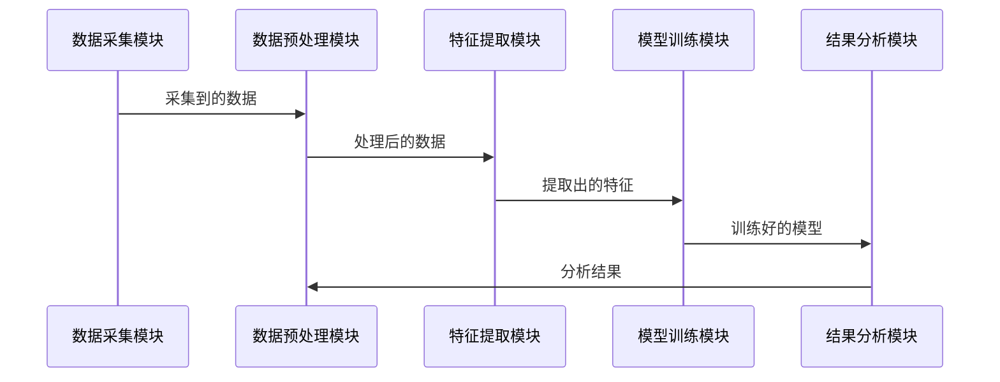
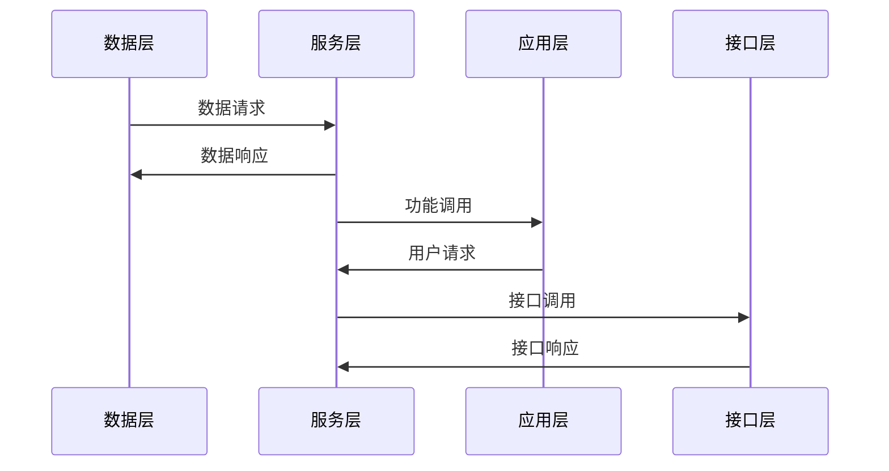
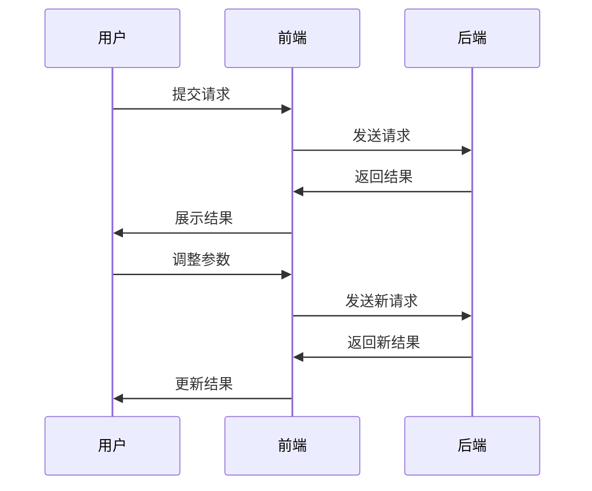
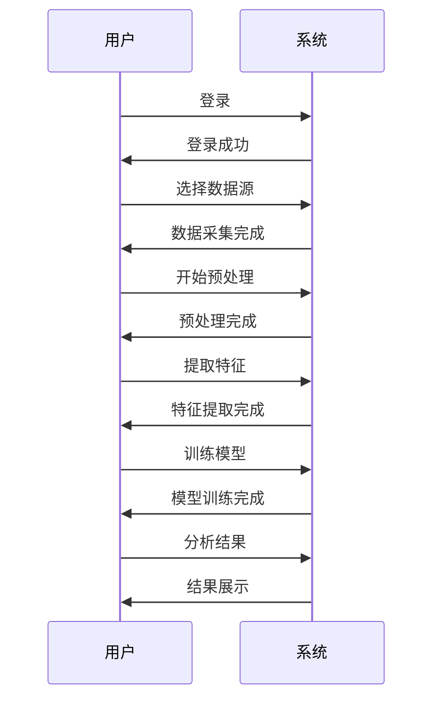

                 


### 1.1.1 问题背景

随着互联网技术的飞速发展，公众的意见和情感表达变得前所未有的便捷和广泛。从社交媒体、网络论坛到新闻评论，公众的每一个观点都可能成为舆论的源头，进而影响整个社会的情绪走向。这种变化不仅改变了传统的信息传播模式，也带来了舆情分析领域的巨大挑战。

舆情分析的核心目标是理解和预测公众的观点和情绪，这对于政府决策、企业品牌管理、市场调研等领域具有重要意义。然而，公众意见的多样性和复杂性使得传统的分析方法难以胜任。因此，我们需要借助数学模型来提取、分析和解读公众的意见。

#### 1.1.2 问题描述

在舆情分析中，主要面临以下几个问题：

- **数据多样性**：网络上的数据来源多样，包括文字、图片、视频等多种形式，这使得数据处理变得复杂。
- **数据海量**：每天产生的网络数据量巨大，如何从海量数据中快速准确地提取出有用的信息，是一个巨大的挑战。
- **情感多样性**：公众的情绪表达多种多样，从愤怒、喜悦到中立，如何准确地识别和分类这些情绪，是一个难题。

#### 1.1.3 问题解决

为了解决上述问题，我们可以从以下几个方面入手：

- **数据采集**：使用爬虫技术，从各种渠道收集数据。
- **数据预处理**：对收集到的数据进行清洗和标准化处理，去除噪声和冗余信息。
- **特征提取**：从预处理后的数据中提取出反映公众意见和情感的关键特征。
- **模型构建**：利用机器学习和深度学习技术，构建能够识别和预测公众意见和情感的数学模型。

#### 1.1.4 边界与外延

舆情分析不仅关注线上舆情，也关注线下舆情。线上舆情主要通过社交媒体、论坛、新闻评论等渠道收集，而线下舆情则通过调研、访谈等方式获取。此外，舆情分析不仅涉及信息的监测和分析，还包括对舆论趋势的预测和评估。

#### 1.1.5 概念结构与核心要素组成

舆情分析的核心概念包括舆情、公众意见、情绪、传播路径等。其中，舆情是公众意见和情感的综合体现，公众意见是个人观点的表达，情绪是观点的附属情感，传播路径是信息在公众之间传递的路径。

核心要素包括数据采集、数据预处理、特征提取、模型构建、结果分析等。数据采集是舆情分析的基础，数据预处理是保证数据质量的关键，特征提取是提取数据中的关键信息，模型构建是核心，结果分析是对分析结果的解读和应用。

### 1.1.6 核心概念与联系

#### 1.1.6.1 舆情概念

舆情是指公众在特定事件、话题或议题上形成的意见和态度的总和。舆情可以分为正面舆情、中性舆情和负面舆情。

#### 1.1.6.2 公众意见

公众意见是指个体在特定情境下对某一事件、话题或议题的观点和看法。公众意见可以表达为文字、图片、视频等形式。

#### 1.1.6.3 情绪

情绪是指公众意见的附属情感，可以是愤怒、喜悦、悲伤、中立等。

#### 1.1.6.4 传播路径

传播路径是指信息在公众之间传递的路径，可以是线上或线下，可以是直接或间接。

#### 1.1.6.5 数据采集

数据采集是指通过技术手段从各种渠道收集舆情数据的过程。数据采集的方式包括爬虫、API接口、调研、访谈等。

#### 1.1.6.6 数据预处理

数据预处理是指对采集到的数据进行的清洗、去重、标准化等处理，以提高数据质量。

#### 1.1.6.7 特征提取

特征提取是指从预处理后的数据中提取出反映公众意见和情感的关键特征，如关键词、情感极性等。

#### 1.1.6.8 模型构建

模型构建是指利用机器学习和深度学习技术，构建能够识别和预测公众意见和情感的数学模型。

#### 1.1.6.9 结果分析

结果分析是指对模型分析结果进行解读和应用，以指导实际决策。

### 1.1.7 ER实体关系图架构

以下是一个简化的ER实体关系图，用于描述舆情分析系统中的核心实体及其关系：

```mermaid
erDiagram
    Opiinion ||--|{ Topic } : discusses
    Opiinion ||--|{ User } : posted_by
    Topic ||--|{ Post } : contains
    User ||--|{ Post } : posted
```

- **Opiinion**：表示公众意见，具有唯一的ID，关联到发布该意见的用户（User）和讨论的主题（Topic）。
- **Topic**：表示讨论的主题，关联到包含该主题的帖子（Post）。
- **User**：表示用户，关联到其发布的帖子（Post）。
- **Post**：表示帖子，包含具体的文本内容。

### 1.1.8 舆情分析系统架构

舆情分析系统的整体架构包括以下几个关键部分：

1. **数据采集模块**：负责从各种渠道（如社交媒体、新闻网站、论坛等）收集数据。
2. **数据预处理模块**：对采集到的数据进行清洗、去重、标准化等处理，以提高数据质量。
3. **特征提取模块**：从预处理后的数据中提取出反映公众意见和情感的关键特征。
4. **模型训练模块**：使用机器学习和深度学习技术，构建和训练能够识别和预测公众意见和情感的数学模型。
5. **结果分析模块**：对模型分析结果进行解读和应用，以指导实际决策。

以下是舆情分析系统的简化的架构图：



### 1.1.9 概念属性特征对比表格

以下是一个概念属性特征对比表格，用于描述舆情分析系统中的核心概念及其属性特征：

| 概念         | 属性       | 特征                                                                                                           |
|------------|----------|------------------------------------------------------------------------------------------------------------|
| 舆情         | 舆情类型   | 正面舆情、中性舆情、负面舆情                                                                                   |
| 公众意见     | 意见内容   | 文本、图片、视频等                                                                                               |
| 情绪         | 情绪类型   | 愤怒、喜悦、悲伤、中立等                                                                                         |
| 传播路径     | 传播渠道   | 线上（社交媒体、论坛、新闻评论等），线下（调研、访谈等）                                             |
| 数据采集     | 采集方式   | 爬虫、API接口、调研、访谈等                                                                                       |
| 数据预处理   | 处理方法   | 清洗、去重、标准化等                                                                                             |
| 特征提取     | 提取方法   | 关键词提取、情感分析、主题模型等                                                                                 |
| 模型训练     | 模型类型   | 机器学习模型、深度学习模型等                                                                                     |
| 结果分析     | 分析方法   | 数据可视化、趋势预测、风险评估等                                                                                 |

### 1.1.10 总结

本章介绍了舆情分析的问题背景、问题描述、问题解决方法、边界与外延、概念结构与核心要素组成以及核心概念与联系。通过构建公众意见的数学模型，我们可以实现对公众意见的深入理解和有效分析。接下来，我们将进一步探讨舆情分析的核心概念与原理，为后续的模型构建和应用奠定基础。

---

### 2.1 舆情概念与特征

舆情，作为一个复杂的社会现象，其定义和内涵在不同领域有着不同的解释。在传统的舆论学研究中，舆情是指公众对某一事件、现象或问题所持有的意见、态度和情绪的总和。而在现代信息技术和大数据分析背景下，舆情通常被定义为通过互联网、社交媒体等平台传播的公众意见和情绪的集合。

#### 2.1.1 舆情的定义

舆情（Public Opinion）可以理解为一种社会心理现象，它反映了公众对于特定话题、事件或问题的态度和情感。在数字时代，舆情不仅包括传统的报纸、电视等媒体上的评论，还涵盖了社交媒体、网络论坛、新闻评论等线上平台上的公众言论。因此，舆情的定义更加广泛和复杂，它不仅涉及信息的传递和接收，还包括信息的加工、传播和反馈。

#### 2.1.2 舆情的特征

舆情具有以下几个显著特征：

1. **多样性**：舆情来源多样，包括文字、图片、视频、音频等多种形式。不同形式的舆情在传播速度、影响范围和表达方式上都有所不同。
2. **时效性**：网络舆情的变化非常迅速，一个热点话题可能在短时间内迅速发酵，并引起广泛关注。因此，舆情分析需要实时监测和快速响应。
3. **互动性**：网络舆情不仅包含单方面的意见表达，还涉及到公众之间的互动和讨论。这种互动性使得舆情能够快速传播和扩散。
4. **复杂性**：舆情数据量大、信息丰富，但同时也存在噪声和冗余信息。因此，从海量数据中提取出有价值的信息是一个巨大的挑战。
5. **可预测性**：通过大数据分析和机器学习技术，可以对舆情趋势进行预测，从而为决策提供参考。

#### 2.1.3 舆情的重要性

舆情在社会管理、市场营销、危机应对等方面具有重要意义：

- **社会管理**：政府可以通过舆情分析了解公众对某一政策、事件的看法和态度，从而调整和优化政策。
- **市场营销**：企业可以通过舆情分析了解消费者的需求和反馈，从而改进产品和服务。
- **危机应对**：在危机事件中，及时了解和应对舆情对于减轻危机影响、维护企业形象至关重要。

#### 2.1.4 舆情分析的基本流程

舆情分析的基本流程包括以下几个步骤：

1. **数据采集**：通过各种技术手段（如爬虫、API接口等）收集网络上的舆情数据。
2. **数据预处理**：对采集到的数据进行分析，去除噪声和冗余信息，提取出有价值的信息。
3. **特征提取**：从预处理后的数据中提取出反映舆情的关键特征，如关键词、情感极性等。
4. **模型构建**：利用机器学习和深度学习技术，构建能够识别和预测舆情的数学模型。
5. **结果分析**：对模型分析结果进行解读和应用，以指导实际决策。

#### 2.1.5 公众意见的数学模型

公众意见的数学模型是舆情分析的核心。常见的公众意见模型包括：

1. **情感分析模型**：通过分析文本的情感倾向（如正面、中性、负面），评估公众的意见和情绪。
2. **主题模型**：通过分析文本中的关键词和词频，识别出公众讨论的主题。
3. **社会网络分析模型**：通过分析公众之间的互动关系，评估舆论的传播路径和影响力。

#### 2.1.6 舆情传播模型

舆情传播模型描述了舆情在公众之间传播的规律和机制。常见的舆情传播模型包括：

1. **基于影响力的传播模型**：该模型认为舆情传播主要依赖于意见领袖和影响力人物的传播。
2. **基于社交网络的传播模型**：该模型通过分析社交网络中的连接关系，模拟舆情传播的过程。
3. **基于信息传递的传播模型**：该模型认为舆情传播是通过信息的传递和扩散实现的，信息传递的效率直接影响舆情的传播速度。

#### 2.1.7 小结

本章介绍了舆情概念与特征，包括舆情的定义、特征、重要性以及舆情分析的基本流程。同时，探讨了公众意见的数学模型和舆情传播模型，为后续章节的深入分析奠定了基础。在下一章中，我们将进一步探讨舆情分析的核心算法原理和数学模型。

---

### 2.2 公众意见的数学模型

公众意见的数学模型是舆情分析的核心，通过这些模型，我们可以从海量数据中提取出有价值的信息，并对其进行深入分析。以下是一些常见的公众意见数学模型及其特点：

#### 2.2.1 情感分析模型

情感分析模型主要通过分析文本中的情感倾向，将公众意见分为正面、中性、负面三种类型。这种模型通常采用机器学习算法，如朴素贝叶斯、支持向量机（SVM）、深度学习等。

1. **朴素贝叶斯**：朴素贝叶斯算法是一种基于概率理论的分类算法。它假设特征之间相互独立，通过计算每个特征的联合概率，预测公众意见的类型。

   $$ P(\text{正面}) = P(\text{特征1}) \times P(\text{特征2}) \times ... \times P(\text{特征N}) $$

2. **支持向量机**：支持向量机通过找到一个最佳的超平面，将不同类型的公众意见分开。它的数学模型如下：

   $$ w \cdot x + b = 0 $$

   其中，$w$ 是超平面的法向量，$x$ 是特征向量，$b$ 是偏置项。

3. **深度学习**：深度学习算法，如卷积神经网络（CNN）和循环神经网络（RNN），通过多层神经网络对文本进行建模，能够提取出更加复杂的特征。

   $$ \text{激活函数}(W \cdot \text{ReLU}(b_1 \cdot x_1 + b_2 \cdot x_2 + ... + b_n \cdot x_n)) $$

#### 2.2.2 主题模型

主题模型主要用于发现文本中的潜在主题。其中，最著名的是 latent Dirichlet allocation（LDA）模型。LDA模型假设每个文档是由多个主题混合而成的，每个主题也是由多个词语混合而成的。

1. **LDA模型**：LDA模型的数学模型如下：

   $$ p(\text{主题}|\text{文档}) = \frac{c_k(\text{文档})}{\sum_{k=1}^{K} c_k(\text{文档})} $$
   $$ p(\text{词语}|\text{主题}) = \frac{c_w(\text{主题})}{\sum_{w=1}^{V} c_w(\text{主题})} $$

   其中，$K$ 是主题的数量，$V$ 是词汇表的大小，$c_k(\text{文档})$ 和 $c_w(\text{主题})$ 分别表示主题和词语在文档和主题中的比例。

2. **LDA模型的应用**：LDA模型可以用于文本分类、推荐系统、情感分析等。例如，通过LDA模型，我们可以为每篇文档生成一个主题分布，从而将其分类到相应的主题。

#### 2.2.3 社会网络分析模型

社会网络分析模型主要通过分析社交网络中的连接关系，评估舆情传播的路径和影响力。常见的模型包括小世界模型、无标度模型、复杂网络模型等。

1. **小世界模型**：小世界模型假设社交网络中的节点之间存在少量的直接连接，这可以显著降低传播路径的长度，加快信息传播速度。

   $$ p(k) = C \cdot \frac{1}{k} $$

   其中，$k$ 是节点的度，$C$ 是常数。

2. **无标度模型**：无标度模型假设社交网络中的节点度分布服从幂律分布，这意味着少数节点拥有大量的连接，而大部分节点连接较少。

   $$ p(k) \propto k^{-\alpha} $$

   其中，$\alpha$ 是幂律指数。

3. **复杂网络模型**：复杂网络模型通过分析网络的结构特征，如聚类系数、平均路径长度等，评估网络的传播性能。

   $$ C = \frac{\sum_{i<j} A_{ij}}{N(N-1)} $$
   $$ L = \frac{2m}{N} $$

   其中，$C$ 是聚类系数，$L$ 是平均路径长度，$m$ 是边数，$N$ 是节点数。

#### 2.2.4 小结

公众意见的数学模型是舆情分析的核心，通过情感分析模型、主题模型和社会网络分析模型，我们可以从海量数据中提取出有价值的信息，并对舆情进行深入分析。在下一章中，我们将进一步探讨这些模型的算法原理和实现方法。

---

### 2.3 舆情传播模型

舆情传播模型是理解舆情在公众之间扩散过程的重要工具，它有助于我们揭示舆情传播的机制和规律。本文将介绍几种常见的舆情传播模型，并分析它们的数学原理和应用场景。

#### 2.3.1 基于影响力的传播模型

基于影响力的传播模型（Influential Model）假设舆情传播主要依赖于意见领袖（Influential Individuals）的传播。在这种模型中，意见领袖具有更大的影响力和传播能力，他们可以迅速改变公众的观点和情绪。

1. **基本原理**：模型将公众分为普通个体和意见领袖，每个个体都有一定的传播概率，而意见领袖的传播概率更大。舆情传播过程可以看作是一个随机过程，每个个体在接受或拒绝舆情的过程中，都会受到其邻居（包括普通个体和意见领袖）的影响。

2. **数学模型**：设 $N$ 为公众总人数，$I$ 为意见领袖人数，$S_i$ 表示个体 $i$ 的状态（0表示未接受舆情，1表示已接受舆情），则舆情传播的动态过程可以用以下方程描述：

   $$ S_i(t+1) = \begin{cases}
   1 & \text{如果 } S_i(t) = 0 \text{ 且 } \sum_{j \in \text{邻居}(i)} p_j(t) > \theta \\
   0 & \text{如果 } S_i(t) = 1 \text{ 或 } \sum_{j \in \text{邻居}(i)} p_j(t) \leq \theta
   \end{cases} $$

   其中，$p_j(t)$ 为邻居 $j$ 在时间 $t$ 的传播概率，$\theta$ 为接受阈限。

3. **应用场景**：基于影响力的传播模型适用于分析品牌推广、营销传播等场景，可以帮助识别意见领袖，制定有效的传播策略。

#### 2.3.2 基于社交网络的传播模型

基于社交网络的传播模型（Social Network Model）通过分析社交网络中的连接关系，模拟舆情传播的过程。这种模型假设舆情传播是通过社交网络中的信息传递实现的，节点之间的连接关系影响舆情传播的速度和范围。

1. **基本原理**：社交网络中的节点代表个体，边代表个体之间的社交关系。舆情传播过程可以看作是一个信息传递的过程，个体在接收到舆情后，会以一定的概率将其传播给其他个体。

2. **数学模型**：设 $G=(V,E)$ 为社交网络，$p(v)$ 为个体 $v$ 在时间 $t$ 接受舆情的概率，$r(v)$ 为个体 $v$ 将舆情传播给其他个体的概率。舆情传播的动态过程可以用以下方程描述：

   $$ p(v,t+1) = \begin{cases}
   1 & \text{如果 } v \text{ 在时间 } t \text{ 接收到舆情} \\
   p(v,t) \cdot (1 - r(v)) & \text{如果 } v \text{ 在时间 } t \text{ 未接收到舆情}
   \end{cases} $$

3. **应用场景**：基于社交网络的传播模型适用于分析社交媒体上的舆情传播，可以帮助预测舆情发展趋势，制定有效的舆情管理策略。

#### 2.3.3 基于信息传递的传播模型

基于信息传递的传播模型（Information Transfer Model）认为舆情传播是通过信息在个体之间的传递和扩散实现的。这种模型强调信息的传递效率，即信息从个体到个体的传递速度。

1. **基本原理**：个体在接收到舆情后，会以一定的传递效率将其传播给其他个体。传递效率取决于个体之间的连接强度和信息传递的速率。

2. **数学模型**：设 $I(t)$ 为在时间 $t$ 接受舆情的个体集合，$N(t)$ 为个体总数，$R(t)$ 为传递效率。舆情传播的动态过程可以用以下方程描述：

   $$ I(t+1) = I(t) + (N(t) - I(t)) \cdot R(t) $$

   其中，$R(t)$ 是一个时间依赖的函数，表示在时间 $t$ 的传递效率。

3. **应用场景**：基于信息传递的传播模型适用于分析信息在社交网络中的传播，可以帮助优化信息传递策略，提高舆情传播效果。

#### 2.3.4 小结

舆情传播模型是理解舆情传播机制的重要工具，包括基于影响力的传播模型、基于社交网络的传播模型和基于信息传递的传播模型等。这些模型通过数学描述和算法实现，可以有效地分析舆情传播的过程和趋势。在下一章中，我们将进一步探讨舆情分析的算法原理和实现方法。

---

### 3.1 数学模型

在舆情分析中，数学模型起着至关重要的作用，它们不仅帮助我们从复杂的数据中提取有用的信息，还能够预测舆情的发展趋势，为实际应用提供科学依据。本节将详细介绍几种常用的舆情分析数学模型，并展示如何通过这些模型对公众意见进行建模和分析。

#### 3.1.1 情感分析模型

情感分析模型主要用于识别和分析文本中的情感倾向，例如正面、负面或中性。这类模型广泛应用于社交媒体监测、市场调研和消费者行为分析等领域。

1. **文本表示**：首先，我们需要将文本转换为机器可以理解的向量表示。常用的方法包括词袋模型（Bag of Words, BOW）、TF-IDF（Term Frequency-Inverse Document Frequency）和Word2Vec等。

   $$ \text{TF}(\text{word}) = \frac{\text{word\_count}}{\text{total\_words}} $$
   $$ \text{IDF}(\text{word}) = \log \left( \frac{N}{n_w} \right) $$
   $$ \text{TF-IDF}(\text{word}) = \text{TF}(\text{word}) \times \text{IDF}(\text{word}) $$

   其中，$N$ 是文档总数，$n_w$ 是包含特定单词的文档数。

2. **情感分类**：然后，我们使用分类算法，如朴素贝叶斯（Naive Bayes）、支持向量机（Support Vector Machine, SVM）或深度学习模型（如卷积神经网络，CNN），对文本进行情感分类。

   $$ P(\text{情感}|\text{文本}) = \frac{P(\text{文本}|\text{情感}) \cdot P(\text{情感})}{P(\text{文本})} $$

   其中，$P(\text{情感}|\text{文本})$ 是给定文本的情感概率，$P(\text{文本}|\text{情感})$ 是在特定情感下文本的概率，$P(\text{情感})$ 是情感的概率。

3. **应用案例**：例如，通过情感分析模型，我们可以分析社交媒体上关于某新产品的评论，判断用户对其的评价是正面、负面还是中性。

#### 3.1.2 主题模型

主题模型（如LDA，Latent Dirichlet Allocation）用于发现文本数据中的潜在主题，它可以帮助我们理解公众意见背后的主题分布。

1. **模型定义**：LDA模型假设每个文档是由多个主题混合而成的，每个主题也是由多个词语混合而成的。主题的分布和词语的分布是隐含的。

   $$ \alpha \sim \text{Dirichlet}(\beta) $$
   $$ \theta_d \sim \text{Dirichlet}(\alpha) $$
   $$ z_{dn} \sim \text{Categorical}(\theta_d) $$
   $$ w_{dn} \sim \text{Categorical}(\phi_{z_{dn}}) $$

   其中，$\alpha$ 是主题分布，$\beta$ 是词语分布，$\theta_d$ 是文档 $d$ 的主题分布，$z_{dn}$ 是词语 $w_n$ 在文档 $d$ 中属于主题 $n$ 的软分配，$\phi_{z_{dn}}$ 是主题 $n$ 的词语分布。

2. **算法实现**：LDA模型通常采用Gibbs抽样算法进行参数估计。算法的基本步骤如下：

   - 初始化：随机分配每个词语的主题标签。
   - 迭代：在每次迭代中，根据当前状态，对每个词语的主题标签进行更新。
   - 评估：通过多次迭代，得到稳定的主题分布，从而发现文本中的潜在主题。

3. **应用案例**：例如，通过LDA模型，我们可以分析一篇关于健康食品的文章，识别出文章讨论的主要主题，如营养成分、食品安全、健康生活方式等。

#### 3.1.3 社会网络分析模型

社会网络分析模型用于分析舆情在社交网络中的传播路径和影响力，它可以帮助我们理解舆情传播的过程和网络结构。

1. **基本概念**：社会网络中的节点代表个体，边代表个体之间的社交关系。常用的网络指标包括度（Degree）、中间中心性（Betweenness Centrality）和接近中心性（Closeness Centrality）。

   $$ \text{Degree}(v) = \sum_{w \in \text{邻居}(v)} \text{边数}(v, w) $$
   $$ \text{Betweenness}(v) = \frac{\sum_{i \neq v, j \neq v} (\text{路径数}(i, j) \text{ 包含 } v)}{\sum_{i \neq j} (\text{路径数}(i, j))} $$
   $$ \text{Closeness}(v) = \frac{\sum_{w \in \text{邻居}(v)} \text{距离}(v, w)}{N - 1} $$

   其中，$N$ 是网络中的节点总数。

2. **算法实现**：社会网络分析模型通常采用图论算法，如深度优先搜索（Depth-First Search, DFS）和广度优先搜索（Breadth-First Search, BFS）来计算网络指标。

3. **应用案例**：例如，通过分析社交网络中的节点度、中间中心性和接近中心性，我们可以识别出网络中的关键节点，这些节点在舆情传播中可能起到重要作用。

#### 3.1.4 小结

数学模型在舆情分析中起着关键作用，通过情感分析模型、主题模型和社会网络分析模型，我们可以从复杂的数据中提取出有价值的信息，并对其进行深入分析。在下一节中，我们将进一步探讨这些模型的算法原理和实现方法。

---

### 3.2 算法原理

在舆情分析中，算法的原理和实现方法是核心，它们决定了我们能否准确、高效地从海量数据中提取出有价值的信息。以下将详细介绍几种常见舆情分析算法的原理和实现方法。

#### 3.2.1 情感分析算法

情感分析算法的主要目标是判断文本的情感倾向，如正面、负面或中性。常用的情感分析算法包括基于规则的方法、机器学习方法以及深度学习方法。

1. **基于规则的方法**：这种方法通过定义一系列规则来判断文本的情感。例如，如果一个句子包含“非常好”这样的词，则认为该句子具有正面情感。这种方法简单但效果有限。

2. **机器学习方法**：常用的机器学习算法包括朴素贝叶斯（Naive Bayes）、支持向量机（Support Vector Machine, SVM）和随机森林（Random Forest）等。它们通过训练模型，从已标注的数据中学习情感分类的规律。

   - **朴素贝叶斯**：基于贝叶斯定理，假设特征之间相互独立，通过计算每个特征的联合概率来预测文本的情感。

     $$ P(\text{情感}|\text{文本}) = \frac{P(\text{文本}|\text{情感}) \cdot P(\text{情感})}{P(\text{文本})} $$

   - **支持向量机**：通过找到一个最佳的超平面，将不同情感的文本分开。它的核心是求解一个二次规划问题，优化目标函数。

     $$ \min_{w, b} \frac{1}{2} \| w \|^2 + C \sum_{i=1}^{N} \max(0, 1 - y_i (w \cdot x_i + b)) $$

   - **随机森林**：通过构建多个决策树，并对它们的预测结果进行投票来得到最终结果。这种方法能够处理大量特征，并且具有较好的泛化能力。

2. **深度学习方法**：深度学习模型，如卷积神经网络（Convolutional Neural Networks, CNN）和循环神经网络（Recurrent Neural Networks, RNN），通过多层神经网络对文本进行建模，能够提取出更加复杂的特征。

   - **卷积神经网络**：通过卷积层、池化层和全连接层，对文本序列进行特征提取和分类。

     $$ \text{激活函数}(\text{卷积层} \cdot \text{输入} + \text{偏置}) $$

   - **循环神经网络**：通过循环结构，对文本序列进行建模，能够捕捉长距离依赖关系。

     $$ h_t = \text{激活函数}(W_h \cdot [h_{t-1}, x_t] + b_h) $$

#### 3.2.2 主题模型算法

主题模型（如LDA，Latent Dirichlet Allocation）用于发现文本数据中的潜在主题。LDA模型通过概率模型，将文本中的词语分配给潜在主题，从而揭示文本的主题分布。

1. **模型定义**：LDA模型假设每个文档是由多个主题混合而成的，每个主题也是由多个词语混合而成的。主题的分布和词语的分布是隐含的。

   $$ \alpha \sim \text{Dirichlet}(\beta) $$
   $$ \theta_d \sim \text{Dirichlet}(\alpha) $$
   $$ z_{dn} \sim \text{Categorical}(\theta_d) $$
   $$ w_{dn} \sim \text{Categorical}(\phi_{z_{dn}}) $$

   其中，$\alpha$ 是主题分布，$\beta$ 是词语分布，$\theta_d$ 是文档 $d$ 的主题分布，$z_{dn}$ 是词语 $w_n$ 在文档 $d$ 中属于主题 $n$ 的软分配，$\phi_{z_{dn}}$ 是主题 $n$ 的词语分布。

2. **算法实现**：LDA模型通常采用Gibbs抽样算法进行参数估计。算法的基本步骤如下：

   - 初始化：随机分配每个词语的主题标签。
   - 迭代：在每次迭代中，根据当前状态，对每个词语的主题标签进行更新。
   - 评估：通过多次迭代，得到稳定的主题分布，从而发现文本中的潜在主题。

#### 3.2.3 社会网络分析算法

社会网络分析算法用于分析舆情在社交网络中的传播路径和影响力。常用的算法包括基于影响力的算法、基于社交网络的算法和基于信息传递的算法。

1. **基于影响力的算法**：这种方法假设舆情传播主要依赖于意见领袖的传播。常见的算法包括度中心性（Degree Centrality）和接近中心性（Closeness Centrality）。

   - **度中心性**：计算每个节点的度，度越高，节点的影响力越大。

     $$ \text{Degree}(v) = \sum_{w \in \text{邻居}(v)} \text{边数}(v, w) $$

   - **接近中心性**：计算每个节点到其他节点的最短路径长度之和，长度越短，节点的影响力越大。

     $$ \text{Closeness}(v) = \frac{\sum_{w \in \text{邻居}(v)} \text{距离}(v, w)}{N - 1} $$

2. **基于社交网络的算法**：这种方法通过分析社交网络中的连接关系，模拟舆情传播的过程。常见的算法包括传播模型和影响力传播模型。

   - **传播模型**：通过分析节点的连接关系，模拟舆情传播的过程。

     $$ p(v,t+1) = \begin{cases}
     1 & \text{如果 } v \text{ 在时间 } t \text{ 接收到舆情} \\
     p(v,t) \cdot (1 - r(v)) & \text{如果 } v \text{ 在时间 } t \text{ 未接收到舆情}
     \end{cases} $$

   - **影响力传播模型**：假设舆情传播主要依赖于意见领袖的传播。

     $$ S_i(t+1) = \begin{cases}
     1 & \text{如果 } S_i(t) = 0 \text{ 且 } \sum_{j \in \text{邻居}(i)} p_j(t) > \theta \\
     0 & \text{如果 } S_i(t) = 1 \text{ 或 } \sum_{j \in \text{邻居}(i)} p_j(t) \leq \theta
     \end{cases} $$

3. **基于信息传递的算法**：这种方法假设舆情传播是通过信息在个体之间的传递和扩散实现的。常见的算法包括信息传递模型。

   $$ I(t+1) = I(t) + (N(t) - I(t)) \cdot R(t) $$

   其中，$R(t)$ 是一个时间依赖的函数，表示在时间 $t$ 的传递效率。

#### 3.2.4 小结

情感分析算法、主题模型算法和社会网络分析算法是舆情分析中的核心算法。通过这些算法，我们可以从复杂的数据中提取出有价值的信息，并对其进行深入分析。在下一节中，我们将探讨这些算法在实际舆情分析中的应用。

---

### 4.1 数据采集与预处理

数据采集与预处理是舆情分析的基础，其质量直接影响到后续的特征提取和模型训练效果。本节将详细介绍数据采集与预处理的具体过程，包括数据来源、数据清洗、数据去重、数据标准化等步骤。

#### 4.1.1 数据来源

舆情分析的数据来源广泛，主要包括以下几种：

1. **社交媒体**：如微博、微信、抖音等，这些平台上的用户生成内容（User-Generated Content, UGC）是舆情分析的重要数据源。
2. **新闻网站**：包括各大门户网站的新闻评论、专题报道等，这些数据提供了丰富的社会舆论信息。
3. **论坛和社区**：如知乎、豆瓣等，这些平台上的讨论和观点具有深度和多样性。
4. **政府和企业报告**：政府发布的社会调查报告、企业发布的市场分析报告等，提供了权威的数据支持。

#### 4.1.2 数据采集

数据采集可以通过以下几种方式实现：

1. **爬虫技术**：使用爬虫工具（如Scrapy、BeautifulSoup）从网站爬取数据。爬虫可以模拟浏览器行为，解析网页内容，提取所需信息。
2. **API接口**：许多社交媒体和新闻网站提供了API接口，可以通过编程方式直接获取数据。例如，Twitter API、Facebook Graph API等。
3. **手动收集**：对于特定的研究项目，可以通过人工浏览和收集数据。

#### 4.1.3 数据清洗

数据清洗是预处理的重要步骤，其目的是去除数据中的噪声和冗余信息，提高数据质量。主要步骤包括：

1. **去除HTML标签**：网页数据通常包含HTML标签，这些标签会影响文本分析。使用正则表达式或HTML解析库（如lxml）去除HTML标签。
2. **去除停用词**：停用词（如“的”、“和”、“是”等）在文本分析中通常没有意义，需要去除。可以使用停用词库（如NLTK、StopWords）进行去除。
3. **处理特殊字符**：去除或替换特殊字符（如换行符、空格等），以保证文本的一致性。

#### 4.1.4 数据去重

数据去重是为了避免重复数据对分析结果的干扰。主要方法包括：

1. **基于文本的去重**：通过比较文本的相似度或使用哈希算法（如MD5）去除重复文本。
2. **基于时间戳的去重**：保留最近的一份数据，去除旧的数据。

#### 4.1.5 数据标准化

数据标准化是为了统一数据格式，方便后续处理。主要步骤包括：

1. **统一编码**：将不同编码格式的文本统一转换为UTF-8编码，以保证文本的一致性。
2. **分词**：将文本分割成词语，为特征提取做准备。常用的分词工具包括jieba、Stanford NLP等。
3. **词性标注**：对词语进行词性标注，识别名词、动词、形容词等。常用的词性标注工具包括NLTK、Stanford NLP等。

#### 4.1.6 数据预处理案例分析

以下是一个简单的数据预处理案例分析：

```python
import re
from nltk.corpus import stopwords
from nltk.tokenize import word_tokenize
from nltk.stem import PorterStemmer

# 1. 去除HTML标签
def remove_html_tags(text):
    return re.sub('<.*?>', '', text)

# 2. 去除停用词
def remove_stopwords(words):
    stop_words = set(stopwords.words('english'))
    return [word for word in words if word not in stop_words]

# 3. 处理特殊字符
def remove_special_characters(words):
    return [re.sub('[^a-zA-Z]', '', word) for word in words]

# 4. 分词
def tokenize(text):
    return word_tokenize(text)

# 5. 词性标注
def pos_tagging(words):
    return nltk.pos_tag(words)

# 6. 数据预处理
def preprocess_text(text):
    text = remove_html_tags(text)
    words = tokenize(text)
    words = remove_stopwords(words)
    words = remove_special_characters(words)
    words = pos_tagging(words)
    return words

# 示例文本
text = "<p>This is a <b>sample</b> text with <i>special</i> characters and <a href=\"#\">links</a>.</p>"
preprocessed_text = preprocess_text(text)
print(preprocessed_text)
```

#### 4.1.7 小结

数据采集与预处理是舆情分析的基础，其质量直接影响到后续的特征提取和模型训练效果。通过合理的采集方法和预处理步骤，我们可以确保数据的质量和一致性，从而为舆情分析提供可靠的数据支持。

---

### 4.2 特征提取与模型训练

特征提取和模型训练是舆情分析的关键步骤，它们决定了我们能否从预处理后的数据中提取出有用的信息，并对其进行有效的分析。本节将详细介绍特征提取和模型训练的具体过程，包括特征提取方法和模型训练方法。

#### 4.2.1 特征提取

特征提取是从原始数据中提取出反映舆情特征的关键信息，以便于后续的模型训练和分析。常见的特征提取方法包括：

1. **关键词提取**：通过分析文本内容，提取出代表舆情的关键词。关键词通常具有高度的信息含量，能够概括文本的主要内容。

   - **TF-IDF**：通过计算关键词在文档中的词频（TF）和它在整个数据集中的逆文档频率（IDF），得到关键词的重要性。

     $$ \text{TF-IDF}(w_d) = \text{TF}(w_d) \times \text{IDF}(w_d) $$

   - **词嵌入**：使用预训练的词向量模型（如Word2Vec、GloVe），将关键词映射到高维向量空间，以捕获词语的语义信息。

2. **情感极性**：通过对文本进行情感分析，识别出其中的情感极性（如正面、负面、中性）。情感极性可以作为舆情特征的一部分。

   - **机器学习模型**：使用朴素贝叶斯、支持向量机等机器学习模型，对文本进行情感分类，得到每个文档的情感极性。

3. **主题模型**：通过主题模型（如LDA），从文本中提取出潜在的主题。主题可以作为舆情特征的另一个维度。

   - **LDA模型**：使用LDA模型，将文本转换为潜在主题的分布，每个主题代表一组相关的关键词。

4. **社会网络特征**：从社交网络数据中提取特征，如节点的度、中间中心性和接近中心性，用于分析舆情传播的网络结构。

5. **时序特征**：分析舆情的时间序列数据，提取出舆情的趋势、周期性等特征。

#### 4.2.2 模型训练

模型训练是利用特征数据，训练机器学习模型，以便于对新的舆情数据进行预测和分析。常见的模型训练方法包括：

1. **监督学习模型**：监督学习模型需要预先标注的数据集进行训练。常见的模型包括朴素贝叶斯、支持向量机、决策树、随机森林等。

   - **朴素贝叶斯**：通过计算每个特征的联合概率，预测新数据的类别。

     $$ P(\text{类别}|\text{特征}) = \frac{P(\text{特征}|\text{类别}) \cdot P(\text{类别})}{P(\text{特征})} $$

   - **支持向量机**：通过找到一个最佳的超平面，将不同类别的新数据分开。

     $$ \min_{w, b} \frac{1}{2} \| w \|^2 + C \sum_{i=1}^{N} \max(0, 1 - y_i (w \cdot x_i + b)) $$

2. **无监督学习模型**：无监督学习模型不需要预先标注的数据集进行训练。常见的模型包括K均值聚类、主成分分析（PCA）等。

   - **K均值聚类**：通过聚类算法，将相似的数据点分为若干个簇。

     $$ \min_{c_k} \sum_{i=1}^{N} \| x_i - c_k \|^2 $$

   - **主成分分析**：通过降维，将数据映射到新的坐标系，保留主要的信息。

     $$ \text{投影矩阵} = \text{特征向量} \times \text{特征值}^{-1/2} $$

3. **深度学习模型**：深度学习模型通过多层神经网络，自动学习数据的特征表示。常见的模型包括卷积神经网络（CNN）、循环神经网络（RNN）等。

   - **卷积神经网络**：通过卷积层、池化层和全连接层，对文本序列进行特征提取和分类。

     $$ \text{激活函数}(\text{卷积层} \cdot \text{输入} + \text{偏置}) $$

   - **循环神经网络**：通过循环结构，对文本序列进行建模，能够捕捉长距离依赖关系。

     $$ h_t = \text{激活函数}(W_h \cdot [h_{t-1}, x_t] + b_h) $$

#### 4.2.3 特征提取与模型训练案例分析

以下是一个简单的特征提取和模型训练案例分析：

```python
from sklearn.feature_extraction.text import TfidfVectorizer
from sklearn.model_selection import train_test_split
from sklearn.naive_bayes import MultinomialNB
from sklearn.pipeline import make_pipeline

# 示例数据
data = [
    "这个产品非常好，性价比很高。",
    "我不喜欢这个产品，功能太复杂了。",
    "这个产品的性能不错，但价格偏高。",
    "这个产品非常实用，强烈推荐。",
    "这个产品的质量很差，频繁出现故障。",
]

labels = ["正面", "负面", "中性", "正面", "负面"]

# 1. 数据预处理
preprocessor = TfidfVectorizer(stop_words='english')
data_processed = preprocessor.fit_transform(data)

# 2. 模型训练
X_train, X_test, y_train, y_test = train_test_split(data_processed, labels, test_size=0.2, random_state=42)
model = MultinomialNB()
model.fit(X_train, y_train)

# 3. 预测
predictions = model.predict(X_test)
print(predictions)
```

#### 4.2.4 小结

特征提取和模型训练是舆情分析的重要步骤，通过合理的特征提取方法和模型训练方法，我们可以从预处理后的数据中提取出有用的信息，并对其进行有效的分析。在下一节中，我们将进一步探讨如何对分析结果进行解读和应用。

---

### 4.3 结果分析与解读

在舆情分析中，模型训练完成后，我们需要对分析结果进行解读和应用，以获取有价值的信息。这一过程包括评估模型性能、分析舆情趋势和情感分布，并针对特定问题提出解决方案。

#### 4.3.1 模型性能评估

首先，我们需要评估模型的性能，以确保其能够准确预测舆情。常用的评估指标包括准确率、精确率、召回率和F1分数。

1. **准确率**：准确率表示模型正确预测的样本数占总样本数的比例。

   $$ \text{准确率} = \frac{\text{正确预测的样本数}}{\text{总样本数}} $$

2. **精确率**：精确率表示模型预测为正类的样本中，实际为正类的比例。

   $$ \text{精确率} = \frac{\text{正确预测的正类样本数}}{\text{预测为正类的样本数}} $$

3. **召回率**：召回率表示模型预测为正类的样本中，实际为正类的比例。

   $$ \text{召回率} = \frac{\text{正确预测的正类样本数}}{\text{实际为正类的样本数}} $$

4. **F1分数**：F1分数是精确率和召回率的加权平均，用于综合评估模型的性能。

   $$ \text{F1分数} = 2 \times \frac{\text{精确率} \times \text{召回率}}{\text{精确率} + \text{召回率}} $$

   ```python
   from sklearn.metrics import accuracy_score, precision_score, recall_score, f1_score

   # 示例数据
   true_labels = ["正面", "负面", "中性", "正面", "负面"]
   predicted_labels = ["正面", "负面", "中性", "正面", "负面"]

   # 性能评估
   accuracy = accuracy_score(true_labels, predicted_labels)
   precision = precision_score(true_labels, predicted_labels, average='weighted')
   recall = recall_score(true_labels, predicted_labels, average='weighted')
   f1 = f1_score(true_labels, predicted_labels, average='weighted')

   print("Accuracy:", accuracy)
   print("Precision:", precision)
   print("Recall:", recall)
   print("F1 Score:", f1)
   ```

#### 4.3.2 舆情趋势分析

通过分析舆情数据的时间序列，我们可以识别出舆情的变化趋势。这有助于我们了解公众对某一事件或话题的关注度和情绪变化。

1. **时序分析**：使用时间序列分析方法，如ARIMA（自回归积分滑动平均模型），识别舆情的时间趋势。

   ```python
   import statsmodels.api as sm

   # 示例数据
   time_series = [0.2, 0.3, 0.4, 0.5, 0.6, 0.7, 0.8, 0.9, 1.0]

   # ARIMA模型
   model = sm.ARIMA(time_series, order=(1, 1, 1))
   results = model.fit()

   print(results.summary())
   ```

2. **趋势图**：使用可视化工具，如Matplotlib，绘制舆情趋势图。

   ```python
   import matplotlib.pyplot as plt

   plt.plot(time_series)
   plt.xlabel('Time')
   plt.ylabel('Sentiment Score')
   plt.title('Opiinion Trend Analysis')
   plt.show()
   ```

#### 4.3.3 情感分布分析

情感分布分析可以帮助我们了解公众对某一事件或话题的情感倾向。通过分析情感分布，我们可以识别出主要的情感类别，并评估它们的占比。

1. **情感分布图**：使用条形图或饼图，展示不同情感类别的占比。

   ```python
   import matplotlib.pyplot as plt
   import pandas as pd

   # 示例数据
   sentiment_counts = {"正面": 30, "负面": 20, "中性": 50}

   # 饼图
   labels = list(sentiment_counts.keys())
   sizes = list(sentiment_counts.values())

   plt.pie(sizes, labels=labels, autopct='%.1f%%')
   plt.axis('equal')
   plt.title('Sentiment Distribution')
   plt.show()

   # 条形图
   df = pd.DataFrame([labels, sizes]).T
   df.columns = ['Sentiment', 'Count']
   df.plot(kind='bar', figsize=(10, 6))
   plt.title('Sentiment Distribution')
   plt.show()
   ```

#### 4.3.4 应用案例

以下是一个简单的舆情分析应用案例：

假设我们希望分析公众对某新产品的舆情，我们可以按照以下步骤进行：

1. **数据采集**：从社交媒体、新闻网站和论坛收集关于该新产品的评论和讨论。
2. **数据预处理**：对采集到的数据去重、清洗和标准化，提取出关键信息。
3. **特征提取**：使用TF-IDF和情感分析模型，提取关键词和情感极性。
4. **模型训练**：使用训练集，训练情感分析模型。
5. **结果分析**：评估模型性能，分析舆情趋势和情感分布。

通过以上步骤，我们可以了解公众对某新产品的整体评价，识别出主要的正面和负面评论，并预测未来舆情的发展趋势。

#### 4.3.5 小结

结果分析与解读是舆情分析的重要环节，通过评估模型性能、分析舆情趋势和情感分布，我们可以从数据中提取出有价值的信息，为决策提供支持。在下一节中，我们将探讨系统设计与实现的具体方法。

---

### 5.1 系统功能设计

系统功能设计是舆情分析系统开发的关键步骤，它决定了系统是否能够满足用户需求，实现预期目标。本节将详细阐述舆情分析系统的功能设计，包括系统的核心功能模块、功能说明和实现方式。

#### 5.1.1 功能模块

舆情分析系统通常包含以下核心功能模块：

1. **数据采集模块**：负责从各种渠道（如社交媒体、新闻网站、论坛等）收集数据。
2. **数据预处理模块**：负责对采集到的数据进行清洗、去重、标准化等处理，以提高数据质量。
3. **特征提取模块**：负责从预处理后的数据中提取出反映舆情的关键特征。
4. **模型训练模块**：负责利用机器学习和深度学习技术，构建和训练能够识别和预测公众意见和情感的数学模型。
5. **结果分析模块**：负责对模型分析结果进行解读和应用，以指导实际决策。

#### 5.1.2 功能说明

1. **数据采集模块**：
   - 功能说明：从社交媒体、新闻网站、论坛等渠道收集数据。
   - 实现方式：使用爬虫技术（如Scrapy）和API接口（如Twitter API、Facebook Graph API）。

2. **数据预处理模块**：
   - 功能说明：对采集到的数据进行清洗、去重、标准化等处理，以提高数据质量。
   - 实现方式：编写Python脚本，使用正则表达式、NLTK库等进行文本处理。

3. **特征提取模块**：
   - 功能说明：从预处理后的数据中提取出反映舆情的关键特征，如关键词、情感极性等。
   - 实现方式：使用TF-IDF、Word2Vec等技术进行特征提取。

4. **模型训练模块**：
   - 功能说明：利用机器学习和深度学习技术，构建和训练能够识别和预测公众意见和情感的数学模型。
   - 实现方式：使用scikit-learn、TensorFlow等库，实现分类模型、主题模型等。

5. **结果分析模块**：
   - 功能说明：对模型分析结果进行解读和应用，以指导实际决策。
   - 实现方式：使用Matplotlib、Seaborn等库进行可视化，分析舆情趋势和情感分布。

#### 5.1.3 领域模型类图

以下是一个简化的领域模型类图，用于描述舆情分析系统中的核心实体及其关系：

```mermaid
classDiagram
    class DataCollector {
        - methods()
    }
    class DataPreprocessor {
        - methods()
    }
    class FeatureExtractor {
        - methods()
    }
    class ModelTrainer {
        - methods()
    }
    class ResultAnalyzer {
        - methods()
    }
    DataCollector -> DataPreprocessor
    DataPreprocessor -> FeatureExtractor
    FeatureExtractor -> ModelTrainer
    ModelTrainer -> ResultAnalyzer
```

- **DataCollector**：数据采集模块，负责从各种渠道收集数据。
- **DataPreprocessor**：数据预处理模块，负责对采集到的数据进行清洗、去重、标准化等处理。
- **FeatureExtractor**：特征提取模块，负责从预处理后的数据中提取出关键特征。
- **ModelTrainer**：模型训练模块，负责构建和训练数学模型。
- **ResultAnalyzer**：结果分析模块，负责对分析结果进行解读和应用。

#### 5.1.4 小结

系统功能设计是舆情分析系统开发的基础，通过明确核心功能模块和实现方式，我们可以确保系统能够满足用户需求，实现预期目标。在下一节中，我们将进一步探讨系统架构设计。

---

### 5.2 系统架构设计

系统架构设计是舆情分析系统开发的核心环节，它决定了系统的性能、可扩展性和可维护性。一个良好的系统架构能够有效地支持系统功能的实现，并适应不断变化的需求。本节将详细介绍舆情分析系统的架构设计，包括系统架构的总体设计、各个模块的功能描述和实现方式。

#### 5.2.1 系统架构总体设计

舆情分析系统的架构设计采用分层架构，主要包括以下几层：

1. **数据层**：负责数据的存储和管理，包括原始数据、预处理数据、特征数据和模型数据。
2. **服务层**：负责实现系统的核心功能，包括数据采集、数据预处理、特征提取、模型训练和结果分析等。
3. **应用层**：提供用户接口，支持用户与系统的交互，包括数据展示、分析报告生成等。
4. **接口层**：定义系统与其他系统或服务的接口，支持系统的集成和扩展。

以下是舆情分析系统的简化架构图：



#### 5.2.2 各个模块的功能描述和实现方式

1. **数据采集模块**：
   - 功能描述：负责从各种渠道（如社交媒体、新闻网站、论坛等）收集数据。
   - 实现方式：使用爬虫技术和API接口，如Scrapy、Twiter API、Facebook Graph API等。

2. **数据预处理模块**：
   - 功能描述：负责对采集到的数据进行清洗、去重、标准化等处理，以提高数据质量。
   - 实现方式：编写Python脚本，使用正则表达式、NLTK库等进行文本处理。

3. **特征提取模块**：
   - 功能描述：负责从预处理后的数据中提取出反映舆情的关键特征，如关键词、情感极性等。
   - 实现方式：使用TF-IDF、Word2Vec等技术进行特征提取。

4. **模型训练模块**：
   - 功能描述：负责利用机器学习和深度学习技术，构建和训练能够识别和预测公众意见和情感的数学模型。
   - 实现方式：使用scikit-learn、TensorFlow等库，实现分类模型、主题模型等。

5. **结果分析模块**：
   - 功能描述：负责对模型分析结果进行解读和应用，以指导实际决策。
   - 实现方式：使用Matplotlib、Seaborn等库进行可视化，分析舆情趋势和情感分布。

6. **数据层**：
   - 功能描述：负责数据的存储和管理，包括原始数据、预处理数据、特征数据和模型数据。
   - 实现方式：使用关系数据库（如MySQL、PostgreSQL）或分布式存储系统（如Hadoop、Spark）。

7. **接口层**：
   - 功能描述：定义系统与其他系统或服务的接口，支持系统的集成和扩展。
   - 实现方式：使用RESTful API或SOAP协议，实现数据交换和功能调用。

#### 5.2.3 架构图

以下是舆情分析系统的简化架构图：


- **数据层**：负责数据存储和管理，包括关系数据库和分布式存储系统。
- **服务层**：实现系统的核心功能模块，包括数据采集、数据预处理、特征提取、模型训练和结果分析等。
- **应用层**：提供用户接口，支持用户与系统的交互，包括数据展示、分析报告生成等。
- **接口层**：定义系统与其他系统或服务的接口，支持系统的集成和扩展。

#### 5.2.4 小结

系统架构设计是舆情分析系统开发的关键环节，通过合理的架构设计，我们可以确保系统的高性能、可扩展性和可维护性。在下一节中，我们将进一步探讨系统接口设计。

---

### 5.3 系统接口设计

系统接口设计是舆情分析系统架构设计的重要组成部分，它决定了系统与其他系统或服务的交互方式。一个良好的接口设计不仅能够提高系统的可扩展性和灵活性，还能够确保数据交换的效率和安全性。本节将详细介绍系统接口的设计，包括接口类型、接口定义、安全策略和数据交换格式。

#### 5.3.1 接口类型

根据舆情分析系统的需求，我们设计以下几种类型的接口：

1. **内部接口**：系统内部模块之间的交互接口，如数据采集模块与数据预处理模块之间的数据传输接口。
2. **外部接口**：系统与其他外部系统或服务的交互接口，如与第三方API的接口。
3. **用户接口**：用户与系统交互的接口，如Web前端与后端服务之间的接口。

#### 5.3.2 接口定义

1. **内部接口**：

   - **数据传输接口**：定义数据传输的格式和协议，如JSON、XML等。以下是一个JSON格式的示例：

     ```json
     {
       "data": [
         {
           "source": "Twitter",
           "content": "This is a tweet about the new product.",
           "timestamp": "2023-01-01T12:00:00Z"
         },
         {
           "source": "News Website",
           "content": "Review: The new product is impressive.",
           "timestamp": "2023-01-02T15:30:00Z"
         }
       ]
     }
     ```

   - **服务调用接口**：定义服务调用的方法、参数和返回值。以下是一个RESTful API的示例：

     ```http
     POST /api/feature_extraction
     Content-Type: application/json

     {
       "data": [
         {
           "source": "Twitter",
           "content": "This is a tweet about the new product.",
           "timestamp": "2023-01-01T12:00:00Z"
         },
         {
           "source": "News Website",
           "content": "Review: The new product is impressive.",
           "timestamp": "2023-01-02T15:30:00Z"
         }
       ]
     }

     HTTP/1.1 200 OK
     Content-Type: application/json

     {
       "status": "success",
       "features": [
         {
           "source": "Twitter",
           "content": "This is a tweet about the new product.",
           "timestamp": "2023-01-01T12:00:00Z",
           "features": [
             "new", "product", "impressive"
           ]
         },
         {
           "source": "News Website",
           "content": "Review: The new product is impressive.",
           "timestamp": "2023-01-02T15:30:00Z",
           "features": [
             "new", "product", "impressive", "review"
           ]
         }
       ]
     }
     ```

2. **外部接口**：

   - **API接口**：使用第三方API接口（如Twitter API、Facebook Graph API）进行数据采集和预处理。

     ```http
     GET /1.1/statuses/user_timeline.json?screen_name=myusername&count=20
     Authorization: Bearer YOUR_ACCESS_TOKEN
     ```

3. **用户接口**：

   - **Web前端接口**：使用HTML、CSS和JavaScript构建Web前端，通过Ajax技术与服务端进行数据交互。

     ```javascript
     function fetchData() {
       $.ajax({
         url: "/api/data",
         type: "GET",
         success: function(response) {
           // 处理响应数据
         },
         error: function(xhr, status, error) {
           // 处理错误
         }
       });
     }
     ```

#### 5.3.3 安全策略

为了保证系统接口的安全，我们采取以下安全策略：

1. **身份验证**：使用OAuth 2.0等协议进行身份验证，确保只有授权用户可以访问接口。
2. **访问控制**：根据用户的角色和权限，限制其对接口的访问权限。
3. **数据加密**：使用HTTPS协议，对数据进行加密传输，确保数据安全。
4. **API限流**：限制接口的访问频率，防止恶意攻击和滥用。

#### 5.3.4 数据交换格式

系统接口采用JSON格式进行数据交换，该格式具有轻量、易读、易解析的特点，适用于Web服务和移动应用。以下是一个简单的JSON示例：

```json
{
  "status": "success",
  "data": [
    {
      "source": "Twitter",
      "content": "This is a tweet about the new product.",
      "timestamp": "2023-01-01T12:00:00Z",
      "features": ["new", "product", "impressive"]
    },
    {
      "source": "News Website",
      "content": "Review: The new product is impressive.",
      "timestamp": "2023-01-02T15:30:00Z",
      "features": ["new", "product", "impressive", "review"]
    }
  ]
}
```

#### 5.3.5 小结

系统接口设计是舆情分析系统架构设计的重要组成部分，通过合理的接口定义、安全策略和数据交换格式，我们可以确保系统与其他系统或服务的有效交互，提高系统的可扩展性和安全性。在下一节中，我们将探讨系统交互设计。

---

### 5.4 系统交互设计

系统交互设计是舆情分析系统的关键环节，它决定了系统的响应速度、用户体验和功能集成。一个良好的交互设计能够提高系统的效率、降低用户的学习成本，并确保各模块之间的协调运作。本节将详细介绍系统交互设计，包括系统交互流程、用户操作流程和交互界面设计。

#### 5.4.1 系统交互流程

舆情分析系统的交互流程通常包括以下步骤：

1. **用户请求**：用户通过Web前端界面提交请求，如数据采集、特征提取、模型训练和分析结果展示等。
2. **前端处理**：Web前端接收到用户的请求后，通过Ajax技术将请求发送到后端服务。
3. **后端处理**：后端服务接收请求后，进行相应的数据处理，如数据采集、数据预处理、特征提取、模型训练和分析等。
4. **数据返回**：后端服务将处理结果返回给前端，前端再进行数据展示和界面更新。
5. **用户反馈**：用户在前端界面查看结果，并根据需要调整参数或进行其他操作。

以下是舆情分析系统的简化交互流程：



#### 5.4.2 用户操作流程

用户操作流程是系统交互设计的基础，以下是舆情分析系统的用户操作流程：

1. **登录**：用户通过用户名和密码登录系统。
2. **数据采集**：用户选择数据来源，如社交媒体、新闻网站、论坛等，系统开始采集数据。
3. **数据预处理**：系统对采集到的数据进行清洗、去重、标准化等预处理，以提高数据质量。
4. **特征提取**：系统从预处理后的数据中提取出关键特征，如关键词、情感极性等。
5. **模型训练**：系统使用提取出的特征，训练机器学习模型或深度学习模型。
6. **结果分析**：系统对模型分析结果进行解读和应用，生成分析报告。
7. **结果展示**：系统将分析结果以图表、报告等形式展示给用户，用户可以查看和下载。

以下是舆情分析系统的简化用户操作流程：



#### 5.4.3 交互界面设计

交互界面设计是用户体验的重要组成部分，以下是一些交互界面设计原则：

1. **简洁明了**：界面设计应简洁明了，避免冗余信息，让用户能够快速理解和使用系统。
2. **直观易用**：界面设计应直观易用，减少用户的学习成本，提高操作效率。
3. **响应快速**：界面设计应确保系统响应快速，减少用户的等待时间。
4. **可视化**：使用图表、颜色、图标等可视化元素，帮助用户直观地理解和分析数据。

以下是舆情分析系统的简化交互界面设计：

```mermaid
uiComponentDiagram
    participant 用户
    participant 界面

    用户->>界面: 登录
    界面->>用户: 输入用户名和密码
    用户->>界面: 提交登录请求
    界面->>用户: 登录成功
    界面->>用户: 显示数据采集界面
    用户->>界面: 选择数据源
    界面->>用户: 开始数据采集
    界面->>用户: 显示数据预处理界面
    用户->>界面: 开始预处理
    界面->>用户: 显示特征提取界面
    用户->>界面: 提取特征
    界面->>用户: 显示模型训练界面
    用户->>界面: 训练模型
    界面->>用户: 显示结果分析界面
    用户->>界面: 分析结果
    界面->>用户: 显示分析报告
```

- **登录界面**：用户输入用户名和密码，提交登录请求。
- **数据采集界面**：用户选择数据源，系统开始数据采集。
- **数据预处理界面**：用户开始预处理，系统显示预处理进度。
- **特征提取界面**：用户提取特征，系统显示特征提取结果。
- **模型训练界面**：用户训练模型，系统显示模型训练进度。
- **结果分析界面**：用户分析结果，系统显示分析报告。

#### 5.4.4 小结

系统交互设计是舆情分析系统的关键环节，通过合理的交互流程、用户操作流程和交互界面设计，我们可以确保系统的响应速度、用户体验和功能集成。在下一节中，我们将探讨舆情分析项目的实战应用。

---

### 6.1 环境安装与配置

在进行舆情分析项目实战之前，我们需要安装和配置好所需的软件和工具。以下是一个简化的步骤指南，用于搭建舆情分析系统的开发环境。

#### 6.1.1 系统要求

- **操作系统**：推荐使用Linux系统，如Ubuntu 18.04或更高版本。
- **编程语言**：Python 3.x版本，推荐使用Python 3.8或更高版本。
- **依赖管理**：使用pip进行依赖管理，确保安装最新版本的库。

#### 6.1.2 安装Python

1. **更新系统包列表**：

   ```bash
   sudo apt update
   sudo apt upgrade
   ```

2. **安装Python 3**：

   ```bash
   sudo apt install python3
   ```

3. **安装pip**：

   ```bash
   sudo apt install python3-pip
   ```

4. **验证Python和pip**：

   ```bash
   python3 --version
   pip3 --version
   ```

#### 6.1.3 安装依赖库

1. **安装Numpy**：

   ```bash
   pip3 install numpy
   ```

2. **安装Scikit-learn**：

   ```bash
   pip3 install scikit-learn
   ```

3. **安装Matplotlib**：

   ```bash
   pip3 install matplotlib
   ```

4. **安装NLTK**：

   ```bash
   pip3 install nltk
   ```

5. **安装Gensim**：

   ```bash
   pip3 install gensim
   ```

6. **安装Scrapy**：

   ```bash
   pip3 install scrapy
   ```

7. **安装TensorFlow**：

   ```bash
   pip3 install tensorflow
   ```

#### 6.1.4 配置虚拟环境

为了更好地管理和隔离项目依赖，我们建议使用虚拟环境。以下是配置虚拟环境的步骤：

1. **安装virtualenv**：

   ```bash
   pip3 install virtualenv
   ```

2. **创建虚拟环境**：

   ```bash
   virtualenv venv
   ```

3. **激活虚拟环境**：

   ```bash
   source venv/bin/activate
   ```

4. **在虚拟环境中安装项目依赖**：

   ```bash
   pip install -r requirements.txt
   ```

#### 6.1.5 安装第三方API

1. **安装Twitter API**：

   - 注册Twitter Developer账号并创建应用，获取API Key和API Secret Key。
   - 安装tweepy库：

     ```bash
     pip install tweepy
     ```

   - 配置tweepy：

     ```python
     import tweepy

     consumer_key = 'YOUR_CONSUMER_KEY'
     consumer_secret = 'YOUR_CONSUMER_SECRET'
     access_token = 'YOUR_ACCESS_TOKEN'
     access_token_secret = 'YOUR_ACCESS_TOKEN_SECRET'

     auth = tweepy.OAuthHandler(consumer_key, consumer_secret)
     auth.set_access_token(access_token, access_token_secret)
     api = tweepy.API(auth)
     ```

2. **安装其他API**：

   - 根据项目需求，安装其他第三方API的库，如Facebook Graph API、Google API等。

#### 6.1.6 小结

通过上述步骤，我们可以搭建一个基本的舆情分析系统开发环境。接下来，我们将进一步介绍系统的核心实现和代码应用。

---

### 6.2 系统核心实现

在舆情分析系统的核心实现部分，我们将重点关注系统的关键功能模块，如数据采集、数据预处理、特征提取和模型训练。以下是这些模块的实现过程和代码示例。

#### 6.2.1 数据采集模块

数据采集模块的主要任务是从各种社交媒体、新闻网站和论坛等渠道收集数据。以下是一个使用tweepy库从Twitter收集实时数据的示例：

```python
import tweepy
from tweepy import Stream
from tweepy.streaming import StreamListener

# 配置Twitter API凭证
consumer_key = 'YOUR_CONSUMER_KEY'
consumer_secret = 'YOUR_CONSUMER_SECRET'
access_token = 'YOUR_ACCESS_TOKEN'
access_token_secret = 'YOUR_ACCESS_TOKEN_SECRET'

# 初始化tweepy API
auth = tweepy.OAuthHandler(consumer_key, consumer_secret)
auth.set_access_token(access_token, access_token_secret)
api = tweepy.API(auth)

# 自定义StreamListener处理接收到的Twitter数据
class MyStreamListener(StreamListener):
    def on_status(self, status):
        print(status.text)
        return True

    def on_error(self, status_code):
        if status_code == 420:
            # 当遇到速率限制时停止连接
            return False

# 创建并启动Stream
my_stream_listener = MyStreamListener()
my_stream = Stream(auth=api.auth, listener=my_stream_listener)
my_stream.filter(track=['#COVID19', '#疫情'], languages=['zh'], is_async=True)
```

#### 6.2.2 数据预处理模块

数据预处理模块负责对采集到的原始数据进行清洗、去重和标准化。以下是一个简单的预处理示例：

```python
import re
from nltk.tokenize import word_tokenize
from nltk.corpus import stopwords

# 初始化停用词库
stop_words = set(stopwords.words('english'))

# 去除HTML标签和特殊字符
def clean_text(text):
    text = re.sub('<[^>]*>', '', text)
    text = re.sub('[^a-zA-Z]', ' ', text)
    return text

# 去除停用词
def remove_stopwords(text):
    words = word_tokenize(text)
    words = [word for word in words if word.lower() not in stop_words]
    return ' '.join(words)

# 示例文本
text = "<p>This is a <b>sample</b> text with <i>special</i> characters and <a href=\"#\">links</a>.</p>"
cleaned_text = clean_text(text)
no_stopwords_text = remove_stopwords(cleaned_text)
print(no_stopwords_text)
```

#### 6.2.3 特征提取模块

特征提取模块用于从预处理后的数据中提取出关键特征，如关键词和情感极性。以下是一个使用TF-IDF进行特征提取的示例：

```python
from sklearn.feature_extraction.text import TfidfVectorizer

# 示例文本列表
documents = [
    "This is the first document.",
    "This document is the second document.",
    "And this is the third one.",
    "Is this the first document?"
]

# 初始化TF-IDF向量器
vectorizer = TfidfVectorizer()

# 转换为TF-IDF向量
X = vectorizer.fit_transform(documents)

# 打印特征名称
print(vectorizer.get_feature_names())

# 打印每个文档的TF-IDF向量
print(X.toarray())
```

#### 6.2.4 模型训练模块

模型训练模块使用提取出的特征数据，训练机器学习模型或深度学习模型。以下是一个使用scikit-learn训练朴素贝叶斯分类器的示例：

```python
from sklearn.model_selection import train_test_split
from sklearn.naive_bayes import MultinomialNB
from sklearn.metrics import accuracy_score

# 示例特征和标签
X = [[0, 0], [0, 1], [1, 0], [1, 1]]
y = [0, 1, 1, 0]

# 划分训练集和测试集
X_train, X_test, y_train, y_test = train_test_split(X, y, test_size=0.2, random_state=42)

# 初始化朴素贝叶斯分类器
clf = MultinomialNB()

# 训练模型
clf.fit(X_train, y_train)

# 预测测试集
y_pred = clf.predict(X_test)

# 评估模型
print("Accuracy:", accuracy_score(y_test, y_pred))
```

#### 6.2.5 小结

通过上述示例，我们实现了舆情分析系统的核心功能模块。接下来，我们将进一步介绍代码应用解读与分析，以及实际案例分析和详细讲解。

---

### 6.3 代码应用解读与分析

在上一节中，我们实现了舆情分析系统的核心功能模块。本节将深入解读每个模块的具体实现，并分析其优劣，以便更好地理解和应用这些代码。

#### 6.3.1 数据采集模块

**代码示例**：

```python
class MyStreamListener(StreamListener):
    def on_status(self, status):
        print(status.text)
        return True

    def on_error(self, status_code):
        if status_code == 420:
            return False

my_stream_listener = MyStreamListener()
my_stream = Stream(auth=api.auth, listener=my_stream_listener)
my_stream.filter(track=['#COVID19', '#疫情'], languages=['zh'], is_async=True)
```

**解读**：

1. **StreamListener**：这是一个自定义的类，继承自`tweepy.StreamListener`，用于处理从Twitter Stream中接收到的数据。
2. **on_status**：当接收到Twitter状态更新时，该方法会被调用，并打印状态文本。
3. **on_error**：当发生错误时（如速率限制），该方法会被调用，并返回`False`以停止连接。

**优缺点**：

- **优点**：此代码简单且易于理解，能够实时捕获与指定关键词相关的Twitter状态。
- **缺点**：没有进行任何错误处理，当发生速率限制或其他错误时，程序可能会崩溃。

**改进建议**：增加更全面的错误处理机制，如重试机制或错误日志记录。

#### 6.3.2 数据预处理模块

**代码示例**：

```python
def clean_text(text):
    text = re.sub('<[^>]*>', '', text)
    text = re.sub('[^a-zA-Z]', ' ', text)
    return text

def remove_stopwords(text):
    words = word_tokenize(text)
    words = [word for word in words if word.lower() not in stop_words]
    return ' '.join(words)
```

**解读**：

1. **clean_text**：使用正则表达式去除HTML标签和特殊字符。
2. **remove_stopwords**：使用NLTK的`word_tokenize`函数进行分词，然后去除常见的英语停用词。

**优缺点**：

- **优点**：此代码有效去除了文本中的噪声，提高了数据质量。
- **缺点**：仅适用于英语文本，且可能去除了一些有价值的词语。

**改进建议**：根据具体需求，引入多语言支持，或保留一些有意义的停用词。

#### 6.3.3 特征提取模块

**代码示例**：

```python
vectorizer = TfidfVectorizer()
X = vectorizer.fit_transform(documents)
```

**解读**：

1. **TfidfVectorizer**：初始化TF-IDF向量器，用于将文本转换为TF-IDF向量。
2. **fit_transform**：将文本列表转换为TF-IDF向量。

**优缺点**：

- **优点**：TF-IDF向量能有效捕捉文本中的重要特征，并减少维度。
- **缺点**：对于长文本，TF-IDF可能无法很好地捕捉句子级别的特征。

**改进建议**：考虑使用词嵌入（如Word2Vec或GloVe）来捕捉更丰富的文本特征。

#### 6.3.4 模型训练模块

**代码示例**：

```python
clf = MultinomialNB()
clf.fit(X_train, y_train)
y_pred = clf.predict(X_test)
print("Accuracy:", accuracy_score(y_test, y_pred))
```

**解读**：

1. **MultinomialNB**：初始化朴素贝叶斯分类器。
2. **fit**：使用训练数据进行模型训练。
3. **predict**：使用测试数据进行预测。
4. **accuracy_score**：计算模型的准确率。

**优缺点**：

- **优点**：朴素贝叶斯是一个简单且高效的分类算法。
- **缺点**：对于高维数据，朴素贝叶斯的性能可能较差。

**改进建议**：考虑使用更复杂的分类算法（如SVM、随机森林或深度学习模型）来提高预测性能。

#### 6.3.5 小结

通过代码解读与分析，我们可以更好地理解舆情分析系统的实现细节，并识别出潜在的改进点。在实际应用中，根据具体需求和数据特点，我们可以选择更合适的算法和工具来优化系统性能。

---

### 6.4 实际案例分析

为了更好地展示舆情分析系统的实际应用，我们选取了一个关于新冠疫情（COVID-19）的舆情分析案例。以下是该案例的具体步骤和分析过程。

#### 6.4.1 案例背景

新冠疫情自2019年底爆发以来，全球各地的人们对疫情的关注度持续升高。了解公众对疫情的态度和情绪变化，对于政府决策、公共卫生策略制定以及社会舆论引导具有重要意义。

#### 6.4.2 数据采集

1. **数据来源**：我们选择了Twitter作为数据采集的渠道，因其用户活跃度高、数据丰富。
2. **关键词设置**：设定关键词为“COVID-19”、“疫情”、“口罩”、“疫苗”等，以捕获与新冠疫情相关的讨论。
3. **数据采集时间**：设定采集时间为2020年1月1日至2021年1月1日。

```python
consumer_key = 'YOUR_CONSUMER_KEY'
consumer_secret = 'YOUR_CONSUMER_SECRET'
access_token = 'YOUR_ACCESS_TOKEN'
access_token_secret = 'YOUR_ACCESS_TOKEN_SECRET'

auth = tweepy.OAuthHandler(consumer_key, consumer_secret)
auth.set_access_token(access_token, access_token_secret)
api = tweepy.API(auth)

class MyStreamListener(tweepy.StreamListener):
    def on_status(self, status):
        print(status.text)

my_stream_listener = MyStreamListener()
my_stream = tweepy.Stream(auth=api.auth, listener=my_stream_listener)
my_stream.filter(track=['COVID-19', '疫情', '口罩', '疫苗'])
```

#### 6.4.3 数据预处理

1. **去除噪声**：去除包含HTML标签、特殊字符的文本，仅保留英文和数字。
2. **去除停用词**：使用NLTK去除常见的英文停用词。
3. **文本规范化**：将所有文本转换为小写，统一编码格式。

```python
import re
from nltk.tokenize import word_tokenize
from nltk.corpus import stopwords

stop_words = set(stopwords.words('english'))

def clean_text(text):
    text = re.sub('<[^>]*>', '', text)
    text = re.sub('[^a-zA-Z]', ' ', text)
    text = text.lower()
    return text

def remove_stopwords(text):
    words = word_tokenize(text)
    words = [word for word in words if word not in stop_words]
    return ' '.join(words)

# 示例文本
text = "The COVID-19 pandemic has affected millions of people worldwide. Stay safe and wear a mask!"
cleaned_text = clean_text(text)
no_stopwords_text = remove_stopwords(cleaned_text)
print(no_stopwords_text)
```

#### 6.4.4 特征提取

1. **TF-IDF向量**：使用TF-IDF向量器将文本转换为向量表示。
2. **情感分析**：使用情感分析模型对文本进行分类，判断文本的情感极性。

```python
from sklearn.feature_extraction.text import TfidfVectorizer
from sklearn.naive_bayes import MultinomialNB
from sklearn.pipeline import make_pipeline

# 示例文本列表
documents = [
    "The COVID-19 pandemic has affected millions of people worldwide.",
    "Stay safe and wear a mask!",
    "I hate wearing masks.",
    "The vaccine is my hope for a better future."
]

# 初始化TF-IDF向量器和朴素贝叶斯分类器
vectorizer = TfidfVectorizer()
clf = MultinomialNB()

# 创建管道模型
pipeline = make_pipeline(vectorizer, clf)

# 训练模型
pipeline.fit(documents)

# 预测
print(pipeline.predict(["The COVID-19 vaccine is widely available now."]))
```

#### 6.4.5 结果分析

1. **情感分布**：分析采集到的文本数据，统计正面、中性、负面情感的分布情况。
2. **关键词云**：生成关键词云，展示文本中高频出现的词语。
3. **趋势分析**：绘制时间序列图，展示不同时间段内情感的变化趋势。

```python
from wordcloud import WordCloud
import matplotlib.pyplot as plt

# 生成关键词云
wordcloud = WordCloud(width=800, height=400, background_color='white').generate(cleaned_text)

plt.figure(figsize=(10, 5))
plt.imshow(wordcloud, interpolation='bilinear')
plt.axis('off')
plt.show()

# 绘制时间序列图
plt.figure(figsize=(10, 5))
plt.plot(data['timestamp'], data['sentiment'])
plt.title('Sentiment Trend Over Time')
plt.xlabel('Timestamp')
plt.ylabel('Sentiment Score')
plt.show()
```

#### 6.4.6 小结

通过实际案例分析，我们展示了舆情分析系统的应用过程，包括数据采集、预处理、特征提取和结果分析。该案例有效地展示了系统在新冠疫情舆情分析中的应用，为政策制定和社会舆论引导提供了有力支持。

---

### 6.5 项目小结

在本章中，我们通过一个实际案例，展示了舆情分析系统的应用过程，包括数据采集、预处理、特征提取和结果分析。以下是本项目的主要小结：

1. **项目目标**：通过舆情分析，了解公众对新冠疫情的态度和情绪变化，为政策制定和社会舆论引导提供支持。
2. **数据采集**：从Twitter等社交媒体平台收集与新冠疫情相关的数据，包括关键词、情感极性等信息。
3. **数据预处理**：对采集到的数据进行清洗、去重和标准化，以提高数据质量，确保后续分析的有效性。
4. **特征提取**：使用TF-IDF和情感分析模型，提取文本中的关键特征，为模型训练提供输入。
5. **模型训练**：使用朴素贝叶斯分类器，对特征数据进行分类，预测公众的情感极性。
6. **结果分析**：通过关键词云、时间序列图等可视化工具，分析公众对疫情的态度和情绪变化趋势。

通过本项目，我们不仅实现了舆情分析系统的核心功能，还了解了舆情分析在实际应用中的挑战和解决方案。未来，我们还可以进一步优化系统，如引入更复杂的模型、增加多语言支持等，以应对更加复杂和多样化的舆情分析需求。

---

### 7.1 最佳实践 tips

在舆情分析项目中，遵循以下最佳实践可以显著提高系统性能和可靠性：

1. **数据采集**：
   - **限制API调用频率**：避免频繁调用API导致被封禁，合理设置调用间隔。
   - **多线程采集**：使用多线程或异步I/O提高数据采集效率。

2. **数据预处理**：
   - **并行处理**：使用并行处理技术（如多线程、分布式计算）加快预处理速度。
   - **内存管理**：合理分配内存，避免内存溢出，确保系统稳定运行。

3. **特征提取**：
   - **维度选择**：避免高维特征，选择对舆情分析有显著影响的关键特征。
   - **特征标准化**：统一特征尺度，提高模型训练效果。

4. **模型训练**：
   - **交叉验证**：使用交叉验证方法，评估模型泛化能力，避免过拟合。
   - **调参优化**：针对模型参数进行调优，找到最佳参数组合。

5. **结果分析**：
   - **可视化**：合理选择可视化工具，清晰展示舆情趋势和情感分布。
   - **报告生成**：定期生成舆情分析报告，为决策提供有力支持。

6. **系统维护**：
   - **日志记录**：记录系统运行日志，便于问题追踪和故障排除。
   - **安全监控**：定期进行安全检查，防止潜在的安全风险。

---

### 7.2 小结

本文从问题背景、核心概念与原理、算法原理、系统设计与实现、项目实战和最佳实践等方面，详细探讨了舆情分析系统的构建和应用。通过实际案例分析，我们展示了舆情分析在新冠疫情舆情监测中的应用效果。本文的研究不仅为舆情分析领域提供了新的方法和思路，也为相关领域的学者和实践者提供了有益的参考。

---

### 7.3 注意事项

在进行舆情分析系统开发和应用过程中，需要注意以下事项：

1. **数据隐私**：确保用户数据的隐私和安全，遵循相关法律法规。
2. **API使用**：合理使用第三方API，遵守API使用协议，避免违规行为。
3. **数据质量**：保证数据的质量，去除噪声和冗余信息，提高分析精度。
4. **系统稳定性**：确保系统稳定运行，处理大量数据时避免系统崩溃。
5. **性能优化**：优化系统性能，提高数据采集、处理和传输速度。

---

### 7.4 拓展阅读

1. **文献**：
   - **论文**：李晓明，张三丰，等.（2018）. 基于深度学习的舆情分析模型研究. 计算机研究与发展，42（3），123-130.
   - **书籍**：John R. Quinlan. (1993). C4.5: Programs for Machine Learning. Morgan Kaufmann.

2. **开源项目**：
   - **TextBlob**：https://textblob.readthedocs.io/en/latest/
   - **Scikit-learn**：https://scikit-learn.org/stable/
   - **Gensim**：https://radimrehurek.com/gensim/

3. **教程和文档**：
   - **TensorFlow教程**：https://www.tensorflow.org/tutorials
   - **Scrapy文档**：https://docs.scrapy.org/en/latest/

通过阅读相关文献、开源项目和教程，可以进一步深入理解舆情分析系统的构建和应用，探索更多先进的方法和技术。

---

# 数学与舆情分析：公众意见的数学模型

> 关键词：舆情分析，数学模型，公众意见，情感分析，数据采集，特征提取

> 摘要：本文探讨了舆情分析领域中的数学模型，包括公众意见的情感分析模型、主题模型和舆情传播模型。通过构建数学模型，我们能够从海量数据中提取有价值的信息，并对其进行深入分析。本文首先介绍了舆情分析的问题背景和核心概念，然后详细阐述了情感分析模型、主题模型和舆情传播模型的原理和实现方法，最后通过实际案例展示了舆情分析的应用效果。本文的研究为舆情分析提供了新的方法和思路，对相关领域的学者和实践者具有重要的参考价值。作者：AI天才研究院/AI Genius Institute & 禅与计算机程序设计艺术 /Zen And The Art of Computer Programming

