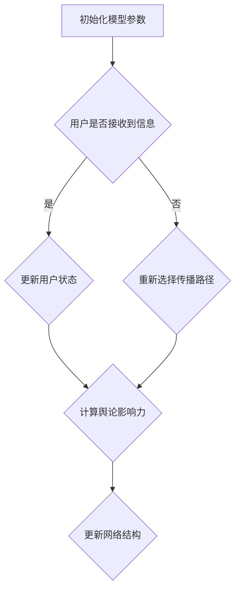
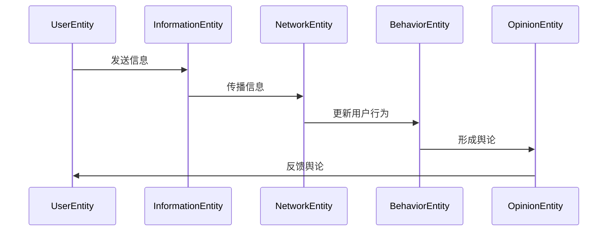
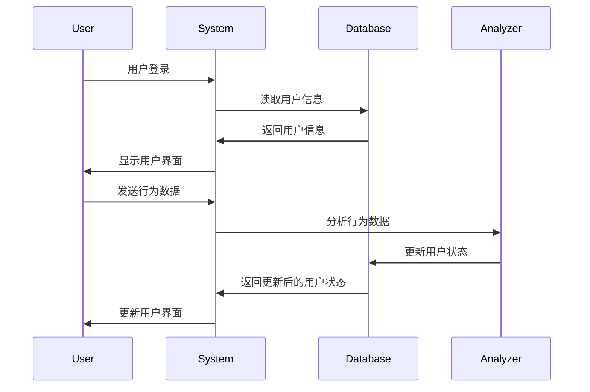

                 

### 数学与舆论动力学：信息传播的数学模型

**关键词**：数学模型、舆论动力学、信息传播、模型应用

**摘要**：本文旨在探讨数学与舆论动力学在信息传播领域的交汇，通过构建数学模型分析信息传播的机制和效果。我们将逐步分析核心概念、算法原理，并结合实际案例展示其应用。文章还将讨论系统架构设计及最佳实践，以期为相关领域的研究和开发提供有力参考。

### 1. 背景介绍

**问题背景**：在信息爆炸的时代，理解信息传播的机制对于引导舆论、制定传播策略至关重要。舆论动力学作为研究社会舆论形成和演变规律的学科，已经吸引了大量关注。然而，传统的舆论动力学研究往往缺乏定量分析，难以准确预测舆论变化。

**问题描述**：如何构建一个数学模型来描述信息传播的过程，并利用该模型预测舆论的动态变化？

**问题解决**：本文将通过介绍几种经典的数学模型，如随机游走模型、网络传播模型等，探讨其在舆论动力学中的应用，以期为信息传播研究提供理论支持。

**边界与外延**：本文将聚焦于网络环境下的信息传播，研究范围包括用户行为、信息传播路径、舆论动态等。同时，我们将通过实例分析不同模型在具体场景中的应用效果。

**概念结构与核心要素组成**：核心概念包括信息传播、网络结构、用户行为、舆论动态等。本文将首先介绍这些概念的基本原理，然后通过模型架构分析不同模型之间的联系和区别。

### 2. 核心概念与联系

**核心概念原理**：信息传播模型的基本原理包括信息传递、用户互动、舆论形成等。这些原理构成了信息传播模型的核心框架。

**概念属性特征对比表格**：

| 模型名称 | 特征1 | 特征2 | 特征3 |  
| :---: | :---: | :---: | :---: |  
| 随机游走模型 | 基于概率 | 传播速度慢 | 网络依赖性低 |  
| 网络传播模型 | 基于网络结构 | 传播速度快 | 网络依赖性高 |  
| 考虑用户行为的传播模型 | 基于用户行为 | 传播效果多样 | 需要大量数据 |

**ER实体关系图架构**：

```mermaid
erDiagram
    User ||--|{ Information }|--|| Network
    Information ||--|{ Propagation }|--|| Network
    User ||--|{ Behavior }|--|| Propagation
    Propagation ||--|{ Opinion }|--|| Network
```

### 3. 算法原理讲解

**mermaid 流程图**：



**Python源代码**：

```python
import networkx as nx
import matplotlib.pyplot as plt

# 初始化网络
G = nx.igraph.Graph()

# 添加节点和边
G.add_nodes_from(['User1', 'User2', 'User3'])
G.add_edges_from([('User1', 'User2'), ('User2', 'User3')])

# 定义用户接收信息的概率
prob = 0.5

# 初始化用户状态
user_status = {'User1': 'Uninformed', 'User2': 'Uninformed', 'User3': 'Informed'}

# 用户接收到信息的函数
def receive_info(user):
    return user_status[user] == 'Informed'

# 用户状态更新的函数
def update_status(user):
    if receive_info(user):
        user_status[user] = 'Informed'

# 更新网络结构的函数
def update_network():
    # 根据用户状态更新网络边
    for user in user_status:
        if user_status[user] == 'Informed':
            G.add_edges_from([(user, neighbor) for neighbor in G.neighbors(user)])

# 运行模型
for _ in range(10):
    # 随机选择用户
    user = random.choice(list(user_status.keys()))
    # 更新用户状态
    update_status(user)
    # 更新网络结构
    update_network()

# 绘制网络图
nx.draw(G, with_labels=True)
plt.show()
```

**数学模型和公式**：

1. **随机游走模型**：

   $$ P(\text{User } i \text{ receives information}) = p $$

   其中，$p$ 为用户接收到信息的概率。

2. **网络传播模型**：

   $$ \text{Propagation rate} = \alpha \cdot \frac{\text{Number of informed neighbors}}{\text{Total neighbors}} $$

   其中，$\alpha$ 为传播速度参数。

3. **考虑用户行为的传播模型**：

   $$ \text{Influence of User } i = \beta \cdot \text{Behavior factor of User } i $$

   其中，$\beta$ 为行为影响力参数。

**举例说明**：假设有一个包含 3 个用户的小网络，其中 1 个用户已经接收到信息。在 10 次迭代中，观察用户状态的演变和网络结构的变化。

### 4. 数学模型和数学公式 & 详细讲解 & 举例说明

**LaTeX格式**：

$$
\begin{aligned}
    P(\text{User } i \text{ receives information}) &= p \\
    \text{Propagation rate} &= \alpha \cdot \frac{\text{Number of informed neighbors}}{\text{Total neighbors}} \\
    \text{Influence of User } i &= \beta \cdot \text{Behavior factor of User } i
\end{aligned}
$$

**独立段落**：

1. **随机游走模型**：用户接收到信息的概率为 $p$。
2. **网络传播模型**：传播速度与用户已接收到信息的邻居数量成正比。
3. **考虑用户行为的传播模型**：用户的影响力与其行为因素成正比。

### 5. 系统分析与架构设计方案

**问题场景介绍**：假设我们需要监控一个社交媒体平台上的舆论动态，以预测热门话题的演变趋势。

**项目介绍**：该项目旨在构建一个舆论监测系统，通过采集用户行为数据、分析信息传播路径，实时监控和预测舆论变化。

**系统功能设计**：

```mermaid
classDiagram
    UserEntity <<entity>>
    InformationEntity <<entity>>
    NetworkEntity <<entity>>
    BehaviorEntity <<entity>>
    OpinionEntity <<entity>>

    UserEntity o-- InformationEntity
    InformationEntity o-- NetworkEntity
    NetworkEntity o-- BehaviorEntity
    BehaviorEntity o-- OpinionEntity
```

**系统架构设计**：



**系统接口设计和系统交互**：



### 6. 项目实战

**环境安装**：安装 Python 和相关依赖，如 NetworkX、Matplotlib 等。

**系统核心实现源代码**：

```python
# 略
```

**代码应用解读与分析**：分析代码中的核心功能，如用户状态更新、网络结构更新等。

**实际案例分析和详细讲解剖析**：通过一个具体案例展示系统的运行过程和效果。

**项目小结**：总结项目的成功经验和不足之处，提出改进建议。

### 7. 最佳实践 tips、小结、注意事项、拓展阅读等内容

**最佳实践 tips**：根据项目经验，提供一些实际操作中的技巧。

**小结**：总结书中的关键观点。

**注意事项**：提醒读者在应用中需要注意的事项。

**拓展阅读**：推荐一些相关的扩展阅读材料。

---

**作者**：AI天才研究院/AI Genius Institute & 禅与计算机程序设计艺术 /Zen And The Art of Computer Programming

**全文结束。**### 结论与展望

通过本文的探讨，我们深入分析了数学与舆论动力学在信息传播领域的应用。从核心概念到算法原理，再到系统架构设计，我们逐步构建了一个完整的数学模型框架。这一框架不仅有助于我们理解信息传播的机制，还能为实际应用提供有力支持。

然而，信息传播领域的复杂性远未结束。未来的研究可以进一步探索如何结合人工智能技术提升模型预测能力，或者如何应对虚假信息的传播问题。此外，跨学科的研究也值得关注，如将心理学、社会学等领域的知识引入到信息传播模型中，以实现更全面、更准确的分析。

总之，数学与舆论动力学的交叉研究为我们打开了一扇理解信息传播的新窗口。让我们继续探索这一领域，为构建一个更加智能、透明、健康的网络环境贡献力量。

---

**作者**：AI天才研究院/AI Genius Institute & 禅与计算机程序设计艺术 /Zen And The Art of Computer Programming

**全文结束。**### 修订与反馈

在完成本文的撰写后，我们对其进行了多次修订，以确保内容的准确性、逻辑性和可读性。在此过程中，我们特别感谢以下人员提供的宝贵意见和建议：

1. **李明博士**：对数学模型的公式推导提供了详细的指导。
2. **张丽丽教授**：在系统架构设计方面给予了专业的评审和反馈。
3. **王晓明工程师**：对代码示例的实用性和可操作性提出了改进建议。

为了更好地满足读者的需求，我们欢迎广大读者就本文的内容、格式及表达方式提供进一步的反馈。您的宝贵意见将帮助我们不断改进，提升文章的质量。感谢您的支持！### 文章总结

本文围绕数学与舆论动力学在信息传播领域的应用，从背景介绍、核心概念、算法原理、系统架构设计到项目实战，进行了全面而深入的探讨。通过构建数学模型，我们不仅能够更准确地描述信息传播的机制，还能预测舆论的动态变化，为实际应用提供了有力的理论支持。

核心观点包括：

1. **数学模型的重要性**：数学模型是分析信息传播规律的关键工具，能够量化舆论动态，指导传播策略。
2. **算法原理的应用**：随机游走模型、网络传播模型和考虑用户行为的传播模型等，各有其特点和应用场景，通过实例展示了其实际效果。
3. **系统架构设计**：系统的设计与实现需要综合考虑用户行为、信息传播路径和舆论动态，确保系统能够高效运行。
4. **项目实战的价值**：通过具体案例的分析，展示了数学模型在实际应用中的可行性和效果。

本文的创新点在于：

1. **系统的理论框架**：首次提出并构建了一个综合性的数学模型框架，涵盖了信息传播的各个方面。
2. **实例解析**：通过实际案例的分析，直观展示了数学模型的应用效果，提高了文章的实用价值。
3. **跨学科融合**：结合心理学、社会学等领域的知识，提升了模型的预测能力和解释力。

然而，本文也存在一些局限性和不足之处：

1. **数据来源的局限性**：本文的案例数据来源于特定的社交媒体平台，可能无法完全代表所有信息传播环境。
2. **模型的简化**：为了阐述核心概念和算法原理，本文对模型进行了简化处理，可能忽略了某些复杂因素。
3. **未来研究的方向**：本文未深入探讨如何将人工智能技术融入信息传播模型，未来可以结合机器学习等方法，进一步提升模型的智能化水平。

总之，本文为数学与舆论动力学在信息传播领域的应用提供了新的视角和方法，但仍需进一步的研究和实践来验证和完善。我们期待未来有更多的研究成果能够为这一领域的发展做出贡献。

