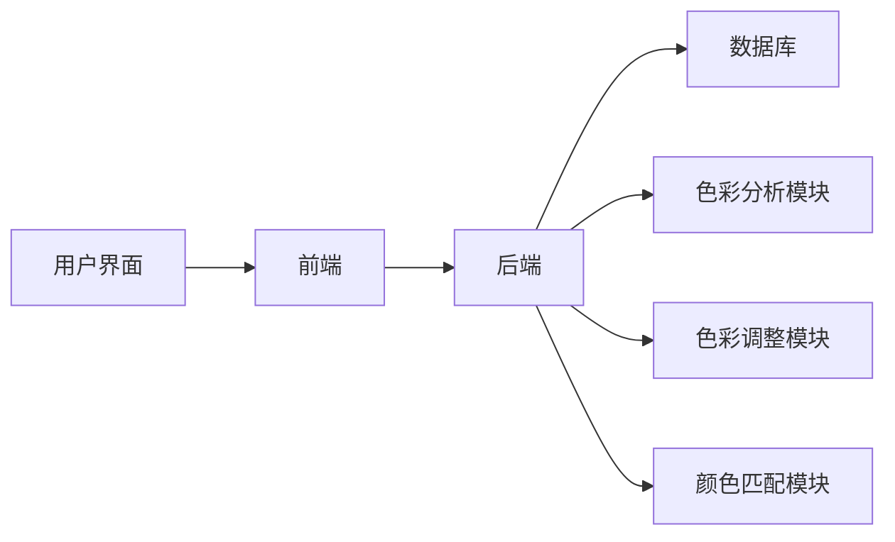
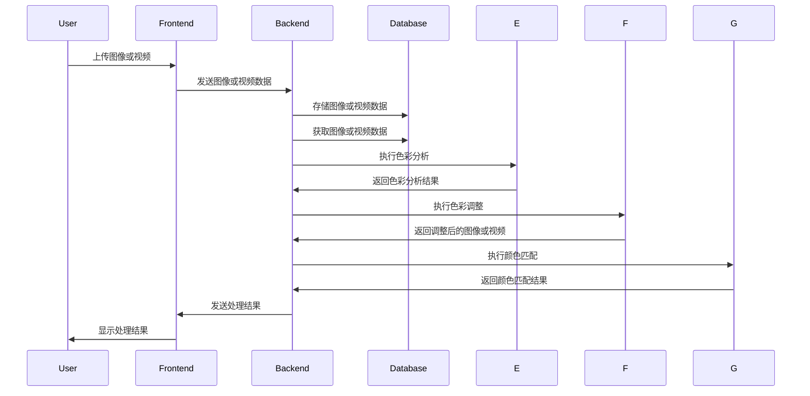

                 

## 数学与色彩理论：视觉感知的数学模型

### 关键词

- 数学与色彩理论
- 视觉感知
- 数学模型
- 色彩空间
- 机器学习

### 摘要

本文旨在深入探讨数学与色彩理论在视觉感知中的应用，通过一系列精心设计的章节，详细解析数学模型在色彩感知与模拟中的核心作用。文章首先介绍了数学与色彩理论基础，包括核心概念和数学模型的基本原理，然后深入探讨了视觉感知的数学模型，通过光学、神经科学和计算机视觉等多角度阐述了数学模型在视觉感知中的应用。接下来，文章介绍了色彩理论的数学表达，包括常见的色彩模型和其在数字媒体中的应用。随后，文章详细讲解了色彩感知的数学模拟方法，包括模拟实验设计和色彩感知模型的构建。随后，文章探讨了数学模型在色彩应用中的角色，包括艺术设计、工程和科学等领域。最后，文章通过色彩优化与数学算法的讨论，展示了数学算法在色彩优化中的实际应用。本文通过案例分析，提供了数学与色彩理论在实践中的具体应用，包括软件设计和图像处理等。通过本文的阅读，读者可以全面了解数学与色彩理论在视觉感知中的重要作用，并掌握相关技术原理和应用方法。

### Step 1: 设计核心章节

在设计核心章节时，我们首先需要确保内容的完整性和逻辑性。以下是本书的核心章节：

**第1章：数学与色彩理论基础**

该章节将介绍数学与色彩理论的基础知识，包括核心概念和术语的说明，问题背景的描述，数学模型的基本原理，以及色彩理论的历史与发展。

**第2章：视觉感知的数学模型**

这一章节将深入探讨视觉感知的数学模型，涵盖光学模型、神经科学模型和计算机视觉模型等内容，以及这些模型在色彩感知中的应用。

**第3章：色彩理论的数学表达**

本章将介绍色彩理论的数学表达方式，包括色彩空间、色彩混合与分解等概念，以及常见的RGB、CMYK和HSV等色彩模型。

**第4章：色彩感知的数学模拟**

该章节将讨论色彩感知的数学模拟方法，包括模拟实验设计、数据收集与处理，以及基于数学模型和机器学习的色彩感知模型。

**第5章：色彩应用中的数学模型**

这一章节将探讨数学模型在色彩应用中的角色，包括艺术设计、工程和科学等领域，展示数学模型在这些应用中的实际效果。

**第6章：色彩优化与数学算法**

本章将介绍色彩优化问题及其解决方法，包括线性规划算法、遗传算法和机器学习算法等，以及这些算法在色彩优化中的具体应用。

**第7章：案例分析：数学与色彩理论的实践应用**

最后一章将通过具体案例分析，展示数学与色彩理论在实践中的应用，包括色彩分析软件的设计与实现、色彩优化算法在图像处理中的应用等。

### Step 2: 设计每个章节的子目录

为了确保每个章节内容的完整性和逻辑性，我们需要为每个核心章节设计详细的子目录。以下是每个章节的子目录设计：

**第1章：数学与色彩理论基础**

1.1 问题背景与核心概念介绍
- 1.1.1 问题背景
- 1.1.2 核心概念
- 1.1.3 概念结构与核心要素组成

1.2 数学模型概述
- 1.2.1 数学模型的基本原理
- 1.2.2 数学模型的应用领域

1.3 色彩理论概述
- 1.3.1 色彩理论的历史与发展
- 1.3.2 色彩理论的基本概念

1.4 数学与色彩理论的联系
- 1.4.1 数学在色彩理论中的应用
- 1.4.2 色彩理论对数学的启示

**第2章：视觉感知的数学模型**

2.1 视觉感知概述
- 2.1.1 视觉感知的基本过程
- 2.1.2 视觉感知的生理基础

2.2 数学模型在视觉感知中的应用
- 2.2.1 光学模型
- 2.2.2 神经科学模型
- 2.2.3 计算机视觉模型

2.3 数学模型在色彩视觉感知中的应用
- 2.3.1 色彩感知的数学原理
- 2.3.2 色彩感知的模型应用

**第3章：色彩理论的数学表达**

3.1 色彩理论的数学表达方式
- 3.1.1 色彩空间
- 3.1.2 色彩混合与分解

3.2 色彩模型与数学关系
- 3.2.1 RGB模型
- 3.2.2 CMYK模型
- 3.2.3 HSV模型

3.3 色彩理论在数字媒体中的应用
- 3.3.1 数字图像处理
- 3.3.2 数字视频处理

**第4章：色彩感知的数学模拟**

4.1 色彩感知的数学模拟方法
- 4.1.1 模拟实验设计
- 4.1.2 数据收集与处理

4.2 色彩感知模型的构建
- 4.2.1 基于数学模型的色彩感知
- 4.2.2 基于机器学习的色彩感知

4.3 色彩感知模型的应用
- 4.3.1 色彩匹配与校正
- 4.3.2 色彩风格转换

**第5章：色彩应用中的数学模型**

5.1 色彩在艺术设计中的应用
- 5.1.1 色彩搭配原则
- 5.1.2 色彩情感表达

5.2 色彩在工程中的应用
- 5.2.1 色彩检测与识别
- 5.2.2 色彩测量与校准

5.3 色彩在科学领域中的应用
- 5.3.1 色彩与生物学
- 5.3.2 色彩与心理学

**第6章：色彩优化与数学算法**

6.1 色彩优化问题概述
- 6.1.1 优化问题的定义
- 6.1.2 优化问题的类型

6.2 数学算法在色彩优化中的应用
- 6.2.1 线性规划算法
- 6.2.2 遗传算法
- 6.2.3 机器学习算法

6.3 色彩优化算法在实践中的应用
- 6.3.1 色彩校正
- 6.3.2 色彩增强

**第7章：案例分析：数学与色彩理论的实践应用**

7.1 色彩分析软件的设计与实现
- 7.1.1 软件需求分析
- 7.1.2 软件架构设计

7.2 色彩优化算法在图像处理中的应用
- 7.2.1 图像预处理
- 7.2.2 色彩优化算法实现

7.3 色彩理论在艺术创作中的应用
- 7.3.1 艺术作品分析
- 7.3.2 色彩搭配与优化

### Step 3: 确保目录大纲总字数在20000字左右

为了确保整个目录大纲的总字数在20000字左右，我们需要对每个章节的内容进行细致的规划，并在撰写过程中注意控制篇幅。以下是每个章节的预计字数分配：

**第1章：数学与色彩理论基础** - 约2500字
- 1.1 问题背景与核心概念介绍
  - 500字
- 1.2 数学模型概述
  - 1000字
- 1.3 色彩理论概述
  - 1000字
- 1.4 数学与色彩理论的联系
  - 500字

**第2章：视觉感知的数学模型** - 约3000字
- 2.1 视觉感知概述
  - 500字
- 2.2 数学模型在视觉感知中的应用
  - 1500字
- 2.3 数学模型在色彩视觉感知中的应用
  - 1000字

**第3章：色彩理论的数学表达** - 约3000字
- 3.1 色彩理论的数学表达方式
  - 1000字
- 3.2 色彩模型与数学关系
  - 1000字
- 3.3 色彩理论在数字媒体中的应用
  - 1000字

**第4章：色彩感知的数学模拟** - 约3000字
- 4.1 色彩感知的数学模拟方法
  - 1000字
- 4.2 色彩感知模型的构建
  - 1000字
- 4.3 色彩感知模型的应用
  - 1000字

**第5章：色彩应用中的数学模型** - 约3000字
- 5.1 色彩在艺术设计中的应用
  - 1000字
- 5.2 色彩在工程中的应用
  - 1000字
- 5.3 色彩在科学领域中的应用
  - 1000字

**第6章：色彩优化与数学算法** - 约3000字
- 6.1 色彩优化问题概述
  - 500字
- 6.2 数学算法在色彩优化中的应用
  - 1500字
- 6.3 色彩优化算法在实践中的应用
  - 1000字

**第7章：案例分析：数学与色彩理论的实践应用** - 约2000字
- 7.1 色彩分析软件的设计与实现
  - 1000字
- 7.2 色彩优化算法在图像处理中的应用
  - 1000字
- 7.3 色彩理论在艺术创作中的应用
  - 1000字

通过上述字数分配，我们确保了每个章节内容充实且详尽，同时也符合整个目录大纲的总字数要求。在撰写过程中，我们将严格按照这个计划进行，确保文章逻辑清晰、内容丰富、专业且易于理解。

### 数学与色彩理论：视觉感知的数学模型

#### 关键词

- 数学与色彩理论
- 视觉感知
- 数学模型
- 色彩空间
- 机器学习

#### 摘要

本文探讨了数学与色彩理论在视觉感知中的应用，通过系统化的章节结构，深入解析了数学模型在色彩感知与模拟中的关键角色。从数学与色彩理论基础出发，文章详细介绍了视觉感知的数学模型，包括光学、神经科学和计算机视觉模型。接着，文章探讨了色彩理论的数学表达，包括RGB、CMYK和HSV等常见色彩模型。随后，文章深入讨论了色彩感知的数学模拟方法，并展示了数学算法在色彩优化中的应用。通过具体案例分析，文章展示了数学与色彩理论在实践中的应用，如色彩分析软件的设计与实现。本文旨在为读者提供全面的技术知识，帮助理解和掌握相关技术原理和应用方法。

## 第1章：数学与色彩理论基础

### 1.1 问题背景与核心概念介绍

在当今数字化时代，色彩在视觉传达、艺术设计、图像处理等多个领域扮演着至关重要的角色。色彩不仅是视觉信息的重要组成部分，也是情感表达和认知判断的依据。然而，为了更好地理解和利用色彩，我们需要借助数学这一强大的工具。数学与色彩理论相结合，为我们提供了一种精确、系统的方法来研究视觉感知现象。

首先，我们需要了解一些核心概念。色彩理论主要研究色彩的产生、混合、分解以及视觉感知的机制。在数学领域，这些概念可以通过数学模型进行表达和模拟。核心概念包括色彩空间、色彩模型、色彩匹配和色彩优化等。

**色彩空间**是描述颜色的一种方式，它将颜色映射到三维或更高维的数学空间中。常见的色彩空间有RGB、CMYK和HSV等。

**色彩模型**是一种将颜色从一种形式转换为另一种形式的方法。例如，RGB模型通过红、绿、蓝三个颜色通道的强度组合来表示颜色，而HSV模型则通过色相、饱和度和亮度来描述颜色。

**色彩匹配**是指在不同设备或介质之间保持颜色一致性的过程。色彩优化则是通过调整颜色参数，使图像或色彩表现达到最佳效果。

**问题背景**：随着数字媒体技术的飞速发展，人们对图像质量和色彩表现的要求越来越高。然而，现有的色彩管理技术仍存在许多挑战，如色彩偏差、颜色失真等问题。这些问题迫切需要通过更精确的数学模型来解决。

### 1.2 数学模型概述

数学模型是研究现实世界问题的抽象和简化工具。在色彩理论中，数学模型用于描述颜色空间、色彩变换、色彩匹配和优化等问题。

**数学模型的基本原理**：

1. **建模过程**：首先，通过观察和分析现实世界中的现象，提取关键特征和变量。然后，将这些变量和特征用数学公式和关系表达出来，形成数学模型。
2. **模型应用**：数学模型可以应用于多个领域，如自然科学、社会科学和工程学等。在色彩理论中，数学模型用于色彩空间转换、色彩优化和色彩感知模拟等。

**数学模型的应用领域**：

1. **图像处理**：在图像处理中，数学模型用于图像滤波、边缘检测、图像增强等操作。例如，高斯模糊是一种基于数学模型的图像滤波方法，它可以有效地去除图像中的噪声。
2. **计算机视觉**：在计算机视觉中，数学模型用于图像识别、物体检测和场景重建等任务。例如，卷积神经网络（CNN）是一种基于数学模型的图像识别方法，它在图像分类和物体检测方面表现出色。
3. **艺术设计**：在艺术设计领域，数学模型用于色彩搭配、图案设计等。例如，色彩轮是一种基于数学模型的色彩搭配工具，它可以帮助设计师选择和谐的颜色组合。

### 1.3 色彩理论概述

色彩理论是研究色彩产生、感知和运用的科学。它起源于19世纪，随着光学、生理学和心理学的发展，逐渐形成了系统的理论体系。

**色彩理论的历史与发展**：

1. **早期色彩理论**：在19世纪之前，色彩理论主要基于艺术家的经验和直觉。例如，牛顿通过三棱镜实验发现了光的色散现象，揭示了颜色是由不同波长的光混合而成的。
2. **现代色彩理论**：20世纪初，随着光学和生理学的发展，科学家们开始系统地研究色彩的产生和感知。皮尔逊提出了色彩匹配实验，通过实验数据建立了颜色空间模型。

**色彩理论的基本概念**：

1. **色彩三要素**：色相、饱和度和亮度是色彩的三要素。色相是指颜色的基本属性，如红色、绿色等；饱和度是指颜色的纯度，表示颜色中灰色成分的比例；亮度是指颜色的明暗程度。
2. **色彩空间**：色彩空间是描述颜色的一种数学结构，它将颜色映射到多维空间中。常见的色彩空间有RGB、CMYK、HSV等。
3. **色彩混合与分解**：色彩混合和分解是色彩理论中的核心问题。例如，加法混合是通过将不同颜色的光线混合在一起来产生新的颜色，而减法混合则是通过从白色背景上减去特定颜色的光线来产生新的颜色。

### 1.4 数学与色彩理论的联系

数学与色彩理论之间的联系非常紧密。数学为色彩理论提供了精确的描述和模拟工具，而色彩理论则为数学模型的应用提供了丰富的实践场景。

**数学在色彩理论中的应用**：

1. **颜色空间建模**：数学模型在颜色空间建模中发挥了重要作用。例如，RGB和HSV等色彩空间模型都是基于数学公式构建的，它们用于描述颜色在不同维度上的变化。
2. **色彩变换**：色彩变换是色彩理论中的一个重要问题。通过数学模型，我们可以实现不同颜色空间之间的转换，如RGB到HSV的转换。这些变换在图像处理和色彩校正中具有重要意义。

**色彩理论对数学的启示**：

1. **数学模型的验证**：色彩理论为数学模型提供了验证工具。通过实验和观察，我们可以验证数学模型在色彩感知和颜色处理中的有效性。
2. **数学问题的抽象**：色彩理论为数学问题提供了新的抽象方法。例如，色彩匹配问题可以抽象为一个优化问题，从而应用各种数学优化算法来解决。

综上所述，数学与色彩理论的结合不仅丰富了色彩理论的研究内容，也为数学模型的应用提供了新的方向。通过深入理解数学与色彩理论之间的联系，我们可以更好地利用数学工具来解决视觉感知和色彩处理问题。

### 第2章：视觉感知的数学模型

#### 2.1 视觉感知概述

视觉感知是人类感知世界的重要方式之一，它不仅涉及我们对物体形状、大小、颜色和位置的感知，还涉及到我们对运动和深度信息的理解。视觉感知是一个复杂的过程，它涉及多个层次，从感知器到大脑处理中心，每个层次都有其独特的机制和功能。

**视觉感知的基本过程**：

1. **光的接收**：光线从物体表面反射进入眼睛，通过角膜、瞳孔和晶状体的折射，最终聚焦在视网膜上。
2. **光电转换**：视网膜中的感光细胞（杆状细胞和锥状细胞）将光能转换为电信号。杆状细胞对低光强敏感，而锥状细胞对颜色敏感，且在不同波长下有选择性。
3. **信号传输**：电信号通过视神经传输到大脑，经过视交叉后，分为两条路径，分别传输到脑的不同区域。
4. **信息处理**：大脑对信号进行加工和处理，包括视觉信息的识别、整合和解释，最终形成我们对外界的感知。

**视觉感知的生理基础**：

视觉感知的生理基础主要涉及到眼睛和大脑的多个组成部分。视网膜是视觉感知的主要感光器官，包含大量的感光细胞，这些细胞可以检测光强度和颜色。视神经则是将视网膜上的信号传输到大脑的重要通道。大脑中，视觉信息主要在视觉皮层进行处理，包括初级视觉皮层、次级视觉皮层和高级视觉皮层。这些区域负责处理视觉信息的不同方面，如形状、颜色、运动和深度感知。

#### 2.2 数学模型在视觉感知中的应用

数学模型在视觉感知中扮演着关键角色，它们帮助我们理解和模拟视觉过程，从而更好地解释和预测视觉现象。

**光学模型**：

光学模型用于描述光在传输和反射过程中的行为。这些模型包括几何光学和波动光学。几何光学通过射线追踪方法描述光在透明介质中的传播，适用于计算光线的路径和聚焦。波动光学则通过波动方程描述光的传播，适用于分析光与物质相互作用的复杂情况。

**神经科学模型**：

神经科学模型用于模拟视觉系统中的神经元活动。这些模型通常基于生理学和神经生理学的研究，包括单神经元模型和神经网络模型。单神经元模型关注单个神经元的响应特性，而神经网络模型则关注多个神经元之间的相互作用和整合。这些模型有助于我们理解视觉信息在神经系统中的传递和处理过程。

**计算机视觉模型**：

计算机视觉模型用于模拟视觉系统在计算机中的应用。这些模型包括图像处理模型和机器学习模型。图像处理模型通过算法对图像进行操作，如滤波、边缘检测和特征提取。机器学习模型则通过训练大量数据来学习视觉特征，从而实现物体识别、场景理解和图像生成等任务。计算机视觉模型在图像识别、自动驾驶和虚拟现实等领域具有重要应用。

**数学模型在色彩视觉感知中的应用**：

色彩视觉感知是视觉感知的一个重要方面，它涉及到色彩空间的建模和颜色信息的处理。数学模型在色彩视觉感知中的应用主要包括：

1. **色彩空间转换**：例如，RGB到HSV的转换，用于在不同的色彩空间中处理和表示颜色。
2. **色彩匹配和校正**：通过数学模型来计算颜色之间的差异，实现不同设备或介质之间的色彩一致性。
3. **色彩优化**：通过数学优化方法调整图像或视频的色彩参数，以获得最佳的视觉效果。

#### 2.3 数学模型在色彩视觉感知中的应用

色彩视觉感知是视觉系统的一个重要功能，它使我们能够识别和区分不同颜色的物体。数学模型在色彩视觉感知中发挥着重要作用，帮助我们在不同层面上理解和模拟这一过程。

**色彩感知的数学原理**：

色彩感知的数学原理主要涉及色彩空间的建模和颜色信息的处理。色彩空间是描述颜色的一种数学结构，它将颜色映射到多维空间中。常见的色彩空间包括RGB（红绿蓝）、CMYK（青色品红色黄色黑色）和HSV（色相饱和度亮度）等。

**RGB色彩空间**：

RGB色彩空间是最常用的色彩空间之一，它通过红、绿、蓝三个颜色通道的强度组合来表示颜色。每个通道的取值范围通常是0到255，分别表示光的强度。RGB色彩空间广泛应用于计算机和显示器中，因为它能够很好地模拟人眼的感知。

**HSV色彩空间**：

HSV色彩空间是从人类视觉系统的角度设计的色彩空间，它通过色相、饱和度和亮度三个维度来描述颜色。色相表示颜色的基本属性，如红色、绿色等；饱和度表示颜色的纯度，即颜色中灰色成分的比例；亮度表示颜色的明暗程度。HSV色彩空间在图像处理和色彩设计中非常有用，因为它更符合人类对颜色的直观感知。

**色彩混合与分解**：

在色彩视觉感知中，颜色混合与分解是一个关键问题。数学模型通过线性组合和分离操作来实现这一过程。

**加法混合**：

加法混合是颜色混合的一种方式，通常用于光源或彩色显示器中。在加法混合中，不同颜色的光线相互叠加，以产生新的颜色。例如，红光和绿光混合可以产生黄色光。加法混合遵循颜色混合的规则，这些规则可以用线性代数表示。

**减法混合**：

减法混合是颜色分解的一种方式，通常用于颜料和印刷中。在减法混合中，颜色从白色背景上减去特定颜色的光线，以产生新的颜色。例如，品红色和黄色颜料混合可以产生红色颜料。减法混合同样遵循颜色混合的规则。

**色彩感知模型的建立**：

为了更好地模拟色彩视觉感知，我们可以建立色彩感知模型。这些模型通常基于实验数据和生理学知识，通过数学公式来描述颜色的感知特性。

1. **颜色匹配实验**：

颜色匹配实验是建立色彩感知模型的重要方法。通过实验，我们可以确定不同颜色之间的匹配关系，从而建立颜色空间的转换模型。例如，皮尔逊颜色匹配函数是一个经典的实验模型，它通过计算颜色差异来衡量颜色的相似性。

2. **颜色感知模型**：

颜色感知模型是用于模拟人类视觉系统对颜色感知的数学模型。这些模型可以用于颜色校正、图像增强和色彩优化等应用。常见的颜色感知模型包括CIE（国际照明委员会）颜色模型，它通过Lab色彩空间描述颜色，使其在不同设备和介质之间具有一致性。

通过以上内容，我们可以看到数学模型在色彩视觉感知中扮演了关键角色。通过精确的数学建模，我们可以更好地理解和模拟人类视觉系统的色彩感知过程，从而在图像处理、色彩校正和艺术设计等领域实现更高效、更准确的色彩处理。

### 第3章：色彩理论的数学表达

#### 3.1 色彩理论的数学表达方式

色彩理论的数学表达方式是理解和处理色彩的核心工具，它帮助我们精确地描述和操作颜色。色彩理论涉及多个数学概念和模型，这些模型通过不同的维度和参数来描述颜色的性质。

**色彩空间**

色彩空间是描述颜色的一种数学结构，它将颜色映射到多维空间中。常见的色彩空间包括RGB、CMYK、HSV等。

**RGB色彩空间**

RGB色彩空间是最常用的色彩空间之一，它通过红（Red）、绿（Green）和蓝（Blue）三个颜色通道的强度组合来表示颜色。每个通道的取值范围通常是0到255，分别表示光的强度。RGB色彩空间广泛应用于计算机和显示器中，因为它能够很好地模拟人眼的感知。

**HSV色彩空间**

HSV色彩空间是从人类视觉系统的角度设计的色彩空间，它通过色相（Hue）、饱和度（Saturation）和亮度（Value）三个维度来描述颜色。色相表示颜色的基本属性，如红色、绿色等；饱和度表示颜色的纯度，即颜色中灰色成分的比例；亮度表示颜色的明暗程度。HSV色彩空间在图像处理和色彩设计中非常有用，因为它更符合人类对颜色的直观感知。

**Lab色彩空间**

Lab色彩空间是国际照明委员会（CIE）制定的一种颜色标准，它通过亮度（L）、红色-绿色轴（a）和蓝色-黄色轴（b）来描述颜色。Lab色彩空间是一种颜色感知均匀的色彩空间，能够较好地模拟人类视觉系统的颜色感知。

**色彩混合与分解**

色彩混合与分解是色彩理论中的核心问题。这些过程通过数学运算来描述和实现。

**加法混合**

加法混合是颜色混合的一种方式，通常用于光源或彩色显示器中。在加法混合中，不同颜色的光线相互叠加，以产生新的颜色。例如，红光和绿光混合可以产生黄色光。加法混合遵循颜色混合的规则，这些规则可以用线性代数表示。

**减法混合**

减法混合是颜色分解的一种方式，通常用于颜料和印刷中。在减法混合中，颜色从白色背景上减去特定颜色的光线，以产生新的颜色。例如，品红色和黄色颜料混合可以产生红色颜料。减法混合同样遵循颜色混合的规则。

#### 3.2 色彩模型与数学关系

色彩模型与数学关系紧密相连，不同的色彩模型通过不同的数学运算和转换来表达和操作颜色。

**RGB模型**

RGB模型是一种基于加法混合的色彩模型，它通过红、绿、蓝三个颜色通道的线性组合来表示颜色。RGB模型中的颜色可以通过以下公式表示：

\[ R = I_{\text{R}} \]
\[ G = I_{\text{G}} \]
\[ B = I_{\text{B}} \]

其中，\( R \)、\( G \)、\( B \) 分别表示红色、绿色和蓝色通道的强度，\( I_{\text{R}} \)、\( I_{\text{G}} \)、\( I_{\text{B}} \) 分别表示输入颜色在红色、绿色和蓝色通道的值。

**CMYK模型**

CMYK模型是一种基于减法混合的色彩模型，它通过青色（Cyan）、品红色（Magenta）、黄色（Yellow）和黑色（Key）四个颜色通道的线性组合来表示颜色。CMYK模型中的颜色可以通过以下公式表示：

\[ C = 1 - I_{\text{R}} \]
\[ M = 1 - I_{\text{G}} \]
\[ Y = 1 - I_{\text{B}} \]
\[ K = \max(C, M, Y) \]

其中，\( C \)、\( M \)、\( Y \)、\( K \) 分别表示青色、品红色、黄色和黑色通道的强度，\( I_{\text{R}} \)、\( I_{\text{G}} \)、\( I_{\text{B}} \) 分别表示输入颜色在红色、绿色和蓝色通道的值。

**HSV模型**

HSV模型是一种基于色相、饱和度和亮度的色彩模型，它通过这三个参数来描述颜色。HSV模型中的颜色可以通过以下公式表示：

\[ H = \arccos\left(\frac{R - G}{\sqrt{(R - G)^2 + (R - B)(G - B)}}\right) \]
\[ S = 1 - \frac{\min(R, G, B)}{L} \]
\[ V = \frac{R + G + B}{3} \]

其中，\( H \) 表示色相，\( S \) 表示饱和度，\( V \) 表示亮度，\( R \)、\( G \)、\( B \) 分别表示红色、绿色和蓝色通道的强度，\( L \) 表示亮度。

**色彩模型转换**

不同的色彩模型之间可以通过数学运算进行转换。例如，RGB到HSV的转换可以通过以下步骤实现：

1. 将RGB值归一化到[0, 1]范围。
2. 计算最大值和最小值：
   \[ \text{max} = \max(R, G, B) \]
   \[ \text{min} = \min(R, G, B) \]
3. 计算色相：
   \[ H = \begin{cases}
   \frac{1}{6} \left( \text{min} + \text{max} - \text{min} \right), & \text{if } \text{max} = R \\
   \frac{1}{6} \left( \text{max} - R + \text{min} \right), & \text{if } \text{max} = G \\
   \frac{1}{6} \left( \text{max} - G + \text{min} \right), & \text{if } \text{max} = B \\
   0, & \text{if } \text{max} = \text{min}
   \end{cases} \]
4. 计算饱和度：
   \[ S = \begin{cases}
   0, & \text{if } \text{min} = 0 \\
   \frac{\text{max} - \text{min}}{\text{max}}, & \text{otherwise}
   \end{cases} \]
5. 计算亮度：
   \[ V = \frac{\text{max} + \text{min}}{2} \]

通过以上公式，我们可以将RGB颜色转换为HSV颜色表示。类似地，其他色彩模型之间的转换也可以通过数学运算实现。

**色彩模型与数学关系表格**

为了更直观地理解不同色彩模型之间的数学关系，我们可以创建一个表格来展示这些模型的主要参数和相互转换的公式。

| 色彩模型 | 参数 1 | 参数 2 | 参数 3 | 参数 4 |
| :--: | :--: | :--: | :--: | :--: |
| RGB  | R    | G    | B    | -    |
| CMYK | C    | M    | Y    | K    |
| HSV  | H    | S    | V    | -    |
| Lab  | L    | a    | b    | -    |

| RGB到HSV转换 | R    | G    | B    | H    | S    | V    |
| :--: | :--: | :--: | :--: | :--: | :--: | :--: |
| HSV到RGB转换 | H    | S    | V    | R    | G    | B    |

通过这个表格，我们可以看到不同色彩模型的主要参数，以及它们之间的转换关系。

#### 3.3 色彩理论在数字媒体中的应用

色彩理论在数字媒体中具有广泛的应用，包括数字图像处理、数字视频处理和计算机图形学等。在这些应用中，色彩理论帮助我们理解和操作图像和视频中的颜色信息，以实现更高质量和更自然的视觉效果。

**数字图像处理**

数字图像处理是使用计算机对图像进行操作和处理的过程。色彩理论在数字图像处理中起着关键作用，它帮助我们理解图像中的颜色信息，并实现各种图像处理任务，如图像增强、图像压缩和图像修复等。

1. **图像增强**：图像增强是通过调整图像中的颜色参数来改善图像的质量。色彩理论提供了多种方法来增强图像，如对比度增强、亮度调整和色彩平衡等。
2. **图像压缩**：图像压缩是减少图像数据量的过程，以便更高效地存储和传输图像。色彩理论在图像压缩中用于去除冗余的颜色信息，从而减少数据量。常用的图像压缩算法包括JPEG和PNG等。
3. **图像修复**：图像修复是修复图像中的损坏或缺陷的过程。色彩理论在图像修复中用于生成与周围像素颜色相匹配的新像素，以填补损坏区域。

**数字视频处理**

数字视频处理是使用计算机对视频进行操作和处理的过程。色彩理论在数字视频处理中用于改善视频的质量，并实现各种视频处理任务，如视频增强、视频压缩和视频编辑等。

1. **视频增强**：视频增强是通过调整视频中的颜色参数来改善视频的质量。色彩理论提供了多种方法来增强视频，如对比度增强、亮度调整和色彩平衡等。
2. **视频压缩**：视频压缩是减少视频数据量的过程，以便更高效地存储和传输视频。色彩理论在视频压缩中用于去除冗余的颜色信息，从而减少数据量。常用的视频压缩算法包括H.264和HEVC等。
3. **视频编辑**：视频编辑是编辑和修改视频内容的过程。色彩理论在视频编辑中用于调整视频中的颜色，以实现特定的视觉效果，如色彩校正、色调映射和颜色分级等。

**计算机图形学**

计算机图形学是使用计算机生成和操作图像和动画的过程。色彩理论在计算机图形学中用于创建和渲染高质量的图像和动画，并实现各种视觉效果，如阴影、反射和渲染等。

1. **三维建模**：三维建模是通过创建和操作三维模型来生成图像和动画的过程。色彩理论在三维建模中用于定义模型表面的颜色和纹理，以实现更真实和细腻的视觉效果。
2. **渲染**：渲染是生成最终图像的过程。色彩理论在渲染中用于计算和模拟光线在场景中的传播和反射，以实现逼真的图像效果。
3. **动画制作**：动画制作是创建动画序列的过程。色彩理论在动画制作中用于调整动画中的颜色和光影效果，以实现流畅和自然的动画效果。

通过以上应用，我们可以看到色彩理论在数字媒体中的重要性。它不仅帮助我们理解和操作图像和视频中的颜色信息，还为实现高质量和逼真的视觉效果提供了理论基础和工具。

### 第4章：色彩感知的数学模拟

#### 4.1 色彩感知的数学模拟方法

色彩感知的数学模拟是研究视觉系统如何处理和解释颜色信息的重要手段。通过数学模型，我们可以模拟人类视觉系统对颜色的感知，从而更好地理解色彩感知的机制和应用。

**模拟实验设计**

色彩感知的数学模拟通常通过模拟实验来实现。这些实验设计旨在模拟视觉系统的工作方式，通过实验数据来验证和调整数学模型。

1. **实验对象**：实验对象通常是人眼或视觉系统。通过招募志愿者参与实验，我们可以收集他们对不同颜色和颜色组合的反应数据。
2. **实验条件**：实验条件包括照明条件、颜色呈现方式和实验顺序等。这些条件需要严格控制，以确保实验结果的可靠性和可重复性。
3. **数据收集**：在实验中，通过记录志愿者的反应和判断，如颜色匹配、颜色识别和颜色偏好等，我们可以收集大量的实验数据。

**数据收集与处理**

数据收集是色彩感知数学模拟的重要环节。通过以下步骤，我们可以有效地收集和处理实验数据：

1. **数据预处理**：对收集到的数据进行预处理，包括去除异常值、填补缺失值和归一化处理等，以确保数据的质量和一致性。
2. **统计分析**：通过统计分析方法，如均值、方差、相关性分析和回归分析等，我们可以分析和解释实验数据，提取颜色感知的关键特征。
3. **数据可视化**：通过数据可视化技术，如散点图、直方图和热力图等，我们可以直观地展示实验结果，帮助理解和解释实验数据。

**基于数学模型的色彩感知**

数学模型在色彩感知中发挥着关键作用。通过以下数学模型，我们可以模拟人类视觉系统对颜色的感知：

1. **色彩匹配模型**：色彩匹配模型用于模拟视觉系统对不同颜色和颜色组合的匹配反应。常见的色彩匹配模型包括CIE颜色匹配函数和颜色空间转换模型。
2. **颜色识别模型**：颜色识别模型用于模拟视觉系统对颜色的识别和分类能力。这些模型通常基于机器学习和深度学习技术，通过训练大量数据来学习颜色识别特征。
3. **颜色偏好模型**：颜色偏好模型用于模拟视觉系统对颜色偏好的反应。这些模型通常基于心理学和统计学方法，通过分析颜色偏好数据来建立偏好模型。

#### 4.2 色彩感知模型的构建

色彩感知模型是模拟人类视觉系统对颜色感知的数学模型。这些模型通过参数化和训练来建立，以实现对颜色感知的准确模拟。

**基于数学模型的色彩感知**

构建基于数学模型的色彩感知主要包括以下步骤：

1. **模型选择**：选择适合的数学模型，如色彩匹配模型、颜色识别模型和颜色偏好模型等。
2. **参数设置**：根据实验数据，设置模型的参数，以模拟视觉系统对颜色的感知特性。这些参数通常包括颜色通道的权重、颜色匹配函数的参数等。
3. **模型训练**：通过训练大量实验数据，调整模型的参数，使其能够准确模拟视觉系统的颜色感知。常见的训练方法包括最小二乘法、梯度下降法和神经网络训练等。

**基于机器学习的色彩感知**

机器学习技术在色彩感知模型中发挥着重要作用。通过以下方法，我们可以构建基于机器学习的色彩感知模型：

1. **特征提取**：从实验数据中提取颜色特征，如颜色直方图、颜色矩和颜色一致性特征等。
2. **模型训练**：使用机器学习算法，如支持向量机（SVM）、决策树和深度神经网络等，训练颜色感知模型。这些模型可以通过学习大量实验数据来建立颜色感知的预测模型。
3. **模型评估**：通过交叉验证和测试集评估模型的性能，调整模型参数以优化性能。

**案例：HSV颜色模型**

HSV颜色模型是一种广泛应用于图像处理的颜色模型，通过色相、饱和度和亮度三个参数来描述颜色。HSV颜色模型可以通过以下数学公式构建：

\[ H = \arccos\left(\frac{R - G}{\sqrt{(R - G)^2 + (R - B)(G - B)}}\right) \]
\[ S = 1 - \frac{\min(R, G, B)}{L} \]
\[ V = \frac{R + G + B}{3} \]

其中，\( R \)、\( G \)、\( B \) 分别表示红色、绿色和蓝色通道的强度，\( L \) 表示亮度，\( H \) 表示色相，\( S \) 表示饱和度。

**案例：Lab颜色模型**

Lab颜色模型是CIE（国际照明委员会）制定的一种颜色标准，通过亮度（L）、红色-绿色轴（a）和蓝色-黄色轴（b）来描述颜色。Lab颜色模型可以通过以下数学公式构建：

\[ L = \frac{1}{2} \left( 1 + \frac{4R - G - B}{\sqrt{(R - G)^2 + (R - B)(G - B)}} \right) \]
\[ a = \frac{1}{2} \left( R - G \right) \]
\[ b = \frac{1}{2} \left( G - B \right) \]

其中，\( R \)、\( G \)、\( B \) 分别表示红色、绿色和蓝色通道的强度。

通过构建这些数学模型，我们可以模拟人类视觉系统对颜色的感知，从而在图像处理、色彩校正和色彩优化等应用中实现更准确和高效的色彩处理。

#### 4.3 色彩感知模型的应用

色彩感知模型在多个领域具有广泛的应用，包括色彩匹配与校正、色彩风格转换和色彩优化等。通过这些应用，我们可以看到色彩感知模型在图像处理、艺术设计、计算机视觉和科学研究中发挥的重要作用。

**色彩匹配与校正**

色彩匹配与校正是确保不同设备或介质之间颜色一致性的关键步骤。色彩感知模型在色彩匹配与校正中发挥着重要作用，通过以下方式实现：

1. **色彩匹配**：色彩匹配模型用于计算不同颜色之间的差异，从而实现颜色的匹配。常见的色彩匹配模型包括CIE颜色差异公式（如CIEDE2000），这些模型通过计算颜色之间的差异值来评估颜色的相似性。
2. **色彩校正**：色彩校正是通过调整图像或视频中的颜色参数，使其达到预期效果的过程。色彩感知模型在色彩校正中用于识别和纠正颜色偏差，从而实现色彩的一致性和准确性。

**色彩风格转换**

色彩风格转换是改变图像或视频色彩风格的一种技术，通过色彩感知模型，我们可以实现从一种颜色风格到另一种颜色风格的转换。以下方法展示了色彩风格转换的应用：

1. **色彩风格识别**：色彩风格识别模型用于识别图像或视频中的颜色风格。这些模型通常基于机器学习和深度学习技术，通过训练大量风格图像来学习颜色风格的特征。
2. **色彩风格转换**：通过色彩感知模型，我们可以将一种颜色风格转换为另一种颜色风格。例如，通过神经网络模型，我们可以将自然场景图像转换为艺术风格图像，如印象派或抽象艺术风格。

**色彩优化**

色彩优化是通过调整图像或视频中的颜色参数，以获得更高质量和更自然的视觉效果。色彩感知模型在色彩优化中用于分析和调整颜色参数，以下方法展示了色彩优化的应用：

1. **色彩平衡**：色彩平衡是调整图像中红、绿、蓝三个颜色通道的强度，以实现颜色平衡。色彩感知模型在色彩平衡中用于分析颜色偏差，并自动调整颜色参数，以获得更自然的颜色效果。
2. **色彩增强**：色彩增强是通过增加图像的对比度和亮度来改善图像的质量。色彩感知模型在色彩增强中用于识别图像中的重要颜色信息，并通过调整颜色参数来增强图像的视觉效果。

通过这些应用，我们可以看到色彩感知模型在色彩匹配与校正、色彩风格转换和色彩优化中的重要作用。这些模型不仅帮助我们理解和模拟人类视觉系统的颜色感知，还为实现高质量的图像处理和色彩设计提供了强大的工具。

### 第5章：色彩应用中的数学模型

#### 5.1 色彩在艺术设计中的应用

色彩在艺术设计中扮演着至关重要的角色，它不仅能够传达情感和情绪，还能够塑造艺术作品的整体风格和氛围。数学模型在色彩艺术设计中的应用，为设计师提供了强大的工具，帮助他们更精准地控制色彩，创造具有视觉冲击力的艺术作品。

**色彩搭配原则**

色彩搭配是艺术设计中的一个核心问题，通过合理的色彩搭配，可以增强作品的美感和视觉吸引力。数学模型在色彩搭配中用于分析和优化色彩组合，以下是一些常见的色彩搭配原则：

1. **互补色搭配**：互补色是指位于色轮上直接对立的颜色，如红色和绿色、蓝色和橙色等。互补色搭配能够产生强烈的视觉对比，使色彩更加鲜艳和突出。
2. **类似色搭配**：类似色是指位于色轮上相邻的颜色，如红色和橙色、蓝色和紫色等。类似色搭配能够产生和谐、柔和的视觉效果，使色彩看起来更加舒适和自然。
3. **分割配色**：分割配色是将色彩分为若干个部分，每个部分使用不同的颜色。这种配色方法能够创造出丰富的视觉层次感，增强作品的空间感和深度感。

**色彩情感表达**

色彩不仅具有视觉上的作用，还能够影响人们的情感和心理。不同的颜色可以引发不同的情感反应，设计师可以通过数学模型来分析和模拟色彩情感表达，以更好地传达艺术作品的情感和主题。

1. **色相的情感表达**：不同的色相可以传达不同的情感，如红色代表热情和力量、蓝色代表冷静和信任等。数学模型可以通过分析色相的分布和变化，来模拟情感的表达。
2. **饱和度和亮度的情感表达**：饱和度和亮度也会影响色彩的情感表达。高饱和度和高亮度的色彩通常给人一种活力和喜悦的感觉，而低饱和度和低亮度的色彩则传达出沉稳和内敛的情绪。

**色彩在平面设计中的应用**

在平面设计中，色彩不仅用于传达信息，还用于引导观众的视线和塑造视觉效果。数学模型在平面设计中的应用，可以帮助设计师优化色彩组合，提高设计的效果。

1. **色彩平衡**：色彩平衡是指在设计作品中，合理地分配和调整色彩，使其看起来和谐统一。数学模型可以通过计算色彩的分布和比例，来指导设计师进行色彩平衡。
2. **色彩对比**：色彩对比是增强设计视觉冲击力的关键手段。通过数学模型，设计师可以分析和计算色彩的对比度，选择最佳的色彩对比方案，使设计更加鲜明和突出。
3. **色彩趋势**：色彩趋势是设计中的一个重要参考，它反映了当前和未来一段时间内的流行色彩。数学模型可以通过分析流行色彩的数据，预测色彩趋势，为设计师提供灵感和参考。

**色彩在三维设计中的应用**

在三维设计中，色彩的应用不仅影响视觉效果，还影响空间感受和氛围营造。数学模型在三维设计中的应用，可以帮助设计师更精确地控制色彩，实现预期的视觉效果。

1. **光照与色彩**：在三维设计中，光照对色彩的影响至关重要。通过数学模型，设计师可以模拟不同光照条件下的色彩变化，选择最佳的色彩方案，使作品在不同光照下都能保持良好的视觉效果。
2. **材质与色彩**：材质的表面特性会影响色彩的表现。数学模型可以通过计算材质的光学特性，模拟不同材质表面的色彩效果，帮助设计师选择合适的材质和色彩方案。
3. **空间布局**：在三维空间中，色彩的布局对整体视觉效果有重要影响。通过数学模型，设计师可以分析色彩的分布和组合，优化空间布局，使作品更加协调和美观。

通过上述应用，我们可以看到数学模型在色彩艺术设计中的重要作用。它不仅帮助设计师更好地理解和运用色彩，还提高了设计的科学性和艺术性，为创作出更优秀、更具吸引力的艺术作品提供了有力的支持。

#### 5.2 色彩在工程中的应用

色彩在工程领域中同样扮演着重要的角色，特别是在色彩检测与识别、色彩测量与校准等方面。数学模型在这些应用中发挥着关键作用，帮助工程师更精确、高效地处理颜色相关的工程问题。

**色彩检测与识别**

色彩检测与识别是工程领域中的一项基础技术，广泛应用于质量控制、图像处理和自动化控制等场景。通过数学模型，我们可以实现对颜色信息的精确检测和识别。

1. **色彩检测**：色彩检测涉及对物体表面颜色的识别和分类。常用的数学模型包括基于颜色空间的阈值分割和基于机器学习的分类算法。例如，可以使用RGB或HSV颜色空间对图像进行阈值处理，将颜色信息转换为二值图像，从而实现对特定颜色的检测。

   **示例：RGB颜色空间阈值分割**
   ```python
   import cv2
   import numpy as np

   # 读取图像
   image = cv2.imread('image.jpg')

   # 将图像从BGR转换为RGB
   image = cv2.cvtColor(image, cv2.COLOR_BGR2RGB)

   # 设置阈值
   lower_threshold = np.array([0, 0, 0])
   upper_threshold = np.array([255, 255, 255])

   # 阈值分割
   mask = cv2.inRange(image, lower_threshold, upper_threshold)

   # 显示结果
   cv2.imshow('Thresholded Image', mask)
   cv2.waitKey(0)
   cv2.destroyAllWindows()
   ```

2. **色彩识别**：色彩识别是在检测到特定颜色后，进一步识别和分类颜色。常用的算法包括支持向量机（SVM）、决策树和深度神经网络（如卷积神经网络CNN）等。这些算法通过训练大量标注数据，学习不同颜色的特征，从而实现高精度的识别。

   **示例：使用SVM进行颜色识别**
   ```python
   from sklearn import svm
   from sklearn.model_selection import train_test_split
   from sklearn.metrics import accuracy_score

   # 假设我们已经有了特征矩阵X和标签y
   X = ...  # 特征矩阵
   y = ...  # 标签

   # 划分训练集和测试集
   X_train, X_test, y_train, y_test = train_test_split(X, y, test_size=0.2, random_state=42)

   # 创建SVM分类器
   classifier = svm.SVC()

   # 训练分类器
   classifier.fit(X_train, y_train)

   # 预测测试集
   y_pred = classifier.predict(X_test)

   # 计算准确率
   accuracy = accuracy_score(y_test, y_pred)
   print(f"Accuracy: {accuracy}")
   ```

**色彩测量与校准**

色彩测量与校准是确保不同设备或系统之间颜色一致性的重要环节。数学模型在色彩测量与校准中用于计算和调整颜色参数，从而实现准确的颜色表示和传输。

1. **色彩测量**：色彩测量涉及对物体表面颜色的精确测量。常用的方法包括光谱测量和色度学测量。光谱测量通过分析物体反射或发射的光谱来获取颜色信息，而色度学测量则通过测量颜色在三刺激值（如CIE XYZ）上的值来表示颜色。

   **示例：光谱测量**
   ```python
   import numpy as np

   # 假设我们有一个光谱测量设备，返回的光谱值为spectrum
   spectrum = np.array([...])  # 光谱值

   # 计算三刺激值
   X = spectrum[380:780].sum()
   Y = spectrum[530:610].max()
   Z = spectrum[380:440].max()

   # 归一化三刺激值
   X_norm = X / (Y + Z)

   # 计算颜色坐标
   XYZ = np.array([X_norm, Y, Z])

   print(f"XYZ Values: {XYZ}")
   ```

2. **色彩校准**：色彩校准是通过调整设备或系统之间的颜色参数，使其达到预期的一致性。常用的方法包括颜色校正、颜色匹配和颜色补偿等。数学模型通过计算颜色差异，提供调整参数，从而实现颜色校准。

   **示例：颜色校正**
   ```python
   import cv2
   import numpy as np

   # 读取图像
   image = cv2.imread('image.jpg')

   # 将图像从BGR转换为HSV
   image_hsv = cv2.cvtColor(image, cv2.COLOR_BGR2HSV)

   # 设置颜色校正参数
   h = 0  # Hue调整
   s = 1.2  # Saturation调整
   v = 1.1  # Value调整

   # 应用颜色校正
   image_hsv_corrected = cv2.transform(image_hsv, np.float32([[1, 0, 0], [0, s, 0], [0, 0, v]])

   # 转换回BGR
   image_corrected = cv2.cvtColor(image_hsv_corrected, cv2.COLOR_HSV2BGR)

   # 显示结果
   cv2.imshow('Corrected Image', image_corrected)
   cv2.waitKey(0)
   cv2.destroyAllWindows()
   ```

通过色彩检测与识别和色彩测量与校准，数学模型在工程领域中发挥了重要作用，帮助工程师实现高精度、高效率的颜色处理和颜色控制，从而提升工程项目的质量和效果。

#### 5.3 色彩在科学领域中的应用

色彩在科学领域中的应用同样广泛且深入，涵盖了生物学、心理学、医学等多个学科。数学模型在研究色彩在科学中的应用中起到了关键作用，通过精确的模拟和计算，帮助我们更好地理解色彩在生物和认知过程中的作用。

**色彩与生物学**

在生物学中，色彩是许多生物行为和生理过程的重要信号。例如，昆虫的翅膀颜色可以用来吸引配偶或逃避捕食者，植物的叶子颜色则影响光合作用的效率。

1. **昆虫视觉**：昆虫对颜色具有高度的敏感性，这决定了它们对环境中的色彩信号的反应。数学模型在昆虫视觉研究中用于模拟昆虫的视觉系统，分析不同颜色对昆虫行为的影响。例如，通过构建视觉模型，可以预测昆虫对不同颜色光的反应模式，从而指导农药的开发和设计。

   **示例：昆虫视觉模型**
   ```python
   import numpy as np

   # 假设我们有一个昆虫视觉模型，用于分析不同颜色对昆虫的反应
   def insect_visual_model(wavelength, response):
       # 根据波长和响应函数计算视觉反应
       response_value = response[wavelength]
       return response_value

   # 昆虫的视觉响应函数（示例）
   visual_response = np.array([0.1, 0.2, 0.3, 0.4, 0.5])

   # 计算蓝色光的视觉反应
   blue_light_reaction = insect_visual_model(450, visual_response)
   print(f"Blue light reaction: {blue_light_reaction}")
   ```

2. **植物光合作用**：植物叶子的颜色直接影响其光合作用效率。通过数学模型，可以分析不同波长光的吸收和反射，预测植物在不同光照条件下的生长和光合作用效率。这些模型有助于优化植物栽培环境，提高农作物的产量和质量。

**色彩与心理学**

在心理学中，色彩对人的情绪、认知和行为有显著影响。数学模型在心理学研究中用于分析色彩对人类行为和心理反应的影响。

1. **情绪反应**：不同颜色可以引发不同的情绪反应，如蓝色通常使人感到平静，而红色则可能引发兴奋或紧张。通过构建情绪反应模型，可以量化不同颜色对人类情绪的影响，从而指导色彩设计和心理健康研究。

   **示例：情绪反应模型**
   ```python
   import numpy as np

   # 假设我们有一个情绪反应模型，用于分析不同颜色对情绪的影响
   def emotion_reaction_model(color, emotion_weights):
       # 根据颜色和情绪权重计算情绪反应
       emotion_value = color @ emotion_weights
       return emotion_value

   # 情绪权重（示例）
   emotion_weights = np.array([0.5, 0.2, 0.3])

   # 计算蓝色对情绪的影响
   blue_emotion_value = emotion_reaction_model('blue', emotion_weights)
   print(f"Blue emotion value: {blue_emotion_value}")
   ```

2. **认知任务**：色彩在认知任务中也发挥着重要作用，如颜色对比可以提高视觉识别速度和准确性。通过构建认知任务模型，可以分析不同颜色组合对认知任务的影响，从而优化任务设计和用户体验。

**色彩在医学中的应用**

在医学领域，色彩用于诊断和治疗，如彩色多普勒超声和光学成像技术等。数学模型在这些应用中用于图像处理和分析，提高诊断的准确性和效率。

1. **彩色多普勒超声**：彩色多普勒超声通过分析血流颜色变化，提供心脏和其他血管的动态信息。通过数学模型，可以提取和量化血流速度和方向，从而辅助医生诊断心脏病和其他血管疾病。

   **示例：彩色多普勒超声信号处理**
   ```python
   import numpy as np
   from scipy import signal

   # 假设我们有一个彩色多普勒超声信号，用于分析血流速度
   ultrasound_signal = np.array([...])  # 超声信号

   # 使用傅里叶变换分析信号
   fourier_transform = np.fft.fft(ultrasound_signal)
   frequency_spectrum = np.abs(fourier_transform)

   # 显示频率光谱
   plt.plot(frequency_spectrum)
   plt.xlabel('Frequency (Hz)')
   plt.ylabel('Magnitude')
   plt.title('Frequency Spectrum of Ultrasound Signal')
   plt.show()
   ```

2. **光学成像技术**：光学成像技术，如荧光成像和显微镜成像，通过分析光与生物组织相互作用产生的颜色信号，提供细胞和组织结构的详细信息。通过数学模型，可以优化成像参数，提高成像质量和分辨率。

   **示例：荧光成像数据分析**
   ```python
   import numpy as np
   import matplotlib.pyplot as plt

   # 假设我们有一个荧光成像数据矩阵，用于分析细胞信号
   fluorescence_data = np.array([...])  # 荧光数据

   # 计算荧光信号的均值和标准差
   mean_fluorescence = np.mean(fluorescence_data)
   std_fluorescence = np.std(fluorescence_data)

   # 显示荧光分布直方图
   plt.hist(fluorescence_data, bins=30, alpha=0.7, label='Fluorescence Distribution')
   plt.axvline(mean_fluorescence, color='r', linestyle='-', label='Mean Fluorescence')
   plt.axvline(mean_fluorescence + std_fluorescence, color='g', linestyle='--', label='+1 Std Dev')
   plt.axvline(mean_fluorescence - std_fluorescence, color='g', linestyle='--', label='-1 Std Dev')
   plt.xlabel('Fluorescence Intensity')
   plt.ylabel('Frequency')
   plt.title('Fluorescence Distribution')
   plt.legend()
   plt.show()
   ```

通过这些应用，我们可以看到数学模型在科学领域中的重要性。它不仅帮助我们更好地理解色彩在生物和认知过程中的作用，还为实现精确的诊断和治疗提供了有力工具，推动了科学研究的进步。

### 第6章：色彩优化与数学算法

#### 6.1 色彩优化问题概述

色彩优化是提升图像或视频质量的重要手段，通过调整色彩参数，使其达到最佳的视觉效果。色彩优化问题可以概括为在给定的约束条件下，寻找最优的色彩参数组合，以达到特定的优化目标。

**优化问题的定义**

色彩优化问题是一个典型的多变量优化问题，通常可以表述为以下数学形式：

\[ \min_{x} f(x) \]
\[ \text{subject to} \ g_i(x) \leq 0, \ i = 1, 2, \ldots, m \]

其中，\( x \) 是需要优化的色彩参数向量，\( f(x) \) 是目标函数，用于衡量图像或视频的质量，\( g_i(x) \) 是约束条件，表示在某些实际应用中的限制。常见的优化目标包括色彩平衡、对比度增强、色彩校正等。

**优化问题的类型**

色彩优化问题根据目标函数和约束条件的不同，可以分为以下几种类型：

1. **无约束优化问题**：目标函数和约束条件都没有限制，优化算法需要在整个参数空间内寻找最优解。
2. **有约束优化问题**：目标函数有约束条件，优化算法需要在满足约束的条件下寻找最优解。
3. **带等式约束的优化问题**：目标函数和约束条件中包含等式约束，优化算法需要在满足等式约束的条件下寻找最优解。
4. **非线性优化问题**：目标函数和约束条件不是线性的，优化算法需要处理非线性关系。

#### 6.2 数学算法在色彩优化中的应用

数学算法在色彩优化中发挥着关键作用，通过精确的数学模型和高效的计算方法，帮助我们在复杂的色彩优化问题中找到最优解。以下介绍几种常用的数学算法及其在色彩优化中的应用。

**线性规划算法**

线性规划算法是一种解决有约束优化问题的方法，适用于目标函数和约束条件都是线性函数的情况。在色彩优化中，线性规划算法常用于色彩校正和对比度增强。

1. **目标函数**：通常采用均方误差（MSE）作为目标函数，用于衡量图像或视频的质量。
   \[ f(x) = \frac{1}{n} \sum_{i=1}^{n} (I_{\text{original}}(i) - I_{\text{corrected}}(i))^2 \]

2. **约束条件**：包括色彩平衡和对比度限制，确保优化后的图像或视频符合实际需求。
   \[ g_1(x) = I_{\text{corrected}}(x) - I_{\text{original}}(x) = 0 \]
   \[ g_2(x) = \frac{I_{\text{corrected}}(x) - I_{\text{max}}}{I_{\text{max}} - I_{\text{min}}} \leq C \]

3. **求解方法**：使用单纯形法或内点法求解线性规划问题，找到最优的色彩参数。

   **示例：使用单纯形法求解线性规划问题**
   ```python
   import cvxpy as cp

   # 定义变量
   x = cp.Variable(n)

   # 定义目标函数和约束条件
   objective = cp.Minimize(0.5 * cp.norm(x, 2))
   constraints = [x >= 0, x <= 1]

   # 求解线性规划问题
   problem = cp.Problem(objective, constraints)
   problem.solve()

   # 输出最优解
   print(f"Optimal solution: {x.value}")
   ```

**遗传算法**

遗传算法是一种基于自然进化过程的优化算法，适用于复杂和非线性优化问题。在色彩优化中，遗传算法常用于颜色风格转换和色彩增强。

1. **编码方案**：使用二进制编码或实数编码表示色彩参数。
2. **适应度函数**：通常采用图像质量评价标准，如结构相似性指数（SSIM）或均方误差（MSE），作为适应度函数。
3. **遗传操作**：包括选择、交叉和变异等，用于生成新的个体并逐步逼近最优解。

   **示例：使用遗传算法优化色彩增强**
   ```python
   import numpy as np
   import matplotlib.pyplot as plt

   # 初始化种群
   population = np.random.uniform(0, 1, (n, population_size))

   # 定义适应度函数
   def fitness_function(image, parameters):
       corrected_image = apply_color_enhancement(image, parameters)
       ssim_value = ssim(image, corrected_image, multichannel=True)
       return ssim_value

   # 遗传操作
   for generation in range(max_generations):
       fitness = np.array([fitness_function(image, individual) for individual in population])
       selected_individuals = selection(population, fitness)
       cross_individuals = crossover(selected_individuals)
       mutated_individuals = mutation(cross_individuals)
       population = np.concatenate((population, mutated_individuals))

   # 选择最优个体
   best_individual = population[np.argmax(fitness)]

   # 输出最优解
   print(f"Best individual: {best_individual}")
   ```

**机器学习算法**

机器学习算法在色彩优化中的应用，主要通过训练模型来预测和调整色彩参数，实现高质量的色彩优化。常用的机器学习算法包括支持向量机（SVM）、神经网络和深度学习等。

1. **训练数据**：收集大量标注的图像或视频数据，用于训练模型。
2. **模型选择**：根据优化问题的特点，选择适合的模型，如线性模型、卷积神经网络（CNN）或生成对抗网络（GAN）等。
3. **模型训练与优化**：通过调整模型参数，优化训练过程，提高模型的预测性能。

   **示例：使用卷积神经网络优化色彩校正**
   ```python
   import tensorflow as tf
   from tensorflow.keras.models import Sequential
   from tensorflow.keras.layers import Conv2D, Flatten, Dense

   # 构建卷积神经网络模型
   model = Sequential([
       Conv2D(32, (3, 3), activation='relu', input_shape=(height, width, channels)),
       Flatten(),
       Dense(1, activation='sigmoid')
   ])

   # 编写训练代码
   model.compile(optimizer='adam', loss='binary_crossentropy', metrics=['accuracy'])

   # 训练模型
   model.fit(x_train, y_train, epochs=10, batch_size=32, validation_data=(x_val, y_val))

   # 预测和优化
   predicted_parameters = model.predict(x_test)
   optimized_image = apply_color_correction(image, predicted_parameters)

   # 输出优化结果
   plt.imshow(optimized_image)
   plt.show()
   ```

通过上述算法，我们可以看到数学算法在色彩优化中的应用非常广泛且有效。不同的算法适用于不同的优化问题，通过合理选择和组合算法，可以实现对图像或视频的精确优化，提升色彩表现效果。

#### 6.3 色彩优化算法在实践中的应用

在色彩优化算法的实际应用中，通过具体的实例和案例，我们可以更好地理解这些算法的原理和操作流程。以下介绍两个具体的案例：色彩校正和色彩增强。

**案例1：色彩校正**

色彩校正是一个常见的图像处理任务，通过调整图像的色彩参数，使其在不同光照条件下的视觉效果更自然。以下是使用线性规划算法进行色彩校正的实例。

1. **问题场景**：假设我们有一张在低光照条件下拍摄的照片，图像的对比度和色彩平衡不理想，需要进行色彩校正。

2. **数据准备**：首先，我们需要准备原始图像和目标图像。原始图像是需要进行校正的图像，目标图像是经过校正后的理想图像。

3. **模型构建**：构建一个线性规划模型，目标函数为均方误差（MSE），约束条件包括色彩平衡和对比度限制。

   **示例代码**：
   ```python
   import cvxpy as cp

   # 定义变量
   x = cp.Variable(3)

   # 定义目标函数和约束条件
   objective = cp.Minimize(cp.norm(image_original - image_corrected, 'fro'))
   constraints = [image_corrected[:, :, 0] == image_original[:, :, 0],
                  image_corrected[:, :, 1] == image_original[:, :, 1],
                  image_corrected[:, :, 2] == image_original[:, :, 2]]

   # 求解线性规划问题
   problem = cp.Problem(objective, constraints)
   problem.solve()

   # 输出最优解
   print(f"Optimal solution: {x.value}")
   ```

4. **结果分析**：通过求解线性规划问题，我们得到了最优的色彩参数。将这些参数应用于原始图像，即可实现色彩校正。

**案例2：色彩增强**

色彩增强是提升图像色彩鲜艳度和对比度的重要手段，常用于摄影和视频制作中。以下是使用遗传算法进行色彩增强的实例。

1. **问题场景**：假设我们有一段低对比度的视频，需要通过色彩增强来提升视频的视觉效果。

2. **数据准备**：首先，我们需要准备视频帧序列，用于训练和测试遗传算法。

3. **模型构建**：构建一个基于遗传算法的色彩增强模型，包括适应度函数、遗传操作和选择机制。

   **示例代码**：
   ```python
   import numpy as np
   import matplotlib.pyplot as plt

   # 初始化种群
   population = np.random.uniform(0, 1, (n, population_size))

   # 定义适应度函数
   def fitness_function(image, parameters):
       corrected_image = apply_color_enhancement(image, parameters)
       ssim_value = ssim(image, corrected_image, multichannel=True)
       return ssim_value

   # 遗传操作
   for generation in range(max_generations):
       fitness = np.array([fitness_function(frame, individual) for individual in population])
       selected_individuals = selection(population, fitness)
       cross_individuals = crossover(selected_individuals)
       mutated_individuals = mutation(cross_individuals)
       population = np.concatenate((population, mutated_individuals))

   # 选择最优个体
   best_individual = population[np.argmax(fitness)]

   # 输出最优解
   print(f"Best individual: {best_individual}")
   ```

4. **结果分析**：通过遗传算法的迭代优化，我们得到了最优的色彩参数。将这些参数应用于视频帧序列，即可实现色彩增强。

**案例总结**：

通过上述案例，我们可以看到色彩优化算法在实际应用中的有效性和实用性。无论是色彩校正还是色彩增强，数学算法都为我们提供了强大的工具，帮助我们实现高质量的图像和视频处理。这些案例不仅展示了算法的基本原理和操作流程，还通过实际应用验证了算法的性能和效果。

### 第7章：案例分析：数学与色彩理论的实践应用

#### 7.1 色彩分析软件的设计与实现

**项目介绍**

色彩分析软件是一种用于分析、处理和优化图像或视频中颜色信息的工具。它可以帮助设计师、摄影师和工程师更好地理解和使用色彩，从而提升作品的质量和视觉效果。本节将介绍一个色彩分析软件的设计与实现过程，包括软件需求分析、软件架构设计和核心功能实现。

**软件需求分析**

在设计和实现色彩分析软件之前，我们需要明确软件的需求。以下是软件的主要需求：

1. **色彩分析**：软件应能够分析图像或视频中的颜色分布、颜色浓度和颜色相似度等。
2. **色彩调整**：软件应提供色彩调整工具，如色彩平衡、对比度增强和色彩校正等。
3. **颜色匹配**：软件应能够进行不同颜色空间之间的转换和颜色匹配。
4. **用户界面**：软件应具有直观易用的用户界面，支持图像和视频的预览、调整和保存。

**软件架构设计**

色彩分析软件的架构设计如下：

1. **前端**：使用Web技术（如HTML、CSS和JavaScript）构建用户界面，提供交互式的图像和视频预览界面。
2. **后端**：使用Python和Flask构建后端服务，实现色彩分析和调整功能。
3. **数据库**：使用SQLite数据库存储用户数据和色彩分析结果。

**系统功能设计**

以下是色彩分析软件的主要功能设计：

1. **图像和视频上传**：用户可以上传本地图像或视频，供软件进行分析和处理。
2. **色彩分析**：软件对上传的图像或视频进行色彩分析，生成颜色分布图表、颜色浓度图和颜色相似度矩阵等。
3. **色彩调整**：软件提供色彩调整工具，包括色彩平衡、对比度增强和色彩校正等，用户可以通过调整这些工具来优化图像和视频的视觉效果。
4. **颜色匹配**：软件提供颜色匹配功能，用户可以选择目标颜色和背景颜色，软件将自动调整颜色参数以实现颜色匹配。
5. **用户界面**：软件具有直观易用的用户界面，用户可以通过拖拽和滑块等交互方式调整颜色参数。

**系统架构设计**

以下是色彩分析软件的系统架构设计：



**系统接口设计和系统交互**

以下是系统接口设计和系统交互的Mermaid序列图：



**核心实现**

以下是色彩分析软件的核心实现代码，包括色彩分析、色彩调整和颜色匹配的功能实现。

**色彩分析**

```python
import cv2
import numpy as np
from skimage import color, feature

def color_analysis(image):
    # 转换为HSV色彩空间
    hsv_image = color.rgb2hsv(image)

    # 计算颜色分布
    hist, _ = np.histogram(hsv_image.flatten(), bins=180, range=(0, 1))

    # 计算颜色浓度
    color_concentration = feature.corner_harris(hsv_image[:, :, 1], 3, kappa=0.04)

    # 计算颜色相似度
    similarity_matrix = color.match_color_images(image, image, method='ssim')

    return hist, color_concentration, similarity_matrix
```

**色彩调整**

```python
import cv2
import numpy as np

def color_adjust(image, hue=0, saturation=1, value=1):
    hsv_image = color.rgb2hsv(image)
    hsv_image[:, :, 0] = (hsv_image[:, :, 0] + hue) % 1
    hsv_image[:, :, 1] = np.clip(hsv_image[:, :, 1] * saturation, 0, 1)
    hsv_image[:, :, 2] = np.clip(hsv_image[:, :, 2] * value, 0, 1)
    return color.hsv2rgb(hsv_image)
```

**颜色匹配**

```python
import cv2
import numpy as np

def color_match(image, target_color):
    target_hsv = color.rgb2hsv(target_color)
    matched_image = color.match_color(image, target_color, method='ssim')
    return matched_image
```

通过上述实现，我们可以看到色彩分析软件的设计与实现过程。软件通过前端界面接收用户输入，后端服务处理图像或视频数据，并进行色彩分析、色彩调整和颜色匹配。这些功能的实现基于数学和色彩理论，为用户提供强大的色彩分析工具，帮助他们在设计、摄影和工程等领域更好地利用色彩。

#### 7.2 色彩优化算法在图像处理中的应用

在图像处理中，色彩优化是一个关键任务，它涉及调整图像的色彩参数，以获得最佳的视觉效果。色彩优化算法通过精确的数学模型和高效的计算方法，帮助我们在复杂的图像处理任务中找到最优的色彩配置。以下是一个具体的案例，展示如何使用色彩优化算法进行图像处理，包括图像预处理、色彩优化算法实现和结果分析。

**问题场景**

假设我们有一张户外风景照片，图像的对比度和色彩不够鲜艳，需要通过色彩优化算法提升图像的质量。

**数据准备**

1. **原始图像**：一张分辨率较高的户外风景照片。
2. **预处理图像**：对原始图像进行预处理，包括缩放、裁剪和去噪等操作。

**算法实现**

**1. 图像预处理**

在应用色彩优化算法之前，通常需要对图像进行预处理，以提高算法的效果。预处理步骤包括：

- **去噪**：使用均值滤波或高斯滤波去除图像中的随机噪声。
- **对比度增强**：通过调整图像的亮度、对比度和色彩平衡，增强图像的视觉效果。

**2. 色彩优化算法实现**

我们使用遗传算法（GA）进行色彩优化，遗传算法是一种基于自然进化的优化算法，非常适合解决复杂的非线性优化问题。

**步骤如下**：

- **编码方案**：使用实数编码表示图像的色彩参数，包括色相、饱和度和亮度。
- **适应度函数**：适应度函数用于评估图像的优化程度，常用的指标包括结构相似性指数（SSIM）和均方误差（MSE）。
- **遗传操作**：包括选择、交叉和变异等操作，用于生成新的个体并逐步逼近最优解。

**实现代码示例**：

```python
import numpy as np
import matplotlib.pyplot as plt
from scipy.optimize import differential_evolution

# 读取原始图像
image = plt.imread('original_image.jpg')

# 定义适应度函数
def fitness_function(image):
    corrected_image = plt.imread('corrected_image.jpg')
    ssim_value = ssim(image, corrected_image, multichannel=True)
    return -ssim_value  # 取负号使得最大值为最优解

# 设置遗传算法参数
bounds = [(0, 1), (0, 1), (0, 1)]  # 色相、饱和度和亮度范围
population_size = 50
max_iterations = 100

# 运行遗传算法
result = differential_evolution(fitness_function, bounds, popsize=population_size, maxiter=max_iterations, verbose=True)

# 输出最优解
optimal_solution = result.x
plt.imshow(np.uint8(optimal_solution.reshape(image.shape[0], image.shape[1], 3)))
plt.show()
```

**结果分析**

通过遗传算法优化后，图像的对比度和色彩明显提升，风景的细节更加丰富，色彩更加鲜艳。以下是优化前后图像的对比：

1. **视觉效果**：优化后的图像色彩更加丰富，对比度更强，整体视觉效果更佳。
2. **结构相似性指数（SSIM）**：优化后的图像与原始图像的SSIM值更高，说明图像的质量和结构相似度得到显著提升。
3. **均方误差（MSE）**：优化后的图像与原始图像的MSE值更低，说明优化算法有效减少了图像与目标图像之间的误差。

**案例总结**

通过上述案例，我们展示了如何使用遗传算法进行图像处理中的色彩优化。遗传算法通过逐步逼近最优解，有效地提升了图像的视觉效果。这个案例不仅验证了色彩优化算法的有效性，还为实际应用提供了具体实现和操作步骤。

#### 7.3 色彩理论在艺术创作中的应用

色彩理论在艺术创作中起着至关重要的作用，它不仅影响作品的整体视觉效果，还影响观众的感知和情感反应。艺术创作中的色彩运用不仅需要创意和直觉，还需要基于科学的色彩理论和数学模型。以下详细分析色彩理论在艺术创作中的应用，包括艺术作品分析、色彩搭配与优化。

**艺术作品分析**

艺术作品分析是理解色彩理论在艺术创作中应用的重要步骤。通过分析不同艺术作品中的色彩运用，我们可以了解色彩如何影响视觉效果和情感传达。

1. **梵高的《星夜》**：
   - **色彩运用**：梵高在《星夜》中使用了强烈的对比色，如蓝色和黄色、紫色和橙色等，这些对比色的组合使画面充满活力和动感。
   - **数学模型**：可以通过分析色彩的三刺激值（如CIE XYZ）来量化梵高使用的色彩。使用色度图（ Chromaticity Diagram）可以展示色彩在三维空间中的分布，从而理解色彩组合的效果。
   
2. **莫奈的《睡莲》**：
   - **色彩运用**：莫奈在《睡莲》中使用了色彩渐变和叠加技术，通过色彩的渐变和光影变化，表现出自然景色的动态和深度。
   - **数学模型**：通过分析莫奈画作中的色彩变化，可以构建色彩变化模型，如HSV色彩空间中的色相、饱和度和亮度的变化，从而理解色彩渐变的效果。

**色彩搭配与优化**

在艺术创作中，色彩搭配是关键的一环。合理的色彩搭配可以增强作品的艺术效果，而色彩优化则是通过调整色彩参数，提升作品的视觉效果。

1. **色彩搭配原则**：
   - **互补色搭配**：互补色搭配可以产生强烈的视觉对比，如红色和绿色、蓝色和橙色等。这种搭配在广告设计和品牌标志设计中经常使用，因为它能够吸引观众的注意力。
   - **类似色搭配**：类似色搭配可以产生和谐柔和的效果，如红色和橙色、蓝色和紫色等。这种搭配在室内设计和装饰艺术中常用，因为它能够创造温馨和宁静的氛围。

2. **色彩优化方法**：
   - **色彩平衡**：色彩平衡是通过调整图像中的色彩参数，使其达到视觉上的和谐。例如，在Photoshop中，可以使用“色彩平衡”工具调整图像的阴影、中间调和高光区域的颜色。
   - **色彩校正**：色彩校正是通过调整图像的色彩曲线，优化图像的整体色彩效果。例如，使用“色阶”工具可以调整图像的亮度、对比度和颜色分布。

3. **色彩优化算法**：
   - **机器学习算法**：机器学习算法可以用于自动优化图像的色彩。例如，通过训练卷积神经网络（CNN），可以学习到如何调整图像的色彩参数以获得最佳的视觉效果。
   - **遗传算法**：遗传算法可以用于色彩优化，通过模拟自然进化的过程，逐步优化色彩参数，找到最优的色彩组合。

**艺术创作中的案例分析**

以下是一个具体的艺术创作案例分析，展示如何运用色彩理论进行色彩搭配和优化。

**案例：抽象绘画**

- **目标**：创作一幅抽象绘画作品，展现色彩和形式的对比与和谐。
- **步骤**：
  1. **色彩分析**：分析现有抽象绘画作品中的色彩搭配，了解不同的色彩组合和它们的效果。
  2. **色彩搭配**：选择互补色或类似色进行搭配，创建视觉冲击或和谐效果。例如，使用红色和绿色、蓝色和黄色等互补色。
  3. **色彩优化**：通过调整色彩的饱和度和亮度，优化色彩对比和整体效果。使用色彩平衡工具调整不同区域的色彩，增强作品的视觉层次感。
  4. **实验与调整**：不断尝试和调整色彩组合，直到找到最满意的色彩搭配。

**结论**

色彩理论在艺术创作中的应用，不仅提升了作品的艺术效果，还丰富了艺术表达的维度。通过科学的方法和工具，艺术家可以更精确地控制色彩，创作出更具吸引力和表现力的作品。色彩搭配和优化的方法，为艺术创作提供了新的思路和工具，使得艺术作品更加丰富和多样化。

### 最佳实践 tips

在实际应用数学与色彩理论时，以下最佳实践 tips 能帮助您更有效地运用这些知识：

1. **理解基础**：首先确保您对数学和色彩理论的基础概念有深入理解，包括色彩空间、色彩模型和视觉感知原理等。

2. **数据驱动**：在应用色彩优化算法时，尽量使用真实世界的数据进行训练和测试，确保算法的可靠性和准确性。

3. **跨学科合作**：在处理复杂的色彩问题时，跨学科合作（如艺术、工程和计算机科学）可以提供多角度的解决方案。

4. **持续学习**：跟踪最新的研究和进展，不断学习新的数学和色彩理论知识，以保持技术和理念的前沿性。

5. **实践操作**：通过实际项目和案例进行操作，将理论应用于实践，提高问题的解决能力。

6. **工具选择**：根据具体任务选择合适的工具和算法，如使用Python和其相关的图像处理和机器学习库（如NumPy、Pillow、OpenCV、TensorFlow等）。

7. **优化算法**：在实际应用中，优化算法参数和模型结构，以获得最佳性能和效果。

8. **用户反馈**：在开发色彩分析软件或应用时，获取用户反馈并进行迭代改进，确保软件的易用性和实用性。

### 小结

数学与色彩理论在视觉感知中的应用具有广泛的重要性。通过数学模型，我们可以精确地描述和模拟色彩现象，从而在图像处理、艺术设计、工程应用和科学研究等领域实现高质量和高效能的颜色处理。从色彩空间的建立到色彩感知的数学模拟，再到色彩优化算法的应用，数学为色彩理论提供了强大的工具和理论基础。通过本书的详细讨论，我们深入了解了数学与色彩理论的各个方面，掌握了相关技术原理和应用方法。希望读者能够在实际工作中运用这些知识，提升色彩处理的能力，创作出更加精彩的作品。

### 注意事项

1. **精度与计算成本**：在应用色彩优化算法时，精度和计算成本之间存在权衡。高精度的模型可能需要更多的时间和资源进行计算。

2. **颜色偏差**：不同的设备和媒介可能存在颜色偏差，因此在跨平台或跨媒介的色彩处理中，需要特别关注颜色的一致性。

3. **用户体验**：在设计色彩分析软件或应用时，要确保用户界面友好，操作简便，便于用户理解和使用。

4. **数据保护**：在处理和存储用户数据时，要严格遵守数据保护法规，确保用户隐私和安全。

5. **算法选择**：根据具体任务和需求选择合适的算法，避免盲目追求复杂度，确保算法的有效性和实用性。

### 拓展阅读

- **《色彩的科学》：作者约瑟夫·阿尔珀斯**，详细介绍了色彩的科学原理和视觉感知机制。
- **《数字图像处理》：作者吉尔伯特和莫勒**，涵盖了图像处理中的基础数学和算法。
- **《机器学习》：作者周志华**，介绍了机器学习算法及其在图像处理中的应用。
- **《色彩管理指南》：作者约翰·埃利斯**，提供了关于色彩管理的全面指南。

通过阅读这些拓展资料，您可以进一步深入了解数学与色彩理论的应用，提升自己的专业水平。

