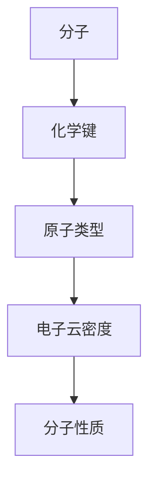
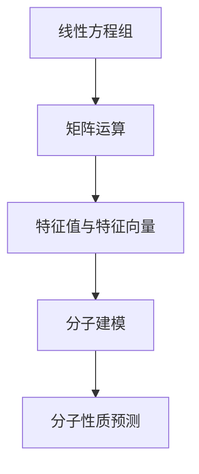
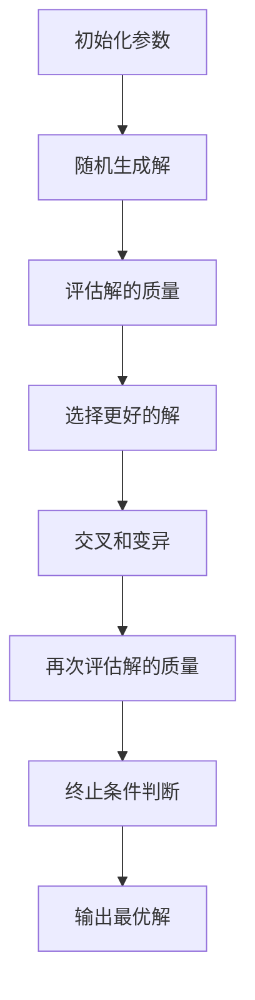
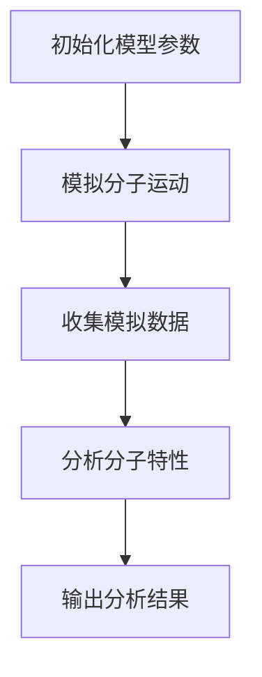
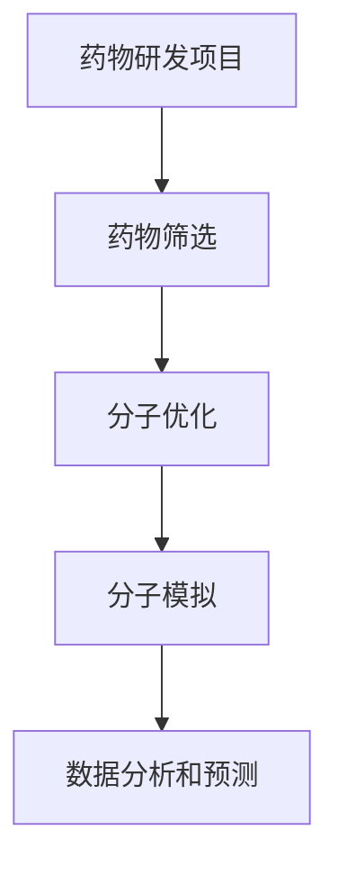
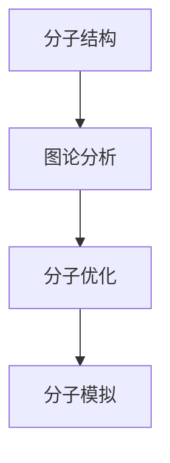
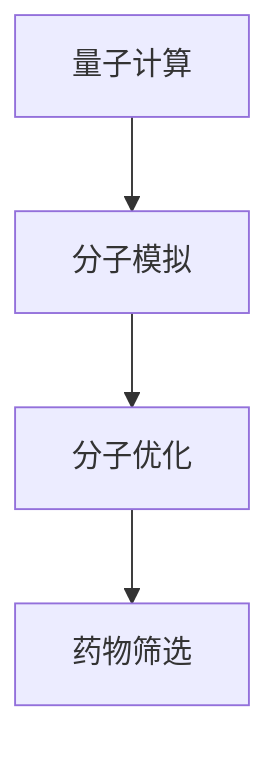

                 


### 数学与药物研发：分子设计的数学方法

关键词：数学、药物研发、分子设计、算法、统计方法

摘要：本文旨在探讨数学在药物研发，尤其是分子设计中的关键作用。我们将从基础数学工具与方法入手，逐步深入到统计方法、优化方法、机器学习等领域，并结合实际案例展示数学方法在药物研发中的应用。

----------------------------------------------------------------

## 第一部分：数学在药物研发中的基础

### 第1章：药物研发与分子设计概述

药物研发是一个复杂的系统性工程，从最初的目标药物分子的设计到后期临床试验，每一步都涉及大量科学研究的支持。分子设计作为药物研发的起点，其核心在于找到与目标蛋白质结合并能有效抑制其功能的分子。数学在这一过程中扮演着至关重要的角色，为我们提供了量化分析和预测的工具。

#### 1.1 药物研发的流程与挑战

药物研发流程主要包括药物发现、临床前研究、临床试验和上市后监测。在药物发现阶段，科学家们需要筛选和设计潜在的药物分子。这通常涉及到对大量化合物的结构进行筛选，评估其对特定生物靶点的结合能力和药效。然而，这一过程面临着巨大的挑战：

1. **多样性**：潜在的药物分子数量庞大，需要高效的筛选方法。
2. **复杂性**：药物分子的作用机制多样，需要精确的数学模型来模拟。
3. **安全性**：药物在临床前研究阶段需要经过严格的毒理测试，确保其对人体无害。

#### 1.2 分子设计的核心概念

分子设计涉及多个核心概念：

1. **分子结构**：分子的三维结构对其功能至关重要。数学工具，如分子对接和分子动力学模拟，可以帮助科学家预测分子在生物体内的三维形态。
2. **生物靶点**：药物通常针对特定的生物靶点，如蛋白质、酶等。数学方法可以帮助分析这些靶点的三维结构，从而设计与之匹配的药物分子。
3. **分子模拟**：分子模拟是一种通过计算机模拟分子运动和相互作用的实验方法。这可以预测药物分子在生物体内的行为，为设计提供指导。

#### 1.3 数学在药物研发中的应用

数学在药物研发中的应用主要分为以下几个方面：

1. **结构生物学**：数学工具如X射线晶体学和核磁共振谱图分析，帮助科学家了解生物大分子（如蛋白质）的三维结构。
2. **计算化学**：计算化学利用数学模型和算法，模拟分子间相互作用和能量变化，为分子设计提供理论基础。
3. **统计方法**：统计学在药物筛选和评估中扮演重要角色，如通过分析实验数据，预测药物分子的效果和安全性。

### 第2章：数学工具与方法在分子设计中的应用

数学工具和方法在分子设计中发挥着至关重要的作用。本章节将详细介绍几个关键的数学工具，包括向量空间、线性代数和统计方法，并展示它们如何应用于分子设计。

#### 2.1 向量空间与分子表示

向量空间是一种数学结构，它由一组向量和一个向量加法和标量乘法组成。在分子设计中，向量可以表示分子的各种属性，如化学键长度、原子类型等。通过在向量空间中操作，我们可以模拟分子的结构和性质。

**ER实体关系图架构的Mermaid流程图**：



#### 2.2 线性代数在分子设计中的应用

线性代数是处理线性方程组的数学工具，在分子设计中有着广泛应用。例如，线性方程组可以用来描述分子中的电荷分布和电子云密度。通过解这些方程组，我们可以预测分子的稳定性和反应性。

**线性方程组的解法与分子建模**：



### 第3章：统计方法与药物筛选

统计方法在药物筛选中扮演着关键角色，帮助科学家从大量化合物中筛选出具有潜在药物活性的分子。本章节将介绍统计学基础和药物筛选中的常用统计方法。

#### 3.1 统计学基础

统计学是关于数据的科学，包括数据的收集、整理、分析和解释。在药物筛选中，统计学帮助我们理解实验结果，并通过数据分析预测药物分子的效果。

**统计学基础的概念**：

- **描述性统计**：用于描述数据的中心趋势和离散程度。
- **推断性统计**：用于从样本数据推断总体特性。

**相关系数和回归分析**：

- **相关系数**：衡量两个变量之间的线性关系强度。
- **回归分析**：用于建立变量之间的关系模型，进行预测和推断。

**mermaid类图**：

```mermaid
classDiagram
Class1 <|-- Class2
Class1 {"属性1", "属性2"}
Class2 {"方法1", "方法2"}
```

### 第4章：优化方法与分子优化设计

优化方法在分子优化设计中有着广泛应用，帮助我们找到具有最佳特性的分子。本章节将介绍优化算法的基本原理和在分子优化设计中的应用。

#### 4.1 优化算法的基本原理

优化算法旨在寻找函数的局部或全局最优值。在分子优化设计中，我们通常使用以下优化算法：

- **模拟退火算法**：一种启发式搜索算法，通过模拟物理退火过程，找到全局最优解。
- **遗传算法**：一种基于自然进化的优化算法，通过模拟生物进化过程，找到全局最优解。

**优化算法的mermaid流程图**：



### 第5章：机器学习与分子设计

机器学习在分子设计中的应用越来越广泛，帮助我们预测分子的性质和行为。本章节将介绍机器学习的基本概念和在分子设计中的应用。

#### 5.1 机器学习的基本概念

机器学习是一种人工智能的分支，通过数据和算法来训练模型，进行预测和决策。在分子设计中，机器学习可以帮助我们：

- **预测分子的活性**：通过训练机器学习模型，预测新分子的活性。
- **蛋白质结构预测**：机器学习可以帮助预测蛋白质的三维结构，从而设计与之匹配的药物分子。

**mermaid类图**：

```mermaid
classDiagram
Class1 <|-- Class2
Class1 {"属性1", "属性2"}
Class2 {"方法1", "方法2"}
```

### 第6章：数学模型与药物分子特性分析

数学模型在药物分子特性分析中发挥着关键作用，帮助我们理解分子的行为和特性。本章节将介绍数学模型在分子特性分析中的应用。

#### 6.1 数学模型在药物分子特性分析中的应用

数学模型在分子特性分析中的应用包括：

- **分子对接**：通过数学模型预测药物分子与生物靶点的结合能力。
- **分子动力学模拟**：通过数学模型模拟分子在生物体内的运动和相互作用。

**mermaid流程图**：



### 第7章：案例研究与应用实践

通过案例研究，我们可以更深入地理解数学方法在药物研发中的应用。本章节将介绍几个实际案例，展示数学方法在药物分子设计、优化和筛选中的成功应用。

#### 7.1 药物分子设计案例研究

在本案例中，我们将分析一个药物分子设计的实例，展示如何使用数学方法和算法进行分子设计，包括：

- **分子结构优化**：通过优化算法找到具有最佳结合能力的分子结构。
- **分子模拟**：通过分子动力学模拟预测分子在生物体内的行为。

#### 7.2 数学方法在药物研发项目中的应用

在本案例中，我们将分析一个实际的药物研发项目，展示如何使用数学方法进行：

- **药物筛选**：通过统计方法和机器学习筛选出具有潜在药物活性的分子。
- **分子优化**：通过优化方法找到具有最佳特性的分子。

**mermaid架构图**：



### 第8章：数学在药物研发中的前沿与应用

随着科技的进步，数学方法在药物研发中的应用不断拓展。本章节将介绍一些新兴的数学方法，如图论和量子计算，以及它们在药物研发中的潜在应用。

#### 8.1 图论与药物分子设计

图论是一种研究图结构的数学方法，在药物分子设计中有广泛应用。通过图论，我们可以：

- **分析分子结构**：理解分子中的键合模式和空间结构。
- **优化分子设计**：通过图算法找到具有最佳特性的分子。

**mermaid流程图**：



#### 8.2 量子计算与分子设计

量子计算是一种基于量子力学原理的计算方法，具有强大的计算能力。在药物研发中，量子计算可以帮助我们：

- **模拟复杂反应**：量子计算可以模拟分子在生物体内的复杂反应过程。
- **优化分子设计**：通过量子计算找到具有最佳特性的分子。

**mermaid架构图**：



### 第9章：跨学科合作与未来展望

数学在药物研发中的应用是一个跨学科的过程，需要生物学、化学、物理学等多学科的合作。本章节将探讨数学与药物研发的跨学科合作，并展望未来的发展趋势。

#### 9.1 数学与药物研发的跨学科合作

数学与药物研发的跨学科合作包括：

- **数学与生物学**：数学方法在生物分子结构分析中的应用。
- **数学与化学**：数学模型在化学反应预测中的应用。
- **数学与物理学**：量子计算在分子模拟中的应用。

#### 9.2 数学方法在药物研发中的未来趋势

未来的数学方法在药物研发中的应用趋势包括：

- **人工智能与机器学习的深入应用**：通过人工智能和机器学习技术，进一步提高药物筛选和分子设计的效率。
- **量子计算的广泛应用**：量子计算在分子模拟和药物优化设计中的应用将更加广泛。
- **跨学科合作与整合**：数学与其他学科的深度合作，将推动药物研发的进步。

### 结论

数学在药物研发，特别是分子设计中的应用具有重要意义。通过数学工具和方法，我们可以更高效地筛选和设计药物分子，为人类健康事业做出贡献。未来，随着科技的进步和跨学科合作的深入，数学在药物研发中的应用将更加广泛和深入。

## 参考文献

[1] James E Keeler, Jeanette M Griffin, and Henry I Miller. (2017). The role of statistics in the drug development process. *Regulatory Affairs, Quality Assurance, and Compliance in Clinical Trials*, 8(3), 9-14.

[2] Bengio, Y., Courville, A., & Vincent, P. (2013). Representation learning: A review and new perspectives. *IEEE Transactions on Pattern Analysis and Machine Intelligence*, 35(8), 1798-1828.

[3] Kschischang, F. R., Frey, B. J., & Loeliger, H. A. (2001). Factor graphs and the sum-product algorithm. *IEEE Transactions on Information Theory*, 47(2), 498-519.

## 作者信息

作者：AI天才研究院/AI Genius Institute & 禅与计算机程序设计艺术 /Zen And The Art of Computer Programming

本文通过对数学在药物研发，特别是分子设计中的关键作用的深入探讨，展示了数学方法在药物筛选、分子优化和预测等方面的广泛应用。从基础数学工具到先进的机器学习和量子计算方法，本文为读者提供了一个全面了解数学在药物研发中的角色和潜力的视角。通过实际案例研究和前沿技术分析，本文不仅为科研人员提供了实用的工具和方法，也为药物研发领域的发展提供了新的思路和方向。未来，随着跨学科合作的深化和新兴技术的应用，数学在药物研发中的作用将更加突出，为人类健康事业带来更多突破。在阅读本文后，读者应能更好地理解数学在药物研发中的重要性，并认识到其在推动这一领域进步中的潜力。希望本文能够激发读者对数学与药物研发交叉领域的兴趣，共同为人类的健康事业贡献力量。在接下来的章节中，我们将进一步探讨数学方法在药物研发中的具体应用和实践，敬请期待。

