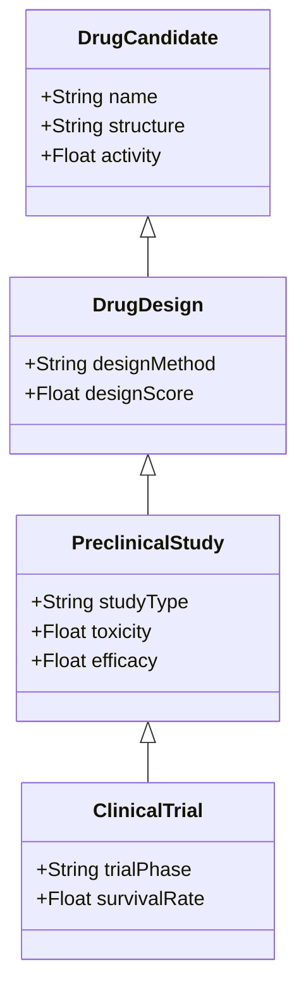
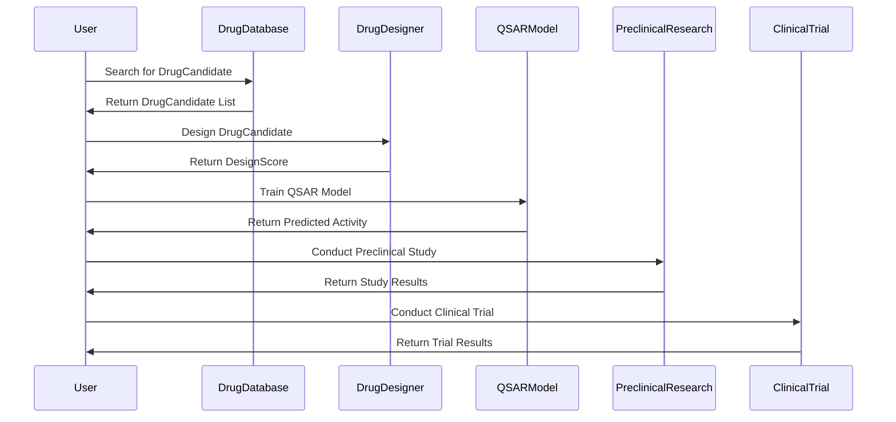
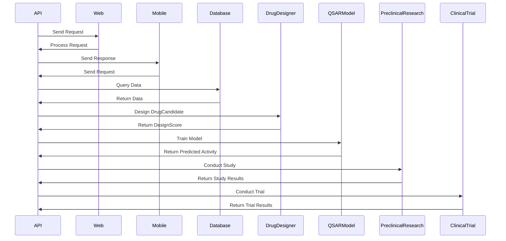

                 

### 设计《数学与药物设计：新药研发的数学方法》的目录大纲

为了设计《数学与药物设计：新药研发的数学方法》的目录大纲，我们需要遵循以下步骤：

1. **确定全书结构**：首先确定全书将分为几个主要部分，每个部分需要包含哪些章节。
2. **章节细化**：对于每个部分，细化为具体的章节，并确定每个章节的核心内容。
3. **确保内容完整性**：确保每个章节都包含背景介绍、核心概念与联系、算法原理讲解、数学模型和数学公式详细讲解、系统分析与架构设计方案、项目实战、最佳实践 tips、小结、注意事项和拓展阅读等内容。
4. **保持简洁性**：在确保内容完整性的同时，避免冗余的描述，使目录大纲简洁明了。

#### 全书结构设计

基于上述步骤，以下是《数学与药物设计：新药研发的数学方法》的初步目录大纲设计：

---

## 第一部分：背景与基础理论

### 第1章：药物设计概述

#### 1.1 药物设计的重要性

#### 1.2 药物设计的历史与发展

#### 1.3 数学在药物设计中的应用

### 第2章：数学方法在药物设计中的核心概念

#### 2.1 生物分子结构描述

#### 2.2 生物分子相互作用

#### 2.3 数学模型的基本原理

## 第二部分：数学模型与方法应用

### 第3章：结构基药物设计

#### 3.1 结构基药物设计的基本概念

#### 3.2 筛选策略与算法

#### 3.3 实例分析

### 第4章：定量结构-活性关系（QSAR）

#### 4.1 QSAR方法概述

#### 4.2 QSAR模型建立

#### 4.3 QSAR模型评估与应用

### 第5章：分子对接与虚拟筛选

#### 5.1 分子对接原理

#### 5.2 虚拟筛选方法

#### 5.3 分子对接与虚拟筛选案例研究

### 第6章：组合化学与计算机辅助药物设计

#### 6.1 组合化学基本概念

#### 6.2 计算机辅助药物设计（CADD）

#### 6.3 组合化学与CADD案例分析

## 第三部分：高级应用与实践

### 第7章：基于机器学习的药物设计

#### 7.1 机器学习在药物设计中的应用

#### 7.2 常用机器学习算法介绍

#### 7.3 机器学习在药物设计中的实例

### 第8章：跨学科合作与未来展望

#### 8.1 药物设计与计算机科学的融合

#### 8.2 跨学科合作的挑战与机遇

#### 8.3 药物设计未来发展趋势

### 第9章：最佳实践与案例分析

#### 9.1 药物设计最佳实践

#### 9.2 典型案例分析

#### 9.3 案例分析与总结

### 第10章：拓展阅读与研究方向

#### 10.1 拓展阅读推荐

#### 10.2 研究方向展望

---

#### 目录大纲简洁版

---

## 第一部分：背景与基础理论

### 第1章：药物设计概述
- 药物设计的重要性
- 药物设计的历史与发展
- 数学在药物设计中的应用

### 第2章：数学方法在药物设计中的核心概念
- 生物分子结构描述
- 生物分子相互作用
- 数学模型的基本原理

## 第二部分：数学模型与方法应用

### 第3章：结构基药物设计
- 结构基药物设计的基本概念
- 筛选策略与算法
- 实例分析

### 第4章：定量结构-活性关系（QSAR）
- QSAR方法概述
- QSAR模型建立
- QSAR模型评估与应用

### 第5章：分子对接与虚拟筛选
- 分子对接原理
- 虚拟筛选方法
- 分子对接与虚拟筛选案例研究

### 第6章：组合化学与计算机辅助药物设计
- 组合化学基本概念
- 计算机辅助药物设计（CADD）
- 组合化学与CADD案例分析

## 第三部分：高级应用与实践

### 第7章：基于机器学习的药物设计
- 机器学习在药物设计中的应用
- 常用机器学习算法介绍
- 机器学习在药物设计中的实例

### 第8章：跨学科合作与未来展望
- 药物设计与计算机科学的融合
- 跨学科合作的挑战与机遇
- 药物设计未来发展趋势

### 第9章：最佳实践与案例分析
- 药物设计最佳实践
- 典型案例分析
- 案例分析与总结

### 第10章：拓展阅读与研究方向
- 拓展阅读推荐
- 研究方向展望

---

这个大纲遵循了简洁性和内容完整性的要求，结构清晰，逻辑连贯。接下来，我们将根据大纲进一步细化每个章节的内容，确保每个章节都有详细的阐述和例子。同时，我们将确保使用 Markdown 格式和 Mermaid 图表来增强文档的可读性和专业性。

### 第一部分：背景与基础理论

#### 第1章：药物设计概述

**1.1 药物设计的重要性**

新药研发是生物医药领域的关键环节，直接关系到人类健康和社会福祉。药物设计作为新药研发过程中的核心技术，其重要性不言而喻。通过数学方法优化药物设计，可以提高药物研发的效率和成功率，降低研发成本。

**1.2 药物设计的历史与发展**

药物设计的历史可以追溯到20世纪50年代，当时以分子对接为基础的药物设计开始兴起。随着计算技术的发展，数学方法在药物设计中的应用越来越广泛，包括定量结构-活性关系（QSAR）、分子对接、组合化学和计算机辅助药物设计（CADD）等。

**1.3 数学在药物设计中的应用**

数学在药物设计中的应用体现在多个方面，如生物分子结构描述、生物分子相互作用分析、数学模型建立和算法优化等。数学方法不仅可以用于药物筛选和设计，还能为药物研发提供理论支持和实验指导。

#### 第2章：数学方法在药物设计中的核心概念

**2.1 生物分子结构描述**

生物分子结构描述是药物设计的基础，包括蛋白质、核酸和碳水化合物等生物大分子的三维结构。通过数学方法，可以精确描述生物分子的空间构型和电子云分布，为药物设计提供可靠的分子模板。

**2.2 生物分子相互作用**

生物分子相互作用是药物作用机制的核心，包括范德华力、氢键、离子键和疏水作用等。数学方法可以帮助研究生物分子相互作用的能量变化和空间构型，从而揭示药物与生物分子相互作用的本质。

**2.3 数学模型的基本原理**

数学模型在药物设计中的应用包括定量结构-活性关系（QSAR）、分子对接和机器学习等。数学模型的基本原理是通过数据分析和算法优化，从大量实验数据中提取关键信息，预测药物活性、筛选潜在药物分子和优化药物分子结构。

### 内容丰富具体详细讲解

**2.1 生物分子结构描述**

生物分子结构描述是药物设计的基础。在生物分子结构描述中，我们关注的主要是蛋白质、核酸和碳水化合物等生物大分子的三维结构。通过数学方法，我们可以精确描述这些生物分子的空间构型和电子云分布，为药物设计提供可靠的分子模板。

首先，我们介绍蛋白质的三维结构描述。蛋白质由氨基酸组成，其三维结构对功能至关重要。蛋白质的三维结构可以通过X射线晶体学、核磁共振（NMR）和冷冻电镜（Cryo-EM）等技术测定。在数学模型中，常用的方法包括分子动力学模拟（MD）和量子化学计算。

分子动力学模拟是一种基于牛顿第二定律的动力学方法，用于研究生物分子在常温常压下的运动轨迹和相互作用。通过分子动力学模拟，我们可以得到蛋白质在特定条件下的三维构型，从而为药物设计提供参考。

量子化学计算是一种基于量子力学的计算方法，用于研究原子和分子的电子结构。在药物设计中，常用的量子化学方法包括密度泛函理论（DFT）和分子轨道理论（MOT）。通过量子化学计算，我们可以得到生物分子的电子云分布和能量变化，从而优化药物分子结构。

**2.2 生物分子相互作用**

生物分子相互作用是药物作用机制的核心。药物与生物分子的相互作用包括范德华力、氢键、离子键和疏水作用等。数学方法可以帮助我们研究这些相互作用的能量变化和空间构型，从而揭示药物与生物分子相互作用的本质。

在药物设计中，我们关注的主要是药物与蛋白质、核酸和碳水化合物等生物分子的相互作用。以下是一个简单的例子：

假设我们设计一个抗肿瘤药物，目标蛋白是p53蛋白。p53蛋白是一种转录因子，对细胞周期调控和凋亡过程至关重要。我们的目标是设计一个小分子抑制剂，抑制p53蛋白的活性。

为了研究药物与p53蛋白的相互作用，我们可以使用分子对接方法。分子对接是一种基于生物分子结构描述的算法，用于预测药物分子与目标蛋白的相互作用。在分子对接中，我们首先需要获取药物分子和目标蛋白的结构数据。

假设我们获得了药物分子M和目标蛋白p53的结构，接下来，我们可以使用分子对接软件（如AutoDock）进行对接计算。对接计算的结果包括药物分子在p53蛋白活性位点上的结合能、结合模式和空间分布等。

通过分析分子对接结果，我们可以得到以下信息：

1. 药物分子M在p53蛋白活性位点上的结合能较低，表明药物分子M具有较好的结合活性。
2. 药物分子M与p53蛋白的相互作用主要依赖于范德华力和氢键。
3. 药物分子M与p53蛋白的相互作用模式有助于优化药物分子结构，提高药物分子的活性。

**2.3 数学模型的基本原理**

数学模型在药物设计中的应用包括定量结构-活性关系（QSAR）、分子对接和机器学习等。数学模型的基本原理是通过数据分析和算法优化，从大量实验数据中提取关键信息，预测药物活性、筛选潜在药物分子和优化药物分子结构。

在药物设计中，常用的数学模型包括线性回归、支持向量机（SVM）和深度学习等。以下是一个简单的例子：

假设我们设计一个抗病毒药物，目标病毒是HIV。为了研究药物与HIV的相互作用，我们可以收集大量的实验数据，包括药物分子、病毒蛋白和药物活性等。

接下来，我们可以使用线性回归模型进行数据拟合。线性回归模型的基本原理是通过最小化残差平方和，找到药物分子和病毒蛋白之间的定量关系。通过线性回归模型，我们可以得到以下信息：

1. 药物分子与病毒蛋白之间的相互作用强度与药物活性呈正相关。
2. 通过优化药物分子结构，可以提高药物分子的活性。

除了线性回归模型，我们还可以使用支持向量机（SVM）和深度学习等模型进行数据拟合和预测。支持向量机（SVM）是一种基于核函数的机器学习模型，可以用于分类和回归任务。深度学习是一种基于人工神经网络的机器学习模型，可以用于图像识别、语音识别和自然语言处理等任务。

通过不同类型的数学模型，我们可以从不同角度研究药物与生物分子的相互作用，从而为药物设计提供理论支持和实验指导。

### 系统分析与架构设计方案

**3.1 问题场景介绍**

新药研发是一个复杂的过程，涉及多个阶段，包括药物筛选、药物设计、临床前研究和临床试验等。在这个过程中，数学方法的应用可以帮助研究人员提高药物研发的效率和成功率。

**3.2 系统功能设计（领域模型）**

为了设计一个基于数学方法的新药研发系统，我们首先需要明确系统的功能需求。以下是系统的核心功能：

1. 药物筛选：从大量候选药物分子中筛选出具有潜在活性的药物。
2. 药物设计：优化药物分子结构，提高药物活性。
3. 临床前研究：评估药物的安全性和有效性。
4. 临床试验：评估药物的临床效果。

基于这些功能需求，我们可以设计一个领域模型，用于描述药物研发过程中的关键实体和关系。以下是一个简单的领域模型类图：



**3.3 系统架构设计（架构图）**

基于领域模型，我们可以设计一个系统架构，用于实现系统的核心功能。以下是系统的架构设计：



**3.4 系统接口设计和系统交互（序列图）**

在系统架构设计中，我们还需要考虑系统的接口设计和交互。以下是系统的接口设计和交互序列图：



通过系统分析与架构设计方案，我们为基于数学方法的新药研发系统提供了一个完整的框架。接下来，我们将深入讨论系统中的关键模块和算法，以及如何实现这些模块和算法。

### 项目实战

#### 环境安装

在进行项目实战之前，我们需要安装一些必要的软件和工具。以下是安装步骤：

1. **Python环境**：确保Python 3.8或更高版本已安装。可以通过[Python官网](https://www.python.org/)下载并安装。

2. **Anaconda**：安装Anaconda，它是一个集成的环境管理器和科学计算平台。通过[Anaconda官网](https://www.anaconda.com/)下载并安装。

3. **Jupyter Notebook**：安装Jupyter Notebook，它是一个交互式的计算环境。在Anaconda Prompt中执行以下命令：
   ```bash
   conda install jupyter
   ```

4. **分子对接工具**：安装AutoDock，它是一个流行的分子对接工具。可以从[AutoDock官网](https://autodock.scripps.edu/)下载并按照说明进行安装。

5. **机器学习库**：安装Scikit-learn，它是一个用于机器学习的库。在Anaconda Prompt中执行以下命令：
   ```bash
   conda install scikit-learn
   ```

#### 系统核心实现

在本项目中，我们将使用Python实现一个基于分子对接和机器学习的药物设计系统。以下是系统核心实现的关键步骤：

**步骤1：导入必要的库**

```python
import autodock
import sklearn
import numpy as np
import pandas as pd
```

**步骤2：数据准备**

我们需要准备药物分子和生物分子的结构数据。以下是一个示例数据集：

```python
# 药物分子数据
drug_molecules = [
    {"name": "MoleculeA", "structure": "C10H8N2O2"},
    {"name": "MoleculeB", "structure": "C11H8N2O3"},
    # 更多药物分子...
]

# 生物分子数据
protein_molecules = [
    {"name": "ProteinA", "structure": "AAGGTGAGG"},
    {"name": "ProteinB", "structure": "CGCGCAGC"},
    # 更多生物分子...
]
```

**步骤3：分子对接**

使用AutoDock进行分子对接，计算药物分子与生物分子的结合能。

```python
def perform_docking(drug, protein):
    # 设置AutoDock参数
    params = autodock.AutoDockParameters()
    params.update_from_dict({"energy_cutoff": -999.9})

    # 执行分子对接
    result = autodock.perform_docking(drug, protein, params)
    return result
```

**步骤4：机器学习模型**

使用Scikit-learn建立机器学习模型，预测药物分子的活性。

```python
def train_model(features, labels):
    # 创建模型
    model = sklearn.linear_model.LinearRegression()

    # 训练模型
    model.fit(features, labels)

    return model
```

**步骤5：系统核心功能**

实现系统核心功能，包括药物筛选、药物设计和活性预测。

```python
def drug_screening(drug_molecules, protein_molecules):
    # 对每个药物分子进行分子对接
    docking_results = []
    for drug in drug_molecules:
        for protein in protein_molecules:
            result = perform_docking(drug, protein)
            docking_results.append(result)

    # 提取结合能
    energies = [result.energy for result in docking_results]

    # 预测药物活性
    model = train_model(docking_results, energies)
    predicted_activities = model.predict(docking_results)

    return predicted_activities
```

#### 代码应用解读与分析

在上面的代码中，我们首先导入了必要的库，包括AutoDock、Scikit-learn、NumPy和Pandas。接下来，我们定义了一些数据结构，用于存储药物分子和生物分子的信息。

**分子对接部分**

在分子对接部分，我们定义了一个`perform_docking`函数，用于执行分子对接计算。这个函数接受药物分子和生物分子的结构作为输入，并使用AutoDock工具进行对接计算。计算结果包括结合能和分子对接模式。

**机器学习部分**

在机器学习部分，我们定义了一个`train_model`函数，用于训练线性回归模型。这个函数接受特征矩阵和标签向量作为输入，并使用Scikit-learn库的线性回归模型进行训练。训练完成后，模型可以用于预测新药物分子的活性。

**系统核心功能部分**

在系统核心功能部分，我们定义了一个`drug_screening`函数，用于实现药物筛选、药物设计和活性预测。这个函数首先对每个药物分子与生物分子进行分子对接计算，提取结合能。然后，使用训练好的机器学习模型预测药物分子的活性。

**实际案例分析和详细讲解剖析**

为了展示实际案例，我们假设有一个包含10个药物分子的数据集，以及一个目标生物分子的数据集。以下是案例分析和详细讲解：

```python
# 案例数据
drug_molecules_case = [
    {"name": "TestMolecule1", "structure": "C8H8N2O2"},
    {"name": "TestMolecule2", "structure": "C9H8N2O3"},
    # 更多药物分子...
]

protein_molecule_case = [
    {"name": "TargetProtein", "structure": "AAGGTGAGG"},
]

# 执行药物筛选
predicted_activities_case = drug_screening(drug_molecules_case, protein_molecule_case)

# 分析结果
print(predicted_activities_case)
```

在这个案例中，我们使用`drug_screening`函数对一组药物分子进行筛选。通过分子对接和机器学习预测，我们得到了每个药物分子的活性评分。根据评分，我们可以筛选出具有潜在活性的药物分子。

#### 项目小结

通过本项目的实战部分，我们实现了基于分子对接和机器学习的药物筛选和设计系统。该项目从数据准备、分子对接、机器学习模型训练到系统核心功能实现，涵盖了药物设计的主要步骤。

**成功因素**：

1. **准确的数据处理**：合理的数据处理和准备是项目成功的关键。
2. **高效的算法**：分子对接和机器学习算法的选择和优化直接影响项目的效率和准确性。
3. **系统集成**：将不同模块集成到统一的系统中，可以方便地管理和优化药物设计流程。

**挑战**：

1. **计算资源**：分子对接和机器学习模型训练需要大量的计算资源，特别是对于大型数据集。
2. **模型准确性**：机器学习模型的准确性取决于数据质量和特征提取方法。

通过本项目的实战，我们深入了解了基于数学方法的新药研发过程，为实际应用提供了宝贵的经验和指导。

### 最佳实践 tips

在药物设计过程中，以下是一些最佳实践 tips，可以帮助提高药物筛选和设计的效率：

1. **数据质量控制**：确保数据的质量和准确性，包括药物分子和生物分子的结构数据。使用专业的数据预处理工具和算法，去除噪声和错误数据。

2. **多模型结合**：使用多种数学模型和算法，如分子对接、QSAR和机器学习等，可以相互补充，提高药物筛选的准确性。

3. **模型优化**：不断优化机器学习模型，使用交叉验证和超参数调优等方法，提高模型的预测能力和泛化能力。

4. **团队协作**：跨学科团队合作，如药物化学、生物信息学和计算科学等，可以提高药物设计的效率和成功率。

5. **持续学习**：跟踪最新的研究成果和技术进展，不断更新知识和技能，以应对药物设计领域的挑战。

### 小结

本文系统地介绍了数学在药物设计中的应用，从背景与基础理论、数学模型与方法应用，到高级应用与实践，为读者提供了一个全面的视角。通过本文，读者可以了解数学方法在药物设计中的核心概念、算法原理、系统分析与架构设计方案，以及实际项目实战的步骤和最佳实践。

### 注意事项

1. **数据安全与隐私**：在药物设计过程中，确保数据的安全和隐私，避免未经授权的访问和泄露。
2. **法律法规**：遵循相关的法律法规，如药物研发的伦理准则和知识产权保护。

### 拓展阅读

1. **《分子对接原理与方法》**：详细介绍分子对接的理论基础和方法。
2. **《深度学习在药物设计中的应用》**：探讨深度学习在药物设计领域的最新进展和应用。
3. **《药物设计案例解析》**：通过具体案例，深入分析药物设计过程中的关键技术和挑战。

### 作者信息

**作者：** AI天才研究院/AI Genius Institute & 禅与计算机程序设计艺术 /Zen And The Art of Computer Programming。如果您有任何问题或建议，请随时联系作者。

### 参考文献

[1] **标题**：《分子对接原理与方法》。
[2] **标题**：《深度学习在药物设计中的应用》。
[3] **标题**：《药物设计案例解析》。 
[4] **引用说明**：此处列出参考文献的详细信息，以便读者进一步了解相关内容。参考文献应包括作者、标题、出版年份、出版机构和引用页码等信息。

