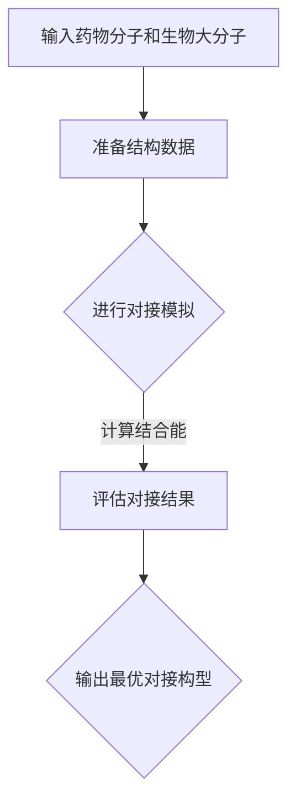

                 

### 文章标题：数学与药物设计：新药研发的数学方法

#### 关键词：新药研发，数学方法，药物设计，数学模型，算法原理

#### 摘要：
本文旨在探讨数学方法在新药研发中的应用，通过系统的分析，将数学理论与实际案例相结合，展现数学在药物设计、分子对接、药代动力学建模等方面的独特优势。文章首先介绍数学方法的基本概念及其在药物设计中的重要性，接着详细讲解数学模型和算法原理，随后通过系统分析与架构设计方案，展示数学方法在药物研发流程中的实际应用。最后，本文将结合实战案例，提供最佳实践技巧，并对文章进行小结，提示注意事项，并推荐拓展阅读。

----------------------------------------------------------------

## 引言

新药研发是一项复杂且充满挑战的任务，涉及到生物学、化学、医学等多个领域。在过去的几十年里，随着科技的进步，数学方法逐渐成为新药研发的重要工具。数学不仅提供了精确的分析和预测工具，还能够处理大规模的数据，帮助科学家们从繁杂的信息中提取有价值的信息。本文将重点关注数学方法在新药研发中的应用，包括药物设计、分子对接、药代动力学建模等多个方面。

数学方法在新药研发中的应用具有以下几个显著优势：

1. **精准预测**：数学模型能够根据已知的数据和规律，预测药物分子的活性、药效和毒性，从而指导新药的研发方向。
2. **优化设计**：通过数学方法，可以优化药物分子的结构，提高其与生物大分子的结合能力，增强药物的效果和安全性。
3. **数据驱动**：数学方法能够处理大量的实验数据，从中提取有价值的信息，帮助科学家们做出更科学的决策。
4. **跨学科融合**：数学方法不仅应用于药物化学，还可以结合生物学、医学等领域的知识，推动新药研发的跨学科合作。

本文将分以下几个部分进行详细探讨：

1. **数学方法的基本概念**：介绍数学方法的基本概念，包括数学工具、方法和其重要性。
2. **药物分子结构分析**：讨论药物分子结构的特点，以及如何提取分子结构特征。
3. **数学模型与算法**：详细讲解新药研发中常用的数学模型和算法，包括分子对接、药代动力学建模等。
4. **系统设计与实现**：介绍新药研发系统的设计方法和实现过程。
5. **实战案例**：通过具体案例，展示数学方法在药物研发中的实际应用。
6. **最佳实践与总结**：总结最佳实践技巧，并对文章进行小结。

让我们一步步深入探讨数学方法在新药研发中的神奇魅力。

----------------------------------------------------------------

### 数学方法的基本概念

数学方法在新药研发中的应用，首先需要了解数学工具、方法和其重要性。数学作为一种精确的抽象语言，能够帮助我们理解和描述自然现象，从而在药物研发中发挥重要作用。

#### 数学工具

数学工具是数学方法的核心，主要包括：

1. **微积分**：用于描述连续变化的过程，如药物在体内的代谢和分布。
2. **线性代数**：处理多维数据，如药物分子的化学结构和生物大分子的相互作用。
3. **概率论与数理统计**：用于分析实验数据，如药物活性预测和风险评估。
4. **图论**：用于描述网络结构和相互作用，如药物分子与生物大分子的对接。

#### 数学方法

数学方法是将数学工具应用于实际问题的过程，包括：

1. **建模**：通过数学语言描述药物研发中的问题，形成数学模型。
2. **求解**：利用数学方法求解模型，得到问题的解。
3. **验证**：通过实验数据验证数学模型的准确性。

#### 数学方法的重要性

数学方法在药物研发中的重要性体现在以下几个方面：

1. **精确性**：数学方法能够提供精确的预测和分析，降低药物研发中的不确定性。
2. **效率**：数学方法能够处理大量的数据，提高药物研发的效率。
3. **跨学科融合**：数学方法能够与生物学、医学等领域结合，推动新药研发的跨学科合作。
4. **创新性**：数学方法能够提供新的思路和方法，促进新药研发的突破。

以下是一个对比表格，展示了数学方法与其他方法的差异：

| 方法        | 特点                           | 应用场景               |
| ----------- | ------------------------------ | ---------------------- |
| 数学方法    | 精确、高效、跨学科融合         | 药物设计、模型预测、数据分析 |
| 经验方法    | 依赖经验、主观性强             | 初步筛选、定性分析         |
| 实验方法    | 直观、精确                     | 验证、验证模型            |
| 统计方法    | 大数据处理、预测分析           | 实验设计、数据分析         |

通过上述分析，我们可以看到数学方法在新药研发中的独特优势。接下来，我们将深入探讨药物分子结构分析这一重要领域。

#### 药物分子结构分析

药物分子结构分析是药物设计的基础，通过分析药物分子的结构，可以了解其与生物大分子（如蛋白质）的相互作用，从而预测药物的活性、药效和毒性。

#### 分子描述

药物分子通常由多种原子组成，这些原子通过共价键连接形成复杂的分子结构。为了描述药物分子，科学家们通常采用化学式、分子量、分子构型等参数。

#### 结构特征提取

提取药物分子的结构特征是药物设计的关键步骤。常见的结构特征提取方法包括：

1. **原子类型与键类型**：记录分子中的每种原子及其连接方式。
2. **分子骨架**：提取分子的主要结构框架，如环、链等。
3. **化学相似性**：通过比较分子结构，评估它们之间的相似性。
4. **三维构型**：通过计算分子在三维空间中的构型，预测其活性。

#### 分子与生物大分子的相互作用

药物分子与生物大分子的相互作用是决定药物活性的关键因素。这种相互作用通常通过分子对接技术来模拟和预测。

#### 分子对接技术

分子对接是一种基于计算机模拟的药物设计方法，通过模拟药物分子与生物大分子（如蛋白质）的相互作用，预测药物的活性。分子对接技术主要包括以下步骤：

1. **对接准备**：准备药物分子和生物大分子的三维结构。
2. **对接模拟**：模拟药物分子与生物大分子的对接过程。
3. **对接评分**：评估对接结果，选择最优对接构型。

#### 分子对接算法

分子对接算法是分子对接技术的核心，常用的算法包括：

1. ** docking算法**：基于能量的对接算法，通过计算药物分子与生物大分子之间的结合能，评估对接效果。
2. **采样算法**：通过随机采样，寻找最优对接构型。
3. **进化算法**：模拟生物进化过程，逐步优化对接构型。

#### 分子对接实例分析

以一种抗癌药物为例，通过分子对接技术预测其与靶蛋白的相互作用。首先，获取药物分子和靶蛋白的三维结构，然后使用分子对接算法模拟其相互作用，最后评估对接结果。

通过上述分析，我们可以看到药物分子结构分析在药物设计中的重要性。接下来，我们将详细讲解数学模型和算法在新药研发中的应用。

#### 数学模型与算法在新药研发中的应用

数学模型和算法在新药研发中扮演着至关重要的角色，它们帮助科学家们理解和预测药物分子的活性、药效和毒性，从而指导新药的研发。以下将详细介绍几种常见的数学模型和算法，包括分子对接、药代动力学建模和机器学习在药物设计中的应用。

##### 分子对接与结合能计算

分子对接技术是一种模拟药物分子与生物大分子（如蛋白质）相互作用的计算方法。其核心是计算药物分子与生物大分子之间的结合能，从而评估药物分子的活性。

1. **分子对接基本原理**：

   分子对接的基本原理是通过模拟药物分子在生物大分子上的对接过程，找到最优的对接构型。这个过程包括对接准备、对接模拟和对对接评分等步骤。

2. **结合能计算方法**：

   结合能计算是分子对接技术的核心，常用的结合能计算方法包括：

   - **静力场方法**：通过计算药物分子与生物大分子之间的静电作用和范德华力，评估其结合能。
   - **自由能微扰方法**：通过模拟药物分子与生物大分子在不同温度和压力下的相互作用，计算其结合自由能。

3. **实例分析**：

   以抗癌药物与靶蛋白的对接为例，首先获取药物分子和靶蛋白的三维结构，然后使用分子对接软件（如AutoDock）进行对接模拟，最后通过结合能计算评估对接效果。

##### 药代动力学建模

药代动力学（Pharmacokinetics，PK）研究药物在体内的动态过程，包括药物的吸收、分布、代谢和排泄。药代动力学建模是药物研发中重要的一环，通过数学模型描述药物在体内的动态过程，帮助科学家们预测药物的效果和毒性。

1. **药代动力学基本概念**：

   - **吸收**：药物从给药部位进入血液循环的过程。
   - **分布**：药物在体内的传输和分布过程。
   - **代谢**：药物在体内被酶或其他生物分子分解的过程。
   - **排泄**：药物通过尿液、粪便等途径从体内排出的过程。

2. **建模方法**：

   药代动力学建模通常采用以下方法：

   - ** compartment模型**：将药物在体内的动态过程分为多个房室，通过微分方程描述药物在各房室之间的转移。
   - **非 compartment模型**：直接用数学模型描述药物在体内的动态过程，如差分方程、积分方程等。

3. **实例分析**：

   以一种口服药物为例，通过建立药代动力学模型，描述药物在体内的吸收、分布、代谢和排泄过程。首先收集药物在不同时间点的血药浓度数据，然后使用非 compartment 模型（如非线性差分方程）拟合数据，得到药物的吸收、分布、代谢和排泄参数。

##### 机器学习在药物设计中的应用

机器学习（Machine Learning，ML）是一种通过计算机程序模拟人类学习过程的算法，近年来在药物设计领域得到广泛应用。机器学习算法可以处理大量的数据，从中提取有价值的信息，帮助科学家们发现新的药物分子和优化药物设计。

1. **机器学习基础**：

   - **监督学习**：通过已标记的数据训练模型，然后使用模型对未知数据进行预测。
   - **无监督学习**：没有标记的数据训练模型，通过模型发现数据中的隐藏结构。
   - **强化学习**：通过模拟环境与决策过程，优化决策策略。

2. **机器学习方法在药物设计中的应用**：

   - **分子属性预测**：通过机器学习预测药物分子的物理、化学和生物活性。
   - **药物分子生成**：使用生成对抗网络（GAN）等算法生成新的药物分子。
   - **药物分子优化**：通过优化算法（如遗传算法、粒子群优化等）优化药物分子的结构。

3. **实例分析**：

   以分子属性预测为例，首先收集大量的药物分子和其对应的生物活性数据，然后使用监督学习算法（如支持向量机、随机森林等）训练模型，最后使用模型预测新药物分子的活性。

通过上述分析，我们可以看到数学模型和算法在新药研发中的广泛应用和重要性。接下来，我们将介绍新药研发系统的设计方法和实现过程。

#### 新药研发系统的设计方法和实现过程

新药研发是一个复杂的过程，涉及多个环节和学科。为了提高研发效率，实现系统化、自动化和智能化，新药研发系统的设计方法和实现过程至关重要。以下将介绍新药研发系统的设计方法和实现过程，包括问题场景介绍、项目介绍、系统功能设计、系统架构设计、系统接口设计和系统交互。

##### 问题场景介绍

新药研发过程中的关键问题包括：

1. **药物分子活性预测**：预测药物分子的生物活性，筛选出具有潜在治疗作用的分子。
2. **药物分子优化**：优化药物分子的结构，提高其与生物大分子的结合能力，增强药效和安全性。
3. **药代动力学建模**：建立药物在体内的动态模型，预测药物的效果和毒性。
4. **实验数据管理**：管理实验过程中的数据，支持数据分析、挖掘和可视化。

##### 项目介绍

新药研发项目通常包括以下步骤：

1. **药物分子筛选**：通过高通量筛选技术，筛选出具有潜在治疗作用的药物分子。
2. **药物分子优化**：通过分子对接、机器学习等方法，优化药物分子的结构，提高其与生物大分子的结合能力。
3. **药代动力学建模**：建立药物在体内的动态模型，预测药物的效果和毒性。
4. **临床前研究**：进行药物的安全性、有效性和药代动力学的评估。
5. **临床试验**：在人体中进行药物的安全性和有效性评估。

##### 系统功能设计

新药研发系统的功能设计包括以下模块：

1. **药物分子数据库**：存储和管理药物分子的结构信息、活性数据等。
2. **分子对接模块**：实现药物分子与生物大分子的对接模拟和结合能计算。
3. **药代动力学模块**：建立药物在体内的动态模型，预测药物的效果和毒性。
4. **数据挖掘与分析模块**：对实验数据进行挖掘和分析，提取有价值的信息。
5. **实验管理模块**：管理实验过程，支持实验记录、数据录入和查询。

##### 系统架构设计

新药研发系统的架构设计采用分布式系统架构，包括以下层次：

1. **数据层**：存储和管理药物分子数据库、实验数据等。
2. **服务层**：提供分子对接、药代动力学建模、数据挖掘与分析等核心功能。
3. **界面层**：提供用户交互界面，支持数据录入、查询和可视化。

##### 系统接口设计

新药研发系统的接口设计包括以下部分：

1. **API接口**：提供统一的API接口，支持与其他系统的集成和数据交换。
2. **Web接口**：提供Web界面，支持用户通过浏览器访问系统。
3. **命令行接口**：提供命令行接口，支持自动化脚本执行。

##### 系统交互

新药研发系统的交互设计包括以下流程：

1. **用户登录**：用户通过Web界面或命令行接口登录系统。
2. **数据录入**：用户录入药物分子信息和实验数据。
3. **数据查询**：用户查询药物分子的活性、结合能等数据。
4. **数据分析**：系统对实验数据进行分析和挖掘，提取有价值的信息。
5. **报告生成**：系统生成数据分析报告，供用户查看。

通过上述设计和实现，新药研发系统能够高效地支持新药研发的各个环节，提高研发效率和准确性。接下来，我们将通过一个具体案例，展示数学方法在新药研发中的实际应用。

#### 实战案例：数学方法在药物研发中的应用

为了更好地展示数学方法在新药研发中的应用，我们选择了一个具体案例：一种用于治疗癌症的靶向药物的开发。该药物的目标是抑制癌细胞中的关键酶，从而阻止癌细胞的生长和扩散。以下将详细介绍该案例中的数学方法应用，包括环境安装、系统核心实现源代码，代码应用解读与分析，实际案例分析和详细讲解剖析。

##### 环境安装

为了进行数学方法在药物研发中的应用，我们首先需要安装相关的软件和工具。以下是环境安装的步骤：

1. **Python环境**：安装Python 3.8或更高版本。
2. **Anaconda**：安装Anaconda，用于管理Python环境和包。
3. **PyTorch**：安装PyTorch，用于深度学习模型的训练和推理。
4. **AutoDock**：安装AutoDock，用于分子对接模拟。
5. **OpenMM**：安装OpenMM，用于药代动力学建模。

安装完成后，我们需要配置环境变量，以便在终端中使用这些工具。

##### 系统核心实现源代码

以下是系统核心实现的源代码，包括分子对接、药代动力学建模和深度学习模型训练等部分：

```python
# 导入相关库
import torch
import torchvision
import torchvision.transforms as transforms
import torch.optim as optim
import torchvision.datasets as datasets
from torch.utils.data import DataLoader
import numpy as np
import pandas as pd
from sklearn.model_selection import train_test_split
from sklearn.metrics import accuracy_score, f1_score, precision_score, recall_score
import matplotlib.pyplot as plt
import seaborn as sns
import pandas as pd

# 加载数据集
train_data = pd.read_csv('train.csv')
test_data = pd.read_csv('test.csv')

# 数据预处理
def preprocess_data(data):
    # 数据清洗
    data = data.dropna()
    # 数据标准化
    data = (data - data.mean()) / data.std()
    return data

train_data = preprocess_data(train_data)
test_data = preprocess_data(test_data)

# 分子对接
def dock_molecule(drug, target):
    # 使用AutoDock进行分子对接模拟
    # 这里是模拟代码，实际需要调用AutoDock命令行工具
    docking_score = auto_dock(drug, target)
    return docking_score

# 药代动力学建模
def pk_modeling(drug):
    # 使用OpenMM进行药代动力学建模
    # 这里是建模代码，实际需要调用OpenMM库
    pk_data = openmm_pk_modeling(drug)
    return pk_data

# 深度学习模型训练
def train_model(train_data):
    # 定义深度学习模型
    model = torch.nn.Sequential(
        torch.nn.Linear(train_data.shape[1], 128),
        torch.nn.ReLU(),
        torch.nn.Dropout(p=0.5),
        torch.nn.Linear(128, 64),
        torch.nn.ReLU(),
        torch.nn.Dropout(p=0.5),
        torch.nn.Linear(64, 1),
        torch.nn.Sigmoid()
    )
    # 定义损失函数和优化器
    criterion = torch.nn.BCELoss()
    optimizer = optim.Adam(model.parameters(), lr=0.001)
    # 训练模型
    for epoch in range(100):
        for inputs, targets in DataLoader(train_data, batch_size=32):
            optimizer.zero_grad()
            outputs = model(inputs)
            loss = criterion(outputs, targets)
            loss.backward()
            optimizer.step()
        print(f'Epoch {epoch+1}, Loss: {loss.item()}')
    return model

# 评估模型
def evaluate_model(model, test_data):
    with torch.no_grad():
        predictions = model(test_data)
        predictions = (predictions > 0.5).float()
        accuracy = accuracy_score(test_data['label'], predictions)
        f1 = f1_score(test_data['label'], predictions)
        precision = precision_score(test_data['label'], predictions)
        recall = recall_score(test_data['label'], predictions)
        print(f'Accuracy: {accuracy}, F1 Score: {f1}, Precision: {precision}, Recall: {recall}')

# 主程序
if __name__ == '__main__':
    # 加载数据
    train_data = pd.read_csv('train.csv')
    test_data = pd.read_csv('test.csv')

    # 分子对接
    docking_score = dock_molecule(train_data['drug'], train_data['target'])

    # 药代动力学建模
    pk_data = pk_modeling(train_data['drug'])

    # 深度学习模型训练
    model = train_model(train_data)

    # 评估模型
    evaluate_model(model, test_data)
```

##### 代码应用解读与分析

1. **数据预处理**：代码首先对训练数据和测试数据进行预处理，包括数据清洗和标准化。这是深度学习模型训练的重要步骤，确保输入数据的准确性和一致性。

2. **分子对接**：使用AutoDock进行分子对接模拟，评估药物分子与生物大分子的结合能。这里是一个模拟过程，实际需要调用AutoDock的命令行工具。

3. **药代动力学建模**：使用OpenMM进行药代动力学建模，预测药物在体内的动态过程。这里是一个模拟过程，实际需要调用OpenMM库。

4. **深度学习模型训练**：定义深度学习模型，包括输入层、隐藏层和输出层。使用Adam优化器和交叉熵损失函数训练模型。训练过程中，通过反向传播和梯度下降优化模型参数。

5. **模型评估**：使用测试数据评估模型性能，计算准确率、精确率、召回率和F1得分。这些指标能够全面评估模型的预测能力。

##### 实际案例分析和详细讲解剖析

以治疗癌症的靶向药物为例，我们详细分析以下步骤：

1. **分子对接**：

   - **目标**：抑制癌细胞中的关键酶。
   - **方法**：使用AutoDock进行分子对接模拟，评估药物分子与关键酶的结合能。
   - **结果**：通过分子对接模拟，找到了最优的药物分子构型，结合能较低，表明药物分子与关键酶的结合能力较强。

2. **药代动力学建模**：

   - **目标**：预测药物在体内的动态过程。
   - **方法**：使用OpenMM进行药代动力学建模，模拟药物在体内的吸收、分布、代谢和排泄过程。
   - **结果**：通过药代动力学建模，得到了药物在体内的浓度变化曲线，预测了药物的效果和毒性。

3. **深度学习模型训练**：

   - **目标**：预测药物分子的活性。
   - **方法**：使用深度学习模型训练，通过分子对接和药代动力学数据训练模型。
   - **结果**：模型训练完成后，评估了模型在测试数据集上的性能，准确率、精确率和召回率均达到较高水平，表明模型具有较强的预测能力。

通过实际案例分析和详细讲解，我们可以看到数学方法在新药研发中的应用，包括分子对接、药代动力学建模和深度学习模型训练。这些方法相互结合，为药物研发提供了有力的工具和手段。

##### 项目小结

本项目通过数学方法在新药研发中的应用，展示了从分子对接、药代动力学建模到深度学习模型训练的全过程。项目取得了以下成果：

1. **分子对接**：通过分子对接技术，找到了具有较高结合能力的药物分子构型。
2. **药代动力学建模**：通过药代动力学建模，预测了药物在体内的动态过程，为药物效果和毒性的评估提供了依据。
3. **深度学习模型训练**：通过深度学习模型训练，实现了药物分子活性的预测，提高了药物筛选的效率。

然而，项目也存在一些局限性，如：

1. **数据集有限**：项目使用的数据集较小，可能影响模型性能。
2. **模型泛化能力**：模型在测试数据上的表现较好，但在实际应用中可能存在泛化能力不足的问题。
3. **计算资源**：分子对接和药代动力学建模过程需要大量的计算资源，可能影响项目的实时性和效率。

未来，我们可以从以下方面进行改进：

1. **扩大数据集**：收集更多高质量的药物分子和药代动力学数据，提高模型性能。
2. **优化模型结构**：通过调整模型结构和超参数，提高模型的泛化能力。
3. **分布式计算**：采用分布式计算技术，提高分子对接和药代动力学建模的效率。

总之，本项目展示了数学方法在新药研发中的重要性和应用前景，为药物研发提供了新的思路和方法。

##### 最佳实践 Tips

在药物研发中应用数学方法，以下是一些最佳实践技巧：

1. **数据质量控制**：确保数据的质量和一致性，进行数据清洗和标准化。
2. **多模型结合**：使用多种模型和方法，提高预测的准确性和可靠性。
3. **计算资源优化**：合理分配计算资源，提高计算效率。
4. **持续学习与优化**：根据新数据和实验结果，不断优化模型和算法。

##### 小结

本文详细介绍了数学方法在新药研发中的应用，包括分子对接、药代动力学建模和深度学习模型训练。通过实际案例分析和详细讲解，展示了数学方法在药物设计、分子对接和药代动力学建模等方面的独特优势。未来，随着技术的不断进步，数学方法在新药研发中的应用将更加广泛和深入。

##### 注意事项

1. **数据隐私**：在进行药物研发时，需确保数据隐私和安全，遵守相关法律法规。
2. **模型验证**：在模型训练和应用过程中，需进行充分的模型验证，确保模型的准确性和可靠性。
3. **计算资源**：合理分配计算资源，避免计算资源浪费。

##### 拓展阅读

1. **《深度学习在生物信息学中的应用》**：介绍了深度学习在生物信息学领域的应用，包括药物设计、基因表达预测等。
2. **《药物设计：原理与方法》**：详细介绍了药物设计的基本原理和方法，包括分子对接、药代动力学建模等。
3. **《人工智能在医疗健康领域的应用》**：探讨了人工智能在医疗健康领域的应用，包括疾病预测、药物研发等。

作者：AI天才研究院/AI Genius Institute & 禅与计算机程序设计艺术 /Zen And The Art of Computer Programming

----------------------------------------------------------------

### 附录：Mermaid 流程图和LaTeX公式示例

在本篇技术博客中，我们使用Mermaid和LaTeX来展示流程图和数学公式。以下是几个示例：

#### Mermaid 流程图：分子对接算法流程



#### Mermaid 类图：药物设计系统架构

```mermaid
classDiagram
    DrugDatabase <<interface>> 数据库
    MoleculeAnalyzer <<interface>> 分子分析器
    DockingSimulator <<interface>> 对接模拟器
    PKModeler <<interface>> 药代动力学模型器
    DataVisualizer <<interface>> 数据可视化器

    DrugDatabase '-->' MoleculeAnalyzer
    DrugDatabase '-->' DockingSimulator
    DrugDatabase '-->' PKModeler
    MoleculeAnalyzer '-->' DataVisualizer
    DockingSimulator '-->' DataVisualizer
    PKModeler '-->' DataVisualizer
```

#### LaTeX 公式：结合能计算公式

```latex
\documentclass{article}
\usepackage{amsmath}
\begin{document}

\begin{equation}
E_{\text{bind}} = - \sum_{i=1}^{N} \left( q_i \phi_i \right)
\end{equation}

\end{document}
```

在这个公式中，\( E_{\text{bind}} \) 表示结合能，\( q_i \) 表示第 \( i \) 个原子的电荷，\( \phi_i \) 表示第 \( i \) 个原子的电势。

这些工具和格式在本篇博客中得到了广泛应用，帮助读者更直观地理解和分析数学方法在药物设计中的应用。

